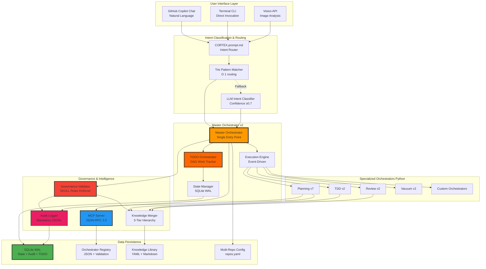
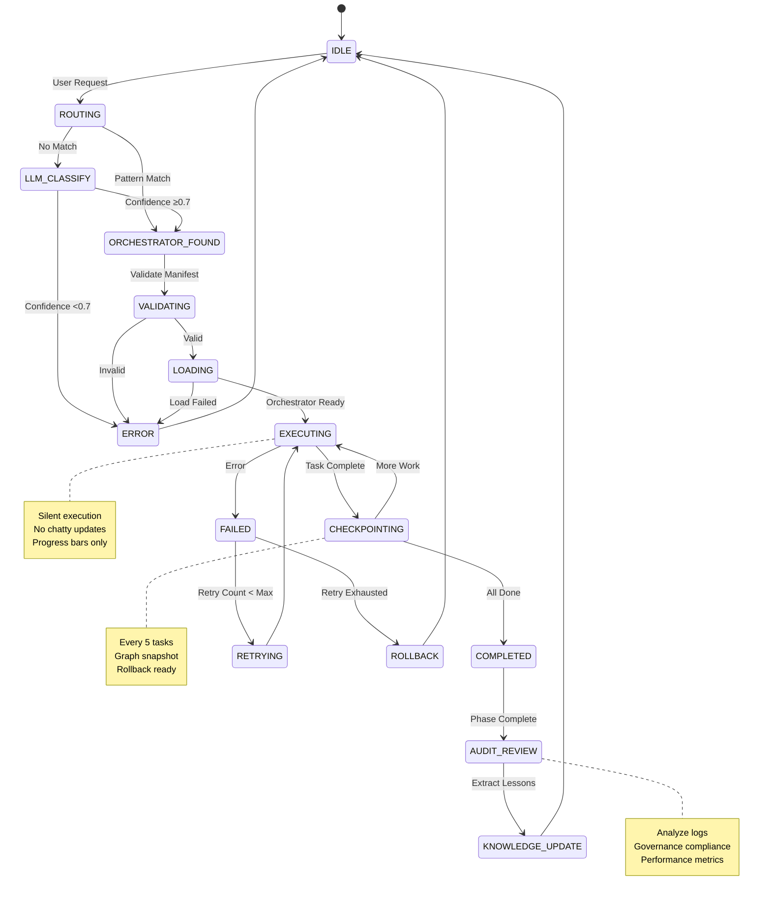
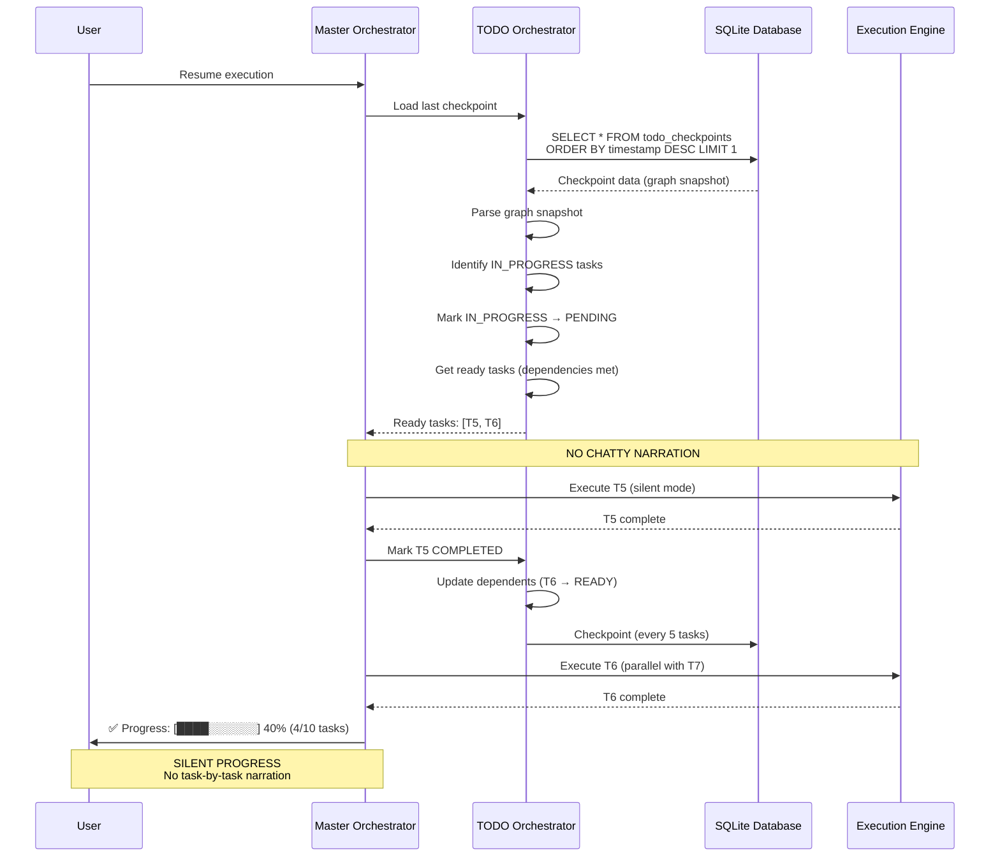
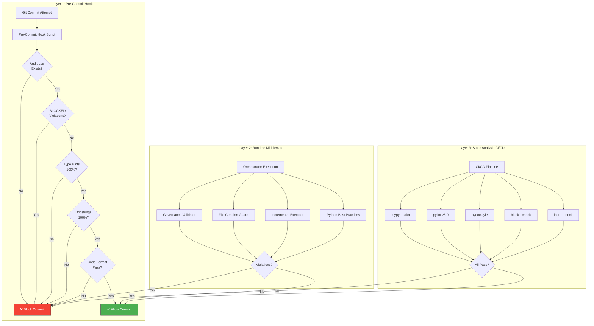
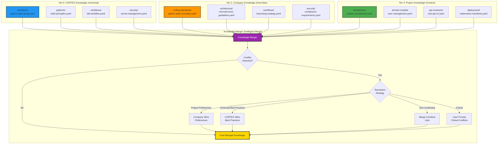
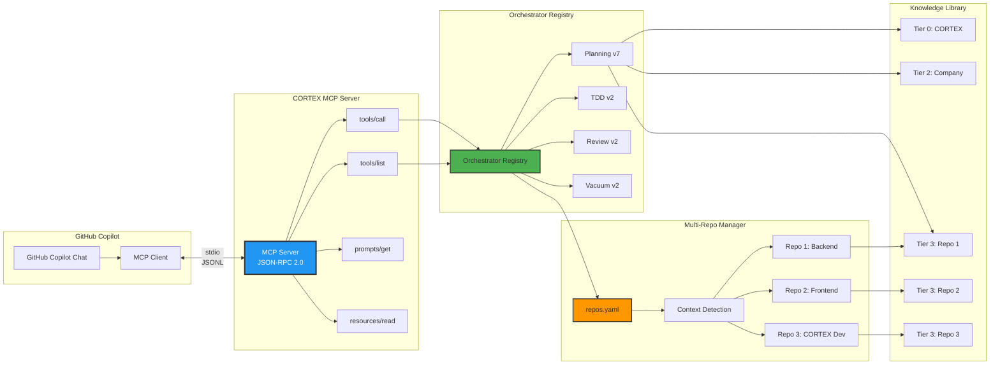
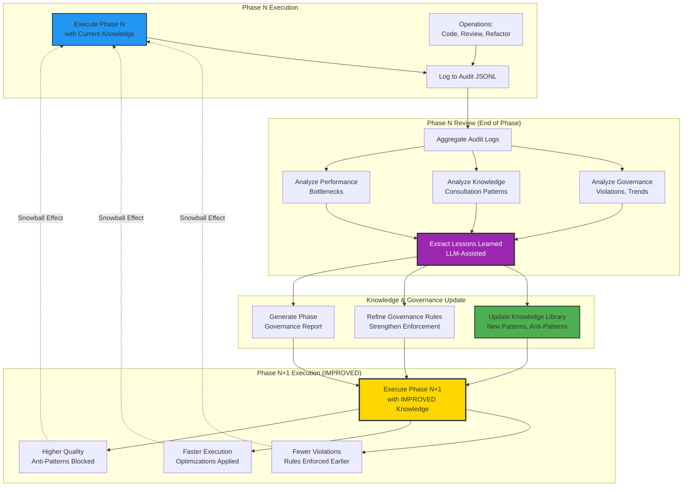
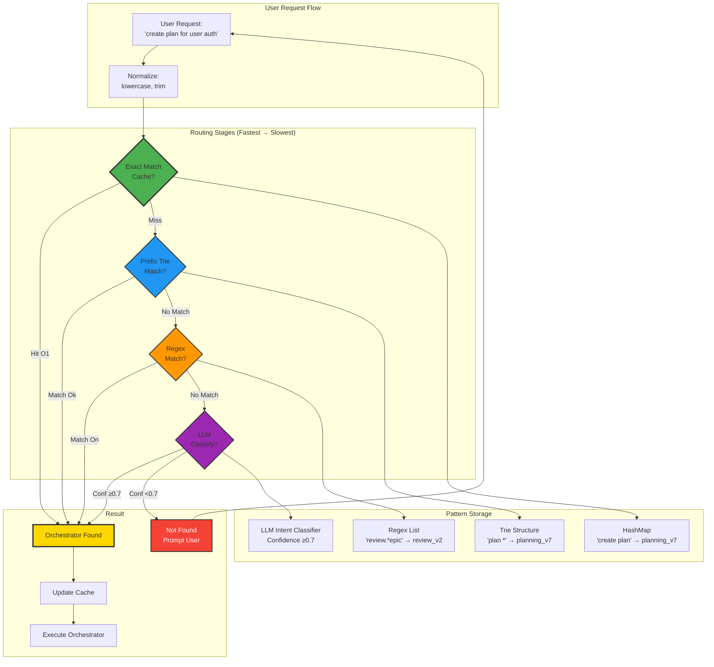
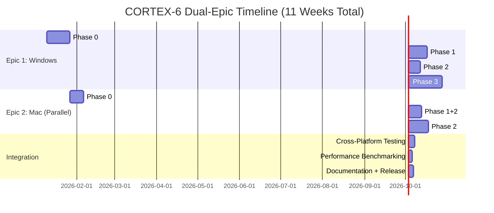

# CORTEX-6 Complete Architecture Diagrams
# Visual Reference for Holistic Master Plan
# Generated: 2026-01-07

## 1. System Architecture Overview

## 2. Master Orchestrator v2 State Machine

## 3. TODO Orchestrator DAG Structure

```mermaid
graph TD
    subgraph "TODO DAG Example: Planning Workflow"
        T1[Task 1: Initialize Plan<br/>STATUS: COMPLETED<br/>Duration: 5min]
        T2[Task 2: Load User Requirements<br/>STATUS: COMPLETED<br/>Duration: 3min]
        T3[Task 3: Validate Requirements<br/>STATUS: COMPLETED<br/>Duration: 10min]
        T4[Task 4: Create Phase Breakdown<br/>STATUS: IN_PROGRESS<br/>Duration: 15min]
        T5[Task 5: Dependency Analysis<br/>STATUS: READY<br/>Duration: 20min]
        T6[Task 6: Generate YAML Plans<br/>STATUS: READY<br/>Duration: 10min]
        T7[Task 7: Create Progress Tracker<br/>STATUS: PENDING<br/>Duration: 5min]
        T8[Task 8: Validate Plan Completeness<br/>STATUS: PENDING<br/>Duration: 10min]
        T9[Task 9: Generate Plan Viewer<br/>STATUS: BLOCKED<br/>Duration: 5min]
        T10[Task 10: Finalize Documentation<br/>STATUS: PENDING<br/>Duration: 10min]
    end
    
    T1 --> T2
    T2 --> T3
    T3 --> T4
    T3 --> T5
    T4 --> T6
    T5 --> T6
    T6 --> T7
    T6 --> T9
    T7 --> T8
    T8 --> T10
    T9 --> T10
    
    style T1 fill:#4CAF50,stroke:#333,stroke-width:2px
    style T2 fill:#4CAF50,stroke:#333,stroke-width:2px
    style T3 fill:#4CAF50,stroke:#333,stroke-width:2px
    style T4 fill:#FFC107,stroke:#333,stroke-width:2px
    style T5 fill:#2196F3,stroke:#333,stroke-width:2px
    style T6 fill:#2196F3,stroke:#333,stroke-width:2px
    style T7 fill:#E0E0E0,stroke:#333,stroke-width:1px
    style T8 fill:#E0E0E0,stroke:#333,stroke-width:1px
    style T9 fill:#9E9E9E,stroke:#333,stroke-width:1px
    style T10 fill:#E0E0E0,stroke:#333,stroke-width:1px
```

**Legend:**
- 🟢 Green (COMPLETED): Task finished successfully
- 🟡 Yellow (IN_PROGRESS): Currently executing
- 🔵 Blue (READY): Dependencies met, ready to execute
- ⚫ Gray (BLOCKED): Dependencies failed or incomplete
- ⚪ Light Gray (PENDING): Waiting for dependencies

## 4. Resume from Breakage Flow

## 5. Governance Enforcement Layers

## 6. Knowledge Merger 3-Tier Hierarchy

## 7. MCP Server Architecture (Multi-Repo Support)

## 8. Continuous Audit & Learning Loop (Snowball Effect)

## 9. Trie Pattern Router (O(1) Routing)

**Performance:**
- ✅ Cache Hit: <1ms (O(1))
- ✅ Trie Match: <5ms (O(k), k = input length)
- ⚠️ Regex Scan: <20ms (O(n), n = orchestrators)
- ⚠️ LLM Classify: <500ms (network latency)

## 10. Dual-Epic Implementation Strategy

**Key:**
- 📘 **Epic 1 (Windows)**: 8 weeks sequential (stability focus)
- 📗 **Epic 2 (Mac)**: 5 weeks parallel (optimization focus)
- 🔗 **Integration**: 2 weeks (merge + test + docs)
- 🎯 **Total**: 10-11 weeks to delivery

---

## Diagram Usage Guide

**For Planning:** Use diagrams 1-4 to understand system architecture  
**For Development:** Use diagrams 5-7 to implement governance & knowledge  
**For Operations:** Use diagrams 8-9 to monitor execution & performance  
**For Project Management:** Use diagram 10 to track epic progress

**All diagrams render in GitHub, VS Code, and Mermaid Live Editor.**
