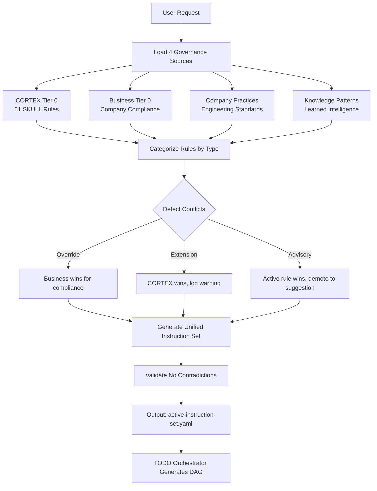

# CORTEX 6.0 Executive Overview

**Version:** 6.0.0 | **Date:** 2026-01-07 | **Author:** Asif Hussain  
**Status:** APPROVED | **Classification:** Strategic Documentation

---

## 🎯 What is CORTEX 6.0?

**CORTEX** (Cognitive Orchestration Runtime for Task Execution and eXpertise) is a **production-grade AI orchestration system** that transforms how GitHub Copilot executes complex, multi-step development workflows.

### Core Value Proposition

| Current State | CORTEX 6.0 State |
|---------------|------------------|
| Copilot executes single requests | Autonomous multi-phase execution |
| No work memory between sessions | Persistent brain with 4-tier memory |
| No governance enforcement | 4-category governance with business rules |
| Single repo context | Multi-repo orchestration via MCP |
| No dependency tracking | DAG-based TODO with smart scheduling |

---

## 🏆 Strategic Goals

### 1. Intelligent Governance Management
Merge **4 knowledge sources** into unified, actionable instructions:

```
┌─────────────────────────────────────────────────────────────────┐
│                    4-Category Governance                         │
├─────────────────────────────────────────────────────────────────┤
│  1. CORTEX Tier 0      - Universal rules (61 SKULL rules)       │
│  2. Business Tier 0    - Company compliance (HIPAA, SOX, etc.)  │
│  3. Company Practices  - Engineering standards                   │
│  4. Knowledge Patterns - Learned intelligence                    │
├─────────────────────────────────────────────────────────────────┤
│                    ↓ Merge Algorithm ↓                           │
├─────────────────────────────────────────────────────────────────┤
│  Output: Unified Instruction Set → Smart TODO Generation         │
└─────────────────────────────────────────────────────────────────┘
```

### 2. Multi-Repository Orchestration
Work across multiple repositories simultaneously:

- **MCP Server** (JSON-RPC 2.0) exposes CORTEX capabilities
- **Repo Registry** tracks repositories and their governance
- **Cross-Repo Operations** execute plans spanning multiple codebases

### 3. Intelligent Work Tracking
DAG-based TODO Orchestrator with smart dependencies:

- **Graph Structure** - Tasks as nodes, dependencies as edges
- **Parallel Execution** - Run independent tasks concurrently
- **Smart Scheduling** - Optimize execution order
- **Checkpoint/Resume** - Recover from interruptions

### 4. Production-Grade Reliability
Built for real-world enterprise use:

- **SQLite WAL** - Concurrent reads, atomic writes
- **Optimistic Locking** - Handle race conditions
- **Audit Logging** - Every operation tracked (runtime enforcement)
- **Rollback/Recovery** - Resume from any failure point

---

## 📊 Key Metrics & Success Criteria

| Category | Metric | Target |
|----------|--------|--------|
| **Performance** | Pattern routing latency | < 5ms (O(1)) |
| **Performance** | State persistence | < 100ms |
| **Performance** | Governance merge | < 50ms |
| **Reliability** | System uptime | 99.9% |
| **Reliability** | Data integrity | Zero corruption |
| **Testing** | Overall coverage | ≥ 80% |
| **Testing** | Core component coverage | ≥ 90% |
| **Scale** | Concurrent orchestrations | 10+ |
| **Scale** | DAG nodes supported | 1000+ |

---

## 🏗️ Architecture Overview

### 6-Layer Architecture

```
┌─────────────────────────────────────────────────────────────────┐
│  Layer 6: Presentation (GitHub Copilot, CLI, MCP Clients)       │
├─────────────────────────────────────────────────────────────────┤
│  Layer 5: API (MCP Server - JSON-RPC 2.0)                       │
├─────────────────────────────────────────────────────────────────┤
│  Layer 4: Orchestration (Master Orch, TODO Orch, 10+ Orchs)     │
├─────────────────────────────────────────────────────────────────┤
│  Layer 3: Governance (4-Category Merger, Audit Logger)          │
├─────────────────────────────────────────────────────────────────┤
│  Layer 2: State (State Manager, SQLite, Checkpoint Manager)     │
├─────────────────────────────────────────────────────────────────┤
│  Layer 1: Infrastructure (File I/O, MCP Transport, Logging)     │
└─────────────────────────────────────────────────────────────────┘
```

### Core Components (20 total)

| Component | Layer | Purpose |
|-----------|-------|---------|
| **MasterOrchestrator** | 4 | Entry point, routing, state machine |
| **TodoOrchestrator** | 4 | DAG-based work tracking |
| **StateManager** | 2 | SQLite persistence with WAL |
| **GovernanceMerger** | 3 | 4-category intelligent merging |
| **AuditLogger** | 3 | Runtime audit enforcement |
| **MCPServer** | 5 | JSON-RPC 2.0 API layer |
| **PatternRouter** | 4 | O(1) Trie-based routing |
| **PlanningOrchestrator** | 4 | Planning v5 workflows |
| **TDDOrchestrator** | 4 | RED→GREEN→REFACTOR |
| ... | ... | (10 more orchestrators) |

---

## 🔀 Governance Merge Flow

### How 4 Sources Become Unified Instructions



### Priority Resolution

| Source | Priority | Override Behavior |
|--------|----------|-------------------|
| **Business Tier 0** | 1 (Highest) | Wins for COMPLIANCE rules only |
| **CORTEX Tier 0** | 2 | Immutable for non-compliance |
| **Company Practices** | 3 | Extends, never contradicts |
| **Knowledge Patterns** | 4 (Lowest) | Advisory suggestions only |

---

## 📋 What Gets Built

### Directory Structure (Post-Build)

```
CORTEX-6/
├── cortex-brain/
│   ├── tier0/governance/         # 61 migrated SKULL rules
│   ├── tier1/                    # Active instruction set
│   ├── tier2/                    # Knowledge graph
│   ├── tier3/                    # Development context
│   └── database/cortex.db        # SQLite with WAL
│
├── src/
│   ├── main.py                   # Entry point
│   ├── orchestrators/
│   │   ├── core/                 # MasterOrch, TodoOrch, StateManager
│   │   ├── workflows/            # Planning, TDD, ADO, etc.
│   │   └── middleware/           # Audit, Resource Limits
│   └── mcp/
│       └── server.py             # JSON-RPC 2.0 MCP Server
│
├── tests/                        # Single test folder
│   ├── unit/                     # Unit tests (all components)
│   ├── integration/              # E2E and multi-repo tests
│   ├── performance/              # Benchmark tests
│   └── governance/               # Governance validation tests
│
└── repos.yaml                    # Multi-repo registry
```

### Deliverables by Phase

| Phase | Duration | Key Deliverables |
|-------|----------|------------------|
| 0. Foundation | 12 days | Governance merger, SKULL migration, test structure |
| 1. Core | 14 days | TODO orchestrator (DAG), State manager (SQLite) |
| 2. Resilience | 9 days | Trie router (O(1)), rollback, resource limits |
| 3. MCP & Multi-Repo | 14 days | MCP server, multi-repo manager, company plugins |
| 4. Polish | 25 days | Integration tests, edge cases, docs |

**Total Duration:** 74 days (10.5 weeks)

---

## 🚀 Implementation Approach

### Clean Slate Build (Recommended)

1. **Backup existing CORTEX** → `__backup/`
2. **Start with empty folder**
3. **GitHub Copilot executes build** via `02-COPILOT-BUILD-PROMPT.md`
4. **9-phase implementation** per machine-readable specs
5. **Validation gates** at each phase

### Why Clean Slate?

| Issue | Clean Slate Solution |
|-------|---------------------|
| Existing TodoManager conflicts with new DAG design | No legacy code to migrate |
| StateManager has no locking | SQLite WAL from day 1 |
| Tests spread across folders | Single tests/ folder structure |
| SKULL rules separate from governance | 4-category merger built-in |

---

## ⚠️ Critical Resolved Issues

All 5 critical issues from holistic review (2026-01-07) are resolved:

| ID | Issue | Resolution |
|----|-------|------------|
| CRITICAL-001 | TODO Orchestrator conflict | Single DAG-based design, no legacy |
| CRITICAL-002 | StateManager race conditions | SQLite WAL + optimistic locking |
| CRITICAL-003 | MCP vs Registry conflict | Adapter pattern (MCP wraps Registry) |
| CRITICAL-004 | Audit bypass via --no-verify | Runtime AuditContextManager |
| CRITICAL-005 | Knowledge merge underspecified | 6-step merge algorithm defined |

---

## 🎯 Who This Is For

### Primary Users
- **Asif Hussain** (Author) - Building and maintaining CORTEX
- **GitHub Copilot** - Executing orchestrated workflows
- **Enterprise Teams** - Using CORTEX for governed development

### Secondary Users
- **Companies** - Extending with Business Tier 0 governance
- **Developers** - Using MCP tools for multi-repo work
- **Auditors** - Reviewing governance compliance

---

## 📚 Next Steps

### For Humans
1. Read `human-readable/01-governance-framework.md` for governance deep-dive
2. Review `human-readable/02-architecture-overview.md` for system design
3. Study `human-readable/08-implementation-roadmap.md` for timeline

### For Machine Build
1. Run backup: `implementation-plan/01-BACKUP-MIGRATION.sh`
2. Open `02-COPILOT-BUILD-PROMPT.md` in GitHub Copilot
3. Execute build phases following machine-readable specs

---

## 📞 Document References

- **Master Spec:** `00-CORTEX6-MASTER-SOURCE-OF-TRUTH.yaml`
- **Build Prompt:** `02-COPILOT-BUILD-PROMPT.md`
- **Human Docs:** `human-readable/` (8 documents)
- **Machine Specs:** `machine-readable/` (8 documents)
- **Implementation:** `implementation-plan/` (4 documents)

---

**Copyright © 2025-2026 Asif Hussain. All rights reserved.**
