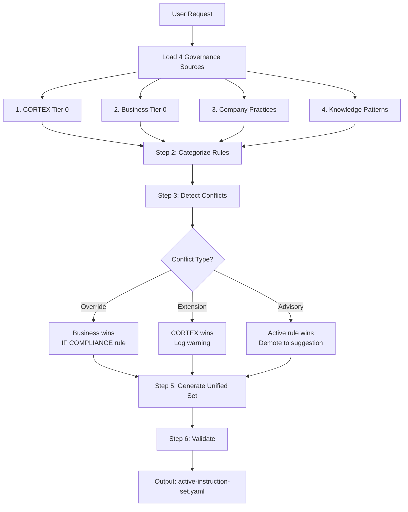

# 4-Category Governance Framework

**Version:** 6.0.0 | **Author:** Asif Hussain  
**Purpose:** Detailed explanation of how CORTEX merges 4 governance sources

---

## 📚 Overview

CORTEX uses a **4-Category Governance Model** that intelligently merges multiple sources of rules, best practices, and learned patterns into a **Unified Instruction Set**. This unified set drives TODO generation and orchestrator behavior.

### Why 4 Categories?

| Problem | Solution |
|---------|----------|
| CORTEX has universal rules (TDD, etc.) | Category 1: CORTEX Tier 0 |
| Companies have compliance requirements | Category 2: Business Tier 0 |
| Teams have engineering standards | Category 3: Company Best Practices |
| Past experience provides wisdom | Category 4: Knowledge Best Practices |

---

## 🏛️ The 4 Categories

### Category 1: CORTEX Tier 0 (Core Brain Protection)

**Purpose:** Universal rules that apply to ALL CORTEX operations, regardless of company or domain.

**Location:** `cortex-brain/tier0/governance/core-rules.yaml`

**Characteristics:**
- **Immutable** - These rules never change based on context
- **Override NOT allowed** - Business rules cannot bypass these (except compliance)
- **61 rules** - Migrated from legacy SKULL (brain-protection-rules.yaml)

**Key Rule Types:**

| Rule Type | Description | Example |
|-----------|-------------|---------|
| TDD_ENFORCEMENT | Tests must fail before implementation | Write test → See fail → Implement |
| HOLISTIC_DISCOVERY | Search before creating files | Grep workspace before `create_file` |
| PLANNING_ISOLATION | Plans create structure, never implement | `plan X` creates folders, not code |
| AUDIT_LOGGING | All operations must be logged | Every orchestrator call → audit_log |
| GIT_ISOLATION | CORTEX code never commits to user repos | Separate brain from user codebase |
| INCREMENTAL_EXECUTION | Operations split into <500 line increments | Prevent context overflow |

**Example Rule:**
```yaml
- id: CORE-001
  name: TDD_ENFORCEMENT
  severity: BLOCKED  # Violations halt execution
  description: Tests must fail before implementation begins
  enforcement:
    type: runtime
    check: test_exists_and_failing
  override_allowed: false
```

---

### Category 2: Business Tier 0 (Company Governance)

**Purpose:** Company-specific governance enforcing business compliance, industry regulations, and organizational policies.

**Location:** `{repo}/.cortex/governance/business-tier0.yaml`

**Characteristics:**
- **Override CORTEX** - For compliance-related conflicts ONLY
- **Company-isolated** - Company ABC rules never mix with Company XYZ
- **Domain plugins** - Finance, Healthcare, Retail have unique constraints

**Key Rule Types:**

| Rule Type | Can Override CORTEX? | Rationale |
|-----------|---------------------|-----------|
| COMPLIANCE_RULES | ✅ Yes | HIPAA, PCI-DSS, SOX, GDPR win |
| SECURITY_POLICIES | ❌ No | Augments CORTEX security |
| DOMAIN_RULES | ✅ Yes | Industry-specific requirements |
| APPROVAL_WORKFLOWS | ❌ No | Adds gates, doesn't bypass |

**Example - Healthcare Company:**
```yaml
business_tier0:
  company: "HealthCorp"
  domains:
    - name: "Patient Records"
      compliance:
        - type: HIPAA
          rules:
            - PHI_must_be_encrypted_at_rest
            - audit_trail_required_for_all_access
            - minimum_necessary_access_principle
```

**Company Isolation Principle:**
```
┌─────────────────────────────────────┐
│       CORTEX Brain (Shared)         │
├─────────────────────────────────────┤
│  Company ABC    │    Company XYZ    │
│  Brain Partition│    Brain Partition│
│  - Finance      │    - Retail       │
│  - HSA/FSA      │    - Inventory    │
│  - Commuter     │    - POS          │
└─────────────────────────────────────┘
Cross-company learning DISABLED by default
```

---

### Category 3: Company Best Practices

**Purpose:** Company-specific engineering standards, coding conventions, and architectural patterns.

**Location:** `{repo}/.cortex/best-practices/`

**Characteristics:**
- **Extends CORTEX** - Never contradicts, only augments
- **Company preferences** - Layer on top of CORTEX defaults
- **Can tighten, not loosen** - E.g., 90% coverage (not 70%)

**Key Rule Types:**

| Rule Type | Example | Override Behavior |
|-----------|---------|-------------------|
| CODING_STANDARDS | 100 char line limit | Extends CORTEX default |
| ARCHITECTURE_PATTERNS | Microservices required | Company preference |
| TESTING_STANDARDS | 95% coverage | Tighter than CORTEX 80% |
| DOCUMENTATION_STANDARDS | JSDoc required | Company preference |

**Example:**
```yaml
company_best_practices:
  company: "TechCorp"
  
  coding_standards:
    line_length: 100
    naming_convention: snake_case
    imports_sorted: true
    
  testing_standards:
    coverage_minimum: 95  # Tighter than CORTEX 80%
    test_naming: "test_{method}_{scenario}_{expected}"
    
  architecture_patterns:
    preferred: microservices
    service_size_limit: 5000_lines
```

---

### Category 4: Knowledge Best Practices

**Purpose:** Patterns learned from execution history, lessons learned, and accumulated intelligence.

**Location:** `cortex-brain/tier2/knowledge-graph/`

**Characteristics:**
- **Advisory only** - Suggestions, not mandates
- **Adaptive** - Evolves based on successes and failures
- **Lowest priority** - Active rules always win over advice

**Key Rule Types:**

| Rule Type | Example | Usage |
|-----------|---------|-------|
| LEARNED_PATTERNS | "OAuth2 needs refresh token logic" | Inject into context |
| LESSONS_LEARNED | "Don't use eval() - security risk" | Warning to developer |
| DOMAIN_EXPERTISE | "Finance modules need decimal precision" | Contextual recommendation |
| PERFORMANCE_INSIGHTS | "Cache database queries > 100ms" | Optimization suggestion |

**Example:**
```yaml
knowledge_patterns:
  - pattern_id: "OAUTH2_REFRESH"
    success_rate: 92%
    learned_from: 47 executions
    recommendation: |
      When implementing OAuth2, always include:
      1. Refresh token rotation
      2. Token expiry handling
      3. Secure token storage
    applies_to: ["authentication", "security", "api"]
```

---

## 🔀 The Merge Algorithm

### How 4 Sources Become Unified Instructions



### 6-Step Merge Process

**Step 1: Load All Sources**
```python
def load_sources(repo_path: Path = None) -> dict:
    sources = {
        "cortex_tier0": load_yaml("cortex-brain/tier0/governance/core-rules.yaml"),
        "business_tier0": load_yaml(repo_path / ".cortex/governance/business-tier0.yaml") if repo_path else {},
        "company_practices": load_yaml(repo_path / ".cortex/best-practices/") if repo_path else {},
        "knowledge_patterns": load_yaml("cortex-brain/tier2/knowledge-graph/patterns.yaml")
    }
    return sources
```

**Step 2: Categorize Rules by Type**
```python
def categorize_rules(sources: dict) -> list[CategorizedRule]:
    rules = []
    for source_name, source_rules in sources.items():
        for rule in source_rules:
            rules.append(CategorizedRule(
                rule=rule,
                source=source_name,
                rule_type=classify_rule_type(rule),  # COMPLIANCE, SECURITY, ENGINEERING, ADVISORY
                potential_conflicts=[]
            ))
    return rules
```

**Step 3: Detect Conflicts**
```python
def detect_conflicts(rules: list[CategorizedRule]) -> list[Conflict]:
    conflicts = []
    for i, rule_a in enumerate(rules):
        for rule_b in rules[i+1:]:
            if rule_a.source != rule_b.source:
                if contradicts(rule_a, rule_b):
                    conflicts.append(Conflict(
                        rule_a=rule_a,
                        rule_b=rule_b,
                        conflict_type=determine_conflict_type(rule_a, rule_b)
                    ))
    return conflicts
```

**Step 4: Resolve Conflicts**

| Conflict Type | Resolution | Winner |
|---------------|------------|--------|
| **Override (Business vs CORTEX)** | Business wins IF rule_type == COMPLIANCE | Business Tier 0 |
| **Override (Business vs CORTEX)** | CORTEX wins IF rule_type != COMPLIANCE | CORTEX Tier 0 |
| **Extension (Company vs CORTEX)** | CORTEX wins, log warning | CORTEX Tier 0 |
| **Advisory (Knowledge vs any)** | Active rule wins, demote knowledge | Existing Rule |

```python
def resolve_conflicts(conflicts: list[Conflict]) -> list[Resolution]:
    resolutions = []
    for conflict in conflicts:
        if conflict.type == "OVERRIDE":
            if conflict.rule_a.rule_type == "COMPLIANCE" and conflict.rule_a.source == "business_tier0":
                winner = conflict.rule_a
            else:
                winner = conflict.rule_b if conflict.rule_b.source == "cortex_tier0" else conflict.rule_a
        elif conflict.type == "EXTENSION":
            winner = [r for r in [conflict.rule_a, conflict.rule_b] if r.source == "cortex_tier0"][0]
            log_warning(f"Company practice conflicts with CORTEX: {conflict}")
        elif conflict.type == "ADVISORY":
            winner = [r for r in [conflict.rule_a, conflict.rule_b] if r.source != "knowledge_patterns"][0]
            demote_to_suggestion(conflict.rule_a if conflict.rule_a.source == "knowledge_patterns" else conflict.rule_b)
        
        resolutions.append(Resolution(conflict=conflict, winner=winner))
    return resolutions
```

**Step 5: Generate Unified Instruction Set**
```python
def generate_unified_set(resolved_rules: list[Rule]) -> UnifiedInstructionSet:
    return UnifiedInstructionSet(
        mandatory_rules=[r for r in resolved_rules if r.severity == "BLOCKED"],
        recommended_rules=[r for r in resolved_rules if r.severity in ["HIGH", "MEDIUM"]],
        advisory_patterns=[r for r in resolved_rules if r.source == "knowledge_patterns"],
        todo_generation_rules=extract_todo_rules(resolved_rules)
    )
```

**Step 6: Validate**
```python
def validate(unified_set: UnifiedInstructionSet) -> ValidationResult:
    checks = [
        no_circular_dependencies(unified_set.mandatory_rules),
        all_have_enforcement(unified_set.mandatory_rules),
        no_blocked_contradictions(unified_set.mandatory_rules),
        parseable_by_todo_orchestrator(unified_set)
    ]
    return ValidationResult(passed=all(checks), details=checks)
```

---

## 📊 Priority Matrix

| Priority | Source | Override Behavior | Use Case |
|----------|--------|-------------------|----------|
| **1** (Highest) | Business Tier 0 | Wins for COMPLIANCE only | HIPAA, SOX, GDPR |
| **2** | CORTEX Tier 0 | Immutable for non-compliance | TDD, Audit, Planning |
| **3** | Company Practices | Extends, never contradicts | Coding standards |
| **4** (Lowest) | Knowledge Patterns | Advisory only | Learned wisdom |

---

## 🎯 Output: Unified Instruction Set

**Location:** `cortex-brain/tier1/active-instruction-set.yaml`

**Structure:**
```yaml
unified_instruction_set:
  generated_at: "2026-01-07T10:30:00Z"
  context:
    repo: "company-abc/project-x"
    domains: ["finance", "compliance"]
  
  mandatory_rules:
    - id: CORE-001 (TDD_ENFORCEMENT)
      severity: BLOCKED
      enforcement: runtime
    - id: BIZ-042 (SOX_AUDIT_TRAIL)
      severity: BLOCKED
      enforcement: runtime
      source: business_tier0  # Compliance override
  
  recommended_rules:
    - id: CORE-015 (CODE_REVIEW_REQUIRED)
      severity: HIGH
    - id: COMPANY-003 (95_PERCENT_COVERAGE)
      severity: MEDIUM
  
  advisory_patterns:
    - id: KNOW-127 (DECIMAL_FOR_FINANCE)
      recommendation: "Use Decimal, not float, for financial calculations"
      success_rate: 94%
  
  todo_generation_rules:
    dependency_ordering: topological_sort
    parallel_opportunities: true
    checkpoint_interval: 5
    rollback_triggers: ["test_failure", "lint_error"]
```

---

## 🔄 From Unified Set to TODOs

The TODO Orchestrator uses the Unified Instruction Set to generate a DAG:

```
Unified Instruction Set
        │
        ▼
┌───────────────────────────────────────┐
│         TODO Orchestrator             │
├───────────────────────────────────────┤
│ 1. Parse mandatory rules              │
│ 2. Create enforcement TODOs           │
│ 3. Apply recommended rules            │
│ 4. Inject advisory patterns           │
│ 5. Build DAG with dependencies        │
│ 6. Validate no circular deps          │
│ 7. Identify parallel opportunities    │
└───────────────────────────────────────┘
        │
        ▼
    TODO DAG (ready for execution)
```

---

## 📋 Examples

### Example 1: Healthcare Company Planning OAuth2

**User Request:** `plan OAuth2 for patient portal`

**Governance Sources Loaded:**
1. **CORTEX Tier 0:** TDD_ENFORCEMENT, HOLISTIC_DISCOVERY, PLANNING_ISOLATION
2. **Business Tier 0:** HIPAA_PHI_ENCRYPTION, HIPAA_AUDIT_TRAIL
3. **Company Practices:** 95% coverage, microservices architecture
4. **Knowledge Patterns:** OAuth2 refresh token pattern

**Conflict Detection:**
- No conflicts (HIPAA augments, doesn't contradict)

**Unified Instruction Set:**
```yaml
mandatory_rules:
  - CORE-001 (TDD_ENFORCEMENT)
  - CORE-002 (HOLISTIC_DISCOVERY)
  - BIZ-HIPAA-001 (PHI_ENCRYPTION)
  - BIZ-HIPAA-002 (AUDIT_TRAIL)

recommended_rules:
  - COMPANY-001 (95_PERCENT_COVERAGE)
  - COMPANY-002 (MICROSERVICES)

advisory_patterns:
  - KNOW-042 (OAUTH2_REFRESH_TOKEN)
```

**Generated TODO DAG:**
```
[TODO-001: Write OAuth2 tests (failing)] ──┐
                                           ├──► [TODO-003: Implement OAuth2]
[TODO-002: Verify HIPAA encryption] ───────┘
                                               │
                                               ▼
                                  [TODO-004: Implement audit logging]
                                               │
                                               ▼
                                  [TODO-005: Run tests (pass)]
```

### Example 2: Finance Company with SOX Override

**User Request:** `plan general ledger module`

**Conflict Detected:**
- CORTEX: "Audit logs can be async"
- Business SOX: "Audit logs MUST be synchronous for compliance"

**Resolution:**
- Business Tier 0 wins (COMPLIANCE rule type)
- Unified set uses synchronous audit logging

---

## 📚 Related Documents

- **Master Spec:** `00-CORTEX6-MASTER-SOURCE-OF-TRUTH.yaml`
- **Architecture:** `02-architecture-overview.md`
- **Governance Rules YAML:** `machine-readable/05-governance-rules.yaml`

---

**Copyright © 2025-2026 Asif Hussain. All rights reserved.**
