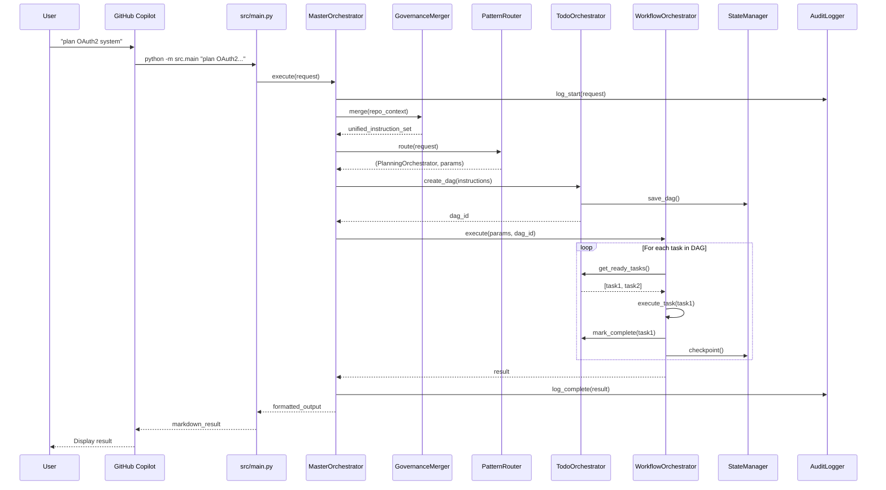
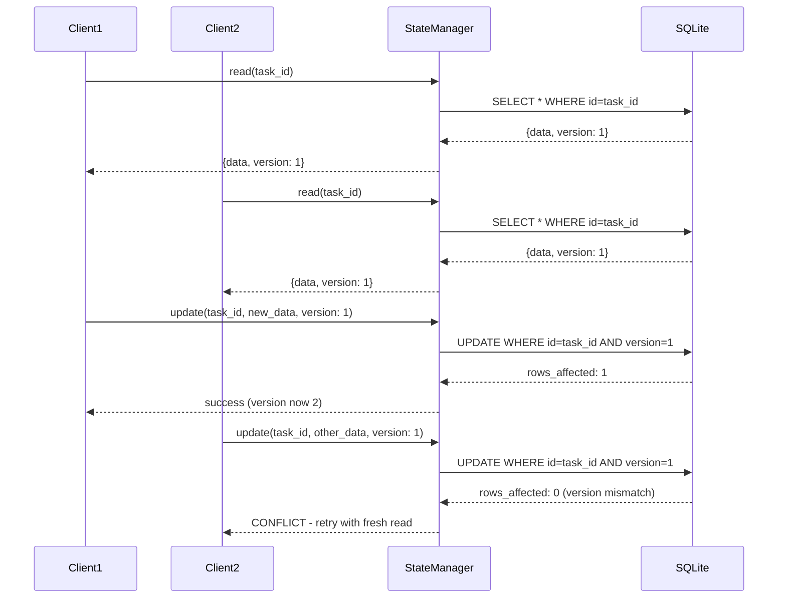
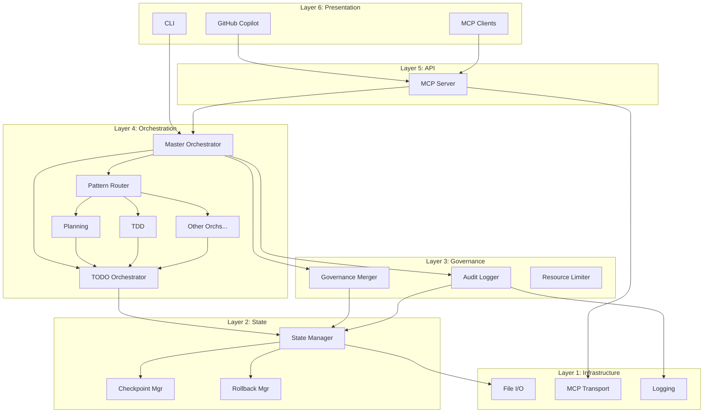

# System Architecture Overview

**Version:** 6.0.0 | **Author:** Asif Hussain  
**Purpose:** Complete system architecture with visual diagrams

---

## 🏗️ 6-Layer Architecture

CORTEX 6.0 uses a clean 6-layer architecture separating concerns from infrastructure to presentation.

```
┌─────────────────────────────────────────────────────────────────────────────┐
│ LAYER 6: PRESENTATION                                                        │
│ ┌─────────────────┐  ┌─────────────────┐  ┌─────────────────┐               │
│ │ GitHub Copilot  │  │      CLI        │  │   MCP Clients   │               │
│ │ (Terminal Proxy)│  │ (python -m src) │  │ (VS Code, etc)  │               │
│ └────────┬────────┘  └────────┬────────┘  └────────┬────────┘               │
└──────────┼────────────────────┼────────────────────┼────────────────────────┘
           │                    │                    │
           ▼                    ▼                    ▼
┌─────────────────────────────────────────────────────────────────────────────┐
│ LAYER 5: API                                                                 │
│ ┌───────────────────────────────────────────────────────────────────────┐   │
│ │                      MCP Server (JSON-RPC 2.0)                         │   │
│ │  cortex.plan() │ cortex.todo() │ cortex.governance() │ cortex.execute()│   │
│ └───────────────────────────────────────────────────────────────────────┘   │
└─────────────────────────────────────┬───────────────────────────────────────┘
                                      │
                                      ▼
┌─────────────────────────────────────────────────────────────────────────────┐
│ LAYER 4: ORCHESTRATION                                                       │
│ ┌─────────────┐ ┌──────────────┐ ┌─────────────┐ ┌────────────────────────┐ │
│ │   Master    │ │    TODO      │ │   Pattern   │ │  Workflow Orchestrators │ │
│ │ Orchestrator│ │ Orchestrator │ │   Router    │ │  Planning, TDD, ADO... │ │
│ │  (Entry)    │ │   (DAG)      │ │  (O(1))     │ │      (10+ orchs)       │ │
│ └──────┬──────┘ └──────┬───────┘ └──────┬──────┘ └───────────┬────────────┘ │
└────────┼───────────────┼────────────────┼────────────────────┼──────────────┘
         │               │                │                    │
         ▼               ▼                ▼                    ▼
┌─────────────────────────────────────────────────────────────────────────────┐
│ LAYER 3: GOVERNANCE                                                          │
│ ┌──────────────────────┐  ┌──────────────────┐  ┌─────────────────────────┐ │
│ │   Governance Merger  │  │   Audit Logger   │  │   Resource Limiter      │ │
│ │   (4-Category)       │  │   (Runtime)      │  │   (Quotas)              │ │
│ └──────────┬───────────┘  └────────┬─────────┘  └───────────┬─────────────┘ │
└────────────┼───────────────────────┼────────────────────────┼───────────────┘
             │                       │                        │
             ▼                       ▼                        ▼
┌─────────────────────────────────────────────────────────────────────────────┐
│ LAYER 2: STATE                                                               │
│ ┌──────────────────────┐  ┌──────────────────┐  ┌─────────────────────────┐ │
│ │    State Manager     │  │ Checkpoint Mgr   │  │   Rollback Manager      │ │
│ │  (SQLite + WAL)      │  │  (Resume)        │  │   (Recovery)            │ │
│ └──────────┬───────────┘  └────────┬─────────┘  └───────────┬─────────────┘ │
└────────────┼───────────────────────┼────────────────────────┼───────────────┘
             │                       │                        │
             ▼                       ▼                        ▼
┌─────────────────────────────────────────────────────────────────────────────┐
│ LAYER 1: INFRASTRUCTURE                                                      │
│ ┌──────────────────────┐  ┌──────────────────┐  ┌─────────────────────────┐ │
│ │   File I/O (pathlib) │  │   MCP Transport  │  │   Structured Logging    │ │
│ │   Cross-Platform     │  │   (stdio/http)   │  │   (JSON format)         │ │
│ └──────────────────────┘  └──────────────────┘  └─────────────────────────┘ │
└─────────────────────────────────────────────────────────────────────────────┘
```

---

## 🧩 Core Components

### 20 Components Organized by Layer

| Layer | Component | Purpose |
|-------|-----------|---------|
| **5** | MCPServer | JSON-RPC 2.0 API for external clients |
| **4** | MasterOrchestrator | Entry point, routing, state machine |
| **4** | TodoOrchestrator | DAG-based work tracking |
| **4** | PatternRouter | O(1) Trie-based pattern matching |
| **4** | PlanningOrchestrator | Planning v5 workflows |
| **4** | TDDOrchestrator | RED→GREEN→REFACTOR cycles |
| **4** | ADOOrchestrator | Azure DevOps work items |
| **4** | VacuumOrchestrator | Deep filesystem cleanup |
| **4** | CleanupOrchestrator | Selective cleanup modes |
| **4** | InvestigationOrchestrator | Root cause analysis |
| **4** | SanitizationOrchestrator | PII/secret removal |
| **4** | DebugOrchestrator | Bug fixing workflows |
| **4** | RefinementOrchestrator | Code improvement |
| **4** | MaintenanceOrchestrator | 12-phase health check |
| **3** | GovernanceMerger | 4-category intelligent merging |
| **3** | AuditLogger | Runtime audit enforcement |
| **3** | ResourceLimiter | Quotas and limits |
| **2** | StateManager | SQLite persistence with WAL |
| **2** | CheckpointManager | Resume from interruptions |
| **2** | RollbackManager | Recovery from failures |

---

## 🔀 Request Flow

### Complete Request Lifecycle



---

## 🗄️ Data Architecture

### 4-Tier Brain Structure

```
cortex-brain/
├── tier0/                          # GOVERNANCE (read-mostly)
│   └── governance/
│       ├── core-rules.yaml         # 61 SKULL rules (migrated)
│       └── rule-schema.yaml        # Rule definition schema
│
├── tier1/                          # WORKING MEMORY (read-write)
│   ├── active-instruction-set.yaml # Current merged governance
│   ├── active-context.json         # Current execution context
│   └── conversation-state.jsonl    # Conversation history
│
├── tier2/                          # KNOWLEDGE GRAPH (read-mostly, write-sometimes)
│   └── knowledge-graph/
│       ├── patterns.yaml           # Learned patterns
│       ├── lessons-learned.yaml    # Failures to avoid
│       └── domain-expertise.yaml   # Domain-specific knowledge
│
├── tier3/                          # DEVELOPMENT CONTEXT (read-write)
│   └── dev-context/
│       ├── current-plan.yaml       # Active plan being executed
│       └── execution-history.jsonl # Historical executions
│
└── database/
    └── cortex.db                   # SQLite (WAL mode)
```

### SQLite Schema (14 Tables)

```sql
-- Core tables
tasks              -- DAG nodes (id, title, status, dependencies, version)
task_edges         -- DAG edges (source_id, target_id)
governance_rules   -- Merged rules (id, source, type, content, priority)
audit_log          -- Audit trail (timestamp, operation, orchestrator, result)
checkpoints        -- Resume points (id, orchestrator, state, created_at)

-- State tables
execution_state    -- Current execution (id, orchestrator, phase, progress)
orchestrator_registry -- Available orchestrators (name, patterns, mode)

-- Multi-repo tables
repositories       -- Repo registry (name, path, governance_location)
company_brains     -- Company partitions (company_id, brain_path)
domain_plugins     -- Domain plugins (company_id, domain, config)

-- Knowledge tables
learned_patterns   -- Success patterns (pattern_id, success_rate, content)
lessons_learned    -- Failure avoidance (lesson_id, severity, content)

-- Performance tables
performance_metrics -- SLA tracking (metric, value, timestamp)
cache_entries      -- Hot data cache (key, value, expires_at)
```

---

## 🌐 Multi-Repository Architecture

### MCP-Based Cross-Repo Operations

```
┌─────────────────────────────────────────────────────────────────┐
│                        CORTEX Repository                         │
│  ┌─────────────────────────────────────────────────────────┐    │
│  │                    MCP Server                            │    │
│  │  JSON-RPC 2.0  │  Port 5000  │  Tools: cortex.*          │    │
│  └─────────────────────────────────────────────────────────┘    │
│                              │                                   │
│                              ▼                                   │
│  ┌─────────────────────────────────────────────────────────┐    │
│  │                 Multi-Repo Manager                       │    │
│  │  repos.yaml  │  Path resolution  │  Context switching    │    │
│  └─────────────────────────────────────────────────────────┘    │
└────────────────────────────────┬────────────────────────────────┘
                                 │
        ┌────────────────────────┼────────────────────────┐
        │                        │                        │
        ▼                        ▼                        ▼
┌───────────────────┐  ┌───────────────────┐  ┌───────────────────┐
│   Repo A          │  │   Repo B          │  │   Repo C          │
│   (Company ABC)   │  │   (Company XYZ)   │  │   (Personal)      │
│                   │  │                   │  │                   │
│ .cortex/          │  │ .cortex/          │  │ (No governance)   │
│ ├─ governance/    │  │ ├─ governance/    │  │                   │
│ │  └─ business-   │  │ │  └─ business-   │  │                   │
│ │     tier0.yaml  │  │ │     tier0.yaml  │  │                   │
│ └─ best-practices/│  │ └─ best-practices/│  │                   │
└───────────────────┘  └───────────────────┘  └───────────────────┘
```

### repos.yaml Structure

```yaml
repositories:
  - name: "CORTEX"
    path: "/Users/asif/PROJECTS/CORTEX"
    type: "cortex-core"
    governance: null  # Uses built-in CORTEX Tier 0
    
  - name: "company-abc-main"
    path: "/Users/asif/PROJECTS/company-abc"
    type: "user-repo"
    governance:
      business_tier0: ".cortex/governance/business-tier0.yaml"
      best_practices: ".cortex/best-practices/"
    company: "Company ABC"
    domains: ["finance", "hsa-fsa", "commuter"]
    
  - name: "personal-project"
    path: "/Users/asif/PROJECTS/personal"
    type: "user-repo"
    governance: null  # CORTEX Tier 0 only
```

---

## ⚡ Performance Architecture

### O(1) Pattern Routing via Trie

```
Pattern Trie Structure:

                    ROOT
                     │
        ┌────────────┼────────────┐
        ▼            ▼            ▼
       [p]          [t]          [a]
        │            │            │
        ▼            ▼            ▼
      [l]          [d]          [d]
        │            │            │
        ▼            ▼            ▼
      [a]          [d]          [o]
        │            │            │
        ▼            ▼            ▼
      [n]          → TDD         │
        │                        ▼
        ▼                       → ADO
   → Planning

Lookup: O(k) where k = pattern length (constant, ~5-10 chars)
Effectively O(1) for routing decisions
```

### Performance Targets

| Metric | Target | Implementation |
|--------|--------|----------------|
| Pattern routing | < 5ms | Trie-based router |
| State persistence | < 100ms | SQLite WAL |
| Governance merge | < 50ms | In-memory with cache |
| DAG operations | < 10ms | Graph algorithms |
| MCP response | < 200ms | Async JSON-RPC |

---

## 🔒 Security Architecture

### Audit Enforcement (Runtime)

```python
class AuditContextManager:
    """Cannot be bypassed - wraps all operations."""
    
    def __enter__(self):
        self.start_time = time.time()
        self._log_start()
        return self
    
    def __exit__(self, exc_type, exc_val, exc_tb):
        self._log_end(exc_type)
        return False  # Don't suppress exceptions
    
    def _log_start(self):
        # Mandatory - logs to audit_log table
        pass
    
    def _log_end(self, exc_type):
        # Mandatory - logs completion or failure
        pass

# Usage (enforced by MasterOrchestrator):
with AuditContextManager(operation="plan", user="asif") as audit:
    result = planning_orchestrator.execute(request)
```

### Governance Enforcement

```
┌─────────────────────────────────────────────────────────────────┐
│                     ENFORCEMENT LAYERS                           │
├─────────────────────────────────────────────────────────────────┤
│ 1. Runtime Enforcement (CANNOT BYPASS)                          │
│    └─ AuditContextManager wraps ALL operations                  │
├─────────────────────────────────────────────────────────────────┤
│ 2. Pre-Commit Hooks (CAN BYPASS with --no-verify)               │
│    └─ Additional validation before git commit                    │
├─────────────────────────────────────────────────────────────────┤
│ 3. Phase Gates (CANNOT BYPASS)                                  │
│    └─ Validation required to advance phases                      │
├─────────────────────────────────────────────────────────────────┤
│ 4. State Validation (CANNOT BYPASS)                             │
│    └─ Database constraints + version checking                    │
└─────────────────────────────────────────────────────────────────┘
```

---

## 🔄 State Management

### Optimistic Locking Flow



### Checkpoint/Resume

```python
# Checkpoint on every 5th task completion
if completed_tasks % 5 == 0:
    checkpoint_manager.save(
        orchestrator=self.name,
        state={
            "dag_id": dag_id,
            "completed_tasks": completed_ids,
            "current_phase": phase,
            "context": execution_context
        }
    )

# Resume from checkpoint
def resume(orchestrator_name: str):
    checkpoint = checkpoint_manager.latest(orchestrator_name)
    if checkpoint:
        return orchestrator.continue_from(checkpoint.state)
```

---

## 📊 Component Interaction Diagram



---

## 📚 Related Documents

- **Governance:** `01-governance-framework.md`
- **Component Catalog:** `03-component-catalog.md`
- **Multi-Repo Strategy:** `04-multi-repo-strategy.md`
- **Database Schema:** `machine-readable/03-database-schema.sql`

---

**Copyright © 2025-2026 Asif Hussain. All rights reserved.**
