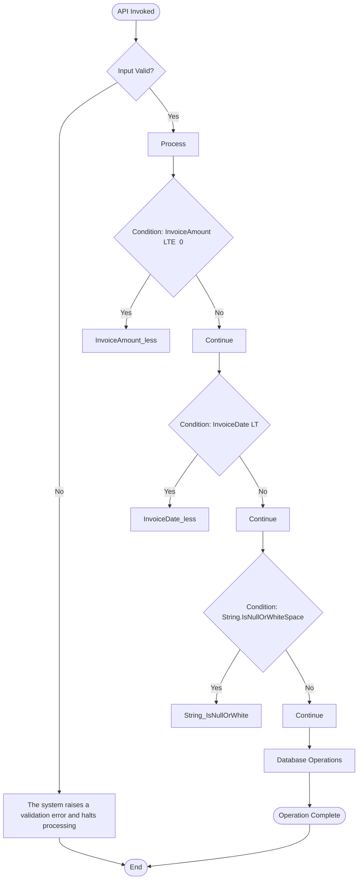

# RA API Specification - XGenerateFundingInvoice

**Generated by:** CORTEX Lens v3.0  
**Author:** Asif Hussain | **GitHub:** github.com/asifhussain60/CORTEX

---

**API Name:** XGenerateFundingInvoice  
**Operation:** XGenerateFundingInvoice  
**Legacy Location:** `Platform.Classic\Segment4\HETransactions\XGenerateFundingInvoice.cs`  
**Version:** 1.0  
**Status:** Draft  
**Generated:** 2025-12-15

---

## 📊 Executive Summary

**API Purpose:** Generate Funding Invoice operation designed to manage Reimbursement Account (RA) funding processes

**User Stories:**

**Primary Story:**
> As a **Finance Team Member**, I want to **generate funding invoice**, so that **ensure accurate and timely reimbursement processing**.

**Supporting Stories:**
> As a **Operations Manager**, I want to **control timing of operations**, so that **processes execute at the right time**.
> As a **Data Quality Manager**, I want to **validate all inputs**, so that **system integrity is maintained**.
> As a **Finance Controller**, I want to **validate financial amounts**, so that **transactions are accurate**.

**Primary Interface:**
- **Method:** `Execute(None)`
- **Returns:** `void`
- **Entry Point:** Line 19

**Business Logic Complexity:**
- 10 business rules extracted
- 3 validation checks
- 1 database operations
- 9 external dependencies

**Key Capabilities:**
- InvoiceAmount <= 0
- InvoiceDate < DateTime.Today
- String.IsNullOrWhiteSpace(SubaccountId

**Modernization Readiness:**
- Layer Classification: 1 distinct layers detected
- Traceability: 10 mappings to modern architecture
- Validation Coverage: Medium


---

## 📋 Document Overview

**Purpose:** Define business logic and behavior for XGenerateFundingInvoice in plain English for PM/BA validation

**Audience:** Product Managers, Business Analysts, QA, Developers

**Traceability:** All rules reference legacy code line numbers for verification

**Analysis Method:** CORTEX Lens AST Analysis

---

## 🎯 Business Purpose

**What This API Does:**
Generate Funding Invoice operation designed to manage Reimbursement Account (RA) funding processes

**Namespace:** `HETransactions`

**Dependencies:**
- System.Collections.Generic
- System.Data
- System.Threading.Tasks
- HECommon.IoC
- HECommon.Utilities
- HEData
- Hqy.Logging.Abstractions
- Hqy.RAReimbursementPlan.Contracts.Paragon
- Unity

---

## 📊 Visual Overview

### Embedded Diagrams (Inline Preview)

**Control Flow:**


**Sequence Flow:**
```mermaid
sequenceDiagram
    participant Client
    participant XGenerateFundingInvoice
    participant Database

    Client->>+XGenerateFundingInvoice: Execute
    XGenerateFundingInvoice->>XGenerateFundingInvoice: Validate Inputs
    XGenerateFundingInvoice->>XGenerateFundingInvoice: InvoiceAmount_less_equal_0
    XGenerateFundingInvoice->>XGenerateFundingInvoice: InvoiceDate_less_DateTime
    XGenerateFundingInvoice->>+Database: SELECT Subaccount
    Database-->>-XGenerateFundingInvoice: Result
    XGenerateFundingInvoice-->>-Client: Success

```

### Diagram Files (For External Tools)

Visual diagrams are also available as separate `.mmd` files in the `diagrams/` folder for use with Mermaid renderers, draw.io, or other visualization tools.

**Available Files:**
- [Control Flow Diagram](diagrams/flowchart.mmd) - Business logic flow and decision points
- [Sequence Diagram](diagrams/sequence.mmd) - Component interactions and message flow
- [Dependency Diagram](diagrams/dependency.mmd) - Class relationships and external dependencies

**Rendering Options:**
- **VS Code:** Install [Mermaid Preview](https://marketplace.visualstudio.com/items?itemName=bierner.markdown-mermaid) extension
- **Online:** Copy diagram content to [mermaid.live](https://mermaid.live)
- **CLI:** Use `mmdc` command-line tool to generate PNG/SVG

---

## 👥 User Stories

### Primary User Story

**Story:**
> As a **Finance Team Member**,  
> I want to **generate funding invoice**,  
> So that **ensure accurate and timely reimbursement processing**.

**Acceptance Criteria:**

**Validation Requirements:**
1. Given InvoiceAmount is provided, when validation runs, then ArgumentException must be checked (Line 22)
2. Given InvoiceAmount is provided, when validation runs, then ArgumentException must be checked (Line 24)
3. Given InvoiceAmount is provided, when validation runs, then ArgumentException must be checked (Line 26)

**Business Logic Requirements:**
4. Given InvoiceAmount <= 0, when processing occurs, then system must apply InvoiceAmount_less_equal_0 logic (Line 21)
5. Given InvoiceDate < DateTime.Today, when processing occurs, then system must apply InvoiceDate_less_DateTime_Today logic (Line 23)
6. Given String.IsNullOrWhiteSpace(SubaccountId, when processing occurs, then system must apply String_IsNullOrWhiteSpace_SubaccountId logic (Line 25)

**Data Persistence Requirements:**
7. Given successful processing, when Retrieve Subaccount entity, then SELECT must execute on Subaccount (Line 29)

---

### Supporting User Stories

> As a **Operations Manager**, I want to **control timing of operations**, so that **processes execute at the right time**.
> As a **Data Quality Manager**, I want to **validate all inputs**, so that **system integrity is maintained**.
> As a **Finance Controller**, I want to **validate financial amounts**, so that **transactions are accurate**.

---

**Traceability Note:** All acceptance criteria reference specific line numbers in the legacy code for verification and modernization planning.


---

## ✅ Preconditions

**Required State Before Operation:**

1. **All input parameters are validated for correctness and completeness**
   - Example: All required properties populated
   - Validation: Method starts at Line 19

2. **Transaction context is established and available for the operation**
   - Example: Inherits from HETransaction base class
   - Validation: Framework provides transaction scope

**Legacy Reference:** Lines 19-139

---

## 📐 Business Rules

### Business Rule 1: InvoiceAmount_less_equal_0

*This rule governs the behavior of the system when specific conditions are met during execution.*

**Description:** When InvoiceAmount <= 0, perform specific action

**Logic:**
- **When** `InvoiceAmount <= 0` occurs
- **Then** the system performs the following action
- **Otherwise** processing continues normally

**Example:**
```
Condition: InvoiceAmount <= 0
Action: {
                var qFindPlanBySubaccount = new QFindRAPlansBySubaccount()
   ...
```

**Layer Mapping:** UseCase

**Legacy Reference:** Line 21

---

### Business Rule 2: InvoiceDate_less_DateTime_Today

*This rule governs the behavior of the system when specific conditions are met during execution.*

**Description:** When InvoiceDate < DateTime.Today, perform specific action

**Logic:**
- **When** `InvoiceDate < DateTime.Today` occurs
- **Then** the system performs the following action
- **Otherwise** processing continues normally

**Example:**
```
Condition: InvoiceDate < DateTime.Today
Action: {
                var qFindPlanBySubaccount = new QFindRAPlansBySubaccount()
   ...
```

**Layer Mapping:** UseCase

**Legacy Reference:** Line 23

---

### Business Rule 3: String_IsNullOrWhiteSpace_SubaccountId

*This rule governs the behavior of the system when specific conditions are met during execution.*

**Description:** When String.IsNullOrWhiteSpace(SubaccountId, perform specific action

**Logic:**
- **When** `String.IsNullOrWhiteSpace(SubaccountId` occurs
- **Then** the system performs the following action
- **Otherwise** processing continues normally

**Example:**
```
Condition: String.IsNullOrWhiteSpace(SubaccountId
Action: {
                var qFindPlanBySubaccount = new QFindRAPlansBySubaccount()
   ...
```

**Layer Mapping:** UseCase

**Legacy Reference:** Line 25

---

### Business Rule 4: fundingFrequency_PegAmount_greater_account_CachedBalance

*This rule governs the behavior of the system when specific conditions are met during execution.*

**Description:** When fundingFrequency.PegAmount > (account.CachedBalance + pendingamount, perform specific action

**Logic:**
- **When** `fundingFrequency.PegAmount > (account.CachedBalance + pendingamount` occurs
- **Then** the system performs the following action
- **Otherwise** processing continues normally

**Example:**
```
Condition: fundingFrequency.PegAmount > (account.CachedBalance + pendingamount
Action: {
                        var plan = fundingReimbursementPlans.FirstOrDefault();...
```

**Layer Mapping:** UseCase

**Legacy Reference:** Line 62

---

### Business Rule 5: plan_equals_null

*This rule governs the behavior of the system when specific conditions are met during execution.*

**Description:** When plan == null, perform specific action

**Logic:**
- **When** `plan == null` occurs
- **Then** the system performs the following action
- **Otherwise** processing continues normally

**Example:**
```
Condition: plan == null
Action: {
                            Amount = InvoiceAmount,
                          ...
```

**Layer Mapping:** UseCase

**Legacy Reference:** Line 65

---

### Business Rule 6: fundingFrequency_ThirdParty

*This rule governs the behavior of the system when specific conditions are met during execution.*

**Description:** When fundingFrequency.ThirdParty, perform specific action

**Logic:**
- **When** `fundingFrequency.ThirdParty` occurs
- **Then** the system performs the following action
- **Otherwise** processing continues normally

**Example:**
```
Condition: fundingFrequency.ThirdParty
Action: { Amount = tl.Amount, PrefundAmount = fundingFrequency.PegAmount }...
```

**Layer Mapping:** UseCase

**Legacy Reference:** Line 75

---

### Business Rule 7: firstOrDefault_not_equals_null

*This rule governs the behavior of the system when specific conditions are met during execution.*

**Description:** When firstOrDefault != null, perform specific action

**Logic:**
- **When** `firstOrDefault != null` occurs
- **Then** the system performs the following action
- **Otherwise** processing continues normally

**Example:**
```
Condition: firstOrDefault != null
Action: {
                            cashInOut.Entity = fundingFrequency.Source;
      ...
```

**Layer Mapping:** UseCase

**Legacy Reference:** Line 83

---

### Business Rule 8: fundingFrequency_ThirdParty

*This rule governs the behavior of the system when specific conditions are met during execution.*

**Description:** When fundingFrequency.ThirdParty, perform specific action

**Logic:**
- **When** `fundingFrequency.ThirdParty` occurs
- **Then** the system performs the following action
- **Otherwise** processing continues normally

**Example:**
```
Condition: fundingFrequency.ThirdParty
Action: {
                            cashInOut.Entity = fundingFrequency.Source;
      ...
```

**Layer Mapping:** UseCase

**Legacy Reference:** Line 90

---

### Business Rule 9: autoDebitPlan_not_equals_null

*This rule governs the behavior of the system when specific conditions are met during execution.*

**Description:** When autoDebitPlan != null, perform specific action

**Logic:**
- **When** `autoDebitPlan != null` occurs
- **Then** the system performs the following action
- **Otherwise** processing continues normally

**Example:**
```
Condition: autoDebitPlan != null
Action: {
                            var payment = new Payment();
                     ...
```

**Layer Mapping:** UseCase

**Legacy Reference:** Line 108

---

### Business Rule 10: fundingFrequency_ThirdParty

*This rule governs the behavior of the system when specific conditions are met during execution.*

**Description:** When fundingFrequency.ThirdParty, perform specific action

**Logic:**
- **When** `fundingFrequency.ThirdParty` occurs
- **Then** the system performs the following action
- **Otherwise** processing continues normally

**Example:**
```
Condition: fundingFrequency.ThirdParty
Action: {
                                payment.Entity = fundingFrequency.Source;
    ...
```

**Layer Mapping:** UseCase

**Legacy Reference:** Line 114

---

## 🔄 Data Flow

**Sequence Diagram:** See [diagrams/sequence.mmd](diagrams/sequence.mmd) for complete interaction flow.

**Key Paths:**
1. Happy path: All validations pass, entities processed successfully
2. Error paths: See Error Scenarios below

---

## 💾 Data Operations

### Database Operations

**Tables Accessed:**

- `Subaccount` (SELECT)

**Operations:**

1. **SELECT Subaccount:**
   - Purpose: Retrieve Subaccount entity
   - Legacy Reference: Line 29


---

## ⚠️ Error Scenarios

### Error 1: ArgumentException

**Trigger:** InvoiceAmount validation failure

**Error Message:** "Invalid invoice amount."

**User Action:** Verify InvoiceAmount is provided and valid

**Example:**
```
Input: InvoiceAmount = null
Result: ArgumentException
Message: "Invalid invoice amount."
```

**Legacy Reference:** Line 22

---

### Error 2: ArgumentException

**Trigger:** InvoiceAmount validation failure

**Error Message:** "Invoice date must be today or later."

**User Action:** Verify InvoiceAmount is provided and valid

**Example:**
```
Input: InvoiceAmount = null
Result: ArgumentException
Message: "Invoice date must be today or later."
```

**Legacy Reference:** Line 24

---

### Error 3: ArgumentException

**Trigger:** InvoiceAmount validation failure

**Error Message:** "No subaccountId provided."

**User Action:** Verify InvoiceAmount is provided and valid

**Example:**
```
Input: InvoiceAmount = null
Result: ArgumentException
Message: "No subaccountId provided."
```

**Legacy Reference:** Line 26

---


## 📊 Layer Mapping

| Legacy Code Location | Business Rule | Modern Layer | Rationale |
|---------------------|---------------|--------------|-----------|
| Line 21 | InvoiceAmount_less_equal_0 | UseCase | Orchestration logic |
| Line 23 | InvoiceDate_less_DateTime_Toda | UseCase | Orchestration logic |
| Line 25 | String_IsNullOrWhiteSpace_Suba | UseCase | Orchestration logic |
| Line 62 | fundingFrequency_PegAmount_gre | UseCase | Orchestration logic |
| Line 65 | plan_equals_null | UseCase | Orchestration logic |
| Line 75 | fundingFrequency_ThirdParty | UseCase | Orchestration logic |
| Line 83 | firstOrDefault_not_equals_null | UseCase | Orchestration logic |
| Line 90 | fundingFrequency_ThirdParty | UseCase | Orchestration logic |
| Line 108 | autoDebitPlan_not_equals_null | UseCase | Orchestration logic |
| Line 114 | fundingFrequency_ThirdParty | UseCase | Orchestration logic |

**Design Notes:**
- Domain layer contains business validation logic
- Infrastructure handles all database access
- UseCase orchestrates the workflow

---

## ✅ PM/BA Review Checklist

**Completeness Check:**
- [ ] All business rules documented with examples
- [ ] All error scenarios explained
- [ ] Data flow diagram accurate
- [ ] No technical jargon without explanation

**Accuracy Check:**
- [ ] Examples use realistic data
- [ ] Error messages match user expectations
- [ ] Business rules match current behavior

**Approval:**
- PM Name: _____________________
- BA Name: _____________________
- Date: _____________________
- Status: ☐ Approved ☐ Needs Revision ☐ Rejected

---

## 📝 Analysis Metadata

**Generated By:** CORTEX Legacy Specification Generator v1.0  
**Analysis Date:** {datetime.now().strftime('%Y-%m-%d %H:%M:%S')}  
**Source File:** `{self.legacy_file.name}`  
**Total Lines Analyzed:** {len(self.lines)}  
**Methods Extracted:** {len(self.methods)}  
**Business Rules Identified:** {len(self.business_rules)}  
**Validation Rules Found:** {len(self.validations)}  
**Database Operations:** {len(self.db_operations)}

---

**Document Status:** Draft - Awaiting PM/BA Review  
**Last Updated:** {datetime.now().strftime('%Y-%m-%d')}
