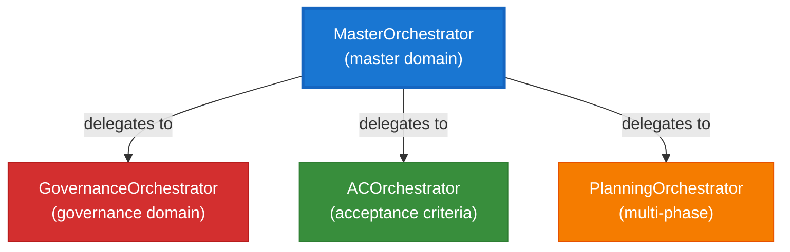
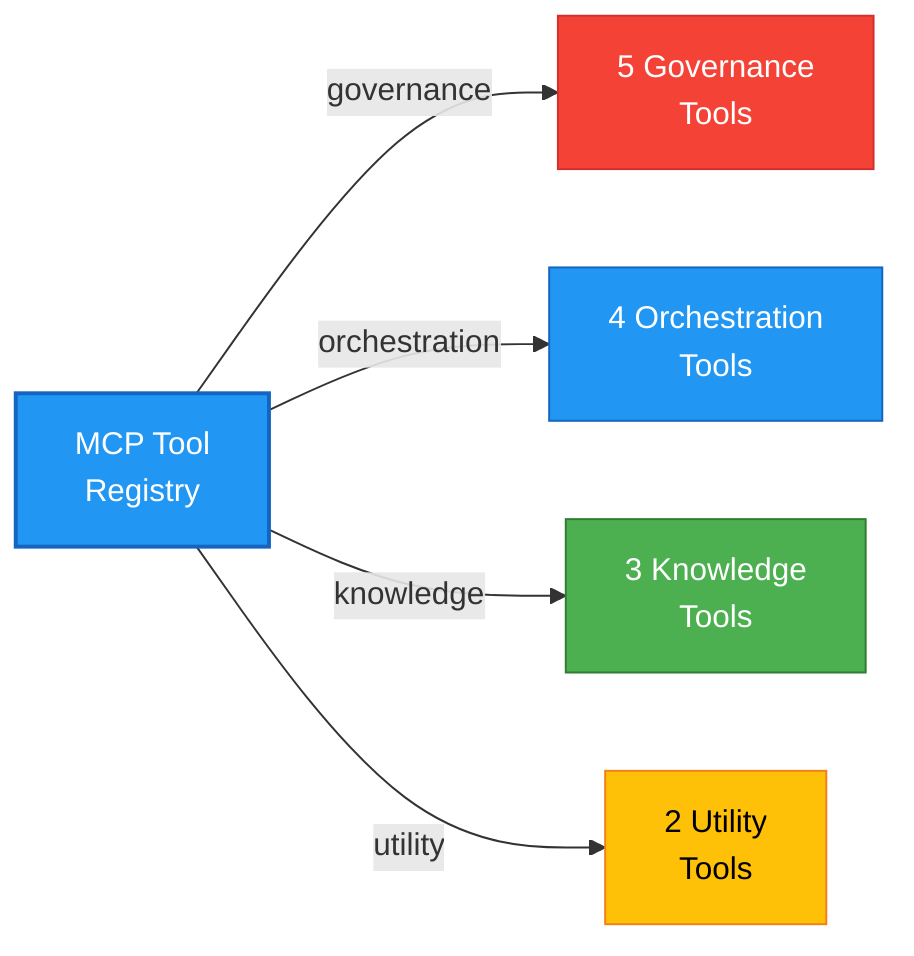
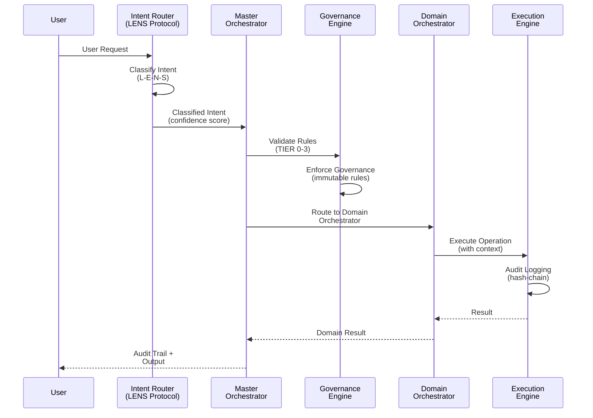

# CORTEX Autonomous Documentation Discovery & Refresh Agent
**Version:** 1.1 | **Date:** 2026-01-22 | **Type:** Autonomous Discovery + Generation + Cleanup Agent

---

## Agent Purpose

This agent autonomously discovers all CORTEX capabilities (orchestrators, MCP tools, modules, features) and generates comprehensive documentation with mermaid architecture diagrams. It then validates the mkdocs site, fixes broken links, removes obsolete documentation, and performs a cleanup cycle to reorganize files and maintain documentation hygiene.

**Execution:** `python -m cortex.documentation.discovery_agent --full-refresh --cleanup`

---

## Activation Triggers

Use this agent when:

1. **New Orchestrators Added:** After creating domain orchestrators, run discovery to auto-document
2. **MCP Tool Registry Updated:** After adding new tools via `@mcp_tool` decorator
3. **Infrastructure Changes:** After updating resilience patterns or observability
4. **Governance Updates:** After modifying TIER 0-3 rules
5. **Documentation Refresh:** Periodically rebuild all docs from source
6. **Link Audits:** Run link validation to identify dead references
7. **Pre-Deployment:** Validate all documentation before production release

---

## Discovery Workflow

### Stage 1: Capability Inventory

**Input:** CORTEX codebase  
**Process:** Multi-threaded scanning of:
- `cortex/orchestrators/` — Registry scan + decorator analysis
- `cortex/mcp/` — Tool registry enumeration
- `cortex_brain/` — TIER rule parsing
- `cortex/infrastructure/` — Resilience pattern mapping
- `cortex/domain_brain/` — Query engine discovery

**Output:** JSON capability catalog with metadata

```json
{
  "timestamp": "2026-01-22T12:00:00Z",
  "orchestrators": [
    {
      "name": "MasterOrchestrator",
      "domain": "master",
      "priority": 0,
      "methods": ["route_intent", "validate_governance", "execute"],
      "status": "PRODUCTION"
    }
  ],
  "mcp_tools": [
    {
      "tool_id": "governance_001",
      "category": "governance",
      "auth_level": "PRIVILEGED",
      "parameters": {...}
    }
  ]
}
```

### Stage 2: Mermaid Diagram Generation

For each component category, auto-generate architecture diagrams:

**Orchestrator Hierarchy:**


**MCP Tool Registry:**


**4-Stage Orchestration Pipeline:**


### Stage 3: Documentation File Generation

Auto-generate markdown files in proper folder hierarchy:

**File Creation Template:**

```markdown
# {Component Name}

> **Summary:** {One-line description}  
> **Authority:** {Source location} | **Last Updated:** {ISO 8601}  
> **Responsibility:** {High-level purpose}

---

## Overview

{2-3 paragraph narrative explanation}

## Architecture

{Embedded Mermaid diagram}

## Core Capabilities

- **Capability 1:** Description
- **Capability 2:** Description

## Key Methods/Tools/Rules

### Item A
- **Type:** {orchestrator|tool|rule|pattern}
- **Purpose:** 
- **Parameters:** 
- **Example Usage:**

### Item B
...

## Integration Points

Integrates with:
- [Related Component 1](../path/to/component1.md)
- [Related Component 2](../path/to/component2.md)

## Best Practices

- Practice 1
- Practice 2

## Troubleshooting

**Problem:** Common issue  
**Solution:** How to fix

## See Also

- [Source Code](../../../cortex/path/to/source.py)
- [Tests](../../../tests/unit/path/to/test.py)
- [Related Docs](../related/documentation.md)

---

**Author:** CORTEX Documentation Engine  
**Last Generated:** {ISO 8601}  
```

### Stage 4: mkdocs Configuration Update

Auto-update `mkdocs.yml` navigation:

```yaml
nav:
  - "🚀 Home": INDEX.md
  
  - Cortex Brain (TIER 0-3):
    - Overview: 01-cortex-brain/00-brain-index.md
    - TIER 0 Governance: 01-cortex-brain/01-tier0-governance.md
    - TIER 1 Acceptance Criteria: 01-cortex-brain/02-tier1-acceptance.md
    - TIER 2 Response Templates: 01-cortex-brain/03-tier2-response-templates.md
    - TIER 3 Knowledge: 01-cortex-brain/04-tier3-knowledge.md
    - Architecture: 01-cortex-brain/05-brain-architecture.md
  
  - Orchestrators:
    - Overview: 02-orchestrators/00-orchestrators-index.md
    - Master Orchestrator: 02-orchestrators/01-master-orchestrator.md
    - Intent Router: 02-orchestrators/02-intent-router.md
    - Orchestrator Registry: 02-orchestrators/03-orchestrator-registry.md
    - Domain Orchestrators: 02-orchestrators/04-domain-orchestrators.md
    - Custom Development: 02-orchestrators/05-custom-orchestrator-dev.md
    - Architecture: 02-orchestrators/orchestrators-architecture.md
  
  - MCP Tools:
    - Overview: 11-mcp-tools/00-mcp-index.md
    - Governance Tools: 11-mcp-tools/01-governance-tools.md
    - Orchestration Tools: 11-mcp-tools/02-orchestration-tools.md
    - Knowledge Tools: 11-mcp-tools/03-knowledge-tools.md
    - Utility Tools: 11-mcp-tools/04-utility-tools.md
    - Tool Registry: 11-mcp-tools/05-tool-registry.md
    - Custom Tool Development: 11-mcp-tools/06-custom-tool-development.md
    - Architecture: 11-mcp-tools/mcp-architecture.md
  
  # ... (additional sections auto-generated)
```

### Stage 5: Link Validation & Obsolescence Cleanup

**Validation Checks:**
```python
FOR each markdown file in docs/:
  1. Parse all links: [text](target)
  2. Classify link type:
     - Internal: ../path/file.md
     - Anchor: file.md#section
     - Image: 
     - External: https://...
  3. For internal links:
     - Verify file exists
     - Verify anchor exists (if specified)
     - Resolve relative path
  4. For images:
     - Verify file exists
     - Verify path is correct
  5. Flag issues:
     - DEAD_LINK: Target doesn't exist
     - ORPHANED_ANCHOR: Section doesn't exist
     - MISSING_IMAGE: Image file missing
     - CIRCULAR_REFERENCE: A->B->A links
```

**Obsolescence Detection:**
```python
FOR each documentation file:
  1. Check modification timestamp
  2. Compare against source code:
     - Check if referenced code still exists
     - Check if examples still work
     - Check if descriptions match implementation
  3. Identify orphaned files:
     - Not referenced in mkdocs.yml
     - Not referenced from other docs
  4. Mark for review/removal
```

### Stage 6: Test Suite Validation

Generate comprehensive test suite in `docs/_tests/`:

```python
# test_documentation_integrity.py
class TestDocumentationIntegrity:
    def test_mkdocs_builds(self): ...
    def test_all_nav_links_exist(self): ...
    def test_no_orphaned_docs(self): ...
    def test_image_assets_exist(self): ...

# test_link_validation.py
class TestLinkValidation:
    def test_internal_links_resolve(self): ...
    def test_anchor_references_valid(self): ...
    def test_no_dead_links(self): ...
    def test_no_circular_references(self): ...

# test_documentation_ui.py
class TestDocumentationUI:
    def test_cortex_logo_displays(self): ...
    def test_favicon_exists(self): ...
    def test_css_loads(self): ...
    def test_navigation_renders(self): ...

# test_documentation_completeness.py
class TestDocumentationCompleteness:
    def test_all_orchestrators_documented(self): ...
    def test_all_mcp_tools_documented(self): ...
    def test_all_governance_rules_documented(self): ...
    def test_all_components_have_diagrams(self): ...
```

### Stage 6: Cleanup & Reorganization Cycle

**CRITICAL:** After validation passes, perform cleanup to maintain docs hygiene.

#### Cleanup Algorithm

```python
# Phase 1: Identify misplaced files at docs root
WHITELISTED_ROOT_FILES = {
    "0-README.md",
    "INDEX.md", 
    "LICENSE.md",
    "mkdocs.yml",
    "serve-docs.bat",          # ⭐ ALWAYS KEEP (Windows launcher)
    "serve-docs.sh",
    "SERVE-DOCS-README.md",
    "_hooks",
    "_tests",
    "_diagrams",
    "assets",
    "stylesheets",
    "theme",
    # Numbered folders 01-cortex-brain through 16-testing
}

FILES_TO_RELOCATE = {
    "BRAIN_DOCUMENTATION_REPORT.md": "docs/01-cortex-brain/",
    "DOCUMENTATION-SYSTEM-INTEGRATION-GUIDE.md": "docs/08-reference/",
    "PRODUCTION-READINESS-BRITTLENESS-ANALYSIS.md": "docs/04-architecture/",
    "TEST-EXECUTION-STRATEGY.md": "docs/16-testing/",
    "TEST-OPTIMIZATION-SUMMARY.md": "docs/16-testing/",
    "TEST-QUICK-REFERENCE.txt": "docs/16-testing/",
    "CROSS-PLATFORM-SCRIPTS-IMPLEMENTATION.md": "docs/07-guides/deployment/",
    "README-ORCHESTRATOR-MODULES.md": "docs/02-orchestrators/",
    "DOCUMENTATION-REFACTORING-REPORT.md": "docs/_archive/",  # Delete or archive
}

# Phase 2: Relocate files
for file, destination in FILES_TO_RELOCATE.items():
    if os.path.exists(file):
        if not os.path.exists(destination):
            os.makedirs(destination)
        
        # Rename for consistency
        filename = os.path.basename(file)
        normalized_name = filename.lower().replace(" ", "-")
        
        dest_path = os.path.join(destination, normalized_name)
        
        print(f"Moving {file} → {dest_path}")
        shutil.move(file, dest_path)
        
        # Update mkdocs.yml if file was referenced
        update_mkdocs_references(file, dest_path)

# Phase 3: Validate reorganization
validation_checks = [
    ("No .md files at docs root except whitelisted", validate_root_files),
    ("All numbered folders (01-16) exist", validate_folder_structure),
    ("serve-docs.bat at project root", validate_serve_script_location),
    ("mkdocs.yml reflects new locations", validate_mkdocs_structure),
    ("Zero broken cross-references", validate_links),
]

for check_name, check_fn in validation_checks:
    result = check_fn()
    print(f"✓ {check_name}" if result else f"✗ {check_name}")

# Phase 4: Generate cleanup report
cleanup_report = {
    "timestamp": datetime.now().isoformat(),
    "files_relocated": [relocated_files],
    "files_deleted": [deleted_files],
    "new_folders_created": [new_folders],
    "mkdocs_updates": [mkdocs_changes],
    "validation_results": [all_passed],
}

print("=" * 60)
print("CLEANUP CYCLE COMPLETE")
print("=" * 60)
print(json.dumps(cleanup_report, indent=2))
```

#### Cleanup Verification

After cleanup, verify:

✅ **File Organization**
- No documentation `.md` files at `docs/` root except whitelisted set
- All files moved to proper numbered section folders
- `serve-docs.bat` remains at project root (Windows launcher)
- Folder structure matches mkdocs.yml navigation

✅ **Link Integrity**
- Run: `pytest docs/_tests/test_link_validation.py -v`
- All internal links resolve correctly
- No broken image references
- All anchors valid

✅ **Build Success**
- Run: `mkdocs build`
- Zero errors or warnings
- Static site generated in `_build/site/`

✅ **Documentation Completeness**
- Run: `pytest docs/_tests/test_documentation_integrity.py -v`
- All sections present and complete
- Navigation hierarchy consistent
- No orphaned files

---

## Brittleness Analysis Framework

### Concurrency & State

**Hazard 1: MCP Registry Mutations During Discovery**
- **Risk:** Tool registry scanned while new tools registered from different thread
- **Manifestation:** Missing tools in discovery, incomplete documentation
- **Mitigation:** Discovery acquires read lock on registry, uses snapshot enumeration
- **Test:** Concurrent registration + discovery should produce consistent results

**Hazard 2: Orchestrator Singleton Initialization Race**
- **Risk:** Multiple threads initialize singletons before first instance complete
- **Manifestation:** Duplicate orchestrator instances, routing inconsistency
- **Mitigation:** Double-checked locking with volatile state variable
- **Test:** 100 concurrent threads initializing MasterOrchestrator should produce one instance

**Hazard 3: Documentation File Generation & mkdocs Build Race**
- **Risk:** mkdocs starts before all doc files written to disk
- **Manifestation:** Partial documentation site, build errors
- **Mitigation:** Two-phase process: all writes complete, then single mkdocs build
- **Test:** Generate docs + build mkdocs in rapid succession, verify success

### Failure Modes

**Failure 1: Tool Discovery Fails Silently**
- **Risk:** Exception in tool enumeration silently caught, incomplete documentation
- **Manifestation:** Missing MCP tool documentation, incomplete catalog
- **Mitigation:** All discovery phases log start/end + item counts, validate non-empty results
- **Test:** Inject failures in tool enumeration, verify error is reported

**Failure 2: Markdown Generation Produces Invalid YAML Front Matter**
- **Risk:** Documentation file contains unparseable YAML, mkdocs fails
- **Manifestation:** Entire documentation site build fails
- **Mitigation:** Validate YAML syntax before file write, use safe string escaping
- **Test:** Generate docs with special characters, verify mkdocs build succeeds

**Failure 3: Mermaid Diagram Syntax Error**
- **Risk:** Generated diagram has invalid syntax, renders as plain text
- **Manifestation:** Diagram appears as code block, not rendered visualization
- **Mitigation:** Validate mermaid syntax before writing, use tested templates
- **Test:** All generated diagrams should render without browser console errors

### Auth & Secrets

**Hazard 1: Auth Token in Documentation Examples**
- **Risk:** Example code includes hardcoded credentials
- **Manifestation:** Secrets exposed in source documentation
- **Mitigation:** Scan all generated examples for credential patterns, sanitize
- **Test:** All documentation examples pass credential detection scan

### Integration & Contracts

**Hazard 1: Governance Rules Added but Not Enforced**
- **Risk:** New governance rule documented but not enforced in actual execution
- **Manifestation:** Documentation says rule is enforced, but isn't, security/quality gap
- **Mitigation:** Discovery validates that each documented rule has enforcement code
- **Test:** For each governance rule, verify corresponding check in codebase

**Hazard 2: MCP Tool Parameter Validation Missing**
- **Risk:** Documentation describes parameters but code doesn't validate them
- **Manifestation:** Invalid parameters accepted, unexpected behavior
- **Mitigation:** Discovery validates tool parameter specs match validation logic
- **Test:** Pass invalid parameters to each documented tool, verify rejection

### Observability

**Blind Spot 1: Discovery Errors Not Logged**
- **Risk:** Discovery phase silently skips components if errors occur
- **Manifestation:** Incomplete documentation with no indication why
- **Mitigation:** All discovery phases log comprehensively to structured logger
- **Test:** Monitor log output during discovery, verify all phases logged

**Blind Spot 2: Link Validation Results Not Reported**
- **Risk:** Validation finds broken links but doesn't report location
- **Manifestation:** Broken links exist but developers don't know where
- **Mitigation:** Validation reports: file, line number, link text, target, reason
- **Test:** Inject broken link, run validation, verify precise reporting

### Configuration & Environment

**Drift 1: mkdocs.yml Navigation Doesn't Match Physical Structure**
- **Risk:** Navigation hierarchy in config doesn't reflect folder structure
- **Manifestation:** Users expect docs in certain folder, find them elsewhere
- **Mitigation:** Auto-generate nav from folder structure, validate consistency
- **Test:** mkdocs navigation should reflect physical folder layout

**Drift 2: Image Paths Hardcoded Instead of Using Relative Paths**
- **Risk:** Image paths break if docs folder is moved or deployed to different path
- **Manifestation:** Images don't display in different deployment environments
- **Mitigation:** All image paths use relative paths, validated during build
- **Test:** Move docs folder, rebuild mkdocs, verify images still display

### Data Integrity

**Integrity 1: Discovery Results Not Persisted**
- **Risk:** Discovery results calculated but not saved, regenerated on each run
- **Manifestation:** Repeated slow discovery, no audit trail of changes
- **Mitigation:** Persist discovery results to JSON file with timestamp + hash
- **Test:** Run discovery twice with same codebase, verify results identical

---

## Execution Commands

### Full Refresh (All Stages)
```bash
python -m cortex.documentation.discovery_agent \
  --full-refresh \
  --generate-diagrams \
  --update-mkdocs \
  --validate-links \
  --cleanup-obsolete
```

### Discovery Only
```bash
python -m cortex.documentation.discovery_agent \
  --discover-only \
  --output-catalog=discovery_catalog.json
```

### Generate Documentation
```bash
python -m cortex.documentation.discovery_agent \
  --generate-docs \
  --catalog=discovery_catalog.json
```

### Validate & Rebuild mkdocs
```bash
python -m cortex.documentation.discovery_agent \
  --validate-links \
  --build-mkdocs \
  --report=validation_report.json
```

### Test Suite
```bash
pytest docs/_tests/ -v --cov=docs --cov-report=html
```

---

## Success Criteria

- [ ] Discovery identifies all orchestrators in registry
- [ ] All MCP tools enumerated from registry
- [ ] All governance rules extracted from YAML
- [ ] Mermaid diagrams generated for 5+ component categories
- [ ] Documentation generated in proper folder structure (not docs root)
- [ ] mkdocs.yml updated with all new documentation
- [ ] mkdocs builds successfully: `mkdocs build` exits 0
- [ ] All internal links validate successfully (0 dead links)
- [ ] Logo displays in mkdocs header
- [ ] Favicon configured correctly
- [ ] All test suites pass: `pytest docs/_tests/ -v`
- [ ] Zero documentation security issues (no exposed credentials)
- [ ] Brittleness analysis identifies all high-impact failure scenarios
- [ ] ✅ **CLEANUP CYCLE COMPLETE:**
  - [ ] No documentation files at `docs/` root except whitelisted
  - [ ] All documentation files relocated to proper numbered folders
  - [ ] serve-docs.bat remains at project root
  - [ ] mkdocs.yml navigation reflects new file locations
  - [ ] All cross-references updated after reorganization
  - [ ] Zero broken links after cleanup
  - [ ] mkdocs build succeeds with new structure
  - [ ] Cleanup report generated and logged

---

**Authority:** cortex-doc.prompt.md v1.1  
**Status:** Ready for autonomous execution with cleanup phase  
