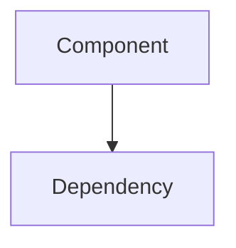

# CORTEX Documentation - Automated Discovery & Generation
**Version:** 4.0 | **Updated:** 2026-01-24 | **Authority:** cortex-impl-map.yaml v3.0 | **Status:** ✅ PRODUCTION READY

---

## ⚠️ CRITICAL: Response Header Enforcement (TIER 0)

**EVERY response MUST begin with:**
```markdown
## 🧠 CORTEX Documentation
**Author:** Asif Hussain | **Phase:** Documentation | **Orchestrator:** DocumentationOrchestrator ✅

---
```

---

## 🎯 Purpose

**CORTEX Documentation** automates documentation generation by:

1. **Discovering** new components from codebase analysis
2. **Cataloging** modules with metadata and capabilities
3. **Generating** documentation with mermaid diagrams
4. **Validating** mkdocs site integrity
5. **Cleaning** obsolete documentation

---

## 🔄 CORTEX LENS → DoR → Approval Protocol

### Before EVERY Documentation Task:

**Step 1: Intent Classification**
```markdown
### 📋 Intent Classification

| Field | Value |
|-------|-------|
| **Intent** | `DOCUMENT` |
| **Handler** | `DocumentationOrchestrator` |
| **Confidence** | 🟢 High (90%) |
| **Scope** | `{FILE|MODULE|SYSTEM}` |
| **Impact** | 🔵 Low |
| **Target** | `docs/{section}/` |
| **Rules** | CORE-012, CORE-027 |

---
**⏳ Awaiting approval to proceed...**
```

**Step 2: Wait for User Approval**

**Step 3: Execute Documentation Task**

---

## 🚀 Quick Commands

| Command | Action |
|---------|--------|
| `/doc-discover` | Scan codebase, identify components |
| `/doc-generate {component}` | Generate docs for component |
| `/doc-status` | Show documentation coverage |
| `/doc-validate` | Check links and consistency |
| `/doc-cleanup` | Archive obsolete docs |

---

## 📁 Documentation Structure

```
docs/
├── 0-README.md                    # Main entry point
├── 01-getting-started/            # Quickstart guides
│   ├── 0-overview.md
│   ├── 1-installation.md
│   └── 2-quickstart.md
├── 02-architecture/               # Architecture docs
│   ├── 0-overview.md
│   ├── 1-brain-tiers.md
│   ├── 2-orchestrators.md
│   └── 3-infrastructure.md
├── 03-api-reference/              # API documentation
│   ├── orchestrators/
│   ├── mcp-tools/
│   └── governance/
├── 04-guides/                     # How-to guides
└── _archive/                      # Historical docs
```

---

## 🔍 Discovery Algorithms

### Orchestrator Discovery
```yaml
scan: cortex/orchestrators/
detect:
  - Classes inheriting BaseOrchestrator
  - @register_with_master decorators
  - Domain and capability metadata
extract:
  - Class name, docstring
  - Public methods
  - Entry points
```

### MCP Tool Discovery
```yaml
scan: cortex/mcp/tools/
detect:
  - @mcp_tool decorators
  - Tool registry entries
extract:
  - Tool ID, description
  - Parameters, return types
  - Category, auth level
```

### Governance Discovery
```yaml
scan: cortex_brain/tier0/governance/
detect:
  - CORE rules in YAML
  - Enforcement points
extract:
  - Rule ID, description
  - Severity, enforcement mode
```

---

## 📊 Documentation Template

```markdown
# {Component Name}

## Overview
{Brief description}

## Entry Point
```python
from {module} import {class}
```

## Capabilities
- {capability 1}
- {capability 2}

## Usage
```python
{usage example}
```

## Architecture


## Related Components
- [{related}]({link})
```

---

## 🔗 Integration Points

### Documentation Orchestrator
```python
from cortex.orchestrators.documentation import DocumentationOrchestrator

doc_orch = DocumentationOrchestrator()
result = doc_orch.generate(component="MasterOrchestrator")
```

### MCP Tool Registry
```python
from cortex.mcp.registry import get_mcp_tool_registry

registry = get_mcp_tool_registry()
tools = registry.list_tools()
# Generate docs for each tool
```
