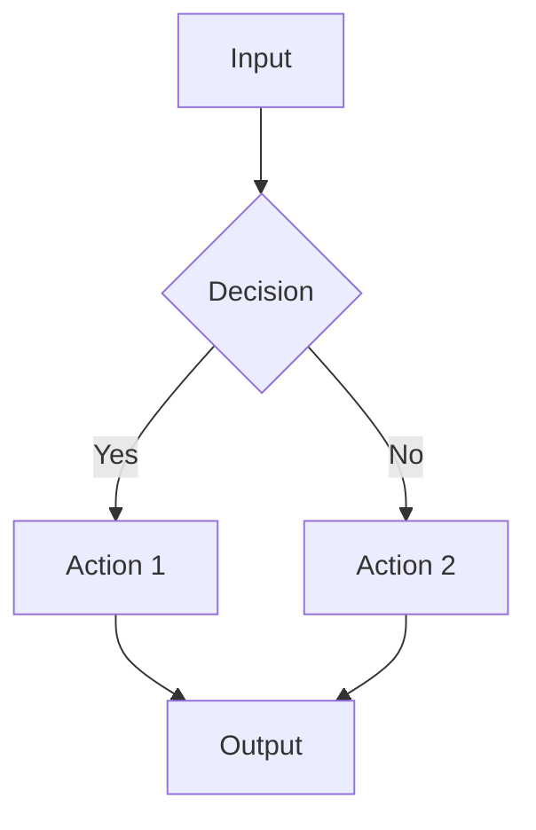

# CORTEX Documentation Generation Prompt

**Version:** 1.0 | **Updated:** 2026-02-10 | **Authority:** Documentation Architect Agent | **Mode:** Enterprise Documentation Generation

---

## 🎯 Prompt Purpose

Generate comprehensive, enterprise-grade architecture documentation for the CORTEX platform. This prompt guides the creation of a complete documentation set across multiple Markdown files, suitable for stakeholders ranging from executive leadership to technical implementers.

---

## 📋 Documentation Generation Protocol

### Phase 1: Context Discovery

Before generating documentation:

1. **Analyze Wiring Contract:**
   ```
   Read: cortex/__wiring_contract__.yaml
   Extract: Orchestrator names, categories, capabilities, dependencies
   ```

2. **Analyze MCP Server:**
   ```
   Read: cortex/mcp/server.py, cortex/mcp/cortex_tools.py
   Extract: Tool definitions, parameters, endpoints
   ```

3. **Analyze LENS Orchestrator:**
   ```
   Read: cortex/lens/orchestrator.py
   Extract: Analyzer types, synthesis flow, caching strategy
   ```

4. **Analyze Governance:**
   ```
   Read: cortex/governance/ (all files)
   Extract: Enforcement agents, compliance rules, audit patterns
   ```

5. **Analyze Infrastructure:**
   ```
   Read: deployment/ (all configs)
   Extract: Deployment topology, observability stack, scaling config
   ```

---

### Phase 2: Document Generation Order

Generate documents in this order to ensure proper cross-referencing:

1. **index.md** — Master navigation (first, update as you go)
2. **capabilities/** — Business-focused capability descriptions
3. **orchestration/** — Technical orchestrator documentation
4. **lens/** — LENS deep-dive documentation
5. **toolkit/** — Developer-focused toolkit guide
6. **infrastructure/** — Operations and deployment
7. **mcp/** — Integration and API documentation
8. **diagrams/** — Visual architecture representations

---

### Phase 3: Content Templates

#### index.md Template

```markdown
# CORTEX Architecture Documentation

**Platform:** CORTEX — Cognitive Real-Time Execution System  
**Version:** 1.0 | **Generated:** 2026-02-10  
**Maintainer:** Architecture Team

---

## Executive Summary

CORTEX is an AI-powered development orchestration platform that...
[2-3 paragraphs of business-level overview]

---

## Architecture at a Glance

[D3.js high-level architecture diagram]

---

## Documentation Index

### Core Documentation
| Document | Description | Audience |
|----------|-------------|----------|
| [Capabilities Overview](capabilities/overview.md) | Platform capabilities | All |
| [Orchestration Guide](orchestration/overview.md) | Request processing | Architects |
| [LENS Intelligence](lens/overview.md) | Code intelligence | Developers |

### Technical Documentation
| Document | Description | Audience |
|----------|-------------|----------|
| [Toolkit Guide](toolkit/overview.md) | Tool development | Developers |
| [Infrastructure](infrastructure/overview.md) | Deployment ops | SRE |
| [MCP Integration](mcp/overview.md) | External integration | Integration |

### Visual Documentation
| Document | Description |
|----------|-------------|
| [Architecture Diagrams](diagrams/architecture-overview.md) | System views |
| [Request Lifecycle](diagrams/request-lifecycle.md) | Flow diagrams |

---

## Quick Links

- **New to CORTEX?** Start with [Capabilities Overview](capabilities/overview.md)
- **Integrating with CORTEX?** See [MCP Integration](mcp/overview.md)
- **Deploying CORTEX?** See [Infrastructure Guide](infrastructure/overview.md)
- **Building Tools?** See [Toolkit Developer Guide](toolkit/developer-guide.md)

---

## Architecture Principles

1. **MCP-First** — All operations exposed via Model Context Protocol
2. **TDD-Enforced** — Test-driven development mandatory (CORE-008)
3. **Security-First** — OWASP compliance, audit trails (ARCH-012)
4. **Horizontal Scaling** — Stateless orchestrators, replica-based scaling
5. **Observability** — Prometheus metrics, structured logging

---

## Platform Statistics

| Metric | Value |
|--------|-------|
| **Orchestrators** | 23 (8 core, 6 domain, 9 support) |
| **MCP Tools** | 35+ |
| **LENS Analyzers** | 8 |
| **Governance Rules** | 50+ |
| **Languages Supported** | Python, TypeScript, C#, Java |

---

*Generated by CORTEX Documentation Architect Agent*
```

#### Capability Document Template

```markdown
# [Capability Name]

**Purpose:** [One-line description]  
**Audience:** [Target readers]  
**Last Updated:** 2026-02-10

---

## Business Value

[2-3 paragraphs explaining WHY this capability matters to the business]

---

## Functional Description

[Technical description of WHAT the capability does]

---

## Inputs and Outputs

### Inputs
| Input | Type | Required | Description |
|-------|------|----------|-------------|
| ... | ... | ... | ... |

### Outputs
| Output | Type | Description |
|--------|------|-------------|
| ... | ... | ... |

---

## Dependencies

| Dependency | Type | Purpose |
|------------|------|---------|
| ... | ... | ... |

---

## Example Use Cases

### Use Case 1: [Title]
[Description with code example if applicable]

### Use Case 2: [Title]
[Description with code example if applicable]

---

## Related Capabilities

- [Capability 1](./capability-1.md)
- [Capability 2](./capability-2.md)

---

## Configuration Options

[If applicable, configuration parameters and their effects]
```

#### Orchestrator Document Template

```markdown
# [Orchestrator Name]

**Category:** [core | domain | support]  
**Priority:** [1-200]  
**Version:** 1.0.0

---

## Purpose

[Clear statement of what this orchestrator does]

---

## Responsibilities

1. [Responsibility 1]
2. [Responsibility 2]
3. [Responsibility 3]

---

## Control Flow

[D3.js or Mermaid diagram showing internal flow]



---

## Inputs

| Parameter | Type | Required | Description |
|-----------|------|----------|-------------|
| ... | ... | ... | ... |

---

## Outputs

| Field | Type | Description |
|-------|------|-------------|
| ... | ... | ... |

---

## Failure Handling

| Failure Mode | Detection | Recovery Action |
|--------------|-----------|-----------------|
| ... | ... | ... |

---

## Scaling Behavior

[How this orchestrator scales: stateless, replica-based, etc.]

---

## Dependencies

| Dependency | Direction | Purpose |
|------------|-----------|---------|
| ... | Upstream/Downstream | ... |

---

## Related Orchestrators

- [Orchestrator 1](./orchestrator-1.md)
- [Orchestrator 2](./orchestrator-2.md)
```

---

## 🎨 D3.js Diagram Standards

### High-Level Architecture Diagram

```javascript
// CORTEX Architecture Overview
const architectureData = {
  nodes: [
    { id: "clients", label: "Clients\n(VSCode, Claude, Cursor)", type: "external", x: 400, y: 50 },
    { id: "gateway", label: "MCP Gateway", type: "entry", x: 400, y: 150 },
    { id: "master", label: "MasterOrchestrator", type: "core", x: 400, y: 250 },
    { id: "router", label: "IntentRouter", type: "core", x: 400, y: 350 },
    { id: "core", label: "Core Orchestrators", type: "group", x: 200, y: 450 },
    { id: "domain", label: "Domain Orchestrators", type: "group", x: 400, y: 450 },
    { id: "support", label: "Support Orchestrators", type: "group", x: 600, y: 450 },
    { id: "lens", label: "LENS Intelligence", type: "intelligence", x: 700, y: 350 },
    { id: "brain", label: "CORTEX Brain", type: "knowledge", x: 700, y: 250 }
  ],
  edges: [
    { source: "clients", target: "gateway", label: "JSON-RPC" },
    { source: "gateway", target: "master", label: "request" },
    { source: "master", target: "router", label: "classify" },
    { source: "router", target: "core", label: "IMPLEMENT" },
    { source: "router", target: "domain", label: "REFACTOR" },
    { source: "router", target: "support", label: "ONBOARD" },
    { source: "master", target: "lens", label: "context" },
    { source: "lens", target: "brain", label: "knowledge" }
  ]
};
```

### Request Lifecycle Diagram

```javascript
// Request Lifecycle Flow
const lifecycleData = {
  stages: [
    { id: 1, name: "Receive", description: "MCP Gateway receives request" },
    { id: 2, name: "Classify", description: "IntentRouter classifies intent" },
    { id: 3, name: "Enrich", description: "LENS provides context" },
    { id: 4, name: "Route", description: "Route to target orchestrator" },
    { id: 5, name: "Execute", description: "Orchestrator executes operation" },
    { id: 6, name: "Validate", description: "Governance validation" },
    { id: 7, name: "Respond", description: "Return result to client" }
  ]
};
```

---

## 📊 Quality Standards

### Content Quality

- **No Placeholders:** All content must be production-ready
- **Consistent Terminology:** Use canonical terms from codebase
- **Accurate References:** Verify all cross-document links
- **Version Accuracy:** Match versions from wiring contract

### Technical Accuracy

- **Code Examples:** Extracted from actual codebase
- **API Signatures:** Match implementation
- **Configuration:** Match deployment configs
- **Metrics:** Match Prometheus definitions

### Visual Quality

- **Diagrams:** Labeled nodes, edges, legend included
- **Tables:** Aligned, complete headers
- **Code Blocks:** Syntax highlighted, runnable

---

## 🔧 Generation Workflow

1. **Create folder structure** — All directories first
2. **Generate index.md** — Navigation hub
3. **Generate overviews** — Each section's overview.md
4. **Generate detail docs** — Individual topic documents
5. **Generate diagrams** — Visual architecture docs
6. **Cross-reference audit** — Verify all links work
7. **Final review** — Quality checklist

---

## 📁 Output Location

All documentation generated to:
```
_workspaces/cortex-architecture/
```

---

*CORTEX Documentation Generation Prompt v1.0*
