# CORTEX Documentation Refresh Prompt

## Purpose

Manually refresh `docs/` folder content and Mermaid diagrams to reflect the final state of `cortex-impl-map.yaml`. Uses VS Code todo list to track each document/diagram task.

---

## Invocation

Run this prompt manually when `cortex-impl-map.yaml` is updated and documentation needs refresh.

---

## Execution Rules

1. **Silent execution** - No verbose output, no progress reports
2. **Todo-driven** - Create todo list first, then execute each item
3. **Complete or fail** - Do not leave partial work; finish all todos
4. **Clean result** - `docs/` folder must be organized when done

---

## Step 1: Create Todo List

Read `_workspaces/roadmap/cortex-impl-map.yaml` and create todos for:

### Documents to Update

| Todo | Target File | Source Section in impl-map |
|------|-------------|---------------------------|
| Architecture Overview | `docs/02-architecture/0-overview.md` | `architecture:` |
| Implementation Status | `docs/02-architecture/6-implementation-phases.md` | `phases_implementation_status:` |
| Governance Rules | `docs/02-architecture/governance-rules.md` | `governance:` |
| Definition of Ready | `docs/02-architecture/definition-of-ready.md` | `production_readiness_summary:` |
| Gap Analysis | `docs/05-reference/gap-analysis.md` | `gaps_identified:` |
| Remediation Status | `docs/05-reference/remediation-status.md` | `remediation_phases:` |

### Diagrams to Create/Update (in `docs/_diagrams/`)

| Todo | Diagram File | Type | Illustrates |
|------|--------------|------|-------------|
| Architecture Diagram | `architecture-overview.mmd` | Flowchart | System components and relationships |
| Tier Structure | `governance-tiers.mmd` | Flowchart | Tier 0-3 hierarchy |
| Phase Dependencies | `phase-dependencies.mmd` | Flowchart | Phase execution order |
| Orchestration Flow | `orchestration-flow.mmd` | Sequence | Request to orchestrator to execution |
| MCP Tools | `mcp-tools.mmd` | Mind Map | Tool categories and capabilities |
| Production Readiness | `production-readiness.mmd` | Flowchart | Critical path to 100% |
| State Management | `state-management.mmd` | Flowchart | State persistence and recovery |
| Resilience Patterns | `resilience-patterns.mmd` | Sequence | Circuit breaker, retry, fallback |
| Intent Router Flow | `intent-router-flow.mmd` | Flowchart | LENS protocol + routing decisions |
| Knowledge Graph | `knowledge-graph.mmd` | Flowchart | BKIO pipeline, entity relationships |
| Error Recovery Flow | `error-recovery-flow.mmd` | Sequence | Recovery patterns, circuit states |
| Test Pyramid | `test-pyramid.mmd` | Flowchart | Unit/integration/E2E distribution |
| CI/CD Pipeline | `ci-cd-pipeline.mmd` | Flowchart | Deployment flow, validation gates |

### Architecture Documents (in `docs/02-architecture/`)

| Todo | Target File | Description |
|------|-------------|-------------|
| Intent Router | `7-intent-router.md` | LENS protocol, classifier, disambiguator |
| Knowledge Protocol | `9-knowledge-protocol.md` | BKIO, knowledge graph operations |
| MCP Tool Governance | `10-mcp-tool-governance.md` | 14 MCP tools, registry, auth |

### ADRs (in `docs/02-architecture/adrs/`)

| Todo | Target File | Decision |
|------|-------------|----------|
| Tier Precedence | `adr-002-tier-precedence.md` | tier0 > tier1 > tier2 > tier3 |
| MCP Stub Strategy | `adr-003-mcp-stub-strategy.md` | Why 14 tools remain stubs |
| Package Separation | `adr-004-cortex-brain-separation.md` | cortex/ vs cortex_brain/ split |
| Conversation Protocol | `adr-005-conversation-protocol.md` | ContinuationDecision pattern |

### Contributing Documents (in `docs/07-contributing/`)

| Todo | Target File | Description |
|------|-------------|-------------|
| Development Setup | `2-development-setup.md` | Local environment setup |
| Testing Strategy | `3-testing-strategy.md` | Test patterns, AC mapping |
| Code Style Guide | `4-code-style-guide.md` | CORE-011/012 enforcement |
| PR Process | `5-pull-request-process.md` | Review workflow, checklist |

### Operations Guides (in `docs/04-guides/operations/`)

| Todo | Target File | Description |
|------|-------------|-------------|
| Runbook | `5-runbook.md` | Incident response procedures |
| Disaster Recovery | `6-disaster-recovery.md` | Backup/restore, RTO/RPO |
| Scaling Guide | `7-scaling-guide.md` | Horizontal scaling patterns |

### Reference Documents (in `docs/05-reference/`)

| Todo | Target File | Description |
|------|-------------|-------------|
| Governance Rules | `governance-rules-reference.md` | All 29 CORE-* rules with examples |
| Test AC Mapping | `test-ac-mapping.md` | AC-ID to test file mapping |

---

## Step 2: Execute Each Todo

For each todo item:

1. Mark todo as **in-progress**
2. Read relevant section from `cortex-impl-map.yaml`
3. Generate/update the document or diagram
4. Mark todo as **completed**
5. Move to next todo

---

## Step 3: Cleanup

After all todos complete:

1. Delete any obsolete files in `docs/` not in the catalog above
2. Verify all diagrams render valid Mermaid syntax
3. Update `docs/0-README.md` with current date and status

---

## Document Templates

### Markdown Document Template

```markdown
# {Title}

> Auto-generated from cortex-impl-map.yaml on {date}

## Overview

{Brief summary from impl-map section}

## Details

{Structured content from impl-map}

## Related

- [Link to related doc]
- [Link to diagram]
```

### Mermaid Diagram Template

```mermaid
---
title: {Diagram Title}
---
{diagram content}
```

---

## Diagram Specifications

### architecture-overview.mmd
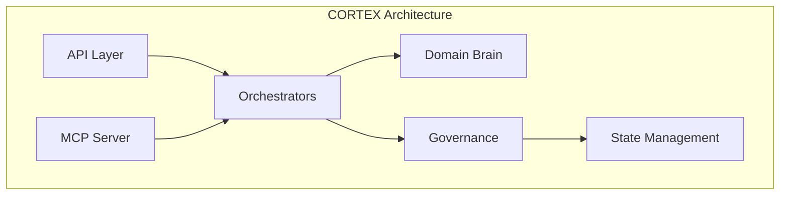

### governance-tiers.mmd
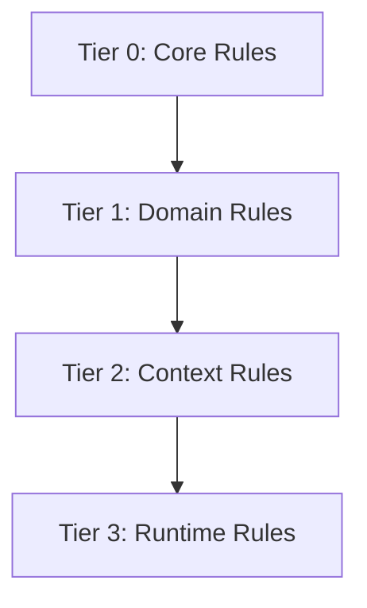

### phase-dependencies.mmd
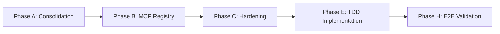

### orchestration-flow.mmd
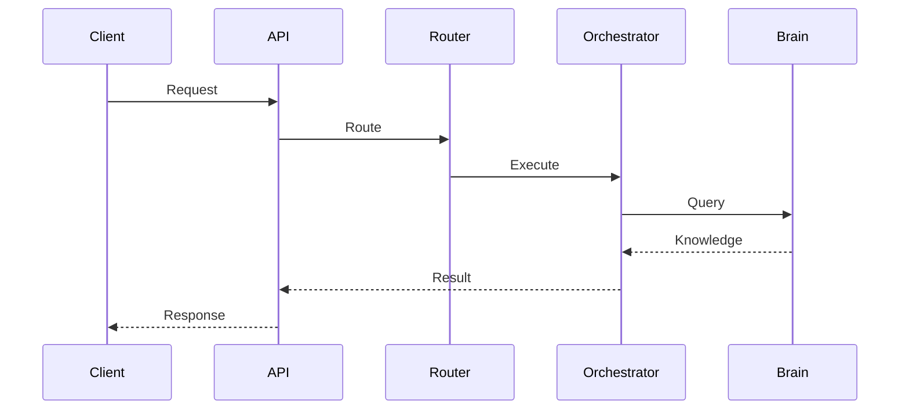

### mcp-tools.mmd
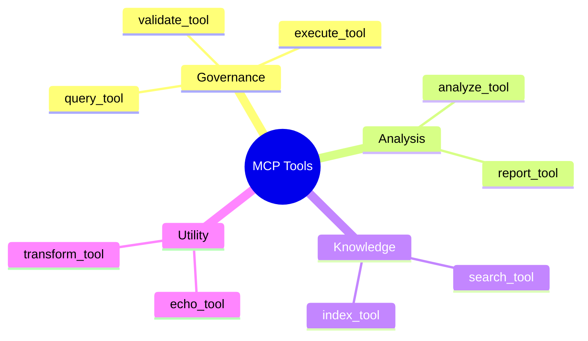

### production-readiness.mmd
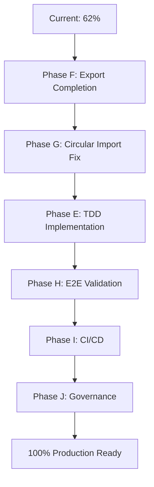

### state-management.mmd
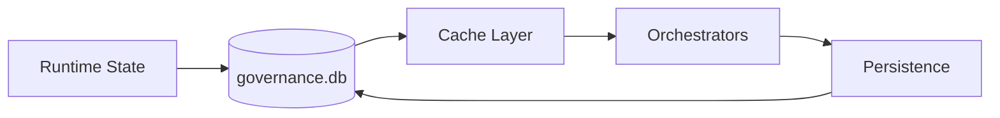

### resilience-patterns.mmd
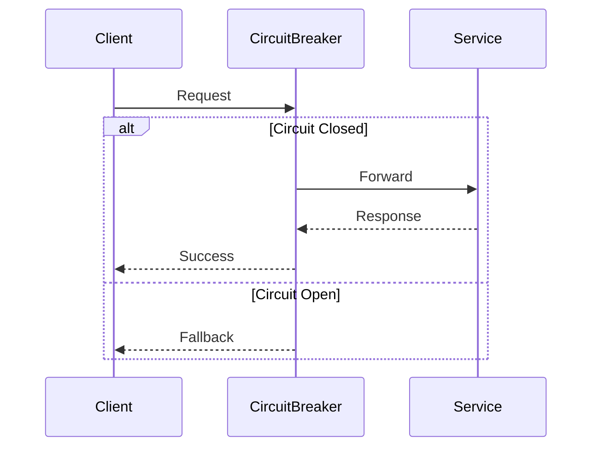

### intent-router-flow.mmd
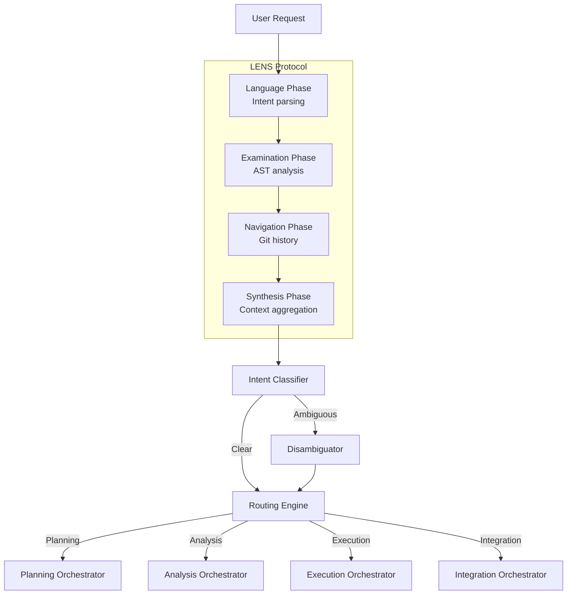

### knowledge-graph.mmd
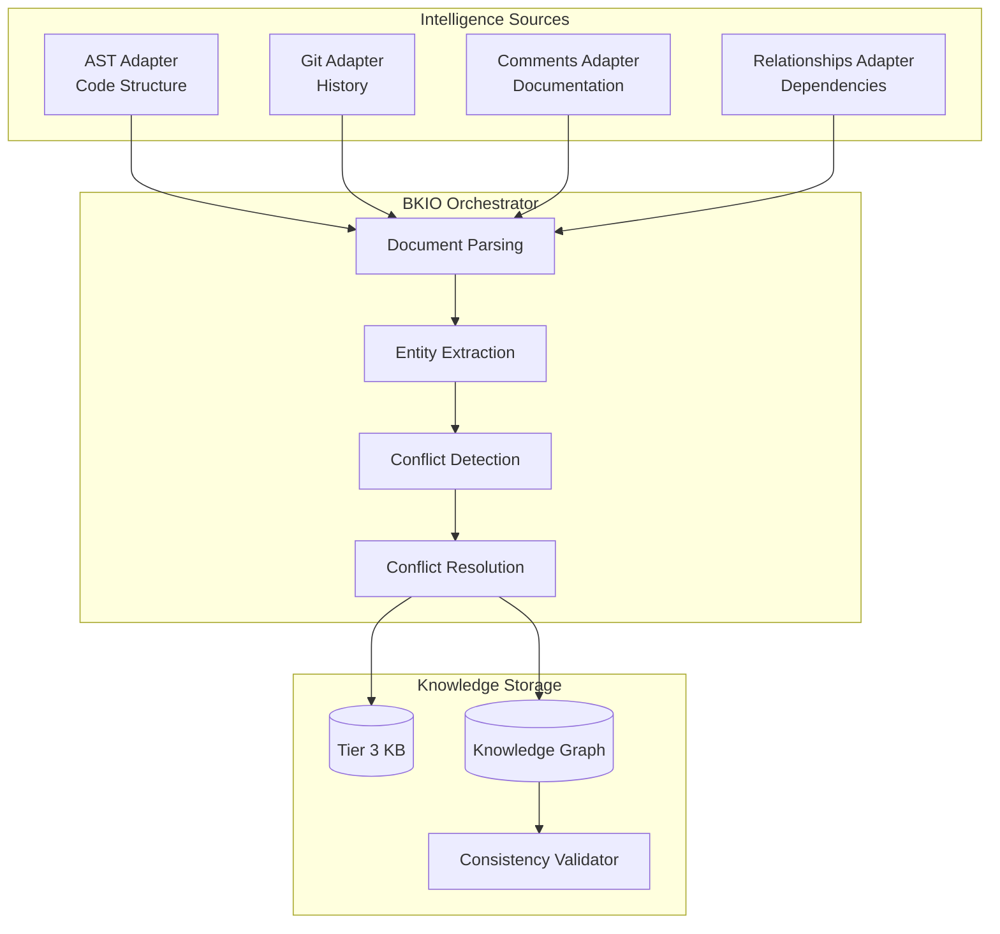

### error-recovery-flow.mmd
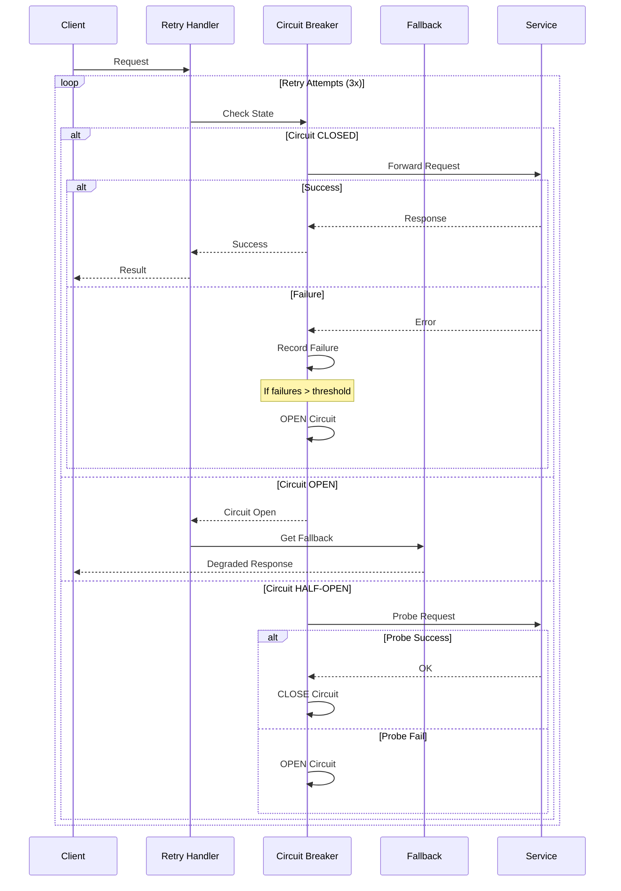

### test-pyramid.mmd
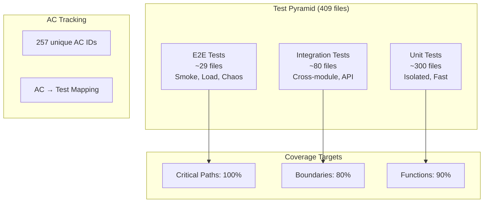

### ci-cd-pipeline.mmd
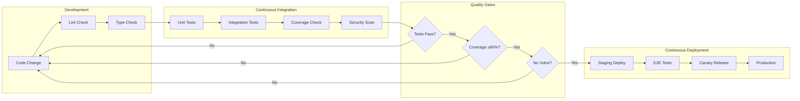

---

## Protected Files (Never Delete)

- `docs/LICENSE.md`
- `docs/0-README.md` (update, don't delete)
- `docs/_archive/**` (historical records)
- `docs/_manifests/**` (system metadata)