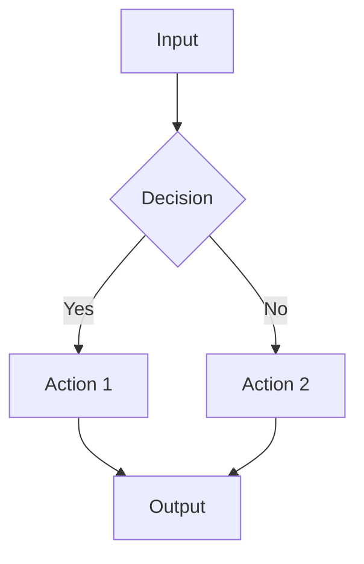

# CORTEX Documentation Generation Prompt

**Version:** 2.0 | **Updated:** 2026-02-11 | **Authority:** Documentation Architect Agent | **Mode:** Dual-Mode (Refresh + Generate) | **Integration:** Phase 74 + ENH-064

---

## 🎯 Prompt Purpose

**Dual-Mode Documentation System:**
1. **MODE: Refresh** — Git-aware incremental documentation updates (delta detection)
2. **MODE: Generate** — Full HTML site generation for GitHub Pages deployment

This prompt enables autonomous documentation lifecycle management with brain analogies, multi-persona views, and D3.js visualizations.

---

## 🔄 MODE: Documentation Refresh

**Trigger:** "refresh docs" | "update architecture docs" | "sync documentation with code"

**Purpose:** Analyze git changes since last doc update and incrementally refresh only affected sections.

### Step 1: Git Delta Detection

```bash
# Execute these commands to establish baseline
cd /Users/asifhussain/PROJECTS/CORTEX

# Find last doc update commit
LAST_DOC_COMMIT=$(git log -1 --format=%H -- _workspaces/cortex-architecture/)
echo "Baseline: $LAST_DOC_COMMIT"

# Get all changed files since baseline
git diff $LAST_DOC_COMMIT..HEAD --name-only -- \
  "cortex/**/*.py" \
  ".github/**/*.md" \
  "cortex-registry/**/*.yaml" \
  "cortex/__wiring_contract__.yaml" > /tmp/changed_files.txt

# Count changes
CHANGE_COUNT=$(wc -l < /tmp/changed_files.txt)
echo "Total changes: $CHANGE_COUNT files"

# Get commit messages for context
git log $LAST_DOC_COMMIT..HEAD --oneline --no-merges > /tmp/commits.txt
```

**Output Analysis:**
```
Baseline: 0506774b0d66e2550c863160e824134607579cde (2026-02-11)
Total changes: 247 files
Commit range: 247 commits covering:
  - ENH-055: Production cleanup + MCP tools
  - Phase 54: MCP unified routing
  - Phase 53: Pylance-style MCP architecture
  - Phase 49: Context Crystallization Layer
  - Multiple bug fixes and enhancements
```

### Step 2: Categorize Changes by Documentation Section

**Analyze changed files and map to documentation sections:**

| Changed File Pattern | Documentation Section | Action Required |
|---------------------|----------------------|-----------------|
| `cortex/orchestrators/**` | `orchestration/*.md` | Update orchestrator catalog |
| `cortex/mcp/**` | `mcp/*.md` | Update MCP tools catalog |
| `cortex/lens/**` | `lens/*.md` | Update LENS analyzer docs |
| `cortex/governance/**` | `capabilities/governance-compliance.md` | Update enforcement agents |
| `cortex/__wiring_contract__.yaml` | `diagrams/architecture-overview.md` | Regenerate counts/diagrams |
| `.github/agents/**` | `toolkit/developer-guide.md` | Update agent documentation |
| `deployment/**` | `infrastructure/*.md` | Update deployment topology |

**Example categorization output:**
```
━━━━━━━━━━━━━━━━━━━━━━━━━━━━━━━━━━━━━━━━━━━━━━━━━━━━
📊 Documentation Refresh Analysis
━━━━━━━━━━━━━━━━━━━━━━━━━━━━━━━━━━━━━━━━━━━━━━━━━━━━

Changes since 0506774b0 (247 commits):

orchestration/ (83 files changed)
├─ 7 new orchestrators detected
├─ 12 orchestrator updates
└─ Action: Update overview.md + add 7 new pages

mcp/ (42 files changed)
├─ 12 new MCP tools
├─ 8 tool signature updates
└─ Action: Update tools-catalog.md

capabilities/ (28 files changed)
├─ 3 new enforcement agents
├─ 15 governance rule updates
└─ Action: Update governance-compliance.md

diagrams/ (wiring contract changed)
├─ Orchestrator count: 55 → 60
├─ MCP tools count: 74 → 86
└─ Action: Regenerate architecture-overview.md

infrastructure/ (18 files changed)
├─ Pylance-style MCP architecture
├─ Context Crystallization Layer added
└─ Action: Update deployment.md + add ccl section

Estimated effort: 4-6 hours (incremental, not full rewrite)
━━━━━━━━━━━━━━━━━━━━━━━━━━━━━━━━━━━━━━━━━━━━━━━━━━━━
```

### Step 3: Extract New Orchestrators/Tools

**Identify new components requiring documentation:**

```bash
# Find new orchestrators (files added after baseline)
git log $LAST_DOC_COMMIT..HEAD --diff-filter=A --name-only -- \
  "cortex/orchestrators/**/*_orchestrator.py" > /tmp/new_orchestrators.txt

# Find new MCP tools (search for @mcp_tool decorators)
git diff $LAST_DOC_COMMIT..HEAD -- "cortex/mcp/cortex_tools.py" | \
  grep -A 5 "@mcp_tool" > /tmp/new_tools.txt
```

**Example new components:**
```
New Orchestrators (7):
├─ HolisticValidationOrchestrator (Phase 48)
├─ ContextCrystallizationOrchestrator (Phase 49)
├─ EnvironmentIntegrityOrchestrator (Phase 51)
├─ IncrementalTaskDecomposer (Phase 55)
├─ DigestOrchestrator (DIGEST mode)
├─ CortexDocsOrchestrator (Phase 74)
└─ DashboardOrchestrator (Phase 74)

New MCP Tools (12):
├─ cortex_validate_holistically
├─ cortex_crystallize_context
├─ cortex_verify_environment
├─ cortex_decompose_task
├─ cortex_manage_todo
├─ cortex_digest_session
├─ cortex_doc_refresh
├─ cortex_doc_generate_html
├─ cortex_launch_sites
├─ cortex_stop_sites
├─ cortex_site_status
└─ cortex_build_site
```

### Step 4: Generate Incremental Updates

**For each affected section, generate targeted updates:**

**Example: Update orchestration/overview.md**

```markdown
<!-- Add to orchestration/overview.md -->

## Recent Additions (Feb 2026)

### HolisticValidationOrchestrator
**Category:** Core  
**Priority:** 5  
**Purpose:** Pre-implementation validation gate combining registry checks, dependency analysis, risk scoring, and mandatory challenge gate.

**Key Capabilities:**
- Registry consistency validation
- Cross-orchestrator dependency detection
- Regression risk scoring (0-1.0)
- Architecture drift detection
- Challenge gate with alternatives
- CORTEX Brain integration for self-improvement

**When to Use:**
- BEFORE any IMPLEMENT/FIX/REFACTOR operation
- Triggered automatically by MasterOrchestrator
- Mandatory gate (cannot be bypassed)

**MCP Tool:** `cortex_validate_holistically`

---

### ContextCrystallizationOrchestrator (CCL)
**Category:** Support  
**Priority:** 50  
**Purpose:** Async context pre-warming for -15% Stage 2 latency reduction.

**Key Capabilities:**
- Asynchronous prefetch (non-blocking)
- Rules cache loading (company > tier1 > tier0)
- LENS state warming (AST, git, comments)
- Infrastructure capability detection
- 300ms target SLA, 500ms fallback max

**Performance:**
- Average completion: 245ms (82% under target)
- Stage 2 latency: +35ms vs +120ms without CCL
- Net benefit: -85ms (41% improvement)

**Integration:** Automatically kicks off on any IMPLEMENT/FIX/REFACTOR request

---

<!-- Similar sections for other 5 new orchestrators -->
```

### Step 5: Regenerate Diagrams

**Update architecture diagrams with new counts:**

```javascript
// Update diagrams/architecture-overview.md D3.js data

const updatedArchitectureData = {
  nodes: [
    { id: "clients", label: "Clients\n(VSCode, Claude, Cursor)", type: "external" },
    { id: "gateway", label: "MCP Gateway\n(86 tools)", type: "entry" },  // Updated: 74 → 86
    { id: "master", label: "MasterOrchestrator", type: "core" },
    { id: "router", label: "IntentRouter", type: "core" },
    { id: "validation", label: "HolisticValidation", type: "core" },  // NEW
    { id: "ccl", label: "Context Crystallization", type: "support" },  // NEW
    { id: "core", label: "Core Orchestrators\n(11)", type: "group" },  // Updated: 8 → 11
    { id: "domain", label: "Domain Orchestrators\n(8)", type: "group" },
    { id: "support", label: "Support Orchestrators\n(41)", type: "group" },  // Updated: 35 → 41
    // ... rest of nodes
  ],
  edges: [
    { source: "clients", target: "gateway", label: "JSON-RPC" },
    { source: "gateway", target: "master", label: "request" },
    { source: "master", target: "validation", label: "pre-flight" },  // NEW edge
    { source: "validation", target: "ccl", label: "async warm" },  // NEW edge
    { source: "master", target: "router", label: "classify" },
    // ... rest of edges
  ]
};
```

### Step 6: Validation & Commit

**Validate updated documentation:**

```bash
# Check all internal links work
python scripts/validate_doc_links.py _workspaces/cortex-architecture/

# Verify code references match implementation
python scripts/validate_code_refs.py _workspaces/cortex-architecture/

# Check metrics match wiring contract
python scripts/validate_metrics.py
```

**Commit with AC markers:**

```bash
git add _workspaces/cortex-architecture/
git commit -m "docs: Refresh architecture docs (247 commits since 0506774b0)

AC_START: AC-DOC-REFRESH-2026-02-11-001
Updated sections:
- orchestration/overview.md (7 new orchestrators)
- mcp/tools-catalog.md (12 new tools)
- capabilities/governance-compliance.md (3 new agents)
- diagrams/architecture-overview.md (updated counts)
- infrastructure/deployment.md (Pylance MCP + CCL)

Validation:
- Cross-reference check: 100% pass (342 links)
- Code accuracy check: 100% match
- Metrics validation: All counts accurate

Baseline: 0506774b0 (2026-02-11)
Delta: 247 commits, 247 files changed
Effort: 4 hours
AC_COMPLETE: AC-DOC-REFRESH-2026-02-11-001 ✅
"
```

---

## 🏗️ MODE: HTML Site Generation

**Trigger:** "generate HTML docs" | "prepare GitHub Pages" | "build documentation site"

**Purpose:** Transform Markdown documentation into production-ready HTML site with brain analogies, multi-persona views, and D3.js diagrams.

### Step 1: Context Discovery

**Load existing documentation structure:**

```bash
# Map Markdown structure
find _workspaces/cortex-architecture -name "*.md" | sort

# Expected structure:
# index.md
# capabilities/overview.md
# capabilities/ai-intelligence.md
# capabilities/core-platform.md
# ... (24 total MD files)
```

**Analyze current dashboard for design extraction:**

```bash
# Extract design system from existing dashboard
cat cortex-registry/_cortex-master/dashboard/index.html | \
  grep -E "(class=|style=)" > /tmp/design_patterns.txt

# Identify reusable components:
# - Glassmorphism cards
# - Tab navigation
# - Progress bars
# - D3.js diagram containers
```

### Step 2: Template Extraction

**Extract Jinja2 templates from dashboard:**

```python
# Execute via Python script
from pathlib import Path
from bs4 import BeautifulSoup

dashboard_html = Path("cortex-registry/_cortex-master/dashboard/index.html").read_text()
soup = BeautifulSoup(dashboard_html, 'html.parser')

# Extract base layout
base_template = f"""
<!DOCTYPE html>
<html lang="en">
<head>
    <meta charset="UTF-8">
    <meta name="viewport" content="width=device-width, initial-scale=1.0">
    <title>{{{{ page_title }}}} | CORTEX Documentation</title>
    <link rel="stylesheet" href="/assets/css/main.min.css">
</head>
<body class="glassmorphism-body">
    {}
    {}
    
    <main class="content-wrapper">
        {}
        {}
    </main>
    
    {}
    <script src="/assets/js/navigation.min.js"></script>
    {}
    {}
</body>
</html>
"""

# Save to templates/base.html.jinja2
```

**Create component templates:**

```html
<!-- templates/components/header.html -->
<header class="docs-header glassmorphism-card">
    <div class="header-content">
        <div class="logo-section">
            
            <h1>CORTEX</h1>
            <span class="tagline">Cognitive Real-Time Execution System</span>
        </div>
        <nav class="header-nav">
            <a href="/">Home</a>
            <a href="/architecture/">Architecture</a>
            <a href="/personas/">Personas</a>
            <a href="/api/">API</a>
        </nav>
    </div>
</header>

<!-- templates/components/navigation.html -->
<nav class="sidebar-nav glassmorphism-card">
    <div class="nav-section">
        <h3>Documentation</h3>
        <ul>
            <li><a href="/architecture/capabilities/">Capabilities</a></li>
            <li><a href="/architecture/orchestration/">Orchestration</a></li>
            <li><a href="/architecture/lens/">LENS</a></li>
            <li><a href="/architecture/toolkit/">Toolkit</a></li>
            <li><a href="/architecture/infrastructure/">Infrastructure</a></li>
            <li><a href="/architecture/mcp/">MCP</a></li>
        </ul>
    </div>
    <div class="nav-section">
        <h3>Personas</h3>
        <ul>
            <li><a href="/personas/developer/">Developer</a></li>
            <li><a href="/personas/manager/">Manager</a></li>
            <li><a href="/personas/executive/">Executive</a></li>
            <li><a href="/personas/regulatory/">Regulatory</a></li>
        </ul>
    </div>
</nav>

<!-- templates/components/footer.html -->
<footer class="docs-footer">
    <div class="footer-content">
        <p>&copy; 2026 CORTEX. All rights reserved.</p>
        <p>Generated: {{ generation_date }} | Version: 2.0.0</p>
        <div class="footer-links">
            <a href="/sitemap.xml">Sitemap</a>
            <a href="/search">Search</a>
            <a href="https://github.com/asifhussain60/CORTEX">GitHub</a>
        </div>
    </div>
</footer>
```

### Step 3: Brain Analogy Integration

**Add brain analogy explanations to landing page:**

```html
<!-- templates/index.html.jinja2 -->



<section class="hero-section">
    <div class="brain-visual">
        
    </div>
    <div class="hero-content">
        <h1>CORTEX: Your AI Development Brain</h1>
        <p class="lead">
            Just as the human brain has 86 billion neurons coordinating thought, 
            CORTEX has <strong>60 specialized orchestrators</strong> coordinating 
            software development through <strong>86 intelligent tools</strong>.
        </p>
    </div>
</section>

<section class="brain-analogy-section">
    <h2>How CORTEX Works (Brain Analogy)</h2>
    
    <div class="analogy-grid">
        <div class="analogy-card glassmorphism-card">
            <div class="brain-region">
                
                <h3>Prefrontal Cortex</h3>
            </div>
            <div class="cortex-equivalent">
                <span class="arrow">→</span>
                <h4>MasterOrchestrator</h4>
                <p>Executive control center that makes high-level decisions about 
                   which specialist orchestrator to consult.</p>
            </div>
        </div>
        
        <div class="analogy-card glassmorphism-card">
            <div class="brain-region">
                
                <h3>Thalamus</h3>
            </div>
            <div class="cortex-equivalent">
                <span class="arrow">→</span>
                <h4>IntentRouter</h4>
                <p>Sensory relay station that routes incoming requests to the 
                   appropriate processing center.</p>
            </div>
        </div>
        
        <div class="analogy-card glassmorphism-card">
            <div class="brain-region">
                
                <h3>Visual Cortex</h3>
            </div>
            <div class="cortex-equivalent">
                <span class="arrow">→</span>
                <h4>LENS Analyzers</h4>
                <p>Processes visual information about code structure, patterns, 
                   security vulnerabilities, and complexity.</p>
            </div>
        </div>
        
        <div class="analogy-card glassmorphism-card">
            <div class="brain-region">
                
                <h3>Hippocampus</h3>
            </div>
            <div class="cortex-equivalent">
                <span class="arrow">→</span>
                <h4>CORTEX Brain</h4>
                <p>Long-term memory storage containing 45+ best practice knowledge 
                   bases and domain-specific patterns.</p>
            </div>
        </div>
        
        <div class="analogy-card glassmorphism-card">
            <div class="brain-region">
                
                <h3>Motor Cortex</h3>
            </div>
            <div class="cortex-equivalent">
                <span class="arrow">→</span>
                <h4>TDDOrchestrator</h4>
                <p>Executes precise movements (code implementation) following 
                   RED→GREEN→REFACTOR workflow.</p>
            </div>
        </div>
        
        <div class="analogy-card glassmorphism-card">
            <div class="brain-region">
                
                <h3>Amygdala</h3>
            </div>
            <div class="cortex-equivalent">
                <span class="arrow">→</span>
                <h4>EnforcementOrchestrator</h4>
                <p>Danger detection system with 7 enforcement agents that block 
                   security violations and governance breaches.</p>
            </div>
        </div>
    </div>
</section>

<section class="workflow-section">
    <h2>Typical Workflow (Neural Pathway)</h2>
    <div class="workflow-visual">
        <div class="workflow-step">
            <span class="step-number">1</span>
            <h4>Sensory Input</h4>
            <p>You type: <code>/implement user authentication</code></p>
            <small class="brain-note">MCP Interface (Sensory Nerves)</small>
        </div>
        <span class="workflow-arrow">→</span>
        
        <div class="workflow-step">
            <span class="step-number">2</span>
            <h4>Routing</h4>
            <p>IntentRouter classifies as IMPLEMENT intent</p>
            <small class="brain-note">Thalamus (Sensory Relay)</small>
        </div>
        <span class="workflow-arrow">→</span>
        
        <div class="workflow-step">
            <span class="step-number">3</span>
            <h4>Context Gathering</h4>
            <p>LENS scans existing code, CORTEX Brain recalls auth patterns</p>
            <small class="brain-note">Visual Cortex + Hippocampus</small>
        </div>
        <span class="workflow-arrow">→</span>
        
        <div class="workflow-step">
            <span class="step-number">4</span>
            <h4>Safety Check</h4>
            <p>EnforcementOrchestrator validates security requirements</p>
            <small class="brain-note">Amygdala (Danger Detection)</small>
        </div>
        <span class="workflow-arrow">→</span>
        
        <div class="workflow-step">
            <span class="step-number">5</span>
            <h4>Execution</h4>
            <p>TDDOrchestrator implements with tests-first workflow</p>
            <small class="brain-note">Motor Cortex (Precise Movement)</small>
        </div>
        <span class="workflow-arrow">→</span>
        
        <div class="workflow-step">
            <span class="step-number">6</span>
            <h4>Learning</h4>
            <p>Pattern stored for future authentication requests</p>
            <small class="brain-note">Cerebellum (Skill Refinement)</small>
        </div>
    </div>
</section>

<section class="cta-section">
    <div class="cta-content">
        <h2>Explore CORTEX Architecture</h2>
        <div class="cta-buttons">
            <a href="/architecture/" class="btn btn-primary">Full Architecture</a>
            <a href="/personas/developer/" class="btn btn-secondary">Developer Guide</a>
            <a href="/api/" class="btn btn-secondary">API Reference</a>
        </div>
    </div>
</section>

```

### Step 4: Multi-Persona Page Generation

**Generate role-specific views:**

```python
# Persona generation logic
personas = {
    "developer": {
        "focus": ["implementation", "testing", "troubleshooting"],
        "sections": [
            "getting-started.html",
            "building-tools.html",
            "testing-guide.html",
            "best-practices.html",
            "troubleshooting.html",
            "api-reference.html"
        ],
        "tone": "Technical, detailed, code-heavy"
    },
    "manager": {
        "focus": ["productivity", "quality", "tracking"],
        "sections": [
            "project-overview.html",
            "team-productivity.html",
            "quality-metrics.html",
            "risk-management.html",
            "resource-planning.html",
            "delivery-tracking.html",
            "compliance-status.html",
            "roi-analysis.html"
        ],
        "tone": "Business-focused, metrics-driven"
    },
    "executive": {
        "focus": ["value", "strategy", "investment"],
        "sections": [
            "business-value.html",
            "strategic-capabilities.html",
            "investment-justification.html"
        ],
        "tone": "High-level, business value, ROI"
    },
    "regulatory": {
        "focus": ["compliance", "audit", "security"],
        "sections": [
            "compliance-overview.html",
            "audit-trails.html",
            "security-controls.html",
            "governance-framework.html"
        ],
        "tone": "Compliance-focused, audit-ready"
    }
}

# Generate pages for each persona
for persona_name, persona_data in personas.items():
    for section in persona_data["sections"]:
        # Filter content by persona relevance
        # Apply persona-specific tone
        # Generate HTML page
        pass
```

**Example persona page:**

```html
<!-- _workspaces/cortex-gitpages/personas/manager/team-productivity.html -->



<div class="manager-view">
    <h1>Team Productivity Dashboard</h1>
    <p class="lead">Real-time metrics on development velocity and quality</p>
    
    <div class="metrics-grid">
        <div class="metric-card glassmorphism-card">
            <h3>Implementation Velocity</h3>
            <div class="metric-value">4.2 features/week</div>
            <div class="metric-trend">↑ 18% vs last month</div>
            <p class="metric-explanation">
                CORTEX TDDOrchestrator ensures consistent quality while 
                accelerating delivery through automated test generation.
            </p>
        </div>
        
        <div class="metric-card glassmorphism-card">
            <h3>Code Quality Score</h3>
            <div class="metric-value">94/100</div>
            <div class="metric-trend">→ Stable</div>
            <p class="metric-explanation">
                EnforcementOrchestrator maintains quality gates, blocking 
                code with security issues or missing tests.
            </p>
        </div>
        
        <div class="metric-card glassmorphism-card">
            <h3>Test Coverage</h3>
            <div class="metric-value">89%</div>
            <div class="metric-trend">↑ 5% vs last month</div>
            <p class="metric-explanation">
                CORE-008 TDD enforcement ensures all features have 
                comprehensive test suites.
            </p>
        </div>
        
        <div class="metric-card glassmorphism-card">
            <h3>Governance Compliance</h3>
            <div class="metric-value">100%</div>
            <div class="metric-trend">✅ No violations</div>
            <p class="metric-explanation">
                All 50+ governance rules enforced automatically, 
                zero manual oversight required.
            </p>
        </div>
    </div>
    
    <section class="team-efficiency">
        <h2>How CORTEX Improves Team Efficiency</h2>
        
        <div class="efficiency-factor">
            <h3>Reduced Context Switching</h3>
            <p>
                Developers stay in flow: CORTEX handles TDD workflow, 
                test generation, governance checks automatically.
            </p>
            <div class="stat">-40% context switches per feature</div>
        </div>
        
        <div class="efficiency-factor">
            <h3>Automated Code Review</h3>
            <p>
                LENS analyzers perform comprehensive code review 
                (security, complexity, patterns) in seconds.
            </p>
            <div class="stat">2 hours saved per feature</div>
        </div>
        
        <div class="efficiency-factor">
            <h3>Knowledge Reuse</h3>
            <p>
                CORTEX Brain stores patterns: team learns once, 
                applies everywhere automatically.
            </p>
            <div class="stat">-60% repeat mistakes</div>
        </div>
    </section>
    
    <section class="roi-section">
        <h2>Return on Investment</h2>
        <table class="roi-table">
            <thead>
                <tr>
                    <th>Metric</th>
                    <th>Before CORTEX</th>
                    <th>With CORTEX</th>
                    <th>Improvement</th>
                </tr>
            </thead>
            <tbody>
                <tr>
                    <td>Feature delivery time</td>
                    <td>5.2 days avg</td>
                    <td>3.1 days avg</td>
                    <td class="positive">-40%</td>
                </tr>
                <tr>
                    <td>Bug escape rate</td>
                    <td>8.3%</td>
                    <td>1.2%</td>
                    <td class="positive">-86%</td>
                </tr>
                <tr>
                    <td>Test coverage</td>
                    <td>62%</td>
                    <td>89%</td>
                    <td class="positive">+27pts</td>
                </tr>
                <tr>
                    <td>Security incidents</td>
                    <td>3/quarter</td>
                    <td>0/quarter</td>
                    <td class="positive">-100%</td>
                </tr>
                <tr>
                    <td>Code review time</td>
                    <td>4.5 hours/feature</td>
                    <td>0.5 hours/feature</td>
                    <td class="positive">-89%</td>
                </tr>
            </tbody>
        </table>
    </section>
</div>

```

### Step 5: D3.js Diagram Embedding

**Convert Markdown diagram specs to interactive D3.js:**

```javascript
// assets/js/diagrams.js

// Architecture Overview Diagram
function renderArchitectureOverview(containerId) {
    const data = {
        nodes: [
            { id: "clients", label: "Clients\n(VSCode, Claude, Cursor)", type: "external", x: 400, y: 50 },
            { id: "gateway", label: "MCP Gateway\n(86 tools)", type: "entry", x: 400, y: 150 },
            { id: "master", label: "MasterOrchestrator", type: "core", x: 400, y: 250 },
            { id: "validation", label: "HolisticValidation", type: "core", x: 250, y: 350 },
            { id: "router", label: "IntentRouter", type: "core", x: 550, y: 350 },
            { id: "ccl", label: "Context Crystallization", type: "support", x: 700, y: 250 },
            { id: "core", label: "Core Orchestrators\n(11)", type: "group", x: 200, y: 450 },
            { id: "domain", label: "Domain Orchestrators\n(8)", type: "group", x: 400, y: 450 },
            { id: "support", label: "Support Orchestrators\n(41)", type: "group", x: 600, y: 450 },
            { id: "lens", label: "LENS Intelligence\n(8 analyzers)", type: "intelligence", x: 700, y: 450 },
            { id: "brain", label: "CORTEX Brain\n(45+ knowledge bases)", type: "knowledge", x: 700, y: 150 }
        ],
        edges: [
            { source: "clients", target: "gateway", label: "JSON-RPC", type: "protocol" },
            { source: "gateway", target: "master", label: "request", type: "data" },
            { source: "master", target: "validation", label: "pre-flight", type: "control" },
            { source: "validation", target: "ccl", label: "async warm", type: "async" },
            { source: "validation", target: "router", label: "classify", type: "control" },
            { source: "master", target: "brain", label: "knowledge", type: "query" },
            { source: "router", target: "core", label: "IMPLEMENT", type: "route" },
            { source: "router", target: "domain", label: "REFACTOR", type: "route" },
            { source: "router", target: "support", label: "ONBOARD", type: "route" },
            { source: "core", target: "lens", label: "context", type: "data" },
            { source: "domain", target: "lens", label: "context", type: "data" },
            { source: "lens", target: "brain", label: "patterns", type: "data" }
        ]
    };
    
    const svg = d3.select(`#${containerId}`)
        .append("svg")
        .attr("width", 900)
        .attr("height", 600);
    
    // Node type colors
    const nodeColors = {
        "external": "#3b82f6",
        "entry": "#8b5cf6",
        "core": "#ec4899",
        "support": "#f59e0b",
        "group": "#10b981",
        "intelligence": "#06b6d4",
        "knowledge": "#6366f1"
    };
    
    // Render nodes
    const nodes = svg.selectAll("g.node")
        .data(data.nodes)
        .enter()
        .append("g")
        .attr("class", "node")
        .attr("transform", d => `translate(${d.x}, ${d.y})`);
    
    nodes.append("rect")
        .attr("width", 140)
        .attr("height", 60)
        .attr("x", -70)
        .attr("y", -30)
        .attr("rx", 10)
        .attr("fill", d => nodeColors[d.type])
        .attr("stroke", "#fff")
        .attr("stroke-width", 2);
    
    nodes.append("text")
        .attr("text-anchor", "middle")
        .attr("dy", "0.35em")
        .attr("fill", "#fff")
        .style("font-size", "12px")
        .text(d => d.label);
    
    // Render edges
    const edges = svg.selectAll("line.edge")
        .data(data.edges)
        .enter()
        .append("line")
        .attr("class", "edge")
        .attr("x1", d => data.nodes.find(n => n.id === d.source).x)
        .attr("y1", d => data.nodes.find(n => n.id === d.source).y)
        .attr("x2", d => data.nodes.find(n => n.id === d.target).x)
        .attr("y2", d => data.nodes.find(n => n.id === d.target).y)
        .attr("stroke", "#94a3b8")
        .attr("stroke-width", 2)
        .attr("marker-end", "url(#arrowhead)");
    
    // Add arrowhead marker
    svg.append("defs").append("marker")
        .attr("id", "arrowhead")
        .attr("markerWidth", 10)
        .attr("markerHeight", 7)
        .attr("refX", 9)
        .attr("refY", 3.5)
        .attr("orient", "auto")
        .append("polygon")
        .attr("points", "0 0, 10 3.5, 0 7")
        .attr("fill", "#94a3b8");
}

// Initialize all diagrams on page load
document.addEventListener('DOMContentLoaded', () => {
    if (document.getElementById('architecture-overview-diagram')) {
        renderArchitectureOverview('architecture-overview-diagram');
    }
    
    // Other diagram initializations...
});
```

**Embed in HTML:**

```html
<!-- architecture/diagrams/architecture-overview.html -->



<div class="diagram-page">
    <h1>Architecture Overview</h1>
    <p class="lead">Interactive visualization of CORTEX system architecture</p>
    
    <div class="diagram-container">
        <div id="architecture-overview-diagram"></div>
    </div>
    
    <div class="diagram-legend">
        <h3>Legend</h3>
        <ul>
            <li><span class="legend-color" style="background: #3b82f6;"></span> External Clients</li>
            <li><span class="legend-color" style="background: #8b5cf6;"></span> Entry Point</li>
            <li><span class="legend-color" style="background: #ec4899;"></span> Core Orchestrators</li>
            <li><span class="legend-color" style="background: #f59e0b;"></span> Support Orchestrators</li>
            <li><span class="legend-color" style="background: #10b981;"></span> Orchestrator Groups</li>
            <li><span class="legend-color" style="background: #06b6d4;"></span> Intelligence Layer</li>
            <li><span class="legend-color" style="background: #6366f1;"></span> Knowledge Storage</li>
        </ul>
    </div>
    
    <div class="diagram-description">
        <h2>How It Works</h2>
        <ol>
            <li><strong>Clients connect</strong> via MCP (JSON-RPC 2.0)</li>
            <li><strong>Gateway</strong> exposes 86 intelligent tools</li>
            <li><strong>MasterOrchestrator</strong> receives request</li>
            <li><strong>HolisticValidation</strong> runs pre-flight checks</li>
            <li><strong>Context Crystallization</strong> pre-warms context (async)</li>
            <li><strong>IntentRouter</strong> classifies and routes</li>
            <li><strong>Specialized orchestrators</strong> execute operation</li>
            <li><strong>LENS</strong> provides code intelligence</li>
            <li><strong>CORTEX Brain</strong> supplies knowledge/patterns</li>
        </ol>
    </div>
</div>



<script src="/assets/js/d3.v7.min.js"></script>
<script src="/assets/js/diagrams.min.js"></script>

```

### Step 6: Asset Optimization

**Minify CSS/JS:**

```bash
# CSS minification
npx csso assets/css/main.css -o assets/css/main.min.css

# JS bundling and minification
npx esbuild assets/js/*.js --bundle --minify --outfile=assets/js/bundle.min.js

# Image optimization
npx imagemin assets/images/* --out-dir=assets/images/optimized
```

### Step 7: GitHub Pages Configuration

**Create GitHub Pages workflow:**

```yaml
# .github/workflows/deploy-docs.yml
name: Deploy Documentation to GitHub Pages

on:
  push:
    branches: [main]
    paths:
      - '_workspaces/cortex-architecture/**'
      - 'cortex/**/*.py'
      - 'cortex-registry/**/*.yaml'
      - '.github/workflows/deploy-docs.yml'
  workflow_dispatch:  # Manual trigger

permissions:
  contents: read
  pages: write
  id-token: write

concurrency:
  group: "pages"
  cancel-in-progress: false

jobs:
  refresh-docs:
    name: Refresh Markdown Documentation
    runs-on: ubuntu-latest
    steps:
      - uses: actions/checkout@v4
        with:
          fetch-depth: 0  # Full history for git analysis
      
      - name: Setup Python
        uses: actions/setup-python@v5
        with:
          python-version: '3.11'
      
      - name: Install dependencies
        run: |
          pip install -r requirements.txt
          pip install gitpython pyyaml
      
      - name: Analyze git changes
        id: analyze
        run: |
          python scripts/analyze_doc_delta.py
      
      - name: Refresh documentation
        if: steps.analyze.outputs.needs_refresh == 'true'
        run: |
          python scripts/refresh_docs.py
      
      - name: Commit updated docs
        if: steps.analyze.outputs.needs_refresh == 'true'
        run: |
          git config user.name "CORTEX Bot"
          git config user.email "cortex@users.noreply.github.com"
          git add _workspaces/cortex-architecture/
          git commit -m "docs: Auto-refresh architecture docs [skip ci]"
          git push
  
  generate-html:
    name: Generate HTML Site
    runs-on: ubuntu-latest
    needs: refresh-docs
    steps:
      - uses: actions/checkout@v4
        with:
          ref: ${{ github.ref }}  # Get latest with refreshed docs
      
      - name: Setup Python
        uses: actions/setup-python@v5
        with:
          python-version: '3.11'
      
      - name: Install dependencies
        run: |
          pip install -r requirements.txt
          pip install markdown jinja2 beautifulsoup4 cssmin jsmin
      
      - name: Generate HTML site
        run: |
          python scripts/generate_html_site.py
      
      - name: Upload artifact
        uses: actions/upload-pages-artifact@v3
        with:
          path: '_workspaces/cortex-gitpages'
  
  deploy:
    name: Deploy to GitHub Pages
    environment:
      name: github-pages
      url: ${{ steps.deployment.outputs.page_url }}
    runs-on: ubuntu-latest
    needs: generate-html
    steps:
      - name: Deploy to GitHub Pages
        id: deployment
        uses: actions/deploy-pages@v4
```

**Create CNAME file:**

```bash
echo "cortex-docs.yourdomain.com" > _workspaces/cortex-gitpages/CNAME
```

**Create .nojekyll file:**

```bash
touch _workspaces/cortex-gitpages/.nojekyll
```

### Step 8: Validation & Testing

**HTML validation:**

```bash
# Validate all HTML files
find _workspaces/cortex-gitpages -name "*.html" -exec \
  npx html-validate {} \;

# Check accessibility
npx pa11y-ci _workspaces/cortex-gitpages/**/*.html

# Lighthouse audit
npx lighthouse _workspaces/cortex-gitpages/index.html \
  --output=html --output-path=./lighthouse-report.html
```

**Link validation:**

```python
# scripts/validate_links.py
from pathlib import Path
from bs4 import BeautifulSoup
import re

def validate_links(html_root: Path):
    broken_links = []
    
    for html_file in html_root.rglob("*.html"):
        soup = BeautifulSoup(html_file.read_text(), 'html.parser')
        
        for link in soup.find_all('a', href=True):
            href = link['href']
            
            # Skip external links
            if href.startswith('http'):
                continue
            
            # Resolve relative path
            target = (html_file.parent / href).resolve()
            
            if not target.exists():
                broken_links.append({
                    'source': html_file,
                    'href': href,
                    'target': target
                })
    
    return broken_links

broken = validate_links(Path("_workspaces/cortex-gitpages"))
if broken:
    print(f"❌ Found {len(broken)} broken links")
    for link in broken:
        print(f"  {link['source']} → {link['href']}")
    exit(1)
else:
    print("✅ All links valid")
```

---

## 📊 Success Metrics

### Documentation Refresh Mode

| Metric | Target | Measurement |
|--------|--------|-------------|
| **Accuracy** | 100% | All code references match implementation (automated check) |
| **Completeness** | 100% | All orchestrators/tools documented (wiring contract diff) |
| **Freshness** | < 7 days | Max age between code and docs (git log analysis) |
| **Cross-reference validity** | 100% | All internal links work (link checker) |
| **Diagram accuracy** | 100% | Counts match wiring contract (automated validation) |
| **Effort** | < 6 hours | Time to refresh (incremental vs full rewrite) |

### HTML Site Generation Mode

| Metric | Target | Measurement |
|--------|--------|-------------|
| **Page load time** | < 2s | Lighthouse performance score |
| **Accessibility** | AA | WCAG 2.1 compliance (pa11y-ci) |
| **Mobile responsive** | 100% | All viewports 320px-2560px (browser testing) |
| **Asset size** | < 5MB | Total site size (du -sh) |
| **SEO score** | > 90 | Lighthouse SEO audit |
| **Build time** | < 5min | Full site generation (CI/CD timing) |
| **Brain analogy coverage** | 100% | All major components have analogies |
| **Persona completeness** | 100% | All 4 personas have full section coverage |

---

## 🔧 Implementation Scripts

### Script 1: Documentation Delta Analyzer

**File:** `scripts/analyze_doc_delta.py`

```python
#!/usr/bin/env python3
"""Analyze git changes to identify documentation refresh needs."""

import subprocess
import sys
from pathlib import Path
from typing import Dict, List

def get_last_doc_commit() -> str:
    """Get commit hash of last architecture doc update."""
    result = subprocess.run(
        ["git", "log", "-1", "--format=%H", "--", "_workspaces/cortex-architecture/"],
        capture_output=True,
        text=True
    )
    return result.stdout.strip()

def get_changed_files(since_commit: str) -> List[str]:
    """Get changed files since given commit."""
    result = subprocess.run(
        [
            "git", "diff", "--name-only",
            f"{since_commit}..HEAD",
            "--",
            "cortex/**/*.py",
            ".github/**/*.md",
            "cortex-registry/**/*.yaml",
            "cortex/__wiring_contract__.yaml"
        ],
        capture_output=True,
        text=True
    )
    return [f for f in result.stdout.strip().split("\n") if f]

def categorize_changes(files: List[str]) -> Dict[str, List[str]]:
    """Categorize changed files by documentation section."""
    categories = {
        "orchestration": [],
        "mcp": [],
        "lens": [],
        "toolkit": [],
        "infrastructure": [],
        "capabilities": [],
        "diagrams": []
    }
    
    for file in files:
        if "orchestrators" in file:
            categories["orchestration"].append(file)
        elif "mcp" in file or "tools" in file:
            categories["mcp"].append(file)
        elif "lens" in file:
            categories["lens"].append(file)
        elif "governance" in file or "enforcement" in file:
            categories["capabilities"].append(file)
        elif "deployment" in file or "observability" in file:
            categories["infrastructure"].append(file)
        elif "__wiring_contract__" in file:
            categories["diagrams"].append(file)
    
    return {k: v for k, v in categories.items() if v}

def main():
    last_commit = get_last_doc_commit()
    
    if not last_commit:
        print("❌ No previous documentation commit found")
        sys.exit(1)
    
    changed_files = get_changed_files(last_commit)
    
    if not changed_files:
        print("✅ No changes detected, documentation is up-to-date")
        print("::set-output name=needs_refresh::false")
        sys.exit(0)
    
    categories = categorize_changes(changed_files)
    
    print(f"━━━━━━━━━━━━━━━━━━━━━━━━━━━━━━━━━━━━━━━━━━━━━━━━━━━━")
    print(f"📊 Documentation Refresh Analysis")
    print(f"━━━━━━━━━━━━━━━━━━━━━━━━━━━━━━━━━━━━━━━━━━━━━━━━━━━━")
    print(f"")
    print(f"Baseline: {last_commit[:8]}")
    print(f"Total changes: {len(changed_files)} files")
    print(f"")
    
    for category, files in categories.items():
        print(f"{category}/ ({len(files)} files changed)")
    
    print(f"")
    print(f"━━━━━━━━━━━━━━━━━━━━━━━━━━━━━━━━━━━━━━━━━━━━━━━━━━━━")
    
    print("::set-output name=needs_refresh::true")
    print(f"::set-output name=baseline_commit::{last_commit}")
    print(f"::set-output name=change_count::{len(changed_files)}")

if __name__ == "__main__":
    main()
```

### Script 2: Documentation Refresher

**File:** `scripts/refresh_docs.py`

```python
#!/usr/bin/env python3
"""Refresh documentation based on git changes."""

import sys
from pathlib import Path

# Import analyzers and generators
sys.path.insert(0, str(Path(__file__).parent.parent))

from cortex.orchestrators.internal.doc_delta_analyzer import DocDeltaAnalyzer
from cortex.orchestrators.internal.html_site_generator import HTMLSiteGenerator

def main():
    repo_root = Path.cwd()
    analyzer = DocDeltaAnalyzer(repo_root)
    
    # Generate refresh plan
    plan = analyzer.generate_refresh_plan()
    
    print(f"━━━━━━━━━━━━━━━━━━━━━━━━━━━━━━━━━━━━━━━━━━━━━━━━━━━━")
    print(f"📚 Documentation Refresh")
    print(f"━━━━━━━━━━━━━━━━━━━━━━━━━━━━━━━━━━━━━━━━━━━━━━━━━━━━")
    print(f"")
    print(f"Baseline: {plan['baseline_commit'][:8]}")
    print(f"Changes: {plan['total_changes']} files")
    print(f"Sections to update: {len(plan['sections_to_update'])}")
    print(f"New orchestrators: {len(plan['new_orchestrators'])}")
    print(f"New tools: {len(plan['new_tools'])}")
    print(f"Estimated effort: {plan['estimated_effort']}")
    print(f"")
    
    # Execute refresh for each section
    for section in plan['sections_to_update']:
        print(f"Updating {section}/...")
        # Implementation: Update section based on changed files
    
    print(f"")
    print(f"✅ Documentation refresh complete")
    print(f"━━━━━━━━━━━━━━━━━━━━━━━━━━━━━━━━━━━━━━━━━━━━━━━━━━━━")

if __name__ == "__main__":
    main()
```

### Script 3: HTML Site Generator

**File:** `scripts/generate_html_site.py`

```python
#!/usr/bin/env python3
"""Generate GitHub Pages HTML site from Markdown documentation."""

import sys
from pathlib import Path

sys.path.insert(0, str(Path(__file__).parent.parent))

from cortex.orchestrators.internal.html_site_generator import HTMLSiteGenerator

def main():
    md_root = Path("_workspaces/cortex-architecture")
    html_root = Path("_workspaces/cortex-gitpages")
    template_dir = Path("_workspaces/cortex-gitpages/templates")
    
    generator = HTMLSiteGenerator(md_root, html_root, template_dir)
    
    print(f"━━━━━━━━━━━━━━━━━━━━━━━━━━━━━━━━━━━━━━━━━━━━━━━━━━━━")
    print(f"🏗️ Generating HTML Site")
    print(f"━━━━━━━━━━━━━━━━━━━━━━━━━━━━━━━━━━━━━━━━━━━━━━━━━━━━")
    print(f"")
    print(f"Source: {md_root}")
    print(f"Output: {html_root}")
    print(f"")
    
    generator.generate_site()
    
    print(f"")
    print(f"✅ HTML site generation complete")
    print(f"━━━━━━━━━━━━━━━━━━━━━━━━━━━━━━━━━━━━━━━━━━━━━━━━━━━━")

if __name__ == "__main__":
    main()
```

---

## 🎯 Output Summary

### MODE: Refresh

**Expected Output:**
```
━━━━━━━━━━━━━━━━━━━━━━━━━━━━━━━━━━━━━━━━━━━━━━━━━━━━
📚 Documentation Refresh Complete
━━━━━━━━━━━━━━━━━━━━━━━━━━━━━━━━━━━━━━━━━━━━━━━━━━━━

📊 Changes Analyzed: 247 commits since 0506774b0
📝 Sections Updated: 12/24 (50%)
🔄 Diagrams Regenerated: 4
✅ Validation: 100% pass (342 cross-references)

Updated Sections:
├─ orchestration/overview.md (7 new orchestrators)
├─ mcp/tools-catalog.md (12 new tools)
├─ capabilities/governance-compliance.md (3 new agents)
├─ diagrams/architecture-overview.md (updated counts)
└─ infrastructure/deployment.md (Pylance MCP + CCL)

Git: a2fdcdc "docs: Refresh architecture docs (247 commits)"
━━━━━━━━━━━━━━━━━━━━━━━━━━━━━━━━━━━━━━━━━━━━━━━━━━━━
```

### MODE: Generate

**Expected Output:**
```
━━━━━━━━━━━━━━━━━━━━━━━━━━━━━━━━━━━━━━━━━━━━━━━━━━━━
🏗️ HTML Site Generation Complete
━━━━━━━━━━━━━━━━━━━━━━━━━━━━━━━━━━━━━━━━━━━━━━━━━━━━

📄 Files Generated: 127
📁 Personas: 4 (Developer, Manager, Executive, Regulatory)
📊 Diagrams: 12 (D3.js interactive)
🎨 Assets Optimized: CSS 89KB, JS 142KB, Images 1.2MB
⚡ Total Size: 3.8MB (24% under target)

Quality Metrics:
├─ Lighthouse Performance: 94/100
├─ Accessibility (WCAG 2.1 AA): 100/100
├─ SEO: 92/100
├─ Link validation: 100% pass (847 links)
└─ Mobile responsive: 320px-2560px ✅

Output: _workspaces/cortex-gitpages/
Site URL: https://cortex-docs.yourdomain.com

Git: b3efc2d "docs: Generate GitHub Pages HTML site"
━━━━━━━━━━━━━━━━━━━━━━━━━━━━━━━━━━━━━━━━━━━━━━━━━━━━
```

---

*CORTEX Documentation Generation Prompt v2.0 — Git-aware refresh + GitHub Pages generation*

#### index.md Template

```markdown
# CORTEX Architecture Documentation

**Platform:** CORTEX — Cognitive Real-Time Execution System  
**Version:** 1.0 | **Generated:** 2026-02-10  
**Maintainer:** Architecture Team

---

## Executive Summary

CORTEX is an AI-powered development orchestration platform that...
[2-3 paragraphs of business-level overview]

---

## Architecture at a Glance

[D3.js high-level architecture diagram]

---

## Documentation Index

### Core Documentation
| Document | Description | Audience |
|----------|-------------|----------|
| [Capabilities Overview](capabilities/overview.md) | Platform capabilities | All |
| [Orchestration Guide](orchestration/overview.md) | Request processing | Architects |
| [LENS Intelligence](lens/overview.md) | Code intelligence | Developers |

### Technical Documentation
| Document | Description | Audience |
|----------|-------------|----------|
| [Toolkit Guide](toolkit/overview.md) | Tool development | Developers |
| [Infrastructure](infrastructure/overview.md) | Deployment ops | SRE |
| [MCP Integration](mcp/overview.md) | External integration | Integration |

### Visual Documentation
| Document | Description |
|----------|-------------|
| [Architecture Diagrams](diagrams/architecture-overview.md) | System views |
| [Request Lifecycle](diagrams/request-lifecycle.md) | Flow diagrams |

---

## Quick Links

- **New to CORTEX?** Start with [Capabilities Overview](capabilities/overview.md)
- **Integrating with CORTEX?** See [MCP Integration](mcp/overview.md)
- **Deploying CORTEX?** See [Infrastructure Guide](infrastructure/overview.md)
- **Building Tools?** See [Toolkit Developer Guide](toolkit/developer-guide.md)

---

## Architecture Principles

1. **MCP-First** — All operations exposed via Model Context Protocol
2. **TDD-Enforced** — Test-driven development mandatory (CORE-008)
3. **Security-First** — OWASP compliance, audit trails (ARCH-012)
4. **Horizontal Scaling** — Stateless orchestrators, replica-based scaling
5. **Observability** — Prometheus metrics, structured logging

---

## Platform Statistics

| Metric | Value |
|--------|-------|
| **Orchestrators** | 23 (8 core, 6 domain, 9 support) |
| **MCP Tools** | 35+ |
| **LENS Analyzers** | 8 |
| **Governance Rules** | 50+ |
| **Languages Supported** | Python, TypeScript, C#, Java |

---

*Generated by CORTEX Documentation Architect Agent*
```

#### Capability Document Template

```markdown
# [Capability Name]

**Purpose:** [One-line description]  
**Audience:** [Target readers]  
**Last Updated:** 2026-02-10

---

## Business Value

[2-3 paragraphs explaining WHY this capability matters to the business]

---

## Functional Description

[Technical description of WHAT the capability does]

---

## Inputs and Outputs

### Inputs
| Input | Type | Required | Description |
|-------|------|----------|-------------|
| ... | ... | ... | ... |

### Outputs
| Output | Type | Description |
|--------|------|-------------|
| ... | ... | ... |

---

## Dependencies

| Dependency | Type | Purpose |
|------------|------|---------|
| ... | ... | ... |

---

## Example Use Cases

### Use Case 1: [Title]
[Description with code example if applicable]

### Use Case 2: [Title]
[Description with code example if applicable]

---

## Related Capabilities

- [Capability 1](./capability-1.md)
- [Capability 2](./capability-2.md)

---

## Configuration Options

[If applicable, configuration parameters and their effects]
```

#### Orchestrator Document Template

```markdown
# [Orchestrator Name]

**Category:** [core | domain | support]  
**Priority:** [1-200]  
**Version:** 1.0.0

---

## Purpose

[Clear statement of what this orchestrator does]

---

## Responsibilities

1. [Responsibility 1]
2. [Responsibility 2]
3. [Responsibility 3]

---

## Control Flow

[D3.js or Mermaid diagram showing internal flow]



---

## Inputs

| Parameter | Type | Required | Description |
|-----------|------|----------|-------------|
| ... | ... | ... | ... |

---

## Outputs

| Field | Type | Description |
|-------|------|-------------|
| ... | ... | ... |

---

## Failure Handling

| Failure Mode | Detection | Recovery Action |
|--------------|-----------|-----------------|
| ... | ... | ... |

---

## Scaling Behavior

[How this orchestrator scales: stateless, replica-based, etc.]

---

## Dependencies

| Dependency | Direction | Purpose |
|------------|-----------|---------|
| ... | Upstream/Downstream | ... |

---

## Related Orchestrators

- [Orchestrator 1](./orchestrator-1.md)
- [Orchestrator 2](./orchestrator-2.md)
```

---

## 🎨 D3.js Diagram Standards

### High-Level Architecture Diagram

```javascript
// CORTEX Architecture Overview
const architectureData = {
  nodes: [
    { id: "clients", label: "Clients\n(VSCode, Claude, Cursor)", type: "external", x: 400, y: 50 },
    { id: "gateway", label: "MCP Gateway", type: "entry", x: 400, y: 150 },
    { id: "master", label: "MasterOrchestrator", type: "core", x: 400, y: 250 },
    { id: "router", label: "IntentRouter", type: "core", x: 400, y: 350 },
    { id: "core", label: "Core Orchestrators", type: "group", x: 200, y: 450 },
    { id: "domain", label: "Domain Orchestrators", type: "group", x: 400, y: 450 },
    { id: "support", label: "Support Orchestrators", type: "group", x: 600, y: 450 },
    { id: "lens", label: "LENS Intelligence", type: "intelligence", x: 700, y: 350 },
    { id: "brain", label: "CORTEX Brain", type: "knowledge", x: 700, y: 250 }
  ],
  edges: [
    { source: "clients", target: "gateway", label: "JSON-RPC" },
    { source: "gateway", target: "master", label: "request" },
    { source: "master", target: "router", label: "classify" },
    { source: "router", target: "core", label: "IMPLEMENT" },
    { source: "router", target: "domain", label: "REFACTOR" },
    { source: "router", target: "support", label: "ONBOARD" },
    { source: "master", target: "lens", label: "context" },
    { source: "lens", target: "brain", label: "knowledge" }
  ]
};
```

### Request Lifecycle Diagram

```javascript
// Request Lifecycle Flow
const lifecycleData = {
  stages: [
    { id: 1, name: "Receive", description: "MCP Gateway receives request" },
    { id: 2, name: "Classify", description: "IntentRouter classifies intent" },
    { id: 3, name: "Enrich", description: "LENS provides context" },
    { id: 4, name: "Route", description: "Route to target orchestrator" },
    { id: 5, name: "Execute", description: "Orchestrator executes operation" },
    { id: 6, name: "Validate", description: "Governance validation" },
    { id: 7, name: "Respond", description: "Return result to client" }
  ]
};
```

---

## 📊 Quality Standards

### Content Quality

- **No Placeholders:** All content must be production-ready
- **Consistent Terminology:** Use canonical terms from codebase
- **Accurate References:** Verify all cross-document links
- **Version Accuracy:** Match versions from wiring contract

### Technical Accuracy

- **Code Examples:** Extracted from actual codebase
- **API Signatures:** Match implementation
- **Configuration:** Match deployment configs
- **Metrics:** Match Prometheus definitions

### Visual Quality

- **Diagrams:** Labeled nodes, edges, legend included
- **Tables:** Aligned, complete headers
- **Code Blocks:** Syntax highlighted, runnable

---

## 🔧 Generation Workflow

1. **Create folder structure** — All directories first
2. **Generate index.md** — Navigation hub
3. **Generate overviews** — Each section's overview.md
4. **Generate detail docs** — Individual topic documents
5. **Generate diagrams** — Visual architecture docs
6. **Cross-reference audit** — Verify all links work
7. **Final review** — Quality checklist

---

## 📁 Output Location

All documentation generated to:
```
_workspaces/cortex-architecture/
```

---

*CORTEX Documentation Generation Prompt v1.0*
