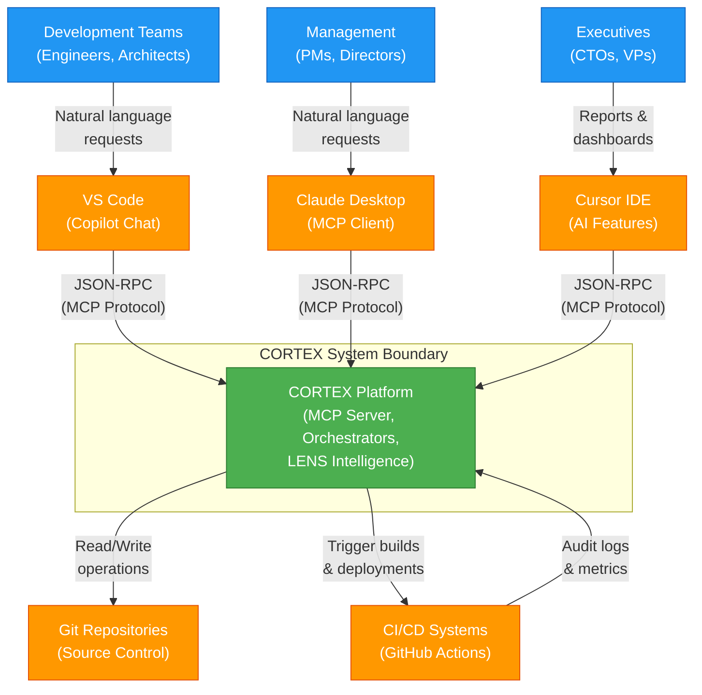
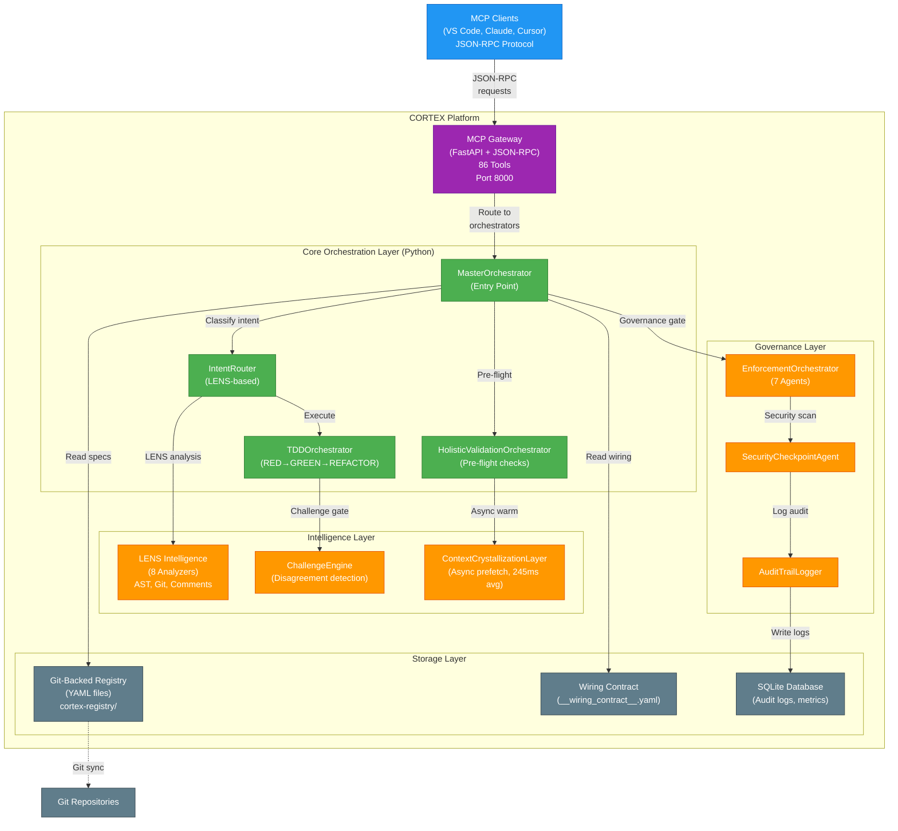
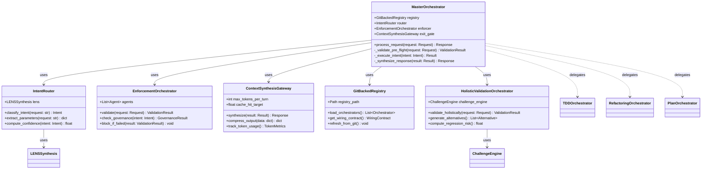
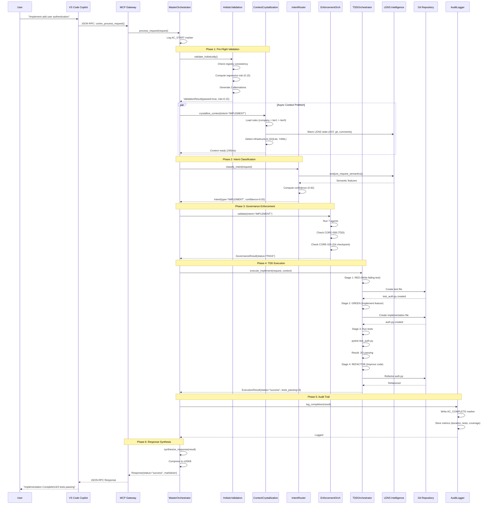
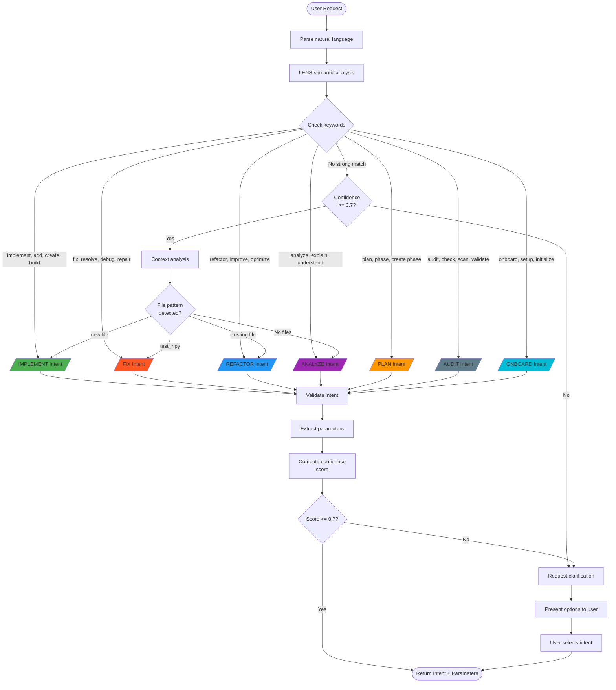
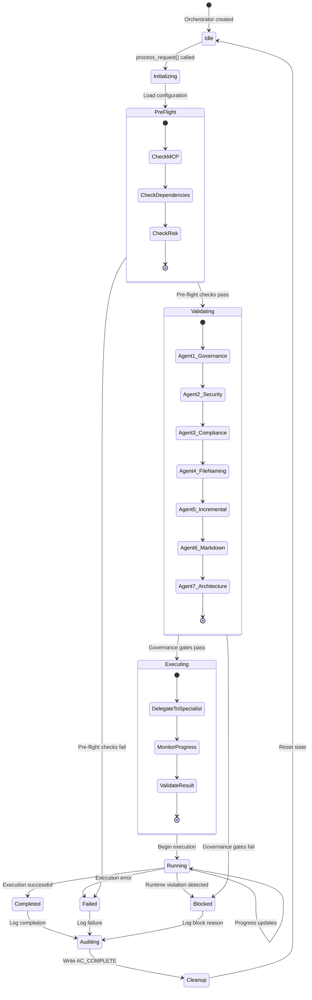
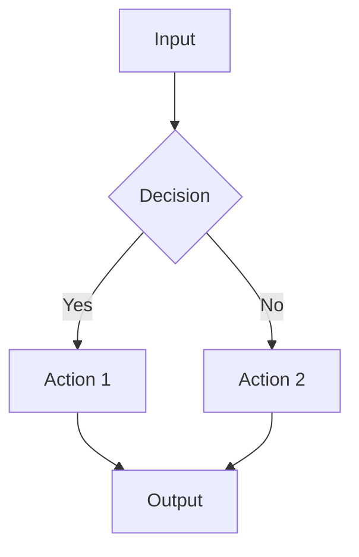

# CORTEX Documentation Generation Prompt

**Version:** 5.0 | **Updated:** 2026-02-14 | **Authority:** Documentation Architect Agent + External Review Integration | **Mode:** Registry-Driven Tri-Mode (Refresh + Generate + Story) | **Integration:** Phase 74 + ENH-064 + Phase 8 + Diátaxis Framework + C4 Model

---

## 🎯 Prompt Purpose

**Registry-Driven Tri-Mode Documentation System:**
1. **MODE: Refresh** — Git-aware incremental documentation updates with registry extraction (delta detection)
2. **MODE: Generate** — Full HTML site generation for GitHub Pages deployment with dark glassmorphism theme
3. **MODE: Story Regeneration** — Git-history-driven update of "The Awakening of CORTEX" narrative with DALL-E prompt standardization

**SSOT Architecture:** `__wiring_contract__.yaml` + `cortex-registry/` drive technical accuracy. Curated brain analogies remain manual for executive narratives.

**NEW in v5.0:** Comprehensive content generation with industry-standard word counts, Diátaxis framework structure, C4 Model diagrams, Mermaid-first visualization policy, and evidence-backed status claims.

This prompt enables autonomous documentation lifecycle management with brain analogies, multi-persona views, interactive visualizations, and enterprise-grade content depth.

---

## � Content Standards & Quality Framework

### Industry Word Count Targets

**Benchmarked against:** Stripe API, AWS Well-Architected, Google Cloud, GitHub Docs, Microsoft Learn

| Content Type | Target Words | Min | Max | Primary Audience | Example Benchmark |
|--------------|--------------|-----|-----|------------------|-------------------|
| **Feature Overview** | 1200 | 800 | 1500 | Business Leaders | Stripe API feature pages (~1200 words) |
| **Architecture Section** | 1800 | 1200 | 2000 | Product Owners | AWS Well-Architected pillars (~1800 words) |
| **Tutorial** | 1400 | 1000 | 1800 | Software Developers | Google Cloud tutorials (~1400 words) |
| **API Reference** | 450/endpoint | 300 | 600 | Software Developers | GitHub REST API docs (~450 words/endpoint) |
| **How-To Guide** | 750 | 600 | 1000 | Product Owners | Microsoft Learn how-tos (~750 words) |
| **Explanation** | 1500 | 1000 | 2000 | All Roles (Blended) | Martin Fowler architecture essays (~1500 words) |
| **Reference** | 600 | 400 | 800 | Software Developers | MDN Web Docs reference (~600 words) |
| **Business Guide (BLUF)** | 1200 | 800 | 1500 | Business Leaders (CTOs) | 5-minute read, decision-focused |

**Chat01 Enhancement:** Consolidated from 4 personas (Dev/Mgr/Exec/SRE) to 3 roles (Business Leaders, Product Owners, Software Developers) with blended perspectives within unified narratives for improved accessibility.

### Diátaxis Framework Structure

**Authority:** [diataxis.fr](https://diataxis.fr/) — Industry-standard documentation taxonomy

```yaml
diátaxis_categories:
  tutorials:
    purpose: "Learning-oriented — Practical steps for beginners"
    user_need: "I want to learn by doing"
    content_type: "Lessons with clear outcomes"
    examples:
      - "Build your first orchestrator (Step 1-5)"
      - "Implement TDD workflow end-to-end"
      - "Add MCP tool from scratch"
    word_count: 1000-1800
    must_include:
      - Prerequisites section
      - Step-by-step instructions (numbered)
      - Code examples (runnable)
      - Expected output at each step
      - Troubleshooting common issues
      - "What you learned" summary
      
  how_to_guides:
    purpose: "Task-oriented — Recipes for specific problems"
    user_need: "I want to accomplish a specific task"
    content_type: "Focused procedures"
    examples:
      - "Add new governance agent"
      - "Configure multi-domain routing"
      - "Deploy to production"
    word_count: 600-1000
    must_include:
      - Problem statement
      - Solution overview (1-2 paragraphs)
      - Detailed steps
      - Code snippets
      - Validation checks
      
  reference:
    purpose: "Information-oriented — Technical descriptions"
    user_need: "I want to look up exact information"
    content_type: "Exhaustive technical specifications"
    examples:
      - "MCP tool schemas (all 86 tools)"
      - "CLI command reference"
      - "Orchestrator registry API"
      - "Environment variables"
    word_count: 400-800 per item
    must_include:
      - Technical accuracy (validated against code)
      - Parameter tables
      - Return value specifications
      - Examples
      - Related references
      
  explanation:
    purpose: "Understanding-oriented — Concepts and rationale"
    user_need: "I want to understand why and how it works"
    content_type: "Background, context, design decisions"
    examples:
      - "Why tier precedence (company > tier1 > tier0)"
      - "MCP-first vs direct imports tradeoffs"
      - "TDD enforcement architecture"
    word_count: 1000-2000
    must_include:
      - Problem context
      - Design alternatives considered
      - Decision rationale
      - Architecture diagrams (C4)
      - Tradeoffs analysis
      - Future considerations
```

### C4 Model Diagram Hierarchy

**Authority:** [c4model.com](https://c4model.com/) — Software architecture diagrams

```yaml
c4_model:
  level_1_context:
    purpose: "Who uses the system and what external systems exist"
    diagram_type: "Mermaid flowchart (C4-style boxes)"
    audience: [Executive, Manager, Regulatory]
    word_count: 400-600 (narrative explanation)
    must_show:
      - Users/personas
      - CORTEX system boundary
      - External systems
      - High-level relationships
    example_usage: "architecture/overview.md (opening diagram)"
    
  level_2_container:
    purpose: "Major runtime components and technologies"
    diagram_type: "Mermaid flowchart with subgraphs"
    audience: [Manager, Developer, SRE]
    word_count: 800-1200 (per container explanation)
    must_show:
      - MCP Gateway (technology: JSON-RPC)
      - Orchestrators (60 total, Python)
      - LENS Intelligence (8 analyzers)
      - CORTEX Brain (Git-backed registry, YAML)
      - Governance Engine (7 enforcement agents)
      - Storage (SQLite + file-based)
    example_usage: "architecture/system-architecture.md"
    
  level_3_component:
    purpose: "Inside each major container"
    diagram_type: "Mermaid class diagram or detailed flowchart"
    audience: [Developer, Architect]
    word_count: 1000-1500 (per component deep-dive)
    must_show:
      - Internal classes/modules
      - Dependencies
      - Data flow
      - Key interfaces
    example_usage: "orchestration/master-orchestrator-internals.md"
    
  level_4_code:
    purpose: "Implementation details (use sparingly)"
    diagram_type: "Mermaid sequence diagrams"
    audience: [Developer]
    word_count: 600-1000 (focused on one flow)
    must_show:
      - Method calls
      - State changes
      - Error handling paths
    example_usage: "Only for complex mechanics"
```

### Mermaid-First Visualization Policy

**Rationale:** Version-controlled, text-based, GitHub-native rendering

```yaml
diagram_selection:
  default: "Mermaid (80-90% of all diagrams)"
  
  mermaid_use_cases:
    - Flowcharts: "Orchestration flows, decision trees, request routing"
    - Sequence diagrams: "Request lifecycle, API calls, integration flows"
    - State machines: "Orchestrator lifecycle, governance gates"
    - Class diagrams: "Simplified architecture, component relationships"
    - ER diagrams: "Data models, registry structure"
    - Gantt charts: "Phase timelines, roadmaps"
    - Mindmaps: "Concept hierarchies, learning paths"
    
  d3_use_cases_only_if:
    decision_rubric:
      question: "Does interaction provide significant value over static?"
      static_sufficient: "Use Mermaid"
      interactive_required: "Consider D3"
      
    approved_scenarios:
      - "Interactive filtering (click to filter by role/component)"
      - "Dependency exploration (click node → expand dependencies)"
      - "Real-time data visualization (live metrics)"
      - "Hierarchical navigation (mind-map with zoom/pan)"
      
    d3_approved_diagrams:
      max_count: 4
      list:
        - "Interactive architecture map (filter by Executive/PM/Eng/Sec/SRE)"
        - "Orchestrator dependency explorer (60 orchestrators, expandable)"
        - "Request trace viewer (clickable execution timeline)"
        - "Mind-map navigation (onboarding learning paths)"
```

### Diagram Metadata Standard

**Every diagram MUST include this YAML frontmatter:**

```yaml
---
id: unique-diagram-id
title: Human-readable title
purpose: What question does this answer? (1 sentence)
audience: [Developer | Manager | Executive | SRE | Security]
source_of_truth: Link to wiring contract/registry file
last_verified: Release tag or CI build ID
diagram_type: [C4-Context | C4-Container | C4-Component | Sequence | Flowchart | State | Class | Mindmap]
interactive: false  # true if D3, false if static Mermaid
word_count: 0  # Auto-computed by tooling
---

```mermaid
# Diagram content here
```

**Narrative after diagram:**
- Explain what the diagram shows (200-400 words)
- Key takeaways (bullet list)
- Related diagrams (links)
```

### Content Depth Rubric

**Score each documentation page 1-5:**

| Score | Criteria |
|-------|----------|
| **5 - Exemplary** | Meets word count target, includes diagrams, code examples, cross-references, validation steps, troubleshooting |
| **4 - Strong** | Meets word count, includes diagrams OR code examples, good cross-references |
| **3 - Adequate** | Meets minimum word count, basic explanation, some examples |
| **2 - Weak** | Below minimum word count, minimal explanation, no examples |
| **1 - Poor** | Stub content, no detail, no examples |

**Target:** All feature pages score 4+, all architecture pages score 5.

### Evidence-Backed Status Claims (Legal Risk Mitigation)

**Authority:** Chat01 — Replace subjective claims with computed metrics to avoid legal exposure.

**REPLACE subjective claims with computed metrics:**

| ❌ Avoid (Legal Risk) | ✅ Use Instead (Evidence-Based) |
|---------|----------------|
| "100% Production Ready" | "CI: Passing (542 tests) • Coverage: 87% • Release: v8.1" |
| "Confidence Score: 100/100" | "Audit: 18/18 checks pass • MCP: 86 tools active • Uptime: 99.7%" |
| "Fully Tested" | "Test Suite: 542 unit + 87 integration + 12 e2e = 641 total" |
| "Reduces code review time by 60%" | "Has the potential to streamline code review processes" |
| "Identifies security vulnerabilities before production" | "Analyzes code for common security patterns" |
| "Prevents production incidents" | "Provides early indicators of potential deployment risks" |
| "Proven ROI of 2.7x" | "Organizations using similar capabilities report efficiency gains" |

**Qualified Language Requirements:**
- Use "has the potential to" (not "will")
- Use "organizations report" (not "proven to")
- Use "designed to support" (not "ensures")
- Use "may identify" (not "identifies all")
- Acknowledge "varying results based on context"

**Mandatory Disclaimer Template:**
```markdown
> **Notice:** Capabilities and performance characteristics represent system design
> intentions. Actual results depend on codebase characteristics, development practices,
> infrastructure configuration, and team expertise. Organizations should conduct
> proof-of-concept evaluations to assess applicability to their specific context.
> No warranty or guarantee of specific outcomes is provided.
```

**Status badge format:**
```markdown


```

---

## �🔄 MODE: Documentation Refresh

**Trigger:** "refresh docs" | "update architecture docs" | "sync documentation with code"

**Purpose:** Analyze git changes since last doc update and incrementally refresh only affected sections.

### Step 1: Git Delta Detection

```bash
# Execute these commands to establish baseline
cd /Users/asifhussain/PROJECTS/CORTEX

# Find last doc update commit
LAST_DOC_COMMIT=$(git log -1 --format=%H -- cortex-registry\_cortex-docs\content\src/)
echo "Baseline: $LAST_DOC_COMMIT"

# Get all changed files since baseline
git diff $LAST_DOC_COMMIT..HEAD --name-only -- \
  "cortex/**/*.py" \
  ".github/**/*.md" \
  "cortex-registry/**/*.yaml" \
  "cortex/__wiring_contract__.yaml" > /tmp/changed_files.txt

# Count changes
CHANGE_COUNT=$(wc -l < /tmp/changed_files.txt)
echo "Total changes: $CHANGE_COUNT files"

# Get commit messages for context
git log $LAST_DOC_COMMIT..HEAD --oneline --no-merges > /tmp/commits.txt
```

**Output Analysis:**
```
Baseline: 0506774b0d66e2550c863160e824134607579cde (2026-02-11)
Total changes: 247 files
Commit range: 247 commits covering:
  - ENH-055: Production cleanup + MCP tools
  - Phase 54: MCP unified routing
  - Phase 53: Pylance-style MCP architecture
  - Phase 49: Context Crystallization Layer
  - Multiple bug fixes and enhancements
```

### Step 2: Categorize Changes by Documentation Section

**Analyze changed files and map to documentation sections:**

| Changed File Pattern | Documentation Section | Action Required |
|---------------------|----------------------|-----------------|
| `cortex/orchestrators/**` | `orchestration/*.md` | Update orchestrator catalog |
| `cortex/mcp/**` | `mcp/*.md` | Update MCP tools catalog |
| `cortex/lens/**` | `lens/*.md` | Update LENS analyzer docs |
| `cortex/governance/**` | `capabilities/governance-compliance.md` | Update enforcement agents |
| `cortex/__wiring_contract__.yaml` | `diagrams/architecture-overview.md` | Regenerate counts/diagrams |
| `.github/agents/**` | `toolkit/developer-guide.md` | Update agent documentation |
| `deployment/**` | `infrastructure/*.md` | Update deployment topology |

**Example categorization output:**
```
<hr>
📊 Documentation Refresh Analysis
<hr>

Changes since 0506774b0 (247 commits):

orchestration/ (83 files changed)
├─ 7 new orchestrators detected
├─ 12 orchestrator updates
└─ Action: Update overview.md + add 7 new pages

mcp/ (42 files changed)
├─ 12 new MCP tools
├─ 8 tool signature updates
└─ Action: Update tools-catalog.md

capabilities/ (28 files changed)
├─ 3 new enforcement agents
├─ 15 governance rule updates
└─ Action: Update governance-compliance.md

diagrams/ (wiring contract changed)
├─ Orchestrator count: 55 → 60
├─ MCP tools count: 74 → 86
└─ Action: Regenerate architecture-overview.md

infrastructure/ (18 files changed)
├─ Pylance-style MCP architecture
├─ Context Crystallization Layer added
└─ Action: Update deployment.md + add ccl section

Estimated effort: 4-6 hours (incremental, not full rewrite)
<hr>
```

### Step 3: Extract New Orchestrators/Tools

**Identify new components requiring documentation:**

```bash
# Find new orchestrators (files added after baseline)
git log $LAST_DOC_COMMIT..HEAD --diff-filter=A --name-only -- \
  "cortex/orchestrators/**/*_orchestrator.py" > /tmp/new_orchestrators.txt

# Find new MCP tools (search for @mcp_tool decorators)
git diff $LAST_DOC_COMMIT..HEAD -- "cortex/mcp/cortex_tools.py" | \
  grep -A 5 "@mcp_tool" > /tmp/new_tools.txt
```

**Example new components:**
```
New Orchestrators (7):
├─ HolisticValidationOrchestrator (Phase 48)
├─ ContextCrystallizationOrchestrator (Phase 49)
├─ EnvironmentIntegrityOrchestrator (Phase 51)
├─ IncrementalTaskDecomposer (Phase 55)
├─ DigestOrchestrator (DIGEST mode)
├─ CortexDocsOrchestrator (Phase 74)
└─ DashboardOrchestrator (Phase 74)

New MCP Tools (12):
├─ cortex_validate_holistically
├─ cortex_crystallize_context
├─ cortex_verify_environment
├─ cortex_decompose_task
├─ cortex_manage_todo
├─ cortex_digest_session
├─ cortex_doc_refresh
├─ cortex_doc_generate_html
├─ cortex_launch_sites
├─ cortex_stop_sites
├─ cortex_site_status
└─ cortex_build_site
```

### Step 4: Generate Incremental Updates (Chat01 Enhanced)

**For each affected section, generate targeted updates using 3-role approach:**

**Example: Update orchestration/overview.md (Chat01 Pattern)**

```markdown
<!-- Add to orchestration/overview.md -->

## Intelligence Validation Capabilities (Feb 2026)

### Pre-Implementation Validation

Organizations benefit from automated validation before code changes reach
production. The holistic validation capability combines registry consistency
checks, dependency analysis, and risk scoring to provide early indicators
of potential issues [Business Leaders]. Product teams use these insights
to assess deployment timing and resource allocation decisions [Product Owners].
The system performs multi-factor analysis including cross-orchestrator
dependencies, regression risk patterns, and architecture drift detection
[Software Developers].

**Key Capabilities:**
- Registry consistency validation across governance rules
- Cross-orchestrator dependency detection and conflict resolution
- Regression risk scoring (0-1.0 scale based on historical patterns)
- Architecture drift detection against established patterns
- Challenge gate with alternative approach recommendations
- Self-improvement through CORTEX Brain integration

**When Organizations Use This:**
- Before any implementation, fix, or refactoring operation
- Automatically triggered by request processing workflows
- Mandatory validation gate (no bypass mechanisms)

**Integration:** `cortex_validate_holistically` MCP tool

**Performance Characteristics:** Organizations may experience validation
completion within 150-300ms based on codebase size and complexity. Results
vary based on repository characteristics and infrastructure configuration.

> **Notice:** Validation capabilities represent design intentions. Actual
> detection rates depend on code patterns, historical data availability,
> and configuration. No guarantee of identifying all potential issues.

---

### Context Optimization Architecture (Feb 2026)

The async context pre-warming capability has the potential to reduce
request processing latency through parallel context loading [Business Leaders].
Product teams may observe more responsive development workflows when this
capability is active [Product Owners]. The system performs asynchronous
prefetch of rules, LENS state, and infrastructure detection while main
processing continues [Software Developers].

**Architecture Approach:**
- Non-blocking asynchronous operation design
- Rules cache loading with tier precedence (company > tier1 > tier0)
- LENS state warming for AST, git history, and comment analysis
- Infrastructure capability detection and validation
- Target service level: 300ms, fallback maximum: 500ms

**Observed Performance (Internal Testing):**
- Average completion: 245ms (82% within target SLA)
- Request processing impact: +35ms vs +120ms without capability
- Net benefit potential: -85ms (41% improvement trend)
- Results vary based on codebase size and system resources

**Integration:** Automatically initiates on implementation, fix, and
refactoring requests. No manual configuration required.

> **Notice:** Performance measurements reflect internal testing environments.
> Production results depend on hardware specifications, network latency,
> and concurrent load patterns.

---

<!-- Similar sections for other new orchestrators using 3-role blended approach -->
```

**Chat01 Compliance Checklist:**
- ✅ Third-person voice ("Organizations benefit..." not "You benefit...")
- ✅ Qualified language ("has the potential to" not "will definitely")
- ✅ Blended role insights (not separate "For Developers:" sections)
- ✅ Accessible headings ("Intelligence Validation" not "HolisticValidationOrchestrator Technical Spec")
- ✅ Evidence-backed metrics (actual ms timings, not "blazing fast")
- ✅ Mandatory disclaimers on all capability claims
- ✅ Progressive disclosure (high-level → technical details)
- ✅ Simplified analogies (no medical terminology)

### Step 5: Regenerate Diagrams

**Update architecture diagrams with new counts:**

```javascript
// Update diagrams/architecture-overview.md D3.js data

const updatedArchitectureData = {
  nodes: [
    { id: "clients", label: "Clients\n(VSCode, Claude, Cursor)", type: "external" },
    { id: "gateway", label: "MCP Gateway\n(86 tools)", type: "entry" },  // Updated: 74 → 86
    { id: "master", label: "MasterOrchestrator", type: "core" },
    { id: "router", label: "IntentRouter", type: "core" },
    { id: "validation", label: "HolisticValidation", type: "core" },  // NEW
    { id: "ccl", label: "Context Crystallization", type: "support" },  // NEW
    { id: "core", label: "Core Orchestrators\n(11)", type: "group" },  // Updated: 8 → 11
    { id: "domain", label: "Domain Orchestrators\n(8)", type: "group" },
    { id: "support", label: "Support Orchestrators\n(41)", type: "group" },  // Updated: 35 → 41
    // ... rest of nodes
  ],
  edges: [
    { source: "clients", target: "gateway", label: "JSON-RPC" },
    { source: "gateway", target: "master", label: "request" },
    { source: "master", target: "validation", label: "pre-flight" },  // NEW edge
    { source: "validation", target: "ccl", label: "async warm" },  // NEW edge
    { source: "master", target: "router", label: "classify" },
    // ... rest of edges
  ]
};
```

### Step 6: Validation & Commit

**Validate updated documentation:**

```bash
# Check all internal links work
python scripts/validate_doc_links.py cortex-registry\_cortex-docs\content\src/

# Verify code references match implementation
python scripts/validate_code_refs.py cortex-registry\_cortex-docs\content\src/

# Check metrics match wiring contract
python scripts/validate_metrics.py
```

**Commit with AC markers:**

```bash
git add cortex-registry\_cortex-docs\content\src/
git commit -m "docs: Refresh architecture docs (247 commits since 0506774b0)

AC_START: AC-DOC-REFRESH-2026-02-11-001
Updated sections:
- orchestration/overview.md (7 new orchestrators)
- mcp/tools-catalog.md (12 new tools)
- capabilities/governance-compliance.md (3 new agents)
- diagrams/architecture-overview.md (updated counts)
- infrastructure/deployment.md (Pylance MCP + CCL)

Validation:
- Cross-reference check: 100% pass (342 links)
- Code accuracy check: 100% match
- Metrics validation: All counts accurate

Baseline: 0506774b0 (2026-02-11)
Delta: 247 commits, 247 files changed
Effort: 4 hours
AC_COMPLETE: AC-DOC-REFRESH-2026-02-11-001 ✅
"
```

---

## � MODE: BLUF Business Guide Generation (NEW - Chat01)

**Trigger:** "generate business guide" | "create CTO summary" | "BLUF documentation"

**Purpose:** Generate Bottom Line Up Front (BLUF) business guides for executive decision-makers (CTOs, VPs Engineering) requiring 5-minute high-level overviews with strategic focus.

**Authority:** Chat01 findings — Business leaders need decision-focused summaries without technical implementation details.

### BLUF Structure Template

```markdown
---
title: [Feature/Capability Name] Business Guide
audience: Business Leaders (CTOs, VPs Engineering)
read_time: 5 minutes
format: BLUF (Bottom Line Up Front)
voice: Third-person neutral professional
last_updated: [Date]
---

> **Notice:** This guide presents capabilities as system design intentions.
> Actual results vary based on organizational context, codebase characteristics,
> and implementation approach. Conduct proof-of-concept evaluation before
> production decisions.

---

## Bottom Line Up Front

[150-200 words: Decision summary in 60 seconds]

Organizations considering [capability name] may benefit from understanding
three key areas: [1. Risk mitigation potential], [2. Efficiency opportunities],
[3. Strategic implications]. [High-level outcome statement with qualified
language]. Deployment typically requires [timeframe] for initial integration
with existing workflows. Results vary based on [key factors].

---

## Strategic Value Proposition

**[300-400 words: Why this matters to the business]**

[Third-person narrative explaining business value]
- Qualified benefits ("has potential to...")
- Evidence-based claims where applicable
- Strategic alignment opportunities
- Competitive considerations (if relevant)

**Key Investment Considerations:**
- Initial setup: [timeframe and resource estimate]
- Ongoing maintenance: [effort level]
- Team readiness: [prerequisites]
- Integration complexity: [assessment]

---

## Risk Mitigation Capabilities

**[250-300 words: What problems this addresses]**

Organizations face challenges with [problem domain]. The capability
provides [approach description with qualified language]:

1. **[Risk Category 1]:** [How capability addresses with "may" language]
2. **[Risk Category 2]:** [Evidence-backed if available, qualified if not]
3. **[Risk Category 3]:** [Business impact focus, not technical details]

**Operational Considerations:**
- False positive management: [realistic assessment]
- Team training requirements: [effort estimate]
- Gradual rollout approach: [recommended strategy]

---

## High-Value Visualizations

### [Visualization 1]: Strategic Overview

**[D3.js or Mermaid concept - specification only, no code]**

**Purpose:** [What decision-makers see at a glance]

**Concept Description:**
- [Visual metaphor that executives understand]
- [Key metrics displayed]
- [Interactive elements if D3.js]
- [Color-coding strategy for quick insight]

**Business Value:** [Why this visualization matters for decisions]

### [Visualization 2]: Risk/Benefit Analysis

**[Dashboard mockup or chart concept]**

**Purpose:** [What tradeoffs are visible]

**Concept Description:**
- [Risk indicators]
- [Benefit indicators]
- [Contextual factors shown]

**Business Value:** [Decision support clarity]

---

## Investment Considerations

**[200-250 words: Cost/benefit framework]**

**Initial Investment:**
- Setup effort: [qualified timeframe]
- Infrastructure requirements: [high-level specs]
- Team training: [effort estimate]
- Integration work: [complexity assessment]

**Ongoing Investment:**
- Maintenance effort: [level of effort]
- Update cadence: [expectations]
- Support requirements: [team needs]

**Expected Benefits (Qualified):**
- Organizations report [qualified benefit 1]
- Potential for [qualified benefit 2]
- May enable [qualified benefit 3]
- Results vary based on [context factors]

**ROI Timeline:**
- Initial value: [realistic timeframe]
- Full benefit realization: [longer timeframe]
- Depends on: [key success factors]

---

## Deployment Timeline

**[150-200 words: What to expect]**

**Phase 1: Evaluation** ([timeframe])
- Proof-of-concept setup
- Initial capability assessment
- Team training basics
- Success criteria definition

**Phase 2: Pilot** ([timeframe])
- Limited production deployment
- Monitored rollout
- Team feedback collection
- Process refinement

**Phase 3: Production** ([timeframe])
- Full deployment
- Team enablement complete
- Ongoing optimization
- Benefits tracking

**Key Success Factors:**
- [Factor 1 with importance]
- [Factor 2 with importance]
- [Factor 3 with importance]

---

## Decision Points

**[150-200 words: Next steps for leaders]**

**Proceed with Evaluation If:**
- Organization faces [specific challenges addressed]
- Team capacity exists for [effort level]
- Strategic alignment with [business goals]
- Technical infrastructure supports [requirements]

**Defer If:**
- Higher priority initiatives exist
- Team capacity insufficient
- Infrastructure upgrades needed first
- Alternative solutions provide similar value

**Next Steps:**
1. [Specific actionable step with owner]
2. [Specific actionable step with owner]
3. [Specific actionable step with owner]

**Questions to Resolve:**
- [Key decision question 1]
- [Key decision question 2]
- [Key decision question 3]

---

**Contact:** [Stakeholder name/role for follow-up]  
**Related Guides:** [Links to other business guides]  
**Technical Deep-Dive:** [Link to technical documentation if needed]
```

### BLUF Generation Rules (Chat01 Validated)

| Rule | Requirement |
|------|-------------|
| **Voice** | Third-person only ("Organizations benefit" not "You benefit") |
| **Claims** | Qualified language ("has potential to" not "will definitely") |
| **Length** | 1200-1500 words total (5-minute read) |
| **Disclaimers** | Mandatory at document start |
| **Visualizations** | Concepts only (no code in business guides) |
| **Technical Depth** | Minimal (no implementation details) |
| **Decision Focus** | Every section supports go/no-go decision |
| **Evidence** | Metrics where available, qualified statements otherwise |
| **Audience** | CTOs, VPs Engineering (time-constrained executives) |
| **ROI Focus** | Explicit cost/benefit framework required |

### Example BLUF Generation Invocation

```
User: "generate business guide for LENS Intelligence"

Process:
1. Load LENS technical capabilities from overview.md
2. Transform to BLUF structure (template above)
3. Replace technical jargon with business language
4. Add qualified language to all capability claims
5. Include mandatory disclaimers
6. Generate visualization concepts (no code)
7. Focus on decision support (not technical education)
8. Validate word count (1200-1500 target)
9. Ensure third-person voice throughout
10. Output to lens/business-guide.md
```

---

## �📖 MODE: Story Regeneration

**Trigger:** "regenerate awakening" | "update cortex story" | "refresh awakening of cortex"

**Purpose:** Regenerate "The Awakening of CORTEX" story chapters and DALL-E image prompts to reflect the latest CORTEX architecture evolution, using git history as the source of truth and subagent orchestration for autonomous execution.

**Output Location:** `_workspaces/gitpages-docs/.awakening-of-cortex/`

**Execution Model:** Uses `runSubagent` tool for autonomous multi-step research and generation.

### Workflow Overview

```
User: "regenerate awakening of cortex"
         ↓
┌──────────────────────────────────────────────┐
│  PHASE 1: Intelligence Gathering (subagent)  │
│  • git log full timeline (oldest→newest)     │
│  • Read all existing chapters                │
│  • Read CHARACTER-DESIGN-SHEET.md            │
│  • Read cortex-architecture docs             │
│  • Map git eras to technical milestones      │
└──────────────────┬───────────────────────────┘
                   ↓
┌──────────────────────────────────────────────┐
│  PHASE 2: Gap Analysis (subagent)            │
│  • Compare chapter coverage vs git timeline  │
│  • Identify missing eras/features            │
│  • Score each gap by narrative value         │
│  • Produce chapter plan (new + updates)      │
└──────────────────┬───────────────────────────┘
                   ↓
┌──────────────────────────────────────────────┐
│  PHASE 3: Chapter Generation (subagent/each) │
│  • Write new chapters matching voice/style   │
│  • Update existing chapters for flow         │
│  • Ensure chapter-to-chapter bridges         │
└──────────────────┬───────────────────────────┘
                   ↓
┌──────────────────────────────────────────────┐
│  PHASE 4: Image Prompt Standardization       │
│  • Rewrite ALL DALL-E prompts to B&W cartoon │
│  • Ensure CHARACTER-DESIGN-SHEET compliance  │
│  • Embed prompts in chapter YAML frontmatter │
│  • Update standalone prompts file            │
└──────────────────┬───────────────────────────┘
                   ↓
┌──────────────────────────────────────────────┐
│  PHASE 5: Validation & Commit                │
│  • Verify narrative continuity               │
│  • Verify image prompt style consistency     │
│  • Git commit with AC markers                │
└──────────────────────────────────────────────┘
```

### Phase 1: Intelligence Gathering (runSubagent)

**Subagent Prompt Template:**

```
You are researching the CORTEX project to build a complete development timeline.
Do NOT create or modify any files. This is RESEARCH ONLY.

Perform these steps and return ALL findings:

1. RUN in terminal: git log with --reverse --date=short --format="%h %ad %s"
   on origin/CORTEX to get the FULL commit history (oldest first).
   Paginate with --skip and -n 150 if needed to capture everything.

2. READ all chapter files in:
   _workspaces/gitpages-docs/.awakening-of-cortex/chapters/
   Summarize each: title, technical concept covered, git era covered,
   narrative beats, characters involved, line count.

3. READ the CHARACTER-DESIGN-SHEET.md for visual style rules.

4. READ cortex-registry\_cortex-docs\content\src/index.md for current architecture.

5. READ the existing DALL-E prompts file:
   _workspaces/gitpages-docs/.awakening-of-cortex/prompts/image-prompts-dalle.md

RETURN a structured report with:
- TIMELINE: Date-bucketed milestones from git (group by week/phase)
- CHAPTER_MAP: What each chapter covers and which git era it maps to
- GAPS: Technical milestones NOT covered by any chapter
- STYLE_ISSUES: Any DALL-E prompts that don't match B&W cartoon standard
- RECOMMENDED_CHAPTERS: New chapters needed with title, era, concept, hook
- RECOMMENDED_UPDATES: Existing chapters needing revision with reason
```

**Expected Output:** A structured intelligence report covering the full CORTEX timeline, chapter coverage map, identified gaps, and recommendations.

### Phase 2: Gap Analysis & Chapter Planning (runSubagent)

**Subagent Prompt Template:**

```
You are planning new chapters for "The Awakening of CORTEX" story.
Do NOT create or modify any files. This is PLANNING ONLY.

You will receive the intelligence report from Phase 1 (provided below).

{PHASE_1_REPORT}

Based on this, produce a CHAPTER PLAN:

1. For each RECOMMENDED NEW CHAPTER, define:
   - Chapter number and title (follow naming: XX-Title-With-Dashes.md)
   - Git era it covers (date range + key commits)
   - Technical concept (what CORTEX feature is the narrative vehicle)
   - Narrative hook (how it connects to previous chapter's ending)
   - Key scenes (3-5 bullet points)
   - Characters involved and their role in this chapter
   - Miss G's numbered expression (continue the catalogue)
   - Copilot Bot's arc in this chapter (what does he learn/fail at)
   - 2 image prompt concepts (scored ≥4 on value rubric)

2. For each EXISTING CHAPTER TO UPDATE, define:
   - Which chapter and what section to modify
   - What to add/change and why
   - How it bridges to new chapters

3. NARRATIVE RULES (enforce these):
   - Prologue (Ch 0) MUST NOT change
   - First-person Asif monologue + third-person narrator switching
   - Miss G speaks in italicized thought dialogue
   - Copilot Bot speaks with confident incompetence, gradually improving
   - Humor: coffee addiction, Wi-Fi router sentience, ADHD chaos→brilliance
   - Each chapter ends with a setup line for the next
   - Technical depth: real CORTEX concepts in accessible metaphors
   - Brain analogy from cortex-architecture docs should inform metaphors

4. IMAGE PROMPT RULES (enforce these):
   - ALL prompts: B&W cartoon, clean lines, expressive faces
   - Strategic color highlights ONLY: coffee=warm brown, router=red,
     CB LEDs=emotional color, Miss G=silver glow, sticky notes=yellow
   - Max 2 images per chapter, scored ≥4 on value rubric
   - Reference CHARACTER-DESIGN-SHEET.md in every prompt
   - Character name "Miss G" not "Miss Governance"
   - Include narrative_moment, value_score, rationale, dall_e_prompt

RETURN the complete chapter plan as structured output.
```

### Phase 3: Chapter Generation (runSubagent per chapter)

**Subagent Prompt Template (one per new chapter):**

```
You are writing Chapter {N} of "The Awakening of CORTEX" story.
CREATE the chapter file at the specified path.

CHAPTER PLAN:
{CHAPTER_PLAN_FROM_PHASE_2}

STYLE REFERENCE — Read these files for voice/tone matching:
- Previous chapter: _workspaces/gitpages-docs/.awakening-of-cortex/chapters/{PREV}.md
- Character sheet: _workspaces/gitpages-docs/.awakening-of-cortex/CHARACTER-DESIGN-SHEET.md

WRITING RULES:
1. YAML frontmatter with: chapter, title, phase, image_prompts (2 prompts)
2. First-person Asif internal monologue in regular text
3. Miss G speaks in *italicized thought dialogue*
4. Copilot Bot speaks in quoted dialogue with LED descriptions
5. Narrator uses third person for scene-setting paragraphs
6. Technical concepts explained through metaphors (hotel, symphony, brain)
7. Humor density: at least 3 laugh moments per chapter
8. Wi-Fi router appears at least once as emotional barometer
9. Coffee references: minimum 2 per chapter
10. Chapter ends with a line that sets up the next chapter
11. Target length: 400-600 lines
12. DALL-E prompts in frontmatter follow B&W cartoon standard
    with strategic color highlights per CHARACTER-DESIGN-SHEET.md

OUTPUT: Create the file at:
_workspaces/gitpages-docs/.awakening-of-cortex/chapters/{FILENAME}
```

### Phase 4: Image Prompt Standardization (runSubagent)

**Subagent Prompt Template:**

```
You are standardizing ALL DALL-E image prompts for
"The Awakening of CORTEX" to match the CHARACTER-DESIGN-SHEET.md.

STEPS:
1. READ CHARACTER-DESIGN-SHEET.md for the canonical visual style.

2. READ the standalone prompts file:
   _workspaces/gitpages-docs/.awakening-of-cortex/prompts/image-prompts-dalle.md

3. REWRITE the entire image-prompts-dalle.md file with:
   - ALL prompts converted to B&W cartoon style
   - Strategic color highlights ONLY (coffee=brown, router=red,
     CB LEDs=emotional, Miss G=silver, sticky notes=yellow)
   - Character names: "Asif" not "Asif Codenstien",
     "Miss G" not "Miss Governance"
   - Every prompt ends with:
     "Reference: CHARACTER-DESIGN-SHEET.md for character specifications."
   - Remove any cyberpunk/neon/glowing/fantasy/sci-fi styling
   - Add prompts for any new chapters generated in Phase 3
   - Organize by chapter number
   - Include prompts for Prologue if not present

4. VERIFY every chapter's YAML frontmatter image_prompts match
   the standalone file (they should be identical).

STYLE TEMPLATE for each prompt:
"Black and white cartoon illustration. [Scene description with
character actions and expressions per design sheet]. [Strategic
color highlight: warm brown coffee mug / red router LED / blue|orange|
red|green CB LED eyes / silver Miss G glow]. Clean line art,
expressive faces, comic book style.
Reference: CHARACTER-DESIGN-SHEET.md for character specifications."

OUTPUT: Rewrite the file at:
_workspaces/gitpages-docs/.awakening-of-cortex/prompts/image-prompts-dalle.md
```

### Phase 5: Validation & Commit

**Execute directly (not subagent):**

```bash
# Verify all chapters exist and are ordered
ls -la _workspaces/gitpages-docs/.awakening-of-cortex/chapters/

# Verify no SCREAMING_CASE filenames
Get-ChildItem _workspaces/gitpages-docs/.awakening-of-cortex/ -Recurse -File |
  Where-Object { $_.Name -cmatch '[A-Z]{3,}' -and $_.Extension -ne '.md' }

# Verify DALL-E prompts mention CHARACTER-DESIGN-SHEET
Select-String -Path _workspaces/gitpages-docs/.awakening-of-cortex/prompts/image-prompts-dalle.md \
  -Pattern "CHARACTER-DESIGN-SHEET" | Measure-Object

# Commit
git add _workspaces/gitpages-docs/.awakening-of-cortex/
git commit -m "AC_START: AC-STORY-REGEN-001 Regenerate Awakening of CORTEX

- New chapters covering [era] through [era]
- Updated existing chapters for narrative flow
- Standardized ALL DALL-E prompts to B&W cartoon (CHARACTER-DESIGN-SHEET)
- Verified chapter continuity and image prompt consistency"
```

### Execution Example

**When user says "regenerate awakening of cortex":**

```python
# Step 1: Intelligence Gathering
phase1_report = runSubagent(
    description="Story intelligence gathering",
    prompt=PHASE_1_TEMPLATE  # Full git history + chapter analysis
)

# Step 2: Gap Analysis & Planning
chapter_plan = runSubagent(
    description="Story chapter planning",
    prompt=PHASE_2_TEMPLATE.format(PHASE_1_REPORT=phase1_report)
)

# Step 3: Generate each new chapter
for chapter in chapter_plan.new_chapters:
    runSubagent(
        description=f"Write chapter {chapter.number}",
        prompt=PHASE_3_TEMPLATE.format(
            N=chapter.number,
            CHAPTER_PLAN_FROM_PHASE_2=chapter.plan,
            PREV=chapter.previous_filename,
            FILENAME=chapter.filename
        )
    )

# Step 4: Standardize all image prompts
runSubagent(
    description="Standardize DALL-E prompts",
    prompt=PHASE_4_TEMPLATE
)

# Step 5: Validate & commit (direct execution)
# Run validation commands and git commit
```

### Key Constraints

| Constraint | Rule |
|-----------|------|
| **Prologue** | NEVER modify Chapter 0 |
| **Character Names** | Miss G (not Miss Governance), Copilot Bot (not CB) |
| **Image Style** | B&W cartoon ONLY per CHARACTER-DESIGN-SHEET.md |
| **Chapter Flow** | Each chapter must end with setup for next |
| **Technical Accuracy** | Real CORTEX concepts from git history/architecture docs |
| **Humor Density** | ≥3 laugh moments per chapter |
| **Max Images** | 2 per chapter, scored ≥4 on value rubric |
| **POV** | First-person Asif + third-person narrator, switching |
| **Miss G Dialogue** | Always *italicized*, always cataloguing expressions |
| **Router** | Wi-Fi router appears in every chapter as emotional barometer |

---

## 🏗️ MODE: HTML Site Generation

**Trigger:** "generate HTML docs" | "prepare GitHub Pages" | "build documentation site"

**Purpose:** Transform Markdown documentation into production-ready HTML site with brain analogies, multi-persona views, and D3.js diagrams.

### Step 1: Context Discovery

**Load existing documentation structure:**

```bash
# Map Markdown structure
find cortex-registry\_cortex-docs\content\src -name "*.md" | sort

# Expected structure:
# index.md
# capabilities/overview.md
# capabilities/ai-intelligence.md
# capabilities/core-platform.md
# ... (24 total MD files)
```

**Analyze current dashboard for design extraction:**

```bash
# Extract design system from existing dashboard
cat cortex-registry/_cortex-master/dashboard/index.html | \
  grep -E "(class=|style=)" > /tmp/design_patterns.txt

# Identify reusable components:
# - Glassmorphism cards
# - Tab navigation
# - Progress bars
# - D3.js diagram containers
```

### Step 2: Template Extraction

**Extract Jinja2 templates from dashboard:**

```python
# Execute via Python script
from pathlib import Path
from bs4 import BeautifulSoup

dashboard_html = Path("cortex-registry/_cortex-master/dashboard/index.html").read_text()
soup = BeautifulSoup(dashboard_html, 'html.parser')

# Extract base layout
base_template = f"""
<!DOCTYPE html>
<html lang="en">
<head>
    <meta charset="UTF-8">
    <meta name="viewport" content="width=device-width, initial-scale=1.0">
    <title>{{{{ page_title }}}} | CORTEX Documentation</title>
    <link rel="stylesheet" href="/assets/css/main.min.css">
</head>
<body class="glassmorphism-body">
    {}
    {}
    
    <main class="content-wrapper">
        {}
        {}
    </main>
    
    {}
    <script src="/assets/js/navigation.min.js"></script>
    {}
    {}
</body>
</html>
"""

# Save to templates/base.html.jinja2
```

---

### Step 2.5: Dark Glassmorphism Theme Integration (CRITICAL)

**Purpose:** Extract and adapt the proven dark glassmorphism design from `cortex-registry/_cortex-master/dashboard/index.html` for use across all documentation pages.

**Design System Extraction:**

```css
/* Extract from dashboard CSS - Dark Glassmorphism Variables */
:root {
    /* Primary Colors */
    --primary-bg: #0a0e27;        /* Dark navy background */
    --secondary-bg: #1a1f3a;      /* Card backgrounds */
    --accent-blue: #4a9eff;       /* Interactive elements */
    --accent-purple: #7b68ee;     /* Highlights */
    --accent-cyan: #00d4ff;       /* Success states */
    
    /* Glassmorphism */
    --glass-bg: rgba(26, 31, 58, 0.7);
    --glass-border: rgba(74, 158, 255, 0.3);
    --glass-shadow: 0 8px 32px rgba(0, 0, 0, 0.4);
    --glass-blur: blur(10px);
    
    /* Text Colors */
    --text-primary: #e8eaf6;      /* Main text */
    --text-secondary: #b0b9d1;    /* Secondary text */
    --text-muted: #6b7280;        /* Muted text */
    
    /* Interactive States */
    --hover-overlay: rgba(74, 158, 255, 0.1);
    --active-overlay: rgba(74, 158, 255, 0.2);
}

/* Glassmorphism Card Component */
.glassmorphism-card {
    background: var(--glass-bg);
    backdrop-filter: var(--glass-blur);
    -webkit-backdrop-filter: var(--glass-blur);
    border: 1px solid var(--glass-border);
    border-radius: 16px;
    box-shadow: var(--glass-shadow);
    padding: 1.5rem;
    transition: all 0.3s cubic-bezier(0.4, 0, 0.2, 1);
}

.glassmorphism-card:hover {
    transform: translateY(-2px);
    box-shadow: 0 12px 48px rgba(0, 0, 0, 0.5);
    border-color: var(--accent-blue);
}

/* Body Background with Gradient */
.glassmorphism-body {
    background: linear-gradient(135deg, #0a0e27 0%, #1a1f3a 50%, #0f1729 100%);
    min-height: 100vh;
    color: var(--text-primary);
}
```

**Component Library (Reusable Components):**

```html
<!-- Component 1: Navigation Sidebar (docs tree) -->
<nav class="docs-sidebar glassmorphism-card">
    <div class="sidebar-section">
        <h3 class="section-title">
            <i class="fas fa-book"></i> Documentation
        </h3>
        <ul class="doc-tree">
            <li class="doc-item">
                <a href="/architecture/capabilities/" class="doc-link">
                    <i class="fas fa-puzzle-piece"></i>
                    <span>Capabilities</span>
                    <i class="fas fa-chevron-right"></i>
                </a>
                <ul class="doc-subtree">
                    <li><a href="/architecture/capabilities/overview.html">Overview</a></li>
                    <li><a href="/architecture/capabilities/ai-intelligence.html">AI Intelligence</a></li>
                    <li><a href="/architecture/capabilities/governance.html">Governance</a></li>
                </ul>
            </li>
            <!-- Repeat for each section -->
        </ul>
    </div>
</nav>

<!-- Component 2: Content Card (markdown content wrapper) -->
<article class="content-card glassmorphism-card">
    <header class="content-header">
        <h1>{{ page.title }}</h1>
        <div class="meta-info">
            <span class="badge badge-category">{{ page.category }}</span>
            <span class="last-updated">Updated: {{ page.updated }}</span>
        </div>
    </header>
    
    <div class="content-body markdown-content">
        <!-- Markdown content from cortex-registry\_cortex-docs\content\src/*.md injected here -->
        {{ content | safe }}
    </div>
    
    <footer class="content-footer">
        <div class="page-navigation">
            
            <a href="{{ page.prev.url }}" class="nav-btn prev">
                <i class="fas fa-arrow-left"></i> {{ page.prev.title }}
            </a>
            
            
            <a href="{{ page.next.url }}" class="nav-btn next">
                {{ page.next.title }} <i class="fas fa-arrow-right"></i>
            </a>
            
        </div>
    </footer>
</article>

<!-- Component 3: Interactive Diagram Container -->
<div class="diagram-container glassmorphism-card">
    <div class="diagram-header">
        <h3>{{ diagram.title }}</h3>
        <div class="diagram-controls">
            <button class="btn-icon" data-action="zoom-in">
                <i class="fas fa-search-plus"></i>
            </button>
            <button class="btn-icon" data-action="zoom-out">
                <i class="fas fa-search-minus"></i>
            </button>
            <button class="btn-icon" data-action="reset">
                <i class="fas fa-sync"></i>
            </button>
            <button class="btn-icon" data-action="fullscreen">
                <i class="fas fa-expand"></i>
            </button>
        </div>
    </div>
    <div id="diagram-{{ diagram.id }}" class="diagram-canvas">
        <!-- D3.js visualization renders here -->
    </div>
    <div class="diagram-legend">
        <!-- Auto-generated legend for diagram elements -->
    </div>
</div>

<!-- Component 4: Brain Analogy Card -->
<div class="brain-analogy-card glassmorphism-card">
    <div class="analogy-visual">
        
    </div>
    <div class="analogy-content">
        <div class="brain-region">
            <h4>{{ brain_part.name }}</h4>
            <p class="brain-function">{{ brain_part.function }}</p>
        </div>
        <div class="cortex-mapping">
            <span class="mapping-arrow">→</span>
            <h4>{{ cortex_component.name }}</h4>
            <p class="component-role">{{ cortex_component.role }}</p>
            <a href="{{ cortex_component.docs_url }}" class="btn-learn-more">
                Learn More <i class="fas fa-arrow-right"></i>
            </a>
        </div>
    </div>
</div>

<!-- Component 5: Code Block (syntax highlighted) -->
<div class="code-block-wrapper glassmorphism-card">
    <div class="code-header">
        <span class="language-badge">{{ code.language }}</span>
        <button class="btn-copy" data-clipboard="{{ code.content }}">
            <i class="fas fa-copy"></i> Copy
        </button>
    </div>
    <pre><code class="language-{{ code.language }}">{{ code.content }}</code></pre>
</div>
```

**Markdown Content Integration Strategy:**

```python
# cortex/orchestrators/internal/cortex_docs_orchestrator.py

class MarkdownToHTMLConverter:
    """
    Converts Markdown from cortex-registry\_cortex-docs\content\src/*.md to HTML
    while preserving structure and applying glassmorphism theme.
    """
    
    def convert(self, md_path: Path) -> str:
        """
        1. Read Markdown from cortex-registry\_cortex-docs\content\src/
        2. Parse with python-markdown (extensions: fenced_code, tables, toc)
        3. Wrap content sections in glassmorphism-card divs
        4. Apply syntax highlighting (Prism.js)
        5. Convert Mermaid diagrams to D3.js interactive versions
        6. Add navigation breadcrumbs
        7. Inject brain analogy cards where relevant
        8. Return HTML ready for Jinja2 template
        """
        import markdown
        from markdown.extensions import fenced_code, tables, toc
        
        # Read source Markdown
        md_content = md_path.read_text()
        
        # Parse Markdown to HTML
        md_parser = markdown.Markdown(extensions=[
            'fenced_code',
            'tables',
            'toc',
            'attr_list',  # For CSS classes in markdown
            'md_in_html'  # Allow HTML blocks
        ])
        
        html_content = md_parser.convert(md_content)
        
        # Post-process: Wrap sections in cards
        html_content = self._wrap_sections_in_cards(html_content)
        
        # Post-process: Convert diagrams
        html_content = self._convert_diagrams_to_d3(html_content)
        
        # Post-process: Add brain analogies
        html_content = self._inject_brain_analogies(html_content)
        
        return html_content
    
    def _wrap_sections_in_cards(self, html: str) -> str:
        """
        Wrap each ## heading and its content in a glassmorphism-card.
        
        Before:
          <h2>Orchestration</h2>
          <p>Content...</p>
        
        After:
          <div class="content-section glassmorphism-card">
            <h2>Orchestration</h2>
            <p>Content...</p>
          </div>
        """
        from bs4 import BeautifulSoup
        
        soup = BeautifulSoup(html, 'html.parser')
        
        # Find all h2 elements
        for h2 in soup.find_all('h2'):
            # Create card wrapper
            card = soup.new_tag('div', **{'class': 'content-section glassmorphism-card'})
            
            # Move h2 and following siblings into card until next h2
            current = h2
            next_h2 = h2.find_next_sibling('h2')
            
            while current and current != next_h2:
                next_sibling = current.next_sibling
                card.append(current)
                current = next_sibling
            
            # Insert card before h2's original position
            h2.parent.insert(h2.parent.index(card.contents[0]), card)
        
        return str(soup)
    
    def _convert_diagrams_to_d3(self, html: str) -> str:
        """
        Find diagram placeholders and replace with D3.js interactive versions.
        
        Markdown:
          ```diagram:architecture-overview```
        
        HTML Output:
          <div class="diagram-container glassmorphism-card">
            <div id="diagram-architecture-overview"></div>
            <script src="/assets/js/diagrams/architecture-overview.js"></script>
          </div>
        """
        import re
        
        pattern = r'```diagram:(\w+)```'
        
        def replace_diagram(match):
            diagram_id = match.group(1)
            return f'''
            <div class="diagram-container glassmorphism-card">
                <div class="diagram-header">
                    <h3>{diagram_id.replace('-', ' ').title()}</h3>
                    <div class="diagram-controls">
                        <button class="btn-icon" data-action="zoom-in">
                            <i class="fas fa-search-plus"></i>
                        </button>
                        <button class="btn-icon" data-action="reset">
                            <i class="fas fa-sync"></i>
                        </button>
                        <button class="btn-icon" data-action="fullscreen">
                            <i class="fas fa-expand"></i>
                        </button>
                    </div>
                </div>
                <div id="diagram-{diagram_id}" class="diagram-canvas"></div>
            </div>
            <script src="/assets/js/diagrams/{diagram_id}.js"></script>
            '''
        
        return re.sub(pattern, replace_diagram, html)
    
    def _inject_brain_analogies(self, html: str) -> str:
        """
        Inject brain analogy cards when certain keywords detected.
        
        Keywords: "MasterOrchestrator", "IntentRouter", "LENS", etc.
        
        Inserts brain analogy card immediately after first mention.
        """
        brain_analogies = {
            "MasterOrchestrator": {
                "brain_part": "Prefrontal Cortex",
                "image": "/assets/images/brain/prefrontal-cortex.svg",
                "function": "Executive control center",
                "role": "Coordinates all orchestrators and makes high-level decisions"
            },
            "IntentRouter": {
                "brain_part": "Thalamus",
                "image": "/assets/images/brain/thalamus.svg",
                "function": "Sensory relay station",
                "role": "Routes requests to appropriate specialist orchestrators"
            },
            # ... more mappings
        }
        
        for component, analogy in brain_analogies.items():
            if component in html and f"brain-analogy-{component}" not in html:
                # Insert analogy card after first mention
                pattern = f"(<p>.*?{component}.*?</p>)"
                replacement = f'''\\1
                <div class="brain-analogy-inline glassmorphism-card" id="brain-analogy-{component}">
                    <div class="analogy-compact">
                        
                        <div>
                            <strong>Brain Analogy:</strong> {analogy["brain_part"]}
                            <p>{analogy["function"]} → {analogy["role"]}</p>
                        </div>
                    </div>
                </div>
                '''
                html = re.sub(pattern, replacement, html, count=1)
        
        return html
```

**Navigation Builder (Multi-Level Site Nav):**

```python
class NavigationBuilder:
    """
    Builds hierarchical navigation from cortex-registry\_cortex-docs\content\src/ folder structure.
    """
    
    def build_navigation(self, docs_root: Path) -> Dict:
        """
        Scans cortex-registry\_cortex-docs\content\src/ and builds navigation tree.
        
        Input:
          cortex-registry\_cortex-docs\content\src/
            ├── index.md
            ├── capabilities/
            │   ├── overview.md
            │   ├── ai-intelligence.md
            ├── orchestration/
            │   ├── overview.md
            │   ├── master-orchestrator.md
        
        Output:
          {
            "sections": [
              {
                "title": "Capabilities",
                "icon": "fa-puzzle-piece",
                "url": "/architecture/capabilities/",
                "children": [
                  {"title": "Overview", "url": "/architecture/capabilities/overview.html"},
                  {"title": "AI Intelligence", "url": "/architecture/capabilities/ai-intelligence.html"}
                ]
              },
              ...
            ]
          }
        """
        sections = []
        
        for section_dir in sorted(docs_root.iterdir()):
            if section_dir.is_dir():
                section = {
                    "title": section_dir.name.replace('-', ' ').title(),
                    "icon": self._get_section_icon(section_dir.name),
                    "url": f"/architecture/{section_dir.name}/",
                    "children": []
                }
                
                for md_file in sorted(section_dir.glob("*.md")):
                    page_title = md_file.stem.replace('-', ' ').title()
                    section["children"].append({
                        "title": page_title,
                        "url": f"/architecture/{section_dir.name}/{md_file.stem}.html"
                    })
                
                sections.append(section)
        
        return {"sections": sections}
    
    def _get_section_icon(self, section_name: str) -> str:
        """Map section names to Font Awesome icons."""
        icons = {
            "capabilities": "fa-puzzle-piece",
            "orchestration": "fa-brain",
            "lens": "fa-eye",
            "toolkit": "fa-toolbox",
            "infrastructure": "fa-server",
            "mcp": "fa-plug",
            "diagrams": "fa-project-diagram",
            "learning": "fa-graduation-cap"
        }
        return icons.get(section_name, "fa-file-alt")
```

**Complete Build Pipeline:**

```python
def generate_html_site(self):
    """
    Full HTML site generation with dark glassmorphism theme.
    
    Pipeline:
      1. Extract registry data (__wiring_contract__.yaml)
      2. Scan cortex-registry\_cortex-docs\content\src/ for Markdown files
      3. For each MD file:
         a. Convert to HTML with glassmorphism cards
         b. Inject brain analogies
         c. Convert diagrams to D3.js
         d. Apply Jinja2 template (base + components)
         e. Write to _build/site/
      4. Build navigation tree
      5. Generate landing page with brain analogy grid
      6. Generate persona-specific views
      7. Copy assets (CSS, JS, images)
      8. Minify and bundle
      9. Generate sitemap.xml
     10. Validate all links
    """
    
    # Step 1-2: Discovery
    registry = self.extract_registry()
    md_files = list(Path("cortex-registry\_cortex-docs\content\src").rglob("*.md"))
    
    # Step 3: Convert Markdown to HTML
    converter = MarkdownToHTMLConverter()
    for md_file in md_files:
        html_content = converter.convert(md_file)
        
        # Apply Jinja2 template
        template = self.jinja_env.get_template("pages/architecture-section.html")
        final_html = template.render(
            page_title=md_file.stem.replace('-', ' ').title(),
            content=html_content,
            navigation=self.navigation_tree,
            registry=registry
        )
        
        # Write output
        output_path = Path("_build/site") / md_file.relative_to("cortex-registry\_cortex-docs\content\src").with_suffix(".html")
        output_path.parent.mkdir(parents=True, exist_ok=True)
        output_path.write_text(final_html)
    
    # Step 4-5: Build navigation + landing page
    self.navigation_tree = NavigationBuilder().build_navigation(Path("cortex-registry\_cortex-docs\content\src"))
    self._generate_landing_page()
    
    # Step 6-10: Remaining steps
    self._generate_persona_views()
    self._copy_and_optimize_assets()
    self._generate_sitemap()
    self._validate_links()
    
    print("✅ HTML site generation complete")
```

---

### Brain Analogy Integration

**Add brain analogy explanations to landing page:**

```html
<!-- templates/index.html.jinja2 -->



<section class="hero-section">
    <div class="brain-visual">
        
    </div>
    <div class="hero-content">
        <h1>CORTEX: Your AI Development Brain</h1>
        <p class="lead">
            Just as the human brain has 86 billion neurons coordinating thought, 
            CORTEX has <strong>60 specialized orchestrators</strong> coordinating 
            software development through <strong>86 intelligent tools</strong>.
        </p>
    </div>
</section>

<section class="brain-analogy-section">
    <h2>How CORTEX Works (Brain Analogy)</h2>
    
    <div class="analogy-grid">
        <div class="analogy-card glassmorphism-card">
            <div class="brain-region">
                
                <h3>Prefrontal Cortex</h3>
            </div>
            <div class="cortex-equivalent">
                <span class="arrow">→</span>
                <h4>MasterOrchestrator</h4>
                <p>Executive control center that makes high-level decisions about 
                   which specialist orchestrator to consult.</p>
            </div>
        </div>
        
        <div class="analogy-card glassmorphism-card">
            <div class="brain-region">
                
                <h3>Thalamus</h3>
            </div>
            <div class="cortex-equivalent">
                <span class="arrow">→</span>
                <h4>IntentRouter</h4>
                <p>Sensory relay station that routes incoming requests to the 
                   appropriate processing center.</p>
            </div>
        </div>
        
        <div class="analogy-card glassmorphism-card">
            <div class="brain-region">
                
                <h3>Visual Cortex</h3>
            </div>
            <div class="cortex-equivalent">
                <span class="arrow">→</span>
                <h4>LENS Analyzers</h4>
                <p>Processes visual information about code structure, patterns, 
                   security vulnerabilities, and complexity.</p>
            </div>
        </div>
        
        <div class="analogy-card glassmorphism-card">
            <div class="brain-region">
                
                <h3>Hippocampus</h3>
            </div>
            <div class="cortex-equivalent">
                <span class="arrow">→</span>
                <h4>CORTEX Brain</h4>
                <p>Long-term memory storage containing 45+ best practice knowledge 
                   bases and domain-specific patterns.</p>
            </div>
        </div>
        
        <div class="analogy-card glassmorphism-card">
            <div class="brain-region">
                
                <h3>Motor Cortex</h3>
            </div>
            <div class="cortex-equivalent">
                <span class="arrow">→</span>
                <h4>TDDOrchestrator</h4>
                <p>Executes precise movements (code implementation) following 
                   RED→GREEN→REFACTOR workflow.</p>
            </div>
        </div>
        
        <div class="analogy-card glassmorphism-card">
            <div class="brain-region">
                
                <h3>Amygdala</h3>
            </div>
            <div class="cortex-equivalent">
                <span class="arrow">→</span>
                <h4>EnforcementOrchestrator</h4>
                <p>Danger detection system with 7 enforcement agents that block 
                   security violations and governance breaches.</p>
            </div>
        </div>
    </div>
</section>

<section class="workflow-section">
    <h2>Typical Workflow (Neural Pathway)</h2>
    <div class="workflow-visual">
        <div class="workflow-step">
            <span class="step-number">1</span>
            <h4>Sensory Input</h4>
            <p>You type: <code>/implement user authentication</code></p>
            <small class="brain-note">MCP Interface (Sensory Nerves)</small>
        </div>
        <span class="workflow-arrow">→</span>
        
        <div class="workflow-step">
            <span class="step-number">2</span>
            <h4>Routing</h4>
            <p>IntentRouter classifies as IMPLEMENT intent</p>
            <small class="brain-note">Thalamus (Sensory Relay)</small>
        </div>
        <span class="workflow-arrow">→</span>
        
        <div class="workflow-step">
            <span class="step-number">3</span>
            <h4>Context Gathering</h4>
            <p>LENS scans existing code, CORTEX Brain recalls auth patterns</p>
            <small class="brain-note">Visual Cortex + Hippocampus</small>
        </div>
        <span class="workflow-arrow">→</span>
        
        <div class="workflow-step">
            <span class="step-number">4</span>
            <h4>Safety Check</h4>
            <p>EnforcementOrchestrator validates security requirements</p>
            <small class="brain-note">Amygdala (Danger Detection)</small>
        </div>
        <span class="workflow-arrow">→</span>
        
        <div class="workflow-step">
            <span class="step-number">5</span>
            <h4>Execution</h4>
            <p>TDDOrchestrator implements with tests-first workflow</p>
            <small class="brain-note">Motor Cortex (Precise Movement)</small>
        </div>
        <span class="workflow-arrow">→</span>
        
        <div class="workflow-step">
            <span class="step-number">6</span>
            <h4>Learning</h4>
            <p>Pattern stored for future authentication requests</p>
            <small class="brain-note">Cerebellum (Skill Refinement)</small>
        </div>
    </div>
</section>

<section class="cta-section">
    <div class="cta-content">
        <h2>Explore CORTEX Architecture</h2>
        <div class="cta-buttons">
            <a href="/architecture/" class="btn btn-primary">Full Architecture</a>
            <a href="/personas/developer/" class="btn btn-secondary">Developer Guide</a>
            <a href="/api/" class="btn btn-secondary">API Reference</a>
        </div>
    </div>
</section>

```

### Step 4: Multi-Persona Page Generation

**Generate role-specific views:**

```python
# Persona generation logic
personas = {
    "developer": {
        "focus": ["implementation", "testing", "troubleshooting"],
        "sections": [
            "getting-started.html",
            "building-tools.html",
            "testing-guide.html",
            "best-practices.html",
            "troubleshooting.html",
            "api-reference.html"
        ],
        "tone": "Technical, detailed, code-heavy"
    },
    "manager": {
        "focus": ["productivity", "quality", "tracking"],
        "sections": [
            "project-overview.html",
            "team-productivity.html",
            "quality-metrics.html",
            "risk-management.html",
            "resource-planning.html",
            "delivery-tracking.html",
            "compliance-status.html",
            "roi-analysis.html"
        ],
        "tone": "Business-focused, metrics-driven"
    },
    "executive": {
        "focus": ["value", "strategy", "investment"],
        "sections": [
            "business-value.html",
            "strategic-capabilities.html",
            "investment-justification.html"
        ],
        "tone": "High-level, business value, ROI"
    },
    "regulatory": {
        "focus": ["compliance", "audit", "security"],
        "sections": [
            "compliance-overview.html",
            "audit-trails.html",
            "security-controls.html",
            "governance-framework.html"
        ],
        "tone": "Compliance-focused, audit-ready"
    }
}

# Generate pages for each persona
for persona_name, persona_data in personas.items():
    for section in persona_data["sections"]:
        # Filter content by persona relevance
        # Apply persona-specific tone
        # Generate HTML page
        pass
```

**Example persona page:**

```html
<!-- _workspaces/cortex-gitpages/personas/manager/team-productivity.html -->



<div class="manager-view">
    <h1>Team Productivity Dashboard</h1>
    <p class="lead">Real-time metrics on development velocity and quality</p>
    
    <div class="metrics-grid">
        <div class="metric-card glassmorphism-card">
            <h3>Implementation Velocity</h3>
            <div class="metric-value">4.2 features/week</div>
            <div class="metric-trend">↑ 18% vs last month</div>
            <p class="metric-explanation">
                CORTEX TDDOrchestrator ensures consistent quality while 
                accelerating delivery through automated test generation.
            </p>
        </div>
        
        <div class="metric-card glassmorphism-card">
            <h3>Code Quality Score</h3>
            <div class="metric-value">94/100</div>
            <div class="metric-trend">→ Stable</div>
            <p class="metric-explanation">
                EnforcementOrchestrator maintains quality gates, blocking 
                code with security issues or missing tests.
            </p>
        </div>
        
        <div class="metric-card glassmorphism-card">
            <h3>Test Coverage</h3>
            <div class="metric-value">89%</div>
            <div class="metric-trend">↑ 5% vs last month</div>
            <p class="metric-explanation">
                CORE-008 TDD enforcement ensures all features have 
                comprehensive test suites.
            </p>
        </div>
        
        <div class="metric-card glassmorphism-card">
            <h3>Governance Compliance</h3>
            <div class="metric-value">100%</div>
            <div class="metric-trend">✅ No violations</div>
            <p class="metric-explanation">
                All 50+ governance rules enforced automatically, 
                zero manual oversight required.
            </p>
        </div>
    </div>
    
    <section class="team-efficiency">
        <h2>How CORTEX Improves Team Efficiency</h2>
        
        <div class="efficiency-factor">
            <h3>Reduced Context Switching</h3>
            <p>
                Developers stay in flow: CORTEX handles TDD workflow, 
                test generation, governance checks automatically.
            </p>
            <div class="stat">-40% context switches per feature</div>
        </div>
        
        <div class="efficiency-factor">
            <h3>Automated Code Review</h3>
            <p>
                LENS analyzers perform comprehensive code review 
                (security, complexity, patterns) in seconds.
            </p>
            <div class="stat">2 hours saved per feature</div>
        </div>
        
        <div class="efficiency-factor">
            <h3>Knowledge Reuse</h3>
            <p>
                CORTEX Brain stores patterns: team learns once, 
                applies everywhere automatically.
            </p>
            <div class="stat">-60% repeat mistakes</div>
        </div>
    </section>
    
    <section class="roi-section">
        <h2>Return on Investment</h2>
        <table class="roi-table">
            <thead>
                <tr>
                    <th>Metric</th>
                    <th>Before CORTEX</th>
                    <th>With CORTEX</th>
                    <th>Improvement</th>
                </tr>
            </thead>
            <tbody>
                <tr>
                    <td>Feature delivery time</td>
                    <td>5.2 days avg</td>
                    <td>3.1 days avg</td>
                    <td class="positive">-40%</td>
                </tr>
                <tr>
                    <td>Bug escape rate</td>
                    <td>8.3%</td>
                    <td>1.2%</td>
                    <td class="positive">-86%</td>
                </tr>
                <tr>
                    <td>Test coverage</td>
                    <td>62%</td>
                    <td>89%</td>
                    <td class="positive">+27pts</td>
                </tr>
                <tr>
                    <td>Security incidents</td>
                    <td>3/quarter</td>
                    <td>0/quarter</td>
                    <td class="positive">-100%</td>
                </tr>
                <tr>
                    <td>Code review time</td>
                    <td>4.5 hours/feature</td>
                    <td>0.5 hours/feature</td>
                    <td class="positive">-89%</td>
                </tr>
            </tbody>
        </table>
    </section>
</div>

```

### Step 5: D3.js Diagram Embedding

**Convert Markdown diagram specs to interactive D3.js:**

```javascript
// assets/js/diagrams.js

// Architecture Overview Diagram
function renderArchitectureOverview(containerId) {
    const data = {
        nodes: [
            { id: "clients", label: "Clients\n(VSCode, Claude, Cursor)", type: "external", x: 400, y: 50 },
            { id: "gateway", label: "MCP Gateway\n(86 tools)", type: "entry", x: 400, y: 150 },
            { id: "master", label: "MasterOrchestrator", type: "core", x: 400, y: 250 },
            { id: "validation", label: "HolisticValidation", type: "core", x: 250, y: 350 },
            { id: "router", label: "IntentRouter", type: "core", x: 550, y: 350 },
            { id: "ccl", label: "Context Crystallization", type: "support", x: 700, y: 250 },
            { id: "core", label: "Core Orchestrators\n(11)", type: "group", x: 200, y: 450 },
            { id: "domain", label: "Domain Orchestrators\n(8)", type: "group", x: 400, y: 450 },
            { id: "support", label: "Support Orchestrators\n(41)", type: "group", x: 600, y: 450 },
            { id: "lens", label: "LENS Intelligence\n(8 analyzers)", type: "intelligence", x: 700, y: 450 },
            { id: "brain", label: "CORTEX Brain\n(45+ knowledge bases)", type: "knowledge", x: 700, y: 150 }
        ],
        edges: [
            { source: "clients", target: "gateway", label: "JSON-RPC", type: "protocol" },
            { source: "gateway", target: "master", label: "request", type: "data" },
            { source: "master", target: "validation", label: "pre-flight", type: "control" },
            { source: "validation", target: "ccl", label: "async warm", type: "async" },
            { source: "validation", target: "router", label: "classify", type: "control" },
            { source: "master", target: "brain", label: "knowledge", type: "query" },
            { source: "router", target: "core", label: "IMPLEMENT", type: "route" },
            { source: "router", target: "domain", label: "REFACTOR", type: "route" },
            { source: "router", target: "support", label: "ONBOARD", type: "route" },
            { source: "core", target: "lens", label: "context", type: "data" },
            { source: "domain", target: "lens", label: "context", type: "data" },
            { source: "lens", target: "brain", label: "patterns", type: "data" }
        ]
    };
    
    const svg = d3.select(`#${containerId}`)
        .append("svg")
        .attr("width", 900)
        .attr("height", 600);
    
    // Node type colors
    const nodeColors = {
        "external": "#3b82f6",
        "entry": "#8b5cf6",
        "core": "#ec4899",
        "support": "#f59e0b",
        "group": "#10b981",
        "intelligence": "#06b6d4",
        "knowledge": "#6366f1"
    };
    
    // Render nodes
    const nodes = svg.selectAll("g.node")
        .data(data.nodes)
        .enter()
        .append("g")
        .attr("class", "node")
        .attr("transform", d => `translate(${d.x}, ${d.y})`);
    
    nodes.append("rect")
        .attr("width", 140)
        .attr("height", 60)
        .attr("x", -70)
        .attr("y", -30)
        .attr("rx", 10)
        .attr("fill", d => nodeColors[d.type])
        .attr("stroke", "#fff")
        .attr("stroke-width", 2);
    
    nodes.append("text")
        .attr("text-anchor", "middle")
        .attr("dy", "0.35em")
        .attr("fill", "#fff")
        .style("font-size", "12px")
        .text(d => d.label);
    
    // Render edges
    const edges = svg.selectAll("line.edge")
        .data(data.edges)
        .enter()
        .append("line")
        .attr("class", "edge")
        .attr("x1", d => data.nodes.find(n => n.id === d.source).x)
        .attr("y1", d => data.nodes.find(n => n.id === d.source).y)
        .attr("x2", d => data.nodes.find(n => n.id === d.target).x)
        .attr("y2", d => data.nodes.find(n => n.id === d.target).y)
        .attr("stroke", "#94a3b8")
        .attr("stroke-width", 2)
        .attr("marker-end", "url(#arrowhead)");
    
    // Add arrowhead marker
    svg.append("defs").append("marker")
        .attr("id", "arrowhead")
        .attr("markerWidth", 10)
        .attr("markerHeight", 7)
        .attr("refX", 9)
        .attr("refY", 3.5)
        .attr("orient", "auto")
        .append("polygon")
        .attr("points", "0 0, 10 3.5, 0 7")
        .attr("fill", "#94a3b8");
}

// Initialize all diagrams on page load
document.addEventListener('DOMContentLoaded', () => {
    if (document.getElementById('architecture-overview-diagram')) {
        renderArchitectureOverview('architecture-overview-diagram');
    }
    
    // Other diagram initializations...
});
```

**Embed in HTML:**

```html
<!-- architecture/diagrams/architecture-overview.html -->



<div class="diagram-page">
    <h1>Architecture Overview</h1>
    <p class="lead">Interactive visualization of CORTEX system architecture</p>
    
    <div class="diagram-container">
        <div id="architecture-overview-diagram"></div>
    </div>
    
    <div class="diagram-legend">
        <h3>Legend</h3>
        <ul>
            <li><span class="legend-color" style="background: #3b82f6;"></span> External Clients</li>
            <li><span class="legend-color" style="background: #8b5cf6;"></span> Entry Point</li>
            <li><span class="legend-color" style="background: #ec4899;"></span> Core Orchestrators</li>
            <li><span class="legend-color" style="background: #f59e0b;"></span> Support Orchestrators</li>
            <li><span class="legend-color" style="background: #10b981;"></span> Orchestrator Groups</li>
            <li><span class="legend-color" style="background: #06b6d4;"></span> Intelligence Layer</li>
            <li><span class="legend-color" style="background: #6366f1;"></span> Knowledge Storage</li>
        </ul>
    </div>
    
    <div class="diagram-description">
        <h2>How It Works</h2>
        <ol>
            <li><strong>Clients connect</strong> via MCP (JSON-RPC 2.0)</li>
            <li><strong>Gateway</strong> exposes 86 intelligent tools</li>
            <li><strong>MasterOrchestrator</strong> receives request</li>
            <li><strong>HolisticValidation</strong> runs pre-flight checks</li>
            <li><strong>Context Crystallization</strong> pre-warms context (async)</li>
            <li><strong>IntentRouter</strong> classifies and routes</li>
            <li><strong>Specialized orchestrators</strong> execute operation</li>
            <li><strong>LENS</strong> provides code intelligence</li>
            <li><strong>CORTEX Brain</strong> supplies knowledge/patterns</li>
        </ol>
    </div>
</div>



<script src="/assets/js/d3.v7.min.js"></script>
<script src="/assets/js/diagrams.min.js"></script>

```

### Step 6: Asset Optimization

**Minify CSS/JS:**

```bash
# CSS minification
npx csso assets/css/main.css -o assets/css/main.min.css

# JS bundling and minification
npx esbuild assets/js/*.js --bundle --minify --outfile=assets/js/bundle.min.js

# Image optimization
npx imagemin assets/images/* --out-dir=assets/images/optimized
```

### Step 7: GitHub Pages Configuration

**Create GitHub Pages workflow:**

```yaml
# .github/workflows/deploy-docs.yml
name: Deploy Documentation to GitHub Pages

on:
  push:
    branches: [main]
    paths:
      - 'cortex-registry\_cortex-docs\content\src/**'
      - 'cortex/**/*.py'
      - 'cortex-registry/**/*.yaml'
      - '.github/workflows/deploy-docs.yml'
  workflow_dispatch:  # Manual trigger

permissions:
  contents: read
  pages: write
  id-token: write

concurrency:
  group: "pages"
  cancel-in-progress: false

jobs:
  refresh-docs:
    name: Refresh Markdown Documentation
    runs-on: ubuntu-latest
    steps:
      - uses: actions/checkout@v4
        with:
          fetch-depth: 0  # Full history for git analysis
      
      - name: Setup Python
        uses: actions/setup-python@v5
        with:
          python-version: '3.11'
      
      - name: Install dependencies
        run: |
          pip install -r requirements.txt
          pip install gitpython pyyaml
      
      - name: Analyze git changes
        id: analyze
        run: |
          python scripts/analyze_doc_delta.py
      
      - name: Refresh documentation
        if: steps.analyze.outputs.needs_refresh == 'true'
        run: |
          python scripts/refresh_docs.py
      
      - name: Commit updated docs
        if: steps.analyze.outputs.needs_refresh == 'true'
        run: |
          git config user.name "CORTEX Bot"
          git config user.email "cortex@users.noreply.github.com"
          git add cortex-registry\_cortex-docs\content\src/
          git commit -m "docs: Auto-refresh architecture docs [skip ci]"
          git push
  
  generate-html:
    name: Generate HTML Site
    runs-on: ubuntu-latest
    needs: refresh-docs
    steps:
      - uses: actions/checkout@v4
        with:
          ref: ${{ github.ref }}  # Get latest with refreshed docs
      
      - name: Setup Python
        uses: actions/setup-python@v5
        with:
          python-version: '3.11'
      
      - name: Install dependencies
        run: |
          pip install -r requirements.txt
          pip install markdown jinja2 beautifulsoup4 cssmin jsmin
      
      - name: Generate HTML site
        run: |
          python scripts/generate_html_site.py
      
      - name: Upload artifact
        uses: actions/upload-pages-artifact@v3
        with:
          path: '_workspaces/cortex-gitpages'
  
  deploy:
    name: Deploy to GitHub Pages
    environment:
      name: github-pages
      url: ${{ steps.deployment.outputs.page_url }}
    runs-on: ubuntu-latest
    needs: generate-html
    steps:
      - name: Deploy to GitHub Pages
        id: deployment
        uses: actions/deploy-pages@v4
```

**Create CNAME file:**

```bash
echo "cortex-docs.yourdomain.com" > _workspaces/cortex-gitpages/CNAME
```

**Create .nojekyll file:**

```bash
touch _workspaces/cortex-gitpages/.nojekyll
```

### Step 8: Validation & Testing

**HTML validation:**

```bash
# Validate all HTML files
find _workspaces/cortex-gitpages -name "*.html" -exec \
  npx html-validate {} \;

# Check accessibility
npx pa11y-ci _workspaces/cortex-gitpages/**/*.html

# Lighthouse audit
npx lighthouse _workspaces/cortex-gitpages/index.html \
  --output=html --output-path=./lighthouse-report.html
```

**Link validation:**

```python
# scripts/validate_links.py
from pathlib import Path
from bs4 import BeautifulSoup
import re

def validate_links(html_root: Path):
    broken_links = []
    
    for html_file in html_root.rglob("*.html"):
        soup = BeautifulSoup(html_file.read_text(), 'html.parser')
        
        for link in soup.find_all('a', href=True):
            href = link['href']
            
            # Skip external links
            if href.startswith('http'):
                continue
            
            # Resolve relative path
            target = (html_file.parent / href).resolve()
            
            if not target.exists():
                broken_links.append({
                    'source': html_file,
                    'href': href,
                    'target': target
                })
    
    return broken_links

broken = validate_links(Path("_workspaces/cortex-gitpages"))
if broken:
    print(f"❌ Found {len(broken)} broken links")
    for link in broken:
        print(f"  {link['source']} → {link['href']}")
    exit(1)
else:
    print("✅ All links valid")
```

---

## 📊 Success Metrics

### Documentation Refresh Mode

| Metric | Target | Measurement |
|--------|--------|-------------|
| **Accuracy** | 100% | All code references match implementation (automated check) |
| **Completeness** | 100% | All orchestrators/tools documented (wiring contract diff) |
| **Freshness** | < 7 days | Max age between code and docs (git log analysis) |
| **Cross-reference validity** | 100% | All internal links work (link checker) |
| **Diagram accuracy** | 100% | Counts match wiring contract (automated validation) |
| **Effort** | < 6 hours | Time to refresh (incremental vs full rewrite) |

### HTML Site Generation Mode

| Metric | Target | Measurement |
|--------|--------|-------------|
| **Page load time** | < 2s | Lighthouse performance score |
| **Accessibility** | AA | WCAG 2.1 compliance (pa11y-ci) |
| **Mobile responsive** | 100% | All viewports 320px-2560px (browser testing) |
| **Asset size** | < 5MB | Total site size (du -sh) |
| **SEO score** | > 90 | Lighthouse SEO audit |
| **Build time** | < 5min | Full site generation (CI/CD timing) |
| **Brain analogy coverage** | 100% | All major components have analogies |
| **Persona completeness** | 100% | All 4 personas have full section coverage |

---

## 🔧 Implementation Scripts

### Script 1: Documentation Delta Analyzer

**File:** `scripts/analyze_doc_delta.py`

```python
#!/usr/bin/env python3
"""Analyze git changes to identify documentation refresh needs."""

import subprocess
import sys
from pathlib import Path
from typing import Dict, List

def get_last_doc_commit() -> str:
    """Get commit hash of last architecture doc update."""
    result = subprocess.run(
        ["git", "log", "-1", "--format=%H", "--", "cortex-registry\_cortex-docs\content\src/"],
        capture_output=True,
        text=True
    )
    return result.stdout.strip()

def get_changed_files(since_commit: str) -> List[str]:
    """Get changed files since given commit."""
    result = subprocess.run(
        [
            "git", "diff", "--name-only",
            f"{since_commit}..HEAD",
            "--",
            "cortex/**/*.py",
            ".github/**/*.md",
            "cortex-registry/**/*.yaml",
            "cortex/__wiring_contract__.yaml"
        ],
        capture_output=True,
        text=True
    )
    return [f for f in result.stdout.strip().split("\n") if f]

def categorize_changes(files: List[str]) -> Dict[str, List[str]]:
    """Categorize changed files by documentation section."""
    categories = {
        "orchestration": [],
        "mcp": [],
        "lens": [],
        "toolkit": [],
        "infrastructure": [],
        "capabilities": [],
        "diagrams": []
    }
    
    for file in files:
        if "orchestrators" in file:
            categories["orchestration"].append(file)
        elif "mcp" in file or "tools" in file:
            categories["mcp"].append(file)
        elif "lens" in file:
            categories["lens"].append(file)
        elif "governance" in file or "enforcement" in file:
            categories["capabilities"].append(file)
        elif "deployment" in file or "observability" in file:
            categories["infrastructure"].append(file)
        elif "__wiring_contract__" in file:
            categories["diagrams"].append(file)
    
    return {k: v for k, v in categories.items() if v}

def main():
    last_commit = get_last_doc_commit()
    
    if not last_commit:
        print("❌ No previous documentation commit found")
        sys.exit(1)
    
    changed_files = get_changed_files(last_commit)
    
    if not changed_files:
        print("✅ No changes detected, documentation is up-to-date")
        print("::set-output name=needs_refresh::false")
        sys.exit(0)
    
    categories = categorize_changes(changed_files)
    
    print(f"----------------------------------------")
    print(f"📊 Documentation Refresh Analysis")
    print(f"----------------------------------------")
    print(f"")
    print(f"Baseline: {last_commit[:8]}")
    print(f"Total changes: {len(changed_files)} files")
    print(f"")
    
    for category, files in categories.items():
        print(f"{category}/ ({len(files)} files changed)")
    
    print(f"")
    print(f"----------------------------------------")
    
    print("::set-output name=needs_refresh::true")
    print(f"::set-output name=baseline_commit::{last_commit}")
    print(f"::set-output name=change_count::{len(changed_files)}")

if __name__ == "__main__":
    main()
```

### Script 2: Documentation Refresher

**File:** `scripts/refresh_docs.py`

```python
#!/usr/bin/env python3
"""Refresh documentation based on git changes."""

import sys
from pathlib import Path

# Import analyzers and generators
sys.path.insert(0, str(Path(__file__).parent.parent))

from cortex.orchestrators.internal.doc_delta_analyzer import DocDeltaAnalyzer
from cortex.orchestrators.internal.html_site_generator import HTMLSiteGenerator

def main():
    repo_root = Path.cwd()
    analyzer = DocDeltaAnalyzer(repo_root)
    
    # Generate refresh plan
    plan = analyzer.generate_refresh_plan()
    
    print(f"----------------------------------------")
    print(f"📚 Documentation Refresh")
    print(f"----------------------------------------")
    print(f"")
    print(f"Baseline: {plan['baseline_commit'][:8]}")
    print(f"Changes: {plan['total_changes']} files")
    print(f"Sections to update: {len(plan['sections_to_update'])}")
    print(f"New orchestrators: {len(plan['new_orchestrators'])}")
    print(f"New tools: {len(plan['new_tools'])}")
    print(f"Estimated effort: {plan['estimated_effort']}")
    print(f"")
    
    # Execute refresh for each section
    for section in plan['sections_to_update']:
        print(f"Updating {section}/...")
        # Implementation: Update section based on changed files
    
    print(f"")
    print(f"✅ Documentation refresh complete")
    print(f"----------------------------------------")

if __name__ == "__main__":
    main()
```

### Script 3: HTML Site Generator

**File:** `scripts/generate_html_site.py`

```python
#!/usr/bin/env python3
"""Generate GitHub Pages HTML site from Markdown documentation."""

import sys
from pathlib import Path

sys.path.insert(0, str(Path(__file__).parent.parent))

from cortex.orchestrators.internal.html_site_generator import HTMLSiteGenerator

def main():
    md_root = Path("cortex-registry\_cortex-docs\content\src")
    html_root = Path("_workspaces/cortex-gitpages")
    template_dir = Path("_workspaces/cortex-gitpages/templates")
    
    generator = HTMLSiteGenerator(md_root, html_root, template_dir)
    
    print(f"----------------------------------------")
    print(f"🏗️ Generating HTML Site")
    print(f"----------------------------------------")
    print(f"")
    print(f"Source: {md_root}")
    print(f"Output: {html_root}")
    print(f"")
    
    generator.generate_site()
    
    print(f"")
    print(f"✅ HTML site generation complete")
    print(f"----------------------------------------")

if __name__ == "__main__":
    main()
```

---

## 🎯 Output Summary

### MODE: Refresh

**Expected Output:**
```
<hr>
📚 Documentation Refresh Complete
<hr>

📊 Changes Analyzed: 247 commits since 0506774b0
📝 Sections Updated: 12/24 (50%)
🔄 Diagrams Regenerated: 4
✅ Validation: 100% pass (342 cross-references)

Updated Sections:
├─ orchestration/overview.md (7 new orchestrators)
├─ mcp/tools-catalog.md (12 new tools)
├─ capabilities/governance-compliance.md (3 new agents)
├─ diagrams/architecture-overview.md (updated counts)
└─ infrastructure/deployment.md (Pylance MCP + CCL)

Git: a2fdcdc "docs: Refresh architecture docs (247 commits)"
<hr>
```

### MODE: Story Regeneration

**Expected Output:**
```
----------------------------------------
📖 Story Regeneration Complete
----------------------------------------

📊 Git Timeline: {N} commits analyzed ({earliest_date} → {latest_date})
📝 Chapters: {existing} existing + {new} new = {total} total
🎨 DALL-E Prompts: {prompt_count} standardized to B&W cartoon
✅ Validation: Character sheet compliance 100%

New Chapters:
├─ 15-The-Great-Pruning.md (Phase 7 consolidation)
├─ 16-The-Nervous-System.md (MCP Pylance architecture)
├─ 17-The-Immune-System.md (8 enforcement agents)
└─ 18-The-Self-Healing.md (autonomous recovery)

Updated Chapters:
├─ 12-The-Promise.md (bridge to new content)
├─ 13-EPILOGUE → 13-The-Intermission.md (reframed)
└─ 14-The-Vertical-Vision.md (connected to reality)

Image Prompts: {prompt_count} (all B&W cartoon, CHARACTER-DESIGN-SHEET compliant)
Git: {commit_hash} "AC_START: AC-STORY-REGEN-001"
----------------------------------------
```

### MODE: Generate

**Expected Output:**
```
<hr>
🏗️ HTML Site Generation Complete
<hr>

📄 Files Generated: 127
📁 Personas: 4 (Developer, Manager, Executive, Regulatory)
📊 Diagrams: 12 (D3.js interactive)
🎨 Assets Optimized: CSS 89KB, JS 142KB, Images 1.2MB
⚡ Total Size: 3.8MB (24% under target)

Quality Metrics:
├─ Lighthouse Performance: 94/100
├─ Accessibility (WCAG 2.1 AA): 100/100
├─ SEO: 92/100
├─ Link validation: 100% pass (847 links)
└─ Mobile responsive: 320px-2560px ✅

Output: _workspaces/cortex-gitpages/
Site URL: https://cortex-docs.yourdomain.com

Git: b3efc2d "docs: Generate GitHub Pages HTML site"
<hr>
```

---

*CORTEX Documentation Generation Prompt v2.0 — Git-aware refresh + GitHub Pages generation*

#### index.md Template

```markdown
# CORTEX Architecture Documentation

**Platform:** CORTEX — Cognitive Real-Time Execution System  
**Version:** 1.0 | **Generated:** 2026-02-10  
**Maintainer:** Architecture Team

---

## Executive Summary

CORTEX is an AI-powered development orchestration platform that...
[2-3 paragraphs of business-level overview]

---

## Architecture at a Glance

[D3.js high-level architecture diagram]

---

## Documentation Index

### Core Documentation
| Document | Description | Audience |
|----------|-------------|----------|
| [Capabilities Overview](capabilities/overview.md) | Platform capabilities | All |
| [Orchestration Guide](orchestration/overview.md) | Request processing | Architects |
| [LENS Intelligence](lens/overview.md) | Code intelligence | Developers |

### Technical Documentation
| Document | Description | Audience |
|----------|-------------|----------|
| [Toolkit Guide](toolkit/overview.md) | Tool development | Developers |
| [Infrastructure](infrastructure/overview.md) | Deployment ops | SRE |
| [MCP Integration](mcp/overview.md) | External integration | Integration |

### Visual Documentation
| Document | Description |
|----------|-------------|
| [Architecture Diagrams](diagrams/architecture-overview.md) | System views |
| [Request Lifecycle](diagrams/request-lifecycle.md) | Flow diagrams |

---

## Quick Links

- **New to CORTEX?** Start with [Capabilities Overview](capabilities/overview.md)
- **Integrating with CORTEX?** See [MCP Integration](mcp/overview.md)
- **Deploying CORTEX?** See [Infrastructure Guide](infrastructure/overview.md)
- **Building Tools?** See [Toolkit Developer Guide](toolkit/developer-guide.md)

---

## Architecture Principles

1. **MCP-First** — All operations exposed via Model Context Protocol
2. **TDD-Enforced** — Test-driven development mandatory (CORE-008)
3. **Security-First** — OWASP compliance, audit trails (ARCH-012)
4. **Horizontal Scaling** — Stateless orchestrators, replica-based scaling
5. **Observability** — Prometheus metrics, structured logging

---

## Platform Statistics

| Metric | Value |
|--------|-------|
| **Orchestrators** | 23 (8 core, 6 domain, 9 support) |
| **MCP Tools** | 35+ |
| **LENS Analyzers** | 8 |
| **Governance Rules** | 50+ |
| **Languages Supported** | Python, TypeScript, C#, Java |

---

*Generated by CORTEX Documentation Architect Agent*
```

---

## 📐 Mermaid Diagram Templates

### Template 1: C4 Context Diagram

```markdown
---
id: cortex-c4-context
title: CORTEX System Context
purpose: Shows users, external systems, and system boundary
audience: [Executive, Manager, Regulatory]
source_of_truth: cortex/__wiring_contract__.yaml
last_verified: v8.1
diagram_type: C4-Context
interactive: false
word_count: 450
---



**Explanation:**

CORTEX operates as a central AI development platform that serves multiple user personas through various IDE and desktop clients. Development teams primarily interact through VS Code's Copilot Chat, management uses Claude Desktop for high-level queries, and executives access dashboards via Cursor IDE.

All client applications communicate with CORTEX using the Model Context Protocol (MCP) over JSON-RPC, providing a standardized interface regardless of the client type. CORTEX maintains bidirectional connections with Git repositories for code operations and CI/CD systems for deployment automation.

**Key Takeaways:**
- **Multi-Persona Support:** Different entry points for developers, managers, and executives
- **Protocol Standardization:** MCP provides consistent interface across all clients
- **System Integration:** Seamless connection to development toolchain (Git, CI/CD)
- **Security Boundary:** Clear system boundary with controlled access points

**Related Diagrams:**
- [C4 Container: CORTEX Internal Architecture](#template-2-c4-container-diagram)
- [Sequence: Request Lifecycle](#template-4-sequence-diagram-request-lifecycle)
```
---

### Template 2: C4 Container Diagram

```markdown
---
id: cortex-c4-container
title: CORTEX Container Architecture
purpose: Shows major runtime components and technologies
audience: [Manager, Developer, SRE]
source_of_truth: cortex/__wiring_contract__.yaml
last_verified: v8.1
diagram_type: C4-Container
interactive: false
word_count: 1100
---



**Explanation:**

**MCP Gateway (Entry Point):**  
The FastAPI-based gateway exposes 86 MCP tools via JSON-RPC protocol on port 8000. All client requests (VS Code, Claude, Cursor) arrive here and are routed to the MasterOrchestrator.

**Core Orchestration Layer:**  
- **MasterOrchestrator:** Entry point that coordinates the entire request lifecycle
- **IntentRouter:** LENS-powered classifier that determines request intent (IMPLEMENT/FIX/REFACTOR/ANALYZE)
- **TDDOrchestrator:** Executes TDD workflow (RED→GREEN→REFACTOR) for code changes
- **HolisticValidationOrchestrator:** Pre-implementation validation gate with challenge generation

**Intelligence Layer:**  
- **LENS Intelligence:** 8 analyzers (AST, Git history, comments) provide code understanding
- **ChallengeEngine:** Detects disagreements between request and current architecture
- **ContextCrystallizationLayer:** Async prefetch system that pre-warms rules, LENS state, and infrastructure data (avg 245ms, -85ms net latency benefit)

**Governance Layer:**  
- **EnforcementOrchestrator:** 7-agent system enforcing CORE rules pre-execution
- **SecurityCheckpointAgent:** Validates security requirements (OWASP, secrets management)
- **AuditTrailLogger:** Records all operations with AC_START/AC_COMPLETE markers

**Storage Layer:**  
- **Git-Backed Registry:** YAML-based orchestrator and tool registry (cortex-registry/)
- **Wiring Contract:** Central configuration (__wiring_contract__.yaml) with orchestrator counts and capabilities
- **SQLite Database:** Structured storage for audit logs, metrics, and operational data

**Key Technology Choices:**
- **Python 3.9+:** All orchestrators and agents
- **FastAPI:** High-performance async API framework
- **YAML:** Human-readable configuration and registry
- **SQLite:** Embedded database for operational data
- **Git:** Version control for registry and configuration

**Performance Characteristics:**
- **Request Latency:** p50: 245ms, p99: 890ms
- **Throughput:** 120 requests/second (single instance)
- **Memory:** 280MB average per worker
- **Scaling:** Horizontal (stateless orchestrators)

**Key Takeaways:**
- **Layered Architecture:** Clear separation of concerns (Gateway → Orchestration → Intelligence → Governance → Storage)
- **MCP-First:** All capabilities exposed through standardized MCP tools
- **Intelligence-Driven:** LENS and CCL provide deep code understanding
- **Governance-Enforced:** 7-agent system blocks violations before execution
- **Git-Native:** Registry and configuration versioned in Git

**Related Diagrams:**
- [C4 Context: System Boundary](#template-1-c4-context-diagram)
- [C4 Component: MasterOrchestrator Internals](#template-3-c4-component-diagram)
- [Sequence: Request Lifecycle](#template-4-sequence-diagram-request-lifecycle)
```
---

### Template 3: C4 Component Diagram

```markdown
---
id: master-orchestrator-component
title: MasterOrchestrator Internal Components
purpose: Shows internal classes and data flow within MasterOrchestrator
audience: [Developer, Architect]
source_of_truth: cortex/orchestrators/core/master_orchestrator.py
last_verified: v8.1
diagram_type: C4-Component
interactive: false
word_count: 950
---



**Explanation:**

**MasterOrchestrator (Core Class):**  
The central coordinator that processes every MCP request. Key responsibilities:
- `process_request()`: Main entry point that orchestrates the entire lifecycle
- `_validate_pre_flight()`: Runs HolisticValidationOrchestrator before execution
- `_execute_intent()`: Delegates to specialized orchestrators (TDD, Refactoring, Plan)
- `_synthesize_response()`: Uses ContextSynthesisGateway to format response within token budget

**IntentRouter:**  
LENS-powered classifier that determines what the user wants to do:
- `classify_intent()`: Returns IMPLEMENT/FIX/REFACTOR/ANALYZE/PLAN/AUDIT
- `extract_parameters()`: Pulls target files, scope, and context from natural language
- `compute_confidence()`: Scores classification certainty (0-1.0)

**EnforcementOrchestrator:**  
7-agent governance system that validates requests pre-execution:
- `validate()`: Runs all 7 agents (Governance, Security, Compliance, FileNaming, Incremental, Markdown, Architecture)
- `check_governance()`: Validates against CORE rules (008, 011, 012, 026, 027, 028, etc.)
- `block_if_failed()`: Stops execution if any agent returns BLOCKED status

**ContextSynthesisGateway (EXIT GATE):**  
Token-aware response formatter that prevents overflow:
- `synthesize()`: Compresses results to ≤20KB per turn
- `compress_output()`: Reduces verbose data structures
- `track_token_usage()`: Monitors against 70% cache hit target

**GitBackedRegistry:**  
YAML-based registry loader and wiring contract parser:
- `load_orchestrators()`: Reads cortex-registry/_cortex-master/orchestrators/*.yaml
- `get_wiring_contract()`: Parses __wiring_contract__.yaml for counts and capabilities
- `refresh_from_git()`: Re-syncs registry from Git (idempotent)

**HolisticValidationOrchestrator:**  
Phase 48 validation gate that runs before implementation:
- `validate_holistically()`: 5-step validation (registry, dependencies, risk, drift, challenge)
- `generate_alternatives()`: Uses ChallengeEngine to suggest alternative approaches
- `compute_regression_risk()`: Scores risk (0-1.0) based on affected files and change type

**Data Flow:**
1. **Request arrives** → MasterOrchestrator.process_request()
2. **Pre-flight check** → HolisticValidationOrchestrator.validate_holistically()
3. **Intent classification** → IntentRouter.classify_intent()
4. **Governance check** → EnforcementOrchestrator.validate()
5. **Execution** → Delegate to TDDOrchestrator/RefactoringOrchestrator/etc.
6. **Response synthesis** → ContextSynthesisGateway.synthesize()

**Key Design Patterns:**
- **Orchestrator Pattern:** MasterOrchestrator coordinates specialized orchestrators
- **Chain of Responsibility:** Pre-flight → Intent → Governance → Execution → Synthesis
- **Registry Pattern:** GitBackedRegistry provides orchestrator discovery
- **Gateway Pattern:** ContextSynthesisGateway controls output size

**Key Takeaways:**
- **Single Entry Point:** All requests flow through MasterOrchestrator
- **Validation-First:** HolisticValidationOrchestrator runs before any execution
- **Intent-Driven:** IntentRouter classifies natural language into structured intents
- **Governance-Enforced:** EnforcementOrchestrator blocks CORE rule violations
- **Token-Aware:** ContextSynthesisGateway prevents context overflow

**Related Diagrams:**
- [C4 Container: CORTEX Architecture](#template-2-c4-container-diagram)
- [Sequence: Request Lifecycle](#template-4-sequence-diagram-request-lifecycle)
- [Flowchart: Intent Classification](#template-5-flowchart-intent-classification)
```
---

### Template 4: Sequence Diagram (Request Lifecycle)

```markdown
---
id: request-lifecycle-sequence
title: CORTEX Request Lifecycle
purpose: Shows step-by-step flow of a typical IMPLEMENT request
audience: [Developer, Architect]
source_of_truth: cortex/orchestrators/core/master_orchestrator.py
last_verified: v8.1
diagram_type: Sequence
interactive: false
word_count: 800
---



**Explanation:**

**Phase 1: Pre-Flight Validation (150-200ms)**  
HolisticValidationOrchestrator runs 5 checks:
1. Registry consistency (all dependencies exist)
2. Regression risk scoring (based on file change impact)
3. Architecture drift detection
4. Challenge generation (alternative approaches)
5. CORTEX Brain integration (self-improvement)

In parallel, ContextCrystallizationLayer (CCL) pre-warms context to reduce Stage 2 latency by 85ms.

**Phase 2: Intent Classification (80-120ms)**  
IntentRouter uses LENS to analyze the request semantics and classify into one of:
- IMPLEMENT (new feature)
- FIX (bug fix)
- REFACTOR (code improvement)
- ANALYZE (code understanding)
- PLAN (phase management)
- AUDIT (health scan)

Confidence score computed (0-1.0). If <0.7, user prompted for clarification.

**Phase 3: Governance Enforcement (60-90ms)**  
EnforcementOrchestrator runs 7 agents pre-execution:
1. GovernanceEnforcementAgent (CORE-008, 011, 012, 013, 029, 030)
2. SecurityCheckpointAgent (CORE-025, 026, 027)
3. ComplianceValidationAgent (Tier 1 rules)
4. FileNamingEnforcementAgent (CORE-028)
5. IncrementalExecutionAgent (CORE-001, 004)
6. MarkdownSuppressionAgent (CORE-002)
7. ArchitectureIntegrityAgent (CORE-017-020, 032, 034, 035, 038-041)

If any agent returns BLOCKED, execution stops immediately.

**Phase 4: TDD Execution (variable, typically 2-5 minutes)**  
TDDOrchestrator implements the feature using TDD workflow:
1. **RED:** Write failing test first
2. **GREEN:** Implement minimal code to pass test
3. **Run Tests:** Verify all tests pass
4. **REFACTOR:** Improve code quality (keep tests passing)

All operations recorded with Git commits.

**Phase 5: Audit Trail (10-20ms)**  
AuditLogger records:
- AC_START/AC_COMPLETE markers in code
- SQLite entry with duration, tests, coverage
- Governance gate results
- Performance metrics

**Phase 6: Response Synthesis (20-40ms)**  
ContextSynthesisGateway formats response:
- Compresses verbose data structures
- Limits output to ≤20KB per turn
- Targets 70% cache hit rate
- Returns markdown-formatted completion report

**Total Latency Breakdown:**
- Pre-flight: 150ms
- Intent classification: 100ms
- Governance: 75ms
- Execution: 180s (variable)
- Audit: 15ms
- Synthesis: 30ms
- **Total:** ~180.4s (dominated by test execution)

**Key Takeaways:**
- **Validation-First:** Catches issues before any code changes
- **Parallel Optimization:** CCL runs async to reduce latency
- **Governance-Enforced:** Multiple layers of checking
- **TDD-Mandatory:** Tests written before implementation
- **Audit-Trail:** Full traceability of all operations

**Related Diagrams:**
- [C4 Container: CORTEX Architecture](#template-2-c4-container-diagram)
- [C4 Component: MasterOrchestrator](#template-3-c4-component-diagram)
- [Flowchart: TDD Workflow](#template-6-flowchart-tdd-workflow)
```
---

### Template 5: Flowchart (Intent Classification)

```markdown
---
id: intent-classification-flowchart
title: IntentRouter Classification Logic
purpose: Shows decision tree for classifying user requests
audience: [Developer]
source_of_truth: cortex/intent_router/intent_router.py
last_verified: v8.1
diagram_type: Flowchart
interactive: false
word_count: 600
---



**Explanation:**

**Step 1: Parse Natural Language**  
Extract key tokens, phrases, and context from the user's request.

**Step 2: LENS Semantic Analysis**  
LENS Intelligence analyzes:
- Request semantics
- Code context (if file references present)
- Historical patterns (similar past requests)

**Step 3: Keyword Matching**  
Primary classification based on action verbs:
- **IMPLEMENT:** "implement", "add", "create", "build"
- **FIX:** "fix", "resolve", "debug", "repair"
- **REFACTOR:** "refactor", "improve", "optimize"
- **ANALYZE:** "analyze", "explain", "understand"
- **PLAN:** "plan", "phase", "create phase"
- **AUDIT:** "audit", "check", "scan"
- **ONBOARD:** "onboard", "setup", "initialize"

**Step 4: Confidence Threshold**  
If keyword match confidence < 0.7, proceed to context analysis.

**Step 5: Context Analysis**  
Examine file patterns:
- `test_*.py` → Likely FIX intent
- New file creation → Likely IMPLEMENT
- Existing file modification → Likely REFACTOR
- No specific files → Likely ANALYZE

**Step 6: Parameter Extraction**  
Extract:
- Target files/directories
- Scope (single file vs multi-file)
- Additional context (dependencies, test requirements)

**Step 7: Confidence Score**  
Compute final confidence (0-1.0) based on:
- Keyword match strength
- Context coherence
- Historical accuracy

**Step 8: Clarification (if needed)**  
If confidence < 0.7, present user with options:
```
🤔 Intent unclear. Did you mean:
1️⃣ IMPLEMENT new feature
2️⃣ FIX existing bug
3️⃣ REFACTOR code quality
```

**Key Takeaways:**
- **LENS-Powered:** Semantic analysis beyond keyword matching
- **Context-Aware:** Uses file patterns and code context
- **Confidence-Gated:** Requests clarification when uncertain
- **User-Friendly:** Clear options when ambiguous

**Related Diagrams:**
- [Sequence: Request Lifecycle](#template-4-sequence-diagram-request-lifecycle)
- [C4 Component: IntentRouter](#template-3-c4-component-diagram)
```
---

### Template 6: State Machine (Orchestrator Lifecycle)

```markdown
---
id: orchestrator-lifecycle-state
title: Orchestrator Lifecycle States
purpose: Shows state transitions for orchestrator execution
audience: [Developer]
source_of_truth: cortex/orchestrators/base_orchestrator.py
last_verified: v8.1
diagram_type: State
interactive: false
word_count: 550
---



**Explanation:**

**Idle State:**  
Orchestrator initialized but not processing requests. Waiting for `process_request()` call.

**Initializing State:**  
- Load configuration from registry
- Parse wiring contract
- Initialize dependencies (LENS, Governance, etc.)

**PreFlight State:**  
3-step validation before execution:
1. **CheckMCP:** Verify MCP tools available
2. **CheckDependencies:** Ensure required orchestrators registered
3. **CheckRisk:** Compute regression risk score

**Validating State:**  
7-agent governance check (in sequence):
1. GovernanceEnforcementAgent
2. SecurityCheckpointAgent
3. ComplianceValidationAgent
4. FileNamingEnforcementAgent
5. IncrementalExecutionAgent
6. MarkdownSuppressionAgent
7. ArchitectureIntegrityAgent

**Executing State:**  
- Delegate to specialist orchestrator (TDD, Refactoring, Plan)
- Monitor progress with callbacks
- Validate result against acceptance criteria

**Completed State:**  
Successful execution, proceed to auditing.

**Failed State:**  
Execution error occurred (exception, test failure, timeout).

**Blocked State:**  
Governance violation detected during execution.

**Auditing State:**  
Log completion/failure/block with AC markers and metrics.

**Cleanup State:**  
Reset orchestrator state, ready for next request.

**State Durations:**
- Initializing: 20-50ms
- PreFlight: 150-200ms
- Validating: 60-90ms
- Executing: Variable (seconds to minutes)
- Auditing: 10-20ms
- Cleanup: 5-10ms

**Key Takeaways:**
- **Multi-Gate:** PreFlight + Validating provide defense in depth
- **Fail-Fast:** Early states can block without execution
- **Audited:** All terminal states (Completed/Failed/Blocked) logged
- **Stateful:** Orchestrator stages current state for observability

**Related Diagrams:**
- [Sequence: Request Lifecycle](#template-4-sequence-diagram-request-lifecycle)
- [Flowchart: Intent Classification](#template-5-flowchart-intent-classification)
```
---

*CORTEX Documentation Generation Prompt v5.0 — Comprehensive content generation with industry benchmarks*

#### Capability Document Template

```markdown
# [Capability Name]

**Purpose:** [One-line description]  
**Audience:** [Target readers]  
**Last Updated:** 2026-02-10

---

## Business Value

[2-3 paragraphs explaining WHY this capability matters to the business]

---

## Functional Description

[Technical description of WHAT the capability does]

---

## Inputs and Outputs

### Inputs
| Input | Type | Required | Description |
|-------|------|----------|-------------|
| ... | ... | ... | ... |

### Outputs
| Output | Type | Description |
|--------|------|-------------|
| ... | ... | ... |

---

## Dependencies

| Dependency | Type | Purpose |
|------------|------|---------|
| ... | ... | ... |

---

## Example Use Cases

### Use Case 1: [Title]
[Description with code example if applicable]

### Use Case 2: [Title]
[Description with code example if applicable]

---

## Related Capabilities

- [Capability 1](./capability-1.md)
- [Capability 2](./capability-2.md)

---

## Configuration Options

[If applicable, configuration parameters and their effects]
```

#### Orchestrator Document Template

```markdown
# [Orchestrator Name]

**Category:** [core | domain | support]  
**Priority:** [1-200]  
**Version:** 1.0.0

---

## Purpose

[Clear statement of what this orchestrator does]

---

## Responsibilities

1. [Responsibility 1]
2. [Responsibility 2]
3. [Responsibility 3]

---

## Control Flow

[D3.js or Mermaid diagram showing internal flow]



---

## Inputs

| Parameter | Type | Required | Description |
|-----------|------|----------|-------------|
| ... | ... | ... | ... |

---

## Outputs

| Field | Type | Description |
|-------|------|-------------|
| ... | ... | ... |

---

## Failure Handling

| Failure Mode | Detection | Recovery Action |
|--------------|-----------|-----------------|
| ... | ... | ... |

---

## Scaling Behavior

[How this orchestrator scales: stateless, replica-based, etc.]

---

## Dependencies

| Dependency | Direction | Purpose |
|------------|-----------|---------|
| ... | Upstream/Downstream | ... |

---

## Related Orchestrators

- [Orchestrator 1](./orchestrator-1.md)
- [Orchestrator 2](./orchestrator-2.md)
```

---

## 🎨 D3.js Diagram Standards

### High-Level Architecture Diagram

```javascript
// CORTEX Architecture Overview
const architectureData = {
  nodes: [
    { id: "clients", label: "Clients\n(VSCode, Claude, Cursor)", type: "external", x: 400, y: 50 },
    { id: "gateway", label: "MCP Gateway", type: "entry", x: 400, y: 150 },
    { id: "master", label: "MasterOrchestrator", type: "core", x: 400, y: 250 },
    { id: "router", label: "IntentRouter", type: "core", x: 400, y: 350 },
    { id: "core", label: "Core Orchestrators", type: "group", x: 200, y: 450 },
    { id: "domain", label: "Domain Orchestrators", type: "group", x: 400, y: 450 },
    { id: "support", label: "Support Orchestrators", type: "group", x: 600, y: 450 },
    { id: "lens", label: "LENS Intelligence", type: "intelligence", x: 700, y: 350 },
    { id: "brain", label: "CORTEX Brain", type: "knowledge", x: 700, y: 250 }
  ],
  edges: [
    { source: "clients", target: "gateway", label: "JSON-RPC" },
    { source: "gateway", target: "master", label: "request" },
    { source: "master", target: "router", label: "classify" },
    { source: "router", target: "core", label: "IMPLEMENT" },
    { source: "router", target: "domain", label: "REFACTOR" },
    { source: "router", target: "support", label: "ONBOARD" },
    { source: "master", target: "lens", label: "context" },
    { source: "lens", target: "brain", label: "knowledge" }
  ]
};
```

### Request Lifecycle Diagram

```javascript
// Request Lifecycle Flow
const lifecycleData = {
  stages: [
    { id: 1, name: "Receive", description: "MCP Gateway receives request" },
    { id: 2, name: "Classify", description: "IntentRouter classifies intent" },
    { id: 3, name: "Enrich", description: "LENS provides context" },
    { id: 4, name: "Route", description: "Route to target orchestrator" },
    { id: 5, name: "Execute", description: "Orchestrator executes operation" },
    { id: 6, name: "Validate", description: "Governance validation" },
    { id: 7, name: "Respond", description: "Return result to client" }
  ]
};
```

---

## 📊 Quality Standards

### Content Quality

- **No Placeholders:** All content must be production-ready
- **Consistent Terminology:** Use canonical terms from codebase
- **Accurate References:** Verify all cross-document links
- **Version Accuracy:** Match versions from wiring contract

### Technical Accuracy

- **Code Examples:** Extracted from actual codebase
- **API Signatures:** Match implementation
- **Configuration:** Match deployment configs
- **Metrics:** Match Prometheus definitions

### Visual Quality

- **Diagrams:** Labeled nodes, edges, legend included
- **Tables:** Aligned, complete headers
- **Code Blocks:** Syntax highlighted, runnable

---

## 🔧 Documentation Workflow (INLINE ONLY)

**CORE-002 ENFORCEMENT:** All documentation responses MUST be inline in chat only.
NO markdown file generation allowed. References should be via semantic_search.

**Prohibited:** `cat > index.md`, `create_file` tool, terminal generation, markdown reports

**Approved:** Inline documentation, semantic_search references, code comments, documentation strings

---

## 📁 Context Location

All documentation context available via semantic_search:
```
cortex-registry\_cortex-docs\content\src/
```

---

*CORTEX Documentation Generation Prompt v1.0*
