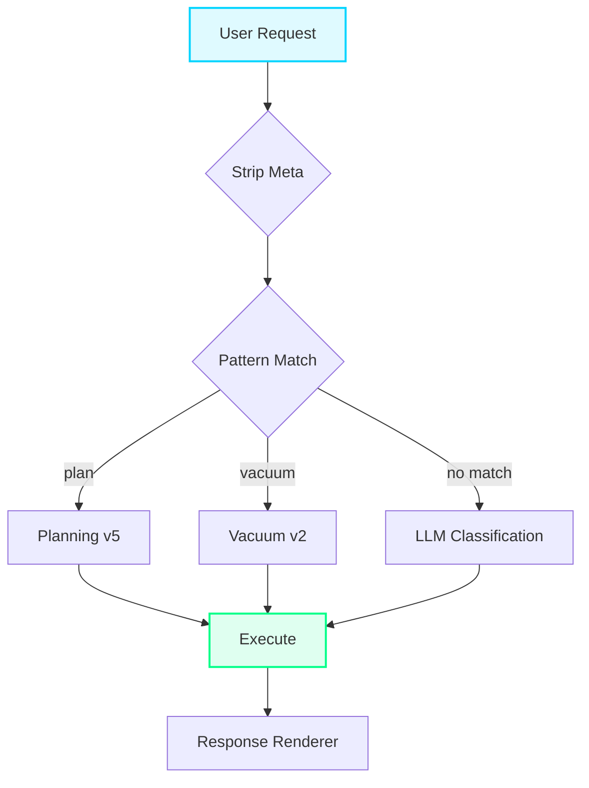
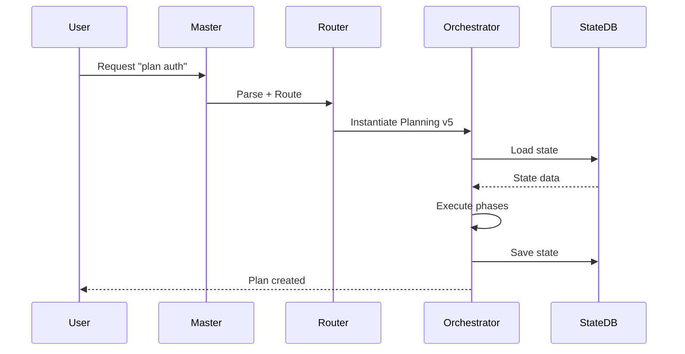
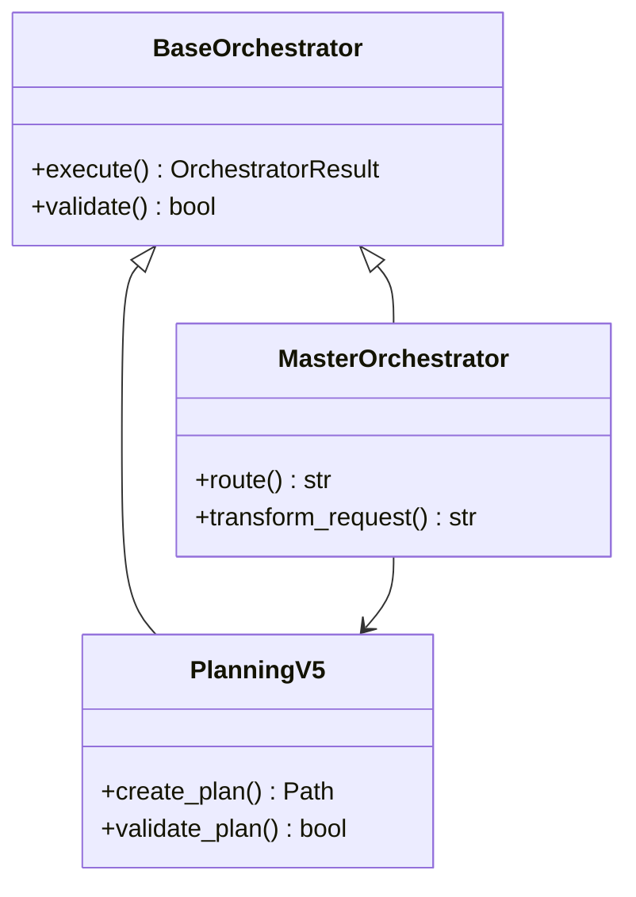
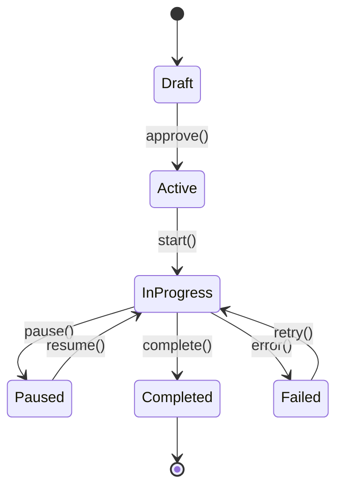

# 🎯 CORTEX Documentation Orchestrator - Intelligent UI/UX Content Generator

**Version:** 1.0.0 | **Status:** ✅ PRODUCTION | **Type:** Template-Based Documentation System  
**Author:** Asif Hussain | **Integration:** Toolkit Orchestrator Phase 1.5  
**Copyright © 2025-2026 Asif Hussain. All rights reserved.**

---

## 🧠 Orchestrator Purpose

Generate high-value documentation content with intelligent template selection, responsive glassmorphism design, and automatic UI/UX layout decisions. Analyzes plan architecture holistically to create Level 1 (executive) and Level 2 (technical) views with D3.js and Mermaid visualizations.

---

## 📋 Master Orchestrator Integration

**Pattern:** `^(document|doc|generate docs|architecture docs).*$`  
**Priority:** 65  
**Mode:** autonomous  
**Dependencies:** Planning v5, Toolkit Orchestrator

**Invocation:**
```bash
python3 -m src.main "document cortex5 epic architecture with Level 1 and Level 2 views, D3.js visualizations, and Mermaid diagrams" --format markdown
```

---

## 🎨 Approved Design System (Glassmorphism v4.0)

### Color Palette (7-Color Rotation)

**Background Base:**
- Primary: `#0a0e27`
- Secondary: `#1a1f3a`
- Tertiary: `#101428`

**7-Panel Color Variants (Randomly Assigned):**
1. **Cyan** - `rgba(0, 212, 255, 0.08)` gradient → Primary accent
2. **Purple** - `rgba(123, 97, 255, 0.08)` gradient → Warmth accent
3. **Teal** - `rgba(20, 184, 166, 0.08)` gradient → Bridge accent
4. **Indigo** - `rgba(79, 70, 229, 0.08)` gradient → Deep accent
5. **Pink** - `rgba(236, 72, 153, 0.08)` gradient → Vibrant accent
6. **Emerald** - `rgba(16, 185, 129, 0.08)` gradient → Success accent
7. **Amber** - `rgba(245, 158, 11, 0.08)` gradient → Energy accent

### Glass Effects Specification

**Panel Background (Standard):**
```css
background: linear-gradient(135deg, 
    rgba(0, 212, 255, 0.08) 0%, 
    rgba(0, 212, 255, 0.06) 50%, 
    rgba(26, 31, 58, 0.65) 100%);
backdrop-filter: blur(12px);
-webkit-backdrop-filter: blur(12px);
border: 1px solid rgba(0, 212, 255, 0.15);
box-shadow: 0 8px 32px rgba(0, 212, 255, 0.1), 
            inset 0 1px 0 rgba(255, 255, 255, 0.1);
```

**Card Background (Enhanced Prominence):**
```css
background: linear-gradient(135deg, 
    rgba(0, 212, 255, 0.15) 0%, 
    rgba(0, 180, 216, 0.12) 50%, 
    rgba(26, 31, 58, 0.85) 100%);
border: 1px solid rgba(0, 212, 255, 0.35);
box-shadow: 0 8px 24px rgba(0, 212, 255, 0.2),
            inset 0 1px 2px rgba(0, 212, 255, 0.15),
            inset 0 -1px 2px rgba(0, 0, 0, 0.3);
```

**Hover State:**
```css
background: linear-gradient(135deg, 
    rgba(0, 212, 255, 0.22) 0%, 
    rgba(0, 180, 216, 0.18) 50%, 
    rgba(26, 31, 58, 0.9) 100%);
border-color: rgba(0, 212, 255, 0.5);
box-shadow: 0 12px 32px rgba(0, 212, 255, 0.3),
            0 0 30px rgba(0, 212, 255, 0.2),
            inset 0 1px 2px rgba(0, 212, 255, 0.2),
            inset 0 -1px 2px rgba(0, 0, 0, 0.3);
transform: translateY(-2px);
```

### Layout Specifications

**Body Margins:**
```css
body {
    margin: 0;
    padding: 0;
    font-family: 'Segoe UI', 'Inter', -apple-system, sans-serif;
    background: linear-gradient(135deg, #0a0e27 0%, #1a1f3a 100%);
    background-attachment: fixed;
    color: #ffffff;
    line-height: 1.7;
    min-height: 100vh;
    overflow-x: hidden;
}
```

**Container:**
```css
.container {
    max-width: 1400px;
    margin: 0 auto;
    padding: 2rem;
}
```

**Grid System (Intelligent Row×Col):**
```css
/* 1-column (mobile) */
@media (max-width: 768px) {
    .grid { grid-template-columns: 1fr; gap: 1.5rem; }
}

/* 2-column (tablet) */
@media (min-width: 769px) and (max-width: 1024px) {
    .grid { grid-template-columns: repeat(2, 1fr); gap: 1.5rem; }
}

/* 3-column (desktop) */
@media (min-width: 1025px) {
    .grid { grid-template-columns: repeat(3, 1fr); gap: 1.5rem; }
}
```

**Touch Targets (Mobile Optimization):**
```css
a, button, [role="button"] {
    min-width: 44px;
    min-height: 44px;
    display: inline-flex;
    align-items: center;
    justify-content: center;
}

button, a, input, select, textarea {
    touch-action: manipulation;
    -webkit-tap-highlight-color: rgba(0,0,0,0);
}
```

---

## 📐 Template Selection Logic

### Template Categories

1. **Executive Overview** (Level 1)
   - Layout: Hero + 3-column metric cards + 2-column feature panels
   - Color: Randomly assign from 7-panel palette
   - Visualizations: D3.js radial tree, timeline
   - Target: <5 minute read time

2. **Architecture Deep-Dive** (Level 2)
   - Layout: Full-width header + 2-column (diagram left, explanation right)
   - Color: Cyan primary (matches technical theme)
   - Visualizations: Mermaid sequence diagrams, D3.js force graphs
   - Target: <30 minute read time

3. **Feature Documentation** (Level 2)
   - Layout: Sticky TOC sidebar + scrollable content area
   - Color: Teal or Indigo (neutral focus colors)
   - Visualizations: Mermaid flowcharts, state diagrams
   - Target: Reference material (browsable)

4. **API Reference** (Level 2)
   - Layout: 2-column (navigation tree left, endpoint details right)
   - Color: Emerald (success/stable theme)
   - Visualizations: Interactive endpoint explorer (JSON schema)
   - Target: Developer reference

5. **Security & Compliance** (Level 2)
   - Layout: Alert banner + 3-column vulnerability cards + mitigation table
   - Color: Pink or Amber (warning/attention colors)
   - Visualizations: Risk matrix heatmap (D3.js)
   - Target: Security audit report

6. **Performance Analysis** (Level 2)
   - Layout: Dashboard grid (4 metric cards + 2 charts)
   - Color: Purple (data/analytics theme)
   - Visualizations: D3.js line charts, bar graphs
   - Target: Performance report

### Intelligent Selection Algorithm

```
INPUT: content_type, audience_level, content_structure

IF audience_level == "executive" AND content_type == "overview":
    RETURN ExecutiveOverviewTemplate
    ASSIGN random_color FROM 7_panel_palette
    LAYOUT "hero + 3-col-metrics + 2-col-features"

ELSE IF audience_level == "technical" AND content_type == "architecture":
    RETURN ArchitectureTemplate
    ASSIGN cyan_theme
    LAYOUT "full-width-header + 2-col-diagram-explanation"

ELSE IF content_type == "security":
    RETURN SecurityTemplate
    ASSIGN pink_or_amber_theme (warning colors)
    LAYOUT "alert-banner + 3-col-cards + mitigation-table"

ELSE IF content_type == "performance":
    RETURN PerformanceTemplate
    ASSIGN purple_theme (analytics)
    LAYOUT "dashboard-4-metrics + 2-charts"

ELSE IF content_type == "api":
    RETURN APIReferenceTemplate
    ASSIGN emerald_theme (stable/reliable)
    LAYOUT "2-col-nav-tree + endpoint-details"

ELSE:
    RETURN FeatureDocumentationTemplate
    ASSIGN teal_or_indigo_theme
    LAYOUT "sticky-toc + scrollable-content"
```

---

## 🧩 Responsive Layout Engine

### Breakpoint Strategy

**Mobile-First Approach:**
```
1. Design for mobile (320px - 768px) - 1 column
2. Enhance for tablet (769px - 1024px) - 2 columns
3. Optimize for desktop (1025px+) - 3 columns
4. Special handling for landscape orientation
```

### Automatic Grid Decisions

**Content Type → Grid Layout:**

| Content Type | Mobile | Tablet | Desktop | Rationale |
|--------------|--------|--------|---------|-----------|
| Metrics | 1×4 | 2×2 | 4×1 | Horizontal scan on desktop, vertical scroll on mobile |
| Features | 1×N | 2×N | 3×N | Standard card grid |
| Diagrams | 1×1 (full) | 1×1 (full) | 2×1 (side-by-side) | Diagrams need space |
| API Endpoints | 1×N | 1×N | 2×N (tree + detail) | Tree navigation requires space |
| Vulnerabilities | 1×N | 2×N | 3×N | Scan efficiency (3-col is ideal for risk cards) |
| Performance Charts | 1×N | 1×N | 2×2 | Charts need width, stack on mobile |

### Orientation Handling

**Portrait Mode:**
- Stack panels vertically
- Full-width cards
- Collapse side navigation to hamburger menu

**Landscape Mode:**
- 2-column layout (even on phones)
- Side-by-side comparison friendly
- Fixed TOC sidebar on tablets

---

## 📊 Visualization Integration

### D3.js Specifications

**1. Force-Directed Graph (Orchestrator Dependencies)**
```javascript
{
  "type": "force_directed_graph",
  "width": 1200,
  "height": 800,
  "responsive": true,
  "nodes": [
    {"id": "master", "group": "core", "size": 100, "color": "#00d4ff"},
    {"id": "planning_v5", "group": "core", "size": 80, "color": "#7b61ff"}
  ],
  "links": [
    {"source": "master", "target": "planning_v5", "strength": 1.0}
  ],
  "config": {
    "force_strength": -300,
    "collision_radius": 50,
    "link_distance": 150,
    "mobile_scale": 0.6
  }
}
```

**2. Radial Tree (Knowledge Hierarchy)**
```javascript
{
  "type": "radial_tree",
  "radius": 500,
  "responsive": true,
  "root": {
    "name": "CORTEX Knowledge",
    "children": [
      {"name": "Tier 0", "children": [...]},
      {"name": "Tier 2", "children": [...]}
    ]
  },
  "config": {
    "nodeSize": [10, 80],
    "mobile_radius": 250
  }
}
```

**3. Timeline (Phase Execution)**
```javascript
{
  "type": "timeline",
  "width": 1400,
  "height": 200,
  "responsive": true,
  "events": [
    {"date": "2026-01-07", "phase": "Phase 0", "status": "complete"},
    {"date": "2026-01-08", "phase": "Phase P00B", "status": "in_progress"}
  ],
  "config": {
    "scale": "week",
    "mobile_scale": "compact"
  }
}
```

### Mermaid Diagram Standards

**1. Flowchart (Request Routing)**


**2. Sequence Diagram (Orchestrator Lifecycle)**


**3. Class Diagram (Orchestrator Hierarchy)**


**4. State Diagram (Plan Lifecycle)**


---

## 📝 Content Generation Pipeline

### Phase 1: Context Discovery (Discovery Agent)

**Inputs:**
- Plan folder path (e.g., `cortex5-enhancement-epic`)
- Target audience (Level 1 or Level 2)
- Content focus (overview, architecture, security, performance, API)

**Discovery Tasks:**
1. Parse plan structure (00-epic.md, phases/, tracking/)
2. Extract metadata (version, status, timeline, dependencies)
3. Identify visualizations needed (architecture = sequence diagrams, overview = timeline)
4. Detect content type (security mentions = security template)
5. Map edge cases (from HOLISTIC-REVIEW-SUMMARY.md)
6. Catalog diagrams (existing Mermaid/D3.js)

**Output:**
```yaml
discovery_report:
  plan_id: "cortex5-enhancement-epic"
  version: "2.1.0"
  audience: "Level 2"
  content_type: "architecture"
  recommended_template: "ArchitectureDeepDive"
  recommended_layout: "2-col-diagram-explanation"
  recommended_color: "cyan"
  visualizations_needed:
    - type: "mermaid_sequence"
      purpose: "Request routing flow"
    - type: "d3_force_graph"
      purpose: "Orchestrator dependencies"
  edge_cases_found: 55
  phases_count: 12
```

### Phase 2: Template Selection (Template Selector Agent)

**Decision Tree:**
```
IF discovery.content_type == "architecture":
    template = ArchitectureTemplate
    color_theme = cyan
    layout = "2-col-diagram-explanation"
    visualizations = [sequence_diagram, force_graph, class_diagram]

ELSE IF discovery.audience == "Level 1":
    template = ExecutiveOverviewTemplate
    color_theme = random_from_7_palette()
    layout = "hero + 3-col-metrics + 2-col-features"
    visualizations = [radial_tree, timeline]

ELSE IF "security" IN discovery.plan_content:
    template = SecurityTemplate
    color_theme = pink_or_amber
    layout = "alert-banner + 3-col-cards + mitigation-table"
    visualizations = [risk_heatmap]
```

**Output:**
```yaml
template_selection:
  template: "ArchitectureDeepDive"
  color_theme: "cyan"
  layout: "2-col-diagram-explanation"
  grid_config:
    mobile: "1-col"
    tablet: "1-col"
    desktop: "2-col"
  panel_background: "glass-panel-cyan"
  card_variant: "card-variant-primary"
```

### Phase 3: Content Synthesis (Content Generator Agent)

**Tasks:**
1. Generate introduction (audience-appropriate tone)
2. Create section headers (executive vs technical language)
3. Extract key metrics (phases, deliverables, risks)
4. Generate visualization data (JSON for D3.js, Mermaid syntax)
5. Create navigation structure (breadcrumbs, TOC)
6. Write diagram narratives (explanations for each visual)

**Level 1 Example (Executive Overview):**
```markdown
# CORTEX-5.5 Enhancement Epic - Executive Overview

**Version:** 2.1.0 | **Status:** AT RISK | **Timeline:** 9 weeks + Phase 0

---

## 🎯 Strategic Vision

Transform CORTEX into a business-aware, domain-extensible AI orchestration platform enabling companies to inject custom knowledge, orchestrators, and governance rules without corrupting core capabilities.

### Key Metrics

- **File Reduction:** 85% (1000 → 150 files)
- **Script Consolidation:** 41% (17 → <10 scripts)
- **Architecture Score:** 68/100 (AT RISK, requires action)
- **Critical Issues:** 7 blockers (Phase P00B resolution required)

### Success Definition

- ✅ Company knowledge overrides CORTEX intelligently (95% accuracy)
- ✅ Custom orchestrators registered without core corruption (100% isolation)
- ✅ Knowledge merge overhead <50ms
- ✅ 3+ reference orchestrators implemented
```

**Level 2 Example (Architecture Deep-Dive):**
```markdown
# CORTEX Master Orchestrator - Technical Architecture

**Module:** `src/orchestrators/master_orchestrator.py`  
**Version:** 7.0 | **Interface:** BaseOrchestratorV4_1

---

## Architecture Overview

The Master Orchestrator implements a 4-step pipeline for request routing:

### Request Flow

[Mermaid sequence diagram here]

### Data Flow Analysis

**Pattern Router (src/orchestrators/pattern_router.py):**
- Sequential regex matching: O(n) complexity
- 10 registered patterns (planning, vacuum, cleanup, etc.)
- Confidence scoring: 1.0 for exact match, 0.8 for partial

**Performance Bottleneck:**
- **Current:** ~20ms for 10 orchestrators
- **Projected:** ~200ms for 100 orchestrators
- **Mitigation:** Trie-based routing, ML classification

### Edge Case: Pattern Collision

**Issue:** Documentation pattern `^(document|doc).*$` overlaps with planning `^(plan|document).*$`

**Impact:** Documentation requests may route to planning orchestrator

**Mitigation:** Priority-based resolution (planning = 10, docs = 65)
```

### Phase 4: HTML Generation (Renderer Agent)

**Template Structure:**
```html
<!DOCTYPE html>
<html lang="en">
<head>
    <meta charset="UTF-8">
    <meta name="viewport" content="width=device-width, initial-scale=1.0">
    <title>{title} - CORTEX</title>
    <link rel="stylesheet" href="assets/css/variables.css">
    <link rel="stylesheet" href="assets/css/main.css">
    <style>
        /* Template-specific overrides */
        {template_css}
    </style>
</head>
<body>
    <!-- Navigation -->
    <nav class="main-nav">
        <div class="nav-content">
            <a href="index.html" class="logo-link">
                <span class="logo-text">CORTEX</span>
            </a>
            <div class="nav-links">
                <a href="overview.html">Overview</a>
                <a href="architecture.html" class="active">Architecture</a>
                <a href="security.html">Security</a>
            </div>
        </div>
    </nav>

    <!-- Hero/Header -->
    <section class="hero">
        <h1>{title}</h1>
        <p class="hero-acronym">{subtitle}</p>
    </section>

    <!-- Content Grid (2-col example) -->
    <section class="container">
        <div class="grid grid-cols-2 glass-panel-{color}">
            <!-- Left: Diagram -->
            <div class="card-variant-primary">
                <h2>Request Routing Flow</h2>
                <div class="mermaid">
                    {mermaid_diagram}
                </div>
            </div>

            <!-- Right: Explanation -->
            <div class="card-variant-primary">
                <h2>Architecture Explanation</h2>
                {markdown_content}
            </div>
        </div>
    </section>

    <!-- Visualization Section -->
    <section class="container">
        <div class="glass-panel-{color}">
            <h2>Orchestrator Dependencies</h2>
            <div id="d3-force-graph"></div>
        </div>
    </section>

    <!-- Scripts -->
    <script src="https://d3js.org/d3.v7.min.js"></script>
    <script src="https://cdn.jsdelivr.net/npm/mermaid/dist/mermaid.min.js"></script>
    <script>
        // D3.js visualization initialization
        {d3_initialization_code}
        
        // Mermaid initialization
        mermaid.initialize({ startOnLoad: true, theme: 'dark' });
    </script>
</body>
</html>
```

---

## 🚀 Execution Protocol

### Input Format

```yaml
documentation_request:
  plan_path: "cortex-brain/documents/planning/active/cortex5-enhancement-epic"
  audience: "Level 2"  # Level 1 or Level 2
  content_focus: "architecture"  # overview, architecture, security, performance, api
  output_format: "html"  # html, markdown, yaml
  visualizations: true  # Generate D3.js + Mermaid
```

### Output Format

```yaml
documentation_output:
  html_files:
    - path: "docs/cortex5-epic/architecture.html"
      template: "ArchitectureDeepDive"
      color: "cyan"
      layout: "2-col-diagram-explanation"
      size: "125KB"
  
  visualizations:
    - type: "d3_force_graph"
      data_file: "docs/cortex5-epic/data/orchestrator-deps.json"
      embed_code: "docs/cortex5-epic/scripts/force-graph.js"
    
    - type: "mermaid_sequence"
      diagram_file: "docs/cortex5-epic/diagrams/request-flow.mmd"
      embedded: true
  
  assets:
    - "docs/assets/css/variables.css"
    - "docs/assets/css/main.css"
    - "docs/assets/js/d3-helpers.js"
  
  metadata:
    generated_at: "2026-01-07T15:30:00Z"
    generator_version: "1.0.0"
    template_version: "4.0"
    total_pages: 5
    total_size: "450KB"
```

### Success Criteria

**Level 1 (Executive):**
- ✅ Read time <5 minutes
- ✅ 3-5 key metrics visible immediately
- ✅ Minimal technical jargon
- ✅ Timeline visualization present
- ✅ Mobile-responsive (portrait + landscape)

**Level 2 (Technical):**
- ✅ Read time <30 minutes
- ✅ Code examples executable
- ✅ Architecture diagrams clear
- ✅ Edge cases documented
- ✅ API reference included
- ✅ Cross-references working

**Visual Quality:**
- ✅ D3.js graphs render in modern browsers
- ✅ Mermaid diagrams render correctly
- ✅ Interactive controls (zoom, pan) functional
- ✅ Touch-friendly (44px min targets)
- ✅ Glass effects render with proper blur

---

## 🔄 Integration with Toolkit Orchestrator

### Registration

```yaml
# cortex-brain/config/script-catalog.yaml
scripts:
  - id: "doc_orchestrator_001"
    name: "Documentation Orchestrator"
    path: "src/orchestrators/documentation/"
    purpose: "Generate glassmorphism documentation with intelligent templates"
    inputs:
      - plan_path: "Path to plan folder"
      - audience: "Level 1 or Level 2"
      - content_focus: "overview|architecture|security|performance|api"
    outputs:
      - "docs/{plan-name}/*.html"
      - "docs/{plan-name}/data/*.json"
      - "docs/{plan-name}/diagrams/*.mmd"
    dependencies:
      - planning_orchestrator_v5
      - response_renderer
    consolidation_status: "net_new"
```

### Master Orchestrator Pattern

```yaml
# cortex-brain/config/master-orchestrator.yaml
patterns:
  - pattern: "^(document|doc|generate docs|architecture docs).*$"
    orchestrator: "documentation_orchestrator"
    priority: 65
    mode: "autonomous"
    transformation:
      - extract_plan_path: true
      - detect_audience: true
      - infer_content_type: true
```

---

## 📚 Template Library

### Template Metadata

```yaml
templates:
  - id: "executive_overview"
    name: "Executive Overview"
    audience: "Level 1"
    layout: "hero + 3-col-metrics + 2-col-features"
    color_rotation: true  # Random from 7-palette
    visualizations: ["radial_tree", "timeline"]
    read_time_target: "5min"
  
  - id: "architecture_deep_dive"
    name: "Architecture Deep-Dive"
    audience: "Level 2"
    layout: "2-col-diagram-explanation"
    color_theme: "cyan"
    visualizations: ["sequence_diagram", "force_graph", "class_diagram"]
    read_time_target: "30min"
  
  - id: "security_audit"
    name: "Security & Compliance"
    audience: "Level 2"
    layout: "alert-banner + 3-col-cards + mitigation-table"
    color_theme: "pink"
    visualizations: ["risk_heatmap"]
    read_time_target: "20min"
  
  - id: "performance_report"
    name: "Performance Analysis"
    audience: "Level 2"
    layout: "dashboard-4-metrics + 2-charts"
    color_theme: "purple"
    visualizations: ["line_chart", "bar_graph"]
    read_time_target: "15min"
  
  - id: "api_reference"
    name: "API Reference"
    audience: "Level 2"
    layout: "2-col-nav-tree + endpoint-details"
    color_theme: "emerald"
    visualizations: ["endpoint_explorer"]
    read_time_target: "reference"
  
  - id: "feature_docs"
    name: "Feature Documentation"
    audience: "Level 2"
    layout: "sticky-toc + scrollable-content"
    color_theme: "teal"
    visualizations: ["flowchart", "state_diagram"]
    read_time_target: "browsable"
```

---

## ⚠️ Edge Cases & Mitigations

### 1. Template Selection Ambiguity

**Issue:** Content contains both architecture and security concerns

**Mitigation:** Keyword frequency analysis → select primary template → add secondary sections

### 2. Visualization Data Too Large

**Issue:** D3.js force graph with 100+ nodes crashes mobile browsers

**Mitigation:** Implement progressive rendering + virtualization + mobile simplification

### 3. Color Palette Exhaustion

**Issue:** More than 7 sections need unique colors

**Mitigation:** Reuse colors with different opacity levels (0.08, 0.10, 0.12)

### 4. Mobile Performance

**Issue:** Glass effects + blur on old mobile devices cause lag

**Mitigation:** Detect device capability → disable blur on low-end devices

### 5. Content Overload

**Issue:** Level 2 documentation exceeds 50KB (too long)

**Mitigation:** Split into multiple pages with navigation breadcrumbs

---

## 🎯 Version History

- **v1.0.0** (2026-01-07): Initial documentation orchestrator with glassmorphism v4.0 design system
