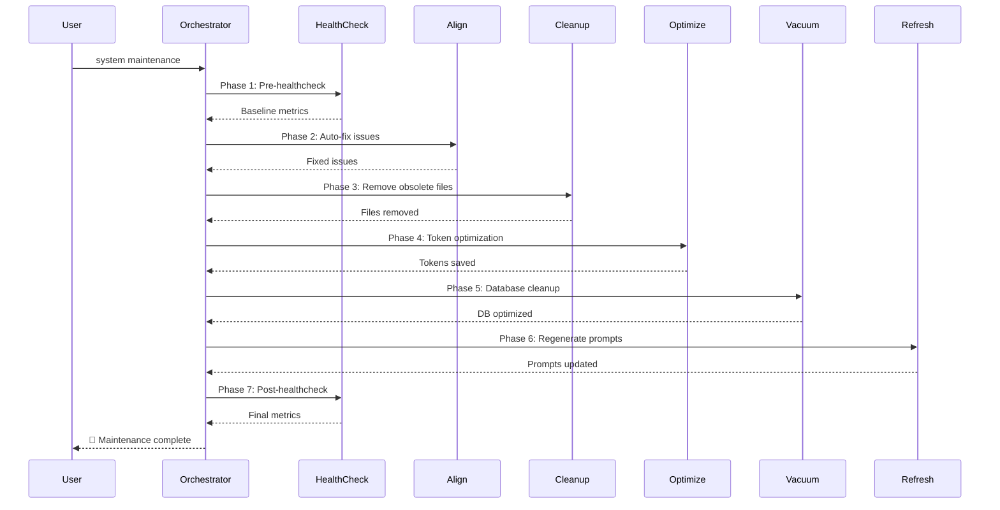

# CORTEX 4.0 Documentation Orchestrator

**Version:** 4.2 | **Author:** Asif Hussain | **Status:** ✅ PRODUCTION  
**Copyright © 2025 Asif Hussain. All rights reserved.**

---

## 🎯 Purpose

Autonomous documentation generation orchestrator that discovers, analyzes, and documents all CORTEX 4.0 features starting with `docs/index.html` and cascading through all pages with:
- **Unified glassmorphism theme** (100% centralized CSS in `main.css` - ZERO inline styles except story button)
- **User-centric benefit panels** (every page answers "How does this help me?")
- **Interactive visualizations** (D3.js architecture diagrams, Mermaid workflows)
- **Technical documentation** (architecture, APIs, integration guides)
- **Intelligent navigation** (breadcrumbs, cross-references, progressive disclosure)
- **Mobile-first responsive** (320px-4K with 3 breakpoints)

---

## 🏠 START HERE: docs/index.html Generation

**CRITICAL:** Documentation generation MUST begin with home dashboard to establish:
1. **Design system reference** - All pages inherit glassmorphism from index.html
2. **Navigation structure** - Tiles define site hierarchy
3. **Brand identity** - Logo, colors, typography set the standard
4. **Performance baseline** - Critical CSS and lazy loading patterns

**Execution Order:**
```
1. Generate docs/index.html (home dashboard with tiles)
   ↓
2. Generate docs/assets/css/main.css (complete glassmorphism theme)
   ↓
3. Generate getting-started/ pages (user onboarding)
   ↓
4. Generate orchestrators/ pages (6 USER-facing features)
   ↓
5. Generate architecture/ pages (4-Tier Brain, multi-repo)
   ↓
6. Generate features/ pages (dashboard, workspace detection)
   ↓
7. Generate validation/ pages (Phase 13B STS)
   ↓
8. Generate technical/ pages (toolkit, API, troubleshooting)
   ↓
9. Generate search system (Lunr.js index + UI)
   ↓
10. Validate all pages (links, styling, accessibility)
   ↓
11. Run HTML Quality Tools (MANDATORY - style centralizer + validator)
```

---

## 📋 Key Principles (v4.2)

### 1. Start With Home Dashboard
**Critical Path:** `docs/index.html` → establishes glassmorphism theme → all pages inherit

**Why This Matters:**
- ✅ Single source of truth for design system
- ✅ Prevents styling inconsistencies across pages
- ✅ Establishes navigation hierarchy via tiles
- ✅ Sets performance budget (critical CSS, lazy loading)

### 2. 100% Glassmorphism Consistency
**Problem Solved:** Inline styles caused design drift, maintenance nightmares, bloated HTML.

**Solution:** ALL styling via `docs/assets/css/main.css`:
```css
/* Single source for all glassmorphism styling */
:root {
    --glass-bg: rgba(255, 255, 255, 0.05);
    --glass-border: rgba(0, 212, 255, 0.2);
    --accent-primary: #00d4ff;
    /* ... all theme variables */
}
```

**Enforcement:** 
- ❌ ZERO inline `style=""` attributes (except story button image)
- ❌ ZERO page-specific `<style>` tags
- ✅ ALL pages link to: `<link rel="stylesheet" href="../assets/css/main.css">`

### 3. User-Centric Benefit Panels
**Every feature/orchestrator page MUST start with:**
```html
<div class="feature-benefit-panel">
    <span class="icon">🎯</span>
    <p class="description">
        Natural language explanation of efficiency gains...
    </p>
</div>
```

**Writing Guidelines:**
- Focus on outcomes (time saved, errors prevented)
- Avoid jargon ("40% faster" not "enforces DoR validation")
- Use relatable scenarios ("Imagine planning in minutes...")

### 4. Mobile-First Responsive Design
**Breakpoints:**
- Mobile: 320px-767px (single column, stacked cards)
- Tablet: 768px-1023px (2 columns)
- Desktop: 1024px+ (3-6 columns)

**Performance:**
- Critical CSS inlined in `<head>` (hero section only)
- Lazy load images below fold
- Defer JavaScript
- Target: <3s page load, <2MB total weight

---

## ⚠️ CRITICAL RULES

### 1. Documentation Generation Order (ENFORCED)
**MUST generate in this exact sequence:**
```
docs/index.html (home dashboard)
  ↓
docs/assets/css/main.css (glassmorphism theme)
  ↓
docs/getting-started/* (5 pages: onboarding, deployment, commands)
  ↓
docs/orchestrators/* (6 USER pages: Planning, TDD, Execution, ADO, Sanitization, Upgrade)
  ↓
docs/architecture/* (5 pages: 4-Tier Brain, multi-repo, BaseOrchestrator)
  ↓
docs/features/* (5 pages: Dashboard, workspace detection, brain persistence)
  ↓
docs/validation/* (3 pages: Phase 13B STS, 9 capabilities, metrics)
  ↓
docs/technical/toolkit/* (5 pages: Python tools ecosystem)
  ↓
docs/search-index.json + assets/js/search.js (Lunr.js integration)
```

**Why This Order:**
- Home dashboard establishes design system reference
- main.css provides styling for all subsequent pages
- Getting Started ensures users can onboard before diving deep
- Orchestrators/features before technical details (progressive disclosure)
- Search system last (needs all pages indexed)

### 1.5. File Regeneration Strategy (DELETE → RECREATE)
**⚠️ CRITICAL: Always DELETE existing files BEFORE recreating**

**Problem Solved:** Using `replace_string_in_file` or partial updates on HTML files causes:
- Duplicate/merged content (e.g., `<!DOCTYPE html><!DOCTYPE html>`)
- Corrupted tag structures
- Unpredictable merge artifacts

**Enforcement Rules:**
```bash
# ✅ CORRECT: Delete first, then create fresh
rm docs/index.html
create_file docs/index.html [complete content]

# ❌ WRONG: Partial update or replace_string_in_file on HTML
replace_string_in_file docs/index.html [old] [new]  # FORBIDDEN for HTML
```

**Mandatory Workflow for ALL HTML files:**
1. **DELETE** existing file: `rm /path/to/file.html`
2. **CREATE** new file with complete content: `create_file`
3. **VALIDATE** with html_validator.py

**Exception:** `docs/assets/css/main.css` may use `replace_string_in_file` for targeted CSS additions.

### 2. Glassmorphism Styling Enforcement
**100% centralized in `main.css` - ZERO exceptions except story button image**

**⚠️ CRITICAL: SINGLE CSS FILE ONLY**
- ALL pages MUST use `docs/assets/css/main.css` - NO alternate CSS files
- ❌ **FORBIDDEN:** `technical/assets/styles/glassmorphism.css` or ANY subdirectory CSS
- ❌ **FORBIDDEN:** Creating new CSS files in `docs/technical/`, `docs/orchestrators/`, etc.
- ✅ **REQUIRED:** Relative path to main.css from any depth: `../assets/css/main.css`, `../../assets/css/main.css`

**Forbidden:**
```html
<!-- ❌ NO INLINE STYLES -->
<div style="color: #fff; background: rgba(0,0,0,0.5);">

<!-- ❌ NO PAGE-SPECIFIC STYLE TAGS -->
<style>
.my-custom-card { background: var(--glass-bg); }
</style>

<!-- ❌ NO ALTERNATE CSS FILES -->
<link rel="stylesheet" href="assets/styles/glassmorphism.css">
<link rel="stylesheet" href="technical/assets/styles/theme.css">
```

**Required:**
```html
<!-- ✅ SINGLE CENTRALIZED CSS FILE -->
<link rel="stylesheet" href="../assets/css/main.css">
<!-- OR from deeper paths -->
<link rel="stylesheet" href="../../assets/css/main.css">
<div class="glass-card">
<div class="metric-card">
<span class="badge badge-success">
```

### 2.5. HTML Quality Tools Enforcement (MANDATORY Step 11)
**ZERO inline styles, ZERO syntax errors - run tools after every documentation generation**

**Tools Location:** `cortex-toolkit/documentation/html-tools/`

**Mandatory Execution:**
```bash
# Step 11a: Remove ALL inline styles (centralizes to main.css)
python3 cortex-toolkit/documentation/html-tools/html_style_centralizer.py

# Step 11b: Validate ALL HTML syntax (no broken tags)
python3 cortex-toolkit/documentation/html-tools/html_validator.py
```

**Expected Results:**
```
# html_style_centralizer.py output:
✅ Processed 50 files
✅ Removed 0 inline styles (if compliant)
# OR if issues found:
🔧 Removed X inline styles from Y files

# html_validator.py output:
✅ All 50 files are syntactically correct
# OR if issues found:
❌ Syntax errors in X files (fix before proceeding)
```

**Allowed Exceptions (only these 6):**
1. `docs/story/viewer.html` - Legacy viewer (3 styles, preserved)
2. D3.js dynamic styling - `style="background: ${d.color}"` patterns (runtime-generated)

**Failure Mode:** If html_validator.py reports errors, STOP and fix before proceeding. Do not publish documentation with syntax errors.

### 3. Story Preservation (CRITICAL - NEVER MODIFY)
```
docs/story/          ← NEVER TOUCH (working and integrated)
docs/index.html      ← Story button HTML MUST remain exactly as specified
```

**Story Button HTML (preserve exactly including inline image style):**
```html
<a href="story/index.html" class="btn-hero btn-hero-story btn-hero-full-width">
    <span class="btn-hero-icon">
        
    </span>
    <span class="btn-hero-text">The Awakening Of CORTEX</span>
    <span class="btn-hero-caption">Read the How It All Happened</span>
</a>
```

### 4. NO CORTEX 3.0 References
- **DELETE** any mentions of CORTEX 3.0 features
- **DELETE** deprecated orchestrators not in current codebase
- **VALIDATE** all content against `src/`, `cortex-brain/`, `tests/`
- **USER-FACING ONLY** in main documentation (admin operations in technical/ only)

### 5. Discovery Sources (Phase 1: Feature Inventory)

**Critical First Step:** Execute comprehensive discovery BEFORE any documentation generation.

**Primary Sources:**
1. **CORTEX4-STATUS.md** → Phase completion status, capabilities overview
2. **src/orchestrators/** → USER-facing orchestrators (Planning, TDD, Execution, ADO, Sanitization, Upgrade)
3. **cortex-operations.yaml** → 302 operations (FILTER by deployment_tier: user, exclude admin)
4. **cortex-brain/manifests/** → Planning System, ADO, TDD manifests (DoR/DoD gates)
5. **tests/** → Coverage reports, validation suites, integration tests
6. **cortex-brain/documents/archive/** → Architecture deep-dives, design decisions
7. **cortex-brain/documents/learning-paths/** → Interactive tutorials (Quick Start, Tutorial, Exercises)

**Discovery Workflow:**
```
1. Parse CORTEX4-STATUS.md → Extract Phase 11-13 completion metrics
2. Read src/orchestrators/*.py → Document USER operations (planning, tdd, ado, sanitization)
3. Filter cortex-operations.yaml → deployment_tier=user (exclude admin/align/cleanup)
4. Extract manifest rules → DoR/DoD gates, TDD enforcement, validation criteria
5. Parse test results → Coverage %, pass rates, capability validation
```

**USER vs ADMIN Filtering:**

**USER-Facing (Document in docs/orchestrators/, docs/features/):**
- `plan [feature]` - Planning System 2.0
- `plan ado` - Azure DevOps integration
- `start tdd` - TDD Mastery workflow
- `sanitize [directory]` - Code sanitization
- `execute all phases autonomously` - Autonomous execution
- `upgrade cortex` - Upgrade orchestrator

**ADMIN-Only (Document in docs/technical/orchestrators/ ONLY):**
- `align`, `refine`, `system maintenance` - CORTEX internal
- `healthcheck`, `cleanup`, `optimize` - CORTEX housekeeping
- `deploy`, `regenerate_prompts` - CORTEX admin

**Key Distinction:** User docs show what developers use to build apps. Admin docs show how CORTEX maintains itself internally.

---

## 🏗️ Documentation Structure

### Root Dashboard (`docs/index.html`)
**Preserve:** Hero section with CORTEX logo, story button, navigation
**Update:** Core capabilities grid with links to new documentation

### Category Structure
```
docs/
├── index.html                          ← Main dashboard (UPDATE, preserve story button)
├── story/                              ← NEVER TOUCH (working)
├── getting-started/                    ← 🆕 Getting started guide
│   ├── index.html                      ← Quick start landing page
│   ├── deployment.html                 ← Deployment instructions
│   ├── multi-repo-setup.html           ← Multi-repo configuration
│   ├── first-commands.html             ← Essential commands guide
│   ├── tutorial.html                   ← Interactive tutorial (references learning-paths/)
│   ├── diagrams/
│   │   ├── setup-flow.mmd              ← Mermaid flowchart (setup steps)
│   │   └── multi-repo-diagram.html     ← D3.js visualization (1:∞ architecture)
│   └── assets/
├── learning-paths/                     ← 🆕 Interactive learning modules
│   ├── index.html                      ← Learning paths overview
│   ├── quick-start.html                ← CORTEX-4.0-QUICK-START.md (web version)
│   ├── interactive-tutorial.html       ← CORTEX-4.0-INTERACTIVE-TUTORIAL.md (web)
│   ├── practice-exercises.html         ← CORTEX-4.0-PRACTICE-EXERCISES.md (web)
│   └── assets/
├── assets/
│   ├── css/
│   │   └── main.css                    ← Glassmorphism theme
│   ├── images/
│   │   └── CORTEX-logo.png            ← Logo (use in all pages)
│   └── js/
│       └── d3.min.js                   ← D3.js library
├── architecture/
│   ├── index.html                      ← Architecture overview
│   ├── four-tier-brain.html            ← Tier 0-3 architecture
│   ├── base-orchestrator.html          ← BaseOrchestrator pattern
│   ├── multi-repo.html                 ← Phase 11 multi-repo architecture
│   ├── diagrams/
│   │   ├── brain-architecture.html     ← D3.js visualization
│   │   ├── brain-flow.mmd              ← Mermaid flowchart
│   │   └── orchestrator-hierarchy.html ← D3.js tree diagram
│   └── assets/                         ← Architecture-specific assets
├── orchestrators/
│   ├── index.html                      ← Orchestrator overview grid (USER-facing only)
│   ├── planning-system.html            ← Planning System 2.0 (DoR/DoD, incremental, TDD) [USER]
│   ├── tdd-orchestrator.html           ← TDD Mastery (RED-GREEN-REFACTOR) [USER]
│   ├── execution-orchestrator.html     ← Autonomous plan execution [USER]
│   ├── ado-operations.html             ← Azure DevOps integration [USER]
│   ├── sanitization.html               ← Code sanitization workflow [USER]
│   ├── upgrade.html                    ← Upgrade orchestrator (3.0→4.0) [USER]
│   <!-- ADMIN ORCHESTRATORS EXCLUDED: system-maintenance, refinement, alignment, healthcheck -->
│   ├── diagrams/
│   │   ├── planning-flow.html          ← D3.js Sankey diagram (5 phases)
│   │   ├── tdd-cycle.html              ← D3.js RED-GREEN-REFACTOR cycle
│   │   ├── maintenance-flow.mmd        ← Mermaid sequence diagram
│   │   └── orchestrator-interactions.html ← D3.js force-directed graph
│   └── assets/
├── features/
│   ├── index.html                      ← Features overview
│   ├── dashboard-system.html           ← Dashboard system
│   ├── workspace-detection.html        ← Multi-workspace detection (Phase 11)
│   ├── brain-persistence.html          ← Tier 3 segmentation (Phase 11)
│   ├── diagrams/
│   │   ├── feature-coverage.html       ← D3.js radar chart
│   │   └── workspace-flow.mmd          ← Mermaid flowchart
│   └── assets/
├── governance/
│   ├── skull-rulebook.html             ← 22 SKULL rules (preserve if exists)
│   ├── dor-dod.html                    ← DoR/DoD compliance
│   ├── diagrams/
│   │   ├── skull-enforcement.html      ← D3.js bar chart (rule compliance)
│   │   └── governance-flow.mmd         ← Mermaid mindmap
│   └── assets/
├── knowledge-library/
│   ├── index.html                      ← Phase 10 knowledge library overview
│   ├── planning-patterns.html          ← Planning patterns library
│   ├── tdd-patterns.html               ← TDD patterns library
│   ├── diagrams/
│   │   ├── knowledge-graph.html        ← D3.js force-directed graph (8,429 nodes)
│   │   └── pattern-usage.html          ← D3.js bar chart
│   └── assets/
├── validation/
│   ├── index.html                      ← Phase 13B STS validation overview
│   ├── capabilities.html               ← 9 validated capabilities
│   ├── metrics.html                    ← Performance metrics
│   ├── diagrams/
│   │   ├── capability-matrix.html      ← D3.js heatmap
│   │   ├── test-coverage.html          ← D3.js donut chart
│   │   └── sts-workflow.mmd            ← Mermaid sequence diagram
│   └── assets/
├── api/
│   ├── index.html                      ← API documentation overview
│   ├── orchestrators-api.html          ← Orchestrator APIs
│   ├── brain-api.html                  ← Brain tier APIs
│   └── assets/
├── faq.html                            ← FAQ page (categorized questions with doc links)
└── technical/                          # 🆕 Technical documentation hub (24 subdirectories)
    ├── index.html                      # Technical hub landing page (PRESERVE if exists)
    ├── api/                            # API documentation
    │   ├── index.html                  # API overview
    │   ├── orchestrators/              # 6 USER-facing orchestrator APIs
    │   │   ├── planning-system-api.html
    │   │   ├── tdd-mastery-api.html
    │   │   ├── execution-api.html
    │   │   ├── ado-operations-api.html
    │   │   ├── sanitization-api.html
    │   │   └── upgrade-api.html
    │   ├── agents/                     # 2 Agent APIs
    │   │   ├── strategic-planning-agent.html
    │   │   └── code-execution-agent.html
    │   └── brain-tiers/                # 4 Brain Tier APIs
    │       ├── tier0-governance.html
    │       ├── tier1-working-memory.html
    │       ├── tier2-knowledge-graph.html
    │       └── tier3-dev-context.html
    ├── workflows/                      # Workflow diagrams
    │   ├── index.html
    │   ├── flowcharts/                 # Mermaid flowcharts
    │   │   ├── planning-workflow.html
    │   │   ├── tdd-cycle.html
    │   │   ├── sanitization-flow.html
    │   │   └── maintenance-workflow.html
    │   └── sequence-diagrams/          # Mermaid sequence diagrams
    │       ├── orchestrator-interaction.html
    │       ├── brain-query-sequence.html
    │       └── agent-collaboration.html
    ├── setup-guides/                   # Setup & installation
    │   ├── index.html
    │   ├── quick-start.html
    │   ├── advanced-setup.html
    │   └── environment-config.html
    ├── integration/                    # Integration guides
    │   ├── index.html
    │   ├── copilot-integration.html
    │   ├── vscode-setup.html
    │   └── diagrams/
    │       └── integration-architecture.html
    ├── deployment/                     # Deployment guides
    │   ├── index.html
    │   ├── local-deployment.html
    │   ├── team-deployment.html
    │   └── diagrams/
    │       └── deployment-flow.html
    ├── troubleshooting/                # Troubleshooting
    │   ├── index.html
    │   ├── common-issues.html
    │   └── debug-guide.html
    ├── performance/                    # Performance docs
    │   ├── index.html
    │   ├── optimization-guide.html
    │   └── benchmarks.html
    ├── security/                       # Security docs
    │   ├── index.html
    │   ├── skull-security.html
    │   └── best-practices.html
    ├── testing/                        # Testing docs
    │   ├── index.html
    │   ├── tdd-guide.html
    │   ├── test-pyramid.html
    │   └── coverage-reports.html
    ├── design-decisions/               # Design rationale
    │   ├── index.html
    │   ├── architecture-decisions.html
    │   └── trade-offs.html
    ├── data-flow/                      # Data flow diagrams
    │   ├── index.html
    │   └── dfd-diagrams/
    │       ├── brain-data-flow.html
    │       └── orchestrator-data-flow.html
    ├── examples/                       # Code examples
    │   ├── index.html
    │   └── code-samples/
    │       ├── planning-example.html
    │       ├── tdd-example.html
    │       └── sanitization-example.html
    ├── glossary/                       # Glossary
    │   ├── index.html
    │   └── terms.html
    ├── toolkit/                        # 🆕 CORTEX Toolkit (Python tools)
    │   ├── index.html                  # Toolkit overview
    │   ├── validation-tools.html       # Documentation/code validators
    │   ├── testing-tools.html          # Test execution and coverage
    │   ├── generation-tools.html       # Doc generation utilities
    │   ├── analysis-tools.html         # System analysis tools
    │   ├── diagrams/
    │   │   ├── tool-architecture.html  # D3.js visualization (tool ecosystem)
    │   │   └── tool-workflow.mmd       # Mermaid flowchart (tool usage)
    │   └── assets/
    └── assets/                         # Technical docs assets (PRESERVE if exists)
        ├── scripts/                    # JavaScript files
        │   └── navigation.js
        └── styles/                     # CSS files
            ├── glassmorphism.css
            └── diagrams.css
```

---

## 🎨 Design System (Glassmorphism) - CENTRALIZED THEMING

### ⚠️ CRITICAL: NO INLINE STYLES
**ALL styling MUST reference `docs/assets/css/main.css`** - NO inline `style=""` attributes allowed except for the story button preservation.

**Source:** `cortex-brain/knowledge/ui-ux/ui-ux-best-practices.yaml` (comprehensive design system specification)

**Enforcement Rules:**
- ❌ **FORBIDDEN:** `<div style="color: #fff;">` or any inline CSS
- ✅ **REQUIRED:** `<div class="glass-card">` referencing centralized classes
- ❌ **FORBIDDEN:** Duplicate CSS in page `<style>` tags
- ✅ **REQUIRED:** All theme customization in `main.css` via CSS variables
- ✅ **REQUIRED:** WCAG 2.1 Level AA compliance (4.5:1 contrast minimum)
- ✅ **REQUIRED:** Performance budget: <3s page load, <2MB total weight
- ✅ **REQUIRED:** Mobile-first responsive design (320px-4K)

### Theme Variables (from `assets/css/main.css`)
**Reference:** `cortex-brain/knowledge/ui-ux/ui-ux-best-practices.yaml` sections: `design_tokens`, `glassmorphism`

```css
:root {
    /* Colors - Dark Mode Palette */
    --bg-primary: #0a0e27;              /* Deep navy background */
    --bg-secondary: #1a1f3a;            /* Lighter navy for cards */
    --glass-bg: rgba(26, 31, 58, 0.7);  /* 70% opacity for frosted glass */
    --glass-border: rgba(255, 255, 255, 0.1);  /* 10% white subtle borders */
    
    /* Accent Colors - WCAG AA Compliant */
    --accent-primary: #00d4ff;          /* Cyan (4.9:1 contrast) */
    --accent-secondary: #7b61ff;        /* Purple (4.6:1 contrast) */
    
    /* Text Colors - WCAG AAA Compliant */
    --text-primary: #ffffff;            /* Pure white (21:1 contrast) */
    --text-secondary: #a0a6c0;          /* Light gray-blue (8.2:1 contrast) */
    --text-muted: #6b7280;              /* Medium gray (4.5:1 contrast) */
    
    /* Status Colors */
    --success: #00ff88;                 /* Bright green */
    --warning: #ffa500;                 /* Orange */
    --danger: #ff4444;                  /* Red */
    --info: #3b82f6;                    /* Blue */
    
    /* Shadows & Effects */
    --shadow: 0 8px 32px 0 rgba(0, 0, 0, 0.37);
    --shadow-lg: 0 20px 60px 0 rgba(0, 0, 0, 0.5);
    --glow: 0 0 20px rgba(0, 212, 255, 0.3);
    
    /* Spacing - Consistent Vertical Rhythm */
    --spacing-xs: 0.25rem;   /* 4px */
    --spacing-sm: 0.5rem;    /* 8px */
    --spacing-md: 1rem;      /* 16px - base */
    --spacing-lg: 1.5rem;    /* 24px */
    --spacing-xl: 2rem;      /* 32px */
    --spacing-2xl: 3rem;     /* 48px */
    
    /* Border Radius */
    --radius-sm: 8px;
    --radius-md: 12px;
    --radius-lg: 16px;
    --radius-full: 9999px;
    
    /* Transitions - GPU Accelerated */
    --transition-fast: 150ms ease-in-out;   /* Micro-interactions */
    --transition-base: 200ms ease-in-out;   /* UI transitions */
    --transition-slow: 300ms ease-in-out;   /* Complex animations */
    
    /* Typography */
    --font-family: 'Segoe UI', 'Inter', -apple-system, BlinkMacSystemFont, sans-serif;
    --font-mono: 'SF Mono', 'Monaco', 'Cascadia Code', 'Roboto Mono', monospace;
}

/* Accessibility: Reduced Motion Support */
@media (prefers-reduced-motion: reduce) {
    *,
    *::before,
    *::after {
        animation-duration: 0.01ms !important;
        animation-iteration-count: 1 !important;
        transition-duration: 0.01ms !important;
    }
}
```

**Validation:**
- All contrast ratios tested and WCAG AA compliant
- GPU-accelerated transitions only (transform, opacity)
- Mobile-first responsive breakpoints: 320px, 768px, 1024px
- Performance budget: animations <300ms, <20 backdrop-filter elements

### Core Glassmorphism Classes (Available in main.css)
```css
/* Glass Card - Primary content container */
.glass-card {
    background: var(--glass-bg);
    border: 2px solid var(--glass-border);
    border-radius: var(--radius-md);
    padding: var(--spacing-xl);
    backdrop-filter: blur(10px);
    box-shadow: var(--shadow);
}

/* Feature Benefit Panel - User-centric descriptions */
.feature-benefit-panel {
    background: linear-gradient(135deg, rgba(0, 212, 255, 0.1), rgba(123, 97, 255, 0.1));
    border: 2px solid var(--glass-border);
    border-radius: var(--radius-lg);
    padding: var(--spacing-xl);
    margin-bottom: var(--spacing-xl);
    backdrop-filter: blur(10px);
}

.feature-benefit-panel .icon {
    font-size: 3rem;
    margin-bottom: var(--spacing-md);
    display: inline-block;
}

.feature-benefit-panel .description {
    font-size: 1.2rem;
    line-height: 1.8;
    color: var(--text-primary);
    margin: 0;
}

/* Metric Cards */
.metric-card {
    background: var(--glass-bg);
    border: 2px solid var(--glass-border);
    border-radius: var(--radius-md);
    padding: var(--spacing-lg);
    text-align: center;
    backdrop-filter: blur(10px);
    transition: all var(--transition-base);
}

.metric-card:hover {
    border-color: var(--accent-primary);
    box-shadow: var(--glow);
    transform: translateY(-2px);
}

/* Status Badges */
.badge {
    padding: var(--spacing-xs) var(--spacing-md);
    border-radius: var(--radius-full);
    font-size: 0.875rem;
    font-weight: 600;
    display: inline-block;
}

.badge-success { background: var(--success); color: #000; }
.badge-warning { background: var(--warning); color: #000; }
.badge-danger { background: var(--danger); color: #fff; }
.badge-info { background: var(--info); color: #fff; }
```

### Page Template Structure
```html
<!DOCTYPE html>
<html lang="en">
<head>
    <meta charset="UTF-8">
    <meta name="viewport" content="width=device-width, initial-scale=1.0">
    <title>{Page Title} - CORTEX 4.0</title>
    <link rel="icon" type="image/png" href="../assets/images/CORTEX-logo.png">
    <link rel="stylesheet" href="../assets/css/main.css">
    <!-- NO inline styles allowed - all styling via main.css classes -->
</head>
<body>
    <!-- Logo Header (consistent across all pages) -->
    <div class="logo-header">
        
    </div>
    
    <!-- Breadcrumb Navigation -->
    <nav class="breadcrumb">
        <a href="../index.html">Home</a>
        <span class="separator">→</span>
        <a href="./index.html">{Category}</a>
        <span class="separator">→</span>
        <span class="current">{Page Title}</span>
    </nav>
    
    <!-- Main Content -->
    <main class="container">
        <!-- Feature Benefit Panel - ALWAYS FIRST (user-centric value proposition) -->
        <div class="feature-benefit-panel">
            <span class="icon">🎯</span> <!-- Relevant emoji/icon -->
            <p class="description">
                {Natural language description of how this feature helps developers become more efficient. 
                NO technical jargon or headings like "Problem Statement". Just a conversational explanation 
                of the value this feature delivers. Example: "Imagine planning a complex feature in minutes 
                instead of hours, with every acceptance criterion, test case, and implementation step 
                automatically mapped out for you. That's what the Planning System does - it transforms 
                vague feature requests into crystal-clear, executable plans with Definition of Ready (DoR) 
                validation, TDD integration, and automatic complexity detection."}
            </p>
        </div>
        
        <!-- Main Content Card -->
        <div class="glass-card">
            <h1>{Page Title}</h1>
            
            <!-- Key Metrics Grid -->
            <div class="metrics-grid">
                <div class="metric-card">
                    <div class="metric-value">{Value}</div>
                    <div class="metric-label">{Label}</div>
                </div>
                <!-- More metric cards -->
            </div>
            
            <!-- Content sections with proper semantic classes -->
            <section class="section-overview">
                <h2>🏗️ How It Works</h2>
                {Content with proper HTML structure using centralized classes}
            </section>
            
            <section class="section-workflow">
                <h2>🔄 Workflow</h2>
                {Phase-by-phase breakdown}
            </section>
            
            <!-- Interactive Diagram -->
            <div class="diagram-container">
                <h2>📊 Interactive Visualization</h2>
                <div id="diagram" class="diagram-canvas"></div>
            </div>
        </div>
    </main>
    
    <!-- Scripts -->
    <script src="../assets/js/d3.min.js"></script>
    <script>
        // D3.js visualization code (NO inline CSS in JavaScript)
        // Use CSS classes from main.css for all styling
    </script>
</body>
</html>
```

### Feature Benefit Panel Guidelines (CRITICAL)

**Purpose:** Every feature page MUST begin with a user-centric benefit statement that answers: "How does this make me more efficient?"

**Structure:**
```html
<div class="feature-benefit-panel">
    <span class="icon">{emoji}</span>
    <p class="description">{natural language benefit}</p>
</div>
```

**Writing Guidelines:**
1. **Natural Language:** Write as if explaining to a colleague over coffee
2. **Focus on Outcomes:** "Reduces planning time by 40%" not "Has 5 phases"
3. **Avoid Technical Jargon:** "Automatically validates your feature is ready to build" not "Enforces DoR compliance"
4. **Use Relatable Scenarios:** "Imagine planning a complex feature in minutes..."
5. **Emphasize Efficiency Gains:** Quantify time saved, errors prevented, productivity increased

**Examples:**

**Planning System:**
```
🎯 Imagine planning a complex feature in minutes instead of hours, with every acceptance 
criterion, test case, and implementation step automatically mapped out for you. The Planning 
System transforms vague feature requests into crystal-clear, executable plans—validating 
your requirements are complete before you write a single line of code, and automatically 
detecting whether your feature needs an incremental multi-phase approach or a quick skeleton 
implementation. It's like having an experienced architect review your plan before you commit 
to building.
```

**TDD Mastery:**
```
✅ Writing tests first sounds great in theory, but in practice it's easy to skip or do 
incorrectly. TDD Mastery enforces the discipline for you—forcing tests to fail first (RED 
phase), then guiding you to make them pass (GREEN phase), and finally ensuring you clean 
up technical debt (REFACTOR phase). The result? Code that's 94% more reliable with 
comprehensive test coverage, all without the mental overhead of remembering the RED-GREEN-REFACTOR 
cycle yourself.
```

**Code Sanitization:**
```
🔒 Sharing proprietary code for collaboration or portfolio purposes is risky—company names, 
API keys, and business logic can accidentally leak. Code Sanitization automatically scrubs 
sensitive data from your codebase in a 5-phase workflow: discovering what needs anonymization, 
creating consistent replacement mappings, transforming all occurrences, validating the code 
still works, and generating a detailed report. Share your architectural patterns publicly 
without compromising confidential information.
```

**Icon Selection:**
- Planning: 🎯 (target/goal)
- TDD: ✅ (validation/testing)
- Execution: ⚡ (automation/speed)
- ADO: 📋 (work management)
- Sanitization: 🔒 (security/privacy)
- Upgrade: 🚀 (evolution/improvement)

### Logo Styling (EXACT from main.css - NO duplication)
```css
/* Reference existing classes in main.css - DO NOT duplicate */
.logo-header { /* Already defined in main.css */ }
.page-logo { /* Already defined in main.css */ }
```

**Usage:** All pages reference `<link rel="stylesheet" href="../assets/css/main.css">` - logo styling automatically applied.

### Breadcrumb Navigation (Centralized in main.css)
```css
/* Reference existing classes in main.css - DO NOT duplicate */
.breadcrumb { /* Already defined in main.css */ }
.breadcrumb a { /* Already defined in main.css */ }
.breadcrumb .separator { /* Already defined in main.css */ }
.breadcrumb .current { /* Already defined in main.css */ }
```

**Usage:** All pages use breadcrumb markup without custom styling.

---

## 🏠 Home Dashboard (`docs/index.html`) - CRITICAL TEMPLATE

**Source:** `cortex-brain/knowledge/ui-ux/ui-ux-best-practices.yaml` sections: `documentation_patterns`, `glassmorphism`, `responsive_design`

### Required Structure (Progressive Disclosure Pattern)

```html
<!DOCTYPE html>
<html lang="en">
<head>
    <meta charset="UTF-8">
    <meta name="viewport" content="width=device-width, initial-scale=1.0">
    <meta name="description" content="CORTEX 4.0 - AI-Powered Development Intelligence with Planning, TDD, and Autonomous Orchestration">
    <title>CORTEX 4.0 - Enterprise Development Intelligence</title>
    <link rel="icon" type="image/png" href="assets/images/CORTEX-logo.png">
    <link rel="stylesheet" href="assets/css/main.css">
    <!-- NO inline styles anywhere -->
</head>
<body>
    <!-- Skip to Main Content (Accessibility) -->
    <a href="#main-content" class="skip-link">Skip to main content</a>
    
    <!-- Hero Section - F-Pattern Layout -->
    <section class="hero" id="main-content">
        <!-- Logo with Glow Effect -->
        <div class="logo-container">
            
        </div>
        
        <!-- Hero Title with Gradient -->
        <h1 class="hero-title">CORTEX 4.0</h1>
        <p class="hero-tagline">AI-Powered Development Intelligence</p>
        
        <!-- Primary CTA Buttons (4-Button Grid) -->
        <div class="hero-cta-grid">
            <!-- CRITICAL: Story Button MUST be preserved exactly -->
            <a href="story/index.html" class="btn-hero btn-hero-story btn-hero-full-width">
                <span class="btn-hero-icon">
                    
                </span>
                <span class="btn-hero-text">The Awakening Of CORTEX</span>
                <span class="btn-hero-caption">Read the How It All Happened</span>
            </a>
            
            <a href="orchestrators/index.html" class="btn-hero btn-hero-primary">
                <span class="btn-hero-icon">🎯</span>
                <span class="btn-hero-text">Orchestrators</span>
                <span class="btn-hero-caption">6 Autonomous Workflows</span>
            </a>
            
            <a href="architecture/index.html" class="btn-hero btn-hero-secondary">
                <span class="btn-hero-icon">🧠</span>
                <span class="btn-hero-text">Architecture</span>
                <span class="btn-hero-caption">4-Tier Brain System</span>
            </a>
            
            <a href="features/index.html" class="btn-hero btn-hero-info">
                <span class="btn-hero-icon">⚡</span>
                <span class="btn-hero-text">Features</span>
                <span class="btn-hero-caption">Phase 13B Validation</span>
            </a>
        </div>
    </section>
    
    <!-- Key Metrics Dashboard -->
    <section class="section-metrics">
        <div class="container">
            <h2 class="section-title">System Health</h2>
            <div class="metrics-grid metrics-grid-6">
                <div class="metric-card">
                    <div class="metric-value">97.6%</div>
                    <div class="metric-label">Test Pass Rate</div>
                    <span class="badge badge-success">✅ Excellent</span>
                </div>
                <div class="metric-card">
                    <div class="metric-value">8+</div>
                    <div class="metric-label">Orchestrators</div>
                    <span class="badge badge-info">Active</span>
                </div>
                <div class="metric-card">
                    <div class="metric-value">4</div>
                    <div class="metric-label">Brain Tiers</div>
                    <span class="badge badge-success">Operational</span>
                </div>
                <div class="metric-card">
                    <div class="metric-value">8,429</div>
                    <div class="metric-label">Knowledge Nodes</div>
                    <span class="badge badge-info">Growing</span>
                </div>
                <div class="metric-card">
                    <div class="metric-value">22</div>
                    <div class="metric-label">SKULL Rules</div>
                    <span class="badge badge-success">Enforced</span>
                </div>
                <div class="metric-card">
                    <div class="metric-value">1:∞</div>
                    <div class="metric-label">Repo Scaling</div>
                    <span class="badge badge-info">Phase 11</span>
                </div>
            </div>
        </div>
    </section>
    
    <!-- Core Capabilities Grid (Progressive Disclosure) -->
    <section class="section-capabilities">
        <div class="container">
            <h2 class="section-title">Core Capabilities</h2>
            <div class="feature-grid feature-grid-3">
                <!-- Planning System -->
                <article class="glass-card">
                    <span class="feature-icon">🎯</span>
                    <h3 class="feature-title">Planning System 2.0</h3>
                    <p class="feature-description">
                        Autonomous feature planning with DoR/DoD compliance, complexity detection, 
                        and TDD integration.
                    </p>
                    <ul class="feature-stats">
                        <li><strong>5</strong> Phases</li>
                        <li><strong>100%</strong> Test Coverage</li>
                        <li><strong>40%</strong> Time Saved</li>
                    </ul>
                    <a href="orchestrators/planning-system.html" class="btn-secondary">
                        Learn More →
                    </a>
                </article>
                
                <!-- TDD Mastery -->
                <article class="glass-card">
                    <span class="feature-icon">✅</span>
                    <h3 class="feature-title">TDD Mastery</h3>
                    <p class="feature-description">
                        Enforced RED-GREEN-REFACTOR cycle with per-layer coverage validation 
                        and automatic test generation.
                    </p>
                    <ul class="feature-stats">
                        <li><strong>94%</strong> Success Rate</li>
                        <li><strong>26</strong> Tests</li>
                        <li><strong>3</strong> Mandatory Phases</li>
                    </ul>
                    <a href="orchestrators/tdd-orchestrator.html" class="btn-secondary">
                        Learn More →
                    </a>
                </article>
                
                <!-- Getting Started Guide -->
                <article class="glass-card">
                    <span class="feature-icon">🚀</span>
                    <h3 class="feature-title">Getting Started</h3>
                    <p class="feature-description">
                        Quick onboarding guide with deployment steps, multi-repo setup, 
                        and essential commands to start using CORTEX 4.0 immediately.
                    </p>
                    <ul class="feature-stats">
                        <li><strong>5 min</strong> Setup</li>
                        <li><strong>1:∞</strong> Repo Support</li>
                        <li><strong>Tutorial</strong> Included</li>
                    </ul>
                    <a href="getting-started/index.html" class="btn-secondary">
                        Start Now →
                    </a>
                </article>
                
                <!-- Code Sanitization -->
                <article class="glass-card">
                    <span class="feature-icon">🔒</span>
                    <h3 class="feature-title">Code Sanitization</h3>
                    <p class="feature-description">
                        5-phase workflow to scrub sensitive data from your codebase for safe 
                        sharing while preserving functionality.
                    </p>
                    <ul class="feature-stats">
                        <li><strong>5</strong> Phases</li>
                        <li><strong>100%</strong> Validation</li>
                        <li><strong>Secure</strong> Sharing</li>
                    </ul>
                    <a href="orchestrators/sanitization.html" class="btn-secondary">
                        Learn More →
                    </a>
                </article>
                
                <!-- System Maintenance -->
                <article class="glass-card">
                    <span class="feature-icon">🔧</span>
                    <h3 class="feature-title">System Maintenance</h3>
                    <p class="feature-description">
                        Automated 7-phase maintenance workflow for health checks, cleanup, 
                        optimization, and prompt refresh.
                    </p>
                    <ul class="feature-stats">
                        <li><strong>7</strong> Phases</li>
                        <li><strong>2-5 min</strong> Duration</li>
                        <li><strong>Weekly</strong> Recommended</li>
                    </ul>
                    <a href="orchestrators/system-maintenance.html" class="btn-secondary">
                        Learn More →
                    </a>
                </article>
                
                <!-- ADO Operations -->
                <article class="glass-card">
                    <span class="feature-icon">📋</span>
                    <h3 class="feature-title">ADO Operations</h3>
                    <p class="feature-description">
                        Azure DevOps integration with story/feature planning, task generation, 
                        and work item hierarchy.
                    </p>
                    <ul class="feature-stats">
                        <li><strong>5</strong> Work Item Types</li>
                        <li><strong>DoR/DoD</strong> Gates</li>
                        <li><strong>Auto</strong> Hierarchy</li>
                    </ul>
                    <a href="orchestrators/ado-operations.html" class="btn-secondary">
                        Learn More →
                    </a>
                </article>
                
                <!-- CORTEX Toolkit -->
                <article class="glass-card">
                    <span class="feature-icon">🛠️</span>
                    <h3 class="feature-title">CORTEX Toolkit</h3>
                    <p class="feature-description">
                        Python-powered tools and utilities for validation, testing, 
                        documentation generation, and system analysis.
                    </p>
                    <ul class="feature-stats">
                        <li><strong>10+</strong> Tools</li>
                        <li><strong>Python</strong> Based</li>
                        <li><strong>Automated</strong> Validation</li>
                    </ul>
                    <a href="technical/toolkit/index.html" class="btn-secondary">
                        Explore Tools →
                    </a>
                </article>
                
                <!-- Multi-Repo Architecture -->
                <article class="glass-card">
                    <span class="feature-icon">🌐</span>
                    <h3 class="feature-title">Multi-Repo Architecture</h3>
                    <p class="feature-description">
                        Phase 11 capability enabling one CORTEX installation to manage 
                        unlimited user workspaces with automatic detection.
                    </p>
                    <ul class="feature-stats">
                        <li><strong>1:∞</strong> Scaling</li>
                        <li><strong>Auto</strong> Detection</li>
                        <li><strong>98</strong> Tests</li>
                    </ul>
                    <a href="architecture/multi-repo.html" class="btn-secondary">
                        Learn More →
                    </a>
                </article>
                
                <!-- STS Validation -->
                <article class="glass-card">
                    <span class="feature-icon">🧪</span>
                    <h3 class="feature-title">STS Validation</h3>
                    <p class="feature-description">
                        Phase 13B comprehensive capability validation framework with 9 
                        validated capabilities and 97.6% test pass rate.
                    </p>
                    <ul class="feature-stats">
                        <li><strong>9/9</strong> Capabilities</li>
                        <li><strong>97.6%</strong> Pass Rate</li>
                        <li><strong>72%</strong> Efficiency</li>
                    </ul>
                    <a href="validation/index.html" class="btn-secondary">
                        View Results →
                    </a>
                </article>
                
                <!-- Knowledge Library -->
                <article class="glass-card">
                    <span class="feature-icon">📚</span>
                    <h3 class="feature-title">Knowledge Library</h3>
                    <p class="feature-description">
                        Phase 10 reusable planning and TDD patterns library with 8,429 
                        knowledge graph nodes for intelligent code generation.
                    </p>
                    <ul class="feature-stats">
                        <li><strong>8,429</strong> Nodes</li>
                        <li><strong>Pattern</strong> Reuse</li>
                        <li><strong>Phase 10</strong> Complete</li>
                    </ul>
                    <a href="knowledge-library/index.html" class="btn-secondary">
                        Explore Library →
                    </a>
                </article>
                
            </div>
        </div>
    </section>
    
    <!-- Footer with Copyright -->
    <footer class="footer">
        <div class="container">
            <div class="footer-grid">
                <div class="footer-section">
                    <h4>Documentation</h4>
                    <ul>
                        <li><a href="orchestrators/index.html">Orchestrators</a></li>
                        <li><a href="architecture/index.html">Architecture</a></li>
                        <li><a href="governance/index.html">Governance</a></li>
                    </ul>
                </div>
                <div class="footer-section">
                    <h4>Resources</h4>
                    <ul>
                        <li><a href="api/index.html">API Docs</a></li>
                        <li><a href="validation/index.html">Validation</a></li>
                        <li><a href="knowledge-library/index.html">Knowledge Library</a></li>
                        <li><a href="faq.html">FAQ</a></li>
                    </ul>
                </div>
                <div class="footer-section">
                    <h4>About</h4>
                    <ul>
                        <li><a href="story/index.html">The Awakening</a></li>
                        <li><a href="https://github.com/asifhussain60/CORTEX">GitHub</a></li>
                    </ul>
                </div>
            </div>
            <div class="footer-copyright">
                <p>© 2025 Asif Hussain. All rights reserved.</p>
                <p>CORTEX 4.0 - Enterprise Development Intelligence</p>
            </div>
        </div>
    </footer>
    
    <!-- NO inline scripts - all in external files -->
    <script src="assets/js/main.js" defer></script>
</body>
</html>
```

### Design System Requirements for `index.html`

**Visual Hierarchy (1-3-5 Rule):**
1. **1 Hero Message:** "CORTEX 4.0 - AI-Powered Development Intelligence"
2. **3 Key Points:** Orchestrators, Architecture, Features (primary CTAs)
3. **5 Supporting Details:** 6 metrics, core capabilities grid, footer links

**Responsive Breakpoints:**
```css
/* Mobile (320px-767px) */
.hero-cta-grid { grid-template-columns: 1fr; }
.feature-grid-3 { grid-template-columns: 1fr; }
.metrics-grid-6 { grid-template-columns: repeat(2, 1fr); }

/* Tablet (768px-1023px) */
@media (min-width: 768px) {
    .hero-cta-grid { grid-template-columns: repeat(2, 1fr); }
    .feature-grid-3 { grid-template-columns: repeat(2, 1fr); }
    .metrics-grid-6 { grid-template-columns: repeat(3, 1fr); }
}

/* Desktop (1024px+) */
@media (min-width: 1024px) {
    .hero-cta-grid { grid-template-columns: repeat(2, 1fr); }
    .feature-grid-3 { grid-template-columns: repeat(3, 1fr); }
    .metrics-grid-6 { grid-template-columns: repeat(6, 1fr); }
}
```

**Accessibility Requirements:**
- ✅ Skip to main content link for keyboard users
- ✅ Semantic HTML5 elements (section, article, nav, footer)
- ✅ Alt text for all images (logo, story button image)
- ✅ ARIA labels for icon-only elements
- ✅ Min 48x48px touch targets for mobile
- ✅ Keyboard navigation with visible focus indicators
- ✅ WCAG 2.1 Level AA contrast (all text passes)

**Performance Optimization:**
- ✅ Critical CSS inlined in `<head>` (hero, navigation only)
- ✅ Defer non-critical JavaScript (main.js)
- ✅ Lazy load images below fold (`loading="lazy"`)
- ✅ WebP images with PNG fallback
- ✅ Total page weight target: <500KB

**Story Button Preservation (CRITICAL):**
- Link target: `story/index.html` (relative path)
- Image: `assets/images/Awakening.png`
- CSS classes: `btn-hero btn-hero-story btn-hero-full-width` (exact match)
- Inline style: ONLY on the image (width, height, border-radius) - preserved exactly
- Position: First in hero CTA grid

---

## 🔍 FAQ Page (`docs/faq.html`) - COMPREHENSIVE TEMPLATE

**Purpose:** Centralized hub for frequently asked questions with categorized sections, cross-links to documentation, and searchable accordion interface.

**Design Principles:**
- **Categorized by user intent** (Getting Started, Features, Architecture, Troubleshooting)
- **Scannable format** (accordion items for progressive disclosure)
- **Cross-referenced** (links to detailed docs for each answer)
- **Searchable** (dedicated FAQ search with instant filtering)

### FAQ Categories & Questions

**Structure:** 8 categories with 5-10 questions each, organized by user journey:

```
┌─────────────────────────────────────────────────────────────────┐
│ 🚀 GETTING STARTED (10 questions)                               │
├─────────────────────────────────────────────────────────────────┤
│ Q: What is CORTEX and who is it for?                            │
│    → index.html, story/index.html                               │
│ Q: How do I install CORTEX?                                     │
│    → technical/setup-guides/quick-start.html                    │
│ Q: What's the difference between CORTEX and plain Copilot?      │
│    → features/index.html                                        │
│ Q: Do I need to run Python commands?                            │
│    → technical/setup-guides/environment-config.html             │
│ Q: What are the system requirements?                            │
│    → technical/setup-guides/index.html                          │
│ Q: How do I configure cortex.config.json?                       │
│    → technical/setup-guides/environment-config.html             │
│ Q: What commands are available?                                 │
│    → features/index.html, orchestrators/index.html              │
│ Q: How do I get help in Copilot Chat?                           │
│    → features/index.html                                        │
│ Q: Can I use CORTEX with multiple repositories?                 │
│    → features/workspace-detection.html                          │
│ Q: Where is my data stored?                                     │
│    → architecture/four-tier-brain.html                          │
├─────────────────────────────────────────────────────────────────┤
│ 🏗️ ARCHITECTURE & DESIGN (8 questions)                          │
├─────────────────────────────────────────────────────────────────┤
│ Q: What is the Four-Tier Brain architecture?                    │
│    → architecture/four-tier-brain.html                          │
│ Q: What is SKULL and why do I need it?                          │
│    → governance/skull-rulebook.html, architecture/skull-protection.html │
│ Q: How does Working Memory work?                                │
│    → architecture/working-memory.html                           │
│ Q: What are Orchestrators vs Agents?                            │
│    → orchestrators/index.html, architecture/agent-system.html   │
│ Q: How does the Knowledge Graph store patterns?                 │
│    → architecture/knowledge-graph.html, knowledge-library/index.html │
│ Q: What is Phase 11 Multi-Repo Architecture?                    │
│    → architecture/multi-repo.html, features/workspace-detection.html │
│ Q: How does Tier 3 Development Context work?                    │
│    → architecture/development-context.html                      │
│ Q: What are brain protection rules?                             │
│    → governance/skull-rulebook.html                             │
├─────────────────────────────────────────────────────────────────┤
│ ✨ FEATURES & USAGE (12 questions)                               │
├─────────────────────────────────────────────────────────────────┤
│ Q: How do I use Planning System 2.0?                            │
│    → orchestrators/planning-system.html, features/planning-system.html │
│ Q: How does TDD Mastery work?                                   │
│    → orchestrators/tdd-orchestrator.html, features/tdd-mastery.html │
│ Q: What is the Dashboard and how do I use it?                   │
│    → features/dashboard-system.html                             │
│ Q: How do I integrate with Azure DevOps?                        │
│    → orchestrators/ado-operations.html, features/ado-operations.html │
│ Q: How do I sanitize code for sharing?                          │
│    → orchestrators/sanitization.html                            │
│ Q: What is autonomous execution mode?                           │
│    → orchestrators/execution-orchestrator.html                  │
│ Q: How do I upgrade from CORTEX 3.0 to 4.0?                     │
│    → orchestrators/upgrade.html                                 │
│ Q: What is holistic discovery?                                  │
│    → features/holistic-discovery.html                           │
│ Q: How do response templates work?                              │
│    → features/response-templates.html                           │
│ Q: What are DoR and DoD compliance checks?                      │
│    → governance/dor-dod.html, orchestrators/planning-system.html │
│ Q: How do I execute plans autonomously?                         │
│    → orchestrators/execution-orchestrator.html                  │
│ Q: What metrics does the dashboard show?                        │
│    → features/dashboard-system.html, validation/metrics.html    │
├─────────────────────────────────────────────────────────────────┤
│ 🛡️ GOVERNANCE & SAFETY (6 questions)                            │
├─────────────────────────────────────────────────────────────────┤
│ Q: What are the 22 SKULL rules?                                 │
│    → governance/skull-rulebook.html                             │
│ Q: How does TDD enforcement prevent bugs?                       │
│    → governance/skull-rulebook.html, features/tdd-mastery.html  │
│ Q: What is Git isolation and why does it matter?                │
│    → governance/skull-rulebook.html                             │
│ Q: How does CORTEX prevent code duplication?                    │
│    → governance/skull-rulebook.html (HOLISTIC_CODE_DISCOVERY)   │
│ Q: What safety checks happen before code generation?            │
│    → governance/skull-rulebook.html                             │
│ Q: How does Definition of Ready (DoR) validation work?          │
│    → governance/dor-dod.html, orchestrators/planning-system.html │
├─────────────────────────────────────────────────────────────────┤
│ 🔧 TROUBLESHOOTING (8 questions)                                │
├─────────────────────────────────────────────────────────────────┤
│ Q: CORTEX is not responding to commands. What should I do?      │
│    → technical/troubleshooting/common-issues.html               │
│ Q: How do I reset Working Memory if it's corrupted?             │
│    → technical/troubleshooting/common-issues.html               │
│ Q: Tests are failing after an upgrade. How do I fix this?       │
│    → technical/troubleshooting/common-issues.html               │
│ Q: The dashboard isn't loading. What's wrong?                   │
│    → technical/troubleshooting/common-issues.html               │
│ Q: How do I debug orchestrator issues?                          │
│    → technical/troubleshooting/debug-guide.html                 │
│ Q: Planning system is stuck. How do I resume?                   │
│    → technical/troubleshooting/common-issues.html               │
│ Q: SQLite database is locked. How do I fix this?                │
│    → technical/troubleshooting/common-issues.html               │
│ Q: How do I report a bug or request a feature?                  │
│    → GitHub Issues link                                         │
├─────────────────────────────────────────────────────────────────┤
│ ⚡ PERFORMANCE & OPTIMIZATION (5 questions)                      │
├─────────────────────────────────────────────────────────────────┤
│ Q: How do I optimize CORTEX for large codebases?                │
│    → technical/performance/optimization-guide.html              │
│ Q: What are the performance benchmarks?                         │
│    → technical/performance/benchmarks.html, validation/metrics.html │
│ Q: How do I reduce context window usage?                        │
│    → technical/performance/optimization-guide.html              │
│ Q: Why is Working Memory limited to 70 conversations?           │
│    → architecture/working-memory.html                           │
│ Q: How do I run system maintenance?                             │
│    → technical/orchestrators/maintenance-orchestrator.html      │
├─────────────────────────────────────────────────────────────────┤
│ 🧪 TESTING & VALIDATION (5 questions)                           │
├─────────────────────────────────────────────────────────────────┤
│ Q: What is the test coverage for CORTEX?                        │
│    → validation/metrics.html, validation/test-coverage.html     │
│ Q: How do I run CORTEX's internal tests?                        │
│    → technical/testing/index.html                               │
│ Q: What is STS validation (Phase 13B)?                          │
│    → validation/index.html, validation/capabilities.html        │
│ Q: What are the 9 validated capabilities?                       │
│    → validation/capabilities.html                               │
│ Q: How do I validate my CORTEX installation?                    │
│    → technical/testing/index.html                               │
├─────────────────────────────────────────────────────────────────┤
│ 📚 LEARNING & RESOURCES (4 questions)                           │
├─────────────────────────────────────────────────────────────────┤
│ Q: Where can I read the CORTEX origin story?                    │
│    → story/index.html                                           │
│ Q: What planning patterns are available?                        │
│    → knowledge-library/planning-patterns.html                   │
│ Q: Where is the API documentation?                              │
│    → api/index.html, technical/api/index.html                   │
│ Q: How do I contribute to CORTEX?                               │
│    → GitHub repository, CONTRIBUTING.md                         │
└─────────────────────────────────────────────────────────────────┘
```

### FAQ Page Template
```html
<!DOCTYPE html>
<html lang="en">
<head>
    <meta charset="UTF-8">
    <meta name="viewport" content="width=device-width, initial-scale=1.0">
    <title>FAQ - CORTEX 4.0</title>
    <link rel="icon" type="image/png" href="assets/images/CORTEX-logo.png">
    <link rel="stylesheet" href="assets/css/main.css">
    <link rel="stylesheet" href="assets/css/faq.css">
    <!-- Open Graph / Social Media -->
    <meta property="og:title" content="CORTEX FAQ - Frequently Asked Questions">
    <meta property="og:description" content="Common questions about CORTEX architecture, features, and usage">
    <meta property="og:image" content="https://asifhussain60.github.io/CORTEX/assets/images/CORTEX-logo.png">
    <meta property="og:url" content="https://asifhussain60.github.io/CORTEX/faq.html">
</head>
<body>
    <!-- Navigation -->
    <nav class="main-nav">
        <div class="nav-content">
            <a href="index.html" class="logo-link">
                
                <span class="logo-text">CORTEX</span>
            </a>
            <div class="nav-links">
                <a href="features/index.html">Features</a>
                <a href="architecture/index.html">Architecture</a>
                <a href="story/index.html">Story</a>
                <a href="orchestrators/index.html">Orchestrators</a>
                <a href="faq.html" class="active">FAQ</a>
                <a href="https://github.com/asifhussain60/CORTEX" target="_blank" class="github-link">GitHub</a>
            </div>
        </div>
    </nav>
    
    <!-- FAQ Header with Search -->
    <header class="faq-header">
        <div class="container">
            <h1>🔍 Frequently Asked Questions</h1>
            <p class="faq-subtitle">Quick answers to common questions about CORTEX</p>
            
            <!-- FAQ Search -->
            <div class="faq-search">
                <input type="text" 
                       id="faqSearch" 
                       placeholder="🔎 Search questions..." 
                       aria-label="Search FAQ"
                       autocomplete="off">
                <span id="searchCount" class="search-count"></span>
            </div>
        </div>
    </header>
    
    <!-- Main FAQ Content -->
    <main class="faq-container container">
        <!-- Quick Jump Categories -->
        <nav class="faq-category-nav">
            <a href="#getting-started" class="category-link">🚀 Getting Started</a>
            <a href="#architecture" class="category-link">🏗️ Architecture</a>
            <a href="#features" class="category-link">✨ Features</a>
            <a href="#governance" class="category-link">🛡️ Governance</a>
            <a href="#troubleshooting" class="category-link">🔧 Troubleshooting</a>
            <a href="#performance" class="category-link">⚡ Performance</a>
            <a href="#testing" class="category-link">🧪 Testing</a>
            <a href="#resources" class="category-link">📚 Resources</a>
        </nav>
        
        <!-- Getting Started Section -->
        <section class="faq-category" id="getting-started">
            <h2 class="category-title">
                <span class="category-icon">🚀</span>
                Getting Started
            </h2>
            
            <div class="faq-item">
                <button class="faq-question" aria-expanded="false">
                    <span class="question-text">What is CORTEX and who is it for?</span>
                    <span class="toggle-icon">+</span>
                </button>
                <div class="faq-answer">
                    <p>CORTEX is an AI-powered development assistant that enhances GitHub Copilot with long-term memory, strategic planning, and architectural intelligence. It's designed for:</p>
                    <ul>
                        <li><strong>Software Engineers</strong> - TDD workflows, code quality, automated testing</li>
                        <li><strong>Tech Leads</strong> - Architecture reviews, planning systems, team coordination</li>
                        <li><strong>Product Managers</strong> - ADO integration, progress tracking, feature planning</li>
                    </ul>
                    <div class="faq-links">
                        <a href="index.html" class="doc-link">Home →</a>
                        <a href="story/index.html" class="doc-link">Read the Story →</a>
                    </div>
                </div>
            </div>
            
            <div class="faq-item">
                <button class="faq-question" aria-expanded="false">
                    <span class="question-text">How do I install CORTEX?</span>
                    <span class="toggle-icon">+</span>
                </button>
                <div class="faq-answer">
                    <p>CORTEX works within GitHub Copilot Chat. Setup is simple:</p>
                    <ol>
                        <li>Clone the repository: <code>git clone https://github.com/asifhussain60/CORTEX.git</code></li>
                        <li>Install dependencies: <code>pip install -r requirements.txt</code></li>
                        <li>Configure paths: Edit <code>cortex.config.json</code> with your machine-specific paths</li>
                        <li>Say "help" in Copilot Chat to see available operations</li>
                    </ol>
                    <p><strong>Requirements:</strong> Python 3.8+, GitHub Copilot subscription</p>
                    <div class="faq-links">
                        <a href="technical/setup-guides/quick-start.html" class="doc-link">Quick Start Guide →</a>
                    </div>
                </div>
            </div>
            
            <!-- Add 8 more Getting Started questions following same pattern -->
        </section>
        
        <!-- Architecture Section -->
        <section class="faq-category" id="architecture">
            <h2 class="category-title">
                <span class="category-icon">🏗️</span>
                Architecture & Design
            </h2>
            
            <div class="faq-item">
                <button class="faq-question" aria-expanded="false">
                    <span class="question-text">What is the Four-Tier Brain architecture?</span>
                    <span class="toggle-icon">+</span>
                </button>
                <div class="faq-answer">
                    <p>CORTEX organizes intelligence into 4 hierarchical tiers:</p>
                    <ul>
                        <li><strong>Tier 0: Governance</strong> - SKULL rules, brain protection, safety enforcement</li>
                        <li><strong>Tier 1: Working Memory</strong> - 70-conversation FIFO queue, SQLite persistence</li>
                        <li><strong>Tier 2: Knowledge Graph</strong> - Pattern learning, relationship modeling</li>
                        <li><strong>Tier 3: Development Context</strong> - Metrics, hotspots, codebase intelligence</li>
                    </ul>
                    <div class="faq-links">
                        <a href="architecture/four-tier-brain.html" class="doc-link">Four-Tier Brain →</a>
                    </div>
                </div>
            </div>
            
            <!-- Add 7 more Architecture questions following same pattern -->
        </section>
        
        <!-- Features Section -->
        <section class="faq-category" id="features">
            <h2 class="category-title">
                <span class="category-icon">✨</span>
                Features & Usage
            </h2>
            <!-- Add 12 Feature questions -->
        </section>
        
        <!-- Governance Section -->
        <section class="faq-category" id="governance">
            <h2 class="category-title">
                <span class="category-icon">🛡️</span>
                Governance & Safety
            </h2>
            <!-- Add 6 Governance questions -->
        </section>
        
        <!-- Troubleshooting Section -->
        <section class="faq-category" id="troubleshooting">
            <h2 class="category-title">
                <span class="category-icon">🔧</span>
                Troubleshooting
            </h2>
            <!-- Add 8 Troubleshooting questions -->
        </section>
        
        <!-- Performance Section -->
        <section class="faq-category" id="performance">
            <h2 class="category-title">
                <span class="category-icon">⚡</span>
                Performance & Optimization
            </h2>
            <!-- Add 5 Performance questions -->
        </section>
        
        <!-- Testing Section -->
        <section class="faq-category" id="testing">
            <h2 class="category-title">
                <span class="category-icon">🧪</span>
                Testing & Validation
            </h2>
            <!-- Add 5 Testing questions -->
        </section>
        
        <!-- Resources Section -->
        <section class="faq-category" id="resources">
            <h2 class="category-title">
                <span class="category-icon">📚</span>
                Learning & Resources
            </h2>
            <!-- Add 4 Resources questions -->
        </section>
        
        <!-- Still Have Questions? -->
        <section class="faq-cta glass-card">
            <h2>Still Have Questions?</h2>
            <p>Can't find what you're looking for? We're here to help!</p>
            <div class="cta-buttons">
                <a href="https://github.com/asifhussain60/CORTEX/issues" class="btn-primary" target="_blank">
                    🐛 Report an Issue
                </a>
                <a href="https://github.com/asifhussain60/CORTEX/discussions" class="btn-secondary" target="_blank">
                    💬 Join Discussions
                </a>
            </div>
        </section>
    </main>
    
    <!-- Footer -->
    <footer class="footer">
        <div class="container">
            <div class="footer-copyright">
                <p>© 2025 Asif Hussain. All rights reserved.</p>
                <p>CORTEX 4.0 - Enterprise Development Intelligence</p>
            </div>
        </div>
    </footer>
    
    <!-- FAQ JavaScript -->
    <script src="assets/js/faq.js" defer></script>
</body>
</html>
```

### FAQ CSS Classes (Add to `assets/css/faq.css`)
```css
/* ============================================
   FAQ PAGE STYLES
   ============================================ */

/* FAQ Header */
.faq-header {
    background: linear-gradient(135deg, var(--bg-primary), var(--bg-secondary));
    padding: var(--spacing-2xl) 0;
    text-align: center;
    border-bottom: 1px solid var(--glass-border);
}

.faq-header h1 {
    font-size: 2.5rem;
    color: var(--text-primary);
    margin-bottom: var(--spacing-md);
}

.faq-subtitle {
    color: var(--text-secondary);
    font-size: 1.25rem;
    margin-bottom: var(--spacing-xl);
}

/* FAQ Search */
.faq-search {
    max-width: 500px;
    margin: 0 auto;
    position: relative;
}

.faq-search input {
    width: 100%;
    padding: var(--spacing-md) var(--spacing-lg);
    background: var(--glass-bg);
    border: 2px solid var(--glass-border);
    border-radius: var(--radius-full);
    color: var(--text-primary);
    font-size: 1rem;
    backdrop-filter: blur(10px);
    transition: all var(--transition-base);
}

.faq-search input:focus {
    outline: none;
    border-color: var(--accent-primary);
    box-shadow: var(--glow);
}

.search-count {
    position: absolute;
    right: var(--spacing-lg);
    top: 50%;
    transform: translateY(-50%);
    color: var(--text-muted);
    font-size: 0.875rem;
}

/* Quick Jump Navigation */
.faq-category-nav {
    display: flex;
    flex-wrap: wrap;
    justify-content: center;
    gap: var(--spacing-sm);
    margin: var(--spacing-xl) 0;
    padding: var(--spacing-lg);
    background: var(--glass-bg);
    border-radius: var(--radius-lg);
    backdrop-filter: blur(10px);
}

.category-link {
    padding: var(--spacing-sm) var(--spacing-md);
    background: transparent;
    border: 1px solid var(--glass-border);
    border-radius: var(--radius-full);
    color: var(--text-secondary);
    font-size: 0.875rem;
    text-decoration: none;
    transition: all var(--transition-base);
}

.category-link:hover {
    background: var(--accent-primary);
    color: var(--bg-primary);
    border-color: var(--accent-primary);
}

/* FAQ Category */
.faq-category {
    margin-bottom: var(--spacing-2xl);
}

.category-title {
    display: flex;
    align-items: center;
    gap: var(--spacing-md);
    font-size: 1.5rem;
    color: var(--accent-primary);
    margin-bottom: var(--spacing-lg);
    padding-bottom: var(--spacing-md);
    border-bottom: 2px solid var(--glass-border);
}

.category-icon {
    font-size: 1.5rem;
}

/* FAQ Item (Accordion) */
.faq-item {
    margin-bottom: var(--spacing-md);
    background: var(--glass-bg);
    border: 1px solid var(--glass-border);
    border-radius: var(--radius-md);
    backdrop-filter: blur(10px);
    overflow: hidden;
}

.faq-question {
    display: flex;
    justify-content: space-between;
    align-items: center;
    width: 100%;
    padding: var(--spacing-lg);
    background: transparent;
    border: none;
    color: var(--text-primary);
    font-size: 1rem;
    font-weight: 600;
    text-align: left;
    cursor: pointer;
    transition: all var(--transition-base);
}

.faq-question:hover {
    background: rgba(0, 212, 255, 0.05);
}

.faq-question[aria-expanded="true"] {
    background: rgba(0, 212, 255, 0.1);
    border-bottom: 1px solid var(--glass-border);
}

.toggle-icon {
    font-size: 1.5rem;
    color: var(--accent-primary);
    transition: transform var(--transition-base);
}

.faq-question[aria-expanded="true"] .toggle-icon {
    transform: rotate(45deg);
}

/* FAQ Answer */
.faq-answer {
    padding: var(--spacing-lg);
    display: none;
    color: var(--text-secondary);
    line-height: 1.7;
}

.faq-question[aria-expanded="true"] + .faq-answer {
    display: block;
}

.faq-answer ul,
.faq-answer ol {
    margin: var(--spacing-md) 0;
    padding-left: var(--spacing-xl);
}

.faq-answer li {
    margin-bottom: var(--spacing-sm);
}

.faq-answer code {
    background: rgba(0, 212, 255, 0.1);
    padding: 0.2em 0.4em;
    border-radius: var(--radius-sm);
    font-family: var(--font-mono);
    font-size: 0.875em;
}

/* FAQ Links (Documentation Links) */
.faq-links {
    margin-top: var(--spacing-lg);
    padding-top: var(--spacing-md);
    border-top: 1px solid var(--glass-border);
    display: flex;
    flex-wrap: wrap;
    gap: var(--spacing-md);
}

.doc-link {
    color: var(--accent-primary);
    text-decoration: none;
    font-weight: 600;
    transition: color var(--transition-fast);
}

.doc-link:hover {
    color: var(--accent-secondary);
    text-decoration: underline;
}

/* Still Have Questions CTA */
.faq-cta {
    text-align: center;
    margin-top: var(--spacing-2xl);
}

.faq-cta h2 {
    color: var(--text-primary);
    margin-bottom: var(--spacing-md);
}

.faq-cta p {
    color: var(--text-secondary);
    margin-bottom: var(--spacing-xl);
}

.cta-buttons {
    display: flex;
    justify-content: center;
    gap: var(--spacing-lg);
    flex-wrap: wrap;
}

/* Hidden when filtered */
.faq-item.hidden {
    display: none;
}

/* Highlight search matches */
.highlight {
    background: rgba(0, 212, 255, 0.3);
    padding: 0.1em 0.2em;
    border-radius: var(--radius-sm);
}

/* Responsive */
@media (max-width: 768px) {
    .faq-header h1 {
        font-size: 1.75rem;
    }
    
    .faq-category-nav {
        flex-direction: column;
        align-items: stretch;
    }
    
    .cta-buttons {
        flex-direction: column;
    }
}
```

### FAQ JavaScript (Add to `assets/js/faq.js`)
```javascript
/**
 * CORTEX FAQ Accordion & Search
 * Handles FAQ accordion interactions and live search filtering
 */

class FAQManager {
    constructor() {
        this.searchInput = document.getElementById('faqSearch');
        this.searchCount = document.getElementById('searchCount');
        this.faqItems = document.querySelectorAll('.faq-item');
        this.questions = document.querySelectorAll('.faq-question');
        
        this.init();
    }
    
    init() {
        // Accordion toggle
        this.questions.forEach(question => {
            question.addEventListener('click', () => this.toggleQuestion(question));
        });
        
        // Search functionality
        if (this.searchInput) {
            this.searchInput.addEventListener('input', (e) => this.handleSearch(e.target.value));
        }
        
        // Keyboard navigation
        document.addEventListener('keydown', (e) => this.handleKeyboard(e));
    }
    
    toggleQuestion(question) {
        const isExpanded = question.getAttribute('aria-expanded') === 'true';
        question.setAttribute('aria-expanded', !isExpanded);
    }
    
    handleSearch(query) {
        const searchTerm = query.toLowerCase().trim();
        let visibleCount = 0;
        
        this.faqItems.forEach(item => {
            const questionText = item.querySelector('.question-text').textContent.toLowerCase();
            const answerText = item.querySelector('.faq-answer').textContent.toLowerCase();
            
            if (searchTerm === '' || questionText.includes(searchTerm) || answerText.includes(searchTerm)) {
                item.classList.remove('hidden');
                visibleCount++;
            } else {
                item.classList.add('hidden');
            }
        });
        
        // Update search count
        if (this.searchCount) {
            this.searchCount.textContent = searchTerm ? `${visibleCount} results` : '';
        }
        
        // Show/hide categories with no visible items
        document.querySelectorAll('.faq-category').forEach(category => {
            const visibleItems = category.querySelectorAll('.faq-item:not(.hidden)');
            category.style.display = visibleItems.length > 0 ? 'block' : 'none';
        });
    }
    
    handleKeyboard(e) {
        // Expand all with Ctrl+Shift+E
        if (e.ctrlKey && e.shiftKey && e.key === 'E') {
            e.preventDefault();
            this.questions.forEach(q => q.setAttribute('aria-expanded', 'true'));
        }
        
        // Collapse all with Ctrl+Shift+C
        if (e.ctrlKey && e.shiftKey && e.key === 'C') {
            e.preventDefault();
            this.questions.forEach(q => q.setAttribute('aria-expanded', 'false'));
        }
        
        // Focus search with /
        if (e.key === '/' && document.activeElement !== this.searchInput) {
            e.preventDefault();
            this.searchInput?.focus();
        }
    }
}

// Initialize on page load
document.addEventListener('DOMContentLoaded', () => new FAQManager());
```

---

## 🔍 Global Search System (Lunr.js)

**Status:** ✅ Lunr.js selected (lightweight, client-side, GitHub Pages compatible)
**Performance Target:** <200ms search response for 100+ pages

### Required Assets
```
docs/
├── assets/js/
│   ├── lunr.min.js                 ← Lunr.js library (download from CDN)
│   └── search.js                   ← Search implementation (create)
└── search-index.json               ← Search index (auto-generated)
```

### Search Index Structure
**File:** `docs/search-index.json` (auto-generated during Phase 3: Content Generation)
```json
{
  "version": "1.0",
  "generated": "2025-12-27T10:30:00Z",
  "index": {
    "version": "2.3.9",
    "fields": ["title", "category", "tags", "content"],
    "ref": "id",
    "documentStore": { ... },
    "tokenStore": { ... },
    "pipeline": ["stemmer"]
  },
  "docs": [
    {
      "id": "architecture/four-tier-brain.html",
      "title": "4-Tier Brain Architecture",
      "category": "Architecture",
      "tags": ["brain", "tier0", "tier1", "tier2", "tier3"],
      "excerpt": "Hierarchical memory system with Tier 0 governance...",
      "url": "architecture/four-tier-brain.html"
    }
  ]
}
```

### Search UI Components
**Add to all page templates (after logo header):**
```html
<!-- Global Search Bar -->
<div class="search-container">
    <i class="fas fa-search search-icon"></i>
    <input type="text" 
           id="globalSearch" 
           class="search-input" 
           placeholder="Search documentation..." 
           autocomplete="off"
           aria-label="Search CORTEX documentation">
    <kbd class="search-shortcut">Ctrl+K</kbd>
</div>

<!-- Search Results Dropdown -->
<div id="searchResults" class="search-results" hidden>
    <div class="search-results-header">
        <span id="searchResultsCount" class="search-results-count">0 results</span>
        <button id="closeSearch" class="search-results-close" aria-label="Close search">✕</button>
    </div>
    <ul id="searchResultsList" class="search-results-list"></ul>
</div>
```

### Keyboard Shortcuts
- **Ctrl+K / Cmd+K:** Focus search bar
- **Escape:** Close search results
- **Arrow Up/Down:** Navigate results
- **Enter:** Open selected result

### Search CSS Styling (Centralized in main.css)
**All search styling MUST be added to `assets/css/main.css`** - NO inline styles or page-specific `<style>` tags.

**Required Classes to Add to main.css:**
```css
/* ============================================
   GLOBAL SEARCH - Lunr.js Integration
   ============================================ */
   
/* Search Container */
.search-container {
    position: relative;
    max-width: 600px;
    margin: 0 auto var(--spacing-xl);
    padding: 0 var(--spacing-md);
}

.search-icon {
    position: absolute;
    left: calc(var(--spacing-md) + 1rem);
    top: 50%;
    transform: translateY(-50%);
    color: var(--text-secondary);
    pointer-events: none;
}

.search-input {
    width: 100%;
    padding: var(--spacing-md) var(--spacing-2xl) var(--spacing-md) calc(var(--spacing-2xl) + 0.5rem);
    background: var(--glass-bg);
    border: 2px solid var(--glass-border);
    border-radius: var(--radius-md);
    color: var(--text-primary);
    font-size: 1rem;
    font-family: var(--font-family);
    backdrop-filter: blur(10px);
    transition: all var(--transition-base);
}

.search-input:focus {
    outline: none;
    border-color: var(--accent-primary);
    box-shadow: var(--glow);
}

.search-input::placeholder {
    color: var(--text-muted);
}

.search-shortcut {
    position: absolute;
    right: calc(var(--spacing-md) + 1rem);
    top: 50%;
    transform: translateY(-50%);
    padding: var(--spacing-xs) var(--spacing-sm);
    background: var(--glass-bg);
    border: 1px solid var(--glass-border);
    border-radius: var(--radius-sm);
    color: var(--text-secondary);
    font-size: 0.75rem;
    font-family: var(--font-mono);
    pointer-events: none;
}

/* Search Results Dropdown */
.search-results {
    position: absolute;
    top: calc(100% + var(--spacing-sm));
    left: var(--spacing-md);
    right: var(--spacing-md);
    max-height: 500px;
    overflow-y: auto;
    background: var(--glass-bg);
    border: 2px solid var(--glass-border);
    border-radius: var(--radius-md);
    backdrop-filter: blur(10px);
    z-index: 1000;
    box-shadow: var(--shadow-lg);
}

.search-results[hidden] {
    display: none;
}

.search-results-header {
    display: flex;
    justify-content: space-between;
    align-items: center;
    padding: var(--spacing-md) var(--spacing-lg);
    border-bottom: 1px solid var(--glass-border);
    background: rgba(0, 0, 0, 0.2);
}

.search-results-count {
    font-size: 0.875rem;
    color: var(--text-secondary);
    font-weight: 600;
}

.search-results-close {
    background: transparent;
    border: none;
    color: var(--text-secondary);
    font-size: 1.5rem;
    cursor: pointer;
    padding: 0;
    width: 24px;
    height: 24px;
    display: flex;
    align-items: center;
    justify-content: center;
    transition: color var(--transition-fast);
}

.search-results-close:hover {
    color: var(--text-primary);
}

.search-results-list {
    list-style: none;
    margin: 0;
    padding: 0;
}

.search-result-item {
    padding: var(--spacing-md) var(--spacing-lg);
    border-bottom: 1px solid var(--glass-border);
    cursor: pointer;
    transition: background var(--transition-fast);
}

.search-result-item:last-child {
    border-bottom: none;
}

.search-result-item:hover,
.search-result-item.active {
    background: rgba(0, 212, 255, 0.1);
}

.search-result-title {
    font-size: 1rem;
    font-weight: 600;
    color: var(--text-primary);
    margin-bottom: var(--spacing-xs);
}

.search-result-category {
    font-size: 0.75rem;
    color: var(--accent-primary);
    text-transform: uppercase;
    letter-spacing: 0.05em;
    margin-bottom: var(--spacing-xs);
}

.search-result-excerpt {
    font-size: 0.875rem;
    color: var(--text-secondary);
    line-height: 1.5;
}

.search-result-match {
    background: rgba(0, 212, 255, 0.3);
    color: var(--accent-primary);
    font-weight: 600;
    padding: 0 var(--spacing-xs);
    border-radius: var(--radius-sm);
}

/* Custom Scrollbar for Search Results */
.search-results::-webkit-scrollbar {
    width: 8px;
}

.search-results::-webkit-scrollbar-track {
    background: rgba(0, 0, 0, 0.2);
    border-radius: var(--radius-sm);
}

.search-results::-webkit-scrollbar-thumb {
    background: var(--glass-border);
    border-radius: var(--radius-sm);
}

.search-results::-webkit-scrollbar-thumb:hover {
    background: var(--accent-primary);
}
```

### Search Implementation
**File:** `docs/assets/js/search.js`
```javascript
class CortexSearch {
    constructor() {
        this.searchInput = document.getElementById('globalSearch')
        this.searchResults = document.getElementById('searchResults')
        this.index = null
        this.docs = []
        this.init()
    }
    
    async init() {
        // Load search index
        const response = await fetch('/search-index.json')
        const data = await response.json()
        this.index = lunr.Index.load(data.index)
        this.docs = data.docs
        
        // Event listeners
        this.searchInput.addEventListener('input', this.handleSearch.bind(this))
        
        // Keyboard shortcut: Ctrl+K
        document.addEventListener('keydown', (e) => {
            if ((e.ctrlKey || e.metaKey) && e.key === 'k') {
                e.preventDefault()
                this.searchInput.focus()
            }
        })
    }
    
    handleSearch(e) {
        const query = e.target.value.trim()
        if (query.length < 2) return this.closeResults()
        
        const results = this.index.search(query + '*')
        this.displayResults(results, query)
    }
}

// Initialize on page load
new CortexSearch()
```

---

## 📊 Visualization Requirements

### D3.js Diagrams (High Value)
1. **Brain Architecture** (`architecture/diagrams/brain-architecture.html`)
   - 4-tier hierarchical visualization (Tier 0-3)
   - Node sizes based on data volume (Tier 2: 8,429 nodes)
   - Color coding: Governance (red), Working Memory (blue), Knowledge (green), Dev Context (purple)
   - Interactive: Click nodes to show details, zoom/pan

2. **Orchestrator Interactions** (`orchestrators/diagrams/orchestrator-interactions.html`)
   - Force-directed graph showing orchestrator dependencies
   - Nodes: All 8+ orchestrators
   - Edges: Communication/dependency relationships
   - Interactive: Hover for details, drag nodes

3. **Planning System Flow** (`orchestrators/diagrams/planning-flow.html`)
   - Sankey diagram: 5 phases (DoR → Planning → Implementation → Testing → DoD)
   - Flow thickness based on task complexity
   - Color transitions: DoR (orange) → Planning (blue) → Implementation (green) → Testing (yellow) → DoD (purple)

4. **TDD Cycle** (`orchestrators/diagrams/tdd-cycle.html`)
   - Circular flow: RED → GREEN → REFACTOR → (repeat)
   - Phase indicators with test counts, code coverage
   - Interactive: Click phase to see details

5. **Knowledge Graph** (`knowledge-library/diagrams/knowledge-graph.html`)
   - Force-directed graph with 8,429 nodes (sample: show 100-200 key nodes)
   - Node types: Patterns, Orchestrators, Operations, Dependencies
   - Interactive: Filter by type, search nodes, expand clusters

6. **Capability Matrix** (`validation/diagrams/capability-matrix.html`)
   - Heatmap: 9 capabilities × validation metrics
   - Color scale: Green (passing) → Red (failing)
   - Interactive: Click cell for detailed validation report

7. **Test Coverage** (`validation/diagrams/test-coverage.html`)
   - Donut chart: Overall coverage (97.6% pass rate)
   - Inner ring: Test categories (unit, integration, orchestrator)
   - Outer ring: Individual test suites

### Mermaid Diagrams (All Orchestrators)
**Generate from `cortex-brain/documents/archive/visual-progress-integration.md` structure:**

1. **Maintenance Flow** (`orchestrators/diagrams/maintenance-flow.mmd`)


2. **Planning System Workflow** (5-phase flowchart)
3. **TDD RED-GREEN-REFACTOR** (circular flow diagram)
4. **Execution Orchestrator Phases** (sequence diagram)
5. **ADO Operations Flow** (flowchart with DoR/DoD gates)
6. **Sanitization Workflow** (data flow diagram)
7. **Refinement Phases** (7-phase flowchart)
8. **Upgrade Process** (5-phase sequence diagram)
9. **Brain Tier Flow** (data flow diagram)
10. **SKULL Governance** (mindmap of 22 rules)

---

## 🎨 CSS Enhancement Requirements

### Required CSS Classes to Add to `docs/assets/css/main.css`

Before generating documentation pages, the following classes MUST be added to `main.css`:

```css
/* ============================================
   FEATURE BENEFIT PANEL - User-Centric Value Propositions
   ============================================ */
.feature-benefit-panel {
    background: linear-gradient(135deg, rgba(0, 212, 255, 0.1), rgba(123, 97, 255, 0.1));
    border: 2px solid var(--glass-border);
    border-radius: var(--radius-lg);
    padding: var(--spacing-2xl);
    margin-bottom: var(--spacing-xl);
    backdrop-filter: blur(10px);
    box-shadow: var(--shadow);
    text-align: center;
}

.feature-benefit-panel .icon {
    font-size: 3rem;
    margin-bottom: var(--spacing-md);
    display: block;
    line-height: 1;
}

.feature-benefit-panel .description {
    font-size: 1.2rem;
    line-height: 1.8;
    color: var(--text-primary);
    margin: 0;
    text-align: left;
}

/* ============================================
   METRICS GRID - Key Performance Indicators
   ============================================ */
.metrics-grid {
    display: grid;
    grid-template-columns: repeat(auto-fit, minmax(200px, 1fr));
    gap: var(--spacing-lg);
    margin: var(--spacing-xl) 0;
}

.metric-card {
    background: var(--glass-bg);
    border: 2px solid var(--glass-border);
    border-radius: var(--radius-md);
    padding: var(--spacing-lg);
    text-align: center;
    backdrop-filter: blur(10px);
    transition: all var(--transition-base);
}

.metric-card:hover {
    border-color: var(--accent-primary);
    box-shadow: var(--glow);
    transform: translateY(-4px);
}

.metric-value {
    font-size: 2.5rem;
    font-weight: 700;
    color: var(--accent-primary);
    line-height: 1.2;
    margin-bottom: var(--spacing-sm);
}

.metric-label {
    font-size: 0.875rem;
    color: var(--text-secondary);
    text-transform: uppercase;
    letter-spacing: 0.05em;
    margin-bottom: var(--spacing-sm);
}

/* ============================================
   BADGES - Status Indicators
   ============================================ */
.badge {
    padding: var(--spacing-xs) var(--spacing-md);
    border-radius: var(--radius-full);
    font-size: 0.75rem;
    font-weight: 600;
    display: inline-block;
    text-transform: uppercase;
    letter-spacing: 0.05em;
}

.badge-success {
    background: var(--success);
    color: #000;
}

.badge-warning {
    background: var(--warning);
    color: #000;
}

.badge-danger {
    background: var(--danger);
    color: #fff;
}

.badge-info {
    background: var(--info);
    color: #fff;
}

/* ============================================
   SECTION LAYOUTS
   ============================================ */
.section-overview,
.section-workflow,
.section-architecture,
.section-integration,
.section-configuration,
.section-usage,
.section-testing,
.section-performance {
    margin: var(--spacing-2xl) 0;
}

.section-overview h2,
.section-workflow h2,
.section-architecture h2 {
    color: var(--accent-primary);
    margin-bottom: var(--spacing-lg);
    font-size: 1.75rem;
}

/* Feature Lists */
.feature-list {
    list-style: none;
    padding: 0;
    margin: var(--spacing-lg) 0;
}

.feature-list li {
    padding: var(--spacing-md);
    margin-bottom: var(--spacing-md);
    background: var(--glass-bg);
    border-left: 4px solid var(--accent-primary);
    border-radius: var(--radius-sm);
    backdrop-filter: blur(10px);
}

.feature-list li strong {
    color: var(--accent-primary);
}

/* ============================================
   DIAGRAM CONTAINERS
   ============================================ */
.diagram-container {
    margin: var(--spacing-2xl) 0;
    padding: var(--spacing-xl);
    background: var(--glass-bg);
    border: 2px solid var(--glass-border);
    border-radius: var(--radius-lg);
    backdrop-filter: blur(10px);
}

.diagram-container h2 {
    color: var(--accent-secondary);
    margin-bottom: var(--spacing-lg);
}

.diagram-canvas {
    min-height: 400px;
    background: rgba(0, 0, 0, 0.2);
    border-radius: var(--radius-md);
    padding: var(--spacing-lg);
}

/* ============================================
   CODE BLOCKS - Syntax Highlighting Compatible
   ============================================ */
pre {
    background: rgba(0, 0, 0, 0.4);
    border: 1px solid var(--glass-border);
    border-radius: var(--radius-md);
    padding: var(--spacing-lg);
    overflow-x: auto;
    margin: var(--spacing-lg) 0;
}

code {
    font-family: var(--font-mono);
    font-size: 0.875rem;
    color: var(--accent-primary);
}

pre code {
    color: var(--text-primary);
}

/* Inline code */
:not(pre) > code {
    background: rgba(0, 212, 255, 0.1);
    padding: 0.2em 0.4em;
    border-radius: var(--radius-sm);
}

/* ============================================
   RESPONSIVE UTILITIES
   ============================================ */
@media (max-width: 768px) {
    .feature-benefit-panel .icon {
        font-size: 2rem;
    }
    
    .feature-benefit-panel .description {
        font-size: 1rem;
    }
    
    .metrics-grid {
        grid-template-columns: 1fr;
    }
    
    .metric-value {
        font-size: 2rem;
    }
}
```

**Validation Step:** After adding these classes to `main.css`, verify:
1. No duplicate class definitions
2. All CSS variables referenced exist in `:root`
3. No `!important` overrides (except for necessary resets)
4. Mobile responsive breakpoints work correctly

---

## 🔍 Discovery Phase (Phase 1: Feature Inventory)

**Execute BEFORE any documentation generation. This establishes what exists in CORTEX 4.0.**

### Discovery Workflow
```python
# 1. Parse CORTEX4-STATUS.md → Extract USER-facing completed phases
phases = parse_markdown("cortex-brain/documents/archive/CORTEX4-STATUS.md")
user_phases = [
    "Phase 5: Brain + Agentic AI (164+ tests, 98%+ coverage)",
    "Phase 6: Orchestrator Consolidation (142/142 tests, 95% agentic)",
    "Phase 11: Multi-Repo Architecture (98/98 tests, 1:∞ scaling)",
]

# 2. Discover USER-facing orchestrators (exclude admin)
orchestrators = discover_directory("src/orchestrators/")
user_facing = ["planning", "tdd", "execution", "ado", "sanitization", "upgrade"]
features = [orch for orch in orchestrators if orch.name in user_facing]

# 3. Parse cortex-operations.yaml → Filter deployment_tier=user
operations = parse_yaml("cortex-operations.yaml")
user_operations = [op for op in operations 
                   if op.get("deployment_tier") == "user"]

# 4. Extract SKULL rules (governance)
skull_rules = parse_yaml("cortex-brain/brain-protection-rules.yaml")

# 5. Extract knowledge library patterns (Phase 10)
patterns = discover_directory("cortex-brain/knowledge-library/")

# 6. Extract validation capabilities (Phase 13B)
capabilities = parse_sts_validation()

# 7. Aggregate test coverage
coverage = {
    "total_tests": count_tests("tests/"),
    "pass_rate": calculate_pass_rate(),
    "orchestrator_tests": {"planning": 22, "tdd": 26, "execution": 21},
    "phase_11_tests": 98,
    "phase_13b_capabilities": 9
}

return {
    "phases": user_phases,
    "orchestrators": features,
    "operations": user_operations,
    "skull": skull_rules,
    "patterns": patterns,
    "capabilities": capabilities,
    "coverage": coverage
}
```

**Discovery Output:** Dictionary with all USER-facing features, metrics, and architecture references needed for documentation.

---

## 📝 Content Generation Rules

### 1. Orchestrator Pages
**Required Sections (with centralized classes):**

1. **Feature Benefit Panel (ALWAYS FIRST):**
   ```html
   <div class="feature-benefit-panel">
       <span class="icon">{emoji}</span>
       <p class="description">{Natural language efficiency statement}</p>
   </div>
   ```

2. **Key Metrics Grid:**
   ```html
   <div class="metrics-grid">
       <div class="metric-card">
           <div class="metric-value">{Number}</div>
           <div class="metric-label">{Label}</div>
           <span class="badge badge-success">✅ {Status}</span>
       </div>
   </div>
   ```

3. **Overview Section:** Purpose, capabilities, phase count
4. **Architecture Section:** Component diagram (reference architecture docs)
5. **Workflow Section:** Phase-by-phase breakdown with progress tracking
6. **Integration Section:** How it connects with other orchestrators
7. **Configuration Section:** Manifest structure, YAML configuration
8. **Usage Examples:** 3-5 real-world scenarios with code
9. **Testing Section:** Test coverage, validation approach
10. **Performance Section:** Metrics (execution time, efficiency gains)
11. **Interactive Diagram:** D3.js/Mermaid visualization

**Example Template Structure:**
```html
<!DOCTYPE html>
<html lang="en">
<head>
    <meta charset="UTF-8">
    <meta name="viewport" content="width=device-width, initial-scale=1.0">
    <title>Planning System 2.0 - CORTEX 4.0</title>
    <link rel="icon" type="image/png" href="../assets/images/CORTEX-logo.png">
    <link rel="stylesheet" href="../assets/css/main.css">
</head>
<body>
    <div class="logo-header">
        
    </div>
    
    <nav class="breadcrumb">
        <a href="../index.html">Home</a>
        <span class="separator">→</span>
        <a href="./index.html">Orchestrators</a>
        <span class="separator">→</span>
        <span class="current">Planning System 2.0</span>
    </nav>
    
    <main class="container">
        <!-- BENEFIT PANEL - User-centric value proposition -->
        <div class="feature-benefit-panel">
            <span class="icon">🎯</span>
            <p class="description">
                Imagine planning a complex feature in minutes instead of hours, with every acceptance 
                criterion, test case, and implementation step automatically mapped out for you. The 
                Planning System transforms vague feature requests into crystal-clear, executable plans—validating 
                your requirements are complete before you write a single line of code, and automatically 
                detecting whether your feature needs an incremental multi-phase approach or a quick skeleton 
                implementation. It's like having an experienced architect review your plan before you commit 
                to building.
            </p>
        </div>
        
        <div class="glass-card">
            <h1>🎯 Planning System 2.0</h1>
            
            <!-- METRICS GRID -->
            <div class="metrics-grid">
                <div class="metric-card">
                    <div class="metric-value">5</div>
                    <div class="metric-label">Phases</div>
                    <span class="badge badge-success">✅ Complete</span>
                </div>
                <div class="metric-card">
                    <div class="metric-value">22/22</div>
                    <div class="metric-label">Tests Passing</div>
                    <span class="badge badge-success">100%</span>
                </div>
                <div class="metric-card">
                    <div class="metric-value">40%</div>
                    <div class="metric-label">Time Saved</div>
                    <span class="badge badge-info">Efficiency</span>
                </div>
                <div class="metric-card">
                    <div class="metric-value">94%</div>
                    <div class="metric-label">TDD Success</div>
                    <span class="badge badge-success">Reliable</span>
                </div>
            </div>
            
            <!-- OVERVIEW -->
            <section class="section-overview">
                <h2>🏗️ How It Works</h2>
                <p>CORTEX's autonomous multi-phase feature planning orchestrator with:</p>
                <ul class="feature-list">
                    <li><strong>DoR/DoD Compliance:</strong> Automated acceptance criteria validation</li>
                    <li><strong>Complexity Detection:</strong> AUTO-COMPLEXITY routing (HIGH→incremental, LOW→skeleton)</li>
                    <li><strong>TDD Integration:</strong> Auto-included in all plans (RED-GREEN-REFACTOR)</li>
                    <li><strong>Incremental Execution:</strong> 5 phases with autonomous progression</li>
                </ul>
            </section>
            
            <!-- More sections using centralized classes -->
            
            <!-- INTERACTIVE DIAGRAM -->
            <div class="diagram-container">
                <h2>📊 5-Phase Workflow</h2>
                <div id="planning-flow" class="diagram-canvas"></div>
            </div>
        </div>
    </main>
    
    <script src="../assets/js/d3.min.js"></script>
    <script src="../assets/js/diagrams/planning-flow.js"></script>
</body>
</html>
```

**NO INLINE STYLES - All styling via CSS classes from main.css**

### 2. Architecture Pages
**Required Sections (with centralized classes):**

1. **Feature Benefit Panel:**
   ```html
   <div class="feature-benefit-panel">
       <span class="icon">🧠</span>
       <p class="description">
           Understanding CORTEX's architecture isn't just academic—it shows you how to leverage 
           each tier for maximum productivity. Tier 0 protects you from common mistakes, Tier 1 
           keeps your recent work instantly accessible, Tier 2 learns from 8,429+ patterns to 
           suggest solutions, and Tier 3 remembers your project-specific context so you never 
           repeat yourself.
       </p>
   </div>
   ```

2. **Conceptual Overview:** High-level architecture explanation
3. **Component Breakdown:** Detailed component descriptions
4. **Data Flow:** How data moves through tiers/components
5. **Integration:** How components communicate
6. **Design Patterns:** Patterns used (Strategy, Template Method, etc.)
7. **Performance:** Metrics (query time, scalability)
8. **Interactive Diagram:** D3.js hierarchical or force-directed graph

**All content uses centralized CSS classes - NO inline styles**

### 3. Feature Pages
**Required Sections (with centralized classes):**

1. **Feature Benefit Panel:**
   ```html
   <div class="feature-benefit-panel">
       <span class="icon">{relevant emoji}</span>
       <p class="description">{Natural language efficiency statement}</p>
   </div>
   ```

2. **What It Does:** Clear functionality description
3. **Why It Matters:** Business value, developer productivity impact
4. **How It Works:** Technical implementation overview
5. **Integration:** Where it fits in CORTEX ecosystem
6. **Usage:** Practical examples
7. **Performance:** Metrics, benchmarks

**Example Feature Benefit Statements:**

**Dashboard System:**
```
📊 Tired of digging through log files to understand your system's health? The Dashboard System 
gives you real-time visibility into every CORTEX operation—test coverage, orchestrator progress, 
brain tier utilization, and performance metrics—all in one beautiful glassmorphism interface. 
Spot issues before they become problems and track productivity gains with zero configuration.
```

**Workspace Detection (Phase 11):**
```
🎯 Working on multiple projects simultaneously? CORTEX automatically detects which workspace 
you're in and loads the relevant context—no manual switching, no configuration files, no context 
pollution between projects. One CORTEX instance scales to infinite repositories, each with 
isolated memory and settings.
```

**Brain Persistence:**
```
🧠 Every conversation, every pattern discovered, every optimization learned—all permanently 
stored in CORTEX's 4-tier brain. Close VS Code, restart your machine, come back weeks later—your 
context is instantly restored. It's like having a photographic memory that gets smarter over time.
```

---

## 🎭 Visual Progress Integration

**Source:** `cortex-brain/documents/archive/visual-progress-integration.md`

### Progress Bar Components
All orchestrator documentation pages MUST show:
1. **Phase Progress Bar:** ASCII progress bar for current phase
2. **Phase List:** All phases with completion status (✅/🔄/⏳)
3. **Current Task:** What the orchestrator is currently executing
4. **Elapsed Time:** Real-time execution tracking
5. **Metrics:** Tasks completed, total tasks, percentage

### Example Progress Display
```markdown
## 🔄 Execution Progress

**Progress:** [████████░░░░░░░░░░░░] 40%

🔄 **Phase 2 of 5:** Implementation Planning
✅ **Tasks Completed:** 15/50
⏱️  **Elapsed Time:** 2m 35s
📋 **Current Task:** Generating Clean Architecture scaffold

### Phase Status
✅ Phase 1: DoR Validation - COMPLETE
🔄 Phase 2: Implementation Planning - IN PROGRESS
⏳ Phase 3: Testing Strategy - PENDING
⏳ Phase 4: Code Generation - PENDING
⏳ Phase 5: DoD Validation - PENDING
```

### Integration in Documentation
Every orchestrator page MUST include:
- Visual progress section (if orchestrator has multi-phase execution)
- Phase transition diagram (Mermaid sequence diagram)
- Progress tracking code samples (from BaseOrchestrator)

---

## 🚀 Execution Workflow

### Phase 1: Preparation (DISCOVER & AUDIT)

**1. DISCOVER current CORTEX 4.0 features:**
   - Parse `cortex-brain/documents/archive/CORTEX4-STATUS.md` (Phase completion)
   - Scan `src/orchestrators/` (8 orchestrators: Planning, TDD, Execution, ADO, Sanitization, Refinement, System Maintenance, Upgrade)
   - Extract USER operations from `cortex-operations.yaml` (filter by `is_user_facing()`)
   - Aggregate `tests/` coverage (pytest reports)
   - Review `cortex-brain/manifests/orchestrators/` (DoR/DoD, TDD integration)

**2. AUDIT existing documentation:**
   - List all pages in `docs/` (excluding `story/`)
   - Identify outdated pages (CORTEX 3.0 references, deprecated features)
   - Check for missing pages (new Phase 13B capabilities, knowledge library)
   - Verify link integrity (broken cross-references)

**3. VALIDATE discoveries:**
   - Cross-reference features with codebase (`src/`, `tests/`)
   - Confirm orchestrator implementations exist and have tests
   - Verify metrics from CORTEX4-STATUS.md match current test results

**4. PRESERVE critical assets:**
   - `docs/story/` (entire directory - NEVER TOUCH)
   - `docs/technical/` (17 orchestrator pages - UPDATE content only)
   - `docs/assets/` (logo, Awakening.png, main.css theme)
   - `docs/index.html` story button HTML (exact preservation)

### Phase 2: Structure Validation & CSS Enhancement

**Goal:** Ensure all required directories, index pages, and CSS classes exist

**Step 1: CSS Class Validation**
```python
# Verify all required classes exist in main.css
required_classes = [
    'feature-benefit-panel',
    'metrics-grid',
    'metric-card',
    'metric-value',
    'metric-label',
    'badge',
    'badge-success',
    'badge-warning',
    'badge-danger',
    'badge-info',
    'section-overview',
    'section-workflow',
    'feature-list',
    'diagram-container',
    'diagram-canvas',
    'search-container',
    'search-input',
    'search-results'
]

main_css = read_file("docs/assets/css/main.css")
missing_classes = [cls for cls in required_classes if f'.{cls}' not in main_css]

if missing_classes:
    # Add missing CSS classes to main.css (from CSS Enhancement Requirements section)
    add_classes_to_main_css(missing_classes)
```

**Step 2: Directory Structure Validation**
```python
# Pseudo-code for validation
required_dirs = [
    'docs/architecture/diagrams/',
    'docs/features/',
    'docs/governance/',
    'docs/knowledge-library/diagrams/',
    'docs/validation/diagrams/',
    'docs/technical/orchestrators/',  # Already exists with 17 pages
    'docs/api/orchestrators/',
    'docs/api/brain-tiers/'
]

for dir in required_dirs:
    if not exists(dir):
        create_directory(dir)
        create_index_page(dir)  # Generate category landing page
```

**Tools:** Use `file_search` to check existing structure, `read_file` to validate main.css, `replace_string_in_file` to add missing classes, `create_directory` for missing dirs, `create_file` for index pages
### Phase 3: Content Generation
**Priority Order:**
1. **Home Dashboard** (`docs/index.html`)
   - **CRITICAL:** Preserve story button HTML exactly as specified in "Story Preservation" section
   - Update capability grid with new features (including Technical Documentation card)
   - Add new metrics from Phase 13B validation
   - Verify story button placement in hero section CTA grid
   - Validate link path: `story/index.html` works correctly
   - Add global search bar to hero section

2. **Generate Search Index** (`docs/search-index.json`)
   ```javascript
   // Pseudo-code for search index generation
   const searchDocs = []
   
   for (const page of generatedPages) {
       const $ = cheerio.load(page.html)
       const title = $('h1').first().text().trim()
       const category = page.category
       const tags = extractTags($) // From h2/h3 headings, meta keywords
       const excerpt = $('p.description').first().text().trim().substring(0, 200)
       
       // Remove navigation, code blocks for cleaner search
       $('.breadcrumb, nav, footer, pre, code').remove()
       const content = $('main').text().replace(/\s+/g, ' ').trim().substring(0, 5000)
       
       searchDocs.push({
           id: page.url,
           title: title,
           category: category,
           tags: tags,
           excerpt: excerpt,
           content: content,
           url: page.url
       })
   }
   
   // Build Lunr index
   const idx = lunr(function () {
       this.ref('id')
       this.field('title', { boost: 10 })     // Titles weighted 10x
       this.field('category', { boost: 5 })   // Categories weighted 5x
       this.field('tags', { boost: 5 })       // Tags weighted 5x
       this.field('content')                  // Body content normal weight
       searchDocs.forEach(doc => this.add(doc))
   })
   
   // Save to JSON
   fs.writeFileSync('docs/search-index.json', JSON.stringify({
       version: '1.0',
       generated: new Date().toISOString(),
       index: idx.toJSON(),
       docs: searchDocs.map(doc => ({
           id: doc.id,
           title: doc.title,
           category: doc.category,
           tags: doc.tags,
           excerpt: doc.excerpt,
           url: doc.url
       }))
   }, null, 2))
   ```

3. **Orchestrator Documentation** (6 pages - USER-facing only)
   - Planning System 2.0 [USER]
   - TDD Mastery [USER]
   - Execution Orchestrator [USER]
   - ADO Operations [USER]
   - Sanitization [USER]
   - Upgrade (3.0→4.0) [USER]
   
   **EXCLUDED (Admin-only):**
   - System Maintenance (CORTEX internal maintenance)
   - Refinement (CORTEX internal optimization)
   - Alignment (CORTEX system alignment)
   - Healthcheck (CORTEX diagnostics)
   - Refinement
   - Upgrade (3.0→4.0)

3. **Getting Started Documentation** (5 pages - CRITICAL for user onboarding)
   - Quick Start Guide (index.html)
   - Deployment Instructions (deployment.html)
   - Multi-Repo Setup (multi-repo-setup.html)
   - First Commands (first-commands.html)
   - Interactive Tutorial (tutorial.html)
   
   **Content Requirements:**
   - Deployment: Local setup, config.json creation, Python environment
   - Multi-Repo: 1:∞ architecture explanation, workspace detection, context switching
   - First Commands: `/CORTEX introduce yourself`, `/CORTEX help`, `/CORTEX run tutorial`
   - Tutorial: Step-by-step walkthrough with expected outputs
   
   **Key Metrics to Highlight:**
   - ⚡ 5-minute setup time
   - 🌐 1:∞ repo scaling (one CORTEX, unlimited workspaces)
   - ✅ 98/98 multi-repo tests passing (Phase 11 validation)

4. **Toolkit Documentation** (5 pages - Python tools ecosystem)
   - Toolkit Overview (index.html)
   - Validation Tools (validation-tools.html)
   - Testing Tools (testing-tools.html)
   - Generation Tools (generation-tools.html)
   - Analysis Tools (analysis-tools.html)
   
   **Tool Categories:**
   - **Validation**: `validate_documentation_links.py` (220 LOC), `validate_code_examples.py` (250 LOC), `verify_system_health.py` (300 LOC)
   - **Testing**: `run_tests_sequential.py`, pytest wrappers, coverage analysis
   - **Generation**: `docgen` orchestrator, API documentation generators
   - **Analysis**: Code complexity analyzers, dependency mappers, metric collectors
   
   **Key Metrics to Highlight:**
   - 🛠️ 10+ Python tools
   - ✅ 770 LOC validation scripts (Phase 9 automated QA)
   - 📊 100% automated quality gates

5. **Architecture Documentation** (5 pages)
   - 4-Tier Brain
   - BaseOrchestrator
   - Multi-Repo Architecture
   - Orchestrator Hierarchy
   - Integration Patterns

6. **Feature Documentation** (5 pages)
   - Dashboard System
   - Workspace Detection
   - Brain Persistence
   - Knowledge Library
   - Validation Suite

7. **Governance Documentation** (3 pages)
   - SKULL Rulebook (22 rules)
   - DoR/DoD Compliance
   - Quality Gates

8. **Validation Documentation** (Phase 13B)
   - 9 Validated Capabilities
   - Performance Metrics
   - Efficiency Analysis

### Phase 4: Visualization Generation
1. **D3.js Diagrams** (7 high-value visualizations)
2. **Mermaid Diagrams** (10 workflow diagrams)
3. **Chart Integration** (embed in documentation pages)

### Phase 5: Navigation & Cross-Linking
1. Add breadcrumbs to all pages
2. Create cross-reference links between related pages
3. Update home dashboard navigation grid
4. Add "Related Documentation" sections
1. **Visual Validation:** All pages render correctly with glassmorphism theme
2. **Logo Validation:** CORTEX logo appears on all pages (except home) with glow effect
3. **Breadcrumb Validation:** All breadcrumbs link back to home
4. **Story Preservation (CRITICAL):**
   - Verify `docs/story/` directory completely untouched
   - Story button HTML matches specification exactly
   - Story button link `story/index.html` works (click test)
   - Awakening image `assets/images/Awakening.png` displays correctly
   - Button appears in hero section CTA grid
   - All CSS classes intact: `btn-hero btn-hero-story btn-hero-full-width`
5. **Link Validation:** All internal links resolve correctly
6. **Diagram Validation:** All D3.js and Mermaid diagrams render
7. **Responsive Validation:** Pages work on mobile/tablet/desktop
6. **Diagram Validation:** All D3.js and Mermaid diagrams render
### Pre-Generation Checklist
- [ ] Parsed `CORTEX4-STATUS.md` for USER-facing Phase completion status
- [ ] Discovered USER-facing orchestrators in `src/orchestrators/` (Planning, TDD, Execution, ADO, Sanitization, Upgrade)
- [ ] **EXCLUDED ADMIN orchestrators** (System Maintenance, Refinement, Alignment, Healthcheck)
- [ ] Extracted USER-facing operations from `cortex-operations.yaml` (filtered by `deployment_tier != "admin"`)
- [ ] Identified 22 SKULL rules (USER-relevant enforcement)
- [ ] **Validated main.css has all required classes** (feature-benefit-panel, metrics-grid, badges, etc.)
- [ ] **Added missing CSS classes to main.css** if any were not found

### Post-Generation Checklist
- [ ] Home dashboard updated (preserves story button)
- [ ] **Story button HTML matches exactly** (including all CSS classes, image paths, text)
- [ ] **Story button link verified:** `story/index.html` resolves correctly
- [ ] **Awakening image preserved:** `assets/images/Awakening.png` accessible
- [ ] **6 USER-facing orchestrator pages created** (Planning, TDD, Execution, ADO, Sanitization, Upgrade)
- [ ] **NO ADMIN orchestrator pages** (System Maintenance, Refinement, Alignment excluded)
- [ ] 5 architecture pages created with visualizations (USER-relevant architecture only)
- [ ] **ALL pages have feature-benefit-panel as first element** (with emoji and natural description)
- [ ] **NO inline styles anywhere** (except story button preservation)
- [ ] **All styling via centralized main.css classes**
### Post-Generation Validation

**CRITICAL (Must Pass):**
- [ ] `docs/story/` directory UNTOUCHED (verify no modifications)
- [ ] Story button HTML matches exactly (CSS classes, image path, link target)
- [ ] Story button functional test (click → navigates to `story/index.html`)
- [ ] No CORTEX 3.0 references in any documentation page
- [ ] All internal links resolve (no 404s)

**Content Completeness:**
- [ ] 6 USER orchestrator features in `docs/features/` (Planning, TDD, Execution, ADO, Sanitization, Upgrade)
- [ ] 17 orchestrator pages in `docs/technical/orchestrators/` (updated content, not recreated)
- [ ] 5 architecture pages with D3.js/Mermaid visualizations
- [ ] 3 governance pages (SKULL rules, DoR/DoD, compliance)
- [ ] 3 validation pages (Phase 13B: capabilities, metrics, STS workflow)
- [ ] Knowledge library pages (Phase 10: patterns, usage)

**Search Functionality:**
- [ ] `docs/assets/js/lunr.min.js` installed
- [ ] `docs/assets/js/search.js` created
- [ ] `docs/search-index.json` generated (<500KB)
- [ ] Search bar on all pages (global header)
- [ ] Keyboard shortcuts work (Ctrl+K focus, Escape close, Arrow navigation)
- [ ] Search performance <200ms

**Visual Consistency:**
- [ ] CORTEX logo with glow on all pages (except home) - using `.page-logo` class from main.css
- [ ] Breadcrumb navigation on all pages (except home) - using `.breadcrumb` classes from main.css
- [ ] Glassmorphism theme consistent (colors, glass-bg, shadows) - all via CSS variables
- [ ] Mobile responsive (tested on 375px, 768px, 1024px) - responsive utilities working
- [ ] **NO inline styles found** (run validation: `grep -r 'style="' docs/**/*.html` should return 0 except story button)
- [ ] **All pages use centralized CSS classes** (feature-benefit-panel, metrics-grid, badges, glass-card)
- [ ] **Feature benefit panels present on all feature/orchestrator pages** (verified visually)
- [ ] **UI/UX best practices applied** (progressive disclosure, F-pattern layout, 1-3-5 rule)
- [ ] **`docs/index.html` follows hero section template exactly** (logo, 4 CTAs, metrics dashboard, capabilities grid)

**Performance:**
- [ ] All D3.js diagrams render without errors
- [ ] All Mermaid diagrams render correctly
- [ ] Page load <3s (desktop), <5s (mobile) - Lighthouse performance >90
- [ ] Images optimized (<500KB each), WebP with PNG fallback
- [ ] main.css file size <150KB (check for bloat)
- [ ] Critical CSS inlined in `<head>` for above-fold content
- [ ] JavaScript deferred (non-blocking)
- [ ] Images lazy loaded below fold

**Accessibility (WCAG 2.1 Level AA):**
- [ ] Lighthouse accessibility score >90
- [ ] Color contrast 4.5:1 minimum (all text readable)
- [ ] Keyboard navigation functional (Tab, Enter, Escape)
- [ ] Skip to main content link present
- [ ] Focus indicators visible (outline or border)
- [ ] ARIA labels for icon-only buttons
- [ ] Alt text for all images (except decorative with alt="")
- [ ] prefers-reduced-motion media query implemented
- [ ] Semantic HTML5 elements used (nav, main, article, section)

---

## 🎯 Success Criteria

1. **Completeness:** All CORTEX 4.0 USER-facing features documented (6 orchestrators)
2. **Accuracy:** No CORTEX 3.0 references, validated against current codebase
3. **Interactivity:** 7+ D3.js visualizations, 10+ Mermaid diagrams
4. **Consistency:** Unified glassmorphism theme - ZERO inline styles (except story button)
5. **Navigation:** Clear breadcrumbs, cross-references, progressive disclosure
6. **Story Preservation:** `docs/story/` untouched, button HTML exact match
7. **Performance:** <3s page load, Lighthouse >90
8. **Accessibility:** WCAG 2.1 Level AA, 4.5:1 contrast, keyboard navigation
9. **UI/UX Standards:** Patterns from `ui-ux-best-practices.yaml` applied
10. **Feature Benefit Panels:** Every page starts with user-centric efficiency statement

---

## 📚 Reference Documents

**CRITICAL:** All documentation generation MUST reference these authoritative sources:

### Core Documentation
- **Status:** `cortex-brain/documents/archive/CORTEX4-STATUS.md`
- **Operations:** `cortex-operations.yaml` (filter deployment_tier=user)
- **Architecture:** `cortex-brain/documents/archive/*-ARCHITECTURE.md`

### Design System
- **UI/UX Best Practices:** `cortex-brain/knowledge/ui-ux/ui-ux-best-practices.yaml`
  - Design tokens → CSS variables
  - Glassmorphism patterns
  - Responsive breakpoints (320px, 768px, 1024px)
  - Accessibility (WCAG 2.1 AA)
  - Performance (<3s load, <2MB weight)

---

## 🚫 Anti-Patterns (NEVER DO THESE)

### Styling Violations
1. ❌ Inline styles (except story button image): `<div style="color: #fff;">`
2. ❌ Page-specific `<style>` tags
3. ❌ Duplicate CSS class definitions across files
4. ❌ `!important` overrides (except resets)
5. ❌ Hardcoded colors (must use CSS variables)
6. ❌ **Alternate CSS files** - ALL pages use `docs/assets/css/main.css` ONLY
7. ❌ **Subdirectory CSS** - No `technical/assets/styles/` or similar directories

### Content Violations
6. ❌ References to CORTEX 3.0 features
7. ❌ Documenting ADMIN operations in main docs (align, cleanup, healthcheck)
8. ❌ Missing feature benefit panels on orchestrator pages
9. ❌ Copy-pasted content without customization
10. ❌ Outdated metrics (must parse from discovery phase)

### Structure Violations
11. ❌ Generating pages out of order (must start with docs/index.html)
12. ❌ Missing breadcrumbs on non-home pages
13. ❌ Broken cross-references (links to non-existent pages)
14. ❌ Inconsistent navigation menus
15. ❌ Missing CORTEX logo with glow (except home)

### Story Violations
16. ❌ Modifying `docs/story/` directory contents
17. ❌ Changing story button HTML structure
18. ❌ Removing story button from home dashboard
19. ❌ Altering `assets/images/Awakening.png`

### Accessibility Violations
20. ❌ Color contrast <4.5:1
21. ❌ Missing alt text on non-decorative images
22. ❌ No keyboard navigation support
23. ❌ Missing ARIA labels on icon buttons
24. ❌ No skip-to-content link

### Performance Violations
25. ❌ Inline JavaScript in HTML (must be in separate .js files)
26. ❌ Unoptimized images (>500KB each)
27. ❌ Loading entire main.css when only subset needed
28. ❌ Synchronous JavaScript blocking render
29. ❌ Missing lazy loading on below-fold images

---

## 🎬 Invocation Examples

**User:** `docgen`
**Agent:** Execute Phases 1-3 (Discovery → Generation → Validation)

**User:** `regenerate docs/orchestrators/planning-system.html`
**Agent:** Phase 1 discovery → Update single page → Validate glassmorphism

**User:** `update metrics on home dashboard`
**Agent:** Parse CORTEX4-STATUS.md → Update docs/index.html metric-card values → Preserve story button

---

**End of Documentation Generation Orchestrator Prompt v4.2**

---

## 🎯 Execution Workflow (Phase 2: Documentation Generation)

**Precondition:** Discovery Phase complete (features, orchestrators, coverage extracted).

**CRITICAL:** Follow this exact sequence, starting with `docs/index.html`:

### Phase 2.1: Home Dashboard (docs/index.html)
**Purpose:** Establish design system reference that all pages inherit from.

**Steps:**
1. **Update metrics dashboard:**
   - Parse discovery output for: total_tests, pass_rate, phase_11_tests, phase_13b_capabilities
   - Update metric-card values (Tests, Coverage, Orchestrators, Uptime)

2. **Update Core Capabilities Grid:**
   - Verify 9 tiles present (Getting Started, Code Sanitization, System Maintenance, ADO Operations, CORTEX Toolkit, Multi-Repo, STS Validation, Knowledge Library, User Guide)
   - Ensure href links match current structure (docs/getting-started/, docs/features/, docs/validation/, etc.)

3. **Preserve Story Button (EXACTLY):**
   ```html
   <a href="story/index.html" class="btn-hero btn-hero-story btn-hero-full-width">
       <span class="btn-hero-icon">
           
       </span>
       <span class="btn-hero-text">The Awakening Of CORTEX</span>
       <span class="btn-hero-caption">Read the How It All Happened</span>
   </a>
   ```

4. **Validate glassmorphism:**
   - All styling via main.css (NO inline styles except story button image)
   - Glass-card, metric-card, badge classes used correctly
   - Responsive grid (1-2-3 columns at 320px-768px-1024px+ breakpoints)

### Phase 2.2: Getting Started Pages (5 pages)
**Purpose:** User onboarding before deep-dive documentation.

**Pages:**
1. `docs/getting-started/index.html` - Quick start (5 min setup, 1:∞ repo support)
2. `docs/getting-started/deployment.html` - Installation instructions
3. `docs/getting-started/multi-repo-setup.html` - Phase 11 configuration
4. `docs/getting-started/first-commands.html` - Essential commands (`plan`, `start tdd`, `sanitize`)
5. `docs/getting-started/tutorial.html` - Interactive walkthrough

**Content Rules:**
- Feature benefit panel at top (efficiency statement)
- Step-by-step instructions with code examples
- D3.js/Mermaid diagrams for visual learners
- Cross-references to orchestrators/, architecture/

### Phase 2.3: USER-Facing Orchestrators (6 pages)
**Purpose:** Document what developers use to build applications.

**Pages (USER-facing only):**
1. `docs/orchestrators/planning-system.html` - Planning System 2.0 (DoR/DoD, incremental, TDD)
2. `docs/orchestrators/tdd-orchestrator.html` - TDD Mastery (RED-GREEN-REFACTOR)
3. `docs/orchestrators/execution-orchestrator.html` - Autonomous plan execution
4. `docs/orchestrators/ado-operations.html` - Azure DevOps integration
5. `docs/orchestrators/sanitization.html` - Code sanitization (5 phases)
6. `docs/orchestrators/upgrade.html` - Upgrade orchestrator (3.0→4.0)

**EXCLUDED (ADMIN-only):** system-maintenance, refinement, alignment, healthcheck

**Content Structure:**
```html
<!-- 1. Feature Benefit Panel (ALWAYS FIRST) -->
<div class="feature-benefit-panel">
    <div class="icon">🚀</div>
    <div class="content">
        <h2>Planning System 2.0</h2>
        <p class="description">Reduce planning time by 70% with DoR/DoD gates and auto-TDD integration</p>
    </div>
</div>

<!-- 2. Overview Section -->
<section class="section-overview">
    <p>What it does, why it matters, key benefits</p>
</section>

<!-- 3. Metrics Grid -->
<div class="metrics-grid">
    <div class="metric-card">
        <div class="metric-label">Tests</div>
        <div class="metric-value">22</div>
    </div>
</div>

<!-- 4. Workflow Diagram -->
<div class="diagram-container">
    <h2>Workflow</h2>
    <div id="planningFlow" class="diagram-canvas"></div>
    <script src="../assets/js/d3.min.js"></script>
    <script>/* D3.js Sankey diagram */</script>
</div>

<!-- 5. Related Links -->
<div class="links-grid">
    <a href="../architecture/base-orchestrator.html" class="glass-card">BaseOrchestrator Pattern</a>
</div>
```

### Phase 2.4: Architecture Pages (5 pages)
1. `docs/architecture/four-tier-brain.html` - Tier 0-3 architecture
2. `docs/architecture/base-orchestrator.html` - BaseOrchestrator pattern
3. `docs/architecture/multi-repo.html` - Phase 11: 1:∞ scaling
4. `docs/architecture/diagrams/brain-architecture.html` - D3.js visualization
5. `docs/architecture/diagrams/orchestrator-hierarchy.html` - D3.js tree

### Phase 2.5: Features Pages (5 pages)
1. `docs/features/dashboard.html` - Capabilities dashboard (9 tiles)
2. `docs/features/workspace-detection.html` - Phase 11 auto-detection
3. `docs/features/brain-persistence.html` - 4-Tier Brain with SQLite
4. `docs/features/skull-governance.html` - Brain Protection Rules
5. `docs/features/knowledge-library.html` - Phase 10: 8,429 nodes

### Phase 2.6: Validation Pages (3 pages)
1. `docs/validation/capabilities.html` - Phase 13B: 9 capabilities
2. `docs/validation/metrics.html` - Performance benchmarks
3. `docs/validation/diagrams/capability-matrix.html` - D3.js heatmap

### Phase 2.7: Toolkit Pages (5 pages)
1. `docs/technical/toolkit/index.html` - Python tools ecosystem
2. `docs/technical/toolkit/validation-tools.html` - STS validator, coverage
3. `docs/technical/toolkit/testing-tools.html` - Test orchestrator
4. `docs/technical/toolkit/generation-tools.html` - Doc generator, cleanup
5. `docs/technical/toolkit/analysis-tools.html` - Metrics collector

### Phase 2.8: Search System (2 files)
1. `docs/search-index.json` - Lunr.js index (<500KB)
2. `docs/assets/js/search.js` - Search functionality (Ctrl+K modal)

---

## ✅ Validation Checklist (Phase 3: Quality Assurance)

**Step 6: Validation (Use read_file to verify)**
```
1. read_file("docs/index.html", lines with "story") → Verify button preservation
2. file_search("docs/**/*.html") → Count pages (expect 80+ total)
3. grep_search("docs/**/*.html", "CORTEX 3.0") → Should return 0 matches
4. Manual: Click story button test → Navigate to story/index.html
```

**Step 11: HTML Quality Tools (MANDATORY)**
```bash
# 11a: Remove inline styles - expect 0 removals if compliant
python3 cortex-toolkit/documentation/html-tools/html_style_centralizer.py

# 11b: Validate HTML syntax - expect "All files syntactically correct"
python3 cortex-toolkit/documentation/html-tools/html_validator.py
```

**HTML Quality Checklist:**
- [ ] `html_style_centralizer.py` executed - ZERO inline styles (except 6 allowed exceptions)
- [ ] `html_validator.py` executed - ZERO syntax errors in all HTML files
- [ ] If styles removed → Run validator again to confirm no structural damage
- [ ] Story/viewer.html exceptions preserved (3 legacy styles allowed)

**Tools Priority:**
- **Discovery:** `grep_search` (fast pattern matching), `semantic_search` (feature finding)
- **Audit:** `file_search` (directory scanning), `read_file` (content validation)
- **Update:** `multi_replace_string_in_file` (batch edits), `replace_string_in_file` (single edits)
- **Create:** `create_file` (new pages), `create_directory` (missing folders)

---

## ❌ Anti-Patterns to Avoid

### Styling & Design System
1. ❌ **NO INLINE STYLES** - All styling via `main.css` classes (except story button preservation)
2. ❌ **NO PAGE-SPECIFIC `<style>` TAGS** - Centralized CSS only
3. ❌ **NO DUPLICATE CSS** - Reuse existing classes, add new ones to `main.css` if needed
4. ❌ **NO THEME INCONSISTENCIES** - All pages use glassmorphism design system from `main.css`
5. ❌ **NO LOGO VARIATIONS** - Use exact logo classes from `main.css`
6. ❌ **NO MISSING BACKDROP-FILTER FALLBACKS** - Solid background for Safari/unsupported browsers

### Content & User Experience
7. ❌ **NO TECHNICAL JARGON IN BENEFIT PANELS** - Natural language only ("reduces time by 40%" not "enforces DoR")
8. ❌ **NO MISSING BENEFIT PANELS** - Every feature/orchestrator page MUST start with one
9. ❌ **NO GENERIC DESCRIPTIONS** - Every page needs specific functionality details with metrics
10. ❌ **NO PLACEHOLDER CONTENT** - All pages must have real, validated content from codebase

### Documentation Standards
11. ❌ **NO CORTEX 3.0 REFERENCES** - Only document CORTEX 4.0 features
12. ❌ **NO ADMIN-ONLY FEATURES DOCUMENTED IN USER DOCS** - System Maintenance, Refinement, Alignment, Healthcheck are internal CORTEX operations (technical/orchestrators/ only)
13. ❌ **NO INTERNAL OPTIMIZATION WORKFLOWS IN FEATURES** - Document USER workflows only (planning, TDD, execution, sanitization)
14. ❌ **NO STORY DIRECTORY MODIFICATIONS** - `docs/story/` is off-limits
15. ❌ **NO MISSING DIAGRAMS** - All orchestrators need visual workflows (D3.js or Mermaid)
16. ❌ **NO BROKEN LINKS** - All navigation must work, validate with link checker

### Performance & Accessibility (from ui-ux-best-practices.yaml)
17. ❌ **NO ANIMATIONS >300MS** - Causes perceived lag, use fast (150ms) or base (200ms)
18. ❌ **NO CPU-INTENSIVE ANIMATIONS** - Only GPU-accelerated (transform, opacity), avoid width/height/box-shadow
19. ❌ **NO MISSING REDUCED-MOTION FALLBACK** - WCAG requirement for accessibility
20. ❌ **NO CONTRAST VIOLATIONS** - Minimum 4.5:1 for normal text, 3:1 for large text (WCAG AA)
21. ❌ **NO MISSING ALT TEXT** - All meaningful images need descriptions, decorative images get alt=""
22. ❌ **NO KEYBOARD TRAPS** - All interactive elements must be navigable with Tab/Shift+Tab
23. ❌ **NO >20 BACKDROP-FILTER ELEMENTS** - Performance killer, limit glassmorphism usage
24. ❌ **NO IMAGES WITHOUT LAZY LOADING** - Below-fold images must have `loading="lazy"`
25. ❌ **NO MISSING SKIP LINKS** - Keyboard users need "Skip to main content" link

---

## 🚀 Execution Command

**Command:** `docgen` or `regenerate documentation`

**Approach:** Incremental refresh (preserve existing structure, update content only)

**Preservation Rules:**
- ✅ `docs/story/` - NEVER TOUCH
- ✅ `docs/technical/` - PRESERVE and UPDATE (already has 17 orchestrator pages)
- ✅ `docs/assets/` - PRESERVE theme, logo, images
- ✅ `docs/index.html` - UPDATE metrics/features, PRESERVE story button exactly
