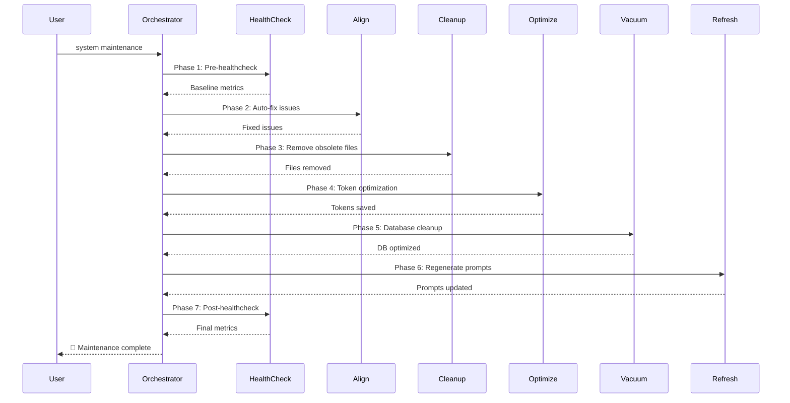

# CORTEX 4.0 Documentation Orchestrator

**Version:** 4.0 | **Author:** Asif Hussain | **Status:** ✅ PRODUCTION  
**Copyright © 2025 Asif Hussain. All rights reserved.**

---

## 🎯 Purpose

Autonomous documentation generation orchestrator that discovers, analyzes, and documents all CORTEX 4.0 features, capabilities, orchestrators, and infrastructure with:
- **Technical documentation** (architecture, APIs, integration guides)
- **Interactive D3.js visualizations** (architecture diagrams, flow charts, metrics dashboards)
- **Mermaid diagrams** (flowcharts, sequence diagrams, mindmaps, data flow diagrams)
- **Unified glassmorphism theme** (consistent styling across all pages)
- **Intelligent navigation** (breadcrumbs, cross-references, progressive disclosure)

---

## ⚠️ CRITICAL RULES

### 1. Fresh Generation (NO 3.0 References)
- **DELETE** all existing documentation under `docs/` (EXCEPT `docs/story/` - NEVER TOUCH)
- **DISCOVER** current CORTEX 4.0 features BEFORE generating docs
- **NO REFERENCES** to CORTEX 3.0 features, deprecated orchestrators, or legacy systems
- **VALIDATE** all content against current codebase (`src/`, `cortex-brain/`, `tests/`)

### 2. Story Preservation (CRITICAL)
```
docs/story/          ← NEVER TOUCH (working and integrated)
docs/index.html      ← "The Awakening of CORTEX" story button MUST remain
```

**Story Button HTML (MUST preserve exactly):**
```html
<a href="story/index.html" class="btn-hero btn-hero-story btn-hero-full-width">
    <span class="btn-hero-icon"></span>
    <span class="btn-hero-text">The Awakening Of CORTEX</span>
    <span class="btn-hero-caption">Read the How It All Happened</span>
</a>
```

**Validation Rules:**
- Link target: `story/index.html` (relative path, no changes)
- Awakening image: `assets/images/Awakening.png` (preserved)
- CSS classes: `btn-hero btn-hero-story btn-hero-full-width` (exact match required)
- Button must appear in hero section CTA buttons grid
- All styling attributes must remain unchanged

### 3. Discovery Sources
- **Primary:** `cortex-brain/documents/archive/CORTEX4-STATUS.md` (Phase completion, capabilities)
- **Orchestrators:** `src/orchestrators/` (Planning, TDD, System, ADO, Execution, Sanitization, Refinement, Upgrade)
- **Operations:** `cortex-operations.yaml` (302 operations - **FILTER by USER-facing only**)
- **Brain Architecture:** `cortex-brain/` (4-Tier Brain, SKULL rules, manifests)
- **Tests:** `tests/` (coverage, validation, integration tests)
- **Architecture Docs:** `cortex-brain/documents/archive/*-ARCHITECTURE.md`

### 4. User vs Admin Distinction (CRITICAL)

**Document ONLY User-Facing Features:**
- ✅ **USER:** Features developers use to build applications
- ❌ **ADMIN:** CORTEX internal enhancements, optimizations, maintenance

**User-Facing Operations (Document These):**
- `plan` - Planning System 2.0 (feature planning)
- `plan ado` - Azure DevOps integration (story/feature generation)
- `start tdd` - TDD Mastery workflow (RED-GREEN-REFACTOR)
- `sanitize` - Code sanitization (remove company data)
- `execute all phases autonomously` - Autonomous plan execution
- `upgrade cortex` - Upgrade to CORTEX 4.0
- `help` - Command reference

**Admin-Only Operations (EXCLUDE from docs):**
- `align` - CORTEX system alignment (internal maintenance)
- `refine` - CORTEX system refinement (internal optimization)
- `system maintenance` - CORTEX internal maintenance (7-phase workflow)
- `healthcheck` - CORTEX health monitoring (internal diagnostics)
- `cleanup` - CORTEX workspace cleanup (internal housekeeping)
- `optimize` - CORTEX optimization (internal performance)
- `review` - CORTEX architectural review (internal quality gates)
- `deploy` - CORTEX deployment (admin-only publish)
- `regenerate_prompts` - CORTEX prompt regeneration (internal tooling)

**Filtering Rule:**
```python
# When parsing cortex-operations.yaml
def is_user_facing(operation):
    """Determine if operation should be documented."""
    admin_keywords = [
        "align", "refine", "system maintenance", "healthcheck", 
        "cleanup", "optimize", "review", "deploy", "regenerate",
        "cortex internal", "maintenance", "housekeeping"
    ]
    
    # Check deployment_tier
    if operation.get("deployment_tier") == "admin":
        return False
    
    # Check description for admin keywords
    description = operation.get("description", "").lower()
    return not any(keyword in description for keyword in admin_keywords)
```

---

## 🏗️ Documentation Structure

### Root Dashboard (`docs/index.html`)
**Preserve:** Hero section with CORTEX logo, story button, navigation
**Update:** Core capabilities grid with links to new documentation

### Category Structure
```
docs/
├── index.html                          ← Main dashboard (UPDATE, preserve story button)
├── story/                              ← NEVER TOUCH (working)
├── assets/
│   ├── css/
│   │   └── main.css                    ← Glassmorphism theme
│   ├── images/
│   │   └── CORTEX-logo.png            ← Logo (use in all pages)
│   └── js/
│       └── d3.min.js                   ← D3.js library
├── architecture/
│   ├── index.html                      ← Architecture overview
│   ├── four-tier-brain.html            ← Tier 0-3 architecture
│   ├── base-orchestrator.html          ← BaseOrchestrator pattern
│   ├── multi-repo.html                 ← Phase 11 multi-repo architecture
│   ├── diagrams/
│   │   ├── brain-architecture.html     ← D3.js visualization
│   │   ├── brain-flow.mmd              ← Mermaid flowchart
│   │   └── orchestrator-hierarchy.html ← D3.js tree diagram
│   └── assets/                         ← Architecture-specific assets
├── orchestrators/
│   ├── index.html                      ← Orchestrator overview grid (USER-facing only)
│   ├── planning-system.html            ← Planning System 2.0 (DoR/DoD, incremental, TDD) [USER]
│   ├── tdd-orchestrator.html           ← TDD Mastery (RED-GREEN-REFACTOR) [USER]
│   ├── execution-orchestrator.html     ← Autonomous plan execution [USER]
│   ├── ado-operations.html             ← Azure DevOps integration [USER]
│   ├── sanitization.html               ← Code sanitization workflow [USER]
│   ├── upgrade.html                    ← Upgrade orchestrator (3.0→4.0) [USER]
│   <!-- ADMIN ORCHESTRATORS EXCLUDED: system-maintenance, refinement, alignment, healthcheck -->
│   ├── diagrams/
│   │   ├── planning-flow.html          ← D3.js Sankey diagram (5 phases)
│   │   ├── tdd-cycle.html              ← D3.js RED-GREEN-REFACTOR cycle
│   │   ├── maintenance-flow.mmd        ← Mermaid sequence diagram
│   │   └── orchestrator-interactions.html ← D3.js force-directed graph
│   └── assets/
├── features/
│   ├── index.html                      ← Features overview
│   ├── dashboard-system.html           ← Dashboard system
│   ├── workspace-detection.html        ← Multi-workspace detection (Phase 11)
│   ├── brain-persistence.html          ← Tier 3 segmentation (Phase 11)
│   ├── diagrams/
│   │   ├── feature-coverage.html       ← D3.js radar chart
│   │   └── workspace-flow.mmd          ← Mermaid flowchart
│   └── assets/
├── governance/
│   ├── skull-rulebook.html             ← 22 SKULL rules (preserve if exists)
│   ├── dor-dod.html                    ← DoR/DoD compliance
│   ├── diagrams/
│   │   ├── skull-enforcement.html      ← D3.js bar chart (rule compliance)
│   │   └── governance-flow.mmd         ← Mermaid mindmap
│   └── assets/
├── knowledge-library/
│   ├── index.html                      ← Phase 10 knowledge library overview
│   ├── planning-patterns.html          ← Planning patterns library
│   ├── tdd-patterns.html               ← TDD patterns library
│   ├── diagrams/
│   │   ├── knowledge-graph.html        ← D3.js force-directed graph (8,429 nodes)
│   │   └── pattern-usage.html          ← D3.js bar chart
│   └── assets/
├── validation/
│   ├── index.html                      ← Phase 13B STS validation overview
│   ├── capabilities.html               ← 9 validated capabilities
│   ├── metrics.html                    ← Performance metrics
│   ├── diagrams/
│   │   ├── capability-matrix.html      ← D3.js heatmap
│   │   ├── test-coverage.html          ← D3.js donut chart
│   │   └── sts-workflow.mmd            ← Mermaid sequence diagram
│   └── assets/
├── api/
│   ├── index.html                      ← API documentation overview
│   ├── orchestrators-api.html          ← Orchestrator APIs
│   ├── brain-api.html                  ← Brain tier APIs
│   └── assets/
└── technical/                          # 🆕 Technical documentation hub (24 subdirectories)
    ├── index.html                      # Technical hub landing page (PRESERVE if exists)
    ├── api/                            # API documentation
    │   ├── index.html                  # API overview
    │   ├── orchestrators/              # 6 USER-facing orchestrator APIs
    │   │   ├── planning-system-api.html
    │   │   ├── tdd-mastery-api.html
    │   │   ├── execution-api.html
    │   │   ├── ado-operations-api.html
    │   │   ├── sanitization-api.html
    │   │   └── upgrade-api.html
    │   ├── agents/                     # 2 Agent APIs
    │   │   ├── strategic-planning-agent.html
    │   │   └── code-execution-agent.html
    │   └── brain-tiers/                # 4 Brain Tier APIs
    │       ├── tier0-governance.html
    │       ├── tier1-working-memory.html
    │       ├── tier2-knowledge-graph.html
    │       └── tier3-dev-context.html
    ├── workflows/                      # Workflow diagrams
    │   ├── index.html
    │   ├── flowcharts/                 # Mermaid flowcharts
    │   │   ├── planning-workflow.html
    │   │   ├── tdd-cycle.html
    │   │   ├── sanitization-flow.html
    │   │   └── maintenance-workflow.html
    │   └── sequence-diagrams/          # Mermaid sequence diagrams
    │       ├── orchestrator-interaction.html
    │       ├── brain-query-sequence.html
    │       └── agent-collaboration.html
    ├── setup-guides/                   # Setup & installation
    │   ├── index.html
    │   ├── quick-start.html
    │   ├── advanced-setup.html
    │   └── environment-config.html
    ├── integration/                    # Integration guides
    │   ├── index.html
    │   ├── copilot-integration.html
    │   ├── vscode-setup.html
    │   └── diagrams/
    │       └── integration-architecture.html
    ├── deployment/                     # Deployment guides
    │   ├── index.html
    │   ├── local-deployment.html
    │   ├── team-deployment.html
    │   └── diagrams/
    │       └── deployment-flow.html
    ├── troubleshooting/                # Troubleshooting
    │   ├── index.html
    │   ├── common-issues.html
    │   └── debug-guide.html
    ├── performance/                    # Performance docs
    │   ├── index.html
    │   ├── optimization-guide.html
    │   └── benchmarks.html
    ├── security/                       # Security docs
    │   ├── index.html
    │   ├── skull-security.html
    │   └── best-practices.html
    ├── testing/                        # Testing docs
    │   ├── index.html
    │   ├── tdd-guide.html
    │   ├── test-pyramid.html
    │   └── coverage-reports.html
    ├── design-decisions/               # Design rationale
    │   ├── index.html
    │   ├── architecture-decisions.html
    │   └── trade-offs.html
    ├── data-flow/                      # Data flow diagrams
    │   ├── index.html
    │   └── dfd-diagrams/
    │       ├── brain-data-flow.html
    │       └── orchestrator-data-flow.html
    ├── examples/                       # Code examples
    │   ├── index.html
    │   └── code-samples/
    │       ├── planning-example.html
    │       ├── tdd-example.html
    │       └── sanitization-example.html
    ├── glossary/                       # Glossary
    │   ├── index.html
    │   └── terms.html
    └── assets/                         # Technical docs assets (PRESERVE if exists)
        ├── scripts/                    # JavaScript files
        │   └── navigation.js
        └── styles/                     # CSS files
            ├── glassmorphism.css
            └── diagrams.css
```

---

## 🎨 Design System (Glassmorphism)

### Theme Variables (from `assets/css/main.css`)
```css
:root {
    --bg-primary: #0a0e27;
    --bg-secondary: #1a1f3a;
    --glass-bg: rgba(26, 31, 58, 0.7);
    --glass-border: rgba(255, 255, 255, 0.1);
    --accent-primary: #00d4ff;
    --accent-secondary: #7b61ff;
    --text-primary: #ffffff;
    --text-secondary: #a0a6c0;
    --success: #00ff88;
    --warning: #ffa500;
    --danger: #ff4444;
    --shadow: 0 8px 32px 0 rgba(0, 0, 0, 0.37);
    --glow: 0 0 20px rgba(0, 212, 255, 0.3);
}
```

### Page Template Structure
```html
<!DOCTYPE html>
<html lang="en">
<head>
    <meta charset="UTF-8">
    <meta name="viewport" content="width=device-width, initial-scale=1.0">
    <title>{Page Title} - CORTEX 4.0</title>
    <link rel="icon" type="image/png" href="../assets/images/CORTEX-logo.png">
    <link rel="stylesheet" href="../assets/css/main.css">
</head>
<body>
    <!-- Logo Header (consistent across all pages) -->
    <div class="logo-header">
        
    </div>
    
    <!-- Breadcrumb Navigation -->
    <nav class="breadcrumb">
        <a href="../index.html">Home</a>
        <span class="separator">→</span>
        <a href="./index.html">{Category}</a>
        <span class="separator">→</span>
        <span class="current">{Page Title}</span>
    </nav>
    
    <!-- Main Content -->
    <main class="container">
        <div class="glass-card">
            <h1>{Page Title}</h1>
            <p class="description">{Clear, concise description of functionality}</p>
            
            <!-- Content sections -->
            {Content}
            
            <!-- Interactive Diagram -->
            <div class="diagram-container">
                <h2>Interactive Visualization</h2>
                <div id="diagram"></div>
            </div>
        </div>
    </main>
    
    <!-- Scripts -->
    <script src="../assets/js/d3.min.js"></script>
    <script>
        // D3.js visualization code
    </script>
</body>
</html>
```

### Logo Styling (EXACT from index.html)
```css
.logo-header {
    text-align: center;
    padding: 2rem 0 1rem 0;
    background: transparent;
}

.page-logo {
    height: 80px;
    width: auto;
    filter: drop-shadow(0 0 20px rgba(0, 212, 255, 0.6));
    transition: filter 0.3s ease;
    border: none;
    background: transparent;
}

.page-logo:hover {
    filter: drop-shadow(0 0 40px rgba(0, 212, 255, 0.9));
}
```

### Breadcrumb Navigation
```css
.breadcrumb {
    max-width: 1400px;
    margin: 0 auto;
    padding: 1rem 2rem;
    display: flex;
    align-items: center;
    gap: 0.5rem;
    font-size: 0.9rem;
    color: var(--text-secondary);
}

.breadcrumb a {
    color: var(--accent-primary);
    text-decoration: none;
    transition: all 0.2s ease;
}

.breadcrumb a:hover {
    color: var(--text-primary);
    text-shadow: 0 0 15px rgba(0, 212, 255, 0.5);
}

.breadcrumb .separator {
    opacity: 0.5;
}

.breadcrumb .current {
    color: var(--text-primary);
}
```

---

## 🔍 Global Search System (Lunr.js)

### Why Lunr.js
- ✅ **Lightweight:** 3.5KB gzipped (12KB uncompressed)
- ✅ **Client-side:** No server required, works offline
- ✅ **GitHub Pages compatible:** Pure JavaScript, no backend
- ✅ **Full-text search:** Stemming, relevance scoring
- ✅ **Performance:** <200ms search response for 100+ pages
- ✅ **No API keys:** Zero dependencies, no rate limits

### Required Assets
```
docs/
├── assets/js/
│   ├── lunr.min.js                 ← Lunr.js library (download from CDN)
│   └── search.js                   ← Search implementation (create)
└── search-index.json               ← Search index (auto-generated)
```

### Search Index Structure
**File:** `docs/search-index.json` (auto-generated during Phase 3: Content Generation)
```json
{
  "version": "1.0",
  "generated": "2025-12-27T10:30:00Z",
  "index": {
    "version": "2.3.9",
    "fields": ["title", "category", "tags", "content"],
    "ref": "id",
    "documentStore": { ... },
    "tokenStore": { ... },
    "pipeline": ["stemmer"]
  },
  "docs": [
    {
      "id": "architecture/four-tier-brain.html",
      "title": "4-Tier Brain Architecture",
      "category": "Architecture",
      "tags": ["brain", "tier0", "tier1", "tier2", "tier3"],
      "excerpt": "Hierarchical memory system with Tier 0 governance...",
      "url": "architecture/four-tier-brain.html"
    }
  ]
}
```

### Search UI Components
**Add to all page templates (after logo header):**
```html
<!-- Global Search Bar -->
<div class="search-container">
    <i class="fas fa-search search-icon"></i>
    <input type="text" 
           id="globalSearch" 
           class="search-input" 
           placeholder="Search documentation..." 
           autocomplete="off"
           aria-label="Search CORTEX documentation">
    <kbd class="search-shortcut">Ctrl+K</kbd>
</div>

<!-- Search Results Dropdown -->
<div id="searchResults" class="search-results" hidden>
    <div class="search-results-header">
        <span id="searchResultsCount" class="search-results-count">0 results</span>
        <button id="closeSearch" class="search-results-close" aria-label="Close search">✕</button>
    </div>
    <ul id="searchResultsList" class="search-results-list"></ul>
</div>
```

### Keyboard Shortcuts
- **Ctrl+K / Cmd+K:** Focus search bar
- **Escape:** Close search results
- **Arrow Up/Down:** Navigate results
- **Enter:** Open selected result

### Search CSS Styling
**Add to `assets/css/main.css`:**
```css
/* Search Container */
.search-container {
    position: relative;
    max-width: 600px;
    margin: 0 auto 2rem;
}

.search-input {
    width: 100%;
    padding: 1rem 3rem 1rem 1.5rem;
    background: var(--glass-bg);
    border: 2px solid var(--glass-border);
    border-radius: 12px;
    color: var(--text-primary);
    font-size: 1rem;
    backdrop-filter: blur(10px);
    transition: all 0.3s ease;
}

.search-input:focus {
    outline: none;
    border-color: var(--accent-primary);
    box-shadow: var(--glow);
}

.search-results {
    position: absolute;
    top: calc(100% + 0.5rem);
    left: 0;
    right: 0;
    max-height: 500px;
    overflow-y: auto;
    background: var(--glass-bg);
    border: 2px solid var(--glass-border);
    border-radius: 12px;
    backdrop-filter: blur(10px);
    z-index: 1000;
    box-shadow: var(--shadow);
}

.search-result-item {
    padding: 1rem 1.5rem;
    border-bottom: 1px solid var(--glass-border);
    cursor: pointer;
    transition: background 0.2s ease;
}

.search-result-item:hover,
.search-result-item.active {
    background: rgba(0, 212, 255, 0.1);
}

.search-result-match {
    background: rgba(0, 212, 255, 0.3);
    color: var(--accent-primary);
    font-weight: 600;
}
```

### Search Implementation
**File:** `docs/assets/js/search.js`
```javascript
class CortexSearch {
    constructor() {
        this.searchInput = document.getElementById('globalSearch')
        this.searchResults = document.getElementById('searchResults')
        this.index = null
        this.docs = []
        this.init()
    }
    
    async init() {
        // Load search index
        const response = await fetch('/search-index.json')
        const data = await response.json()
        this.index = lunr.Index.load(data.index)
        this.docs = data.docs
        
        // Event listeners
        this.searchInput.addEventListener('input', this.handleSearch.bind(this))
        
        // Keyboard shortcut: Ctrl+K
        document.addEventListener('keydown', (e) => {
            if ((e.ctrlKey || e.metaKey) && e.key === 'k') {
                e.preventDefault()
                this.searchInput.focus()
            }
        })
    }
    
    handleSearch(e) {
        const query = e.target.value.trim()
        if (query.length < 2) return this.closeResults()
        
        const results = this.index.search(query + '*')
        this.displayResults(results, query)
    }
}

// Initialize on page load
new CortexSearch()
```

---

## 📊 Visualization Requirements

### D3.js Diagrams (High Value)
1. **Brain Architecture** (`architecture/diagrams/brain-architecture.html`)
   - 4-tier hierarchical visualization (Tier 0-3)
   - Node sizes based on data volume (Tier 2: 8,429 nodes)
   - Color coding: Governance (red), Working Memory (blue), Knowledge (green), Dev Context (purple)
   - Interactive: Click nodes to show details, zoom/pan

2. **Orchestrator Interactions** (`orchestrators/diagrams/orchestrator-interactions.html`)
   - Force-directed graph showing orchestrator dependencies
   - Nodes: All 8+ orchestrators
   - Edges: Communication/dependency relationships
   - Interactive: Hover for details, drag nodes

3. **Planning System Flow** (`orchestrators/diagrams/planning-flow.html`)
   - Sankey diagram: 5 phases (DoR → Planning → Implementation → Testing → DoD)
   - Flow thickness based on task complexity
   - Color transitions: DoR (orange) → Planning (blue) → Implementation (green) → Testing (yellow) → DoD (purple)

4. **TDD Cycle** (`orchestrators/diagrams/tdd-cycle.html`)
   - Circular flow: RED → GREEN → REFACTOR → (repeat)
   - Phase indicators with test counts, code coverage
   - Interactive: Click phase to see details

5. **Knowledge Graph** (`knowledge-library/diagrams/knowledge-graph.html`)
   - Force-directed graph with 8,429 nodes (sample: show 100-200 key nodes)
   - Node types: Patterns, Orchestrators, Operations, Dependencies
   - Interactive: Filter by type, search nodes, expand clusters

6. **Capability Matrix** (`validation/diagrams/capability-matrix.html`)
   - Heatmap: 9 capabilities × validation metrics
   - Color scale: Green (passing) → Red (failing)
   - Interactive: Click cell for detailed validation report

7. **Test Coverage** (`validation/diagrams/test-coverage.html`)
   - Donut chart: Overall coverage (97.6% pass rate)
   - Inner ring: Test categories (unit, integration, orchestrator)
   - Outer ring: Individual test suites

### Mermaid Diagrams (All Orchestrators)
**Generate from `cortex-brain/documents/archive/visual-progress-integration.md` structure:**

1. **Maintenance Flow** (`orchestrators/diagrams/maintenance-flow.mmd`)


2. **Planning System Workflow** (5-phase flowchart)
3. **TDD RED-GREEN-REFACTOR** (circular flow diagram)
4. **Execution Orchestrator Phases** (sequence diagram)
5. **ADO Operations Flow** (flowchart with DoR/DoD gates)
6. **Sanitization Workflow** (data flow diagram)
7. **Refinement Phases** (7-phase flowchart)
8. **Upgrade Process** (5-phase sequence diagram)
9. **Brain Tier Flow** (data flow diagram)
10. **SKULL Governance** (mindmap of 22 rules)

---

## 🔍 Discovery Phase

### Step 1: Feature Discovery
### Step 1: Feature Discovery
```python
# Pseudo-code for discovery
features = []

# 1. Parse CORTEX4-STATUS.md for USER-facing completed phases
phases = parse_markdown("cortex-brain/documents/archive/CORTEX4-STATUS.md")
features.extend([
    "Phase 5: Brain + Agentic AI (164+ tests, 98%+ coverage)",  # USER: Multi-workspace support
    "Phase 6: Orchestrator Consolidation (142/142 tests, 95% agentic)",  # USER: Enhanced workflows
    "Phase 7B: Universal Adapters + DI (82/82 tests)",  # BACKEND: Skip internal DI details
    "Phase 11: Multi-Repo Architecture (98/98 tests, 1:∞ scaling)",  # USER: Workspace detection
    "Phase 13B: STS Validation (9/9 capabilities, 72% efficiency)"  # ADMIN: Skip internal validation
])

# 2. Discover USER-facing orchestrators only
orchestrators = discover_directory("src/orchestrators/")
user_facing_orchestrators = ["planning", "tdd", "execution", "ado", "sanitization", "upgrade"]
for orch in orchestrators:
    if orch.name.lower() in user_facing_orchestrators:
        features.append({
            "name": orch.name,
            "path": orch.path,
            "phases": extract_phases(orch.implementation),
            "tests": find_tests(f"tests/{orch.name}"),
            "manifest": find_manifest(f"cortex-brain/manifests/{orch.name}")
        })

# 3. Parse cortex-operations.yaml - FILTER by USER-facing only
operations = parse_yaml("cortex-operations.yaml")
user_operations = [op for op in operations if is_user_facing(op)]
features.extend(user_operations)
# 4. Extract SKULL rules
skull_rules = parse_yaml("cortex-brain/brain-protection-rules.yaml")

# 5. Extract knowledge library patterns (Phase 10)
patterns = discover_directory("cortex-brain/knowledge-library/")

# 6. Extract validation capabilities (Phase 13B)
capabilities = parse_sts_validation()

return features
```

### Step 2: Architecture Analysis
```python
# Extract architecture from multiple sources
architecture = {
    "brain": parse_architecture("cortex-brain/documents/archive/BRAIN-ARCHITECTURE.md"),
    "orchestrators": [
        parse_architecture("cortex-brain/documents/archive/BASE-ORCHESTRATOR-ARCHITECTURE.md"),
        parse_architecture("cortex-brain/documents/archive/EXECUTION-ORCHESTRATOR-ARCHITECTURE.md"),
        parse_architecture("cortex-brain/documents/archive/TDD-ORCHESTRATOR-ARCHITECTURE.md"),
        parse_architecture("cortex-brain/documents/archive/PLANNING-ORCHESTRATOR-ARCHITECTURE.md"),
        # ... 6 more orchestrators
    ],
    "multi_repo": parse_architecture("cortex-brain/documents/archive/MULTI-REPO-ARCHITECTURE.md")
}
```

### Step 3: Test Coverage Analysis
```python
# Aggregate test results
coverage = {
    "total_tests": count_tests("tests/"),
    "pass_rate": calculate_pass_rate(),
    "orchestrator_tests": {
        "planning": 22,
        "tdd": 26,
        "execution": 21,
        "maintenance": 53,
        # ... all orchestrators
    },
    "phase_11_tests": 98,
    "phase_13b_capabilities": 9
}
```

---

## 📝 Content Generation Rules

### 1. Orchestrator Pages
**Required Sections:**
- **Overview:** Purpose, capabilities, phase count
- **Architecture:** Component diagram (reference architecture docs)
- **Workflow:** Phase-by-phase breakdown with progress tracking
- **Integration:** How it connects with other orchestrators
- **Configuration:** Manifest structure, YAML configuration
- **Usage Examples:** 3-5 real-world scenarios with code
- **Testing:** Test coverage, validation approach
- **Performance:** Metrics (execution time, efficiency gains)
- **Interactive Diagram:** D3.js/Mermaid visualization

**Example Template:**
```markdown
## 🎯 Planning System 2.0 Overview

CORTEX's autonomous multi-phase feature planning orchestrator with:
- **DoR/DoD Compliance:** Automated acceptance criteria validation
- **Complexity Detection:** AUTO-COMPLEXITY routing (HIGH→incremental, LOW→skeleton)
- **TDD Integration:** Auto-included in all plans (RED-GREEN-REFACTOR)
- **Incremental Execution:** 5 phases with autonomous progression

### 📊 Key Metrics
- **Phases:** 5 (DoR → Planning → Implementation → Testing → DoD)
- **Test Coverage:** 22/22 tests passing (100%)
- **Manifests:** `planning-system-manifest.yaml`, `ado-planning-manifest.yaml`
- **DoR Compliance:** 100% enforcement
- **TDD Success Rate:** 94%

### 🏗️ Architecture
[Reference: BASE-ORCHESTRATOR-ARCHITECTURE.md, PLANNING-ORCHESTRATOR-ARCHITECTURE.md]

### 🔄 5-Phase Workflow
1. **DoR Validation** - Acceptance criteria, constraints, complexity analysis
2. **Planning** - Generate plan structure, identify dependencies
3. **Implementation Planning** - Scaffold code, define interfaces
4. **Testing Strategy** - TDD integration, coverage targets
5. **DoD Validation** - Success criteria, acceptance gates

### 🔗 Integration Points
- **TDD Orchestrator:** Auto-invoked for test generation
- **Execution Orchestrator:** Plan execution automation
- **ADO Operations:** Inherits Planning System + ADO formatting

### 📋 Configuration
[Show manifest YAML with explanation]

### 💡 Usage Examples
[3-5 scenarios with code]

### 🧪 Testing
[Coverage details, validation approach]

### 📈 Performance
- Execution Time: 2-5 minutes per plan
- Efficiency Gains: 40% reduction in planning time

### 📊 Interactive Visualization
[D3.js Sankey diagram showing 5-phase flow]
```

### 2. Architecture Pages
**Required Sections:**
- **Conceptual Overview:** High-level architecture explanation
- **Component Breakdown:** Detailed component descriptions
- **Data Flow:** How data moves through tiers/components
- **Integration:** How components communicate
- **Design Patterns:** Patterns used (Strategy, Template Method, etc.)
- **Performance:** Metrics (query time, scalability)
- **Interactive Diagram:** D3.js hierarchical or force-directed graph

### 3. Feature Pages
**Required Sections:**
- **What It Does:** Clear functionality description
- **Why It Matters:** Business value, developer productivity impact
- **How It Works:** Technical implementation overview
- **Integration:** Where it fits in CORTEX ecosystem
- **Usage:** Practical examples
- **Performance:** Metrics, benchmarks

---

## 🎭 Visual Progress Integration

**Source:** `cortex-brain/documents/archive/visual-progress-integration.md`

### Progress Bar Components
All orchestrator documentation pages MUST show:
1. **Phase Progress Bar:** ASCII progress bar for current phase
2. **Phase List:** All phases with completion status (✅/🔄/⏳)
3. **Current Task:** What the orchestrator is currently executing
4. **Elapsed Time:** Real-time execution tracking
5. **Metrics:** Tasks completed, total tasks, percentage

### Example Progress Display
```markdown
## 🔄 Execution Progress

**Progress:** [████████░░░░░░░░░░░░] 40%

🔄 **Phase 2 of 5:** Implementation Planning
✅ **Tasks Completed:** 15/50
⏱️  **Elapsed Time:** 2m 35s
📋 **Current Task:** Generating Clean Architecture scaffold

### Phase Status
✅ Phase 1: DoR Validation - COMPLETE
🔄 Phase 2: Implementation Planning - IN PROGRESS
⏳ Phase 3: Testing Strategy - PENDING
⏳ Phase 4: Code Generation - PENDING
⏳ Phase 5: DoD Validation - PENDING
```

### Integration in Documentation
Every orchestrator page MUST include:
- Visual progress section (if orchestrator has multi-phase execution)
- Phase transition diagram (Mermaid sequence diagram)
- Progress tracking code samples (from BaseOrchestrator)

---

## 🚀 Execution Workflow

### Phase 1: Preparation (DELETE & DISCOVER)
1. **DELETE** all files in `docs/` EXCEPT:
   - `docs/story/` (entire directory - NEVER TOUCH)
   - `docs/assets/images/CORTEX-logo.png` (preserve logo)
   - `docs/assets/images/Awakening.png` (preserve story button image)
   - `docs/assets/css/main.css` (preserve theme)

2. **DISCOVER** current features:
   - Run discovery scripts (Step 1 above)
   - Parse architecture documents
   - Extract orchestrator details
   - Aggregate test coverage
   - Identify capabilities (Phase 13B)

3. **VALIDATE** discoveries:
   - Cross-reference with codebase
   - Verify test results
   - Confirm orchestrator implementations

### Phase 2: Structure Generation
1. Create directory structure (see "Documentation Structure" above)
2. Generate category index pages (architecture/index.html, orchestrators/index.html, etc.)
3. Set up asset directories for each category
### Phase 3: Content Generation
**Priority Order:**
1. **Home Dashboard** (`docs/index.html`)
   - **CRITICAL:** Preserve story button HTML exactly as specified in "Story Preservation" section
   - Update capability grid with new features (including Technical Documentation card)
   - Add new metrics from Phase 13B validation
   - Verify story button placement in hero section CTA grid
   - Validate link path: `story/index.html` works correctly
   - Add global search bar to hero section

2. **Generate Search Index** (`docs/search-index.json`)
   ```javascript
   // Pseudo-code for search index generation
   const searchDocs = []
   
   for (const page of generatedPages) {
       const $ = cheerio.load(page.html)
       const title = $('h1').first().text().trim()
       const category = page.category
       const tags = extractTags($) // From h2/h3 headings, meta keywords
       const excerpt = $('p.description').first().text().trim().substring(0, 200)
       
       // Remove navigation, code blocks for cleaner search
       $('.breadcrumb, nav, footer, pre, code').remove()
       const content = $('main').text().replace(/\s+/g, ' ').trim().substring(0, 5000)
       
       searchDocs.push({
           id: page.url,
           title: title,
           category: category,
           tags: tags,
           excerpt: excerpt,
           content: content,
           url: page.url
       })
   }
   
   // Build Lunr index
   const idx = lunr(function () {
       this.ref('id')
       this.field('title', { boost: 10 })     // Titles weighted 10x
       this.field('category', { boost: 5 })   // Categories weighted 5x
       this.field('tags', { boost: 5 })       // Tags weighted 5x
       this.field('content')                  // Body content normal weight
       searchDocs.forEach(doc => this.add(doc))
   })
   
   // Save to JSON
   fs.writeFileSync('docs/search-index.json', JSON.stringify({
       version: '1.0',
       generated: new Date().toISOString(),
       index: idx.toJSON(),
       docs: searchDocs.map(doc => ({
           id: doc.id,
           title: doc.title,
           category: doc.category,
           tags: doc.tags,
           excerpt: doc.excerpt,
           url: doc.url
       }))
   }, null, 2))
   ```

3. **Orchestrator Documentation** (6 pages - USER-facing only)
   - Planning System 2.0 [USER]
   - TDD Mastery [USER]
   - Execution Orchestrator [USER]
   - ADO Operations [USER]
   - Sanitization [USER]
   - Upgrade (3.0→4.0) [USER]
   
   **EXCLUDED (Admin-only):**
   - System Maintenance (CORTEX internal maintenance)
   - Refinement (CORTEX internal optimization)
   - Alignment (CORTEX system alignment)
   - Healthcheck (CORTEX diagnostics)
   - Refinement
   - Upgrade (3.0→4.0)

3. **Architecture Documentation** (5 pages)
   - 4-Tier Brain
   - BaseOrchestrator
   - Multi-Repo Architecture
   - Orchestrator Hierarchy
   - Integration Patterns

4. **Feature Documentation** (5 pages)
   - Dashboard System
   - Workspace Detection
   - Brain Persistence
   - Knowledge Library
   - Validation Suite

5. **Governance Documentation** (3 pages)
   - SKULL Rulebook (22 rules)
   - DoR/DoD Compliance
   - Quality Gates

6. **Validation Documentation** (Phase 13B)
   - 9 Validated Capabilities
   - Performance Metrics
   - Efficiency Analysis

### Phase 4: Visualization Generation
1. **D3.js Diagrams** (7 high-value visualizations)
2. **Mermaid Diagrams** (10 workflow diagrams)
3. **Chart Integration** (embed in documentation pages)

### Phase 5: Navigation & Cross-Linking
1. Add breadcrumbs to all pages
2. Create cross-reference links between related pages
3. Update home dashboard navigation grid
4. Add "Related Documentation" sections
1. **Visual Validation:** All pages render correctly with glassmorphism theme
2. **Logo Validation:** CORTEX logo appears on all pages (except home) with glow effect
3. **Breadcrumb Validation:** All breadcrumbs link back to home
4. **Story Preservation (CRITICAL):**
   - Verify `docs/story/` directory completely untouched
   - Story button HTML matches specification exactly
   - Story button link `story/index.html` works (click test)
   - Awakening image `assets/images/Awakening.png` displays correctly
   - Button appears in hero section CTA grid
   - All CSS classes intact: `btn-hero btn-hero-story btn-hero-full-width`
5. **Link Validation:** All internal links resolve correctly
6. **Diagram Validation:** All D3.js and Mermaid diagrams render
7. **Responsive Validation:** Pages work on mobile/tablet/desktop
6. **Diagram Validation:** All D3.js and Mermaid diagrams render
### Pre-Generation
- [ ] Parsed `CORTEX4-STATUS.md` for USER-facing Phase completion status
- [ ] Discovered USER-facing orchestrators in `src/orchestrators/` (Planning, TDD, Execution, ADO, Sanitization, Upgrade)
- [ ] **EXCLUDED ADMIN orchestrators** (System Maintenance, Refinement, Alignment, Healthcheck)
- [ ] Extracted USER-facing operations from `cortex-operations.yaml` (filtered by `deployment_tier != "admin"`)
- [ ] Identified 22 SKULL rules (USER-relevant enforcement)
### Post-Generation
- [ ] Home dashboard updated (preserves story button)
- [ ] **Story button HTML matches exactly** (including all CSS classes, image paths, text)
- [ ] **Story button link verified:** `story/index.html` resolves correctly
- [ ] **Awakening image preserved:** `assets/images/Awakening.png` accessible
- [ ] **6 USER-facing orchestrator pages created** (Planning, TDD, Execution, ADO, Sanitization, Upgrade)
- [ ] **NO ADMIN orchestrator pages** (System Maintenance, Refinement, Alignment excluded)
- [ ] 5 architecture pages created with visualizations (USER-relevant architecture only)
### Post-Generation
- [ ] Home dashboard updated (preserves story button)
- [ ] **Story button HTML matches exactly** (including all CSS classes, image paths, text)
- [ ] **Story button link verified:** `story/index.html` resolves correctly
- [ ] **Awakening image preserved:** `assets/images/Awakening.png` accessible
- [ ] **Technical Documentation button added** to hero CTA section
- [ ] **Technical Documentation card added** to Core Capabilities grid
- [ ] 6 USER-facing orchestrator pages created (Planning, TDD, Execution, ADO, Sanitization, Upgrade)
- [ ] 24 docs/technical/ subdirectories populated (80+ pages total)
- [ ] 5 architecture pages created with visualizations
- [ ] 5 feature pages created
- [ ] 3 governance pages created
- [ ] 3 validation pages created (Phase 13B)
- [ ] **Global search assets installed:**
  - [ ] `docs/assets/js/lunr.min.js` (downloaded from CDN)
  - [ ] `docs/assets/js/search.js` (created)
  - [ ] `docs/search-index.json` (auto-generated with 100+ pages indexed)
- [ ] **Search functionality validated:**
  - [ ] Search bar appears on all pages
  - [ ] Ctrl+K focuses search input
  - [ ] Search returns results <200ms
  - [ ] Arrow keys navigate results
  - [ ] Enter opens selected result
  - [ ] Escape closes dropdown
  - [ ] Mobile responsive (search icon, no shortcuts shown)
- [ ] All pages have CORTEX logo with glow
- [ ] All pages have breadcrumb navigation
- [ ] All pages have global search bar
- [ ] All D3.js diagrams render correctly
- [ ] All Mermaid diagrams render correctly
- [ ] `docs/story/` directory UNTOUCHED
- [ ] Story button on home page WORKS (click test)
- [ ] No CORTEX 3.0 references in documentation
- [ ] All links resolve correctly
- [ ] Glassmorphism theme consistent across all pages
- [ ] Mobile responsive design validated
- [ ] Search index size <500KB
- [ ] Glassmorphism theme consistent across all pages
- [ ] Mobile responsive design validated

---

## 🎯 Success Criteria

1. **Completeness:** All CORTEX 4.0 features documented
2. **Accuracy:** No CORTEX 3.0 references, all content validated against codebase
3. **Interactivity:** 7+ D3.js visualizations, 10+ Mermaid diagrams
4. **Consistency:** Unified glassmorphism theme across all pages
5. **Navigation:** Clear breadcrumbs, cross-references, progressive disclosure
6. **Story Preservation:** `docs/story/` untouched, story button functional
7. **Visual Quality:** Logo with glow on all pages, consistent styling
8. **Performance:** Fast page loads, optimized diagrams
9. **Accessibility:** Semantic HTML, ARIA labels, keyboard navigation

---

## 📚 Reference Documents

- **Status:** `cortex-brain/documents/archive/CORTEX4-STATUS.md`
- **Visual Progress:** `cortex-brain/documents/archive/visual-progress-integration.md`
- **Architecture:** `cortex-brain/documents/archive/*-ARCHITECTURE.md` (10 files)
- **Operations:** `cortex-operations.yaml`
1. ❌ **NO CORTEX 3.0 references** - Only document CORTEX 4.0 features
2. ❌ **NO placeholder content** - All pages must have real, validated content
3. ❌ **NO generic descriptions** - Every page needs specific functionality details
4. ❌ **NO missing diagrams** - All orchestrators need visual workflows
5. ❌ **NO broken links** - All navigation must work
6. ❌ **NO story directory modifications** - `docs/story/` is off-limits
7. ❌ **NO theme inconsistencies** - All pages use glassmorphism design system
8. ❌ **NO logo variations** - Use exact logo styling from index.html
9. ❌ **NO ADMIN-only features documented** - System Maintenance, Refinement, Alignment, Healthcheck are internal CORTEX operations
10. ❌ **NO internal optimization workflows** - Document USER workflows only (planning, TDD, execution, sanitization)
1. ❌ **NO CORTEX 3.0 references** - Only document CORTEX 4.0 features
2. ❌ **NO placeholder content** - All pages must have real, validated content
3. ❌ **NO generic descriptions** - Every page needs specific functionality details
4. ❌ **NO missing diagrams** - All orchestrators need visual workflows
5. ❌ **NO broken links** - All navigation must work
6. ❌ **NO story directory modifications** - `docs/story/` is off-limits
7. ❌ **NO theme inconsistencies** - All pages use glassmorphism design system
8. ❌ **NO logo variations** - Use exact logo styling from index.html

---

**Execution:** Run `docgen` command in Copilot Chat to regenerate all documentation from scratch.
