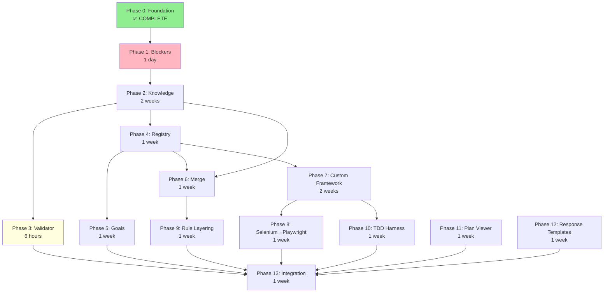

# CORTEX5 Epic v3.0 - Architecture Transformation with Sequential Phases

**Epic ID:** `cortex5-epic-v3`  
**Version:** 3.0.0  
**Status:** 🟢 ACTIVE - Phase 0 Complete, Ready for Phase 1  
**Created:** 2026-01-07  
**Timeline:** Phase 0 (Complete) + 1 day (Phase 1) + 9.25 weeks (Phases 2-13)  
**Complexity:** Tier 5 (Architectural Transformation)

---

## 🎯 Epic Mission

Transform CORTEX into an extensible, enterprise-ready AI orchestration platform with:
- **Company-specific knowledge extension** (Tier 2 company knowledge layers)
- **Custom orchestrator framework** (Business-specific automation capabilities)
- **Dynamic orchestrator registry** (YAML-driven routing, no code changes)
- **Intelligent goal detection** (LLM-powered requirement analysis)
- **Rule layering system** (Core → Company → Domain governance)

---

## 📋 Sequential Phase Structure (0-13)

### Phase Reorganization

**Original Epic Issues:**
- ❌ Fractional numbering (P01.4, P001.5)
- ❌ Non-sequential IDs (P000, P00B, P001, P1, P1.5)
- ❌ Scattered documentation

**New Structure:**
- ✅ Clean sequential numbering (0-13)
- ✅ Dependency-optimized sequencing
- ✅ Snowball effect maximized

---

## 🗓️ Phase Timeline Overview

| Phase | Name | Duration | Status | Dependencies |
|-------|------|----------|--------|--------------|
| **0** | Clean Branch Migration | 2 weeks | ✅ COMPLETE | None |
| **1** | Critical Blocker Resolution | 1 day | 🔴 NEXT | Phase 0 |
| **2** | Knowledge Extension Layer | 2 weeks | ⏸️ BLOCKED | Phase 1 |
| **3** | Python Best Practices Validator | 6 hours | 🟡 PARTIAL | Phase 2 |
| **4** | Orchestrator Registry System | 1 week | ⏸️ BLOCKED | Phase 2 |
| **5** | Intelligent Goal Detection | 1 week | ⏸️ BLOCKED | Phase 4 |
| **6** | Knowledge Merge & Override | 1 week | ⏸️ BLOCKED | Phase 2, 4 |
| **7** | Custom Orchestrator Framework | 2 weeks | ⏸️ BLOCKED | Phase 4 |
| **8** | Selenium→Playwright Reference | 1 week | ⏸️ BLOCKED | Phase 7 |
| **9** | Rule Layering System | 1 week | ⏸️ BLOCKED | Phase 6 |
| **10** | TDD Test Harness | 1 week | ⏸️ BLOCKED | Phase 7 |
| **11** | Plan Viewer Modernization | 1 week | ⏸️ BLOCKED | None |
| **12** | Response Template Optimization | 1 week | ⏸️ BLOCKED | None |
| **13** | End-to-End Integration | 1 week | ⏸️ BLOCKED | All phases |

**Total Duration:** 9.35 weeks (374 hours)  
**Current Progress:** Phase 0 complete, Phase 3 partial (validator implemented)

---

## 🌊 Snowball Effect Strategy

### Stage 1: Foundation (Weeks 0-2.25) - 25%
```
Phase 0 (COMPLETE) → Phase 1 (1 day) → Phase 2 (2 weeks) → Phase 3 (6 hours)
```
**Outcome:** Robust foundation, validator, knowledge layer operational

### Stage 2: Core Intelligence (Weeks 2.25-5.25) - 40%
```
Phase 4 (Registry, 1 week) ┐
Phase 5 (Goals, 1 week)     ├─ Parallel
Phase 6 (Merge, 1 week)     ┘
```
**Outcome:** Dynamic orchestration, intelligent routing, knowledge merge

### Stage 3: Extensibility (Weeks 5.25-8.25) - 60%
```
Phase 7 (Custom Framework, 2 weeks) → ┐
Phase 8 (Selenium→Playwright, 1 week) ├─ Sequential then Parallel
Phase 9 (Rule Layering, 1 week)       │
Phase 10 (TDD Harness, 1 week)        ┘
```
**Outcome:** Custom orchestrators, rule governance, test automation

### Stage 4: Polish (Week 8.25-9.25) - 75%
```
Phase 11 (Plan Viewer, 1 week)      ┐
Phase 12 (Response Templates, 1 week) ┘─ Parallel
```
**Outcome:** Enhanced UX, optimized responses

### Stage 5: Integration (Week 9.25-10.25) - 100%
```
Phase 13 (Integration, 1 week) → All components validated
```
**Outcome:** Production-ready CORTEX5 platform

---

## 📊 Phase Dependencies (Visual DAG)



**Critical Path:** P0 → P1 → P2 → P4 → P7 → P8 → P13 (7.85 weeks)  
**Parallel Opportunities:** 3 windows save 5 weeks (36% time reduction)

---

## 🛡️ SKULL Compliance

All phases enforce 61 brain protection rules:

| Rule | Implementation |
|------|----------------|
| **TDD_ENFORCEMENT** | Phase 10 creates autonomous TDD harness |
| **GIT_ISOLATION** | Custom orchestrators in `src/orchestrators/custom/` only |
| **PLANNING_ISOLATION** | This epic creates structure only, defers implementation |
| **AUTONOMOUS_ONLY** | All orchestrators execute independently via Python |
| **HOLISTIC_DISCOVERY** | Phase 2-4 search before create |

---

## ✅ Success Criteria

### Epic-Level Success

**Functional:**
- ✅ 3+ companies with independent knowledge libraries
- ✅ 2+ custom orchestrators operational (Selenium→Playwright + 1 other)
- ✅ Knowledge merge accuracy >95%
- ✅ Zero CORTEX core corruption

**Performance:**
- ✅ Knowledge query overhead <50ms (95th percentile)
- ✅ Custom orchestrator routing <100ms
- ✅ Zero performance regression

**Quality:**
- ✅ 100% test coverage on new components
- ✅ Zero critical bugs in integration
- ✅ All SKULL rules enforced

**Adoption:**
- ✅ 2+ developers trained
- ✅ Documentation complete
- ✅ 1+ production custom orchestrator

---

## 📁 Epic Folder Structure

```
cortex5-epic-v3/
├── 00-cortex5-epic-v3.md              # This master plan
├── README.md                          # Quick start guide
├── EXECUTIVE-SUMMARY.md               # Task completion summary
├── epic-requirements-todo.yaml        # 87 requirements (TodoManager format)
│
├── phases/
│   ├── phase-00-foundation.md         # Phase 0 (COMPLETE)
│   ├── phase-01-blocker-resolution.md # Phase 1 (NEXT)
│   ├── phase-02-knowledge-extension.md
│   ├── phase-03-python-validator.md
│   ├── phase-04-registry-system.md
│   ├── phase-05-goal-detection.md
│   ├── phase-06-knowledge-merge.md
│   ├── phase-07-custom-framework.md
│   ├── phase-08-selenium-playwright.md
│   ├── phase-09-rule-layering.md
│   ├── phase-10-tdd-harness.md
│   ├── phase-11-plan-viewer.md
│   ├── phase-12-response-templates.md
│   └── phase-13-integration.md
│
├── tracking/
│   ├── plan-data.yaml                 # Sequential phase tracking
│   ├── progress-tracker.json          # Real-time progress
│   └── snowball-momentum.md           # Snowball effect tracking
│
├── comparison/
│   └── v2-to-v3-comparison.yaml       # Validation of requirements capture
│
└── plan-viewer.html                   # Modernized interactive viewer
```

---

## 🚀 Getting Started

### Current Status: Phase 0 Complete ✅

**Phase 0 Achievements:**
- CORTEX-5.5 branch created
- File count reduced to ~150 (85% reduction)
- Clean structure established
- Pull tracking operational (0/20 budget)

### Next Step: Phase 1 (Critical Blocker Resolution)

**Duration:** 1 day  
**Blocks:** All remaining phases

**Quick Start:**
```bash
# Open Phase 1 specification
code cortex-brain/documents/planning/active/cortex5-epic/phases/phase-01-blocker-resolution.md

# Verify blocker issues
cat cortex-brain/tier1/tracking/governance-audit.json | grep -i "error"

# Start Phase 1 execution
python3 -m src.main "Execute Phase 1: Critical Blocker Resolution"
```

---

## 📚 Key References

**Planning Documents:**
- `epic-requirements-todo.yaml` - 87 requirements with TodoManager schema
- `EXECUTIVE-SUMMARY.md` - Tasks 2-4 completion report
- Original epic: `../cortex5-enhancement-epic/00-cortex5-epic.md`

**Configuration:**
- `cortex-brain/brain-protection-rules.yaml` - SKULL rules
- `cortex-brain/response-templates-v4.yaml` - Response formatting
- `cortex-brain/tier0/orchestrator-registry.yaml` - Orchestrator routing

**Implementation:**
- `.github/prompts/CORTEX.prompt.md` - Intent router
- `src/orchestrators/master_orchestrator.py` - Master orchestrator
- `src/orchestrators/middleware/python_best_practices_validator.py` - Validator

---

## ⚠️ Execution Constraints

| Constraint | Limit | Current | Status |
|------------|-------|---------|--------|
| **Pull Budget** | 20 files | 0 | ✅ Within budget |
| **File Count** | ~150 | ~150 | ✅ Maintained |
| **Test Coverage** | >95% | TBD | ⏸️ Pending |
| **Query Performance** | <50ms | TBD | ⏸️ Pending |

---

## 🎉 Version History

- **v1.0.0** (2025-12): Original CORTEX5 epic (goal detection focus)
- **v2.0.0** (2026-01-06): Complete rewrite with Knowledge Extension + Custom Orchestrators
- **v2.1.0** (2026-01-06): Added Phase P00B (Critical Blockers)
- **v3.0.0** (2026-01-07): **Sequential phase reorganization (0-13), requirements extraction (87), snowball optimization**

---

**Epic Owner:** Asif Hussain  
**Maintained By:** CORTEX Planning System v5  
**Status:** 🟢 ACTIVE - Ready for Phase 1 Execution  
**Next Milestone:** Phase 1 Complete → Phase 2 Foundation Built
