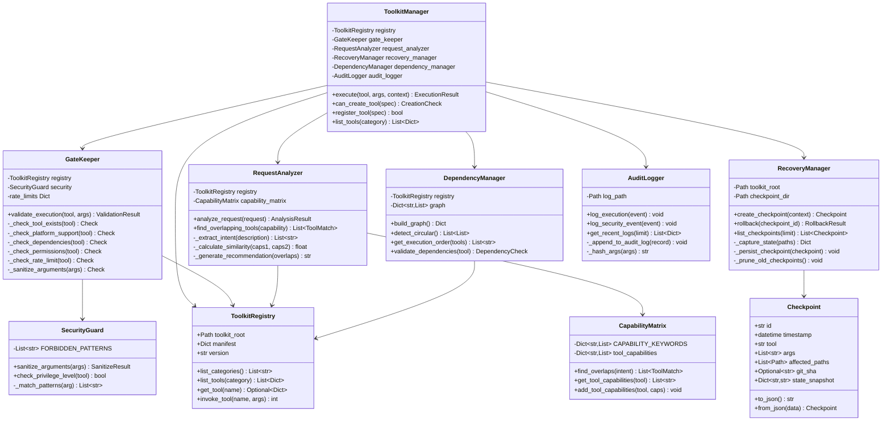
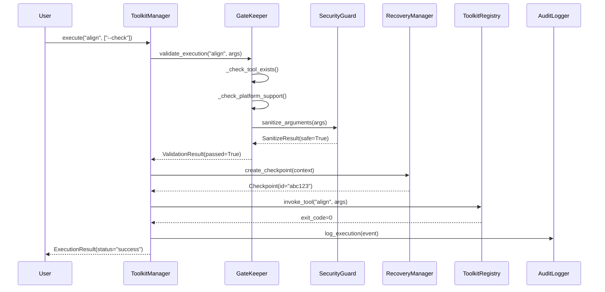

# Class Diagrams - Toolkit Manager

**Document:** Artifacts - UML Class Diagrams  
**Created:** December 31, 2025  
**Author:** Asif Hussain

---

## 📊 Core Architecture (Mermaid)



---

## 📦 Data Classes

```mermaid
classDiagram
    class ExecutionContext {
        +Path project_root
        +str tool
        +List~str~ args
        +List~Path~ affected_paths
        +bool cli_mode
        +datetime timestamp
        +Optional~str~ user
    }

    class ExecutionResult {
        +str status
        +int exit_code
        +str output
        +str error
        +float duration_ms
        +Optional~str~ checkpoint_id
    }

    class ValidationResult {
        +bool passed
        +List~Check~ checks
        +List~str~ errors
        +List~str~ warnings
    }

    class Check {
        +str name
        +bool passed
        +str message
        +str severity
    }

    class AnalysisResult {
        +bool can_create
        +List~ToolMatch~ overlapping_tools
        +str recommendation
        +float highest_overlap
    }

    class ToolMatch {
        +str tool_name
        +List~str~ capabilities
        +float similarity
        +str recommendation
    }

    class ToolRequest {
        +str name
        +str description
        +List~str~ capabilities
        +str category
        +Dict metadata
    }

    class CreationCheck {
        +bool allowed
        +str reason
        +List~ToolMatch~ alternatives
    }

    class RollbackResult {
        +bool success
        +str message
        +List~Path~ restored_paths
        +List~str~ errors
    }

    class DependencyCheck {
        +bool satisfied
        +List~str~ missing
        +List~str~ circular
    }

    class SanitizeResult {
        +bool safe
        +List~SecurityViolation~ violations
    }

    class SecurityViolation {
        +int arg_index
        +str pattern
        +str severity
        +str description
    }
```



---

## 🔄 Sequence Diagram: Tool Execution



---

## 🛡️ Sequence Diagram: Security Rejection

```mermaid
sequenceDiagram
    participant User
    participant Manager as ToolkitManager
    participant Gate as GateKeeper
    participant Security as SecurityGuard

    User->>Manager: execute("cleanup", ["; rm -rf /"])
    
    Manager->>Gate: validate_execution("cleanup", args)
    Gate->>Security: sanitize_arguments(args)
    Security->>Security: _match_patterns("; rm -rf /")
    Security-->>Gate: SanitizeResult(safe=False, violations=[...])
    Gate-->>Manager: ValidationResult(passed=False)
    
    Manager-->>User: ExecutionResult(status="blocked", error="Security violation")
```

---

## 📁 File Structure

```
cortex-toolkit/
├── core/
│   ├── __init__.py              # Public API exports
│   ├── toolkit_manager.py       # Phase 1: Central manager
│   ├── gate_keeper.py           # Phase 1: Validation
│   ├── exceptions.py            # Phase 1: Custom exceptions
│   ├── request_analyzer.py      # Phase 2: Duplication check
│   ├── capability_matrix.py     # Phase 2: Capability mapping
│   ├── recovery_manager.py      # Phase 3: Checkpoint/rollback
│   ├── checkpoint.py            # Phase 3: Checkpoint model
│   ├── dependency_manager.py    # Phase 4: Graph validation
│   ├── security_guard.py        # Phase 6: Input sanitization
│   └── audit_logger.py          # Phase 6: Audit trail
├── schemas/
│   └── manifest-v2.schema.json  # Phase 5: JSON Schema
├── migration/
│   └── migrate_manifest.py      # Phase 5: v1→v2 migration
├── logs/
│   └── audit.jsonl              # Phase 6: Audit log
└── .checkpoints/                # Phase 3: Checkpoint storage
```

---

## 🔗 Related Documents
- [Master Plan](../00-master-plan.md)
- [Current Architecture](../context/current-architecture.md)
