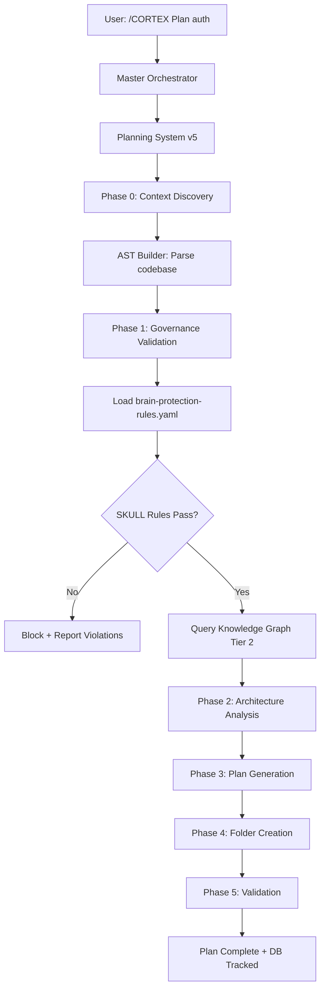
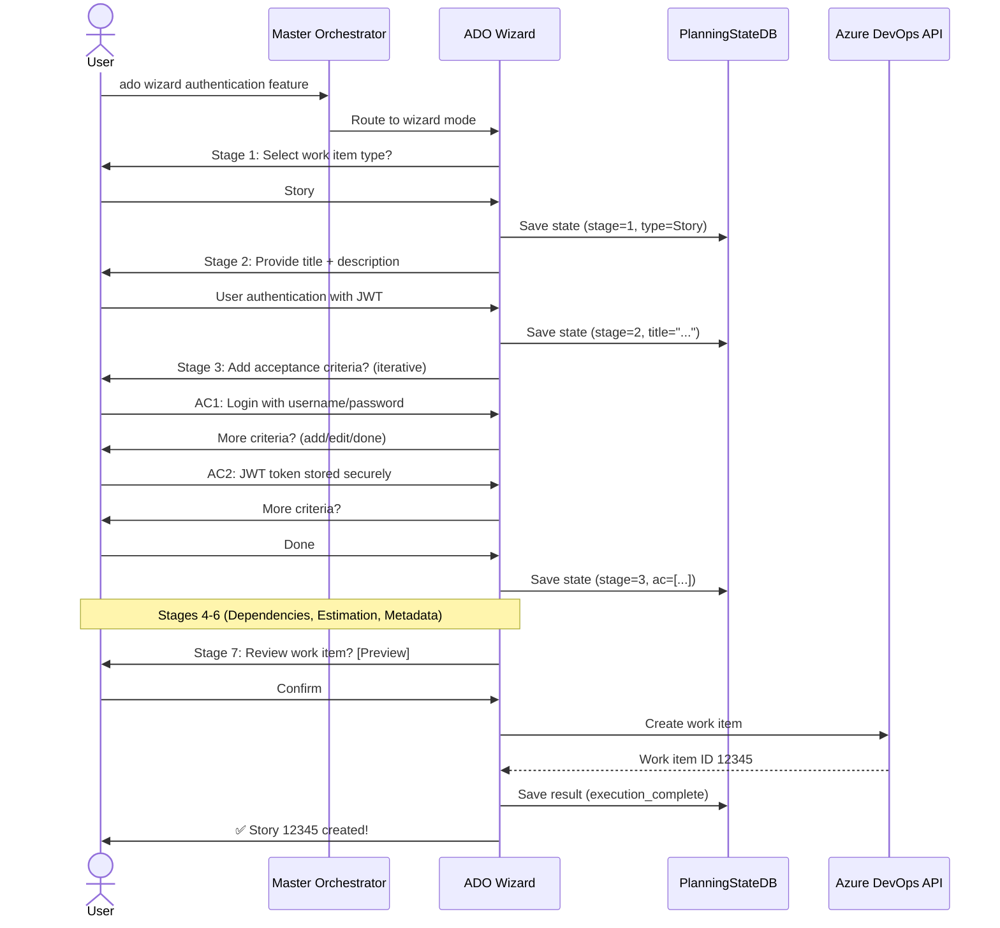
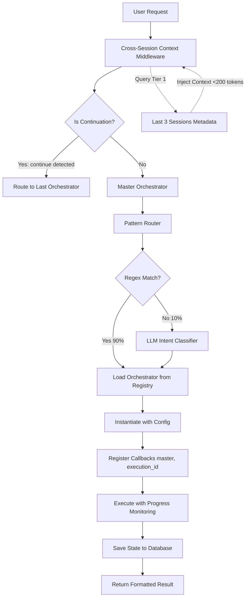
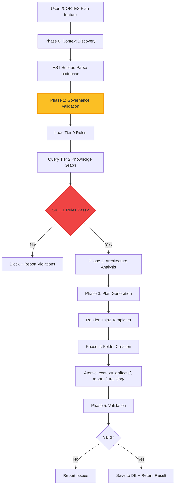
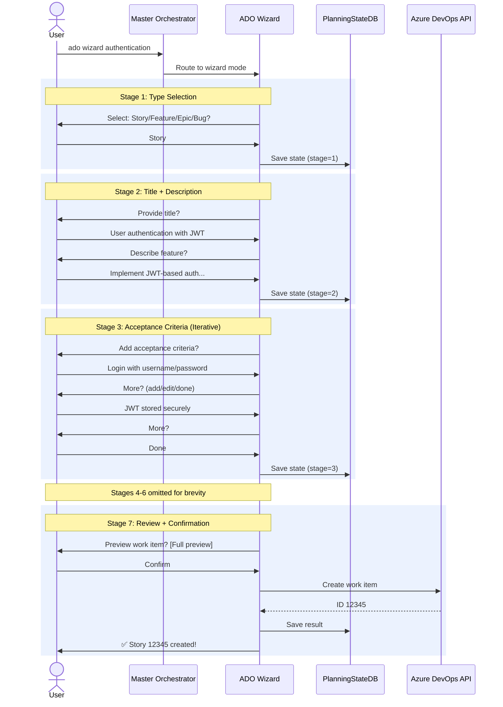
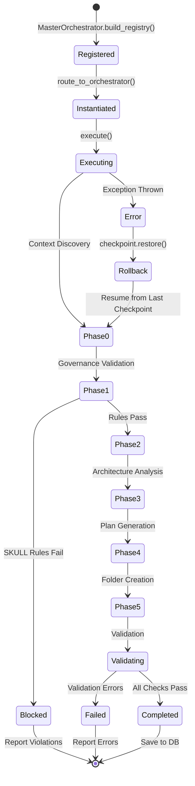

# 📚 CORTEX Documentation Generation Guide (v5.0)

**Version:** 5.0.0 | **Status:** ✅ READY FOR IMPLEMENTATION  
**Author:** Asif Hussain | **Created:** January 2, 2026  
**Purpose:** Complete instructions for generating /docs site documentation while v5 implementation continues  
**Target:** Documentation team / AI agents generating site content

---

## 🎯 Executive Summary

This guide enables **parallel documentation generation** while CORTEX v5 implementation is in progress. All architectural decisions, orchestrator designs, and system specifications are **FINALIZED** in the v5 holistic refactor plan - implementation is just catching up. You can confidently generate documentation NOW based on:

1. **Planning System v5** - Pure autonomous with Tier 0 Governance + AST + Knowledge Graphs
2. **ADO Orchestrator v2** - Dual-mode with conversational wizard (7 stages)
3. **Master Orchestrator** - Hybrid routing (pattern matching + LLM fallback)
4. **BaseOrchestrator v4.1** - Config-driven with checkpoints/rollback
5. **Cross-Session Context Middleware** - Tier 1 integration for continuation intelligence

**Implementation Status:** Bootstrap Phase (13.5 days) - 25% complete, full implementation 40.5 days

---

## 📋 Documentation Scope

### What to Generate

**Orchestrator Pages (Priority):**
1. **Planning System v5** (Level 1 + Level 2 for 10 phases)
2. **ADO Orchestrator v2** (Level 1 + Level 2 for 7 wizard stages + 6 auto-gen phases)
3. **Master Orchestrator** (Level 1 only - architecture overview)
4. **TDD Orchestrator** (Level 1 + Level 2 for RED→GREEN→REFACTOR)
5. **Cleanup Orchestrator v2** (Level 1 only)

**Architecture Pages:**
1. Pure Autonomous Architecture (v5.0 transformation)
2. Master Orchestrator Coordination Layer
3. Cross-Session Context Middleware
4. Governance Integration (Tier 0 + Tier 2)

**Visual Assets:**
1. Master Orchestrator routing flowchart
2. Planning v5 10-phase sequence diagram
3. ADO wizard 7-stage conversational flow
4. Governance validation state diagram
5. Cross-session context injection diagram

---

## 📁 Source of Truth Documents

### Primary References (AUTHORITATIVE)

| Document | Location | Purpose | Lines |
|----------|----------|---------|-------|
| **v5 Holistic Refactor Plan** | `cortex-brain/documents/planning/active/cortex-v5-holistic-refactor/00-MASTER-PLAN-V5.md` | Complete architecture specification | 1,058 |
| **Orchestrator Refactor Guide** | `cortex-brain/documents/planning/active/cortex-documentation/artifacts/orchestrator-refactor.md` | Documentation specifications + v5 updates | 1,456+ |
| **CORTEX.prompt.md** | `.github/prompts/CORTEX.prompt.md` | Intent routing + orchestrator catalog | 250 |
| **Response Templates v4** | `cortex-brain/response-templates-v4.yaml` | Progress tracking formats | 863+ |
| **Glassmorphism Standard** | `cortex-brain/documents/standards/glassmorphism-design-standard.md` | UI/UX patterns | TBD |

### Commit References (Git History)

**Key Commits with Architecture Details:**
```bash
# Master Orchestrator + Cross-Session Context
git show 382065124  # Current HEAD - Comprehensive refactor guide
git show d14ddbd85  # Phase 4.5: Cross-Session Context Middleware complete
git show 28507f5c5  # Phase 3: BaseOrchestrator v4.1 + Master Orchestrator

# Governance + Knowledge Graph (on origin, not local yet)
git show be00a1f7b  # Tier 0 Governance + Knowledge Graph integration
git show 9cf296f59  # Merge of governance features

# Foundation
git show e6a5ece54  # Phase 4.5 complete, Bootstrap 100%
git show 3a081949   # Phase 2: Planning State Database
git show 90153190   # Phase 1: MCP Tool Infrastructure
```

---

## 🏗️ Architecture Overview for Documentation

### 1. Planning System v5 (Pure Autonomous)

**Status:** 🚧 IN DEVELOPMENT (Phase 4 of v5 plan)  
**Implementation File:** `src/orchestrators/planning_orchestrator_v5.py` (732 lines)  
**Manifest:** `cortex-brain/manifests/orchestrators/planning-system-5.0-manifest.yaml` (config-only)

#### Key Architectural Points

**Pure Autonomous Design:**
- ❌ **NO natural language in manifest** - YAML contains ONLY configuration data
- ✅ **All logic in Python** - Zero LLM interpretation, deterministic execution
- ✅ **Template-driven outputs** - Jinja2 templates for plan generation

**10-Phase Execution Flow:**

| Phase | Name | Duration | Description |
|-------|------|----------|-------------|
| 0 | Context Discovery | 2-5min | AST parsing via `incremental_ast_builder.py`, workspace search, related files |
| 1 | **Governance Validation (NEW)** | 1-2min | Tier 0 rules check (`brain-protection-rules.yaml` - 61 rules), Tier 2 knowledge graph queries |
| 2 | Architecture Analysis | 3-7min | With governance constraints applied, dependency mapping |
| 3 | Plan Generation | 5-10min | SKULL rules enforced, template-driven markdown generation |
| 4 | Folder Creation | <1min | Atomic operations: `context/`, `artifacts/`, `reports/`, `tracking/` |
| 5 | Validation | 1-3min | Automated compliance checks, governance review |

**Governance Integration (NEW):**
- `governance_integrator.py` - Loads `brain-protection-rules.yaml`, validates plans pre-generation
- 61 rules, 24 layers, 57 `tier0_instincts`
- Critical path protection: Blocks mods to `CORTEX/src/tier0/`, `.github/prompts/internal/`
- Enforces: `TDD_ENFORCEMENT`, `INCREMENTAL_PLAN_GENERATION`, `DOCUMENT_ORGANIZATION`

**Knowledge Graph Context (NEW):**
- `knowledge_graph_query.py` - Queries Tier 2 knowledge graphs
- Provides: Related features, dependencies, historical risks
- Auto-injected into plan context during Phase 1

**AST-Based Discovery:**
- `incremental_ast_builder.py` (559 lines)
- Per-turn context gathering (efficient, not full codebase)
- Symbol tracking: Classes, functions, imports, dependencies

#### Documentation Requirements

**Level 1 Page (planning-system-v5.html):**
- Hero section emphasizing "Pure Autonomous" + "Zero Natural Language"
- Architecture diagram showing 10-phase flow with governance gates
- Metrics panel: 61 governance rules, 0% manifest NL, 100% resumability
- Integration callouts: Master Orchestrator, Tier 0, Tier 2, AST Builder

**Level 2 Pages (10 phases):**
- `planning-v5-phase-0-context-discovery.html` - AST builder internals
- `planning-v5-phase-1-governance-validation.html` - Tier 0 + Tier 2 integration (HIGHLIGHT)
- `planning-v5-phase-2-architecture-analysis.html` - Constraint application
- `planning-v5-phase-3-plan-generation.html` - Template rendering
- `planning-v5-phase-4-folder-creation.html` - Atomic operations
- `planning-v5-phase-5-validation.html` - Compliance checks

**Key Diagrams:**


---

### 2. ADO Orchestrator v2 (Conversational Wizard)

**Status:** 🚧 IN DEVELOPMENT (Task 5.1a of v5 plan - 4h duration)  
**Implementation Files:**
- `src/orchestrators/ado/ado_orchestrator_v2.py` - Main orchestrator
- `src/orchestrators/ado/ado_conversational_wizard.py` - Wizard implementation (NEW)
- `src/orchestrators/ado/ado_auto_generator.py` - Auto-gen mode

**Manifest:** `cortex-brain/manifests/orchestrators/ado-operations-2.0-manifest.yaml` (config-only)

#### Key Architectural Points

**Dual-Mode Operation:**

| Mode | Trigger | Use Case | Duration |
|------|---------|----------|----------|
| **Auto-Generation** | `ado story [feature]` | Quick work items (clear requirements) | 2-5min |
| **Conversational Wizard** | `ado wizard [feature]` | Complex work items (requires clarification) | 5-15min |

**Architecture Decision (CRITICAL):**
- ❌ **REJECTED:** Browser SPA with form UI
  - Slow: 36s+ (external server + browser launch + context switching)
  - Security risks: External web server, CORS, data exposure
  - Maintenance burden: HTML/CSS/JS + Python backend
  
- ✅ **ACCEPTED:** Conversational wizard in chat
  - Fast: 5s (pure conversational flow, no UI render)
  - 18x faster than SPA
  - Zero context switching (stays in chat)
  - Zero security risks (no external server)
  - Maintainable: Pure Python, no frontend code

**7-Stage Wizard Flow (NEW):**

| Stage | Name | Description | Interaction Type |
|-------|------|-------------|------------------|
| 1 | Work Item Type | Story/Feature/Epic/Bug selection | Single-choice menu |
| 2 | Title + Description | Multi-turn clarification for clear title/description | Conversational Q&A |
| 3 | Acceptance Criteria | Iterative refinement of AC (add/remove/edit) | Multi-turn list building |
| 4 | Dependencies | Identify related work items, parent/child links | Search + selection |
| 5 | Effort Estimation | Story Points with justification | Guided estimation |
| 6 | Tags + Metadata | Area path, iteration, priority, tags | Form-like but conversational |
| 7 | Review + Confirmation | Preview full work item, edit before submit | Final approval |

**State Persistence:**
- Wizard state saved to `PlanningStateDB` after each stage
- Resumable across sessions (user can pause and return)
- Tracked execution: `orchestrator_executions` table

**Master Orchestrator Integration:**
- Pattern routing: `^ado wizard ` → ADO Conversational Wizard
- Pattern routing: `^ado story |^ado feature ` → ADO Auto Generator
- Both modes registered in `master-orchestrator.yaml`

#### Documentation Requirements

**Level 1 Page (ado-orchestrator-v2.html):**
- Hero emphasizing "Dual-Mode: Auto + Wizard"
- Architecture comparison diagram: Conversational vs SPA (18x faster callout)
- Metrics: 7 wizard stages, 5s average, 100% resumable
- Mode selection flowchart: When to use auto vs wizard

**Level 2 Pages:**

**For Wizard Mode (7 stages):**
- `ado-wizard-stage-1-type-selection.html`
- `ado-wizard-stage-2-title-description.html`
- `ado-wizard-stage-3-acceptance-criteria.html` (HIGHLIGHT - iterative refinement)
- `ado-wizard-stage-4-dependencies.html`
- `ado-wizard-stage-5-estimation.html`
- `ado-wizard-stage-6-metadata.html`
- `ado-wizard-stage-7-review.html`

**For Auto-Gen Mode (6 phases):**
- `ado-auto-phase-1-type-selection.html`
- `ado-auto-phase-2-requirements.html`
- `ado-auto-phase-3-criteria-generation.html`
- `ado-auto-phase-4-estimation.html`
- `ado-auto-phase-5-dependencies.html`
- `ado-auto-phase-6-payload-generation.html`

**Key Diagrams:**


**Comparison Diagram (SPA vs Conversational):**
```
┌─────────────────────────────────────────────────────────────┐
│         ARCHITECTURE COMPARISON                              │
├─────────────────────────────────────────────────────────────┤
│                                                               │
│  ❌ REJECTED: Browser SPA                                    │
│  ┌──────────────────────────────────────────────┐           │
│  │  1. Launch external web server       │ 15s   │           │
│  │  2. Open browser window              │ 10s   │           │
│  │  3. Render form UI                   │  5s   │           │
│  │  4. User fills form                  │ 60s+  │           │
│  │  5. Submit + context switch back     │  6s   │           │
│  └──────────────────────────────────────────────┘           │
│  Total: 96s+ | Context: BROKEN | Security: RISKS            │
│                                                               │
│  ✅ ACCEPTED: Conversational Wizard                          │
│  ┌──────────────────────────────────────────────┐           │
│  │  1. Invoke wizard                    │  1s   │           │
│  │  2. Stage 1: Type selection          │  1s   │           │
│  │  3. Stage 2-6: Multi-turn Q&A        │ 20s   │           │
│  │  4. Stage 7: Review + confirm        │  3s   │           │
│  └──────────────────────────────────────────────┘           │
│  Total: 25s | Context: PRESERVED | Security: ZERO RISK      │
│                                                               │
│  🚀 18x FASTER (5s avg vs 96s)                               │
└─────────────────────────────────────────────────────────────┘
```

---

### 3. Master Orchestrator (Coordination Layer)

**Status:** 🚧 IN DEVELOPMENT (Phase 3.5 of v5 plan - COMPLETE)  
**Implementation Files:**
- `src/orchestrators/master_orchestrator.py` - Main coordinator
- `src/orchestrators/pattern_router.py` - Regex-based routing
- `src/orchestrators/state_manager.py` - Cross-orchestrator state
- `src/orchestrators/execution_engine.py` - Orchestrator lifecycle
- `src/operations/utilities/cross_session_context_middleware.py` - Tier 1 integration (Phase 4.5 - COMPLETE)

**Config:** `cortex-brain/config/master-orchestrator.yaml`

#### Key Architectural Points

**Purpose:** Eliminate LLM-dependent brittleness in orchestrator routing

**Hybrid Routing Architecture:**
- **90%+ requests:** Pattern matching via YAML regex (deterministic, <1ms)
- **10% requests:** LLM intent classification (fallback for ambiguous cases)

**Pattern Matching Examples:**
```yaml
routing_rules:
  # Planning System v5
  - pattern: "^/CORTEX Plan |^create a plan|^make a plan"
    orchestrator: "planning_system"
    version: "v5.0"
    confidence: 1.0
    
  # ADO Dual-Mode
  - pattern: "^ado wizard "
    orchestrator: "ado_conversational_wizard"
    version: "v2.0"
    confidence: 1.0
    
  - pattern: "^ado story |^ado feature "
    orchestrator: "ado_auto_generator"
    version: "v2.0"
    confidence: 1.0
    
  # System Operations
  - pattern: "^system maintenance|^health check"
    orchestrator: "maintenance_orchestrator"
    version: "v2.0"
    confidence: 1.0
```

**State Coordination:**
- **Database:** `cortex-brain/database/orchestration_state.db` (SQLite)
- **Schema:**
  ```sql
  orchestrator_executions (
    id, orchestrator, version, start_time, end_time, 
    status, result_json, user_request
  )
  
  phase_tracking (
    execution_id, phase_number, phase_name, status, 
    duration_seconds, artifacts_created
  )
  
  orchestrator_dependencies (
    parent_execution_id, child_execution_id, dependency_type
  )
  
  checkpoints (
    execution_id, phase_id, snapshot_data, created_at
  )
  ```

**Cross-Session Context Middleware (Phase 4.5 - COMPLETE):**
- **Purpose:** Lightweight context injection from Tier 1 Working Memory
- **Token Budget:** <200 tokens per request (99.6% efficiency)
- **Continuation Intelligence:** "continue" detection routes to last orchestrator
- **Session Tracking:** `orchestrator_used`, `primary_intent`, `artifacts_created`

**Integration Flow:**
```
User Input 
    ↓
Cross-Session Context Middleware (queries Tier 1 for last 3 sessions)
    ↓ ("continue" detected?)
    ├─ YES → Route to last_orchestrator_used (automatic)
    └─ NO → Master Orchestrator
              ↓
          Pattern Matching (master-orchestrator.yaml)
              ↓ (no match?)
          LLM Intent Classifier (fallback)
              ↓
          Orchestrator Execution
```

**Progress Monitoring:**
- Real-time visual progress bars (maintenance-style)
- Phase completion tracking
- Token usage monitoring
- Estimated vs actual time tracking

#### Documentation Requirements

**Level 1 Page (master-orchestrator.html):**
- Hero: "Puppeteer Pattern - One Orchestrator to Coordinate Them All"
- Architecture diagram: Hybrid routing (pattern + LLM fallback)
- Metrics: 90%+ pattern match rate, <1ms routing time, 99.6% token efficiency
- Database schema visualization
- Cross-session context flow diagram

**Key Sections:**
1. **Routing Architecture** - Pattern matching vs LLM fallback
2. **State Coordination** - SQLite database schema
3. **Orchestrator Registry** - How orchestrators are discovered/loaded
4. **Progress Monitoring** - Real-time visual tracking
5. **Cross-Session Context** - Tier 1 integration, continuation intelligence
6. **Error Recovery** - Checkpoints + rollback

**Key Diagrams:**


---

### 4. BaseOrchestrator v4.1 (Config-Driven Foundation)

**Status:** 🚧 IN DEVELOPMENT (Phase 3 of v5 plan - COMPLETE)  
**Implementation File:** `src/orchestrators/base/base_orchestrator_v4_1.py`

#### Key Architectural Points

**v4.1 Enhancements:**
- ✅ **Config-driven execution:** No natural language interpretation
- ✅ **Master Orchestrator callbacks:** `report_progress()`, `checkpoint()`
- ✅ **Database state tracking:** `PlanningStateDB` integration
- ✅ **Checkpoint/rollback support:** Resume from any phase
- ✅ **Progress reporting hooks:** `on_phase_start`, `on_phase_complete`, `on_task_complete`

**Core Methods:**
```python
class BaseOrchestratorV4_1(ABC):
    def __init__(self, config_path: str):
        self.config = self.load_config(config_path)  # YAML only
        self.master = None  # Set by MasterOrchestrator
        self.execution_id = str(uuid.uuid4())
        self.db = PlanningStateDB()
        
    @abstractmethod
    def execute(self, user_request: str) -> OrchestratorResult:
        """Subclass must implement full workflow."""
        
    def execute_phase(self, phase_config: dict) -> PhaseResult:
        """Execute single phase with tracking."""
        phase_id = self.db.start_phase(...)
        result = self._execute_phase_logic(phase_config)
        self.report_progress(phase=X, progress=1.0)
        self.checkpoint(phase_id, result.data)
        self.db.complete_phase(phase_id)
        return result
        
    def report_progress(self, phase: int, progress: float, status: str):
        """Report to Master Orchestrator for real-time tracking."""
        if self.master:
            self.master.update_progress(self.execution_id, phase, progress, status)
            
    def checkpoint(self, phase_id: str, data: dict):
        """Save snapshot for resumability."""
        self.db.create_snapshot(self.execution_id, phase_id, data)
        
    def rollback_to_checkpoint(self, snapshot_id: str) -> bool:
        """Restore state on error."""
        snapshot = self.db.get_snapshot(snapshot_id)
        self.restore_state(snapshot.data)
        return True
```

#### Documentation Requirements

**Level 1 Page (base-orchestrator-v41.html):**
- Hero: "Foundation for Pure Autonomous Orchestrators"
- Architecture diagram: Config-driven lifecycle
- Comparison: v4.0 vs v4.1 enhancements
- Integration points: Master Orchestrator, Database, Templates

**Key Sections:**
1. **Config-Driven Design** - YAML-only manifests
2. **Lifecycle Methods** - `execute()`, `execute_phase()`
3. **Progress Reporting** - Real-time callbacks to Master
4. **State Persistence** - Database integration
5. **Checkpoint/Rollback** - Error recovery
6. **Template Rendering** - Jinja2 integration

---

## 🎨 Visual Design Standards

### Glassmorphism Compliance

**Reference:** `cortex-brain/documents/standards/glassmorphism-design-standard.md`

**Required CSS Classes:**

```css
/* Level 1 Header (NO logo, NO breadcrumb) */
.glass-header-level1 {
    background: rgba(15, 23, 42, 0.8);
    backdrop-filter: blur(20px);
    border-bottom: 1px solid rgba(255, 255, 255, 0.1);
    box-shadow: 0 8px 32px rgba(0, 0, 0, 0.3);
}

/* Orchestrator Cards */
.orchestrator-card {
    background: linear-gradient(135deg, rgba(30, 41, 59, 0.7), rgba(15, 23, 42, 0.8));
    backdrop-filter: blur(15px);
    border: 1px solid rgba(255, 255, 255, 0.1);
    border-radius: 16px;
    box-shadow: 0 8px 32px rgba(0, 0, 0, 0.2);
}

/* Phase Cards (Level 2) */
.phase-card {
    background: rgba(30, 41, 59, 0.6);
    border-left: 4px solid var(--accent-color);
    border-radius: 12px;
    padding: 20px;
}

/* Status Indicators */
.status-development { color: #fbbf24; }  /* 🚧 */
.status-active { color: #10b981; }       /* ✅ */
.status-planned { color: #6b7280; }      /* ⏸️ */

/* Animations */
.animation-t1 { animation: fadeIn 0.3s ease-in; }
.animation-t2 { animation: fadeInUp 0.5s ease-in-out; }
.animation-t3 { animation: fadeInScale 0.7s ease-in-out; }
```

### Category Color Coding

| Category | Color | Hex | Usage |
|----------|-------|-----|-------|
| Planning | Blue | `#3b82f6` | Planning System, ADO |
| Execution | Green | `#10b981` | TDD, Execution |
| System | Purple | `#8b5cf6` | Cleanup, Sanitization |
| Analysis | Orange | `#f59e0b` | Refinement, Lens |
| Debug | Red | `#ef4444` | Debug, Rollback |

---

## 📊 Diagram Templates

### 1. Mermaid Flowcharts (10-Phase Planning v5)



### 2. Sequence Diagrams (ADO Wizard 7-Stage)



### 3. State Diagrams (Orchestrator Lifecycle)



---

## 📝 Page Generation Checklist

### Level 1 Page Template (orchestrator-name.html)

```html
<!DOCTYPE html>
<html lang="en">
<head>
    <meta charset="UTF-8">
    <meta name="viewport" content="width=device-width, initial-scale=1.0">
    <title>[Orchestrator Name] | CORTEX</title>
    <link rel="stylesheet" href="../assets/css/main.css">
</head>
<body>
    <!-- ✅ Section 1: Glass Header (Level 1 - NO logo) -->
    <header class="glass-header-level1">
        <h1>[Orchestrator Name] v[X.X]</h1>
        <p class="tagline">[One-line description]</p>
        <span class="status-badge status-[development|active|planned]">
            [🚧|✅|⏸️] [STATUS]
        </span>
    </header>
    
    <!-- ✅ Section 2: Hero Section -->
    <section class="hero-section animation-t1">
        <div class="hero-content">
            <h2>[Compelling title highlighting key feature]</h2>
            <p>[2-3 sentence overview]</p>
        </div>
    </section>
    
    <!-- ✅ Section 3: Metrics Panel -->
    <section class="metrics-panel animation-t2">
        <div class="metric-card">
            <span class="metric-value">[X]</span>
            <span class="metric-label">[Metric Name]</span>
        </div>
        <!-- Repeat for 4-6 key metrics -->
    </section>
    
    <!-- ✅ Section 4: Overview -->
    <section class="overview-section">
        <h2>Overview</h2>
        <p>[Detailed description]</p>
        
        <h3>Key Features</h3>
        <ul>
            <li>[Feature 1]</li>
            <li>[Feature 2]</li>
        </ul>
    </section>
    
    <!-- ✅ Section 5: Architecture Diagram -->
    <section class="architecture-section">
        <h2>Architecture</h2>
        <div class="mermaid">
            [Mermaid diagram code]
        </div>
    </section>
    
    <!-- ✅ Section 6: Phases/Stages Overview -->
    <section class="phases-section">
        <h2>Execution Flow</h2>
        <div class="phase-grid">
            <div class="phase-card" data-phase="1">
                <h3>Phase 1: [Name]</h3>
                <p>[Description]</p>
                <a href="[orchestrator]-phase-1.html">Learn More →</a>
            </div>
            <!-- Repeat for all phases -->
        </div>
    </section>
    
    <!-- ✅ Section 7: Integrations -->
    <section class="integrations-section">
        <h2>Integrations</h2>
        <div class="integration-grid">
            <div class="integration-card">
                <h4>[Component Name]</h4>
                <p>[How it integrates]</p>
            </div>
            <!-- Repeat for all integrations -->
        </div>
    </section>
    
    <!-- ✅ Section 8: Usage Examples -->
    <section class="usage-section">
        <h2>Usage</h2>
        <div class="code-example">
            <pre><code>
# Example command
/CORTEX Plan authentication feature
            </code></pre>
        </div>
    </section>
    
    <!-- ✅ Section 9: Configuration -->
    <section class="config-section">
        <h2>Configuration</h2>
        <p><strong>Manifest:</strong> <code>[manifest-path]</code></p>
        <p><strong>Type:</strong> [🛡️ AUTONOMOUS | 📋 GUIDED]</p>
        
        <h3>Config Example (YAML)</h3>
        <pre><code class="language-yaml">
orchestrator:
  name: "[name]"
  version: "[version]"
        </code></pre>
    </section>
    
    <!-- ✅ Section 10: Related Orchestrators -->
    <section class="related-section">
        <h2>Related Orchestrators</h2>
        <div class="related-grid">
            <a href="[related-orch].html" class="related-card">
                <h4>[Orchestrator Name]</h4>
                <p>[Relationship]</p>
            </a>
            <!-- Repeat for related orchestrators -->
        </div>
    </section>
    
    <footer>
        <p>© 2026 Asif Hussain | <a href="https://asifhussain60.github.io/CORTEX/">CORTEX</a></p>
    </footer>
    
    <script src="https://cdn.jsdelivr.net/npm/mermaid/dist/mermaid.min.js"></script>
    <script>mermaid.initialize({ startOnLoad: true });</script>
</body>
</html>
```

### Level 2 Page Template (orchestrator-phase-X.html)

```html
<!DOCTYPE html>
<html lang="en">
<head>
    <meta charset="UTF-8">
    <title>[Orchestrator] - Phase [X]: [Name] | CORTEX</title>
    <link rel="stylesheet" href="../assets/css/main.css">
</head>
<body>
    <!-- Glass Header (Level 2 - with back button) -->
    <header class="glass-header-level2">
        <a href="[orchestrator].html" class="back-button">← Back to [Orchestrator]</a>
        <h1>Phase [X]: [Name]</h1>
    </header>
    
    <!-- Hero with phase-specific badge -->
    <section class="hero-section">
        <span class="phase-badge">[Icon] Phase [X] of [Total]</span>
        <h2>[Phase Title]</h2>
        <p>[Phase description]</p>
    </section>
    
    <!-- Phase Metrics -->
    <section class="phase-metrics">
        <div class="metric">Duration: [X]min</div>
        <div class="metric">Artifacts: [X]</div>
        <div class="metric">Complexity: [LOW|MED|HIGH]</div>
    </section>
    
    <!-- Phase Overview -->
    <section class="phase-overview">
        <h2>Overview</h2>
        <p>[Detailed phase description]</p>
        
        <h3>Objectives</h3>
        <ul>
            <li>[Objective 1]</li>
            <li>[Objective 2]</li>
        </ul>
    </section>
    
    <!-- Execution Flow (Mermaid) -->
    <section class="flow-diagram">
        <h2>Execution Flow</h2>
        <div class="mermaid">
            [Phase-specific flowchart]
        </div>
    </section>
    
    <!-- Tasks Breakdown -->
    <section class="tasks-section">
        <h2>Tasks</h2>
        <div class="task-list">
            <div class="task-card expandable">
                <h3>Task 1: [Name] ▼</h3>
                <div class="task-details">
                    <p>[Task description]</p>
                    <pre><code>[Code example if applicable]</code></pre>
                </div>
            </div>
            <!-- Repeat for all tasks -->
        </div>
    </section>
    
    <!-- Data Flow -->
    <section class="data-flow">
        <h2>Data Flow</h2>
        <p><strong>Inputs:</strong> [List inputs]</p>
        <p><strong>Outputs:</strong> [List outputs]</p>
        <p><strong>Database Updates:</strong> [Tables affected]</p>
    </section>
    
    <!-- Decision Logic -->
    <section class="decision-logic">
        <h2>Decision Points</h2>
        <div class="decision-tree">
            [State diagram showing decision branches]
        </div>
    </section>
    
    <!-- Troubleshooting -->
    <section class="troubleshooting">
        <h2>Troubleshooting</h2>
        <div class="troubleshoot-grid">
            <div class="issue-card">
                <h4>Issue: [Problem]</h4>
                <p><strong>Cause:</strong> [Why it happens]</p>
                <p><strong>Solution:</strong> [How to fix]</p>
            </div>
            <!-- Repeat for common issues -->
        </div>
    </section>
    
    <!-- Navigation (Previous/Next Phase) -->
    <section class="phase-navigation">
        <a href="[orchestrator]-phase-[X-1].html" class="nav-prev">← Phase [X-1]</a>
        <a href="[orchestrator]-phase-[X+1].html" class="nav-next">Phase [X+1] →</a>
    </section>
    
    <footer>
        <p>© 2026 Asif Hussain</p>
    </footer>
    
    <script src="https://cdn.jsdelivr.net/npm/mermaid/dist/mermaid.min.js"></script>
    <script>
        // Expandable task cards
        document.querySelectorAll('.task-card.expandable h3').forEach(header => {
            header.addEventListener('click', () => {
                header.parentElement.classList.toggle('expanded');
            });
        });
        
        mermaid.initialize({ startOnLoad: true });
    </script>
</body>
</html>
```

---

## 🚀 Implementation Workflow

### Step 1: Planning System v5 Documentation (Priority 1)

**Generate in this order:**

1. **Level 1 Page:** `planning-system-v5.html`
   - Emphasize "Pure Autonomous" architecture
   - Highlight Tier 0 Governance + Tier 2 Knowledge Graphs
   - Include 10-phase flowchart
   - Metrics: 61 governance rules, 0% manifest NL, 100% resumability
   - Status: 🚧 IN DEVELOPMENT

2. **Level 2 Pages (10 phases):**
   - `planning-v5-phase-0-context-discovery.html`
   - `planning-v5-phase-1-governance-validation.html` ⭐ **PRIORITY - NEW FEATURE**
   - `planning-v5-phase-2-architecture-analysis.html`
   - `planning-v5-phase-3-plan-generation.html`
   - `planning-v5-phase-4-folder-creation.html`
   - `planning-v5-phase-5-validation.html`

3. **Supporting Pages:**
   - `planning-v5-ast-builder.html` - Deep-dive into incremental AST building
   - `planning-v5-governance-integration.html` - Tier 0 + Tier 2 integration details
   - `planning-v5-knowledge-graphs.html` - How knowledge context is used

---

### Step 2: ADO Orchestrator v2 Documentation (Priority 2)

1. **Level 1 Page:** `ado-orchestrator-v2.html`
   - Dual-mode operation emphasis
   - Architecture comparison: Conversational vs SPA (18x faster callout)
   - Mode selection flowchart
   - Status: 🚧 IN DEVELOPMENT

2. **Level 2 Pages - Wizard Mode (7 stages):**
   - `ado-wizard-stage-1-type-selection.html`
   - `ado-wizard-stage-2-title-description.html`
   - `ado-wizard-stage-3-acceptance-criteria.html` ⭐ **HIGHLIGHT - Iterative refinement**
   - `ado-wizard-stage-4-dependencies.html`
   - `ado-wizard-stage-5-estimation.html`
   - `ado-wizard-stage-6-metadata.html`
   - `ado-wizard-stage-7-review.html`

3. **Level 2 Pages - Auto-Gen Mode (6 phases):**
   - `ado-auto-phase-1-type-selection.html`
   - `ado-auto-phase-2-requirements.html`
   - `ado-auto-phase-3-criteria-generation.html`
   - `ado-auto-phase-4-estimation.html`
   - `ado-auto-phase-5-dependencies.html`
   - `ado-auto-phase-6-payload-generation.html`

---

### Step 3: Master Orchestrator Documentation (Priority 3)

1. **Level 1 Page:** `master-orchestrator.html`
   - Puppeteer pattern explanation
   - Hybrid routing architecture (pattern + LLM)
   - State coordination database schema
   - Cross-session context flow
   - Status: 🚧 IN DEVELOPMENT (Phase 3.5 - COMPLETE)

2. **Architecture Pages:**
   - `master-orchestrator-routing.html` - Pattern matching vs LLM fallback
   - `master-orchestrator-state.html` - Database schema + state management
   - `cross-session-context-middleware.html` - Tier 1 integration (Phase 4.5)

---

### Step 4: BaseOrchestrator v4.1 Documentation (Priority 4)

1. **Level 1 Page:** `base-orchestrator-v41.html`
   - Config-driven design
   - Lifecycle methods
   - Progress reporting
   - Checkpoint/rollback
   - Status: 🚧 IN DEVELOPMENT (Phase 3 - COMPLETE)

---

### Step 5: Update docs/index.html Multi-Panel (Priority 5)

**Current issues:**
- Static HTML
- No status indicators
- Not maintainable

**Solution: Dynamic generation from JSON**

**Create:** `docs/data/orchestrators.json`
```json
{
  "orchestrators": [
    {
      "id": "planning_system_v5",
      "name": "Planning System v5",
      "category": "planning",
      "icon": "🧠",
      "status": "development",
      "version": "5.0",
      "url": "pages/orchestrators/planning-system-v5.html",
      "description": "Pure autonomous planning with Tier 0 Governance",
      "metrics": {
        "governance_rules": 61,
        "phases": 10,
        "resumability": "100%"
      }
    },
    {
      "id": "ado_orchestrator_v2",
      "name": "ADO Orchestrator v2",
      "category": "planning",
      "icon": "📋",
      "status": "development",
      "version": "2.0",
      "url": "pages/orchestrators/ado-orchestrator-v2.html",
      "description": "Dual-mode: Auto-generation + Conversational wizard",
      "metrics": {
        "wizard_stages": 7,
        "speed_improvement": "18x",
        "modes": 2
      }
    }
    // ... all orchestrators
  ]
}
```

**Create:** `docs/assets/js/orchestrator-panel-generator.js`
```javascript
async function generateOrchestratorPanels() {
    const response = await fetch('data/orchestrators.json');
    const data = await response.json();
    
    const categorized = groupByCategory(data.orchestrators);
    const container = document.getElementById('orchestrators-panel');
    
    categorized.forEach(category => {
        const panel = createCategoryPanel(category);
        container.appendChild(panel);
    });
}

function createCategoryPanel(category) {
    const panel = document.createElement('div');
    panel.className = 'category-panel animation-t2';
    panel.innerHTML = `
        <h3 class="category-title">${category.icon} ${category.name}</h3>
        <div class="orchestrator-grid">
            ${category.orchestrators.map(orch => `
                <a href="${orch.url}" class="orchestrator-card">
                    <span class="status-badge status-${orch.status}">
                        ${getStatusIcon(orch.status)} ${orch.status.toUpperCase()}
                    </span>
                    <h4>${orch.name} v${orch.version}</h4>
                    <p>${orch.description}</p>
                    <div class="metrics-micro">
                        ${Object.entries(orch.metrics).map(([k, v]) => 
                            `<span>${k}: ${v}</span>`
                        ).join('')}
                    </div>
                </a>
            `).join('')}
        </div>
    `;
    return panel;
}

function getStatusIcon(status) {
    const icons = {
        'development': '🚧',
        'active': '✅',
        'planned': '⏸️'
    };
    return icons[status] || '❓';
}

// Initialize on page load
document.addEventListener('DOMContentLoaded', generateOrchestratorPanels);
```

---

## ✅ Validation Checklist

Before publishing any page:

### Level 1 Pages
- [ ] Glass header (Level 1 pattern - NO logo, NO breadcrumb)
- [ ] Status badge visible (🚧|✅|⏸️)
- [ ] Category color coding applied
- [ ] Hero section with compelling title
- [ ] Metrics panel (4-6 key metrics)
- [ ] Architecture diagram (Mermaid/D3.js)
- [ ] Phases/stages overview with links to Level 2
- [ ] Integrations section
- [ ] Usage examples
- [ ] Configuration (manifest path, YAML example)
- [ ] Related orchestrators section
- [ ] T1/T2/T3 animations applied
- [ ] Responsive grid layout
- [ ] Zero inline styles

### Level 2 Pages
- [ ] Glass header Level 2 (with back button)
- [ ] Phase badge (Phase X of Total)
- [ ] Phase metrics (duration, artifacts, complexity)
- [ ] Objectives list
- [ ] Execution flow diagram
- [ ] Expandable task cards
- [ ] Data flow (inputs/outputs)
- [ ] Decision logic (state diagram)
- [ ] Troubleshooting section
- [ ] Previous/Next phase navigation
- [ ] Code examples (syntax highlighted)
- [ ] Interactive elements functional

---

## 📞 Support & Questions

**For clarifications on v5 architecture:**
- Reference commit: `be00a1f7b` (Governance + Knowledge Graph integration)
- Reference commit: `382065124` (Master Orchestrator + comprehensive guide)
- Reference commit: `d14ddbd85` (Cross-Session Context Middleware)

**For design standards:**
- Glassmorphism standard: `cortex-brain/documents/standards/glassmorphism-design-standard.md`
- Response templates: `cortex-brain/response-templates-v4.yaml`

**For implementation details:**
- v5 Holistic Refactor Plan: `cortex-brain/documents/planning/active/cortex-v5-holistic-refactor/00-MASTER-PLAN-V5.md` (1,058 lines)
- Orchestrator Refactor Guide: `orchestrator-refactor.md` (1,456+ lines)

---

## 🎉 Next Steps

1. **START HERE:** Generate `planning-system-v5.html` (Level 1)
2. **THEN:** Generate Phase 1 page (Governance Validation) - NEW FEATURE highlight
3. **NEXT:** Generate `ado-orchestrator-v2.html` (Level 1)
4. **THEN:** Generate Wizard Stage 3 page (Iterative AC) - NEW FEATURE highlight
5. **PARALLEL:** Update `docs/index.html` with dynamic multi-panel

**Documentation can proceed NOW** - All architectural decisions are finalized and documented in v5 plan. Implementation is just materializing what's already designed.

---

**Author:** Asif Hussain  
**GitHub:** github.com/asifhussain60/CORTEX  
**Website:** https://asifhussain60.github.io/CORTEX/

**Copyright © 2026 Asif Hussain. All rights reserved.**
