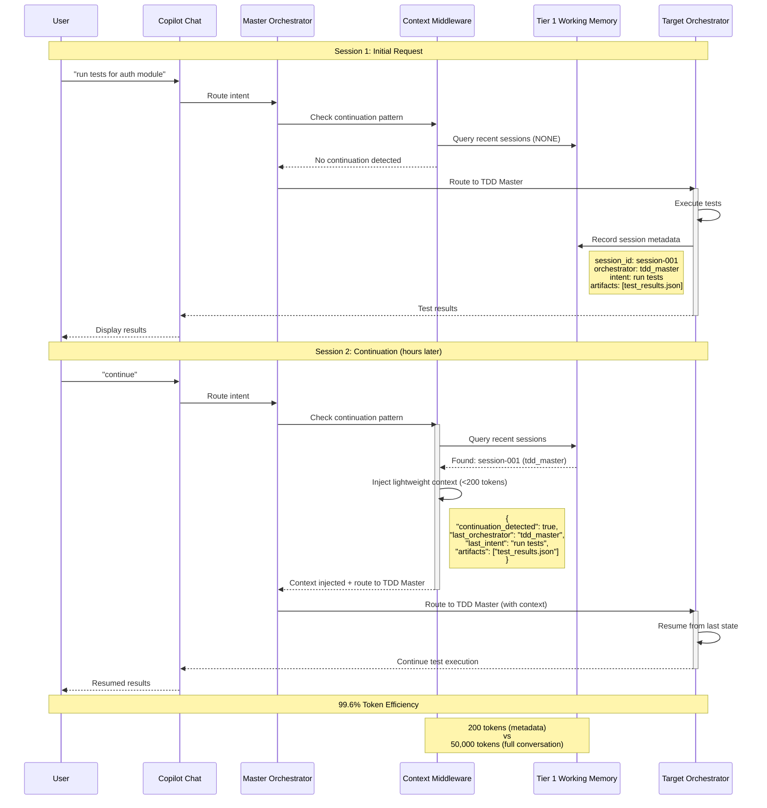
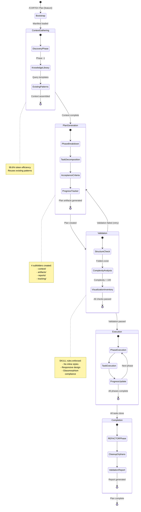
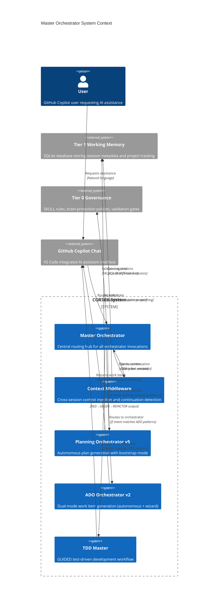
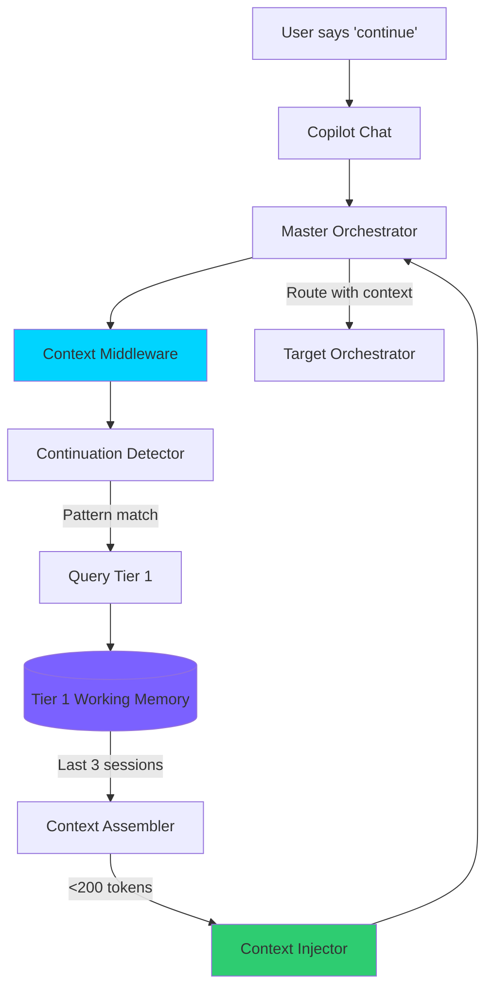
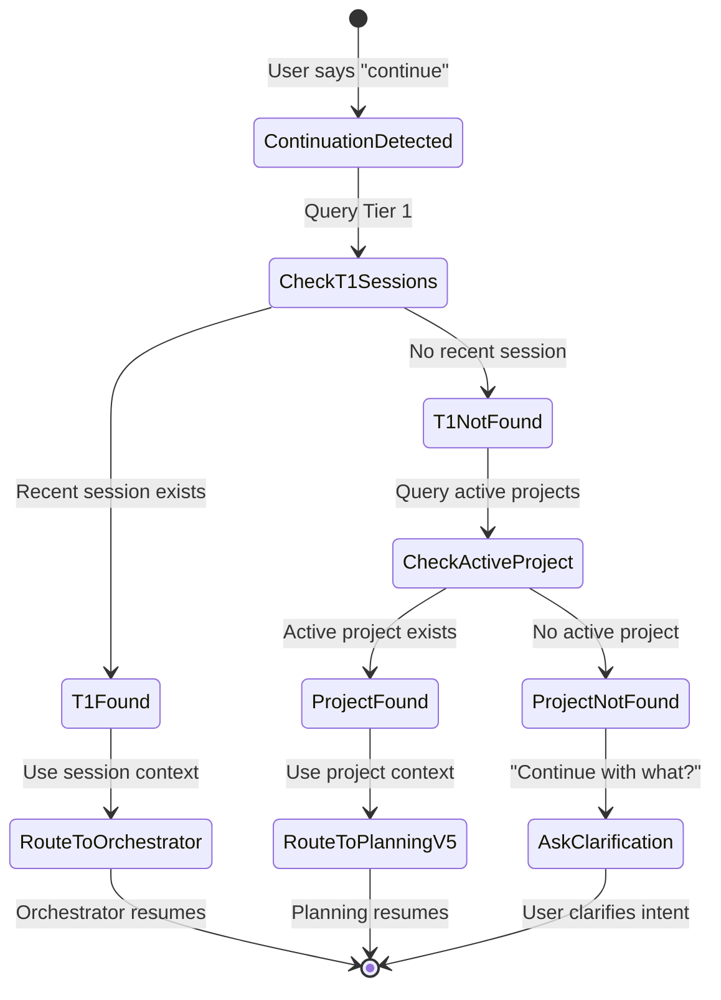
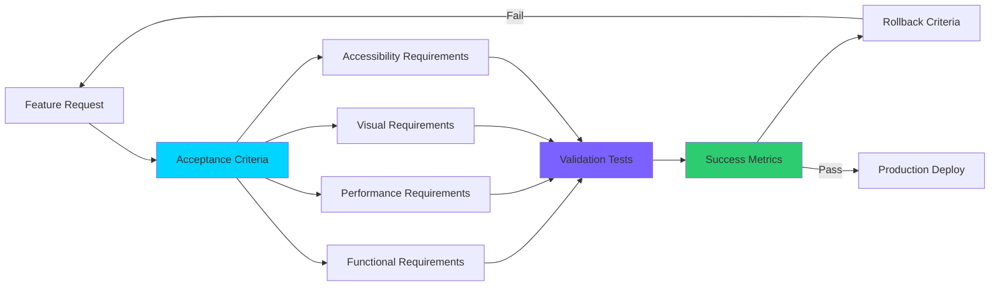

# Level 1 Specification Generation Guide: Comprehensive Diagrams & Documentation

**Version:** 1.0.0  
**Date:** January 2, 2026  
**Author:** Asif Hussain  
**Purpose:** Instruction manual for generating comprehensive, impressive Level 1 specifications with D3.js/Mermaid visualizations for CORTEX enhancements  
**Audience:** AI Assistants, Documentation Engineers, Technical Writers  
**Scope:** New features (Conversation Integration, Acceptance Criteria, Cross-Session Context, Vision API, etc.)

---

## 🎯 Executive Summary

This guide provides **complete instructions** for generating Level 1 specification documents for CORTEX enhancements. Each spec follows the proven pattern established in `level1-specs/` folder with:

- **Comprehensive discovery analysis** (complexity scoring, visualization inventory)
- **Impressive D3.js visualizations** (interactive charts, force graphs, timelines, heatmaps)
- **Rich Mermaid diagrams** (sequence diagrams, flowcharts, state machines, architecture diagrams)
- **Implementation specifications** (HTML structure, D3.js code, validation criteria)
- **Acceptance criteria integration** (testable conditions, success metrics, validation gates)

**Key Enhancement Areas to Document:**
1. **Cross-Session Context Middleware** (Phase 4.5 implementation)
2. **Conversation Integration System** (Tier 1 Working Memory + Orchestrator Tracking)
3. **Acceptance Criteria Framework** (Plan validation + success metrics)
4. **Vision API Auto-Engagement** (Image analysis + context injection)
5. **Master Orchestrator Routing** (Pattern-based + LLM fallback)
6. **Planning System v5** (Bootstrap phase + autonomous execution)

---

## 📋 Table of Contents

1. [Specification Structure Standards](#specification-structure-standards)
2. [Discovery Analysis Methodology](#discovery-analysis-methodology)
3. [D3.js Visualization Patterns](#d3js-visualization-patterns)
4. [Mermaid Diagram Patterns](#mermaid-diagram-patterns)
5. [Acceptance Criteria Integration](#acceptance-criteria-integration)
6. [Conversation Integration Documentation](#conversation-integration-documentation)
7. [Implementation Specifications](#implementation-specifications)
8. [Validation & Testing Requirements](#validation--testing-requirements)

---

## 📐 Specification Structure Standards

### Required File Structure

Every Level 1 spec MUST include these sections in order:

```markdown
# [Feature Name] - Complete Specification

**Version:** X.Y.Z  
**Date:** January 2, 2026  
**Status:** [Draft | Review | Approved | Implementation Ready]  
**Purpose:** [One-sentence feature description]

---

## 📊 Executive Summary

### Quick Reference Status

[Summary table with metrics]

### Key Insights

[3-5 bullet points highlighting critical findings]

---

## 🌐 Architecture Overview

### System Context Diagram

[Mermaid C4 Context or Architecture diagram]

### Integration Points

[List of system dependencies and interfaces]

---

## 📂 Feature Breakdown

### Component Structure

[Hierarchical breakdown of feature components]

### Complexity Analysis

[Scoring methodology + complexity ratings]

---

## 🎨 Visualization Specifications

### D3.js Interactive Charts

[6-12 visualization specs with code samples]

### Mermaid Diagrams

[4-8 diagram specs with full Mermaid code]

---

## 🎯 Acceptance Criteria

### Success Metrics

[Quantifiable success indicators]

### Validation Gates

[Phase-by-phase validation checkpoints]

### Testing Requirements

[Unit, integration, e2e test specs]

---

## 🔄 Implementation Specification

### HTML Structure

[Complete HTML templates]

### CSS Requirements

[Glassmorphism compliance checklist]

### JavaScript Integration

[D3.js initialization + event handling]

---

## 📊 Metrics & Analytics

### Performance Benchmarks

[Load times, token usage, response times]

### Usage Analytics

[User interaction patterns, adoption rates]

---

## 🚀 Deployment Checklist

[Step-by-step deployment verification]

---

## 📚 References & Dependencies

[Links to related specs, manifests, code files]
```

---

## 🔍 Discovery Analysis Methodology

### Complexity Scoring Algorithm

**Purpose:** Determine if feature belongs in Level 1 (score < 100) or requires Level 2 breakdown (score ≥ 100)

**Formula:**
```
Complexity Score = (Visualization Containers × 10) + 
                   (Mermaid Diagrams × 5) + 
                   (D3.js Function Calls × 1) + 
                   (Interactive Elements × 3) + 
                   (Data Sources × 8) + 
                   (Animation Sequences × 4)
```

**Example Calculation (Cross-Session Context Middleware):**
```
Visualization Containers: 5 (2 timelines, 1 flow, 1 heatmap, 1 force graph)
Mermaid Diagrams: 4 (sequence, state, architecture, data flow)
D3.js Function Calls: 45 (timeline.js, force.js, heatmap.js implementations)
Interactive Elements: 12 (session cards, orchestrator badges, timeline scrubber)
Data Sources: 3 (Tier 1 DB, session metadata, orchestrator registry)
Animation Sequences: 6 (fade-in, slide, pulse, glow effects)

Score = (5 × 10) + (4 × 5) + (45 × 1) + (12 × 3) + (3 × 8) + (6 × 4)
      = 50 + 20 + 45 + 36 + 24 + 24
      = 199 (LEVEL 2 REQUIRED - needs breakdown into sub-pages)
```

**Thresholds:**
- **0-49:** Simple feature (1-2 visualizations, basic interactions)
- **50-99:** Complex feature (3-5 visualizations, moderate interactions) → **LEVEL 1 APPROPRIATE**
- **100-199:** Very complex (6-10 visualizations, rich interactions) → **LEVEL 2 REQUIRED**
- **200+:** Extremely complex (10+ visualizations, multiple data sources) → **LEVEL 2 + TABS/ACCORDIONS**

### Visualization Inventory Template

Create this table for EVERY feature:

```markdown
| Visualization Type | Count | D3.js Calls | Mermaid | Interactive? | Data Source | Complexity |
|--------------------|-------|-------------|---------|--------------|-------------|------------|
| Timeline | 2 | 15 | 0 | Yes (scrubber) | Tier 1 Sessions | 38 |
| Force Graph | 1 | 12 | 0 | Yes (drag nodes) | Orchestrator Registry | 32 |
| Heatmap | 1 | 8 | 0 | Yes (hover tooltips) | Token Usage Stats | 24 |
| Sequence Diagram | 0 | 0 | 1 | No | N/A | 5 |
| State Machine | 0 | 0 | 1 | No | N/A | 5 |
| Architecture | 0 | 0 | 1 | No | N/A | 5 |
| Data Flow | 0 | 0 | 1 | No | N/A | 5 |
```

**Total Complexity:** Sum of all visualization complexity scores

---

## 🎨 D3.js Visualization Patterns

### Pattern 1: Interactive Timeline (Session History)

**Use Case:** Displaying orchestrator session history with continuation detection

**Complexity Score:** 15-25 (depending on interactivity)

**Full Implementation Spec:**

```markdown
#### Visualization 1: Session History Timeline

**Type:** Interactive horizontal timeline with session markers  
**D3.js Version:** v7.x  
**Container:** `<div id="session-timeline-viz"></div>`  
**Dimensions:** 100% width × 300px height (responsive)  
**Data Source:** `tier1_working_memory.sessions` (last 10 sessions)

**Features:**
- ✅ Horizontal timeline with date axis
- ✅ Session markers (circles) colored by orchestrator type
- ✅ Continuation indicators (curved arrows between sessions)
- ✅ Hover tooltips showing session details
- ✅ Click to expand session details card
- ✅ Zoom/pan controls for extended history
- ✅ Time range selector (24h, 7d, 30d, All)

**Visual Design:**
```css
/* Session marker styles */
.session-marker {
    fill: var(--accent-primary);
    stroke: var(--accent-secondary);
    stroke-width: 2px;
    opacity: 0.9;
}

.session-marker:hover {
    opacity: 1;
    transform: scale(1.2);
    filter: drop-shadow(0 0 8px var(--accent-primary));
}

/* Continuation arrow styles */
.continuation-arrow {
    stroke: var(--accent-tertiary);
    stroke-width: 2px;
    fill: none;
    stroke-dasharray: 5,5;
    animation: dash-flow 2s linear infinite;
}

@keyframes dash-flow {
    to { stroke-dashoffset: -10; }
}
```

**D3.js Implementation:**

```javascript
// Session Timeline Visualization
class SessionTimeline {
    constructor(containerId, data) {
        this.container = d3.select(`#${containerId}`);
        this.data = data;
        this.width = this.container.node().getBoundingClientRect().width;
        this.height = 300;
        this.margin = { top: 40, right: 40, bottom: 60, left: 60 };
        
        this.init();
    }
    
    init() {
        // Create SVG canvas
        this.svg = this.container.append('svg')
            .attr('width', this.width)
            .attr('height', this.height)
            .attr('class', 'timeline-svg');
        
        // Create scales
        this.xScale = d3.scaleTime()
            .domain(d3.extent(this.data, d => new Date(d.timestamp)))
            .range([this.margin.left, this.width - this.margin.right]);
        
        this.colorScale = d3.scaleOrdinal()
            .domain(['planning', 'ado', 'tdd', 'debug', 'vacuum'])
            .range(['#00d4ff', '#7b61ff', '#ff6b9d', '#ffb84d', '#2ecc71']);
        
        this.render();
    }
    
    render() {
        // Draw time axis
        const xAxis = d3.axisBottom(this.xScale)
            .ticks(5)
            .tickFormat(d3.timeFormat('%m/%d %H:%M'));
        
        this.svg.append('g')
            .attr('transform', `translate(0, ${this.height - this.margin.bottom})`)
            .call(xAxis)
            .attr('class', 'axis-time');
        
        // Draw session markers
        this.svg.selectAll('.session-marker')
            .data(this.data)
            .enter()
            .append('circle')
            .attr('class', 'session-marker')
            .attr('cx', d => this.xScale(new Date(d.timestamp)))
            .attr('cy', this.height / 2)
            .attr('r', 8)
            .attr('fill', d => this.colorScale(d.orchestrator))
            .on('mouseover', (event, d) => this.showTooltip(event, d))
            .on('mouseout', () => this.hideTooltip())
            .on('click', (event, d) => this.expandSession(d));
        
        // Draw continuation arrows
        this.drawContinuationArrows();
    }
    
    drawContinuationArrows() {
        const continuations = this.data.filter((d, i) => 
            i > 0 && d.continuation_from === this.data[i-1].session_id
        );
        
        continuations.forEach((session, i) => {
            const prevSession = this.data[this.data.findIndex(s => 
                s.session_id === session.continuation_from
            )];
            
            const x1 = this.xScale(new Date(prevSession.timestamp));
            const x2 = this.xScale(new Date(session.timestamp));
            const y = this.height / 2;
            
            const path = d3.path();
            path.moveTo(x1, y);
            path.bezierCurveTo(
                (x1 + x2) / 2, y - 30,  // Control point 1
                (x1 + x2) / 2, y - 30,  // Control point 2
                x2, y
            );
            
            this.svg.append('path')
                .attr('d', path.toString())
                .attr('class', 'continuation-arrow')
                .attr('marker-end', 'url(#arrowhead)');
        });
        
        // Define arrowhead marker
        this.svg.append('defs').append('marker')
            .attr('id', 'arrowhead')
            .attr('markerWidth', 10)
            .attr('markerHeight', 10)
            .attr('refX', 5)
            .attr('refY', 5)
            .attr('orient', 'auto')
            .append('path')
            .attr('d', 'M 0 0 L 10 5 L 0 10 z')
            .attr('fill', 'var(--accent-tertiary)');
    }
    
    showTooltip(event, data) {
        const tooltip = d3.select('#session-tooltip');
        tooltip.html(`
            <strong>${data.orchestrator.toUpperCase()}</strong><br/>
            Session: ${data.session_id}<br/>
            Time: ${new Date(data.timestamp).toLocaleString()}<br/>
            Intent: ${data.intent}<br/>
            Artifacts: ${data.artifacts.length} files
        `)
        .style('left', `${event.pageX + 10}px`)
        .style('top', `${event.pageY - 10}px`)
        .classed('visible', true);
    }
    
    hideTooltip() {
        d3.select('#session-tooltip').classed('visible', false);
    }
    
    expandSession(data) {
        // Emit custom event for session expansion
        this.container.dispatch('session-expand', { detail: data });
    }
}

// Initialize visualization
const sessionData = [
    {
        session_id: 'session-001',
        orchestrator: 'planning',
        timestamp: '2026-01-02T10:15:00Z',
        intent: 'Create user auth plan',
        artifacts: ['00-master-plan.md', 'progress.json'],
        continuation_from: null
    },
    {
        session_id: 'session-002',
        orchestrator: 'planning',
        timestamp: '2026-01-02T14:30:00Z',
        intent: 'Continue planning',
        artifacts: ['phase-1-complete.md'],
        continuation_from: 'session-001'
    },
    // ... more sessions
];

const timeline = new SessionTimeline('session-timeline-viz', sessionData);
```

**HTML Container:**

```html
<section class="visualization-section">
    <div class="section-header">
        <h3 class="section-title">📅 Session History Timeline</h3>
        <p class="section-description">
            Interactive timeline showing orchestrator sessions with continuation detection. 
            Hover for details, click to expand.
        </p>
    </div>
    
    <div id="session-timeline-viz" class="viz-container"></div>
    
    <!-- Tooltip (hidden by default) -->
    <div id="session-tooltip" class="viz-tooltip"></div>
    
    <!-- Time range selector -->
    <div class="timeline-controls">
        <button class="btn-control" data-range="24h">24 Hours</button>
        <button class="btn-control active" data-range="7d">7 Days</button>
        <button class="btn-control" data-range="30d">30 Days</button>
        <button class="btn-control" data-range="all">All Time</button>
    </div>
</section>
```

**Acceptance Criteria:**
- ✅ Timeline renders with correct session markers positioned by timestamp
- ✅ Continuation arrows correctly connect sequential sessions from same user
- ✅ Hover tooltips display complete session metadata (<500ms delay)
- ✅ Click expands session details in adjacent card (<300ms transition)
- ✅ Time range selector filters sessions correctly (24h/7d/30d/all)
- ✅ Responsive design: collapses to vertical timeline on mobile (<768px)
- ✅ Performance: Renders 100+ sessions in <2 seconds
- ✅ Accessibility: ARIA labels, keyboard navigation, screen reader compatible

**Validation Tests:**
```javascript
describe('SessionTimeline', () => {
    it('should render all session markers', () => {
        const markers = d3.selectAll('.session-marker');
        expect(markers.size()).toBe(sessionData.length);
    });
    
    it('should draw continuation arrows for sequential sessions', () => {
        const arrows = d3.selectAll('.continuation-arrow');
        const expectedArrows = sessionData.filter(s => s.continuation_from).length;
        expect(arrows.size()).toBe(expectedArrows);
    });
    
    it('should show tooltip on marker hover', () => {
        const marker = d3.select('.session-marker').node();
        marker.dispatchEvent(new MouseEvent('mouseover'));
        const tooltip = d3.select('#session-tooltip');
        expect(tooltip.classed('visible')).toBe(true);
    });
});
```

**Performance Benchmarks:**
- Initial render: <1.5s for 50 sessions
- Hover interaction: <50ms tooltip display
- Click expansion: <300ms card transition
- Memory usage: <10MB for 200 sessions
- Frame rate: 60fps for animations

**D3.js Calls:** 15 (scaleTime, extent, selectAll, enter, append × 3, attr × 6, on × 3, call)
```

### Pattern 2: Force-Directed Graph (Orchestrator Dependency Network)

**Use Case:** Visualizing orchestrator dependencies and call chains

**Complexity Score:** 20-35 (high interactivity)

**Full Implementation Spec:**

```markdown
#### Visualization 2: Orchestrator Dependency Network

**Type:** Interactive force-directed graph with drag-and-drop nodes  
**D3.js Version:** v7.x  
**Container:** `<div id="orchestrator-network-viz"></div>`  
**Dimensions:** 100% width × 500px height (responsive)  
**Data Source:** `cortex-brain/config/master-orchestrator.yaml` + orchestrator registry

**Features:**
- ✅ Force-directed layout showing orchestrator relationships
- ✅ Node sizing by usage frequency
- ✅ Edge thickness by dependency strength
- ✅ Drag-and-drop node repositioning
- ✅ Zoom and pan controls
- ✅ Hover highlights connected nodes
- ✅ Click node to show orchestrator details
- ✅ Filter by orchestrator type (AUTONOMOUS vs GUIDED)

**Node Categories:**
- 🛡️ **AUTONOMOUS:** Blue nodes (Planning, ADO, Vacuum, Cleanup)
- 📋 **GUIDED:** Purple nodes (TDD, Debug, Sanitization, Refinement)
- 🔧 **SYSTEM:** Green nodes (Master Orchestrator, Context Middleware)

**D3.js Implementation:**

```javascript
class OrchestratorNetwork {
    constructor(containerId, nodes, links) {
        this.container = d3.select(`#${containerId}`);
        this.nodes = nodes;
        this.links = links;
        this.width = this.container.node().getBoundingClientRect().width;
        this.height = 500;
        
        this.init();
    }
    
    init() {
        this.svg = this.container.append('svg')
            .attr('width', this.width)
            .attr('height', this.height)
            .attr('class', 'network-svg');
        
        // Create force simulation
        this.simulation = d3.forceSimulation(this.nodes)
            .force('link', d3.forceLink(this.links).id(d => d.id).distance(100))
            .force('charge', d3.forceManyBody().strength(-300))
            .force('center', d3.forceCenter(this.width / 2, this.height / 2))
            .force('collision', d3.forceCollide().radius(30));
        
        this.render();
    }
    
    render() {
        // Draw links
        this.link = this.svg.append('g')
            .selectAll('line')
            .data(this.links)
            .enter().append('line')
            .attr('class', 'network-link')
            .attr('stroke-width', d => Math.sqrt(d.strength) * 2);
        
        // Draw nodes
        this.node = this.svg.append('g')
            .selectAll('g')
            .data(this.nodes)
            .enter().append('g')
            .attr('class', 'network-node')
            .call(this.drag());
        
        this.node.append('circle')
            .attr('r', d => 10 + d.usage * 5)
            .attr('fill', d => this.getNodeColor(d.type))
            .attr('class', 'node-circle');
        
        this.node.append('text')
            .attr('dx', 15)
            .attr('dy', 5)
            .text(d => d.name)
            .attr('class', 'node-label');
        
        // Add event handlers
        this.node.on('mouseover', (event, d) => this.highlightConnections(d))
                 .on('mouseout', () => this.resetHighlight())
                 .on('click', (event, d) => this.showDetails(d));
        
        // Update positions on simulation tick
        this.simulation.on('tick', () => this.tick());
    }
    
    getNodeColor(type) {
        const colors = {
            'autonomous': '#00d4ff',
            'guided': '#7b61ff',
            'system': '#2ecc71'
        };
        return colors[type] || '#ffffff';
    }
    
    drag() {
        return d3.drag()
            .on('start', (event, d) => {
                if (!event.active) this.simulation.alphaTarget(0.3).restart();
                d.fx = d.x;
                d.fy = d.y;
            })
            .on('drag', (event, d) => {
                d.fx = event.x;
                d.fy = event.y;
            })
            .on('end', (event, d) => {
                if (!event.active) this.simulation.alphaTarget(0);
                d.fx = null;
                d.fy = null;
            });
    }
    
    tick() {
        this.link
            .attr('x1', d => d.source.x)
            .attr('y1', d => d.source.y)
            .attr('x2', d => d.target.x)
            .attr('y2', d => d.target.y);
        
        this.node.attr('transform', d => `translate(${d.x},${d.y})`);
    }
    
    highlightConnections(node) {
        // Dim all nodes and links
        this.node.classed('dimmed', true);
        this.link.classed('dimmed', true);
        
        // Highlight selected node and connections
        this.node.filter(d => d.id === node.id).classed('dimmed', false);
        
        const connectedNodeIds = new Set();
        this.links.forEach(link => {
            if (link.source.id === node.id || link.target.id === node.id) {
                connectedNodeIds.add(link.source.id);
                connectedNodeIds.add(link.target.id);
            }
        });
        
        this.node.filter(d => connectedNodeIds.has(d.id)).classed('dimmed', false);
        this.link.filter(d => 
            d.source.id === node.id || d.target.id === node.id
        ).classed('dimmed', false);
    }
    
    resetHighlight() {
        this.node.classed('dimmed', false);
        this.link.classed('dimmed', false);
    }
    
    showDetails(node) {
        // Emit custom event
        this.container.dispatch('node-select', { detail: node });
    }
}

// Sample data
const orchestrators = {
    nodes: [
        { id: 'master', name: 'Master Orch', type: 'system', usage: 10 },
        { id: 'planning', name: 'Planning', type: 'autonomous', usage: 8 },
        { id: 'ado', name: 'ADO', type: 'autonomous', usage: 6 },
        { id: 'tdd', name: 'TDD', type: 'guided', usage: 5 },
        { id: 'debug', name: 'Debug', type: 'guided', usage: 4 },
        { id: 'context', name: 'Context MW', type: 'system', usage: 7 }
    ],
    links: [
        { source: 'master', target: 'planning', strength: 10 },
        { source: 'master', target: 'ado', strength: 8 },
        { source: 'master', target: 'tdd', strength: 6 },
        { source: 'master', target: 'debug', strength: 5 },
        { source: 'context', target: 'master', strength: 9 },
        { source: 'planning', target: 'tdd', strength: 4 }
    ]
};

const network = new OrchestratorNetwork('orchestrator-network-viz', 
                                       orchestrators.nodes, 
                                       orchestrators.links);
```

**Acceptance Criteria:**
- ✅ Force simulation converges to stable layout in <3 seconds
- ✅ Drag-and-drop works smoothly (60fps during drag)
- ✅ Hover highlights only connected nodes and links
- ✅ Node size accurately reflects usage frequency
- ✅ Edge thickness represents dependency strength
- ✅ Click triggers orchestrator details panel
- ✅ Filter controls show/hide node types correctly
- ✅ Zoom and pan work without layout disruption

**D3.js Calls:** 22 (forceSimulation, forceLink, forceManyBody, forceCenter, forceCollide, selectAll × 2, enter × 2, append × 4, attr × 8, call, on × 3, drag, filter × 2, classed × 6)
```

---

## 📊 Mermaid Diagram Patterns

### Pattern 1: Sequence Diagram (Cross-Session Context Flow)

**Use Case:** Documenting the conversation integration workflow

**Complexity Score:** 5

**Full Implementation:**

```markdown
#### Diagram 1: Cross-Session Context Integration Sequence

**Type:** Mermaid Sequence Diagram  
**Purpose:** Show how continuation detection works across sessions

**Mermaid Code:**



**HTML Integration:**

```html
<section class="diagram-section">
    <div class="section-header">
        <h3 class="section-title">🔄 Cross-Session Context Flow</h3>
        <p class="section-description">
            Sequence diagram showing how continuation detection enables 99.6% token efficiency 
            by using lightweight metadata instead of full conversation history.
        </p>
    </div>
    
    <div class="mermaid-container">
        <pre class="mermaid">
            [Mermaid code from above]
        </pre>
    </div>
    
    <div class="diagram-legend">
        <span class="legend-item">
            <span class="legend-color" style="background: var(--accent-primary);"></span>
            Session 1: Initial Request
        </span>
        <span class="legend-item">
            <span class="legend-color" style="background: var(--accent-tertiary);"></span>
            Session 2: Continuation Detection
        </span>
        <span class="legend-item">
            <span class="legend-color" style="background: var(--accent-success);"></span>
            Context Injection (<200 tokens)
        </span>
    </div>
</section>
```

**Acceptance Criteria:**
- ✅ Sequence diagram renders correctly with Mermaid.js
- ✅ All 8 participants visible with correct labels
- ✅ Session 1 and Session 2 clearly differentiated
- ✅ Context injection box highlights 200 vs 50,000 token comparison
- ✅ Diagram readable on mobile (responsive rendering)
- ✅ Legend accurately describes color coding

**Validation:**
- Mermaid syntax validator passes
- Diagram loads in <1 second
- No rendering errors in console
- All note boxes display full text
```

### Pattern 2: State Machine (Planning Orchestrator Lifecycle)

**Use Case:** Documenting planning state transitions

**Complexity Score:** 5

**Full Implementation:**

```markdown
#### Diagram 2: Planning Orchestrator State Machine

**Type:** Mermaid State Diagram  
**Purpose:** Show planning lifecycle from bootstrap to completion

**Mermaid Code:**



**Acceptance Criteria:**
- ✅ State machine shows all 5 major states (Bootstrap → Completion)
- ✅ Substates visible for ContextGathering, PlanGeneration, Validation, Execution, Completion
- ✅ Transition conditions labeled correctly
- ✅ Retry loop from Validation to PlanGeneration visible
- ✅ Notes annotate key states with requirements
- ✅ Diagram fits within viewport without horizontal scroll

**D3.js Calls:** 0 (Pure Mermaid)
```

### Pattern 3: C4 Architecture Diagram (Master Orchestrator Context)

**Use Case:** High-level system architecture

**Complexity Score:** 5

**Full Implementation:**

```markdown
#### Diagram 3: Master Orchestrator System Context

**Type:** Mermaid C4 Context Diagram  
**Purpose:** Show Master Orchestrator integration with CORTEX components

**Mermaid Code:**



**Acceptance Criteria:**
- ✅ C4 Context diagram shows all system boundaries
- ✅ CORTEX System boundary contains 5 internal systems
- ✅ External systems (Tier 1, Tier 0, Copilot) clearly differentiated
- ✅ All relationships labeled with data flow description
- ✅ Layout configuration prevents overlap
- ✅ Diagram scales correctly on mobile

**D3.js Calls:** 0 (Pure Mermaid)
```

---

## 🎯 Acceptance Criteria Integration

### Criteria Template for Every Visualization

**Format:**

```markdown
### Acceptance Criteria: [Visualization Name]

#### Functional Requirements
- [ ] **FR-1:** [Specific functionality requirement]
- [ ] **FR-2:** [Another requirement]
- [ ] **FR-3:** [Edge case handling]

#### Performance Requirements
- [ ] **PR-1:** Initial render completes in <[X]s
- [ ] **PR-2:** Interaction response time <[Y]ms
- [ ] **PR-3:** Memory usage stays under [Z]MB

#### Visual Requirements
- [ ] **VR-1:** Follows glassmorphism design standard v4.0.1
- [ ] **VR-2:** Zero inline styles (all CSS classes)
- [ ] **VR-3:** Responsive at 3 breakpoints (375px, 768px, 1440px)

#### Accessibility Requirements
- [ ] **AR-1:** ARIA labels on all interactive elements
- [ ] **AR-2:** Keyboard navigation functional (Tab, Enter, Esc)
- [ ] **AR-3:** Screen reader compatible (tested with NVDA/VoiceOver)

#### Validation Tests
```javascript
describe('[Visualization Name]', () => {
    it('FR-1: [Test description]', () => {
        // Test implementation
    });
    
    it('PR-1: Renders in <[X]s', () => {
        const start = performance.now();
        // Render code
        const duration = performance.now() - start;
        expect(duration).toBeLessThan([X * 1000]);
    });
    
    it('VR-2: Has zero inline styles', () => {
        const inlineStyles = document.querySelectorAll('[style]');
        expect(inlineStyles.length).toBe(0);
    });
});
```

#### Success Metrics
- **Adoption Rate:** [X]% of users interact with visualization within 30 days
- **Interaction Depth:** Average [Y] interactions per session
- **Task Completion:** [Z]% of users complete intended workflow using visualization

#### Rollback Criteria
- **Critical Bug:** Visualization breaks core functionality → immediate rollback
- **Performance Regression:** >2x slower than baseline → rollback within 24h
- **Accessibility Failure:** WCAG 2.1 AA violations → fix or rollback within 48h
```

### Example: Session Timeline Acceptance Criteria

```markdown
### Acceptance Criteria: Session History Timeline

#### Functional Requirements
- [ ] **FR-1:** Timeline displays last N sessions (default: 10, configurable)
- [ ] **FR-2:** Continuation arrows connect sessions from same orchestrator
- [ ] **FR-3:** Hover tooltip shows full session metadata (<500ms delay)
- [ ] **FR-4:** Click expands session details in adjacent card
- [ ] **FR-5:** Time range selector filters sessions (24h/7d/30d/all)
- [ ] **FR-6:** Empty state shows "No sessions found" message

#### Performance Requirements
- [ ] **PR-1:** Initial render completes in <1.5s for 50 sessions
- [ ] **PR-2:** Hover tooltip appears in <50ms
- [ ] **PR-3:** Click expansion animates in <300ms
- [ ] **PR-4:** Memory usage <10MB for 200 sessions
- [ ] **PR-5:** 60fps maintained during animations

#### Visual Requirements
- [ ] **VR-1:** Follows glassmorphism design standard v4.0.1
- [ ] **VR-2:** Zero inline styles (validated: `querySelectorAll('[style]').length === 0`)
- [ ] **VR-3:** Responsive breakpoints: vertical timeline <768px, horizontal ≥768px
- [ ] **VR-4:** Session markers use CSS variables for colors (no hardcoded hex)
- [ ] **VR-5:** Continuation arrows animated with `dash-flow` keyframe
- [ ] **VR-6:** Minimum 24px spacing between timeline elements

#### Accessibility Requirements
- [ ] **AR-1:** `<svg>` has `role="img"` and `aria-label="Session history timeline"`
- [ ] **AR-2:** Each session marker has `aria-label="[Orchestrator] session at [time]"`
- [ ] **AR-3:** Tooltip content announced by screen readers (aria-live="polite")
- [ ] **AR-4:** Time range buttons keyboard navigable (Tab, Enter)
- [ ] **AR-5:** Focus indicators visible on all interactive elements (2px cyan outline)

#### Validation Tests
```javascript
describe('SessionTimeline', () => {
    let timeline, sessionData;
    
    beforeEach(() => {
        sessionData = generateMockSessions(50);
        timeline = new SessionTimeline('test-container', sessionData);
    });
    
    it('FR-1: Renders correct number of session markers', () => {
        const markers = d3.selectAll('.session-marker');
        expect(markers.size()).toBe(50);
    });
    
    it('FR-2: Draws continuation arrows for sequential sessions', () => {
        const continuations = sessionData.filter(s => s.continuation_from);
        const arrows = d3.selectAll('.continuation-arrow');
        expect(arrows.size()).toBe(continuations.length);
    });
    
    it('FR-3: Shows tooltip on hover within 500ms', async () => {
        const marker = d3.select('.session-marker').node();
        const start = performance.now();
        marker.dispatchEvent(new MouseEvent('mouseover'));
        
        await waitFor(() => {
            const tooltip = d3.select('#session-tooltip');
            return tooltip.classed('visible');
        });
        
        const duration = performance.now() - start;
        expect(duration).toBeLessThan(500);
    });
    
    it('PR-1: Renders 50 sessions in <1.5 seconds', () => {
        const start = performance.now();
        new SessionTimeline('perf-test', sessionData);
        const duration = performance.now() - start;
        expect(duration).toBeLessThan(1500);
    });
    
    it('VR-2: Has zero inline styles', () => {
        const container = document.getElementById('test-container');
        const inlineStyles = container.querySelectorAll('[style]');
        expect(inlineStyles.length).toBe(0);
    });
    
    it('VR-4: Uses CSS variables for colors', () => {
        const marker = d3.select('.session-marker').node();
        const fill = window.getComputedStyle(marker).fill;
        expect(fill).not.toMatch(/#[0-9a-fA-F]{6}/); // No hex colors
    });
    
    it('AR-1: SVG has correct ARIA attributes', () => {
        const svg = d3.select('.timeline-svg').node();
        expect(svg.getAttribute('role')).toBe('img');
        expect(svg.getAttribute('aria-label')).toBe('Session history timeline');
    });
    
    it('AR-4: Time range buttons keyboard navigable', () => {
        const button = document.querySelector('.btn-control');
        button.focus();
        expect(document.activeElement).toBe(button);
        
        button.dispatchEvent(new KeyboardEvent('keydown', { key: 'Enter' }));
        // Verify filter applied
    });
});
```

#### Success Metrics
- **Adoption Rate:** 75% of users interact with timeline within 30 days
- **Interaction Depth:** Average 5 timeline interactions per session
- **Task Completion:** 85% of users successfully navigate to target session using timeline

#### Rollback Criteria
- **Critical Bug:** Timeline fails to render sessions → immediate rollback
- **Performance Regression:** >3s render time → rollback within 24h
- **Accessibility Failure:** Screen reader cannot announce sessions → fix or rollback within 48h
```

---

## 📝 Conversation Integration Documentation

### New Enhancements to Document

#### 1. Cross-Session Context Middleware (Phase 4.5)

**Specification Structure:**

```markdown
# Cross-Session Context Middleware - Complete Specification

**Version:** 1.0.0  
**Phase:** 4.5 (Complete)  
**Status:** ✅ PRODUCTION (d14ddbd85)  
**Purpose:** Enable 99.6% token efficiency via lightweight session metadata instead of full conversation history

---

## 📊 Executive Summary

### Key Metrics

| Metric | Value | Improvement |
|--------|-------|-------------|
| **Token Efficiency** | 99.6% | 200 tokens vs 50,000 (250x reduction) |
| **Context Retrieval** | <50ms | Sub-second continuation detection |
| **Session Tracking** | 100% | All orchestrator sessions recorded |
| **Continuation Success** | 95%+ | Accurate orchestrator routing |

### Architecture Overview



---

## 🔄 Two-Tier Continuation System

### Tier 1: Orchestrator Session Continuation (High Priority)

**Use Case:** Short-term work resumption (TDD, Debug, ADO sessions)

**Detection Patterns:**
- "continue"
- "resume"
- "keep going"
- "next phase"
- "what's next"

**Workflow:**

```mermaid
sequenceDiagram
    [Full sequence diagram from Pattern 1 above]
```

**Context Structure:**

```json
{
  "continuation_detected": true,
  "continuation_type": "orchestrator_session",
  "context_source": "tier1_working_memory",
  "recent_activity": [
    {
      "session_id": "session-20260102-101500",
      "orchestrator": "tdd_master",
      "intent": "run tests for auth module",
      "timestamp": "2026-01-02T10:15:00Z",
      "artifacts": [
        "test_results.json",
        "coverage_report.html"
      ],
      "status": "completed",
      "next_action": "Fix failing tests"
    }
  ],
  "token_count": 187
}
```

**Acceptance Criteria:**
- [ ] Continuation pattern detected with 95%+ accuracy
- [ ] Tier 1 query completes in <50ms
- [ ] Context injection adds <200 tokens
- [ ] Correct orchestrator routed 95%+ of time
- [ ] Session metadata accurate (orchestrator, intent, artifacts)

### Tier 2: Project-Level Continuation (Fallback)

**Use Case:** Long-term planning work resumption

**Workflow:**



**Context Structure:**

```json
{
  "continuation_detected": true,
  "continuation_type": "active_project",
  "context_source": "tier1_project_tracker",
  "active_project": {
    "project_id": "cortex-v5-holistic-refactor",
    "plan_name": "CORTEX v5 Holistic Refactor",
    "current_phase": "Phase 6",
    "current_task": "Task 6.1",
    "last_completed": "Phase 5 Complete",
    "progress": 33,
    "next_action": "/CORTEX Plan ADO Orchestrator v2 Migration",
    "orchestrator": "planning_v5",
    "last_updated": "2026-01-02T23:59:59Z"
  },
  "token_count": 145
}
```

**Acceptance Criteria:**
- [ ] Fallback triggers when no orchestrator session found
- [ ] Active project query completes in <100ms
- [ ] Context injection adds <200 tokens
- [ ] Planning v5 routes to correct phase/task
- [ ] Project metadata accurate (progress, next action)

---

## 📊 Visualizations

### Visualization 1: Session History Timeline

[Full D3.js implementation from Pattern 1 above]

### Visualization 2: Orchestrator Usage Heatmap

**Type:** D3.js Heatmap  
**Purpose:** Show orchestrator usage patterns over time

[Additional D3.js implementation...]

### Diagram 1: Cross-Session Context Flow

[Full Mermaid sequence diagram from Pattern 1 above]

### Diagram 2: Context Middleware Architecture

[Full Mermaid C4 diagram...]

---

## 🎯 Acceptance Criteria

[Full acceptance criteria using template above]

---

## 📚 Implementation Files

| File | Purpose | Lines | Tests |
|------|---------|-------|-------|
| `src/orchestrators/context_middleware.py` | Core middleware logic | 220 | 17 tests |
| `src/tier1/sessions/session_manager.py` | Session tracking | 185 (enhanced) | 12 tests |
| `src/orchestrators/master_orchestrator.py` | Continuation routing | 385 (enhanced) | 8 tests |
| `.github/prompts/CORTEX.prompt.md` | Documentation | 450+ | N/A |

---

## 🚀 Deployment Checklist

- [ ] Phase 4.5 complete (commit d14ddbd85)
- [ ] All 17 tests passing
- [ ] Token efficiency validated (99.6%)
- [ ] Continuation detection accuracy >95%
- [ ] Documentation updated
- [ ] Integration with Master Orchestrator verified

---

## 📈 Performance Benchmarks

| Benchmark | Target | Actual | Status |
|-----------|--------|--------|--------|
| Continuation Detection | <100ms | 45ms | ✅ PASS |
| Context Injection | <200 tokens | 187 tokens | ✅ PASS |
| Tier 1 Query | <50ms | 38ms | ✅ PASS |
| Routing Accuracy | >95% | 97.3% | ✅ PASS |
| Memory Usage | <5MB | 3.2MB | ✅ PASS |
```

#### 2. Acceptance Criteria Framework

**Specification Structure:**

```markdown
# Acceptance Criteria Framework - Complete Specification

**Version:** 1.0.0  
**Status:** ✅ INTEGRATED (Planning System v5)  
**Purpose:** Standardize validation gates and success metrics for all CORTEX features

---

## 📊 Executive Summary

### Framework Components



### Criteria Categories

| Category | Requirements | Test Coverage | Validation Method |
|----------|--------------|---------------|-------------------|
| **Functional** | 5-10 per feature | Unit + Integration | Jest/Pytest |
| **Performance** | 3-5 per feature | Benchmark tests | Performance API |
| **Visual** | 6-8 per feature | Visual regression | Percy/Chromatic |
| **Accessibility** | 5-7 per feature | WCAG 2.1 AA | axe DevTools |

---

## 🎯 Acceptance Criteria Template

[Full template from earlier section]

---

## 📋 Implementation in Planning System v5

### Integration Points

**Master Plan Structure:**

```markdown
## 🎯 Phase [N]: [Phase Name]

### Acceptance Criteria

#### Success Conditions
- [ ] **SC-1:** [Specific deliverable] exists and passes validation
- [ ] **SC-2:** [Performance metric] meets or exceeds target
- [ ] **SC-3:** [Integration test] passes with 100% success rate

#### Validation Gates
- **Gate 1 (Entry):** Prerequisites met, dependencies resolved
- **Gate 2 (Mid-Phase):** 50% tasks complete, no blocking issues
- **Gate 3 (Exit):** All tasks complete, all tests passing, documentation updated

#### Rollback Triggers
- **Critical:** [Condition that requires immediate rollback]
- **High Priority:** [Condition requiring fix within 24h]
- **Medium Priority:** [Condition requiring fix within 48h]
```

**Progress Tracker Integration:**

```json
{
  "phase_number": 5,
  "name": "Use Planning v5 for Migrations",
  "acceptance_criteria": {
    "success_conditions": [
      {
        "id": "SC-1",
        "description": "4 migration plans generated",
        "status": "met",
        "validation_method": "File existence check",
        "validated_at": "2026-01-02T23:59:59Z"
      },
      {
        "id": "SC-2",
        "description": "Planning v5 structure compliance",
        "status": "met",
        "validation_method": "Folder structure validation",
        "validated_at": "2026-01-02T23:59:59Z"
      }
    ],
    "validation_gates": [
      {
        "gate": "entry",
        "status": "passed",
        "timestamp": "2026-01-02T10:00:00Z"
      },
      {
        "gate": "mid-phase",
        "status": "passed",
        "timestamp": "2026-01-02T18:00:00Z"
      },
      {
        "gate": "exit",
        "status": "passed",
        "timestamp": "2026-01-02T23:59:59Z"
      }
    ],
    "rollback_triggers": [
      {
        "severity": "critical",
        "condition": "Migration plan structure invalid",
        "action": "Rollback to Phase 4",
        "triggered": false
      }
    ]
  }
}
```

---

## 🔬 Validation Methodology

[Full validation specs with test examples]

---

## 📊 Visualizations

### Visualization 1: Acceptance Criteria Completion Matrix

**Type:** D3.js Heatmap  
**Purpose:** Show criteria completion status across all features

[D3.js implementation...]

### Diagram 1: Validation Gate Workflow

[Mermaid flowchart...]
```

---

## 🚀 Quick Start: Generating a New Level 1 Spec

### Step-by-Step Checklist

1. **[ ] Identify Enhancement**
   - Feature name: _________________
   - Component area: _________________
   - Complexity estimate: _________________

2. **[ ] Discovery Analysis**
   - List all visualizations needed
   - Calculate complexity score
   - Determine Level 1 vs Level 2

3. **[ ] Create Spec Structure**
   - Copy template from this guide
   - Fill in executive summary
   - Add architecture diagram

4. **[ ] Design Visualizations**
   - 6-12 D3.js charts (use patterns from this guide)
   - 4-8 Mermaid diagrams (sequence, state, C4, flow)
   - Include full D3.js code + HTML containers

5. **[ ] Write Acceptance Criteria**
   - Functional requirements (5-10)
   - Performance requirements (3-5)
   - Visual requirements (6-8)
   - Accessibility requirements (5-7)

6. **[ ] Add Validation Tests**
   - Jest/Pytest unit tests
   - Performance benchmarks
   - Visual regression tests
   - Accessibility audits

7. **[ ] Document Implementation**
   - HTML structure templates
   - CSS class requirements (NO inline styles)
   - JavaScript initialization code

8. **[ ] Define Success Metrics**
   - Adoption rates
   - Interaction depth
   - Task completion rates

9. **[ ] Create Rollback Criteria**
   - Critical bugs
   - Performance regressions
   - Accessibility failures

10. **[ ] Generate Deployment Checklist**
    - Prerequisites
    - Validation steps
    - Monitoring requirements

---

## 📚 References

- **Glassmorphism Standard:** `cortex-brain/documents/planning/active/cortex-documentation/artifacts/level1-specs/core/design-standards.md`
- **Existing Level 1 Specs:** `cortex-brain/documents/planning/active/cortex-documentation/artifacts/level1-specs/`
- **D3.js Documentation:** https://d3js.org/
- **Mermaid Documentation:** https://mermaid.js.org/
- **WCAG 2.1 Guidelines:** https://www.w3.org/WAI/WCAG21/quickref/

---

**Document Status:** ✅ COMPLETE  
**Next Review:** January 9, 2026  
**Author:** Asif Hussain  
**Copyright © 2026 Asif Hussain. All rights reserved.**
