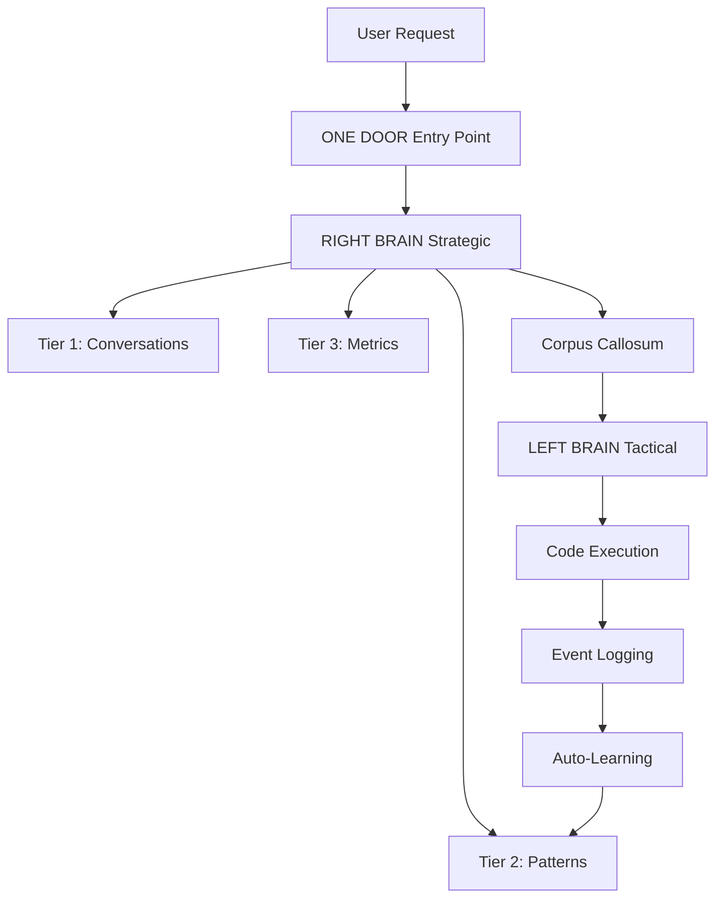
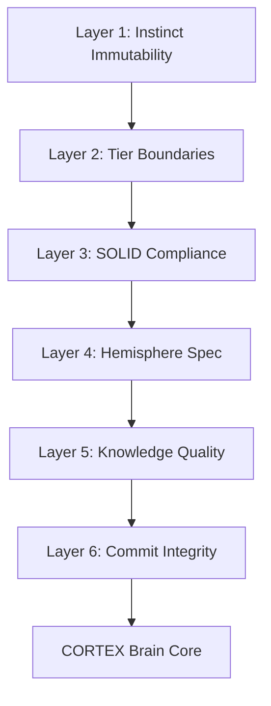

# CORTEX Comprehensive Documentation Plan

**Created:** 2025-11-06  
**Purpose:** Transform CORTEX documentation from basic to comprehensive, engaging, and technically complete  
**Status:** 📋 PLANNING PHASE  
**Target:** Professional-grade documentation with narrative storytelling + complete technical depth

---

## 🎯 Executive Summary

**Current State:**
- Basic documentation spread across multiple files
- "The Awakening of CORTEX" story exists but not integrated into main docs
- Technical details are scattered and incomplete
- No diagrams, flowcharts, or visual documentation
- Missing implementation guides, API references, and real-world examples

**Target State:**
- **Engaging Narrative:** "The Awakening of CORTEX" as the entry point with technical callouts
- **Complete Technical Depth:** Full API docs, architectural diagrams, implementation guides
- **Visual Excellence:** Mermaid diagrams, flowcharts, architecture visualizations throughout
- **Practical Guidance:** Step-by-step tutorials, troubleshooting guides, real-world examples
- **Searchable & Navigable:** Comprehensive index, cross-references, tags, breadcrumbs

---

## 📊 Current Documentation Inventory

### Existing Content (Analysis Required)

| Location | Files | Status | Quality | Action |
|----------|-------|--------|---------|--------|
| `docs/Mind-Palace/2025-11-06/` | The-Awakening-of-CORTEX.md | ✅ Complete story | 🌟 Excellent | Migrate & enhance |
| `prompts/user/cortex.md` | Entry point narrative | ✅ Good content | ⚠️ Too long (4,471 lines) | Split & reorganize |
| `README.md` | System overview | ✅ Basic info | ⚠️ Needs depth | Expand significantly |
| `docs/architecture/` | Various architecture docs | 🔄 Mixed | ⚠️ Scattered | Consolidate |
| `docs/tiers/` | Some tier docs | 🔄 Incomplete | ❌ Missing details | Recreate |
| `docs/agents/` | Agent docs | 🔄 Partial | ❌ Needs depth | Expand |
| `governance/rules.md` | 22 governance rules | ✅ Complete | 🌟 Excellent | Keep & enhance |
| `CORTEX/README.md` | Implementation status | ✅ Good | ⚠️ Phase 0 only | Update |

**Content Gap Analysis:**
- ❌ **NO** comprehensive system architecture document
- ❌ **NO** visual diagrams (Mermaid, PlantUML, PNG)
- ❌ **NO** API reference documentation
- ❌ **NO** implementation/setup guides
- ❌ **NO** troubleshooting documentation
- ❌ **NO** migration guide (KDS → CORTEX)
- ❌ **NO** testing documentation (60 sacred tests)
- ❌ **NO** real-world usage examples
- ❌ **NO** Oracle Crawler detailed docs
- ❌ **NO** protection system documentation

---

## 🗺️ New Documentation Structure (MkDocs)

### Site Map

```yaml
Home: index.md
  - Quick overview
  - Why CORTEX?
  - Getting started links

Story & Awakening:
  - The Awakening (Chapter 1-5)
    - Chapter 1: The Problem
    - Chapter 2: The Solution
    - Chapter 3: The Memory System
    - Chapter 4: Protection & Discovery
    - Chapter 5: Grand Activation
  - Character & Metaphor Guide
  - Story → Technical Mapping

Getting Started:
  - Quick Start (5 min)
  - Installation Guide
  - First-Time Setup
  - Configuration
  - Your First Request
  - Verification & Testing

Architecture:
  - System Overview
  - The Four Tiers
    - Tier 0: Instinct (Governance)
    - Tier 1: Working Memory (STM)
    - Tier 2: Knowledge Graph (LTM)
    - Tier 3: Context Intelligence
  - Dual-Hemisphere Model
    - LEFT BRAIN (Tactical)
    - RIGHT BRAIN (Strategic)
    - Corpus Callosum (Coordination)
  - The Brain Protection System (6 Layers)
  - The Oracle Crawler
  - Automatic Learning Loop
  - Data Flow & Integration

The Agent System:
  - Agent Overview (10 Specialists)
  - Agent Architecture
  - LEFT BRAIN Agents:
    - Test Generator
    - Code Executor
    - Health Validator
    - Error Corrector
    - Commit Handler
  - RIGHT BRAIN Agents:
    - Intent Router
    - Work Planner
    - Brain Protector
    - Screenshot Analyzer
    - Change Governor
  - Agent Communication Patterns
  - Creating Custom Agents

Tier Documentation:
  - Tier 0: Governance & Instinct
    - 22 Core Rules
    - Rule Enforcement
    - Protection Contracts
    - Governance API
  - Tier 1: Working Memory
    - Conversation Tracking (FIFO)
    - Context Resolution
    - Entity Extraction
    - SQLite Schema
    - Query API
  - Tier 2: Knowledge Graph
    - Pattern Storage
    - Intent Detection
    - File Relationships
    - FTS5 Search
    - Pattern Learning
    - Confidence Scoring
    - Query API
  - Tier 3: Context Intelligence
    - Git Metrics
    - File Hotspots
    - Test Effectiveness
    - Velocity Tracking
    - Proactive Warnings
    - Collection API

Implementation:
  - Setup & Installation
  - Brain Initialization
  - Oracle Crawler Usage
  - Configuration Guide
  - Environment Setup
  - Dependencies
  - PowerShell Scripts
  - Python Scripts
  - CLI Commands

Migration:
  - From KDS to CORTEX
  - Data Migration
  - Feature Parity
  - Breaking Changes
  - Migration Scripts
  - Validation

Testing & Validation:
  - The 60 Sacred Tests
  - Test Suite Architecture
  - Tier Tests (Tier 0-3)
  - Agent Tests
  - Integration Tests
  - Protection System Tests
  - Performance Tests
  - Coverage Reports
  - Running Tests
  - CI/CD Integration

Brain Systems:
  - Automatic Learning
  - Event Stream
  - Pattern Extraction
  - Protection System (6 Layers)
  - Brain Health Monitoring
  - Amnesia & Reset

API Reference:
  - REST API (if applicable)
  - Python API
  - TypeScript API
  - CLI Reference
  - Tier 0 API
  - Tier 1 API
  - Tier 2 API
  - Tier 3 API
  - Agent APIs
  - Brain Query API
  - Event Logging API

Visual Documentation:
  - System Architecture Diagrams
  - Data Flow Diagrams
  - Sequence Diagrams
  - State Diagrams
  - Tier Interaction Diagrams
  - Agent Collaboration Diagrams
  - Protection Layer Visualization
  - Learning Cycle Flowchart

Guides & Tutorials:
  - Day in the Life Scenarios
  - Common Workflows
    - Adding a Feature
    - Running Tests
    - Handling Errors
    - Brain Challenges
  - Advanced Patterns
  - Troubleshooting
  - Best Practices
  - Performance Tuning
  - Security Considerations

Reference:
  - Glossary
  - Configuration Options
  - Error Codes
  - Event Types
  - Pattern Types
  - Rule Reference (A-Z)
  - Agent Reference (A-Z)
  - CLI Commands (A-Z)

Development:
  - Contributing
  - Code Style
  - Development Setup
  - Testing Standards
  - Documentation Standards
  - Release Process

Appendices:
  - Design Decisions
  - Comparison: CORTEX vs KDS
  - Version History
  - Roadmap
  - FAQ
  - Credits
```

---

## 📋 Content Creation Checklist

### Phase 1: Foundation & Migration (Week 1)

#### 1.1 Create Comprehensive Documentation Plan ✅ IN PROGRESS
- [x] Document current state
- [x] Define target structure
- [x] Create implementation roadmap
- [ ] Get stakeholder approval

#### 1.2 Conduct Full System Inventory
**Goal:** Complete understanding of CORTEX implementation

**Tasks:**
- [ ] Scan all Python files in `CORTEX/src/`
  - [ ] Count files, LOC, functions, classes
  - [ ] Document tier implementations (tier0-tier3)
  - [ ] Document agent implementations
  - [ ] Document workflows
  - [ ] Document brain components
- [ ] Review test suites
  - [ ] Document test files and structure
  - [ ] Analyze test coverage
  - [ ] Document test patterns
- [ ] Analyze configuration files
  - [ ] `cortex.config.json`
  - [ ] `.env` settings
  - [ ] PowerShell configs
- [ ] Review governance rules
  - [ ] All 22 rules
  - [ ] Enforcement mechanisms
- [ ] Catalog scripts
  - [ ] PowerShell scripts
  - [ ] Python scripts
  - [ ] Migration tools

**Deliverable:** `SYSTEM-INVENTORY.md` with complete feature/file catalog

#### 1.3 Update MkDocs Configuration
**File:** `mkdocs.yml`

**Tasks:**
- [ ] Implement new navigation structure (from site map above)
- [ ] Configure plugins:
  ```yaml
  plugins:
    - search
    - mermaid2
    - minify
    - git-revision-date-localized
    - awesome-pages
  ```
- [ ] Enable Mermaid diagrams
- [ ] Configure syntax highlighting for Python, TypeScript, YAML, JSON
- [ ] Set up code copy buttons
- [ ] Configure admonitions (note, warning, tip, danger)
- [ ] Enable search suggestions
- [ ] Configure responsive design

**Deliverable:** Updated `mkdocs.yml` with complete structure

#### 1.4 Migrate "The Awakening of CORTEX"
**Source:** `docs/Mind-Palace/2025-11-06/The-Awakening-of-CORTEX.md`  
**Target:** `docs/story/`

**Tasks:**
- [ ] Create `docs/story/` directory
- [ ] Split into chapter files:
  - [ ] `chapter-1-the-problem.md` (Copilot's Amnesia)
  - [ ] `chapter-2-the-solution.md` (Dual-Hemisphere Brain)
  - [ ] `chapter-3-memory-system.md` (Five Tiers)
  - [ ] `chapter-4-protection.md` (Protection & Discovery)
  - [ ] `chapter-5-activation.md` (Grand Activation)
  - [ ] `character-guide.md` (Character/Technical Mapping)
  - [ ] `story-to-technical.md` (Cross-reference guide)
- [ ] Enhance with MkDocs features:
  - [ ] Add navigation breadcrumbs
  - [ ] Insert technical callouts (admonitions)
  - [ ] Add "See Also" links to technical docs
  - [ ] Embed diagrams where mentioned
  - [ ] Add code examples
- [ ] Format for web reading:
  - [ ] Shorter paragraphs
  - [ ] Section headings
  - [ ] Visual breaks
  - [ ] Syntax highlighting

**Deliverable:** Engaging, navigable story content

---

### Phase 2: Architecture & Technical Deep-Dive (Week 2)

#### 2.1 Create System Architecture Documentation
**Directory:** `docs/architecture/`

**Documents to Create:**

**`system-overview.md`**
- High-level CORTEX architecture
- Component diagram (Mermaid)
- Key concepts and terminology
- Design philosophy
- Comparison: CORTEX vs KDS

**`four-tier-brain.md`**
- Complete tier architecture
- Tier interactions (Mermaid sequence diagram)
- Data flow between tiers
- Query performance benchmarks
- Storage sizes and constraints

**`dual-hemisphere-model.md`**
- LEFT BRAIN (Tactical Executor)
- RIGHT BRAIN (Strategic Planner)
- Corpus Callosum (Coordination)
- Hemisphere communication patterns
- Workflow examples

**`protection-system.md`**
- Six-layer protection architecture
- Layer 1-6 detailed descriptions
- Protection contracts
- Challenge examples
- Override procedures

**`oracle-crawler.md`**
- Purpose and design
- Discovery phases (5 steps)
- UI Element ID mapping
- File relationship mapping
- Performance characteristics
- Usage guide

**`learning-loop.md`**
- Automatic learning architecture
- Event → Pattern extraction
- Tier 2 updates
- Tier 3 collection (throttled)
- Learning triggers
- Feedback cycles

**Deliverable:** Complete architectural documentation with diagrams

#### 2.2 Create Visual Documentation
**Directory:** `docs/visuals/`

**Diagrams to Create:**

**System Architecture:**


**Protection System:**


**Four-Tier Architecture:**
- Vertical stack diagram
- Data flow arrows
- Query times
- Storage sizes

**Agent Collaboration:**
- Agent interaction flowchart
- Message passing diagram
- Workflow sequences

**Learning Cycle:**
- Circular flow diagram
- Event processing
- Pattern extraction
- Knowledge update

**Deliverable:** Complete visual documentation set

#### 2.3 Document Each Tier in Detail
**Directory:** `docs/tiers/`

**For Each Tier (0-3):**

**Structure:**
```markdown
# Tier X: [Name]

## Overview
- Purpose
- Biological analog
- Storage mechanism
- Update frequency
- Query performance

## Architecture
- Data schema
- Indexes
- Relationships
- Storage format

## API Reference
- Query methods
- Insert methods
- Update methods
- Delete methods
- Code examples (Python, TypeScript)

## Configuration
- Settings
- Limits
- Thresholds

## Implementation Details
- File locations
- Code structure
- Dependencies

## Examples
- Common queries
- Real-world use cases
- Code snippets

## Testing
- Test coverage
- Test files
- Validation

## Performance
- Benchmarks
- Optimization tips
- Monitoring

## Troubleshooting
- Common issues
- Error codes
- Solutions
```

**Specific Content:**

**`tier0-governance.md`**
- All 22 rules detailed
- Enforcement mechanisms
- Protection contracts
- Rule API
- Governance engine implementation

**`tier1-working-memory.md`**
- SQLite schema
- FIFO queue mechanics
- Conversation tracking
- Entity extraction
- Context resolution
- Query API with examples

**`tier2-knowledge-graph.md`**
- Pattern storage
- FTS5 search
- Intent detection
- File relationships
- Workflow templates
- Confidence scoring
- Pattern learning
- Query API with examples

**`tier3-context-intelligence.md`**
- Git metrics collection
- File hotspot detection
- Test effectiveness tracking
- Velocity trends
- Proactive warnings
- Collection API with examples
- Throttling (1-hour minimum)

**Deliverable:** Complete tier documentation (4 docs)

---

### Phase 3: Agent System & Implementation (Week 3)

#### 3.1 Document Agent System
**Directory:** `docs/agents/`

**`overview.md`**
- Agent architecture
- Communication patterns
- SOLID principles
- Abstraction layers (DIP)

**For Each of 10 Agents:**

**Template:**
```markdown
# [Agent Name]

## Overview
- Hemisphere: LEFT/RIGHT
- Responsibility
- Triggers
- Outputs

## Architecture
- Single responsibility
- Dependencies
- Interfaces
- Code location

## Workflow
- Step-by-step process
- Decision trees
- Error handling

## API
- Function signatures
- Parameters
- Return values
- Code examples

## Integration
- How other agents call this
- What agents this calls
- Message formats

## Examples
- Real-world scenarios
- Code snippets
- Workflow diagrams

## Testing
- Test coverage
- Test files
- Validation

## Troubleshooting
- Common issues
- Error codes
- Solutions
```

**Agents to Document:**
1. **Intent Router** (RIGHT BRAIN)
2. **Work Planner** (RIGHT BRAIN)
3. **Brain Protector** (RIGHT BRAIN)
4. **Screenshot Analyzer** (RIGHT BRAIN)
5. **Change Governor** (RIGHT BRAIN)
6. **Test Generator** (LEFT BRAIN)
7. **Code Executor** (LEFT BRAIN)
8. **Health Validator** (LEFT BRAIN)
9. **Error Corrector** (LEFT BRAIN)
10. **Commit Handler** (LEFT BRAIN)

**Deliverable:** Complete agent documentation (10 docs + overview)

#### 3.2 Create Implementation Guides
**Directory:** `docs/guides/`

**`installation.md`**
- System requirements
- Dependencies
- PowerShell setup
- Python environment
- Git configuration
- Verification steps

**`first-time-setup.md`**
- Brain initialization
- Oracle Crawler first run
- Configuration wizard
- Test validation
- Troubleshooting

**`configuration.md`**
- `cortex.config.json` reference
- Environment variables
- PowerShell profile setup
- VS Code integration
- GitHub Copilot settings

**`oracle-crawler-guide.md`**
- What it discovers
- How to run it
- Incremental updates
- Performance tuning
- UI Element ID mapping

**`brain-initialization.md`**
- Empty brain setup
- Tier creation
- Initial patterns
- Bootstrap conversations
- Validation

**`migration-from-kds.md`**
- Migration strategy
- Data transformation
- Script usage
- Feature parity validation
- Rollback procedures

**Deliverable:** Complete implementation guides

---

### Phase 4: Testing, API, & Advanced Topics (Week 4)

#### 4.1 Document Testing System
**Directory:** `docs/testing/`

**`test-suite-overview.md`**
- 60 sacred tests
- Test architecture
- Coverage goals (95%+)
- CI/CD integration

**`tier-tests.md`**
- Tier 0 tests (15)
- Tier 1 tests (20)
- Tier 2 tests (15)
- Tier 3 tests (10)

**`agent-tests.md`**
- Test per agent
- Integration tests
- Contract validation

**`protection-system-tests.md`**
- Layer 1-6 tests
- Challenge scenarios
- Override validation

**`running-tests.md`**
- pytest commands
- Coverage reports
- Interpreting results
- Debugging failed tests

**Deliverable:** Complete testing documentation

#### 4.2 Create API Reference
**Directory:** `docs/api/`

**For Each Tier:**
- REST endpoints (if applicable)
- Python API
- TypeScript API
- Request/response schemas
- Authentication
- Error codes
- Rate limits
- Code examples

**`tier0-api.md`**
- Rule query API
- Governance enforcement API

**`tier1-api.md`**
- Conversation CRUD
- Context query
- Entity search

**`tier2-api.md`**
- Pattern search
- FTS5 query
- Intent detection
- Confidence scoring

**`tier3-api.md`**
- Metrics query
- Hotspot detection
- Velocity trends

**`agent-api.md`**
- Agent invocation
- Message passing
- Handoff formats

**`brain-api.md`**
- Brain update trigger
- Pattern extraction
- Event logging

**Deliverable:** Complete API documentation

#### 4.3 Create Advanced Guides
**Directory:** `docs/advanced/`

**`day-in-the-life.md`**
- Real-world scenarios
- Full workflow examples
- Decision trees
- Troubleshooting

**`brain-challenges.md`**
- How protection system works
- Example challenges
- Override procedures
- Evidence-based alternatives

**`pattern-learning.md`**
- How CORTEX learns
- Pattern extraction
- Confidence scoring
- Manual pattern injection

**`performance-tuning.md`**
- Query optimization
- Index tuning
- Cache strategies
- Throttling configuration

**`troubleshooting.md`**
- Common issues (A-Z)
- Error code reference
- Solution procedures
- Support resources

**Deliverable:** Advanced documentation

---

## 🎨 Visual Design Standards

### Mermaid Diagram Style

```yaml
theme: dark
color_scheme:
  tier0: red
  tier1: purple
  tier2: blue
  tier3: teal
  left_brain: electric-blue
  right_brain: purple
  corpus_callosum: teal
  protection_layers: gradient-red-blue
```

### Code Block Standards

```markdown
```python
# All code examples must:
# 1. Include comments explaining key parts
# 2. Show complete, runnable examples
# 3. Use proper syntax highlighting
# 4. Include output examples where relevant
```

### Admonition Usage

```markdown
!!! note "Technical Detail"
    Deep technical information

!!! tip "Best Practice"
    Recommended approach

!!! warning "Caution"
    Things to watch out for

!!! danger "Critical"
    Could break the system

!!! example "Example"
    Code example or use case
```

---

## 📊 Success Metrics

### Documentation Completeness

- [x] **Story:** The Awakening migrated and enhanced
- [ ] **Architecture:** 7+ comprehensive docs
- [ ] **Tiers:** 4 complete tier docs
- [ ] **Agents:** 10 agent docs + overview
- [ ] **API:** Complete API reference (7+ docs)
- [ ] **Guides:** 6+ implementation guides
- [ ] **Testing:** Complete test documentation
- [ ] **Visual:** 10+ Mermaid diagrams
- [ ] **Advanced:** 5+ advanced guides

### Quality Gates

- [ ] All diagrams render correctly
- [ ] All code examples are tested
- [ ] All links work (no 404s)
- [ ] Search indexes all content
- [ ] Mobile-responsive design
- [ ] Load time < 2 seconds
- [ ] Accessibility (WCAG 2.1 AA)
- [ ] Grammar/spelling checked

### User Experience

- [ ] Can find any topic in < 3 clicks
- [ ] Beginner to expert learning path clear
- [ ] Story engages non-technical readers
- [ ] Technical depth satisfies engineers
- [ ] Copy-paste code examples work
- [ ] Troubleshooting solves real problems

---

## 🚀 Implementation Timeline

### Week 1: Foundation (Nov 6-12)
- ✅ Day 1: Create this plan (IN PROGRESS)
- Day 2: Conduct system inventory
- Day 3: Update MkDocs config + migrate story
- Day 4-5: Begin architecture docs

### Week 2: Architecture (Nov 13-19)
- Days 1-3: Complete architecture docs
- Days 4-5: Create all visual diagrams

### Week 3: Tiers & Agents (Nov 20-26)
- Days 1-2: Complete tier documentation
- Days 3-5: Complete agent documentation

### Week 4: API & Advanced (Nov 27-Dec 3)
- Days 1-2: Create API reference
- Days 3-4: Advanced guides + testing docs
- Day 5: Final review + publish

---

## 🛠️ Tools & Technologies

### Documentation
- **MkDocs:** Static site generator
- **Material for MkDocs:** Theme
- **Mermaid:** Diagram generation
- **PlantUML:** (Optional) Complex diagrams
- **Python-Markdown:** Extensions

### Code Examples
- **Python 3.11+:** All Python examples
- **TypeScript 5.0+:** TS examples
- **PowerShell 7+:** Script examples

### Validation
- **markdownlint:** Markdown syntax
- **vale:** Prose linting
- **linkchecker:** Broken link detection
- **pytest:** Test code examples

---

## 📝 Content Guidelines

### Writing Style

**Story Content (The Awakening):**
- Engaging, narrative-driven
- Humor and personality
- Accessible to non-technical readers
- Technical callouts where appropriate

**Technical Documentation:**
- Clear, concise, professional
- Complete and accurate
- Code examples for all concepts
- Troubleshooting for common issues

**API Reference:**
- Precise technical language
- Request/response schemas
- Error code tables
- Authentication details
- Rate limit information

### Code Example Standards

```python
# ✅ GOOD: Complete, runnable, commented
from cortex.tier1 import WorkingMemory

# Initialize working memory
memory = WorkingMemory(db_path="cortex-brain/tier1.db")

# Query recent conversations
conversations = memory.get_recent_conversations(limit=5)

for conv in conversations:
    print(f"Conversation {conv.id}: {conv.title}")
    # Output: Conversation conv-001: Add purple button
```

```python
# ❌ BAD: Incomplete, no context, no output
memory.get_conversations()
```

### Diagram Standards

- **Use Mermaid** for all flowcharts, sequence diagrams, class diagrams
- **Include alt text** for all images
- **Dark theme** compatible colors
- **Responsive** sizing
- **Print-friendly** option

---

## 🔍 Quality Assurance Process

### Review Checklist

**Before Publishing:**
- [ ] All content peer-reviewed
- [ ] All code examples tested
- [ ] All diagrams render correctly
- [ ] All links validated
- [ ] Spelling/grammar checked
- [ ] Mobile-responsive verified
- [ ] Search functionality tested
- [ ] Performance benchmarked

**Continuous Improvement:**
- [ ] User feedback collected
- [ ] Analytics reviewed monthly
- [ ] Broken links fixed weekly
- [ ] Content updated with each release

---

## 📚 Reference Materials

### Source Documents
- `prompts/user/cortex.md` - Entry point narrative (4,471 lines)
- `docs/Mind-Palace/2025-11-06/The-Awakening-of-CORTEX.md` - Story (2,733 lines)
- `governance/rules.md` - 22 governance rules (3,378 lines)
- `README.md` - System overview
- `CORTEX/README.md` - Implementation status

### Code Sources
- `CORTEX/src/tier0/` - Governance engine
- `CORTEX/src/tier1/` - Working memory
- `CORTEX/src/tier2/` - Knowledge graph
- `CORTEX/src/tier3/` - Context intelligence
- `CORTEX/src/entry_point/` - Entry point
- `CORTEX/src/cortex_agents/` - Agents

### Test Sources
- `CORTEX/tests/tier0/` - Tier 0 tests
- `CORTEX/tests/tier1/` - Tier 1 tests
- `CORTEX/tests/tier2/` - Tier 2 tests
- `CORTEX/tests/tier3/` - Tier 3 tests
- `tests/tier1/test_tier1_suite.py` - Integration tests

---

## 🎯 Next Actions

1. **Approve this plan** - Get stakeholder sign-off
2. **Begin system inventory** - Analyze all code
3. **Update MkDocs config** - Implement navigation structure
4. **Start migration** - Move "The Awakening" to MkDocs
5. **Create first diagrams** - System architecture + tiers

---

**Status:** 📋 AWAITING APPROVAL  
**Estimated Effort:** 4 weeks (160 hours)  
**Priority:** HIGH - Documentation is critical for adoption  
**Owner:** Documentation Team  

---

**END OF COMPREHENSIVE DOCUMENTATION PLAN**
