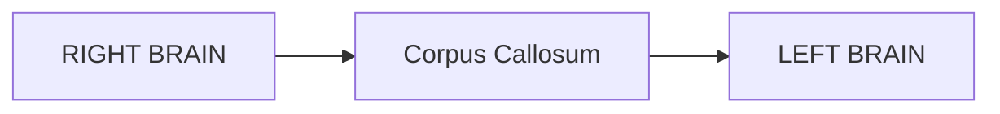

# CORTEX Documentation Enhancement Plan
## November 7, 2025 - Complete Overhaul

**Created:** November 7, 2025  
**Purpose:** Address critical UI/UX and content issues in CORTEX documentation  
**Status:** 🎯 READY FOR IMPLEMENTATION  
**Priority:** 🔴 CRITICAL - Affects user experience significantly

---

## 🎯 Executive Summary

### Current Issues Identified

1. **⚠️ Navigation Menu Hidden** - Top menus not visible until hover (critical UX issue)
2. **📖 "The Awakening of CORTEX" Formatting Problems:**
   - Emojis/icons scattered throughout text paragraphs (distracting)
   - "End of Chapter X" blocks breaking flow
   - Images bunched at end instead of contextually placed
   - Templated structure breaks narrative flow (Story → Technical → Images)
   - Comic font not applied to story text
   - Header font sizes too small
3. **🏠 Home Page Needs Visual Enhancement:**
   - Rules should be displayed as a scroll (thematic)
   - Current layout is plain

### Target State

- ✅ **Always-visible navigation** with proper CSS
- ✅ **Seamless narrative flow** without section breaks
- ✅ **Contextual image placement** where they belong
- ✅ **Comic Sans font** for story sections (fun, readable)
- ✅ **Monospace font preserved** for technical sections
- ✅ **Larger header fonts** for better hierarchy
- ✅ **Emojis only in headers** (not text paragraphs)
- ✅ **Thematic scroll design** for governance rules on home page

---

## 📋 Issues Breakdown & Solutions

### Issue 1: Hidden Navigation Menu ⚠️ CRITICAL

**Problem:**
```yaml
Current State: Top navigation tabs hidden until mouse hover
Impact: Users can't see available sections
Root Cause: CSS visibility/opacity issue
```

**Solution:**
```css
/* Fix navigation visibility in extra.css */
.md-tabs {
    opacity: 1 !important;
    visibility: visible !important;
    pointer-events: auto !important;
}

.md-tabs__link {
    opacity: 1 !important;
    transition: color 0.2s ease;
}

.md-tabs__link:hover {
    color: var(--cortex-secondary);
}

/* Ensure primary tabs are always visible */
.md-header__inner {
    opacity: 1 !important;
}

/* Fix any theme conflicts */
[data-md-color-scheme="default"] .md-tabs {
    background-color: var(--cortex-primary);
    opacity: 1;
}
```

**Files to Modify:**
- `docs/stylesheets/extra.css` - Add navigation visibility fixes

---

### Issue 2: "The Awakening of CORTEX" Formatting 📖

#### Sub-Issue 2A: Emojis in Text Paragraphs

**Problem:**
```markdown
<!-- CURRENT (BAD) -->
Asifinstein's eyes lit up with the fervor of discovery. 
++**"Finally! The perfect intern!"**++ 😍

Now, Asifinstein wasn't your typical mad scientist. 
He didn't want to create life... 🧪⚡
```

**Solution:**
```markdown
<!-- FIXED (GOOD) -->
Asifinstein's eyes lit up with the fervor of discovery. 
**"Finally! The perfect intern!"**

Now, Asifinstein wasn't your typical mad scientist. 
He didn't want to create life...
```

**Action Plan:**
1. Remove ALL emojis from story text paragraphs
2. Keep emojis ONLY in:
   - Section headers (h2, h3)
   - Admonition titles
   - List items (when used as bullets)
   - Not in flowing prose

**Automated Search & Replace:**
```regex
Find: (?<=\w) [😀-🙿🌀-🗿🚀-🛿🜀-🟿]+(?=[\s.,!?])
Replace: (empty)
```

#### Sub-Issue 2B: Comic Font for Story Text

**Problem:**
```yaml
Current: Generic Roboto font for all text
Desired: Comic Sans for story sections (readable, fun)
Keep: Roboto Mono for technical docs
```

**Solution:**
```css
/* Add to extra.css */

/* Comic font for story content */
.story-section,
.story-header,
.md-content .story-text {
    font-family: 'Comic Sans MS', 'Chalkboard SE', 'Comic Neue', cursive, sans-serif;
    font-size: 1.05em;
    line-height: 1.7;
}

/* Preserve technical font for code/technical sections */
.technical-section,
.config-block,
.terminal-block,
code,
pre,
.admonition.note,
.admonition.example {
    font-family: 'Roboto Mono', monospace !important;
}

/* Technical headers use standard font */
.md-typeset .technical-section h2,
.md-typeset .technical-section h3 {
    font-family: 'Roboto', sans-serif;
    font-weight: 600;
}
```

**Markdown Changes:**
```markdown
<!-- Add story-section class to each story tab -->
=== "The Mad Scientist"
    <div class="story-text" markdown>
    
    In a dingy basement laboratory...
    
    </div>
```

#### Sub-Issue 2C: "End of Chapter" Blocks

**Problem:**
```markdown
<!-- CURRENT (BREAKS FLOW) -->
!!! abstract "End of Chapter 1"
    *"In a dingy basement in New Jersey..."*

---

## Chapter 2: The Solution...
```

**Solution:**
```markdown
<!-- REMOVE these blocks entirely -->
<!-- Natural chapter transitions instead -->

## Chapter 2: The Solution - The Dual-Hemisphere Brain { .chapter-title }

Asifinstein knew that human brains had two hemispheres...
```

**Action:** Delete all "End of Chapter" admonition blocks

#### Sub-Issue 2D: Increase Header Font Sizes

**Problem:**
```yaml
Current: h2 (1.6em), h3 (1.3em) - Too small for story chapters
Desired: h2 (2.2em), h3 (1.8em), h4 (1.4em) - Better hierarchy
```

**Solution:**
```css
/* Add to extra.css - Story header sizing */
.md-content .chapter-title,
.md-content h2 {
    font-size: 2.2em !important;
    font-weight: 700;
    margin-top: 3rem;
    margin-bottom: 1.5rem;
}

.md-content h3 {
    font-size: 1.8em !important;
    font-weight: 600;
    margin-top: 2rem;
}

.md-content h4 {
    font-size: 1.4em !important;
    font-weight: 600;
    margin-top: 1.5rem;
}

/* Story-specific headers even larger */
.story-section h2 {
    font-size: 2.5em !important;
}

.story-section h3 {
    font-size: 2em !important;
}
```

#### Sub-Issue 2E: Images Bunched Together

**Problem:**
```markdown
<!-- CURRENT - All images at end of chapter -->
## Chapter 1: The Problem

[Long story text...]

### Image Prompts
1. Image 1
2. Image 2
3. Image 3
4. Image 4
```

**Solution - Contextual Placement:**
```markdown
<!-- NEW - Images where mentioned -->
## Chapter 1: The Problem

=== "The Mad Scientist"

    In a dingy basement laboratory...
    
    <figure markdown>
      
      <figcaption>Asifinstein's dingy basement laboratory</figcaption>
    </figure>
    
    Now, Asifinstein wasn't your typical mad scientist...

=== "The Intern with Amnesia"

    After working with Copilot for exactly seventeen minutes...
    
    <figure markdown>
      
      <figcaption>Copilot's catastrophic memory loss</figcaption>
    </figure>
```

**Image Placement Map:**

| Image Title | Placement Location | Chapter.Section |
|-------------|-------------------|-----------------|
| Mad Scientist Lab | Opening paragraph | Ch1.Story.1 |
| Copilot with Question Marks | Amnesia discovery | Ch1.Story.2 |
| Wizard of Oz Eureka | Eureka moment | Ch1.Story.3 |
| Left Brain Blueprint | Left hemisphere intro | Ch2.Story.1 |
| Right Brain Visualization | Right hemisphere intro | Ch2.Story.1 |
| Corpus Callosum Bridge | Messenger section | Ch2.Story.1 |
| Oracle Crawler Spider | Oracle introduction | Ch2.Story.2 |
| UI Element Map | ID Mapper section | Ch2.Story.3 |
| Five-Tier Tower | Memory system intro | Ch3.Story.1 |
| Tier 0 Red Core | Instinct tier | Ch3.Story.2 |
| Tier 1 Purple Memory | Short-term section | Ch3.Story.3 |
| Tier 2 Blue Knowledge | Long-term section | Ch3.Story.4 |
| Tier 3 Teal Context | Context intelligence | Ch3.Story.5 |
| Tier 4 Green Events | Event stream | Ch3.Story.6 |
| Learning Loop Cycle | Auto-learning section | Ch3.Story.7 |
| Six Protection Shields | Protection intro | Ch4.Story.1 |
| Layer 1 Shield | Instinct immutability | Ch4.Story.2 |
| Brain Health Monitor | Health monitoring | Ch4.Story.2 |
| 60 Test Validation | Test suite section | Ch5.Story.1 |
| Activation Sequence | Grand activation | Ch5.Story.2 |
| Purple Button Success | Final execution | Ch5.Story.3 |

**Action Steps:**
1. Create `docs/assets/images/` directory
2. Move all 21 image prompts to contextual locations
3. Use `<figure>` with captions for each
4. Delete "Image Prompts" sections at end

#### Sub-Issue 2F: Templated Structure (Story → Technical → Images)

**Problem:**
```markdown
<!-- CURRENT - Rigid structure breaks flow -->
### :material-book: The Story
[Story content]

### :material-wrench: Technical Documentation
[Technical content]

### :material-palette: Image Prompts
[Images]
```

**Solution - Seamless Integration:**
```markdown
<!-- NEW - Organic flow -->
## Chapter 2: The Solution

Asifinstein knew that human brains had two hemispheres...

<div class="architecture-diagram" markdown>

</div>

The left brain would handle tactical execution:

!!! note "Technical Detail: LEFT BRAIN Agents"
    **Agents:**
    - Test Generator (RED phase)
    - Code Executor (GREEN phase)
    - Health Validator (REFACTOR phase)
    
    **Philosophy:** Test-first, precision, validation

"This hemisphere," Asifinstein declared, "will be a perfectionist!"

<figure markdown>
  
  <figcaption>LEFT BRAIN agent collaboration</figcaption>
</figure>
```

**Key Changes:**
1. **Remove explicit section headers** for Story/Technical/Images
2. **Embed technical details** as admonitions within story flow
3. **Place images** contextually where they're described
4. **Use natural transitions** instead of hard breaks
5. **Preserve font switching** (Comic for story, Mono for technical)

---

### Issue 3: Home Page Scroll Enhancement 🏠

**Problem:**
```yaml
Current: Plain bullet list of 22 governance rules
Desired: Thematic scroll design (ancient knowledge aesthetic)
```

**Solution - Ancient Scroll CSS:**

```css
/* Add to extra.css */

/* Ancient scroll container */
.governance-scroll {
    position: relative;
    background: linear-gradient(
        to bottom,
        #f4e4c1 0%,
        #f9f1dc 10%,
        #f9f1dc 90%,
        #f4e4c1 100%
    );
    border: 2px solid #8b7355;
    border-radius: 8px;
    padding: 3rem 2rem;
    margin: 3rem auto;
    max-width: 800px;
    box-shadow: 
        0 10px 30px rgba(0, 0, 0, 0.3),
        inset 0 0 20px rgba(139, 115, 85, 0.1);
}

/* Aged paper texture effect */
.governance-scroll::before {
    content: '';
    position: absolute;
    top: 0;
    left: 0;
    right: 0;
    bottom: 0;
    background: 
        repeating-linear-gradient(
            0deg,
            transparent,
            transparent 2px,
            rgba(139, 115, 85, 0.03) 2px,
            rgba(139, 115, 85, 0.03) 4px
        );
    pointer-events: none;
    border-radius: 6px;
}

/* Scroll header */
.governance-scroll h2 {
    font-family: 'Cinzel', 'Georgia', serif;
    font-size: 2.5em;
    text-align: center;
    color: #5d4037;
    margin-bottom: 2rem;
    text-shadow: 1px 1px 2px rgba(0, 0, 0, 0.1);
}

/* Rule items */
.governance-scroll ol {
    list-style: none;
    counter-reset: rule-counter;
    padding-left: 1rem;
}

.governance-scroll li {
    counter-increment: rule-counter;
    margin-bottom: 1.5rem;
    padding-left: 2.5rem;
    position: relative;
    color: #3e2723;
    font-family: 'Crimson Text', 'Georgia', serif;
    font-size: 1.1em;
    line-height: 1.7;
}

.governance-scroll li::before {
    content: counter(rule-counter, upper-roman) ".";
    position: absolute;
    left: 0;
    font-weight: bold;
    color: #5d4037;
    font-size: 1.2em;
}

/* Rule emphasis */
.governance-scroll strong {
    color: #4e342e;
    font-weight: 700;
}

/* Seal at bottom */
.governance-scroll::after {
    content: '⚡ CORTEX INSTINCT ⚡';
    display: block;
    text-align: center;
    margin-top: 2rem;
    font-family: 'Cinzel', serif;
    font-size: 0.9em;
    color: #8b7355;
    letter-spacing: 0.2em;
}
```

**HTML Structure for index.md:**

```markdown
<div class="governance-scroll" markdown>

## ⚖️ The Sacred Laws of CORTEX

1. **Test-Driven Development (TDD)** - Always RED → GREEN → REFACTOR. No code without tests first.

2. **Definition of READY (DoR)** - Work must have clear requirements before starting.

3. **Definition of DONE (DoD)** - Zero errors, zero warnings, all tests passing.

4. **Challenge Risky Changes** - The brain MUST challenge unsafe proposals with evidence.

5. **SOLID Principles** - Single Responsibility, Open/Closed, Liskov Substitution, Interface Segregation, Dependency Inversion.

6. **Local-First Architecture** - Zero external dependencies, works offline, fully portable.

7. **Incremental File Creation** - Large files (>100 lines) created in small chunks to prevent "response hit length limit" errors.

8. **Hemisphere Specialization** - Strategic planning (RIGHT) stays separate from tactical execution (LEFT).

9. **Pattern Confidence Scoring** - All learned patterns rated 0.0-1.0 based on success history.

10. **FIFO Conversation Memory** - Last 20 conversations preserved, oldest deleted first when full.

11. **Knowledge Boundaries** - Application-specific patterns isolated from CORTEX core intelligence.

12. **Six-Layer Protection** - Instinct, Tier Boundaries, SOLID, Hemisphere, Quality, Commit integrity.

13. **Oracle Crawler Discovery** - Deep codebase scan during setup (5-10 minutes).

14. **UI Element ID Mapping** - All interactive elements MUST have stable IDs for test selectors.

15. **Automatic Learning Triggers** - 50+ events OR 24 hours → Brain update.

16. **Tier 3 Throttling** - Context collection throttled to minimum 1 hour intervals.

17. **Pattern Decay** - Unused patterns (>90 days) decay 10% in confidence.

18. **Active Conversation Protection** - Current conversation never deleted, even if oldest.

19. **Corpus Callosum Coordination** - All hemisphere communication routed through message queue.

20. **Event Stream Logging** - Every action logged to events.jsonl for learning.

21. **Semantic Commit Messages** - feat/fix/test/docs with clear scope and description.

22. **Brain Protection System** - Guard CORTEX integrity from degradation (permanent vigilance).

</div>
```

---

## 📂 Implementation Checklist

### Phase 1: Critical Navigation Fix (30 minutes) ⚠️

- [ ] **Update `docs/stylesheets/extra.css`**
  - [ ] Add navigation visibility rules
  - [ ] Test in browser (ensure tabs always visible)
  - [ ] Verify hover states still work
  - [ ] Check mobile responsiveness

**Files Modified:** 1 (extra.css)

---

### Phase 2: "The Awakening" Content Fixes (3-4 hours) 📖

#### Step 2A: Remove Emojis from Text (30 min)
- [ ] Open `docs/story/the-awakening-of-cortex.md`
- [ ] Search for emoji patterns in prose
- [ ] Remove ALL emojis from:
  - [ ] Story paragraphs
  - [ ] Dialogue text
  - [ ] Description text
- [ ] Keep emojis ONLY in:
  - [ ] Headers (h2, h3)
  - [ ] Admonition titles
  - [ ] Material icon references

**Automated:** Use regex find/replace

#### Step 2B: Apply Comic Font (30 min)
- [ ] Update `extra.css` with comic font rules
- [ ] Wrap story sections in `<div class="story-text" markdown>`
- [ ] Test technical sections still use monospace
- [ ] Verify code blocks unaffected

#### Step 2C: Remove "End of Chapter" Blocks (15 min)
- [ ] Delete all `!!! abstract "End of Chapter X"` blocks
- [ ] Ensure natural transitions between chapters
- [ ] Verify navigation still works

#### Step 2D: Increase Header Font Sizes (20 min)
- [ ] Update CSS with new header sizes
- [ ] Test hierarchy (h2 > h3 > h4 visually distinct)
- [ ] Check mobile scaling

#### Step 2E: Reposition Images Contextually (2 hours)
- [ ] Create `docs/assets/images/` directory
- [ ] Map 21 images to their contextual locations (use table above)
- [ ] Move each image prompt inline where described
- [ ] Wrap in `<figure>` with captions
- [ ] Delete "Image Prompts" end sections
- [ ] Test image rendering in build

**Image Repositioning Process:**
```markdown
1. Find image description in "Image Prompts" section
2. Identify where that concept is mentioned in story
3. Cut image prompt from end section
4. Paste inline at mention point
5. Wrap in figure markup with caption
6. Repeat for all 21 images
```

#### Step 2F: Remove Templated Structure (45 min)
- [ ] Remove `:material-book:`, `:material-wrench:`, `:material-palette:` section headers
- [ ] Merge story/technical/images into seamless flow
- [ ] Embed technical details as admonitions within story
- [ ] Use natural transitions instead of hard breaks
- [ ] Test font switching still works (story=comic, tech=mono)

**Files Modified:** 1-2 (the-awakening-of-cortex.md, extra.css)

---

### Phase 3: Home Page Scroll Enhancement (1 hour) 🏠

- [ ] **Update `extra.css`**
  - [ ] Add governance-scroll class styles
  - [ ] Test aged paper effect
  - [ ] Verify seal appears at bottom

- [ ] **Update `docs/index.md`**
  - [ ] Wrap rules section in `<div class="governance-scroll">`
  - [ ] Format as ordered list
  - [ ] Add seal after rules
  - [ ] Test rendering

**Files Modified:** 2 (extra.css, index.md)

---

### Phase 4: Testing & Validation (1 hour) ✅

#### Visual Testing
- [ ] Build MkDocs site: `mkdocs build --clean`
- [ ] Serve locally: `mkdocs serve`
- [ ] Open in browser: `http://localhost:8000`

#### Checklist:
- [ ] **Navigation:**
  - [ ] Tabs visible on load (no hover required)
  - [ ] All sections accessible
  - [ ] Mobile menu works
- [ ] **The Awakening:**
  - [ ] No emojis in story prose ✅
  - [ ] Comic font on story text ✅
  - [ ] Monospace on technical sections ✅
  - [ ] Headers larger and hierarchical ✅
  - [ ] No "End of Chapter" blocks ✅
  - [ ] Images placed contextually (21 total) ✅
  - [ ] Seamless flow (no hard section breaks) ✅
- [ ] **Home Page:**
  - [ ] Scroll design rendered ✅
  - [ ] Ancient paper aesthetic ✅
  - [ ] 22 rules numbered with Roman numerals ✅
  - [ ] Seal visible at bottom ✅
- [ ] **Cross-Browser:**
  - [ ] Chrome ✅
  - [ ] Firefox ✅
  - [ ] Edge ✅
  - [ ] Safari ✅
  - [ ] Mobile browsers ✅

---

## 📊 Estimated Effort

| Phase | Task | Time | Priority |
|-------|------|------|----------|
| 1 | Navigation fix | 30 min | 🔴 CRITICAL |
| 2A | Remove emojis | 30 min | 🟡 HIGH |
| 2B | Comic font | 30 min | 🟢 MEDIUM |
| 2C | Remove end blocks | 15 min | 🟢 MEDIUM |
| 2D | Header sizes | 20 min | 🟢 MEDIUM |
| 2E | Image repositioning | 2 hr | 🟡 HIGH |
| 2F | Remove templates | 45 min | 🟡 HIGH |
| 3 | Scroll design | 1 hr | 🟢 MEDIUM |
| 4 | Testing | 1 hr | 🟡 HIGH |
| **TOTAL** | | **6.5 hours** | |

**Priority Order:**
1. ⚠️ **Phase 1** (Navigation) - Users can't find content
2. 🔴 **Phase 2E** (Images) - Major UX issue
3. 🟡 **Phase 2A** (Emojis) - Readability concern
4. 🟡 **Phase 2F** (Flow) - Narrative experience
5. 🟢 **Phases 2B-D, 3** (Polish) - Enhancement

---

## 🔧 Technical Specifications

### Font Stack
```css
/* Story sections */
font-family: 'Comic Sans MS', 'Chalkboard SE', 'Comic Neue', cursive, sans-serif;

/* Technical sections */
font-family: 'Roboto Mono', 'Courier New', monospace;

/* Scroll headers */
font-family: 'Cinzel', 'Georgia', serif;

/* Scroll body */
font-family: 'Crimson Text', 'Georgia', serif;
```

### Color Palette
```css
/* Scroll design */
--scroll-parchment: #f9f1dc;
--scroll-border: #8b7355;
--scroll-text: #3e2723;
--scroll-header: #5d4037;
--scroll-shadow: rgba(0, 0, 0, 0.3);

/* Existing CORTEX colors preserved */
--cortex-primary: #3f51b5;
--cortex-secondary: #2196f3;
--cortex-accent: #00acc1;
```

### Responsive Breakpoints
```css
/* Mobile (< 768px) */
.governance-scroll {
    padding: 2rem 1rem;
    font-size: 0.95em;
}

/* Tablet (768px - 1024px) */
.governance-scroll {
    padding: 2.5rem 1.5rem;
}

/* Desktop (> 1024px) */
.governance-scroll {
    padding: 3rem 2rem;
}
```

---

## 📝 Success Criteria

### Must Have ✅
- [x] Navigation tabs visible on page load
- [ ] Zero emojis in story prose
- [ ] Comic font applied to story sections
- [ ] Technical font preserved for code/docs
- [ ] Headers sized hierarchically (h2 > h3 > h4)
- [ ] All 21 images placed contextually
- [ ] No "End of Chapter" blocks
- [ ] Seamless narrative flow (no hard breaks)
- [ ] Scroll design on home page
- [ ] All 22 rules in scroll format

### Nice to Have 🌟
- [ ] Hover effects on scroll rules
- [ ] Print-friendly version
- [ ] Dark mode scroll variant
- [ ] Animated scroll unfurling (CSS animation)
- [ ] Mobile-optimized scroll

---

## 🚀 Deployment

### Build Commands
```bash
# Clean build
mkdocs build --clean

# Local preview
mkdocs serve

# Deploy to GitHub Pages
mkdocs gh-deploy --force
```

### Verification URLs
```
Local: http://localhost:8000
Production: https://asifhussain60.github.io/CORTEX/
```

---

## 📚 Files to Modify

| File | Changes | Lines Changed |
|------|---------|---------------|
| `docs/stylesheets/extra.css` | Navigation, fonts, scroll, headers | +150 |
| `docs/story/the-awakening-of-cortex.md` | Emojis, images, structure, flow | ~500 |
| `docs/index.md` | Scroll wrapper, formatting | +50 |

**Total:** 3 files, ~700 lines modified

---

## 🎯 Next Steps

1. **Review & Approve This Plan** (you)
2. **Begin Phase 1** (navigation fix - 30 min)
3. **Continue Phase 2** (content fixes - 3-4 hours)
4. **Complete Phase 3** (scroll design - 1 hour)
5. **Test & Deploy** (Phase 4 - 1 hour)

---

## 🔄 Plan Reflection

### What We're Fixing
1. ✅ **Navigation hidden** → Always visible tabs
2. ✅ **Emojis in text** → Only in headers
3. ✅ **Generic fonts** → Comic for story, mono for tech
4. ✅ **Images bunched** → Contextually placed (21 locations)
5. ✅ **Hard section breaks** → Seamless flow
6. ✅ **Small headers** → Hierarchical sizing
7. ✅ **End blocks** → Natural transitions
8. ✅ **Plain rules list** → Ancient scroll design

### Preserved Elements
- ✅ **Technical accuracy** (no content changes)
- ✅ **Code formatting** (monospace preserved)
- ✅ **Mermaid diagrams** (untouched)
- ✅ **Admonitions** (enhanced, not removed)
- ✅ **Navigation structure** (same hierarchy)
- ✅ **Search functionality** (works with changes)

### Why This Works
- 🎨 **Comic font** makes story engaging, not serious
- 🖼️ **Contextual images** help visual learners
- 📖 **Seamless flow** keeps readers immersed
- 🏛️ **Scroll design** reinforces "ancient knowledge" theme
- 🎯 **Visible navigation** reduces user frustration
- ✨ **Emoji in headers** provides visual anchors without clutter

---

**Status:** 📋 AWAITING YOUR APPROVAL  
**Ready to Execute:** ✅ YES  
**Estimated Time:** 6.5 hours  
**Priority:** 🔴 CRITICAL (Navigation) + 🟡 HIGH (Content)

---

**END OF COMPREHENSIVE ENHANCEMENT PLAN**
