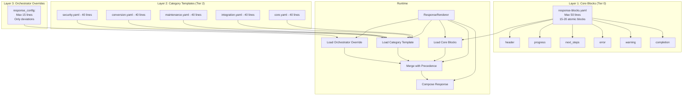
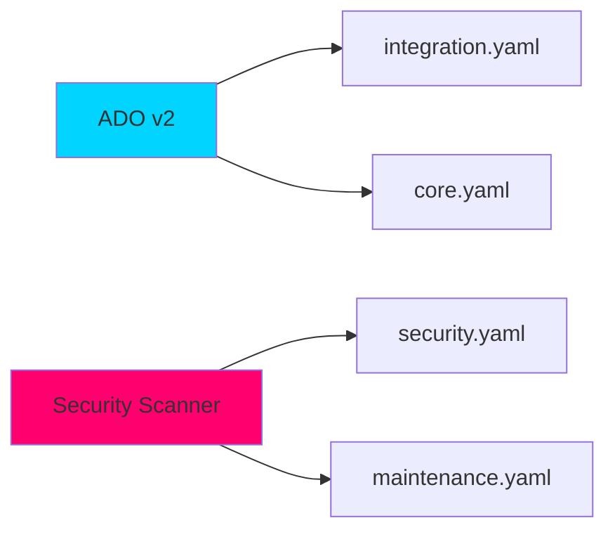

# 3-Layer Response Template Architecture

**Version:** 1.0  
**Created:** 2026-01-10  
**Status:** Design Phase  
**Plan:** TEMPLATE-ARCHITECTURE-PLAN.yaml  

## Overview

The 3-Layer Response Template Architecture is a Phase 2 enhancement that replaces the monolithic 2046-line `response-templates-v4.yaml` with a composable, maintainable system that reduces code by 85%.

## Problem Statement

### Current State: 2046-Line Monolith

**File:** `cortex-brain/response-templates-v4.yaml` (2046 lines)

**Pain Points:**
- **Duplication:** Continuation prompts and common patterns repeated across 40+ orchestrators
- **Maintenance Burden:** Changes to common patterns require updates in multiple locations
- **Inconsistency:** No enforcement mechanism for standard response blocks
- **CORE-002 Violation:** Directly violates the anti-bloat governance principle (max 300 lines)
- **Scalability:** Per-orchestrator approach would create 80-160 files if decomposed naively

**Root Cause:** Templates defined inline instead of referencing reusable blocks.

## Solution Architecture

### 3-Layer Composition with Precedence Rules



### Precedence Resolution

```
PRECEDENCE: orchestrator > category > core

Resolution Flow:
1. Load core blocks (tier0/response-blocks.yaml)
2. Load category template (tier2/response-templates/{category}.yaml)
3. Load orchestrator overrides (manifests/{orch}/response_config)
4. Merge with precedence: orchestrator wins conflicts
5. Compose blocks per work breakdown structure
6. Return markdown

Example:
  Core:       header: "# {orchestrator_name}"
  Category:   header: "# 🔧 {orchestrator_name} - {category}"
  Orchestrator: header: "# 🎯 Custom Header"
  
  Result:     "# 🎯 Custom Header" (orchestrator wins)
```

### Multi-Category Inheritance

Orchestrators can inherit from multiple categories for cross-cutting concerns:



## Layer Details

### Layer 1: Core Blocks (Tier 0)

**Location:** `cortex-brain/tier0/response-blocks.yaml`  
**Max Lines:** 50 (CORE-002 enforced)  
**Content:** 15-20 atomic markdown fragments

**Blocks:**
- `header` - Orchestrator branding
- `progress` - Current state
- `next_steps` - Actionable items
- `error` - Error formatting
- `warning` - Warning formatting
- `completion` - Success messaging
- `understanding` - Request summary
- `changes` - File modifications
- `validation` - Test results

**Governance:** Protected by SKULL rules (CORE-002: max 50 lines)

### Layer 2: Category Templates (Tier 2)

**Location:** `cortex-brain/tier2/response-templates/{category}.yaml`  
**Max Lines per File:** 50  
**Content:** Block composition rules + category-specific overrides

**Categories:**

| Category | File | Orchestrators | Lines |
|----------|------|---------------|-------|
| Core | `core.yaml` | Planning, TDD, Investigation | 40 |
| Integration | `integration.yaml` | ADO, Git, External APIs | 40 |
| Maintenance | `maintenance.yaml` | Vacuum, Cleanup, Sanitization | 40 |
| Conversion | `conversion.yaml` | Data transformers | 40 |
| Security | `security.yaml` | Security-specific formatting | 40 |

### Layer 3: Orchestrator Overrides

**Location:** `cortex-brain/manifests/orchestrators/{name}.yaml` → `response_config:`  
**Max Lines:** 15 (schema validation enforced)  
**Content:** Only deviations from category template

**Features:**
- Only deviations from category
- Inherits category composition
- Falls back to core blocks
- Multi-category support (e.g., ADO = integration + planning)

## Implementation Phases

### Phase 1: Foundation (Week 3, Days 1-3)

| AC-ID | Name | Description |
|-------|------|-------------|
| AC-TEMPLATE-001 | Extract Core Blocks | Extract 15-20 atomic blocks from v4.yaml → tier0/response-blocks.yaml |
| AC-TEMPLATE-002 | Block Schema Validation | Create JSON schema for block structure validation |
| AC-TEMPLATE-003 | ResponseRenderer Block Loader | Update ResponseRenderer to load and cache blocks |

### Phase 2: Categories (Week 3, Days 4-5)

| AC-ID | Name | Description |
|-------|------|-------------|
| AC-TEMPLATE-004 | Create Category Templates | Create 5 category templates in tier2/ |
| AC-TEMPLATE-005 | Category Inheritance Resolver | Implement precedence resolution (orchestrator > category > core) |
| AC-TEMPLATE-006 | Backwards Compatibility Layer | Support v4.yaml during migration with feature flag |

### Phase 3: Migration (Week 4)

| AC-ID | Name | Description |
|-------|------|-------------|
| AC-TEMPLATE-007 | Migrate Core Orchestrators | Migrate 10 core orchestrators to new system |
| AC-TEMPLATE-008 | Delete v4.yaml After Validation | Remove response-templates-v4.yaml after validation |

## Success Metrics

| Metric | Target | Current | Measurement |
|--------|--------|---------|-------------|
| Total template lines | <300 | 2046 | File line count |
| Response render time | <50ms | ~45ms | Benchmark tests |
| Consistency score | 100% | ~70% | All orchestrators use core blocks |
| Maintenance events/month | <2 | ~8 | Git commit frequency |
| Orchestrator duplication | 0% | ~40% | Static analysis |

**Overall Reduction:** 85% (2046 → <300 lines)

## Governance Alignment

### Core Rules Compliance

- **CORE-002:** No summary files, enforce minimalism (<300 lines) ✅
- **CORE-008:** TDD enforcement (all AC-IDs have tests) ✅
- **CORE-019:** TDD-Master required for implementation ✅

### Audit Trail

- All operations logged to EnterpriseAuditLogger
- Category: INFRASTRUCTURE
- Retention: 30 days (INFO level)
- Resolution path captured for debugging

### Evidence Bundles Required

Each AC-ID must produce an evidence bundle at `cortex-brain/tier1/evidence-bundles/AC-TEMPLATE-*/`:

```
AC-TEMPLATE-001/
├── manifest.yaml           (AC metadata, status, completion date)
├── test_results.json       (pytest output with coverage)
├── performance_metrics.json (render time benchmarks)
└── audit_trace.jsonl       (filtered audit logs for this AC)
```

**Completeness Score:** 100% required (all 4 files present and valid)

## Risk Mitigation

| Risk | Impact | Mitigation | Timeline |
|------|--------|------------|----------|
| Breaking existing rendering | HIGH | Phased migration + backwards compat flag | 2 weeks |
| Category assignment conflicts | MEDIUM | Multi-category inheritance + audit logs | Ongoing |
| Testing overhead | MEDIUM | Auto-generate test matrix from registry | Week 3 |

## Deliverables

- [ ] `cortex-brain/tier0/response-blocks.yaml` (50 lines)
- [ ] `cortex-brain/tier2/response-templates/core.yaml` (40 lines)
- [ ] `cortex-brain/tier2/response-templates/integration.yaml` (40 lines)
- [ ] `cortex-brain/tier2/response-templates/maintenance.yaml` (40 lines)
- [ ] `cortex-brain/tier2/response-templates/conversion.yaml` (40 lines)
- [ ] `cortex-brain/tier2/response-templates/security.yaml` (40 lines)
- [ ] Updated ResponseRenderer with 3-layer loader
- [ ] Migration guide for orchestrator developers
- [ ] Performance benchmarks (render time <50ms)
- [ ] Deletion of `response-templates-v4.yaml` (after validation)

## Timeline

| Date | Milestone |
|------|-----------|
| 2026-01-10 | Design approved |
| 2026-01-13 | Implementation starts (Phase 1) |
| 2026-01-20 | Phase 1 complete (Foundation) |
| 2026-01-22 | Phase 2 complete (Categories) |
| 2026-01-27 | Phase 3 complete (Migration) |
| 2026-02-07 | Target completion |
| 2026-02-28 | Cutover date (v4.yaml deletion) |

## References

- **Plan:** `cortex-brain/tier1/acceptance-criteria/TEMPLATE-ARCHITECTURE-PLAN.yaml`
- **AC Index:** `cortex-brain/tier1/acceptance-criteria/AC-INDEX.yaml` (Lines 3485-3630)
- **HTML Viewer:** `templates/plan-viewer/template-architecture-detail.html`
- **Governance:** `cortex-brain/tier0/governance/core-rules.yaml` (CORE-002, CORE-008, CORE-019)

---

**Copyright © 2025-2026 Asif Hussain. All rights reserved.**
