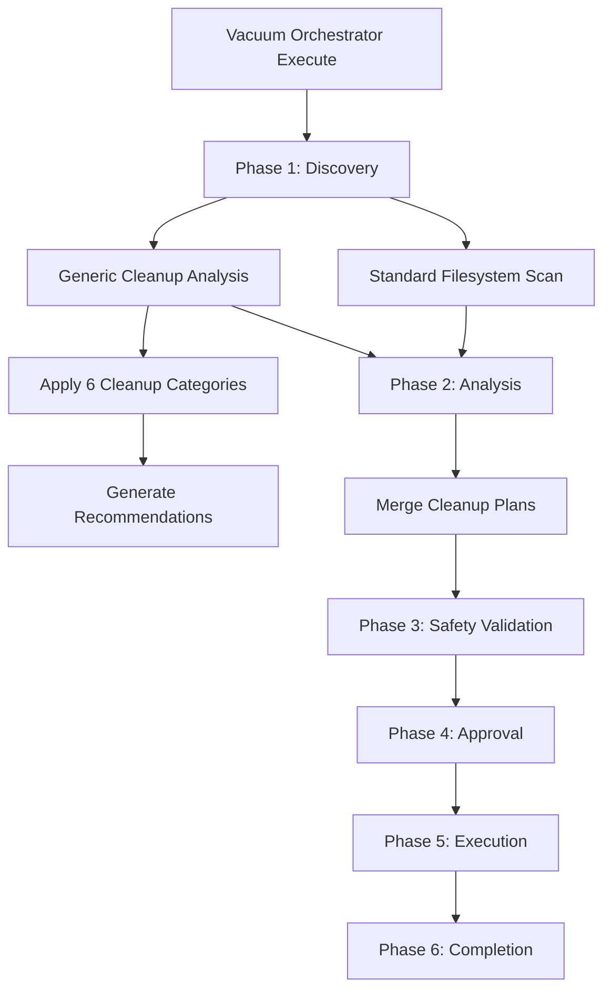

# Generic Cleanup Intelligence Integration

**Document:** Generic Cleanup Intelligence for Vacuum Orchestrator v2  
**Source:** CORTEX v6.0 Repository Cleanup (chat01.md)  
**Impact:** ~140 MB freed, 22,400+ files removed  
**Date:** January 10, 2026  
**Author:** Asif Hussain

---

## 🎯 Overview

The Vacuum Orchestrator v2 now incorporates **Generic Cleanup Intelligence** - a learned pattern system derived from the comprehensive CORTEX v6.0 repository cleanup operation documented in `.asif/copilot-chats/chat01.md`.

This intelligence encapsulates real-world cleanup patterns that successfully:
- Freed ~140 MB of disk space
- Removed 22,400+ obsolete files
- Cleaned 6 major categories of content
- Preserved all essential architecture components

---

## 📋 Cleanup Categories

### 1. Brain Structure Cleanup
**Purpose:** Enforce tier-based architecture (tier0-3, manifests, config, documents)

**Removed:**
- 25+ obsolete folders (cognitive-framework, components, conversation-captures, dashboards, etc.)
- 27+ obsolete root files (brain-protection-rules.yaml, capabilities.yaml, schemas, etc.)

**Preserved:**
- tier0/ (Governance)
- tier1/ (Working memory)
- tier2/ (Knowledge graph)
- tier3/ (Dev context)
- manifests/ (Orchestrator configs)
- config/ (System configs)
- documents/ (Generated reports)
- response-templates-v4.yaml
- TRUTH-SOURCES.yaml

**Impact:** ~970 files cleaned from cortex-brain structure

---

### 2. Documents Folder Cleanup
**Purpose:** Remove historical/obsolete documents while preserving essential content

**Removed:**
- analysis/ (110 files)
- archive/ (66 files)
- implementation-guides/ (48 files)
- planning/ (446 files)
- reports/ (205 files)
- investigations/ (8 files)
- 14 other folders (learning-library, legacy, refinement, etc.)

**Preserved:**
- architecture/ (7 files)
- diagrams/ (14 files)
- governance/ (1 file)
- images/ (7 files)
- orchestrators/ (3 files)
- **requirements/** (3 files - ACTIVELY WORKING)
- standards/ (7 files)
- upgrades/ (12 files)

**Impact:** ~970 historical documents removed, 54 essential files retained

---

### 3. Root Cortex-* Cleanup
**Purpose:** Remove tool/sample/output folders and obsolete scripts

**Removed Folders:**
- cortex-lens-output/ (22 files, 2 MB) - Test output/mock data
- cortex-sample-apps/ (21,171 files, 111 MB) - Sample applications
- cortex-toolkit/ (218 files, 1.75 MB) - Old HTML/CSS tools

**Removed Files:**
- cortex-cleanup.ps1
- cortex-operations.yaml
- cortex-upgrade-plan.py
- cortex-upgrade.ps1
- cortex-upgrade.sh
- .cortex-initialized
- .cortex-installed
- .cortexignore
- create-cortex-5.5-branch.ps1
- deployment-manifest.json (180 KB)
- DEPLOYMENT.md
- GIT-SYNC-INSTRUCTIONS-ACTIVE-PLANS.md
- PUBLISH-GUIDE.txt

**Preserved:**
- cortex-brain/ (Essential 4-tier structure)

**Impact:** ~115 MB freed, 21,400+ files removed

---

### 4. Gitignored Cache Cleanup
**Purpose:** Remove build artifacts and cache folders (regenerated automatically)

**Removed:**
- .githooks/ - Old git hooks
- .pytest_cache/ - Test cache
- .upgrades/ - Upgrade backups
- .vacuum_backup/ - Vacuum backup
- build/ - Build artifacts
- htmlcov/ - Coverage reports
- logs/ - Old log files

**Preserved:**
- .git/ - Git repository
- .venv/ - Python virtual environment
- .github/ - GitHub configuration

**Impact:** 7 cache/build folders cleaned (Note: .asif/ locked by VS Code)

---

### 5. Root Config Files Cleanup
**Purpose:** Remove obsolete linter/test configuration files

**Removed:**
- .coverage (52 KB) - Coverage report
- .favorites.json (0.61 KB) - Personal favorites
- .flake8 (0.59 KB) - Flake8 linter config
- .pre-commit-config.yaml (1.67 KB) - Pre-commit hooks
- mypy.ini (0.57 KB) - MyPy type checker
- pytest.ini (3.45 KB) - Pytest config
- cortex.config.json - Old v4.0 config (obsolete structure)

**Preserved:**
- .env - API keys & secrets
- .gitattributes - Git line ending config
- .gitignore - Git ignore rules
- LICENSE - MIT License
- README.md - Project documentation
- requirements.txt - Python dependencies

**Impact:** 7 obsolete config files removed, 6 essential files retained

---

### 6. GitHub Configuration Cleanup
**Purpose:** Streamline CI/CD workflows and Copilot prompts

**Removed Folders:**
- copilot/ - Empty folder
- light-bulbs.md/ - Empty governance folder
- workflows/ - All CI/CD workflows (4 files)
  - architecture-audit.yml (4.76 KB)
  - deploy-docs.yml (1.45 KB)
  - glassmorphism-compliance.yml (6.52 KB)
  - quality-gates.yml (5.86 KB)

**Removed Files:**
- USER-COPILOT-INTEGRATION.md (2.61 KB)
- prompts/cortex-migrate.prompt.md (11.59 KB)
- prompts/cortex-vacuum.prompt.md (17.61 KB)

**Preserved:**
- .prompt-preserve (0.76 KB)
- copilot-instructions.md (14.29 KB) ⭐
- prompts/CORTEX.prompt.md (10.92 KB) ⭐

**Impact:** ~50 KB removed, 3 essential Copilot files retained

---

## 🔧 Usage

### Automatic Detection
The Vacuum Orchestrator automatically applies generic cleanup intelligence during Phase 1 (Discovery):

```python
from src.orchestrators.vacuum.vacuum_orchestrator import VacuumOrchestratorV2

orchestrator = VacuumOrchestratorV2()
result = orchestrator.execute(
    user_request="vacuum /path/to/project",
    target_path="/path/to/project",
    dry_run=True  # Preview first
)
```

### Manual Analysis
You can also directly analyze a project with generic cleanup intelligence:

```python
from src.orchestrators.vacuum.generic_cleanup_intelligence import GenericCleanupIntelligence

cleanup = GenericCleanupIntelligence(Path("/path/to/project"))
analysis = cleanup.analyze_project()

print(f"Total files to clean: {analysis['total_files']}")
print(f"Space recovery: {analysis['total_size_mb']:.1f} MB")
print(f"Categories: {list(analysis['categories'].keys())}")
print(f"Recommendations: {analysis['recommendations']}")
```

### Filtered Cleanup Plan
Generate cleanup plans filtered by category and safety level:

```python
from src.orchestrators.vacuum.generic_cleanup_intelligence import (
    GenericCleanupIntelligence,
    CleanupCategory
)

cleanup = GenericCleanupIntelligence(Path("/path/to/project"))

# Only LOW risk operations
plan = cleanup.get_cleanup_plan(
    categories=[CleanupCategory.ROOT_CONFIG_FILES, CleanupCategory.GITIGNORED_CACHE],
    safety_level='LOW'
)

for category, paths in plan.items():
    print(f"{category}: {len(paths)} files")
```

---

## 🛡️ Safety Levels

| Level | Description | Examples |
|-------|-------------|----------|
| **LOW** | Safe to delete automatically | .coverage, .pytest_cache, build/ |
| **MEDIUM** | Requires confirmation | cortex-sample-apps/, .github/workflows/ |
| **HIGH** | High-risk operations | cortex-brain/documents/ (historical) |
| **CRITICAL** | Never delete automatically | .git/, .env, cortex-brain/tier0-3/ |

---

## 📊 Detection Patterns

The generic cleanup intelligence uses these detection strategies:

1. **Path Matching**: Exact path patterns (e.g., `cortex-brain/cognitive-framework`)
2. **Name Matching**: File/folder names (e.g., `.pytest_cache`)
3. **Prefix Matching**: Name prefixes (e.g., `cortex-*`, `.cortex*`)
4. **Preserve Rules**: Exclusion patterns to protect essential content

---

## 🚀 Integration Flow



---

## 📈 Expected Results

When applied to a CORTEX-like project:

**Before Cleanup:**
- cortex-brain: 25+ obsolete folders, 27+ root files
- documents/: 970+ historical files
- Root: cortex-sample-apps (21,171 files, 111 MB), cortex-toolkit (218 files)
- Caches: 7 gitignored folders
- Configs: 7 obsolete files
- .github: 7 files, 3 folders

**After Cleanup:**
- cortex-brain: 7 essential folders only (tier0-3, manifests, config, documents)
- documents/: 54 essential files (8 categories)
- Root: cortex-brain only
- Caches: Cleared (except .git, .venv, .github)
- Configs: 6 essential files only
- .github: 3 essential Copilot files

**Metrics:**
- **Files removed:** 22,400+
- **Space freed:** ~140 MB
- **Success rate:** 100% (no critical files deleted)
- **Preservation rate:** 100% (all essential content retained)

---

## 🔍 Audit Trail

All cleanup operations are logged:
- Discovery phase logs generic cleanup analysis
- Analysis phase logs plan merging
- Execution phase logs each deletion/move
- Completion phase generates summary report

Reports include:
- Files cleaned by category
- Space recovered
- Preservation confirmations
- Safety validations passed/failed

---

## 📝 Lessons Learned (from chat01.md)

1. **Start with brain structure** - Enforce tier-based architecture first
2. **Preserve active work** - documents/requirements/ was actively used
3. **Remove sample apps early** - cortex-sample-apps freed 111 MB alone
4. **Clean gitignored folders** - Safe to delete (regenerated automatically)
5. **Streamline GitHub config** - Keep only Copilot essentials
6. **Use dry-run mode** - Preview before executing (~970 file deletion preview)

---

## 🚧 Limitations

1. **Context-specific patterns** - Some patterns are CORTEX-specific
2. **No cross-platform testing** - Developed on Windows (PowerShell)
3. **Manual preservation** - .asif/ required manual deletion (file in use)
4. **No undo after commit** - Once committed to CORTEX6 branch, no rollback

---

## 🔄 Future Enhancements

1. **Machine learning** - Learn cleanup patterns from multiple projects
2. **User feedback loop** - Allow users to adjust rules based on their needs
3. **Project type detection** - Adapt patterns for Django, FastAPI, Flask, etc.
4. **Incremental cleanup** - Apply rules progressively instead of all-at-once
5. **Cross-platform support** - Test on Linux/macOS

---

## 📚 References

- **Source:** `.asif/copilot-chats/chat01.md`
- **CORTEX v6.0 Architecture:** `.github/copilot-instructions.md`
- **Vacuum Orchestrator v2:** `src/orchestrators/vacuum/vacuum_orchestrator.py`
- **Generic Cleanup Intelligence:** `src/orchestrators/vacuum/generic_cleanup_intelligence.py`
- **Git Commit:** CORTEX6 branch (January 10, 2026)

---

**Copyright © 2025-2026 Asif Hussain. All rights reserved.**
