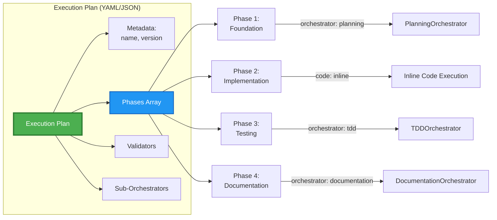
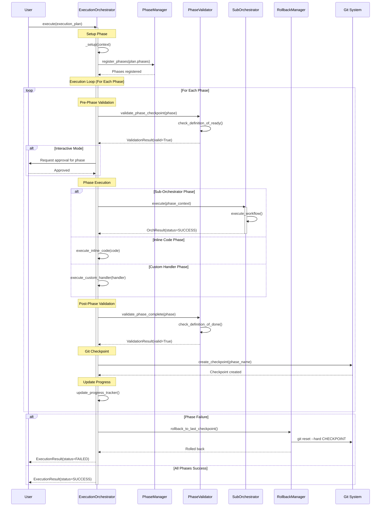
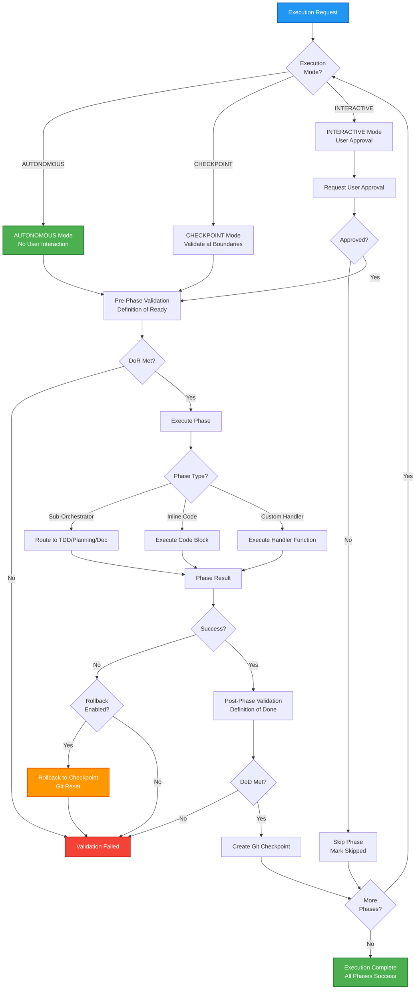

# Execution Orchestrator - Architecture Documentation

**Version:** 4.0.0  
**Author:** Asif Hussain  
**Created:** December 22, 2025  
**Status:** Production (Task 6.1 Complete)  
**LOC:** 445 | **Tests:** Unknown (needs verification) | **Coverage:** Unknown

---

## 🎯 Overview

The **Execution Orchestrator** is CORTEX's multi-phase workflow execution engine with adaptive execution modes, sub-orchestrator routing, and automatic rollback support. It coordinates complex workflows by breaking them into validated phases with checkpoints.

**Key Capabilities:**
- 🎯 **Multi-Phase Execution** - Dynamic phase registration from execution plans
- 🔄 **Sub-Orchestrator Routing** - Delegate to TDD, Planning, Documentation orchestrators
- ✅ **Validation Gates** - Pre/post-phase validation with DoR/DoD
- 🔙 **Rollback Support** - Automatic rollback on phase failures
- 📊 **Progress Tracking** - Visual feedback with phase status
- 🎛️ **Adaptive Execution Modes** - AUTONOMOUS, CHECKPOINT, INTERACTIVE

---

## 📐 System Architecture

### High-Level Component Overview

```mermaid
graph TB
    subgraph "Execution Orchestrator"
        EO[ExecutionOrchestrator<br/>445 LOC<br/>Phase Controller]
        PM[PhaseManager<br/>Phase Registry]
        PV[PhaseValidator<br/>Pre/Post Validation]
        RB[RollbackManager<br/>Failure Recovery]
        PT[ProgressTracker<br/>Visual Feedback]
    end
    
    subgraph "Sub-Orchestrators"
        TDD[TDDOrchestrator v4.0<br/>Test Workflow]
        PLAN[PlanningOrchestrator<br/>Feature Planning]
        DOC[DocumentationOrchestrator<br/>Doc Generation]
        SAN[SanitizationOrchestrator<br/>Code Sanitization]
    end
    
    subgraph "Execution Modes"
        AUTO[AUTONOMOUS<br/>No User Intervention]
        CKPT[CHECKPOINT<br/>Pause at Boundaries]
        INT[INTERACTIVE<br/>User Approval]
    end
    
    subgraph "External Systems"
        BO[BaseOrchestrator<br/>Foundation]
        GIT[Git System<br/>Checkpoints]
        TIER2[Tier 2 Brain<br/>State Persistence]
    end
    
    EO -->|registers| PM
    EO -->|validates| PV
    EO -->|on failure| RB
    EO -->|updates| PT
    
    EO -->|routes to| TDD
    EO -->|routes to| PLAN
    EO -->|routes to| DOC
    EO -->|routes to| SAN
    
    EO -->|mode: autonomous| AUTO
    EO -->|mode: checkpoint| CKPT
    EO -->|mode: interactive| INT
    
    EO -->|extends| BO
    RB -->|commits| GIT
    PT -->|stores| TIER2
    
    style EO fill:#4CAF50,stroke:#2E7D32,stroke-width:3px,color:#fff
    style TDD fill:#2196F3,stroke:#1565C0,stroke-width:2px,color:#fff
    style AUTO fill:#FF9800,stroke:#E65100,stroke-width:2px,color:#fff
```



### Execution Plan Structure



---

## 🔄 Execution Flow

### Multi-Phase Execution Sequence



### Adaptive Execution Mode Decision Flow



---

## 🏗️ Component Details

### 1. ExecutionOrchestrator (Core Controller)

**Responsibilities:**
- Parse and register phases from execution plans
- Coordinate phase execution with validation gates
- Route phases to appropriate sub-orchestrators
- Manage rollback on failures
- Track and report progress

**Key Methods:**
```python
class ExecutionOrchestrator(BaseOrchestrator):
    def execute(context: Dict) -> OrchestratorResult:
        """Main execution entry point"""
        # 1. Setup: Extract plan, workspace, validators
        # 2. Register phases from plan
        # 3. Execute phases sequentially with validation
        # 4. Handle failures with rollback
        # 5. Return results
    
    def _setup(context: Dict) -> None:
        """Extract execution plan and configuration"""
    
    def _register_phases() -> None:
        """Register phases from execution plan with PhaseManager"""
    
    def _execute_phase(phase_name: str, context: Dict) -> Dict:
        """Execute single phase with pre/post validation"""
    
    def _execute_sub_orchestrator(phase_def: Dict, context: Dict) -> Dict:
        """Route to sub-orchestrator (TDD, Planning, etc.)"""
    
    def _execute_inline_code(phase_def: Dict, context: Dict) -> Dict:
        """Execute inline code block"""
    
    def _rollback_phase(phase_name: str, context: Dict) -> None:
        """Rollback to last git checkpoint on failure"""
```

### 2. Execution Modes

**AUTONOMOUS Mode:**
- **Behavior:** Execute all phases without user intervention
- **Validation:** Automatic DoR/DoD checks
- **Failure Handling:** Auto-rollback if enabled
- **Use Case:** CI/CD pipelines, automated workflows

**CHECKPOINT Mode:**
- **Behavior:** Validate phase readiness before execution
- **Validation:** Manual DoR validation at boundaries
- **Failure Handling:** Pause for user decision
- **Use Case:** Complex migrations, risky operations

**INTERACTIVE Mode:**
- **Behavior:** Request user approval before each phase
- **Validation:** User confirms DoR/DoD met
- **Failure Handling:** User chooses rollback or continue
- **Use Case:** Learning, debugging, critical operations

### 3. Phase Definition Schema

**Execution Plan Structure (YAML/JSON):**
```yaml
name: "Feature Implementation Workflow"
version: "1.0"
execution_mode: "AUTONOMOUS"  # or CHECKPOINT, INTERACTIVE

phases:
  - name: "planning"
    description: "Generate feature plan"
    required: true
    orchestrator: "planning"  # Route to PlanningOrchestrator
    validator: "validate_planning_complete"
    
  - name: "implementation"
    description: "Implement feature code"
    required: true
    code: |
      # Inline code execution
      from src.feature import implement_feature
      result = implement_feature(context)
    
  - name: "testing"
    description: "Run TDD workflow"
    required: true
    orchestrator: "tdd"  # Route to TDDOrchestrator
    validator: "validate_tests_passing"
    
  - name: "documentation"
    description: "Generate documentation"
    required: false  # Optional phase
    orchestrator: "documentation"
    validator: "validate_docs_complete"

validators:
  validate_planning_complete: "src.validators.planning_validator"
  validate_tests_passing: "src.validators.test_validator"
  validate_docs_complete: "src.validators.doc_validator"

sub_orchestrators:
  planning: "src.orchestrators.planning.PlanningOrchestrator"
  tdd: "src.orchestrators.tdd.TDDOrchestrator"
  documentation: "src.orchestration_4_0.orchestrators.documentation.DocumentationOrchestrator"
```

### 4. Sub-Orchestrator Routing

**Supported Sub-Orchestrators:**

| Orchestrator | Route Key | Purpose |
|--------------|-----------|---------|
| **PlanningOrchestrator** | `planning` | Generate feature plans with complexity analysis |
| **TDDOrchestrator v4.0** | `tdd` | Execute RED→GREEN→REFACTOR workflow |
| **DocumentationOrchestrator** | `documentation` | Generate API docs and diagrams |
| **SanitizationOrchestrator** | `sanitization` | Remove company-specific data |

**Routing Logic:**
```python
def _execute_sub_orchestrator(phase_def: Dict, context: Dict) -> Dict:
    """Route to sub-orchestrator"""
    orchestrator_name = phase_def["orchestrator"]
    
    # Get orchestrator from registry
    orchestrator = self.sub_orchestrators.get(orchestrator_name)
    if not orchestrator:
        raise ValueError(f"Unknown orchestrator: {orchestrator_name}")
    
    # Prepare sub-context
    sub_context = {
        **context,
        "phase_name": phase_def["name"],
        "parent_execution_id": self.execution_id
    }
    
    # Execute sub-orchestrator
    result = orchestrator.execute(sub_context)
    
    return {
        "status": result.status,
        "orchestrator": orchestrator_name,
        "result": result.data
    }
```

### 5. Rollback Manager

**Rollback Strategies:**

| Trigger | Action | Recovery |
|---------|--------|----------|
| **Phase Validation Failure** | Rollback to phase start | Re-execute after fix |
| **Sub-Orchestrator Error** | Rollback to pre-phase checkpoint | Inspect logs, retry |
| **DoD Not Met** | Rollback to phase start | Complete remaining work |
| **User Cancellation** | Rollback to last checkpoint | Resume or abandon |

**Git Integration:**
```python
def _rollback_phase(phase_name: str, context: Dict) -> None:
    """Rollback to last git checkpoint"""
    checkpoint_tag = f"execution_{self.execution_id}_phase_{phase_name}_pre"
    
    # Git reset to checkpoint
    git_cmd = f"git reset --hard {checkpoint_tag}"
    subprocess.run(git_cmd, shell=True, check=True)
    
    # Restore Tier 2 Brain state
    self.brain.tier2.restore_snapshot(checkpoint_tag)
    
    self.logger.info(f"🔙 Rolled back to checkpoint: {checkpoint_tag}")
```

---

## 📊 Data Flow

### Input → Output Pipeline

```
Execution Plan (YAML/JSON)
    ↓
Phase Registration (PhaseManager)
    ↓
For Each Phase:
    ├─ Pre-Phase Validation (DoR)
    ├─ Phase Execution (Sub-Orch/Code/Handler)
    ├─ Post-Phase Validation (DoD)
    ├─ Git Checkpoint Creation
    └─ Progress Update
    ↓
Execution Results (Success/Failure)
    ├─ Phase Results
    ├─ Validation Results
    ├─ Checkpoint Tags
    └─ Error Logs (if any)
```

---

## 🎯 Integration Points

### BaseOrchestrator Integration

```python
class ExecutionOrchestrator(BaseOrchestrator):
    """Extends BaseOrchestrator for phase management"""
    
    # Inherits:
    # - PhaseManager (phase registration/execution)
    # - ErrorHandler (recovery strategies)
    # - ProgressTracker (visual feedback)
    # - Logging (structured logs)
```

### Sub-Orchestrator Protocol

**All sub-orchestrators must implement:**
```python
class SubOrchestrator(BaseOrchestrator):
    def execute(context: Dict) -> OrchestratorResult:
        """Execute orchestrator workflow"""
        # Return OrchestratorResult with:
        # - status: SUCCESS, FAILURE, PARTIAL
        # - data: Result data
        # - errors: Error messages
        # - metadata: Execution metadata
```

### Git Checkpoint Integration

**Checkpoint Naming Convention:**
```
execution_{execution_id}_phase_{phase_name}_{checkpoint_type}

Examples:
- execution_abc123_phase_planning_pre
- execution_abc123_phase_planning_post
- execution_abc123_phase_testing_pre
```

---

## 🚀 Performance Metrics

| Metric | Value | Target |
|--------|-------|--------|
| **Phase Registration** | <100ms | <200ms |
| **Phase Validation** | <500ms | <1s |
| **Git Checkpoint** | <500ms | <1s |
| **Sub-Orch Routing** | <50ms | <100ms |
| **Rollback Time** | <2s | <5s |
| **Progress Update** | <100ms | <200ms |
| **Max Phases Supported** | 50+ | 20+ |

---

## 🔮 Future Enhancements

**Phase 6 Enhancements (Task 6.12 - Planned):**
- **Multi-Agent Collaboration:** Sequential/parallel/nested agent patterns
- **Context Validation:** Auto-retrieval of missing context
- **Structured Output:** Pydantic schemas for phase results
- **Enhanced Guardrails:** Execution safety checks
- **Adaptive Execution Modes:** Dynamic mode switching based on risk

**Advanced Features:**
- **Parallel Phase Execution:** Execute independent phases concurrently
- **Conditional Phase Branching:** Dynamic phase selection based on results
- **Phase Dependency DAG:** Complex dependency management
- **Distributed Execution:** Multi-machine phase execution
- **Live Phase Injection:** Add phases to running execution

---

## 📝 Usage Examples

### Basic Multi-Phase Execution

```python
from src.orchestration_4_0.orchestrators.execution import ExecutionOrchestrator

orchestrator = ExecutionOrchestrator(
    logger=logger,
    config={"execution_mode": "AUTONOMOUS", "enable_rollback": True}
)

execution_plan = {
    "name": "Feature Implementation",
    "phases": [
        {"name": "planning", "orchestrator": "planning"},
        {"name": "testing", "orchestrator": "tdd"},
        {"name": "documentation", "orchestrator": "documentation"}
    ]
}

context = {
    "plan": execution_plan,
    "workspace": "/path/to/project",
    "feature_description": "Add user authentication"
}

result = orchestrator.execute(context)

# Result contains:
# - status: SUCCESS/FAILURE
# - phase_results: Results from each phase
# - checkpoints: Git checkpoint tags
# - errors: Any errors encountered
```

### Interactive Mode Execution

```python
# User approval required before each phase
orchestrator = ExecutionOrchestrator(
    logger=logger,
    config={"execution_mode": "INTERACTIVE"}
)

result = orchestrator.execute(context)
# Prompts user:
# "Execute phase 'planning'? (y/n)"
# "Execute phase 'testing'? (y/n)"
# ...
```

### Custom Phase Validators

```python
def validate_tests_passing(context: Dict) -> bool:
    """Custom phase validator"""
    test_results = context.get("test_results", {})
    passing = test_results.get("passing", 0)
    total = test_results.get("total", 0)
    return passing == total and total > 0

context = {
    "plan": execution_plan,
    "validators": {
        "validate_tests_passing": validate_tests_passing
    }
}

result = orchestrator.execute(context)
```

---

## 🔗 Related Documentation

- **Task 6.1 Completion:** `cortex-brain/documents/planning/active/CORTEX-3.0-4.0/CORTEX4-STATUS.md`
- **BaseOrchestrator:** `src/orchestration_4_0/base/base_orchestrator.py`
- **PhaseManager:** `src/orchestration_4_0/base/phase_manager.py`
- **Planning Orchestrator:** `docs/architecture/planning-system-core-architecture.md`
- **TDD Orchestrator:** `docs/architecture/tdd-orchestrator-v4-architecture.md` (to be created)
- **Documentation Orchestrator:** `docs/architecture/documentation-orchestrator-architecture.md`

---

**Migration Notes:**
- Task 6.1 complete (December 20, 2025)
- 445 LOC implementation
- Extends BaseOrchestrator for phase management
- Git checkpoint integration complete
- Rollback support operational

**Status:** ✅ **PRODUCTION READY** (Task 6.1 Complete)
