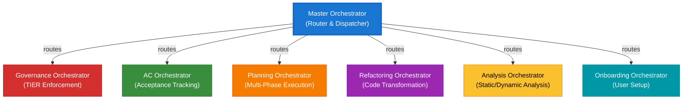

# Orchestrator-Module Reference Matrix

> **Summary:** Quick reference table of all orchestrators and their module dependencies  
> **Authority:** cortex/orchestrators/ + cortex/ modules | **Last Updated:** 2026-01-22

---

## Orchestrators Overview



---

## Orchestrator × Module Dependency Matrix

| Orchestrator | Governance<br/>Registry | State<br/>Manager | Audit<br/>Logger | Knowledge<br/>Repository | Intent<br/>Router | AST<br/>Analyzer | Git<br/>Navigator | Description |
|---|:---:|:---:|:---:|:---:|:---:|:---:|:---:|---|
| **Master Orchestrator** | ✓ | ✓ | ✓ | | ✓ | | | Central hub: routes intents to domain orchestrators |
| **Governance Orchestrator** | ✓ | ✓ | ✓ | ✓ | | | | Enforces TIER 0-3 rules, validates all operations |
| **AC Orchestrator** | ✓ | ✓ | ✓ | ✓ | | | | Tracks feature acceptance criteria and readiness |
| **Planning Orchestrator** | ✓ | ✓ | ✓ | ✓ | | | | Coordinates multi-phase execution with dependencies |
| **Refactoring Orchestrator** | ✓ | ✓ | ✓ | ✓ | ✓ | ✓ | ✓ | Code transformation with safety checks |
| **Analysis Orchestrator** | ✓ | | ✓ | ✓ | ✓ | ✓ | | Static/dynamic code analysis |
| **Onboarding Orchestrator** | ✓ | ✓ | ✓ | ✓ | | | | User setup and preference management |

**Legend:** ✓ = Direct dependency (module called frequently)

---

## Orchestrator Profiles

### Master Orchestrator

**Location:** `cortex/orchestrators/core/master_orchestrator.py`

**Role:** Central orchestration hub. Receives user intents, classifies them, validates governance, routes to appropriate domain orchestrators.

**Modules Used (4):**
1. **Intent Router** — Classify intent into categories (REFACTORING, ANALYSIS, PLANNING, GOVERNANCE, ONBOARDING)
2. **Governance Registry** — Check user permissions for the classified intent
3. **State Manager** — Save routing decision and request state
4. **Audit Logger** — Log routing decision with confidence and alternatives

**Key Methods:**
- `route_intent(intent, context)` → Returns domain orchestrator + params
- `validate_permissions(intent_type)` → Returns bool
- `log_routing_decision(intent, routed_to, confidence)`

---

### Governance Orchestrator

**Location:** `cortex/orchestrators/domain/governance_orchestrator.py`

**Role:** Enforces TIER 0-3 governance rules. Acts as policy enforcement point.

**Modules Used (4):**
1. **Governance Registry** — Load and evaluate TIER 0-3 rules
2. **Knowledge Repository** — Query best practices for interpreting rules
3. **Audit Logger** — Log each rule evaluation with pass/fail rationale
4. **State Manager** — Persist governance state and decisions

**Key Methods:**
- `validate_operation(operation, context)` → Returns APPROVED/BLOCKED with reason
- `evaluate_tier_rules(tier_level, context)` → Returns rule evaluations
- `log_governance_decision(operation, decision, rationale)`

**Enforces:**
- TIER 0: Immutable security & audit rules
- TIER 1: Domain-specific acceptance criteria
- TIER 2: Response templates and standards
- TIER 3: Runtime knowledge and context

---

### AC Orchestrator

**Location:** `cortex/orchestrators/domain/ac_orchestrator.py`

**Role:** Tracks feature acceptance criteria. Validates readiness for shipping.

**Modules Used (4):**
1. **Governance Registry** — Load AC-related TIER 1 rules (acceptance criteria)
2. **State Manager** — Retrieve test results and completion status
3. **Knowledge Repository** — Query domain-specific AC checklists
4. **Audit Logger** — Log each criterion's pass/fail status

**Key Methods:**
- `check_feature_readiness(feature_name)` → Returns readiness report
- `evaluate_acceptance_criteria(feature_context)` → Returns criteria results
- `get_blocker_list()` → Returns incomplete criteria preventing ship

**Evaluates:**
- Unit test coverage thresholds
- Security review completion
- Documentation completeness
- Code review sign-offs
- Integration test passes

---

### Planning Orchestrator

**Location:** `cortex/orchestrators/domain/planning_orchestrator.py`

**Role:** Orchestrates multi-phase execution plans with dependency resolution.

**Modules Used (4):**
1. **State Manager** — Track phase progression, create checkpoints, enable rollback
2. **Knowledge Repository** — Query execution patterns and best practices
3. **Governance Registry** — Validate each phase complies with rules
4. **Audit Logger** — Log phase transitions and decisions

**Key Methods:**
- `create_execution_plan(request)` → Returns phased plan
- `execute_phase(phase_num)` → Executes single phase
- `rollback_to_checkpoint(checkpoint_id)` → Recovery from failure

**Phase Structure:**
- Phase 1: Analysis (gather requirements, identify risks)
- Phase 2: Planning (break into tasks, estimate, assign)
- Phase 3: Execution (run tasks, monitor progress)
- Phase 4: Verification (validate results, collect feedback)

---

### Refactoring Orchestrator

**Location:** `cortex/orchestrators/domain/refactoring_orchestrator.py`

**Role:** Coordinates code refactoring with safety checks and version control integration.

**Modules Used (7):** ⭐ Most complex orchestrator

1. **Intent Router** — Classify refactoring type (extract method, rename, etc.)
2. **AST Analyzer** — Parse code structure, find dependencies, ensure safety
3. **Git Navigator** — Get change history, identify affected branches
4. **Knowledge Repository** — Query refactoring patterns and best practices
5. **Governance Registry** — Validate refactoring against coding standards
6. **State Manager** — Create checkpoints before/after each step
7. **Audit Logger** — Log refactoring decisions and changes

**Key Methods:**
- `plan_refactoring(request)` → Returns refactoring plan with safety analysis
- `execute_refactoring(plan)` → Applies transformation with checkpoints
- `validate_safety(plan)` → Returns safety assessment

**Refactoring Types:**
- Extract method/class
- Rename variable/function/class
- Inject dependency
- Remove dead code
- Convert to design pattern

---

### Analysis Orchestrator

**Location:** `cortex/orchestrators/domain/analysis_orchestrator.py`

**Role:** Performs static/dynamic code analysis and generates insights.

**Modules Used (5):**
1. **Intent Router** — Classify analysis type (performance, security, complexity, duplication)
2. **AST Analyzer** — Perform code structure and pattern analysis
3. **Knowledge Repository** — Query analysis heuristics and thresholds
4. **Audit Logger** — Log findings and recommendations
5. **Governance Registry** — Validate analysis findings against standards

**Key Methods:**
- `analyze_code(file_or_module, analysis_type)` → Returns analysis report
- `identify_vulnerabilities(code)` → Returns security findings
- `measure_complexity()` → Returns complexity metrics
- `detect_duplication()` → Returns duplicate code blocks

**Analysis Types:**
- **Security:** Hardcoded secrets, SQL injection, insecure crypto, auth bypass
- **Performance:** N+1 queries, inefficient loops, memory leaks
- **Complexity:** Cyclomatic complexity, cognitive complexity, function size
- **Duplication:** Code clones, similar algorithms

---

### Onboarding Orchestrator

**Location:** `cortex/orchestrators/domain/onboarding_orchestrator.py`

**Role:** Guides users through setup and maintains state across onboarding phases.

**Modules Used (4):**
1. **State Manager** — Track onboarding progress, save preferences
2. **Knowledge Repository** — Provide context-specific guidance
3. **Governance Registry** — Validate onboarding complies with org policies
4. **Audit Logger** — Log user journey and decisions

**Key Methods:**
- `start_onboarding(user_id)` → Begins guided setup
- `progress_to_next_step()` → Advances through phases
- `save_user_preferences(config)` → Persists user settings
- `complete_onboarding()` → Finalizes setup

**Onboarding Phases:**
1. Environment setup (Python, Git, IDE configuration)
2. CORTEX module installation
3. Configuration (API keys, auth setup)
4. Tutorial walkthrough
5. First workflow execution
6. Feedback collection

---

## Core Modules Overview

### Governance Registry

**Location:** `cortex/core/governance/governance_registry.py`

**Responsibility:** Load and evaluate TIER 0-3 governance rules.

**Key Methods:**
- `get_tier_rules(tier_level)` → Returns rules for tier
- `evaluate_rule(rule_id, context)` → Returns PASS/FAIL with reason
- `can_user_execute(user, action)` → Permission check
- `validate_against_standard(standard_id, target)` → Compliance check

**Data Model:**
```
Rule {
  id: "CORE-017",
  tier: 0,
  title: "Governance enforcement",
  description: "Every operation must validate against TIER 0 rules",
  enforcement: "BLOCK",
  severity: "CRITICAL"
}
```

---

### State Manager

**Location:** `cortex/core/state/state_manager.py`

**Responsibility:** Track multi-step progress, create checkpoints, enable recovery.

**Key Methods:**
- `create_checkpoint(name)` → Saves current state
- `save_state(key, value)` → Persists data
- `load_state(key)` → Retrieves data
- `rollback_to_checkpoint(checkpoint_id)` → Restore to checkpoint
- `list_checkpoints()` → Get all saved checkpoints

**Checkpoint Model:**
```
Checkpoint {
  id: "uuid-12345",
  orchestrator: "RefactoringOrchestrator",
  phase: "phase_2_complete",
  timestamp: "2026-01-22T14:30:00Z",
  state: {...state snapshot...},
  hash: "sha256:abc123..."
}
```

---

### Audit Logger

**Location:** `cortex/core/audit/audit_logger.py`

**Responsibility:** Maintain hash-chain audit trail for compliance.

**Key Methods:**
- `log_decision(decision_type, context, result)` → Log with full context
- `log_phase_complete(phase, results)` → Log milestone
- `get_full_timeline()` → Retrieve complete history
- `verify_integrity()` → Check hash chain validity

**Audit Entry Model:**
```
AuditEntry {
  id: "uuid-67890",
  timestamp: "2026-01-22T14:30:00Z",
  actor: "user@example.com",
  action: "ROUTING_DECISION",
  details: {...decision details...},
  hash: "sha256:def456...",
  previous_hash: "sha256:abc123..."  // Hash chain
}
```

---

### Knowledge Repository

**Location:** `cortex/knowledge/knowledge_repository.py`

**Responsibility:** Query domain best practices, patterns, and standards.

**Key Methods:**
- `get_pattern(pattern_name)` → Returns implementation pattern
- `get_checklist(domain, type)` → Returns domain-specific checklist
- `get_best_practices(topic)` → Returns best practice guide
- `get_threshold(metric_name)` → Returns metric thresholds (e.g., coverage minimum)

**Data Model:**
```
Pattern {
  id: "di_pattern",
  name: "Dependency Injection",
  domain: "python",
  description: "...",
  pitfalls: [...],
  codeExamples: [...],
  relatedPatterns: [...]
}
```

---

### Intent Router

**Location:** `cortex/core/intent_router/intent_router.py`

**Responsibility:** Classify user intent into discrete categories.

**Key Methods:**
- `classify_intent(text, context)` → Returns Intent(category, confidence, alternatives)
- `get_intent_confidence(intent)` → Returns confidence score (0-1)
- `suggest_corrections(intent)` → Returns suggested clarifications

**Intent Model:**
```
Intent {
  category: "REFACTORING",
  confidence: 0.89,
  reasoning: "Keywords: 'refactor', 'refactoring', 'change structure'",
  alternatives: [
    {category: "ANALYSIS", confidence: 0.08},
    {category: "PLANNING", confidence: 0.03}
  ]
}
```

---

### AST Analyzer

**Location:** `cortex/tools/ast_analyzer.py`

**Responsibility:** Parse and analyze code structure (Abstract Syntax Tree).

**Key Methods:**
- `analyze_file(file_path)` → Returns code structure
- `find_dependencies(class_or_function)` → Returns dependency list
- `measure_complexity(function)` → Returns complexity metrics
- `identify_patterns(code)` → Returns design pattern matches
- `check_for_vulnerabilities(code)` → Returns security issues

**Analysis Model:**
```
CodeAnalysis {
  file: "authentication.py",
  classes: [
    {
      name: "AuthService",
      methods: 15,
      dependencies: ["database", "crypto", "logging"],
      complexity: {cyclomatic: 8, cognitive: 12}
    }
  ],
  vulnerabilities: [
    {type: "hardcoded_secret", line: 42}
  ]
}
```

---

### Git Navigator

**Location:** `cortex/tools/git_navigator.py`

**Responsibility:** Integrate with version control.

**Key Methods:**
- `get_change_history(file_path, limit)` → Returns commit history
- `get_affected_files(commit_range)` → Returns files changed
- `get_current_branch()` → Returns active branch
- `create_branch(name)` → Creates new branch
- `stage_changes(files)` → Stages changes for commit

**Git Integration Model:**
```
ChangeHistory {
  file: "authentication.py",
  commits: [
    {
      hash: "abc123",
      author: "user@example.com",
      date: "2026-01-22T10:00:00Z",
      message: "Add OAuth support",
      changes: {added: 50, removed: 20}
    }
  ]
}
```

---

## Module Call Patterns

### Pattern 1: Validation Before Execution

```python
# Used by: All orchestrators
def execute_operation(operation):
    # 1. Validate governance
    if not governance_registry.can_execute(operation):
        return ERROR("Governance blocked")
    
    # 2. Create checkpoint
    checkpoint = state_manager.create_checkpoint()
    
    # 3. Execute
    result = do_work(operation)
    
    # 4. Log
    audit_logger.log_operation(operation, result)
    
    return result
```

---

### Pattern 2: Phased Execution

```python
# Used by: Planning orchestrator
def execute_phases(plan):
    for phase in plan.phases:
        # 1. Check prerequisites
        if not phase.prerequisites_met():
            return ERROR("Phase prerequisites not met")
        
        # 2. Create checkpoint
        checkpoint = state_manager.create_checkpoint(phase.name)
        
        # 3. Execute phase
        try:
            result = execute_phase(phase)
            audit_logger.log_phase_complete(phase, result)
        except Exception as e:
            state_manager.rollback_to_checkpoint(checkpoint)
            return ERROR(f"Phase failed: {e}")
    
    return SUCCESS()
```

---

### Pattern 3: Analysis Pipeline

```python
# Used by: Analysis & Refactoring orchestrators
def analyze_code(code):
    # 1. Classify analysis type
    intent = intent_router.classify(code)
    
    # 2. Analyze structure
    analysis = ast_analyzer.analyze(code)
    
    # 3. Query best practices
    patterns = knowledge_repository.get_patterns(intent.category)
    
    # 4. Check against standards
    governance_registry.validate_against_standard("coding_standards", analysis)
    
    # 5. Log findings
    audit_logger.log_analysis(analysis)
    
    return analysis
```

---

## See Also

- [Orchestrators and Modules Relationship](08-orchestrators-modules-relationship.md) — Detailed workflow examples
- [Master Orchestrator](01-master-orchestrator.md) — Central hub architecture
- [Infrastructure Modules](../12-infrastructure/00-infrastructure-index.md) — Core module implementations
- [Governance Framework](../01-cortex-brain/01-tier0-governance.md) — TIER 0-3 rules
- [Source: cortex/orchestrators/](../../../cortex/orchestrators/)

---

**Author:** CORTEX Documentation Engine  
**Generated:** 2026-01-22  
