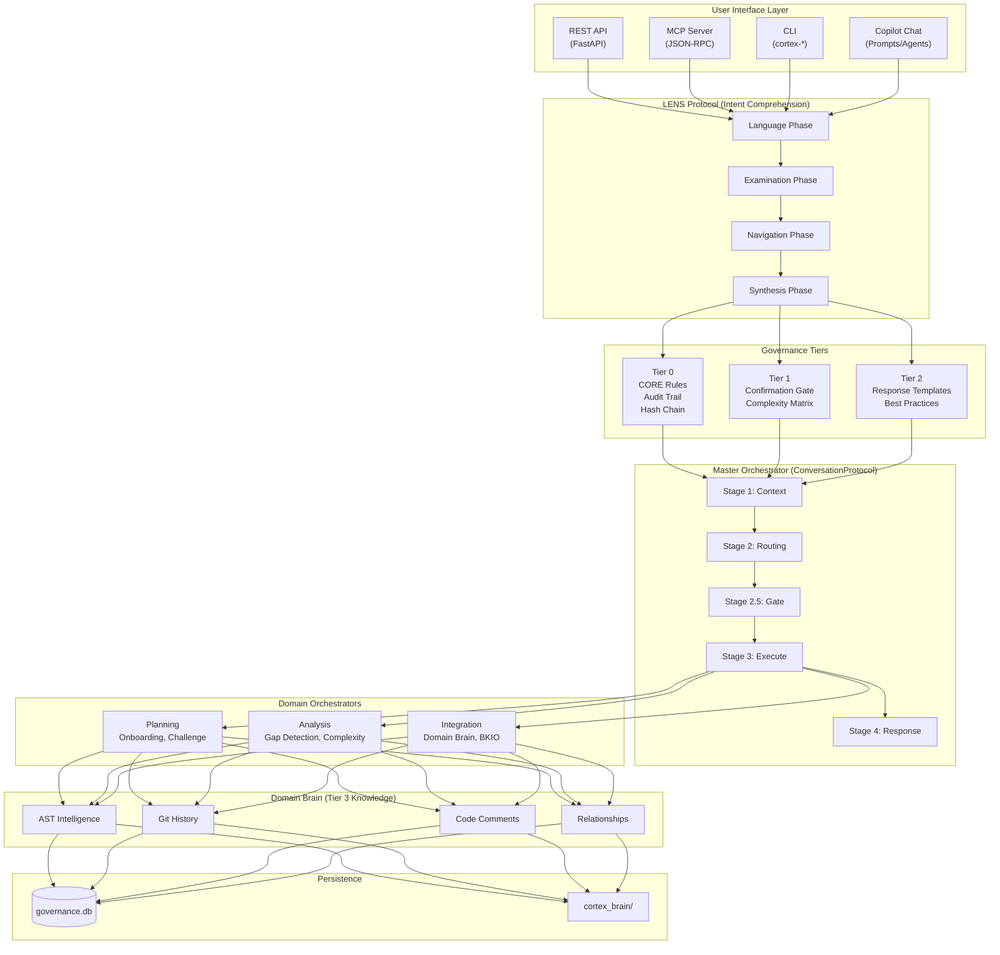
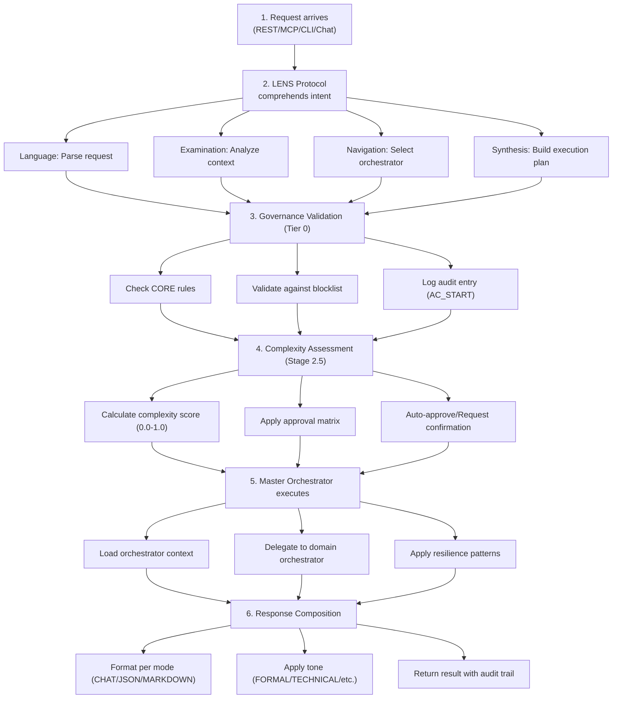
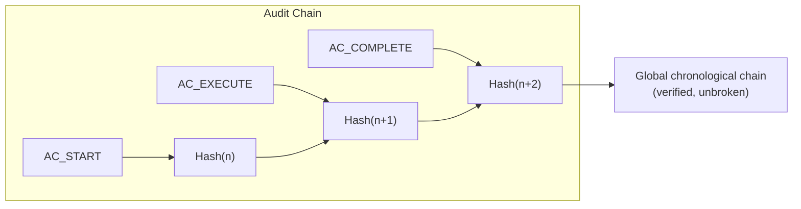
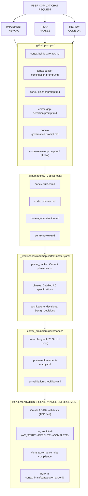
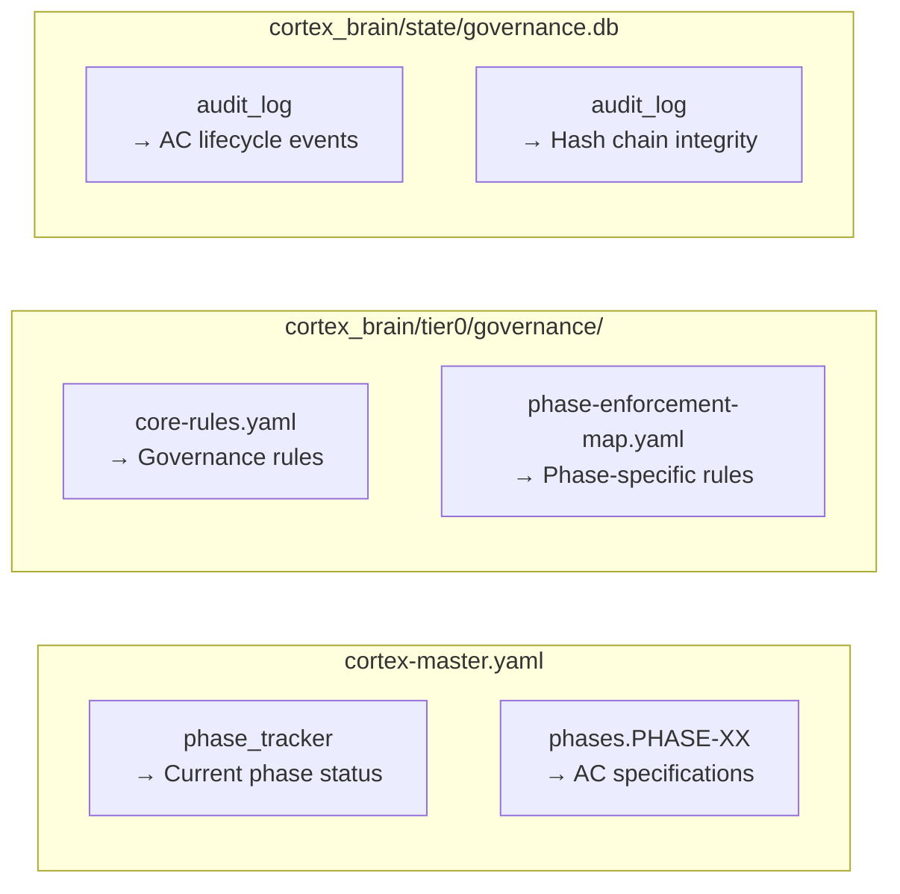
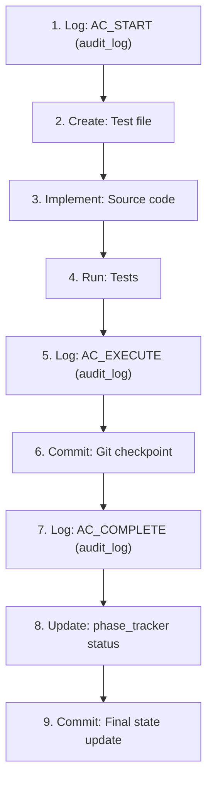
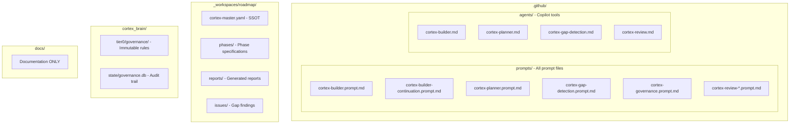

# CORTEX System Architecture

**Last Updated:** 2026-01-20  
**Audience:** Architects, Senior Developers  
**Prerequisites:** None

## Overview

CORTEX is an AI-powered development orchestration platform that provides intelligent coordination of business processes through a multi-tier governance architecture. The system combines advanced intent comprehension (LENS Protocol), domain knowledge management (Domain Brain), and resilience-first patterns to enable safe, auditable AI-assisted development.

### Implementation Status (2026-01-20)

| Dimension | Status | Details |
|-----------|--------|---------|
| **Core Architecture** | ✅ Complete | 22 phases implemented, locked in governance.db |
| **Test Coverage** | ✅ Comprehensive | 3000+ tests, 257+ unique AC IDs, 100% pass rate |
| **Python Codebase** | ✅ Consolidated | 413 modules in canonical `cortex/` package |
| **REST API** | ✅ Functional | All endpoints implemented and tested |
| **MCP Server** | ⚠️ Partial | Tool discovery & schema ✅, tool implementations ⏳ (14 stubs) |
| **Governance Rules** | ⚠️ Partial | Tier 0 ✅, Tier 1-2 🔲, core-rules.yaml pending |
| **LENS Protocol** | ✅ Complete | 4-phase intent comprehension fully implemented |
| **Domain Brain** | ✅ Complete | AST, Git, Comments, Relationships adapters functional |

**Note:** See [MCP Protocol Status](../../03-api-reference/mcp-protocol/0-specification.md) and [Known Issues](../../05-reference/known-issues.md) for details on partial implementations.

## System Architecture Diagram



## Core Components

### 1. User Interface Layer

CORTEX exposes functionality through multiple interfaces:

| Interface | Protocol | Use Case | Implementation |
|-----------|----------|----------|----------------|
| **REST API** | HTTP/JSON | External integrations, web UIs | FastAPI (`cortex/api/`) |
| **MCP Server** | JSON-RPC 2.0 | AI-native tool discovery | `src/mcp/server_sdk.py` |
| **CLI** | Command-line | Developer workflows, automation | `cortex/tools/` |
| **Copilot Chat** | Prompt-based | Interactive AI assistance | `.github/prompts/` |

### 2. LENS Protocol (Intent Comprehension)

The LENS Protocol provides deep intent understanding through four phases:

| Phase | Purpose | Output |
|-------|---------|--------|
| **L**anguage | Parse natural language intent | Structured intent representation |
| **E**xamination | Analyze code context | AST analysis, dependency mapping |
| **N**avigation | Route to appropriate orchestrator | Orchestrator selection + confidence score |
| **S**ynthesis | Combine insights for action | Execution plan with validation |

**Implementation:** `src/core/knowledge/*.py`, completed in PHASE-07-INTENT-ROUTER

### 3. Multi-Tier Governance

CORTEX enforces governance through a tiered rule system:

| Tier | Mutability | Purpose | Example Rules |
|------|------------|---------|---------------|
| **Tier 0** | Immutable | Core safety rules | CORE-008 (TDD), CORE-027 (Audit Trail) |
| **Tier 1** | Architectural | System-level constraints | CONF-GATE-001 (Auto-approval threshold) |
| **Tier 2** | Standards | Quality patterns | Response templates, formatting |
| **Tier 3** | Knowledge | Domain facts | Business rules, domain relationships |

**Rule Location:** `cortex_brain/tier0/governance/core-rules.yaml` (29 CORE rules implemented)

### 4. Master Orchestrator

The Master Orchestrator coordinates all CORTEX operations through the ConversationProtocol:

| Stage | Function | Components |
|-------|----------|------------|
| **Stage 1** | Context Building | HolisticContextBuilder |
| **Stage 2** | Intent Routing | LENS Protocol integration |
| **Stage 2.5** | Complexity Gate | Approval matrix evaluation |
| **Stage 3** | Execution | Domain orchestrator delegation |
| **Stage 4** | Response Composition | Multi-mode formatting |

**Key Innovation:** ContinuationDecision pattern replaces imperative loops with explicit, testable turn-by-turn execution.

### 5. Domain Brain

Centralized knowledge management with multiple intelligence sources:

| Adapter | Source | Data Extracted |
|---------|--------|----------------|
| **AST Adapter** | Source code | Functions, classes, imports |
| **Git Adapter** | Git history | Change patterns, authors |
| **Comments Adapter** | Code comments | Intent, TODOs, documentation |
| **Relationships Adapter** | Code analysis | Dependencies, call graphs |
| **BKIO** | Business docs | Business rules, constraints |

**Implementation:** PHASE-17-DOMAIN-BRAIN (12 ACs, 353 tests passing)

## Completed Capabilities (Verified)

Based on `cortex-master.yaml` phase_tracker:

| Phase | Capability | Status | Test Count |
|-------|------------|--------|------------|
| PHASE-05 | Production Hardening & Security | ✅ LOCKED | 45 |
| PHASE-06 | Brittleness Prevention | ✅ LOCKED | - |
| PHASE-07 | Orchestrator Ecosystem & Brain | ✅ LOCKED | 1200 |
| PHASE-07-INTENT-ROUTER | LENS Protocol & Knowledge Graph | ✅ LOCKED | 400+ |
| PHASE-08 | Domain Orchestrator Framework | ✅ LOCKED | 161 |
| PHASE-09 | Developer Governance Tooling | ✅ LOCKED | 133 |
| PHASE-10 | Adaptive Execution | ✅ LOCKED | 106 |
| PHASE-11 | Hallucination Prevention | ✅ LOCKED | 160 |
| PHASE-12 | Knowledge Ecosystem | ✅ LOCKED | 243 |
| PHASE-13 | Observability & Business Domain | ✅ LOCKED | 141 |
| PHASE-15 | Universal Dashboard | ✅ LOCKED | 48 |
| PHASE-16 | Orchestrator Continuation | ✅ LOCKED | 155 |
| PHASE-17 | Domain Brain | ✅ LOCKED | 353 |
| PHASE-18 | Orchestrator DevX | ✅ LOCKED | 135 |
| PHASE-19 | Template Tool Implementation | ✅ LOCKED | 89 |
| PHASE-20 | Template Content | ✅ LOCKED | 68 |
| PHASE-22 | MCP Protocol Compliance | ✅ LOCKED | - |
| PHASE-23 | Complexity-Aware Confirmation | ✅ LOCKED | - |
| PHASE-24 | Response Composition | ✅ LOCKED | 172 |
| PHASE-25 | Governance Composition | ✅ LOCKED | 183 |

**Total Tests Passing:** 3000+ (100% pass rate)

## Data Flow

### Request Processing Flow



### Audit Trail Flow

Every operation is logged with tamper-evident hash chain:



**Audit Database:** `cortex_brain/state/governance.db` (SQLite, 5000+ entries)

## Integration Points

| Component | Integrates With | Protocol |
|-----------|-----------------|----------|
| REST API | External systems | HTTP/JSON |
| MCP Server | Claude Desktop, VS Code | JSON-RPC 2.0 |
| Domain Brain | Orchestrators | Python API |
| Governance | All components | Rule validation |
| Telemetry | Analytics systems | Batch events |

## Related Documentation

- [Design Principles](2-design-principles.md) - Core design philosophy
- [Orchestration Engine](3-orchestration-engine.md) - Orchestrator lifecycle
- [Domain Brain](4-domain-brain.md) - Knowledge management
- [Resilience Patterns](5-resilience-patterns.md) - Failure handling
- [Implementation Phases](6-implementation-phases.md) - Complete phase reference with test coverage
- [MCP Protocol](../03-api-reference/mcp-protocol/0-specification.md) - MCP integration
- [Governance Rules](../05-reference/compliance-mappings.md) - Rule reference

---

## Prompt & Agent Architecture

### User Flow Diagram



---

## Prompt Selection Matrix

| Scenario | Prompt | Agent |
|----------|--------|-------|
| **Start new AC-ID** | cortex-builder.prompt.md | cortex-builder.md |
| **Resume session** | cortex-builder-continuation.prompt.md | (no agent) |
| **Plan next phase** | cortex-planner.prompt.md | cortex-planner.md |
| **Check readiness** | cortex-planner.prompt.md | cortex-planner.md |
| **Find quality issues** | cortex-review-*.prompt.md | cortex-review.md |
| **Detect gaps** | cortex-gap-detection.prompt.md | cortex-gap-detection.md |
| **Verify compliance** | cortex-governance.prompt.md | cortex-review.md |

---

## Session Lifecycle

### Session 1: Start New Phase

```
1. User: "Start PHASE-15"
   → Load: cortex-planner.prompt.md
   → Check: Dependencies met, phase locked=false
   → Display: Phase spec + readiness table

2. User: "Implement AC-1501"
   → Load: cortex-builder.prompt.md
   → Check: Phase not locked, governance rules loaded
   → Execute: TDD → Implement → Audit → Commit
   → Display: AC status table

3. User: "Review code quality"
   → Load: cortex-review-*.prompt.md
   → Check: SKULL rules, brittleness, assumptions, etc
   → Display: Findings table
```

### Session 2: Resume (Hours Later)

```
1. User: "Continue where we left off"
   → Load: cortex-builder-continuation.prompt.md
   → Query: Last AC-ID, last commit, phase status
   → Display: 5-second resumption status table (NO context dump)
   → Ready: Start next AC-ID immediately

2. User: "Status"
   → Load: cortex-planner.prompt.md
   → Display: Current phase, progress (5/14 ACs), next action
```

---

## Data Flow

### Read Operations (No Side Effects)



### Write Operations (With Audit Trail)



---

## Output Format Consistency

### All Prompts Follow This Pattern

```
## [SECTION TITLE]

✅ **Key Finding:** One-liner
• Detail (bullet 1)
• Detail (bullet 2)

| Table | Heading | When | Appropriate |
|-------|---------|------|-------------|
| Use | tables | for | multi-row |

**Next Action:** Single clear sentence
```

### Response Examples

**Example 1: Status Check**
```
PHASE-07: Ecosystem (24 ACs)
├─ Status: IN_PROGRESS
├─ Progress: 18/24 ACs (75%)
├─ Locked: false
└─ Recommendation: PROCEED with remaining ACs
```

**Example 2: Governance Check**
```
AC-007-003: GOVERNANCE COMPLIANCE

✅ CORE-008 (TDD) - Tests created before code
✅ CORE-011 (Types) - All functions typed
✅ CORE-012 (Docstrings) - Google-style docs present
⚠️  CORE-028 (Naming) - File name 31 chars (exceeds 25)

Action Required: Rename file to ≤25 chars before phase lock
```

**Example 3: Session Resumption**
```
═══════════════════════════════════════════════════════════════
║ SESSION RESUMPTION STATUS                                    ║
╠═══════════════════════════════════════════════════════════════╣
║ Phase: PHASE-15-NEURAL-OBSERVATORY                           ║
║ Status: IN_PROGRESS | 3/16 ACs completed (19%)              ║
║ Last Activity: AC-015-003 completed (4h ago)                ║
║ Last Commit: [abc1234] - "AC-015-003: complete"            ║
║ Next Action: AC-015-004 (ready to start)                   ║
╚═══════════════════════════════════════════════════════════════╝

→ Ready to implement AC-015-004
```

---

## Command Reference

### Universal Commands (All Prompts)

```
/status <phase>              → Show phase status
/next                        → Show next ready action
/readiness <phase>           → Check prerequisites
/audit <phase|ac-id>         → Show audit trail
/governance-check <phase>    → Verify SKULL compliance
/blockers                    → Show blocking issues
```

### Builder Specific

```
/implement <phase>           → Start implementing phase
/lock <phase>                → Mark phase complete
/checkpoint <message>        → Create git checkpoint
/audit-trail                 → Query governance.db
```

### Planner Specific

```
/plan                        → Show implementation plan
/progress                    → Show completion progress
/dependencies <ac-id>        → Show dependency graph
```

### Reviewer Specific

```
/gaps                        → Find design-build gaps
/compliance <phase>          → Compliance report
/violations <phase>          → Violations by severity
/assumptions                 → Hidden assumptions
/brittleness                 → Structural weaknesses
/debt                        → Technical debt
/hallucinations              → False claims
```

---

## File Organization



---

## Governance Rules Consolidated

All prompts include quick reference to critical SKULL rules:

| Rule | Category | Check |
|------|----------|-------|
| CORE-001 | Incremental | <500 lines/turn |
| CORE-008 | TDD | Tests before code |
| CORE-011 | Types | All functions typed |
| CORE-012 | Docstrings | Google style |
| CORE-013 | Error Handling | No bare except |
| CORE-017 | Strict | No overrides |
| CORE-026 | Git | Checkpoint before action |
| CORE-027 | Audit | START→EXECUTE→COMPLETE |
| CORE-028 | Naming | Kebab-case ≤25 chars |

---

## Verification Checklist

Before using any prompt:

- [x] File exists in `.github/prompts/` or `.github/agents/`
- [x] No `.md` narrative sections (tables + bullets only)
- [x] Governance rules table present
- [x] Command examples provided
- [x] Output format shown as table
- [x] File placement policy documented
- [x] Links to cortex-master.yaml present
- [x] <100 lines for conciseness
- [x] Session continuation supported (continuation.prompt.md)

---

## Next Steps

1. ✅ All prompts operational
2. ✅ All agents defined
3. Test continuation workflow
4. Verify governance enforcement
5. Monitor audit trail integrity
6. Clean up old docs/ prompt files (optional)

---

**Version:** 2.1 (Refactored)  
**Status:** Ready for use  
**Last Updated:** 2026-01-19
