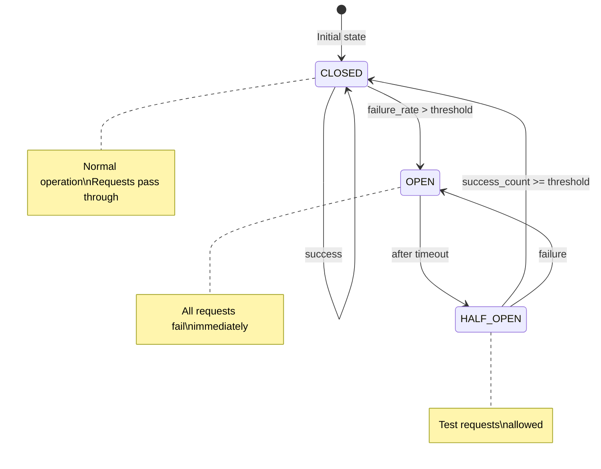
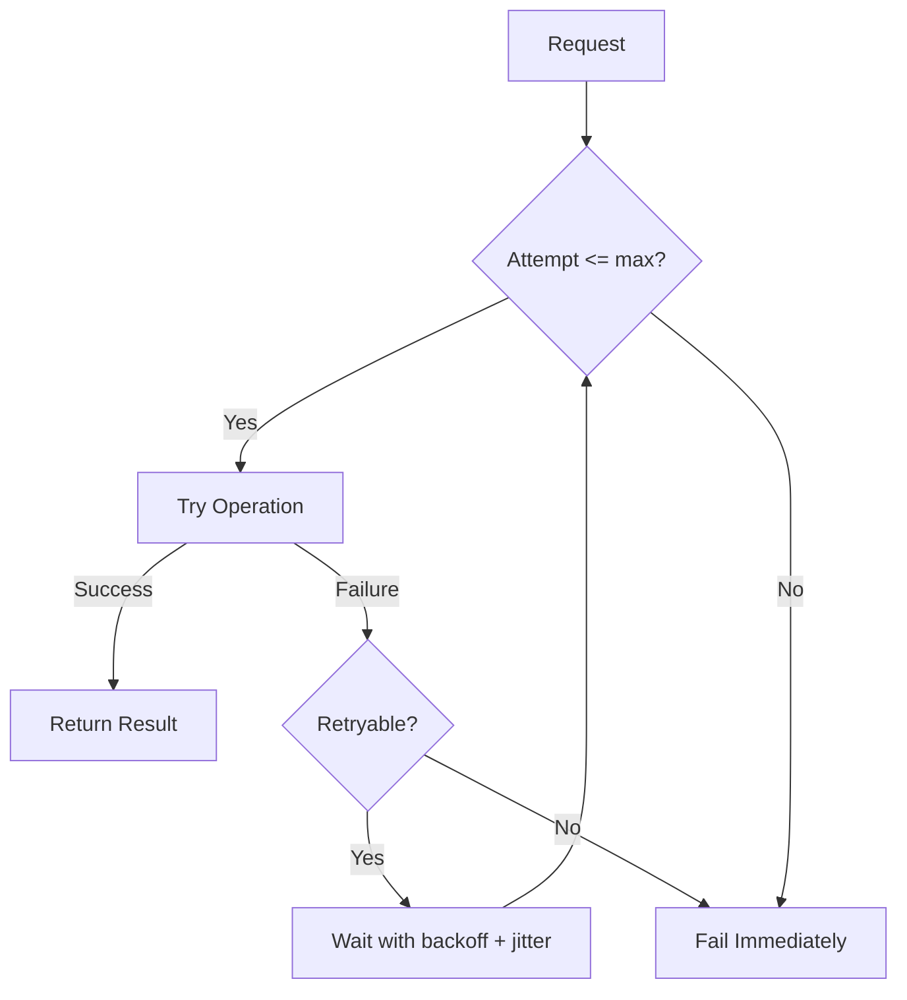
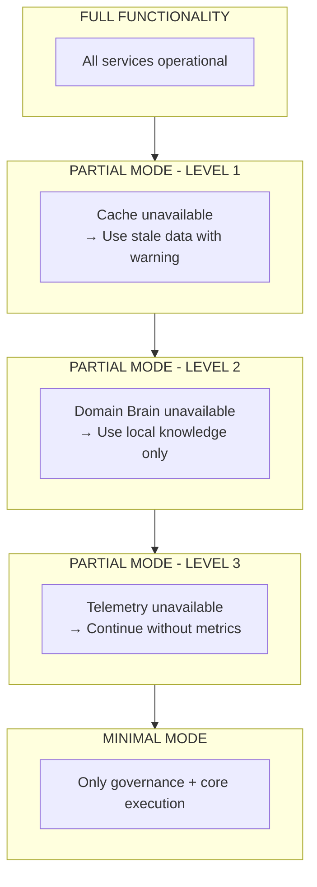
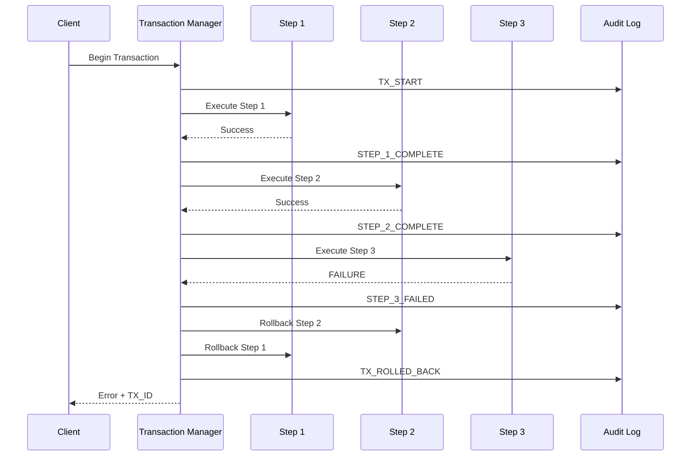
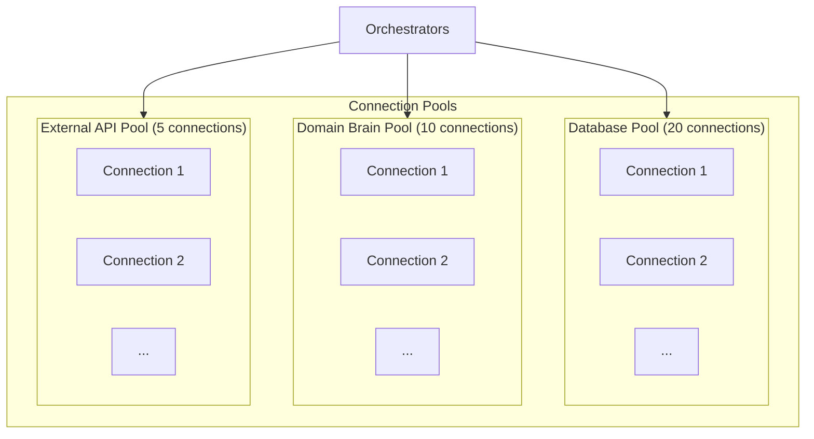
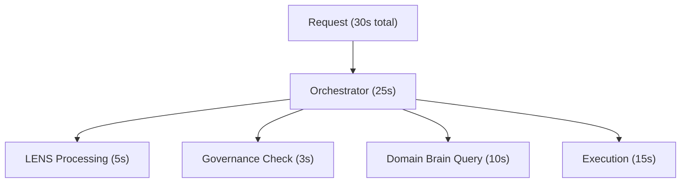

# Resilience Patterns

**Last Updated:** 2026-01-21  
**Version:** 1.1.0  
**Status:** Production Ready  
**Audience:** Architects, Developers, Operators

## Overview

CORTEX implements comprehensive resilience patterns to ensure reliable operation in production environments. This document covers the patterns, their configuration, and how they work together to provide graceful degradation and automatic recovery.

---

## Table of Contents

1. [Resilience Philosophy](#resilience-philosophy)
2. [Circuit Breaker Pattern](#circuit-breaker-pattern)
3. [Retry with Backoff](#retry-with-backoff)
4. [Partial Functionality Mode](#partial-functionality-mode)
5. [Rollback Capability](#rollback-capability)
6. [Bulkhead Pattern](#bulkhead-pattern)
7. [Timeout Management](#timeout-management)
8. [Health Checking](#health-checking)
9. [Configuration Reference](#configuration-reference)
10. [Monitoring Resilience](#monitoring-resilience)

---

## Resilience Philosophy

CORTEX's resilience approach follows these principles:

1. **Fail fast**: When failure is certain, fail immediately
2. **Degrade gracefully**: Partial operation beats total failure
3. **Recover automatically**: Transient failures shouldn't require intervention
4. **Audit everything**: Every failure is recorded for analysis
5. **Isolate failures**: One component's failure shouldn't cascade

### Failure Categories

| Category | Response | Example |
|----------|----------|---------|
| **Transient** | Retry with backoff | Network blip |
| **Persistent** | Circuit breaker | Service down |
| **Partial** | Degraded mode | Cache unavailable |
| **Critical** | Graceful shutdown | Database corruption |

---

## Circuit Breaker Pattern

The circuit breaker prevents cascading failures by failing fast when a service is unhealthy.

### State Machine Diagram



### States Explained

| State | Behavior | Transition |
|-------|----------|------------|
| **CLOSED** | Normal operation, requests pass through | Opens if failure rate exceeds threshold |
| **OPEN** | All requests fail immediately | Moves to HALF_OPEN after timeout |
| **HALF_OPEN** | Test requests allowed | Closes on success, opens on failure |

### Configuration

```yaml
# cortex-config.yaml
resilience:
  circuit_breaker:
    enabled: true
    failure_threshold: 5        # Failures before opening
    failure_rate_threshold: 0.5 # 50% failure rate
    timeout_seconds: 30         # Time in OPEN state
    success_threshold: 2        # Successes to close
    
    # Per-service overrides
    services:
      domain_brain:
        failure_threshold: 3
        timeout_seconds: 60
      
      external_api:
        failure_threshold: 10
        timeout_seconds: 15
```

### Code Usage

```python
from cortex.infrastructure.resilience import circuit_breaker

class MyOrchestrator:
    @circuit_breaker("domain_brain")
    async def query_knowledge(self, query: str) -> KnowledgeResult:
        """Query protected by circuit breaker."""
        return await self.domain_brain.search(query)
    
    async def process(self, intent: str) -> Result:
        try:
            knowledge = await self.query_knowledge(intent)
        except CircuitOpenError:
            # Circuit is open - use fallback
            knowledge = await self._get_cached_knowledge(intent)
        
        return await self._execute(intent, knowledge)
```

### Metrics

| Metric | Description |
|--------|-------------|
| `cortex_circuit_state` | Current state (0=closed, 1=open, 2=half_open) |
| `cortex_circuit_failures_total` | Total failure count |
| `cortex_circuit_opens_total` | Times circuit opened |

---

## Retry with Backoff

Transient failures are handled with automatic retry using exponential backoff.

### Algorithm

```
retry_wait = base_delay * (multiplier ^ attempt) + random_jitter

Example (base=100ms, multiplier=2):
  Attempt 1: wait 100ms + jitter
  Attempt 2: wait 200ms + jitter
  Attempt 3: wait 400ms + jitter
  Attempt 4: wait 800ms + jitter (capped at max_delay)
```

### Retry Flow Diagram



### Configuration

```yaml
# cortex-config.yaml
resilience:
  retry:
    enabled: true
    max_attempts: 3
    base_delay_ms: 100
    max_delay_ms: 5000
    multiplier: 2.0
    jitter_factor: 0.1  # 10% random jitter
    
    # Retryable exceptions
    retryable_errors:
      - ConnectionError
      - TimeoutError
      - TransientDatabaseError
    
    # Non-retryable (fail immediately)
    non_retryable_errors:
      - AuthenticationError
      - ValidationError
      - GovernanceViolation
```

### Code Usage

```python
from cortex.infrastructure.resilience import retry_with_backoff

class MyOrchestrator:
    @retry_with_backoff(
        max_attempts=3,
        base_delay=0.1,
        retryable=(ConnectionError, TimeoutError),
    )
    async def call_external_service(self, request: dict) -> Response:
        """Call with automatic retry."""
        return await self.http_client.post("/api/endpoint", json=request)
```

### Jitter Importance

Jitter prevents the "thundering herd" problem by distributing retry attempts over time rather than having all clients retry simultaneously.

---

## Partial Functionality Mode

When non-critical components fail, CORTEX continues operating with reduced functionality.

### Degradation Hierarchy



### Component Criticality

| Component | Criticality | Failure Behavior |
|-----------|-------------|------------------|
| **Governance Engine** | CRITICAL | Cannot degrade - must be available |
| **Audit Trail** | CRITICAL | Queue if unavailable, flush on recovery |
| **Orchestrator Core** | CRITICAL | Fail request if unavailable |
| **Domain Brain** | HIGH | Use cached knowledge |
| **Telemetry** | MEDIUM | Continue without metrics |
| **External APIs** | LOW | Skip with warning |

### Configuration

```yaml
# cortex-config.yaml
resilience:
  partial_mode:
    enabled: true
    
    components:
      domain_brain:
        criticality: high
        fallback: cache
        cache_ttl_seconds: 3600
        
      telemetry:
        criticality: medium
        fallback: skip
        
      external_api:
        criticality: low
        fallback: skip
        timeout_ms: 5000
```

---

## Rollback Capability

Failed transactions are rolled back atomically to maintain consistency.

### Rollback Flow



### Rollback Rules

1. Execute transaction steps in sequence
2. If error at step N: Rollback steps 1..N-1
3. Return error with transaction ID for audit trail
4. All changes recorded (even rollbacks)

---

## Bulkhead Pattern

The bulkhead pattern isolates components to prevent cascade failures.

### Isolation Pools



### Configuration

```yaml
# cortex-config.yaml
resilience:
  bulkhead:
    enabled: true
    pools:
      database:
        max_connections: 20
        queue_size: 100
      domain_brain:
        max_connections: 10
        queue_size: 50
      external_api:
        max_connections: 5
        queue_size: 20
```

---

## Timeout Management

Strict timeouts prevent resource exhaustion.

### Timeout Hierarchy



### Configuration

```yaml
# cortex-config.yaml
resilience:
  timeouts:
    request: 30.0       # Maximum request time
    orchestrator: 25.0  # Orchestrator budget
    operations:
      lens_processing: 5.0
      governance_check: 3.0
      domain_brain_query: 10.0
      execution: 15.0
```

---

## Health Checking

CORTEX exposes health endpoints for orchestration platforms.

### Health Levels

| Endpoint | Purpose | Response |
|----------|---------|----------|
| `/health/live` | Process running | 200 if alive |
| `/health/ready` | Ready for traffic | 200 or 503 |
| `/health/deep` | Comprehensive check | JSON with all components |

### Code Implementation

```python
class HealthChecker:
    async def liveness(self) -> HealthResult:
        """Basic liveness check."""
        return HealthResult(healthy=True, checks={"alive": True})
    
    async def readiness(self) -> HealthResult:
        """Readiness for traffic."""
        checks = {
            "governance_loaded": self.governance.is_ready(),
            "database_connected": self.db.is_connected(),
        }
        return HealthResult(
            healthy=all(checks.values()),
            checks=checks,
        )
    
    async def deep_health(self) -> HealthResult:
        """Comprehensive health check."""
        checks = {}
        
        # Check database
        try:
            await self.db.execute("SELECT 1")
            checks["database"] = {"healthy": True}
        except Exception as e:
            checks["database"] = {"healthy": False, "error": str(e)}
        
        # Check Domain Brain
        try:
            await self.domain_brain.ping()
            checks["domain_brain"] = {"healthy": True}
        except Exception as e:
            checks["domain_brain"] = {"healthy": False, "error": str(e)}
        
        # Check governance rules
        rule_count = await self.governance.count_rules()
        checks["governance"] = {
            "healthy": rule_count >= 29,  # Expect at least CORE rules
            "rule_count": rule_count,
        }
        
        return HealthResult(
            healthy=all(c.get("healthy", False) for c in checks.values()),
            checks=checks,
        )
```

---

## Configuration Reference

### Complete Resilience Configuration

```yaml
# cortex-config.yaml
resilience:
  # Master enable/disable
  enabled: true
  
  # Circuit breaker settings
  circuit_breaker:
    enabled: true
    failure_threshold: 5
    failure_rate_threshold: 0.5
    timeout_seconds: 30
    success_threshold: 2
    
  # Retry settings
  retry:
    enabled: true
    max_attempts: 3
    base_delay_ms: 100
    max_delay_ms: 5000
    multiplier: 2.0
    jitter_factor: 0.1
    
  # Partial mode settings
  partial_mode:
    enabled: true
    components:
      domain_brain:
        criticality: high
        fallback: cache
      telemetry:
        criticality: medium
        fallback: skip
        
  # Bulkhead settings
  bulkhead:
    enabled: true
    pools:
      domain_brain:
        max_connections: 20
      governance:
        max_connections: 10
        
  # Timeout settings
  timeouts:
    request: 30.0
    orchestrator: 25.0
    operations:
      lens_processing: 5.0
      governance_check: 3.0
      
  # Health check settings
  health:
    liveness_interval_seconds: 5
    readiness_interval_seconds: 10
    deep_health_interval_seconds: 60
```

---

## Monitoring Resilience

### Key Metrics

| Metric | Type | Description |
|--------|------|-------------|
| `cortex_circuit_state` | Gauge | Circuit breaker state per service |
| `cortex_retry_attempts_total` | Counter | Total retry attempts |
| `cortex_retry_success_total` | Counter | Successful retries |
| `cortex_partial_mode_active` | Gauge | 1 if in partial mode |
| `cortex_rollback_total` | Counter | Total rollbacks |
| `cortex_timeout_total` | Counter | Timeout occurrences |
| `cortex_health_check_duration_seconds` | Histogram | Health check latency |

### Alerting Rules

```yaml
# prometheus-alerts.yaml
groups:
  - name: cortex_resilience
    rules:
      - alert: CircuitBreakerOpen
        expr: cortex_circuit_state == 1
        for: 5m
        labels:
          severity: warning
        annotations:
          summary: "Circuit breaker open for {{ $labels.service }}"
          
      - alert: HighRetryRate
        expr: rate(cortex_retry_attempts_total[5m]) > 10
        for: 5m
        labels:
          severity: warning
        annotations:
          summary: "High retry rate detected"
          
      - alert: PartialModeActive
        expr: cortex_partial_mode_active == 1
        for: 10m
        labels:
          severity: warning
        annotations:
          summary: "CORTEX operating in partial mode"
```

---

## Related Documents

- [Design Principles](2-design-principles.md) - Resilience philosophy
- [System Overview](1-system-overview.md) - Component architecture
- [Troubleshooting](../01-getting-started/3-troubleshooting.md) - Common issues
- [Operations Guide](../04-guides/operations/0-overview.md) - Operational procedures

---

**Resilience is not optional—it's what makes CORTEX production-ready.**
