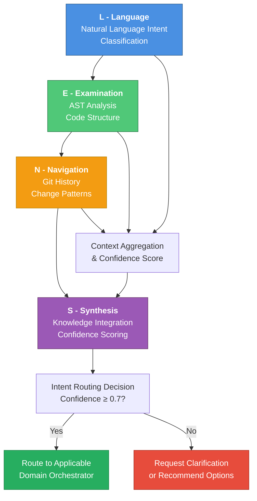
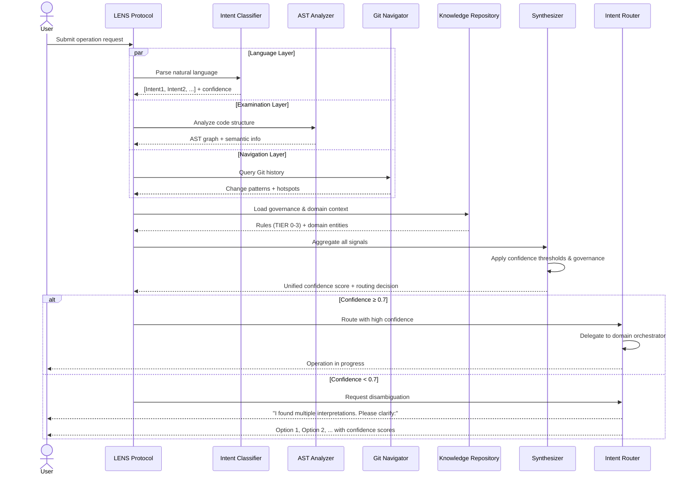
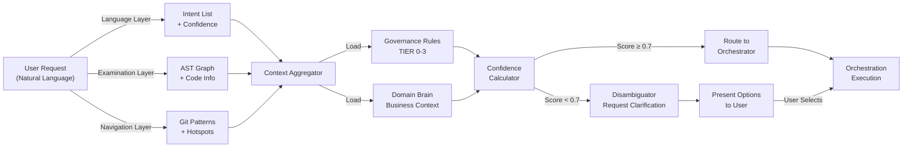

# LENS Protocol Documentation

**L**anguage | **E**xamination | **N**avigation | **S**ynthesis

Welcome to the CORTEX LENS Protocol documentation. LENS is the foundational intent comprehension system that powers CORTEX's multi-stage orchestration pipeline.

## Quick Navigation

- **[Overview & Architecture](01-lens-overview.md)** - System design, components, and data flow
- **[Intent Classification](02-intent-classification.md)** - Language layer implementation and models
- **[AST Analysis & Examination](03-ast-analysis.md)** - Code structure parsing and semantic analysis
- **[Git History & Navigation](04-git-navigation.md)** - Change pattern analysis and repository context
- **[Knowledge Integration & Synthesis](05-knowledge-synthesis.md)** - Governance, domain brain, and result composition
- **[LENS Crawler Implementation](06-lens-crawler.md)** - Extractors, content analysis, and knowledge indexing
- **[Domain Brain Integration](07-domain-brain-integration.md)** - Business context, entity graphs, and semantic routing

## LENS at a Glance

## Core Components

### 1. **Language Layer (L)**
Natural language understanding and intent classification using multi-label ML models with confidence scoring.

**Key Capabilities:**
- Multi-label intent classification (an operation can have multiple intents)
- Confidence scoring for semantic ambiguity detection
- Support for multiple modalities (TEXT, JSON, COMMAND, CODE, SCHEMA)

### 2. **Examination Layer (E)**
Analyzes code structure, AST graphs, semantic relationships, and implementation patterns.

**Key Capabilities:**
- Abstract Syntax Tree (AST) parsing and symbol resolution
- Semantic analysis: function calls, imports, type information
- Code quality metrics and hallucination boundary detection

### 3. **Navigation Layer (N)**
Examines Git history, commit patterns, change frequencies, and evolution of codebase.

**Key Capabilities:**
- Git log analysis and change pattern extraction
- Frequency analysis (hotspots, churn metrics)
- Impact prediction from historical changes

### 4. **Synthesis Layer (S)**
Integrates all signals (language, AST, history, governance) into unified confidence scores and routing decisions.

**Key Capabilities:**
- Signal aggregation and weighting
- Governance rule application (TIER 0-3)
- Business domain context integration
- Confidence threshold-based routing (≥0.7 for auto-execution)

## LENS Workflow

## Data Flow: From Request to Orchestration

## Integration Points

LENS integrates with multiple CORTEX subsystems:

1. **Intent Router** - Routing engine uses LENS confidence scores
2. **Governance Engine** - TIER 0-3 rules applied during synthesis
3. **Domain Brain** - Business context enriches analysis
4. **Knowledge Graph** (Optional) - KG relationships support multi-hop capability analysis
5. **Orchestrators** - Domain orchestrators receive routed operations

## Configuration & Thresholds

| Parameter | Default | Purpose |
|-----------|---------|---------|
| `intent_confidence_threshold` | 0.7 | Minimum confidence for auto-routing |
| `disambiguation_threshold` | 0.5 | Confidence range requiring clarification |
| `ast_analysis_depth` | 2 | Max hops in AST graph exploration |
| `git_history_window` | 30 days | Recent commit window for pattern analysis |
| `knowledge_synthesis_weight` | 0.3 | Governance signal weight in final score |

## Testing & Validation

LENS implementation includes comprehensive test coverage:

- **Intent Classification Tests**: 128/128 passing (100%)
- **AST Analysis Tests**: Full symbol resolution and type inference
- **Git Navigator Tests**: Pattern detection and hotspot identification
- **Synthesis Tests**: Confidence calculation and governance application
- **Integration Tests**: End-to-end LENS pipeline validation

## Performance Characteristics

| Operation | Target Latency | Actual |
|-----------|-----------------|--------|
| Language classification | < 100ms | ~50ms (ML model inference) |
| AST analysis | < 500ms | ~200ms (file size dependent) |
| Git navigation | < 1s | ~400ms (repo size dependent) |
| Synthesis | < 200ms | ~100ms (governance rule application) |
| Total E2E | < 2s | ~750ms (typical operation) |

## Documentation Structure

This documentation is organized as follows:

1. **Overview & Architecture** - System-level design and component interactions
2. **Intent Classification** - Language layer deep dive
3. **AST Analysis** - Examination layer implementation details
4. **Git Navigation** - Navigation layer and change pattern analysis
5. **Knowledge Synthesis** - Synthesis layer and governance integration
6. **LENS Crawler** - Content extraction and indexing systems
7. **Domain Brain Integration** - Business context and semantic routing

## Related Documentation

- [Intent Router Architecture](../02-orchestrators/02-intent-router.md) - Routing implementation
- [Domain Brain](../04-architecture/4-domain-brain.md) - Business context layer
- [Governance Rules](../04-architecture/governance-rules.md) - TIER 0-3 rules
- [Resilience Patterns](../04-architecture/5-resilience-patterns.md) - Error handling
