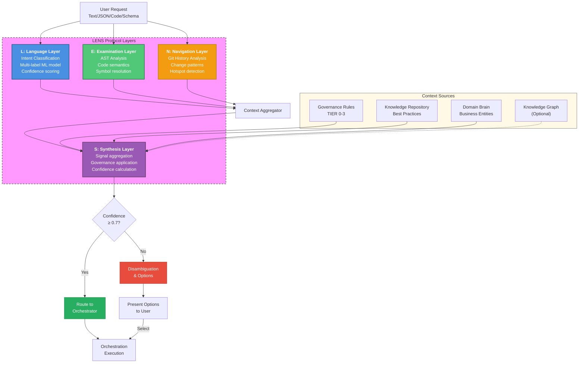
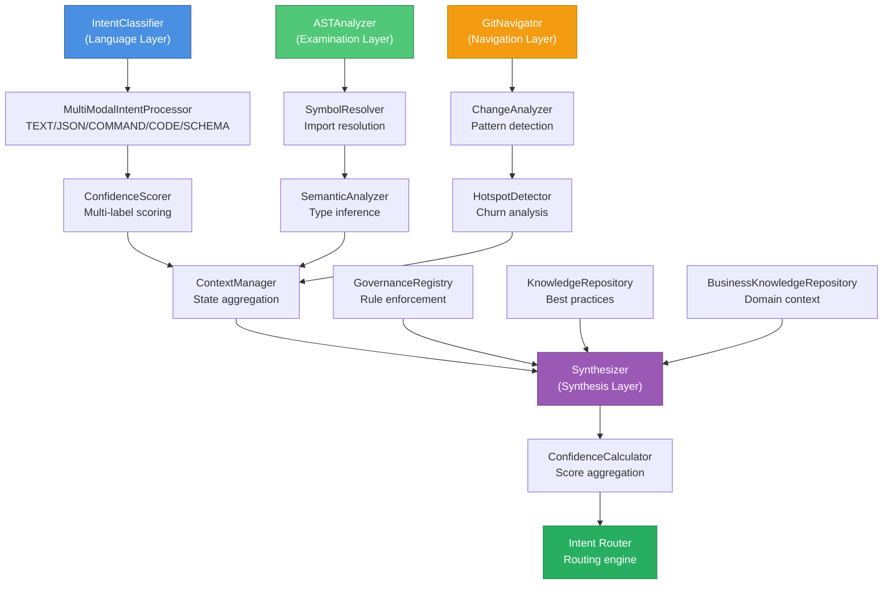
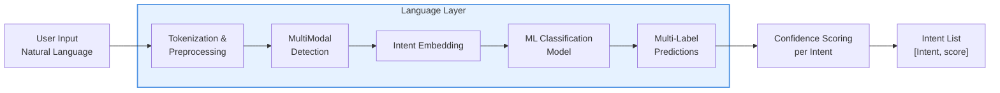
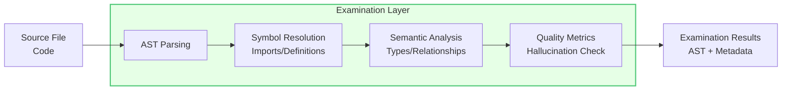
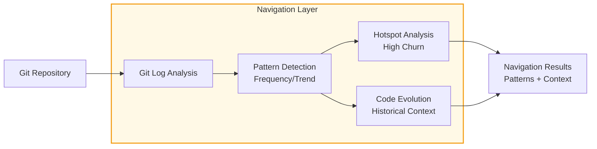
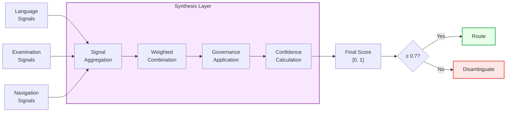
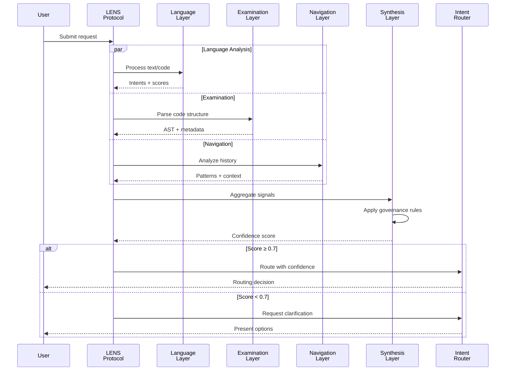
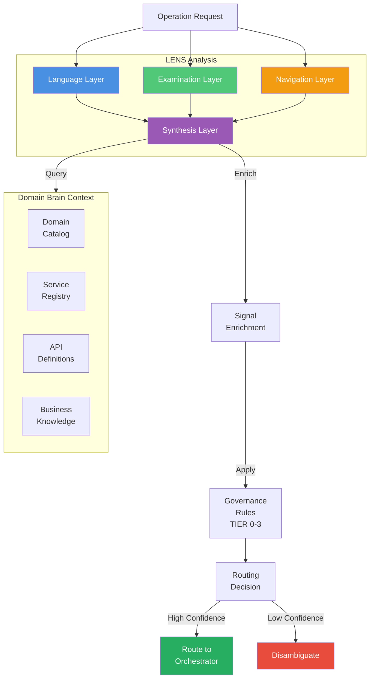

# LENS Overview & Architecture

## System Design

The LENS Protocol is CORTEX's foundational intent comprehension system. It transforms user requests through four complementary analysis layers (Language, Examination, Navigation, Synthesis) to enable precise intent routing with high confidence scoring.

## Architecture Overview

## Component Architecture

## Detailed Layer Architecture

### Language Layer (L)

The language layer performs natural language understanding using multi-label classification:

**Key Features:**
- **Multi-Label Classification**: Single request can match multiple intents
- **Modality Support**: TEXT, JSON, COMMAND, CODE, SCHEMA inputs
- **Confidence Scoring**: Per-intent confidence [0, 1] range
- **Fallback Strategies**: Fuzzy matching when confidence low

### Examination Layer (E)

The examination layer analyzes code structure through AST parsing and semantic analysis:

**Key Features:**
- **AST Parsing**: Full Python AST with symbol table
- **Import Resolution**: Transitive import tracking
- **Type Inference**: Basic type information extraction
- **Code Quality Metrics**: Hallucination boundary detection

### Navigation Layer (N)

The navigation layer analyzes Git history to extract change patterns:

**Key Features:**
- **Change Pattern Analysis**: Frequency, recency, authorship
- **Hotspot Detection**: High-churn files and functions
- **Evolution Tracking**: Historical code changes
- **Impact Prediction**: Files likely affected by similar changes

### Synthesis Layer (S)

The synthesis layer aggregates all signals and applies governance rules:

**Key Features:**
- **Signal Aggregation**: Combines all layer outputs
- **Weighted Scoring**: Configurable signal weights
- **Governance Integration**: TIER 0-3 rule application
- **Threshold-Based Routing**: 0.7 confidence threshold

## Data Flow: Request to Routing Decision

## Integration with Domain Brain

## Performance Characteristics

| Component | Latency | Notes |
|-----------|---------|-------|
| **Language Layer** | ~50ms | ML inference (CPU) |
| **Examination Layer** | ~200ms | File size dependent |
| **Navigation Layer** | ~400ms | Git operations |
| **Synthesis Layer** | ~100ms | Governance + scoring |
| **Total E2E** | ~750ms | Typical request |

## Test Coverage

- **Intent Classification**: 128/128 tests (100%)
- **AST Analysis**: Full symbol resolution validation
- **Git Navigation**: Pattern detection and hotspot identification
- **Synthesis Engine**: Confidence calculation and governance application
- **Integration Tests**: End-to-end LENS pipeline

## Next Steps

- [Intent Classification Details](02-intent-classification.md)
- [AST Analysis & Examination](03-ast-analysis.md)
- [Git History & Navigation](04-git-navigation.md)
- [Knowledge Integration & Synthesis](05-knowledge-synthesis.md)
- [LENS Crawler Implementation](06-lens-crawler.md)
- [Domain Brain Integration](07-domain-brain-integration.md)
