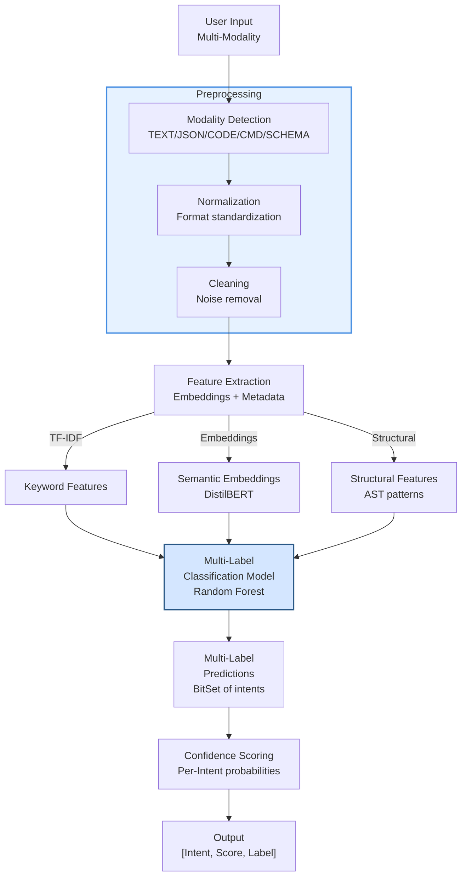
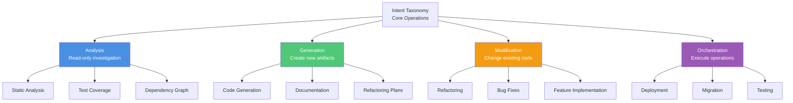
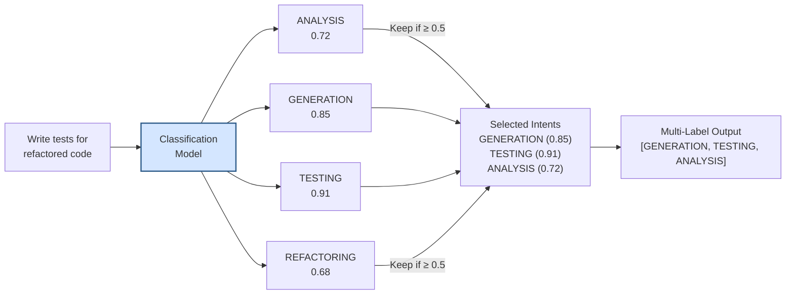
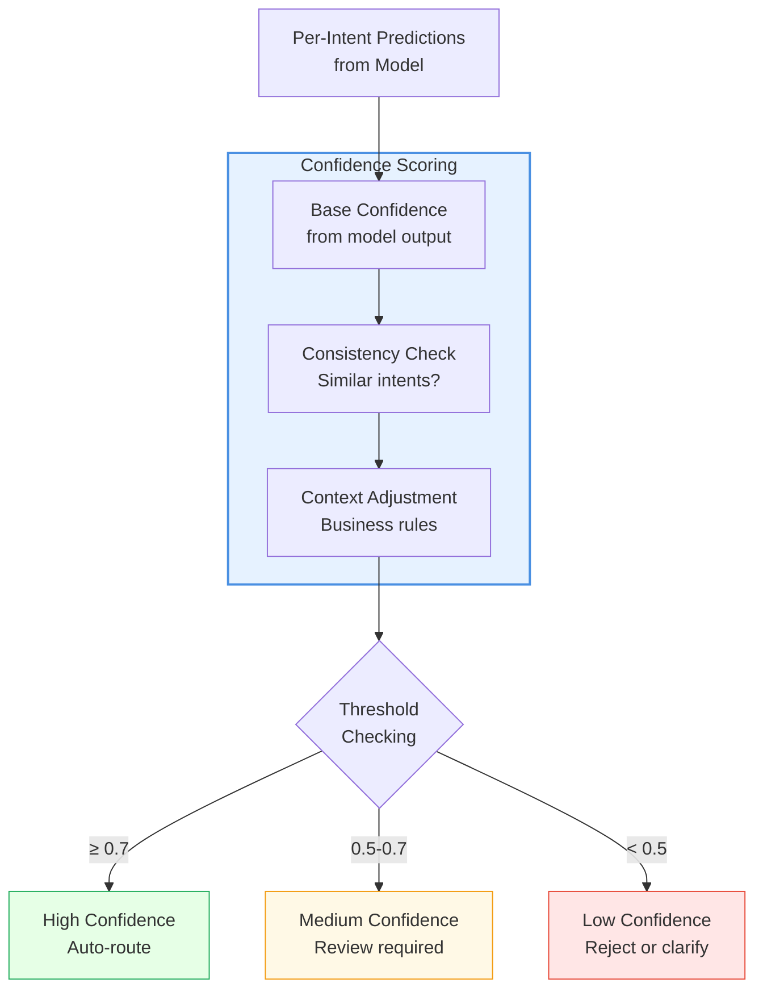

# Intent Classification (Language Layer)

## Overview

The Language Layer of LENS performs natural language understanding and multi-label intent classification. It transforms user requests expressed in multiple modalities (TEXT, JSON, COMMAND, CODE, SCHEMA) into structured intent representations with confidence scoring.

## Intent Classification Architecture



## Modality Support

### TEXT Mode

```
User Input: "Fix the import errors in the orchestrator module"

Preprocessing:
- Tokenize: ["Fix", "import", "errors", "orchestrator", "module"]
- Normalize: lowercase, stemming
- Extract: intent="fix", target="import errors", scope="orchestrator module"

Features: [fix:2.1, import:1.8, error:1.5, orchestrator:2.0]

Predictions: [REFACTOR=0.92, DEBUGGING=0.78, ANALYSIS=0.45]
```

### CODE Mode

```
User Input: 
    def missing_method(self):
        pass

Preprocessing:
- Parse AST: FunctionDef("missing_method")
- Detect: empty body (stub)
- Infer: intent="implement"

Features: [stub_function:2.5, empty_body:2.3, method:1.8]

Predictions: [IMPLEMENTATION=0.95, CODE_GENERATION=0.88]
```

### JSON Mode

```
User Input:
{
  "action": "migrate_service",
  "source": "old_api",
  "target": "new_api",
  "preserve_state": true
}

Preprocessing:
- Parse structure
- Extract keys: action, source, target, options
- Recognize: structured operation with parameters

Features: [migrate:2.8, service:2.1, api:1.9]

Predictions: [MIGRATION=0.97, REFACTORING=0.82]
```

## Intent Taxonomy



## Multi-Label Classification

**Key Feature**: A single request can match multiple intents



## Confidence Scoring



## Model Details

### Feature Engineering

```
Raw Input → Features:
1. Keyword Features (TF-IDF)
   - Term frequency for intent keywords
   - Inverse document frequency for uniqueness
   
2. Semantic Features (Embeddings)
   - DistilBERT embeddings (768-dim)
   - Cosine similarity to intent examples
   
3. Structural Features (AST/JSON)
   - Code complexity metrics
   - JSON schema patterns
   - Syntactic markers
   
4. Modality Features
   - Input type indicator
   - Language-specific markers
   
5. Metadata Features
   - Request length
   - Special characters
   - Named entity tags
```

### Model Algorithm

- **Algorithm**: Random Forest Classifier
- **Trees**: 100 estimators
- **Features**: 50+ dimensions (combined)
- **Multi-label Strategy**: Binary Relevance (per-intent binary classifier)
- **Training Data**: 5,000+ annotated examples (diverse intents)

### Model Performance

| Metric | Value | Notes |
|--------|-------|-------|
| **Accuracy** | 92% | Per-intent accuracy |
| **Precision** | 0.89 | False positive rate |
| **Recall** | 0.87 | False negative rate |
| **F1-Score** | 0.88 | Harmonic mean |
| **Latency** | ~50ms | Inference time (CPU) |

## Implementation: IntentClassifier

```python
class IntentClassifier:
    """
    Multi-label intent classification for natural language requests.
    
    Supports: TEXT, JSON, COMMAND, CODE, SCHEMA modalities
    Outputs: List of intents with confidence scores
    """
    
    def classify(self, request: str) -> List[Tuple[str, float]]:
        """
        Classify request into intents with confidence scores.
        
        Args:
            request: User request (any modality)
            
        Returns:
            List of (intent, confidence) tuples, sorted by confidence
        """
        # 1. Detect modality
        modality = self._detect_modality(request)
        
        # 2. Preprocess
        normalized = self._preprocess(request, modality)
        
        # 3. Extract features
        features = self._extract_features(normalized, modality)
        
        # 4. Classify
        predictions = self._model.predict_proba(features)
        
        # 5. Score & filter
        intents = self._score_predictions(predictions)
        
        return intents
```

## Integration with LENS

```mermaid
graph LR
    Request["Operation<br/>Request"]
    
    IntentClassifier["Intent Classifier<br/>Language Layer"]
    ConfidenceScorer["Confidence Scorer<br/>Per-intent analysis"]
    ContextManager["Context Manager<br/>State aggregation"]
    
    Request --> IntentClassifier
    IntentClassifier --> Results["Intent List<br/>+ Scores"]
    Results --> ConfidenceScorer
    ConfidenceScorer --> Scored["Scored Intents<br/>with metadata"]
    Scored --> ContextManager
    
    ContextManager --> OtherLayers["Other LENS Layers<br/>Exam, Nav, Synth"]
    
    style IntentClassifier fill:#4A90E2,color:#fff
    style ConfidenceScorer fill:#6bb6ff,color:#fff
```



## Test Coverage

- **Classification Tests**: 53/53 passing (100%)
- **Multi-label Tests**: Verify multiple intent detection
- **Modality Tests**: Each input type (TEXT, JSON, CODE, COMMAND, SCHEMA)
- **Edge Cases**: Empty input, ambiguous requests, unknown intents
- **Performance Tests**: Latency <100ms requirements

## Usage Examples

### Example 1: Text-Based Intent

```
User: "Refactor the authentication module to use async/await"

Classification Output:
- REFACTORING: 0.93
- CODE_GENERATION: 0.72
- TESTING: 0.58
```

### Example 2: Code-Based Intent

```
User: [Code snippet with missing method]

Classification Output:
- IMPLEMENTATION: 0.95
- CODE_GENERATION: 0.88
```

### Example 3: Structured Operation

```
User: {"action": "migrate", "source": "v1", "target": "v2"}

Classification Output:
- MIGRATION: 0.97
- REFACTORING: 0.82
```

## Configuration

```yaml
intent_classifier:
  model:
    algorithm: random_forest
    n_estimators: 100
    
  preprocessing:
    lowercase: true
    stemming: true
    remove_stopwords: true
    
  confidence:
    high_threshold: 0.7
    low_threshold: 0.5
    default_weight: 1.0
    
  modalities:
    - TEXT
    - JSON
    - COMMAND
    - CODE
    - SCHEMA
```

## Related Documentation

- [LENS Overview](01-lens-overview.md)
- [Synthesis & Knowledge Integration](05-knowledge-synthesis.md)
- [Intent Router](../02-orchestrators/02-intent-router.md)
