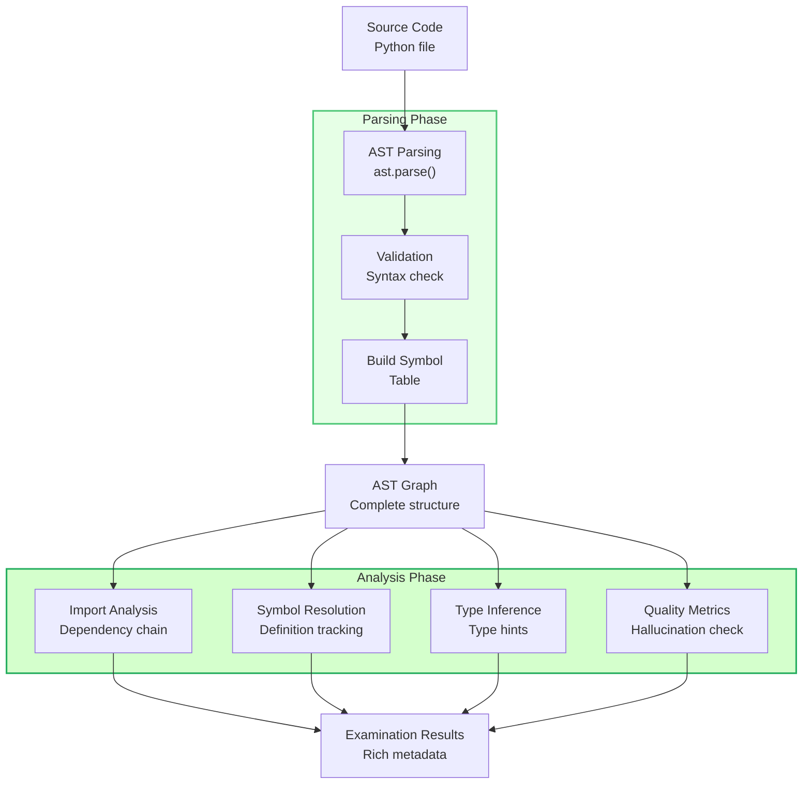
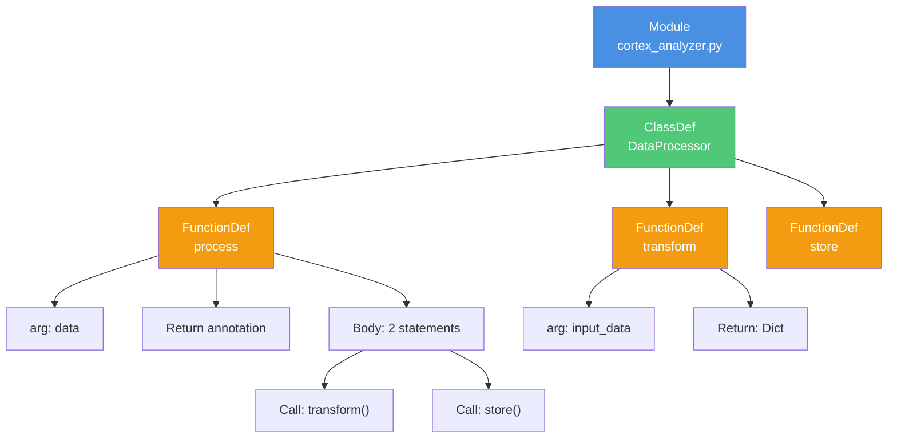
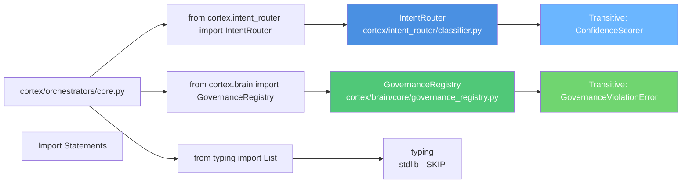
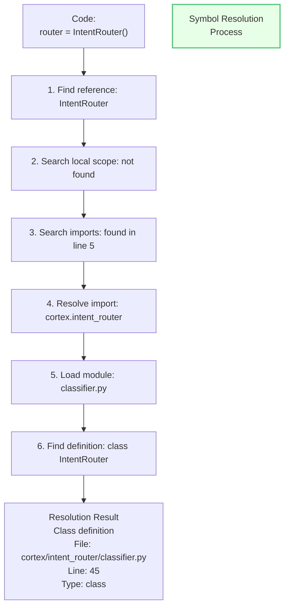
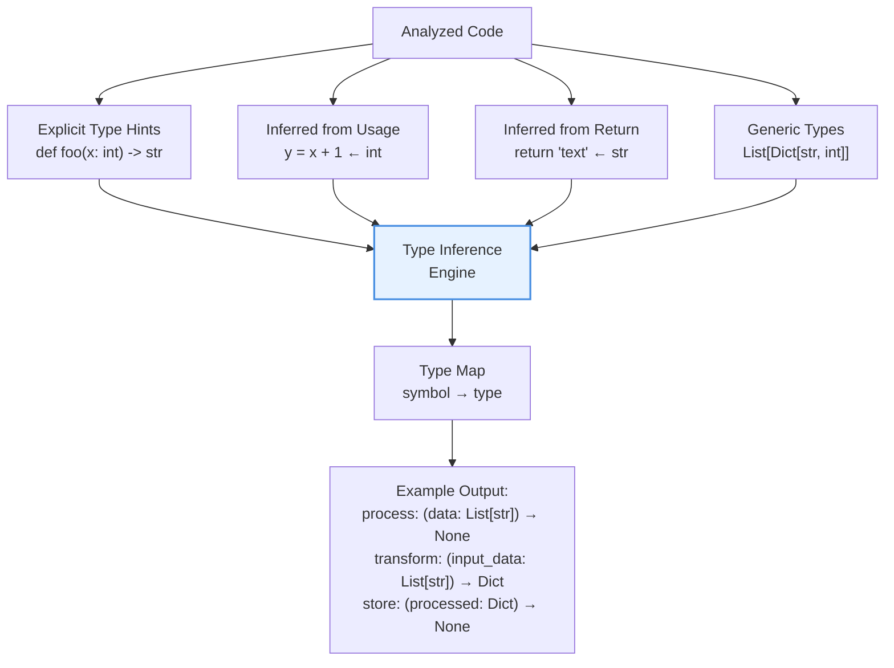
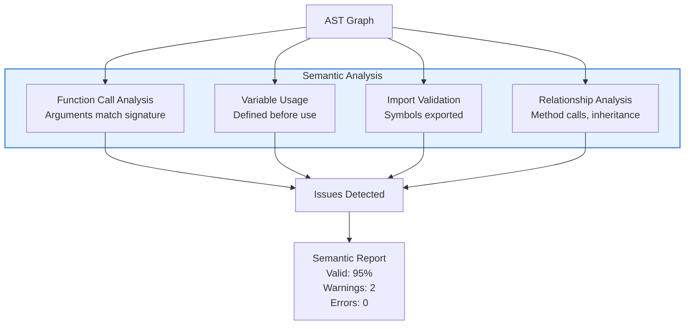
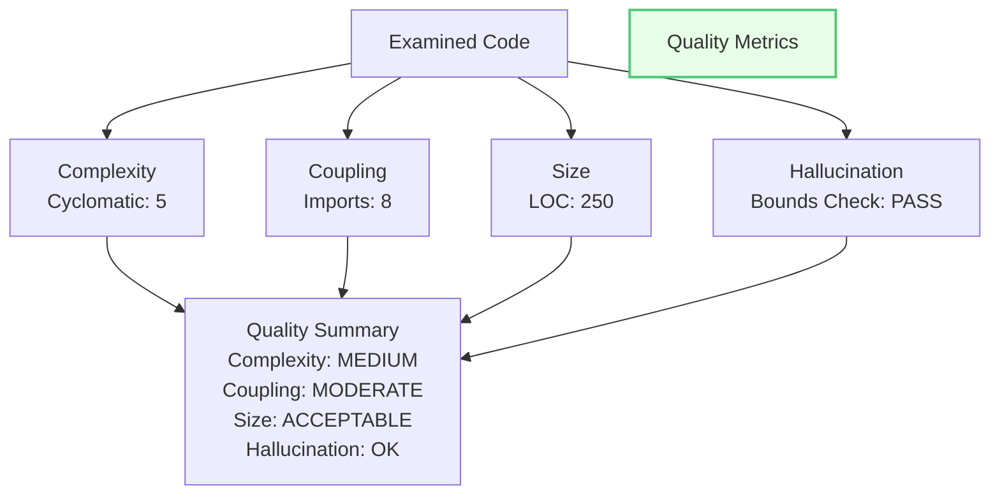
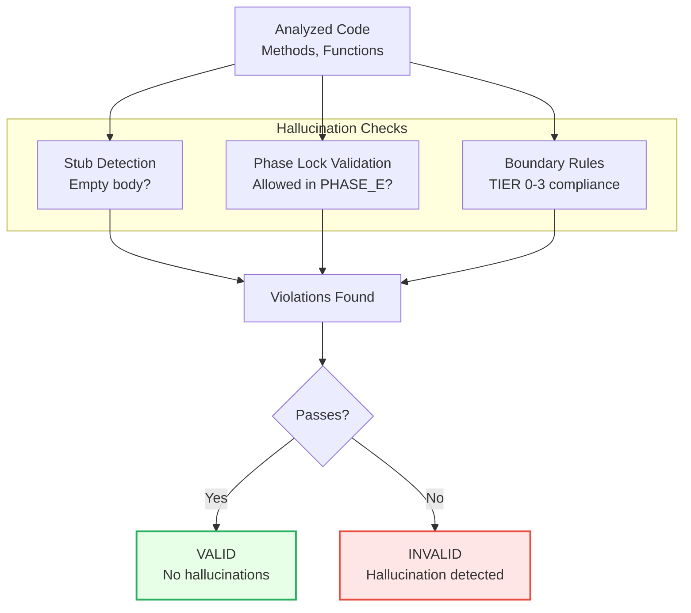
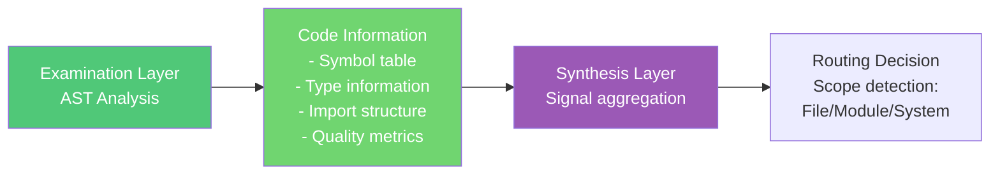

# AST Analysis & Examination (Examination Layer)

## Overview

The Examination Layer analyzes code structure, semantics, and implementation patterns through Abstract Syntax Tree (AST) parsing and semantic analysis. It extracts code relationships, identifies symbols, performs type inference, and detects code quality issues.

## AST Analysis Pipeline



## AST Structure Example

```python
# Source Code
class DataProcessor:
    def process(self, data: List[str]) -> None:
        result = self.transform(data)
        self.store(result)
    
    def transform(self, input_data: List[str]) -> Dict:
        return {item: len(item) for item in input_data}
    
    def store(self, processed: Dict) -> None:
        pass
```



## Import Analysis



## Symbol Resolution



## Type Inference



## Semantic Analysis



## Code Quality Metrics



## Hallucination Boundary Detection

The Examination Layer includes hallucination prevention checks:



## Implementation: ASTAnalyzer

```python
class ASTAnalyzer:
    """
    Comprehensive AST analysis and semantic examination.
    
    Features:
    - AST parsing and validation
    - Symbol resolution (imports, definitions)
    - Type inference
    - Semantic analysis
    - Code quality metrics
    """
    
    def analyze(self, source_code: str, file_path: str) -> ExaminationResult:
        """
        Perform complete AST analysis.
        
        Args:
            source_code: Python source code
            file_path: File path for context
            
        Returns:
            ExaminationResult with AST, symbols, types, quality metrics
        """
        # 1. Parse AST
        ast_tree = ast.parse(source_code)
        
        # 2. Build symbol table
        symbol_table = self._build_symbol_table(ast_tree, file_path)
        
        # 3. Resolve imports
        imports = self._resolve_imports(ast_tree, symbol_table)
        
        # 4. Infer types
        type_info = self._infer_types(ast_tree, symbol_table)
        
        # 5. Analyze semantics
        semantic_issues = self._analyze_semantics(ast_tree, symbol_table)
        
        # 6. Compute metrics
        metrics = self._compute_metrics(ast_tree)
        
        # 7. Check hallucinations
        hallucination_check = self._check_hallucinations(ast_tree)
        
        return ExaminationResult(
            ast=ast_tree,
            symbols=symbol_table,
            imports=imports,
            types=type_info,
            semantics=semantic_issues,
            metrics=metrics,
            hallucinations=hallucination_check
        )
```

## Symbol Resolution Implementation

```python
class SymbolResolver:
    """Resolves symbols through import chains."""
    
    def resolve_symbol(self, name: str, context: AnalysisContext) -> Symbol:
        """
        Resolve a symbol name in given context.
        
        Search order:
        1. Local scope
        2. Enclosing scope (for nested functions)
        3. Module scope
        4. Imported modules
        5. Built-ins
        """
        # Check local scope
        if name in context.local_scope:
            return context.local_scope[name]
        
        # Check enclosing scope
        if name in context.enclosing_scope:
            return context.enclosing_scope[name]
        
        # Check module scope
        if name in context.module_scope:
            return context.module_scope[name]
        
        # Check imports
        for import_path, import_names in context.imports.items():
            if name in import_names:
                return self._resolve_from_import(name, import_path)
        
        # Check built-ins
        if name in __builtins__:
            return BuiltinSymbol(name)
        
        return UnresolvedSymbol(name)
```

## Integration with LENS Synthesis



## Test Coverage

- **AST Parsing**: Full Python syntax validation
- **Import Resolution**: Transitive imports, circular imports
- **Type Inference**: Explicit hints, usage-based inference
- **Symbol Resolution**: Scope handling, name resolution
- **Quality Metrics**: Complexity, coupling, size calculations
- **Hallucination Detection**: Stub detection, boundary checks

## Configuration

```yaml
ast_analyzer:
  parsing:
    python_version: "3.9"
    strict_syntax: true
    
  analysis:
    resolve_imports: true
    infer_types: true
    compute_complexity: true
    
  quality:
    complexity_threshold: 10
    coupling_threshold: 15
    
  hallucination:
    check_stubs: true
    check_phase_lock: true
    check_boundaries: true
```

## Related Documentation

- [LENS Overview](01-lens-overview.md)
- [Git Navigation](04-git-navigation.md)
- [Knowledge Synthesis](05-knowledge-synthesis.md)
