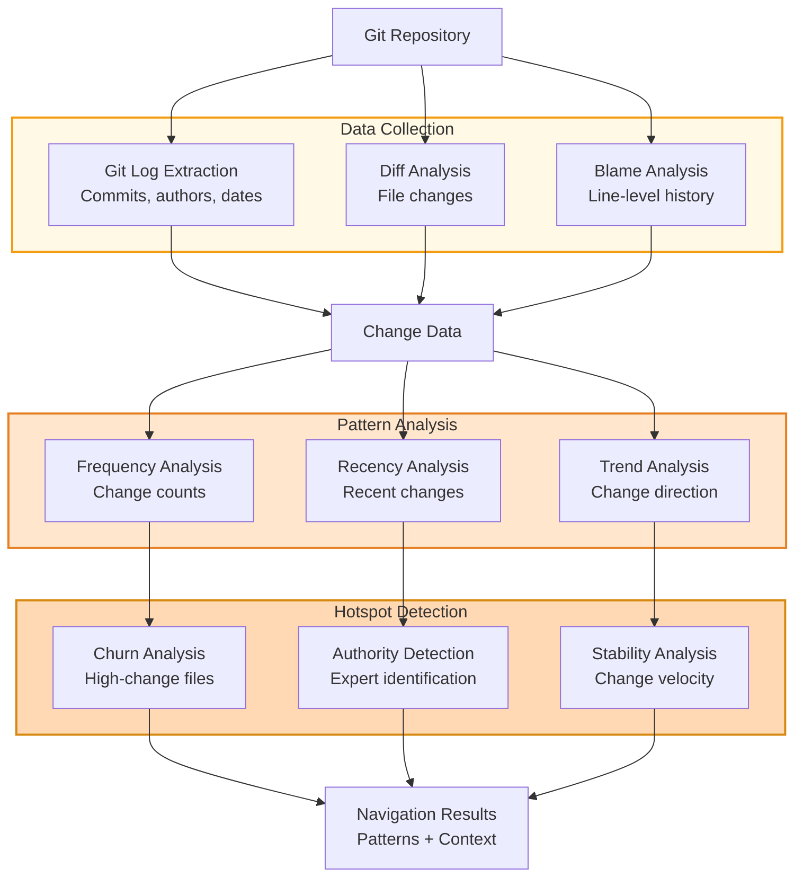
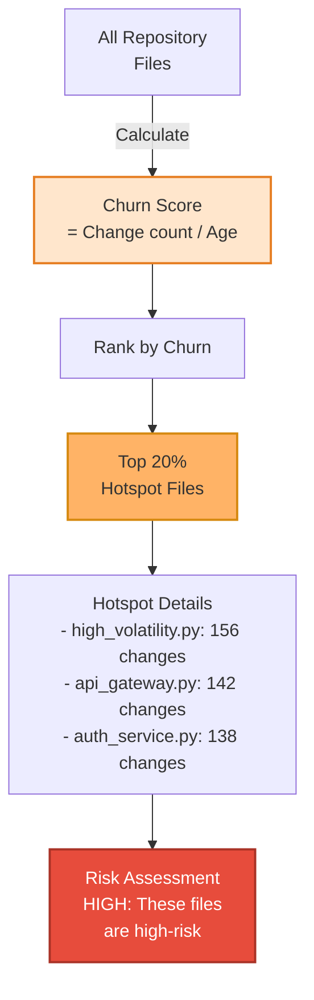
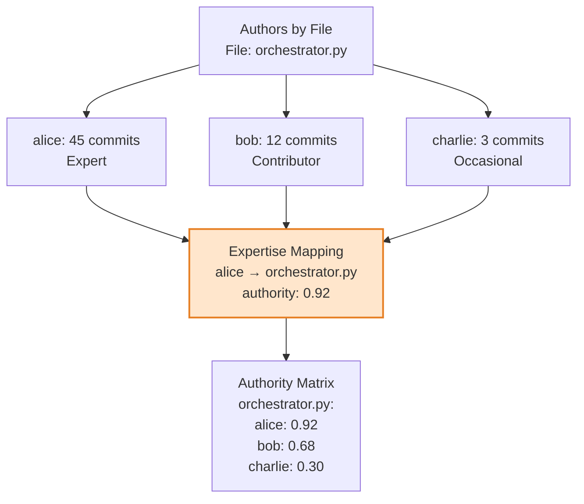
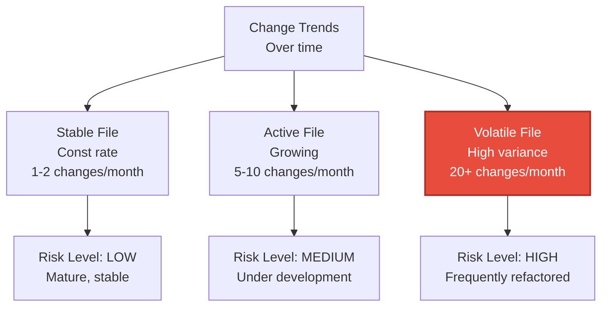
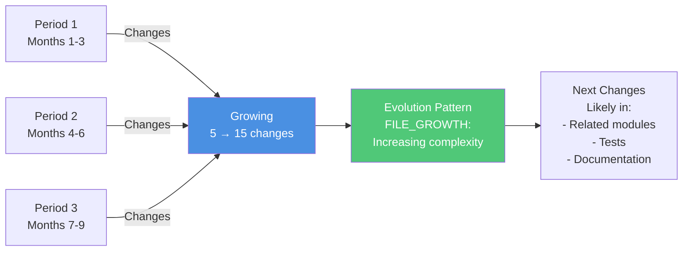
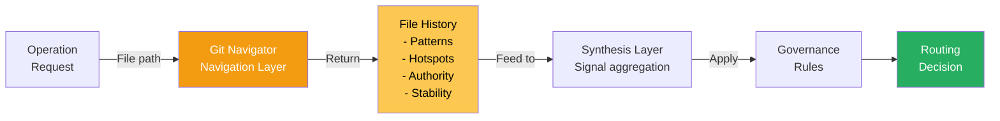

# Git History & Navigation (Navigation Layer)

## Overview

The Navigation Layer analyzes Git history to extract change patterns, identify hotspots, and understand code evolution. This historical context enriches LENS analysis with information about how code has changed over time.

## Git Navigation Pipeline



## Change Pattern Analysis

```mermaid
graph LR
    TimeWindow["30-day Window<br/>Recent commits"]
    
    Commits["Commit 1", "Commit 2", "Commit 3", "Commit N"]
    
    TimeWindow --> Commits
    
    Commits -->|Extract| Frequency["Frequency<br/>Count per file"]
    Commits -->|Extract| Authors["Authors<br/>Who changed it"]
    Commits -->|Extract| Messages["Messages<br/>Change intent"]
    
    Frequency --> Analysis["Pattern Analysis<br/>Is this:<br/>- Frequently changing?<br/>- Actively developed?<br/>- Recently touched?"]
    Authors --> Analysis
    Messages --> Analysis
    
    Analysis --> Output["Output<br/>File: auth.py<br/>Changes: 12<br/>Authors: 3<br/>Recent: YES<br/>Trend: INCREASING"]
    
    style Analysis fill:#ffe6cc,stroke:#E67E22,stroke-width:2px
```

## Hotspot Detection Algorithm



## Authority & Expertise Detection



## Stability Analysis



## Code Evolution Analysis



## Implementation: GitNavigator

```python
class GitNavigator:
    """
    Analyzes Git history for patterns and evolution.
    
    Features:
    - Commit log analysis
    - Change pattern extraction
    - Hotspot detection
    - Authority identification
    - Evolution tracking
    """
    
    def analyze_file_history(self, file_path: str, 
                           days_window: int = 30) -> FileHistory:
        """
        Analyze Git history for a specific file.
        
        Args:
            file_path: Path to file in repository
            days_window: Historical window in days
            
        Returns:
            FileHistory with patterns and metrics
        """
        # 1. Get commit log
        commits = self._get_commits(file_path, days_window)
        
        # 2. Extract changes
        changes = self._extract_changes(commits)
        
        # 3. Analyze patterns
        patterns = self._analyze_patterns(changes)
        
        # 4. Detect hotspots
        hotspots = self._detect_hotspots(file_path, changes)
        
        # 5. Identify authority
        authority = self._identify_authority(commits)
        
        # 6. Assess stability
        stability = self._assess_stability(changes)
        
        return FileHistory(
            file_path=file_path,
            patterns=patterns,
            hotspots=hotspots,
            authority=authority,
            stability=stability,
            total_changes=len(commits)
        )
    
    def detect_hotspots(self, repo_path: str) -> List[Hotspot]:
        """
        Detect high-churn files in repository.
        
        Returns:
            List of hotspots sorted by churn score
        """
        all_files = self._get_all_files(repo_path)
        
        churn_scores = {}
        for file_path in all_files:
            history = self.analyze_file_history(file_path)
            churn_scores[file_path] = self._calculate_churn(history)
        
        # Sort by churn
        hotspots = sorted(
            churn_scores.items(),
            key=lambda x: x[1],
            reverse=True
        )
        
        return hotspots[:20]  # Top 20 hotspots
```

## Change Pattern Examples

### Pattern 1: Stable File

```
File: constants.py
Commits (30 days): 1
Authors: 1 (alice)
Trend: ↔ FLAT
Risk: LOW

Interpretation:
- Mature, well-established code
- Minimal changes required
- Low risk of regressions
```

### Pattern 2: Active Development

```
File: orchestrator.py
Commits (30 days): 15
Authors: 4 (alice, bob, charlie, diana)
Trend: ↗ INCREASING
Risk: MEDIUM

Interpretation:
- Under active development
- Multiple contributors
- Moderate change velocity
- Requires careful testing
```

### Pattern 3: Refactoring Hotspot

```
File: legacy_api.py
Commits (30 days): 45
Authors: 2 (eve, frank)
Trend: ↗ ACCELERATING
Risk: HIGH

Interpretation:
- High-volatility file
- Extensive refactoring
- Multiple iterations
- High risk of issues
```

## Integration with LENS Navigation



## Test Coverage

- **Commit Log Analysis**: Extract commits from Git
- **Change Pattern Detection**: Frequency, recency, trends
- **Hotspot Identification**: Churn-based ranking
- **Authority Mapping**: Author expertise by file
- **Stability Assessment**: Volatility metrics
- **Edge Cases**: New files, deleted files, renamed files

## Configuration

```yaml
git_navigator:
  analysis:
    history_window_days: 30
    hotspot_threshold: 0.75
    
  patterns:
    recency_weight: 0.5
    frequency_weight: 0.3
    trend_weight: 0.2
    
  authority:
    expert_threshold: 0.8
    contributor_threshold: 0.5
    
  stability:
    volatile_threshold: 20
    active_threshold: 10
    stable_threshold: 5
```

## Related Documentation

- [LENS Overview](01-lens-overview.md)
- [AST Analysis](03-ast-analysis.md)
- [Knowledge Synthesis](05-knowledge-synthesis.md)
