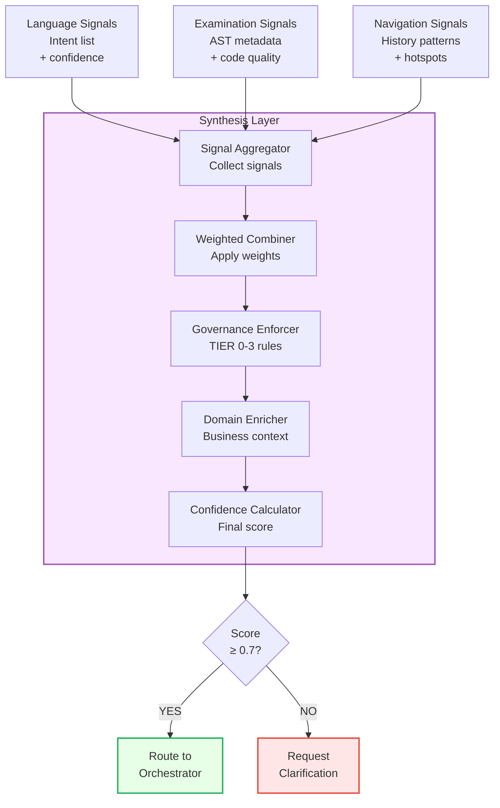
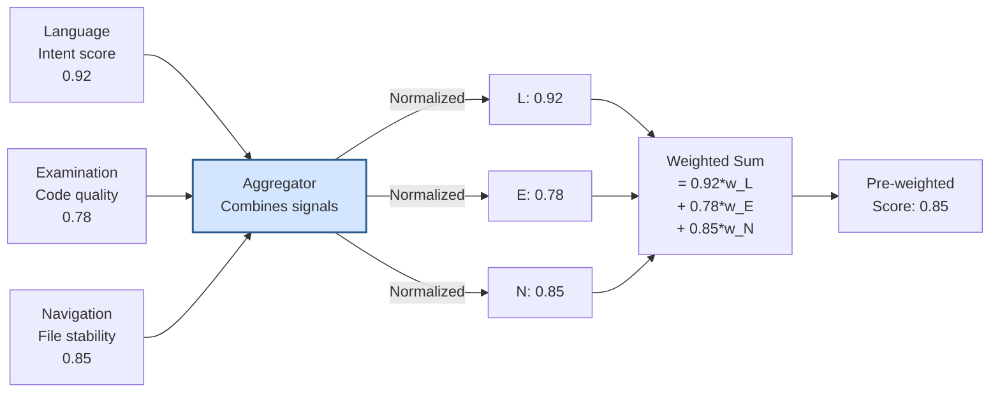
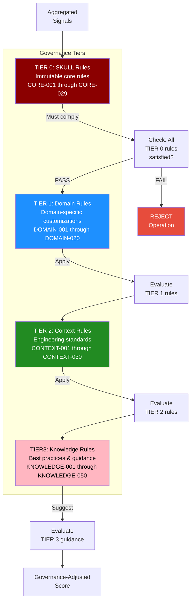
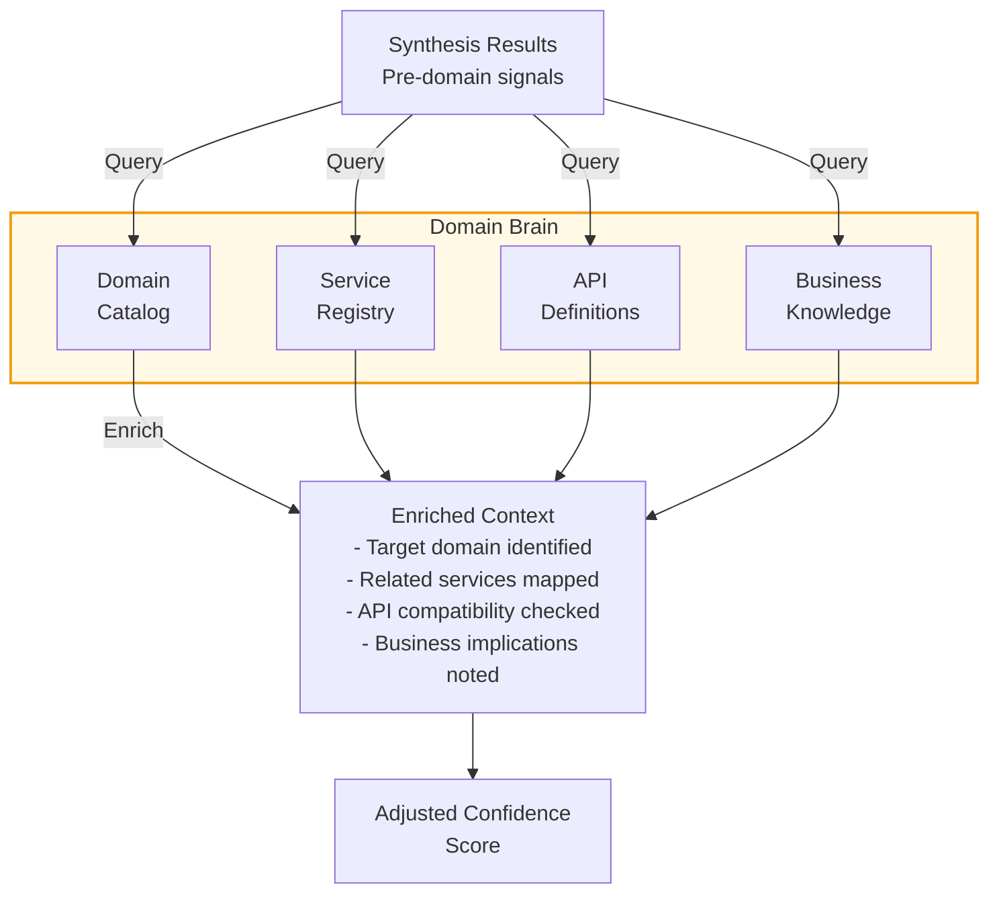
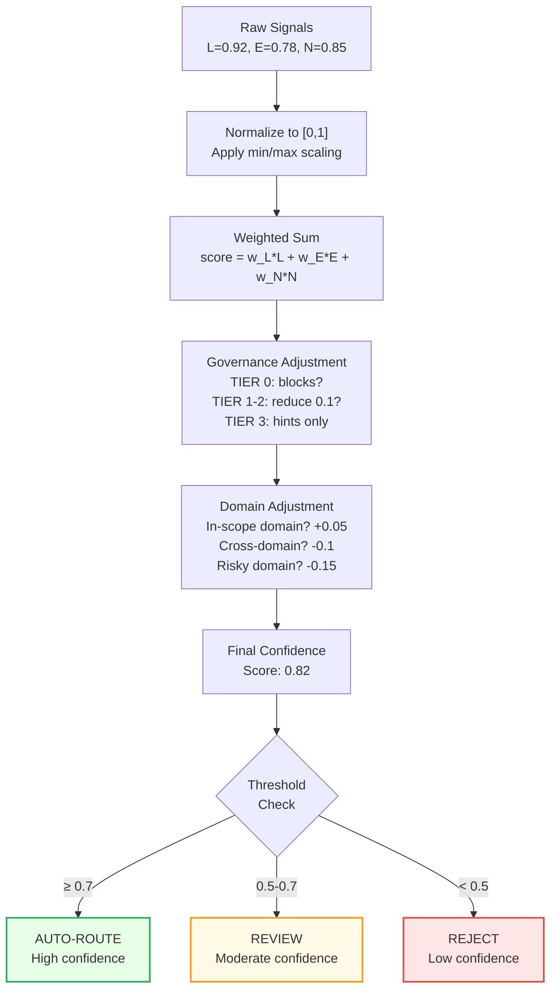
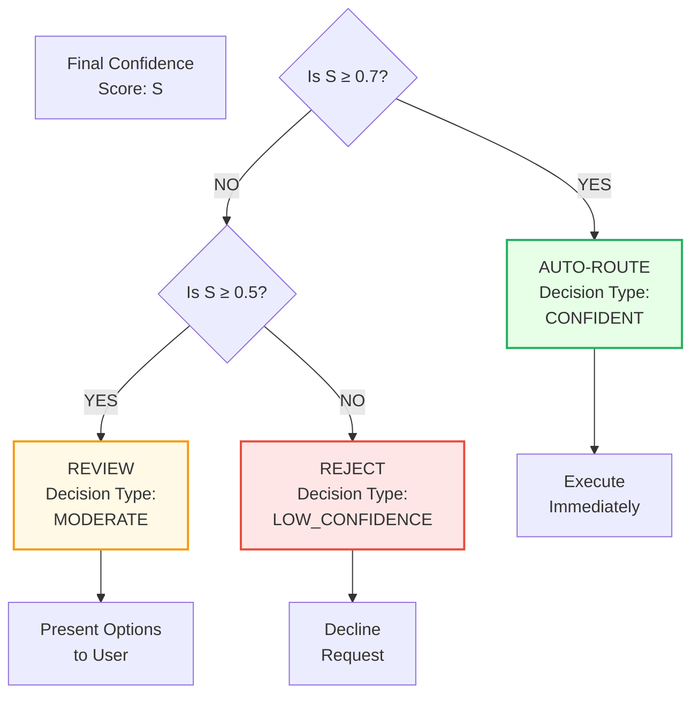

# Knowledge Synthesis & Governance Integration (Synthesis Layer)

## Overview

The Synthesis Layer aggregates signals from Language, Examination, and Navigation layers, applies governance rules, and integrates business domain context to produce final routing decisions with confidence scores.

## Synthesis Architecture



## Signal Aggregation



## Governance Rule Application (TIER 0-3)



## Governance Rule Examples

### TIER 0 Rule: CORE-008 (TDD First)

```
Rule ID: CORE-008
Name: Test-Driven Development
Severity: BLOCKED

Rule:
- Implementation code must have corresponding tests
- Tests must be created BEFORE implementation
- Red → Green → Refactor cycle mandatory

Synthesis Application:
Input: Operation to implement new function
Check: Does test file exist?
- YES → Allow routing
- NO → Request test creation first
```

### TIER 0 Rule: CORE-013 (No Bare Except)

```
Rule ID: CORE-013
Name: Specific Exception Handling
Severity: STRICT

Rule:
- No bare except: clauses
- All exceptions must be specific types
- Fallback exceptions allowed only in specific contexts

Synthesis Application:
Input: Code contains "except:"
Check: Is this a known exception type?
- YES → Allow
- NO → REJECT with guidance
```

### TIER 2 Rule: Context-Aware Execution

```
Rule ID: CONTEXT-AWARE-001
Name: Context-Aware Orchestration
Severity: MODERATE

Rule:
- Operations in PHASE_E must include tests
- Refactoring only in designated code areas
- Deployments require approval

Synthesis Application:
Input: Refactoring operation, PHASE_E execution context
Check: Is refactoring allowed in PHASE_E?
- YES → Require test coverage
- NO → Suggest deferring to next phase
```

## Domain Brain Integration



## Confidence Calculation Algorithm



## Configuration: Signal Weights

```yaml
synthesis_engine:
  signal_weights:
    language: 0.35      # Language intent strength
    examination: 0.30   # Code quality signals
    navigation: 0.20    # Historical patterns
    governance: 0.10    # Rule compliance
    domain: 0.05        # Business context
    
  governance_adjustments:
    tier_0_violation: -1.0        # Hard block
    tier_1_violation: -0.15       # Reduce by 15%
    tier_2_violation: -0.10       # Reduce by 10%
    tier_3_suggestion: -0.05      # Reduce by 5%
    
  domain_adjustments:
    in_scope: +0.05
    cross_domain: -0.10
    high_risk: -0.15
    new_domain: -0.20
    
  confidence_thresholds:
    auto_route: 0.70    # Auto-execute
    review: 0.50        # Request clarification
    reject: 0.00        # Too low
```

## Implementation: Synthesizer

```python
class Synthesizer:
    """
    Aggregates all LENS signals and applies governance rules
    to produce routing decisions.
    """
    
    def synthesize(self, 
                  language_signals: IntentSignals,
                  examination_signals: ExaminationSignals,
                  navigation_signals: NavigationSignals) -> SynthesisResult:
        """
        Synthesize all signals into routing decision.
        
        Args:
            language_signals: Intent classification results
            examination_signals: AST analysis results
            navigation_signals: Git history results
            
        Returns:
            SynthesisResult with confidence score and routing decision
        """
        # 1. Normalize signals
        normalized = self._normalize_signals(
            language_signals,
            examination_signals,
            navigation_signals
        )
        
        # 2. Apply weights
        weighted_score = self._apply_weights(normalized)
        
        # 3. Apply governance rules
        governed_score = self._apply_governance(weighted_score)
        
        # 4. Enrich with domain context
        enriched_score = self._enrich_domain(governed_score)
        
        # 5. Calculate final confidence
        final_score = self._calculate_confidence(enriched_score)
        
        # 6. Make routing decision
        decision = self._make_decision(final_score)
        
        return SynthesisResult(
            score=final_score,
            decision=decision,
            reasoning=self._generate_reasoning(final_score)
        )
    
    def _apply_governance(self, score: float) -> float:
        """
        Apply TIER 0-3 governance rules.
        
        TIER 0: Hard blocks (multiply by 0.0)
        TIER 1-2: Soft penalties (reduce by percentage)
        TIER 3: Guidance only (no scoring change)
        """
        registry = GovernanceRegistry.instance()
        
        # Check TIER 0 (immutable rules)
        violations_tier0 = registry.check_tier0(self.operation)
        if violations_tier0:
            return 0.0  # Hard block
        
        # Check TIER 1-2 (soft constraints)
        violations_tier1 = registry.check_tier1(self.operation)
        violations_tier2 = registry.check_tier2(self.operation)
        
        penalty = 0.0
        penalty += len(violations_tier1) * 0.15
        penalty += len(violations_tier2) * 0.10
        
        return max(0.0, score - penalty)
```

## Routing Decision Logic



## Test Coverage

- **Signal Aggregation**: Combine signals correctly
- **Governance Application**: All TIER 0-3 rules enforced
- **Domain Enrichment**: Business context properly applied
- **Confidence Calculation**: Score bounds [0, 1]
- **Threshold Logic**: Correct routing decisions
- **Edge Cases**: No confidence signals, conflicting rules

## Related Documentation

- [LENS Overview](01-lens-overview.md)
- [Intent Classification](02-intent-classification.md)
- [AST Analysis](03-ast-analysis.md)
- [Git Navigation](04-git-navigation.md)
- [Governance Rules](../04-architecture/governance-rules.md)
- [Domain Brain](../04-architecture/4-domain-brain.md)
