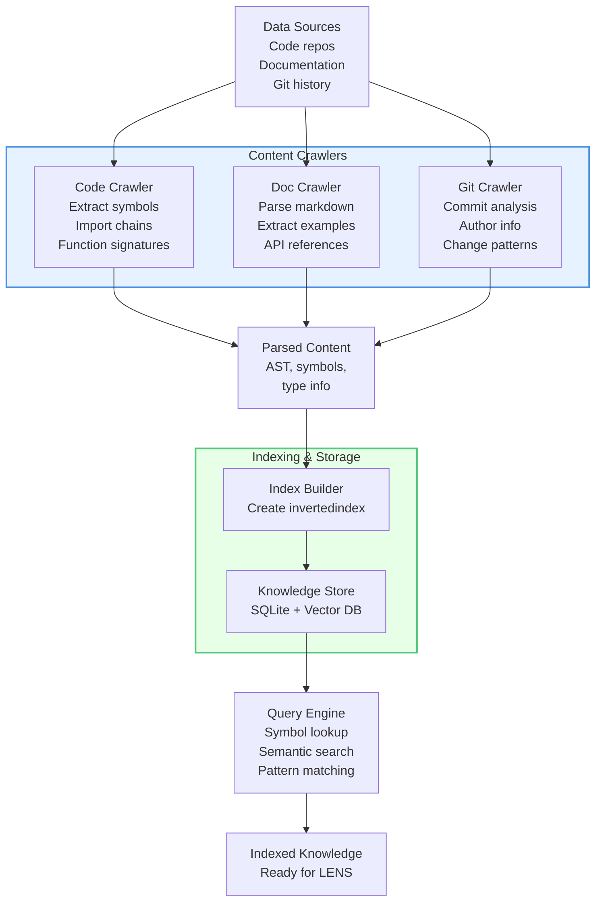
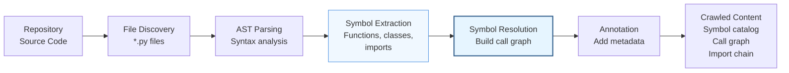
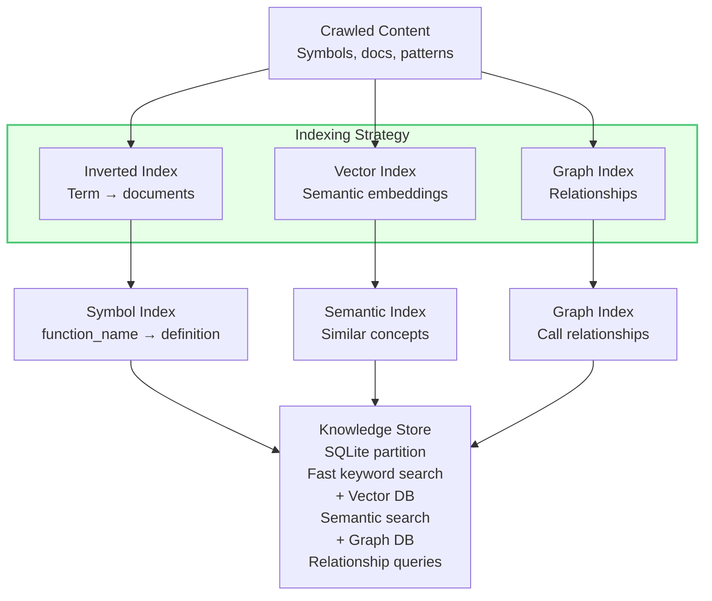
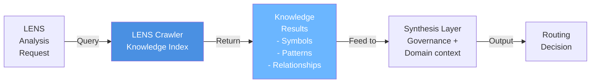
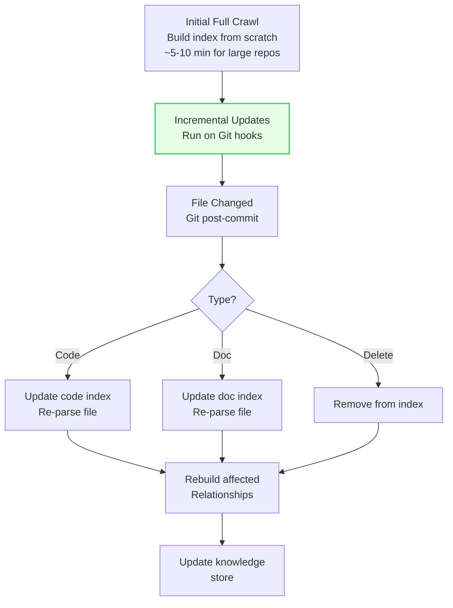

# LENS Crawler Implementation

## Overview

The LENS Crawler is the content extraction and indexing system that feeds knowledge into the synthesis layer. It crawls repositories, extracts semantic information, and indexes it for rapid retrieval during intent analysis.

## Crawler Architecture



## Code Crawler Pipeline



## Knowledge Indexing



## Query Patterns

### Pattern 1: Symbol Lookup

```
Query: "Find definition of IntentClassifier"

Process:
1. Search inverted index: IntentClassifier → documents
2. Found: cortex/intent_router/classifier.py:45
3. Fetch: Class definition with full metadata

Result:
{
  name: "IntentClassifier",
  type: "class",
  file: "cortex/intent_router/classifier.py",
  line: 45,
  methods: [...],
  docstring: "Multi-label intent classification...",
  test_file: "tests/unit/intent_router/test_classifier.py"
}
```

### Pattern 2: Semantic Search

```
Query: "Find modules related to routing"

Process:
1. Embed query: "routing" → vector
2. Search vector index: cosine_similarity > 0.7
3. Find related documents: routing_engine.py, router.py, ...

Result:
{
  matches: [
    {module: "routing_engine.py", relevance: 0.95},
    {module: "router.py", relevance: 0.89},
    {module: "orchestrator.py", relevance: 0.76}
  ]
}
```

### Pattern 3: Relationship Query

```
Query: "Find all callers of GovernanceRegistry.check()"

Process:
1. Search graph: GovernanceRegistry.check() node
2. Find incoming edges (callers)
3. Traverse relationships

Result:
{
  callers: [
    "MasterOrchestrator.coordinate_operation",
    "Synthesizer.synthesize",
    "IntentRouter.route"
  ]
}
```

## Crawler Implementation

```python
class LENSCrawler:
    """
    Unified crawler for code, documentation, and Git history.
    Builds knowledge indexes for LENS synthesis layer.
    """
    
    def crawl_repository(self, repo_path: str) -> KnowledgeIndex:
        """
        Crawl entire repository and build knowledge index.
        
        Args:
            repo_path: Path to repository root
            
        Returns:
            KnowledgeIndex with all crawled content
        """
        # 1. Discover all files
        files = self._discover_files(repo_path)
        
        # 2. Crawl code
        code_content = self._crawl_code(files)
        
        # 3. Crawl documentation
        doc_content = self._crawl_documentation(files)
        
        # 4. Crawl Git history
        git_content = self._crawl_git_history(repo_path)
        
        # 5. Build indexes
        inverted_index = self._build_inverted_index(
            code_content + doc_content
        )
        vector_index = self._build_vector_index(
            code_content + doc_content
        )
        graph_index = self._build_graph_index(code_content)
        
        # 6. Store
        store = KnowledgeStore(
            inverted=inverted_index,
            vector=vector_index,
            graph=graph_index
        )
        
        return store
    
    def _crawl_code(self, files: List[str]) -> List[ParsedModule]:
        """Crawl code files and extract symbols."""
        modules = []
        
        for file_path in files:
            if not file_path.endswith('.py'):
                continue
            
            try:
                with open(file_path) as f:
                    source = f.read()
                
                # Parse AST
                tree = ast.parse(source)
                
                # Extract symbols
                symbols = self._extract_symbols(tree, file_path)
                
                # Resolve references
                references = self._resolve_references(tree, symbols)
                
                module = ParsedModule(
                    file_path=file_path,
                    symbols=symbols,
                    references=references
                )
                modules.append(module)
                
            except Exception as e:
                self.logger.warning(f"Failed to crawl {file_path}: {e}")
        
        return modules
    
    def _crawl_documentation(self, files: List[str]) -> List[DocContent]:
        """Crawl documentation files."""
        docs = []
        
        for file_path in files:
            if not file_path.endswith('.md'):
                continue
            
            with open(file_path) as f:
                content = f.read()
            
            # Parse markdown
            parsed = self._parse_markdown(content)
            
            # Extract code examples
            examples = self._extract_code_examples(parsed)
            
            # Extract links
            links = self._extract_links(parsed)
            
            doc = DocContent(
                file_path=file_path,
                title=parsed.title,
                sections=parsed.sections,
                examples=examples,
                links=links
            )
            docs.append(doc)
        
        return docs
    
    def _build_vector_index(self, content: List) -> VectorIndex:
        """Build semantic embeddings index."""
        embeddings = []
        
        for item in content:
            # Create searchable text
            text = self._create_searchable_text(item)
            
            # Embed
            vector = self.embedding_model.encode(text)
            
            embeddings.append({
                'id': item.id,
                'vector': vector,
                'source': item
            })
        
        # Create index (e.g., FAISS)
        return VectorIndex(embeddings)
```

## Integration with LENS



## Incremental Crawling



## Performance Considerations

| Operation | Time | Notes |
|-----------|------|-------|
| **Initial Crawl** | 5-10 min | Full repository, large repos |
| **Incremental Update** | <100ms | Single file change |
| **Symbol Lookup** | <10ms | Inverted index lookup |
| **Semantic Search** | <200ms | Vector similarity search |
| **Graph Query** | <50ms | Relationship traversal |

## Configuration

```yaml
lens_crawler:
  code_crawler:
    include_patterns:
      - "**/*.py"
    exclude_patterns:
      - "**/test_*.py"
      - "**/__pycache__/**"
    
  doc_crawler:
    include_patterns:
      - "docs/**/*.md"
    extract_examples: true
    
  indexing:
    inverted_index: true
    vector_index: true
    vector_model: "sentence-transformers/all-MiniLM-L6-v2"
    graph_index: true
    
  updates:
    incremental: true
    git_hooks: true
    watch_interval: 5  # seconds
```

## Related Documentation

- [LENS Overview](01-lens-overview.md)
- [Intent Classification](02-intent-classification.md)
- [Knowledge Synthesis](05-knowledge-synthesis.md)
- [Domain Brain Integration](07-domain-brain-integration.md)
