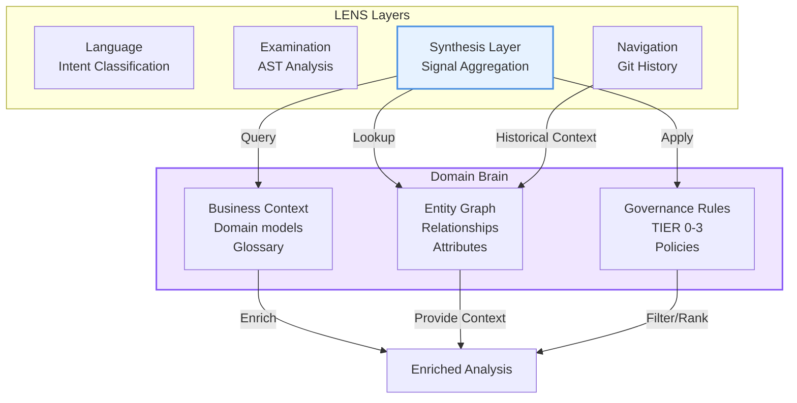
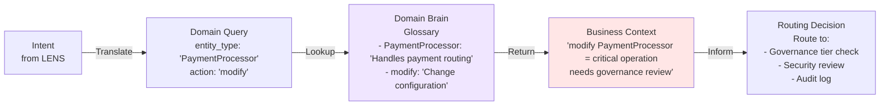
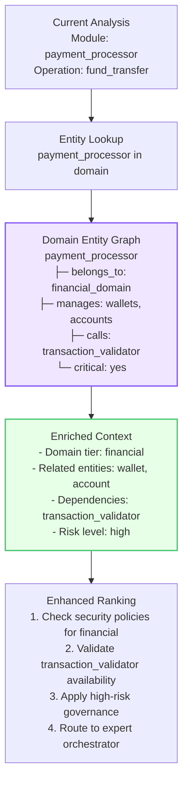
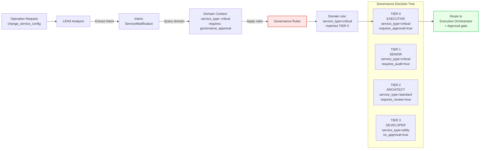
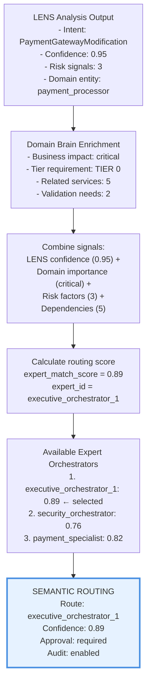

# LENS Domain Brain Integration

## Overview

The Domain Brain is CORTEX's business context layer. LENS integrates with it to enrich analyses with domain-specific knowledge, semantic routing rules, and governance policies.

## Integration Architecture



## Business Context Integration



## Entity Graph Integration



## Governance-Enhanced Routing



## Semantic Routing Decision



## Implementation

```python
class DomainBrainIntegration:
    """
    Integration layer connecting LENS synthesis with Domain Brain.
    Provides business context, governance rules, and entity enrichment.
    """
    
    def enrich_analysis(
        self, 
        lens_analysis: LENSAnalysis
    ) -> EnrichedAnalysis:
        """
        Enrich LENS analysis with domain context.
        
        Args:
            lens_analysis: Output from LENS synthesis layer
            
        Returns:
            EnrichedAnalysis with domain context, governance rules applied
        """
        # 1. Extract domain entities from analysis
        entities = self._extract_domain_entities(lens_analysis)
        
        # 2. Lookup in domain brain
        domain_context = self.domain_brain.lookup_entities(entities)
        
        # 3. Build entity graph for relationships
        entity_graph = self._build_entity_graph(domain_context)
        
        # 4. Apply governance rules
        governance_decision = self._apply_governance_rules(
            lens_analysis, 
            domain_context
        )
        
        # 5. Calculate semantic routing score
        orchestrator_score = self._calculate_orchestrator_match(
            lens_analysis,
            domain_context,
            governance_decision
        )
        
        return EnrichedAnalysis(
            original_analysis=lens_analysis,
            domain_context=domain_context,
            entity_graph=entity_graph,
            governance_decision=governance_decision,
            orchestrator_recommendations=orchestrator_score
        )
    
    def _extract_domain_entities(
        self, 
        analysis: LENSAnalysis
    ) -> List[DomainEntity]:
        """
        Extract domain entities from LENS analysis results.
        
        Maps:
        - LENS entities → domain entity types
        - LENS relationships → domain relationships
        - LENS signals → domain risk levels
        """
        entities = []
        
        # Extract from intent classification
        for intent in analysis.intents:
            entity_type = self._map_intent_to_entity(intent)
            if entity_type:
                entities.append(entity_type)
        
        # Extract from AST analysis
        for symbol in analysis.symbols:
            entity_type = self._map_symbol_to_entity(symbol)
            if entity_type:
                entities.append(entity_type)
        
        # Extract from git analysis
        for author in analysis.authors:
            entity_type = self._map_author_to_entity(author)
            if entity_type:
                entities.append(entity_type)
        
        return entities
    
    def _apply_governance_rules(
        self,
        analysis: LENSAnalysis,
        domain_context: DomainContext
    ) -> GovernanceDecision:
        """
        Apply Domain Brain governance rules to LENS analysis.
        
        Maps LENS confidence → governance tier requirements:
        - High confidence (>0.85) + critical domain = TIER 0 approval
        - Medium confidence (>0.70) + important domain = TIER 1 review
        - Lower confidence + standard domain = TIER 2-3 checks
        """
        decision = GovernanceDecision()
        
        for entity in domain_context.entities:
            # Get entity tier requirement
            tier = entity.governance_tier
            
            # Match with LENS confidence
            confidence = analysis.overall_confidence
            
            # Apply rules
            if confidence > 0.85 and tier in ['CRITICAL', 'EXECUTIVE']:
                decision.required_tier = 'TIER 0'
                decision.requires_approval = True
                decision.requires_audit = True
                
            elif confidence > 0.70 and tier in ['IMPORTANT', 'HIGH']:
                decision.required_tier = 'TIER 1'
                decision.requires_approval = False
                decision.requires_audit = True
                
            else:
                decision.required_tier = 'TIER 2'
                decision.requires_review = True
        
        return decision
    
    def _calculate_orchestrator_match(
        self,
        analysis: LENSAnalysis,
        domain_context: DomainContext,
        governance_decision: GovernanceDecision
    ) -> List[OrchestratorMatch]:
        """
        Calculate semantic routing score for expert orchestrators.
        
        Combines:
        1. LENS confidence in intent (0-1)
        2. Domain entity match with orchestrator specialty (0-1)
        3. Governance tier requirement match (0-1)
        4. Current orchestrator load (0-1, lower is better)
        
        Score = (LENS_conf * 0.4) + 
                (domain_match * 0.35) + 
                (tier_match * 0.15) +
                ((1 - load) * 0.1)
        """
        matches = []
        
        for orchestrator in self.domain_brain.get_orchestrators():
            # Check if orchestrator handles this tier
            if governance_decision.required_tier not in orchestrator.handled_tiers:
                continue
            
            # Match LENS entities with orchestrator specialties
            domain_match = self._calculate_domain_match(
                domain_context.entities,
                orchestrator.specialties
            )
            
            # Match governance tier
            tier_match = 1.0 if governance_decision.required_tier in orchestrator.handled_tiers else 0.0
            
            # Get load
            load = orchestrator.get_current_load()
            
            # Calculate score
            score = (
                analysis.overall_confidence * 0.4 +
                domain_match * 0.35 +
                tier_match * 0.15 +
                (1.0 - load) * 0.1
            )
            
            matches.append(
                OrchestratorMatch(
                    orchestrator=orchestrator,
                    match_score=score,
                    reason={
                        'lens_confidence': analysis.overall_confidence,
                        'domain_match': domain_match,
                        'tier_match': tier_match,
                        'load_factor': 1.0 - load
                    }
                )
            )
        
        # Sort by score
        return sorted(matches, key=lambda m: m.match_score, reverse=True)
```

## Entity Graph Navigation

```python
class EntityGraphNavigator:
    """Navigate domain entity relationships for context enrichment."""
    
    def find_related_entities(
        self,
        entity: DomainEntity,
        max_depth: int = 2
    ) -> List[RelatedEntity]:
        """
        Find entities related to given entity up to max_depth.
        
        Used to understand:
        - Services that depend on this entity
        - Entities this entity depends on
        - Cross-domain relationships
        """
        related = []
        visited = set()
        queue = [(entity, 0)]
        
        while queue:
            current, depth = queue.pop(0)
            
            if current.id in visited or depth > max_depth:
                continue
            
            visited.add(current.id)
            
            # Get immediate relationships
            for rel in current.relationships:
                if rel.target.id not in visited:
                    related.append(rel)
                    queue.append((rel.target, depth + 1))
        
        return related
    
    def calculate_impact_radius(
        self,
        entity: DomainEntity
    ) -> ImpactRadius:
        """
        Calculate the blast radius of changes to an entity.
        
        Returns services, entities, and systems that could be affected
        by modifications to this entity.
        """
        direct_dependents = [
            r.source for r in entity.relationships 
            if r.type == 'DEPENDS_ON'
        ]
        
        indirect_dependents = []
        for dep in direct_dependents:
            indirect_dependents.extend(
                self.find_related_entities(dep, max_depth=1)
            )
        
        return ImpactRadius(
            direct_dependents=direct_dependents,
            indirect_dependents=indirect_dependents,
            total_impact_count=len(direct_dependents) + len(indirect_dependents),
            risk_level=self._calculate_risk(
                entity, 
                direct_dependents, 
                indirect_dependents
            )
        )
```

## Governance Rule Application

```python
class GovernanceRuleEngine:
    """Apply Domain Brain governance rules during routing."""
    
    def apply_routing_rules(
        self,
        analysis: LENSAnalysis,
        domain_entity: DomainEntity
    ) -> RoutingRules:
        """Apply governance rules for entity routing."""
        rules = RoutingRules()
        
        # Rule 1: Critical entities require TIER 0
        if domain_entity.criticality == 'CRITICAL':
            rules.required_tier = 'TIER 0'
            rules.approval_required = True
            rules.audit_required = True
        
        # Rule 2: High confidence overrides default tier
        if analysis.overall_confidence > 0.9:
            rules.priority = 'HIGH'
            rules.fast_track = True
        
        # Rule 3: Multiple risk signals require governance
        if len(analysis.risk_signals) > 2:
            rules.required_tier = max(rules.required_tier, 'TIER 1')
            rules.audit_required = True
        
        # Rule 4: Changes to dependent entities affect routing
        related = self.entity_graph.find_related_entities(domain_entity)
        if len(related) > 5:
            rules.requires_impact_analysis = True
        
        return rules
```

## Configuration

```yaml
domain_brain_integration:
  entity_enrichment:
    enabled: true
    max_entity_depth: 3
    cache_ttl_seconds: 3600
  
  governance_rules:
    enabled: true
    tier_mapping:
      CRITICAL:
        intent_confidence_threshold: 0.75
        required_tier: TIER 0
      IMPORTANT:
        intent_confidence_threshold: 0.65
        required_tier: TIER 1
      STANDARD:
        intent_confidence_threshold: 0.55
        required_tier: TIER 2
  
  semantic_routing:
    enabled: true
    match_algorithm: cosine_similarity
    confidence_weights:
      lens_confidence: 0.4
      domain_match: 0.35
      tier_match: 0.15
      load_factor: 0.1
  
  impact_analysis:
    calculate_blast_radius: true
    max_related_entities: 20
    risk_thresholds:
      high: 10
      medium: 5
      low: 1
```

## Related Documentation

- [LENS Overview](01-lens-overview.md)
- [Knowledge Synthesis](05-knowledge-synthesis.md)
- [LENS Crawler](06-lens-crawler.md)
- [Intent Classification](02-intent-classification.md)
