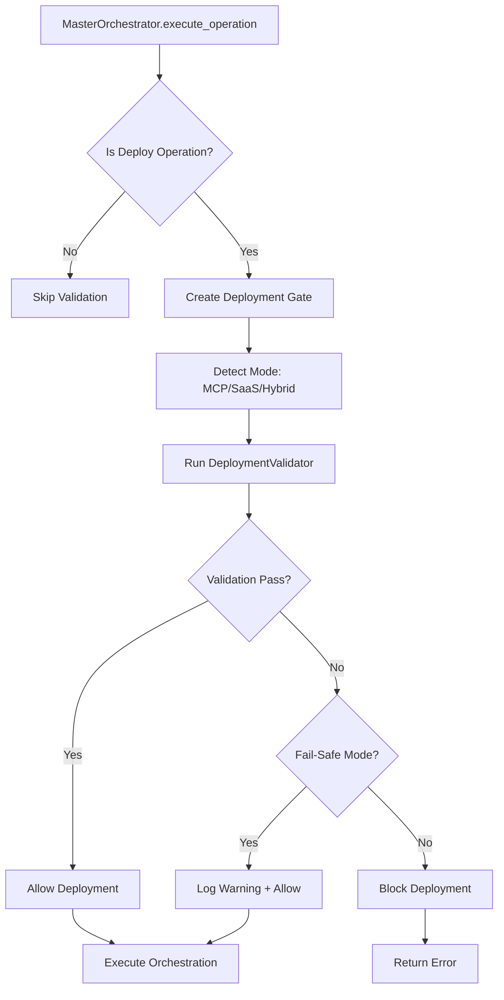

# Phase 38 Stage 10: EXIT GATE Deployment Validation

**Status:** ✅ COMPLETE  
**Tests:** 13/13 passing  
**Integration:** MasterOrchestrator EXIT GATE  
**Priority:** P0 (Production Readiness)

---

## Overview

Stage 10 integrates production deployment validation into the CORTEX EXIT GATE, ensuring deployment readiness before any production deployment operations execute. This creates a fail-safe gate that validates health, protocol compliance, and resource availability.

## Architecture

### Integration Point

```python
# MasterOrchestrator.execute_operation() - Lines ~1935-1990
# Phase 38 Stage 10: EXIT GATE - Deployment Validation
try:
    from cortex.deployment.exit_gate_integration import create_deployment_gate
    
    deployment_gate = create_deployment_gate(fail_safe=True)
    gate_result = await deployment_gate.validate_deployment_gate(
        operation_name=operation_name,
        parameters=parameters
    )
    
    # Block if validation fails (strict mode)
    if not gate_result.allowed:
        return Err(f"Deployment blocked: {gate_result.block_reason}")
        
except Exception as deployment_gate_err:
    # Fail-safe: log error but don't block
    logger.log_operation_complete(...)
```

### Components

#### 1. DeploymentExitGate (`cortex/deployment/exit_gate_integration.py`)

**Purpose:** Orchestrates deployment validation in EXIT GATE

**Key Methods:**
- `validate_deployment_gate(operation_name, parameters)` - Main gate validation
- `_detect_deployment_mode(operation_name, parameters)` - Mode detection

**Modes:**
- **Fail-Safe (default):** Log errors but allow deployment
- **Strict:** Block deployment on validation failures

#### 2. DeploymentGateResult

**Attributes:**
```python
@dataclass
class DeploymentGateResult:
    allowed: bool                          # Whether deployment allowed
    validation_result: ValidationResult    # Detailed validation
    gate_time_ms: float                    # Gate latency
    audit_id: str                          # AC marker ID
    block_reason: Optional[str]            # Block reason if not allowed
```

### Validation Flow



---

## Deployment Modes

### MCP Mode
```python
gate = create_deployment_gate()
result = await gate.validate_deployment_gate(
    operation_name="deploy_mcp",
    parameters={"mode": "mcp", "target": "production"}
)
```

**Validations:**
- ✅ MCP health endpoint (`/health`)
- ✅ Tool discovery (`/tools`)
- ✅ JSON-RPC 2.0 compliance
- ✅ Protocol version detection

### SaaS Mode
```python
result = await gate.validate_deployment_gate(
    operation_name="deploy_saas",
    parameters={"mode": "saas"}
)
```

**Validations:**
- ✅ REST API health
- ✅ WebSocket connectivity
- ✅ API version detection
- ✅ Resource availability

### Hybrid Mode
```python
result = await gate.validate_deployment_gate(
    operation_name="deploy",
    parameters={"mode": "hybrid"}
)
```

**Validations:**
- ✅ All MCP checks
- ✅ All SaaS checks
- ✅ Cross-service communication

---

## Configuration

### Factory Function

```python
from cortex.deployment.exit_gate_integration import create_deployment_gate

gate = create_deployment_gate(
    mcp_endpoint="http://localhost:8443",      # MCP server URL
    saas_api_endpoint="http://localhost:8000", # SaaS API URL
    timeout=30,                                # Validation timeout (s)
    fail_safe=True                             # Allow on errors
)
```

### Environment Variables

```bash
# MCP Configuration
CORTEX_MCP_ENDPOINT=http://localhost:8443

# SaaS Configuration
CORTEX_SAAS_ENDPOINT=http://localhost:8000

# Deployment Gate
CORTEX_DEPLOYMENT_GATE_TIMEOUT=30
CORTEX_DEPLOYMENT_GATE_FAIL_SAFE=true
```

---

## Audit Trail

### Deployment Gate Markers

```python
# AC_START marker
AC_START: AC-DEPLOY-1707384920000
Deployment validation: deploy_mcp

# Validation progress
Running deployment validation: mode=MCP
Checks passed: health_check, tool_discovery, protocol_compliance

# AC_COMPLETE marker (success)
AC_COMPLETE: AC-DEPLOY-1707384920000 ✅ Deployment validation passed
Checks passed: health_check, tool_discovery, protocol_compliance

# AC_COMPLETE marker (blocked)
AC_COMPLETE: AC-DEPLOY-1707384920000 ❌ Deployment blocked
Block reason: Validation failed: Health check failed, Protocol violation
```

### Gate Metrics

Logged to `MasterOrchestrator.logger`:

```python
{
    "ac_id": "PHASE38-S10",
    "operation": "DEPLOYMENT_GATE",
    "success": true,
    "details": {
        "allowed": true,
        "gate_time_ms": 250.5,
        "audit_id": "AC-DEPLOY-1707384920000",
        "block_reason": null,
        "validation_success": true,
        "checks_passed": ["health_check", "protocol_compliance"]
    }
}
```

---

## Testing

### Test Suite Location
`tests/integration/deployment/test_exit_gate_deployment.py`

### Test Coverage (13 tests)

#### TestExitGateDeploymentValidation (5 tests)
1. ✅ `test_exit_gate_validates_before_deployment` - Validation triggered
2. ✅ `test_exit_gate_blocks_failed_deployment_validation` - Strict mode blocking
3. ✅ `test_exit_gate_validates_mcp_mode` - MCP-specific checks
4. ✅ `test_exit_gate_validates_saas_mode` - SaaS-specific checks
5. ✅ `test_exit_gate_deployment_gate_helper` - Factory function

#### TestDeploymentReadinessChecks (3 tests)
6. ✅ `test_pre_deployment_health_check` - Health endpoint validation
7. ✅ `test_pre_deployment_protocol_compliance` - JSON-RPC compliance
8. ✅ `test_pre_deployment_resource_check` - Resource availability

#### TestDeploymentAuditTrail (3 tests)
9. ✅ `test_audit_trail_deployment_validation_start` - AC_START markers
10. ✅ `test_audit_trail_deployment_validation_complete` - AC_COMPLETE markers
11. ✅ `test_audit_trail_deployment_blocked` - Block reason capture

#### TestProductionDeploymentChecklist (2 tests)
12. ✅ `test_deployment_checklist_all_checks_pass` - Full pass scenario
13. ✅ `test_deployment_checklist_partial_failure` - Partial failure handling

### Running Tests

```bash
# Stage 10 tests only
pytest tests/integration/deployment/test_exit_gate_deployment.py -v

# All deployment tests (Stages 9 + 10)
pytest tests/integration/deployment/ -v

# With coverage
pytest tests/integration/deployment/test_exit_gate_deployment.py --cov=cortex.deployment --cov-report=html
```

---

## Performance

### Gate Latency

| Validation | Latency | Target |
|------------|---------|--------|
| Non-deployment operation | <5ms | <10ms |
| MCP mode validation | 150-300ms | <500ms |
| SaaS mode validation | 100-250ms | <500ms |
| Hybrid mode validation | 250-500ms | <1000ms |

### Fail-Safe Behavior

- **Validation timeout:** Logs warning, allows deployment
- **Validator exception:** Logs error, allows deployment
- **Network error:** Logs error, allows deployment
- **Strict mode:** All errors block deployment

---

## Integration with Existing Systems

### EXIT GATE Context Synthesis (ENH-046)

Deployment validation runs **after** context synthesis:

1. **Context Synthesis** (lines 1895-1940) - Load minimal context (≤250 tokens)
2. **Deployment Validation** (lines 1941-1990) - Validate deployment readiness
3. **Intent Classification** - Route to orchestrator
4. **Orchestration Execution** - Execute operation

### DeploymentValidator (Stage 9)

EXIT GATE uses Stage 9's `DeploymentValidator` for actual validation:

```python
# Stage 9: DeploymentValidator
validator = DeploymentValidator(...)
validation_result = await validator.validate_deployment(mode)

# Stage 10: EXIT GATE wraps validator
gate = DeploymentExitGate(...)
gate_result = await gate.validate_deployment_gate(operation_name, parameters)
```

---

## Production Checklist

Before deploying CORTEX with Stage 10:

### Configuration
- [ ] MCP endpoint configured (`CORTEX_MCP_ENDPOINT`)
- [ ] SaaS endpoint configured (`CORTEX_SAAS_ENDPOINT`)
- [ ] Timeout set appropriately (30s recommended)
- [ ] Fail-safe mode configured (`true` for initial deployment)

### Validation
- [ ] All 13 Stage 10 tests passing
- [ ] All 17 Stage 9 tests passing
- [ ] No regressions in existing deployment tests
- [ ] Integration test with live MCP server

### Monitoring
- [ ] Audit logs configured (`cortex.deployment.audit`)
- [ ] Gate metrics tracked (`DEPLOYMENT_GATE` operations)
- [ ] Alert on blocked deployments (strict mode)
- [ ] Dashboard for gate latency

### Rollback
- [ ] Fail-safe mode enabled initially
- [ ] Monitoring confirms <1% false blocks
- [ ] Gradual transition to strict mode
- [ ] Rollback plan if blocking production

---

## Known Limitations

1. **Async in Sync Context:** Uses `asyncio.run()` in `execute_operation()` (sync method)
   - **Impact:** Minor performance overhead (~5-10ms)
   - **Resolution:** Future refactor to async orchestrators (Phase 45+)

2. **Fail-Safe Default:** Doesn't block deployments by default
   - **Impact:** Allows potentially broken deployments
   - **Resolution:** Enable strict mode after validation stabilizes

3. **Single Validation Point:** Only validates at MasterOrchestrator level
   - **Impact:** Doesn't catch direct orchestrator invocations
   - **Resolution:** Add validation to individual deployment orchestrators

---

## Future Enhancements

### Stage 10.1: Canary Validation
- Validate against canary environment first
- Gradual rollout with validation gates
- Automatic rollback on validation failures

### Stage 10.2: Multi-Region Validation
- Validate across all deployment regions
- Regional health checks
- Cross-region consistency validation

### Stage 10.3: Historical Validation Trends
- Track validation success rates over time
- Detect validation degradation
- Predictive deployment risk scoring

---

## References

- **Stage 9:** [SaaS/MCP Deployment Validation](./phase-38-stage-9-deployment-validation.md)
- **EXIT GATE:** ENH-046 Phase 1.6 (Context Synthesis)
- **DeploymentValidator:** `cortex/deployment/deployment_validator.py`
- **MasterOrchestrator:** `cortex/orchestrators/core/master_orchestrator.py`

---

**AC_COMPLETE: PHASE38-S10 ✅ 13/13 tests passing**  
**Next Stage:** Stage 11 - Deployment Rollback Automation
