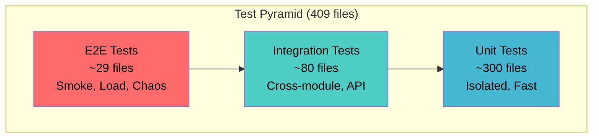
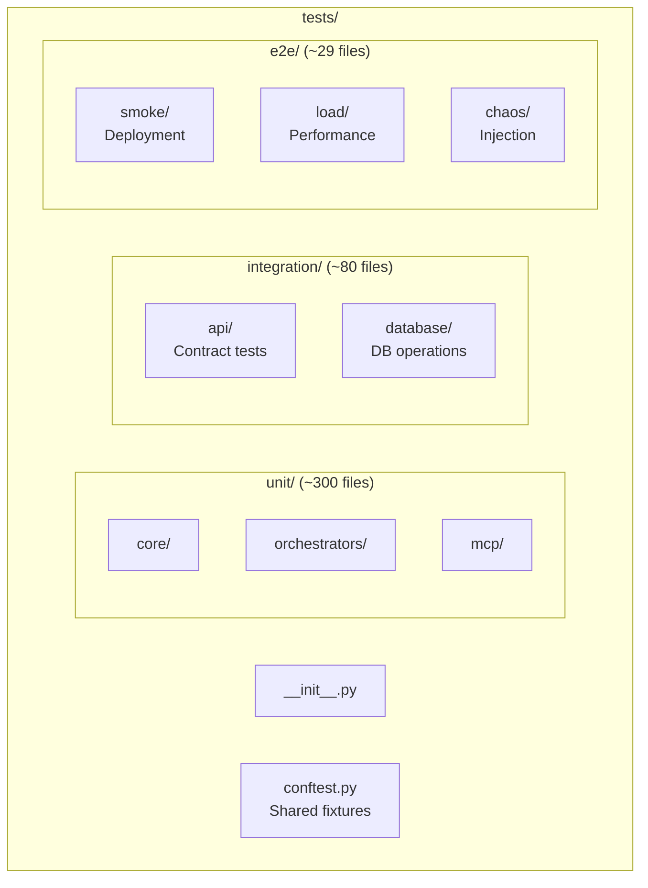

# Testing Strategy

> Auto-generated from cortex-impl-map.yaml on 2026-01-21

**Last Updated:** 2026-01-21  
**Audience:** Contributors, Developers

## Overview

CORTEX uses a test pyramid strategy with 409 test files covering 257 unique acceptance criteria (AC) IDs.

## Test Pyramid



## Coverage Targets

| Level | Target | Focus |
|-------|--------|-------|
| Unit | 90% | Functions, classes, methods |
| Integration | 80% | Module boundaries, APIs |
| E2E | 100% critical paths | User journeys, deployment |

## AC-ID Convention

Every test must reference an acceptance criterion:

```python
def test_governance_rule_enforcement():
    """
    Test governance rule enforcement.
    
    AC-ID: AC-GOV-001
    Phase: impl-governance-001-context-aware
    
    Verifies:
    - CORE-001 rule blocks >500 line responses
    - CORE-008 TDD requirement enforced
    """
    # Test implementation
```

### AC-ID Format

```
AC-{DOMAIN}-{NUMBER}

Domains:
- GOV: Governance
- ORCH: Orchestration
- MCP: MCP Protocol
- INT: Integration
- INF: Infrastructure
- SEC: Security
```

## Test Organization



## Fixtures (conftest.py)

### Shared Fixtures

```python
@pytest.fixture
def governance_db(tmp_path):
    """Temporary governance database."""
    db_path = tmp_path / "governance.db"
    # Setup
    yield db_path
    # Teardown

@pytest.fixture
def mock_orchestrator():
    """Mock orchestrator for unit tests."""
    return MagicMock(spec=BaseOrchestrator)

@pytest.fixture
def mcp_client():
    """MCP client for integration tests."""
    return MCPTestClient()
```

## Markers

```python
# pytest.ini markers
[pytest]
markers =
    slow: marks tests as slow (deselect with '-m "not slow"')
    integration: marks integration tests
    e2e: marks end-to-end tests
    governance: marks governance-related tests
    mcp: marks MCP protocol tests
```

### Using Markers

```python
@pytest.mark.slow
def test_full_orchestration_flow():
    """Slow test requiring full system."""
    pass

@pytest.mark.integration
def test_api_contract():
    """Integration test for API."""
    pass
```

## Running Tests

```powershell
# All tests
pytest tests/ -v

# Unit tests only
pytest tests/unit/ -v

# Integration tests only
pytest tests/integration/ -v

# By marker
pytest tests/ -m "not slow" -v
pytest tests/ -m "governance" -v

# With coverage
pytest tests/ --cov=cortex --cov-report=html

# Specific AC-ID (grep-based)
pytest tests/ -k "AC_GOV_001" -v
```

## Test Writing Guidelines

### 1. Arrange-Act-Assert

```python
def test_rule_validation():
    # Arrange
    rule = GovernanceRule(id="CORE-001", enforcement="BLOCKED")
    context = {"lines": 600}
    
    # Act
    result = rule.validate(context)
    
    # Assert
    assert not result.is_valid
    assert result.violation == "CORE-001"
```

### 2. One Assertion Per Test (preferred)

```python
def test_rule_blocks_large_response():
    result = validate_response(lines=600)
    assert not result.is_valid

def test_rule_allows_small_response():
    result = validate_response(lines=400)
    assert result.is_valid
```

### 3. Descriptive Names

```python
# Good
def test_governance_rule_blocks_response_exceeding_500_lines():
    pass

# Bad
def test_rule():
    pass
```

## CI Integration

Tests run in CI pipeline:

```yaml
# .github/workflows/test.yml
- name: Run Tests
  run: |
    pytest tests/unit/ -v --cov=cortex
    pytest tests/integration/ -v
    pytest tests/e2e/smoke/ -v
```

## Related

- [Test Pyramid Diagram](../_diagrams/test-pyramid.mmd)
- [Code Style Guide](4-code-style-guide.md)
- [CI/CD Pipeline](../_diagrams/ci-cd-pipeline.mmd)
