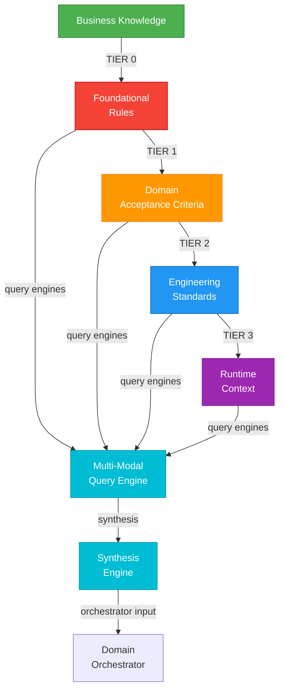

# Domain Brain Architecture

> **Summary:** Multi-tier knowledge architecture for business knowledge, query engines, and synthesis  
> **Authority:** cortex_brain/ | **Last Updated:** 2026-01-22

---

## Overview

Domain Brain provides structured knowledge management across TIER 0-3 with specialized query engines and synthesis capabilities for domain-specific orchestration.

**TIER Structure:**
- **TIER 0:** Immutable foundational rules and policies
- **TIER 1:** Domain-specific acceptance criteria and constraints
- **TIER 2:** Engineering standards and best practices
- **TIER 3:** Runtime context and dynamic policies

---

## Architecture



---

## Business Knowledge Repository

Centralizes business-facing knowledge:

```python
from cortex.brain.domain_brain.business_knowledge_repository import BusinessKnowledgeRepository

repo = BusinessKnowledgeRepository.instance()

# Query business knowledge
strategy = repo.get_business_strategy("feature_request_handling")
# Returns: {"priority": "HIGH", "approach": "..."}

# Search for relevant knowledge
docs = repo.search("authentication", domain="security")
```

---

## See Also

- [Domain Brain Overview](../01-cortex-brain/00-brain-index.md)
- [TIER 0 Governance](../01-cortex-brain/01-tier0-governance.md)
- [Source: cortex_brain/](../../../cortex_brain/)

---

**Author:** CORTEX Documentation Engine  
**Generated:** 2026-01-22  
