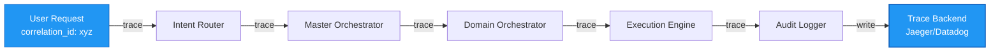

# Observability & Monitoring

> **Summary:** Distributed tracing, metrics, logging, and alerting  
> **Authority:** cortex/observability/ | **Last Updated:** 2026-01-22

---

## Overview

Comprehensive observability stack for production monitoring, performance analysis, and incident response.

**Components:**
- Distributed tracing with correlation IDs
- Prometheus metrics collection
- Structured logging to ELK stack
- Health check endpoints
- Alert routing

---

## Tracing Architecture

---

## See Also

- [Infrastructure & Resilience](12-infrastructure/00-infrastructure-index.md)
- [Source: cortex/observability/](../../../cortex/observability/)

---

**Author:** CORTEX Documentation Engine  
**Generated:** 2026-01-22
