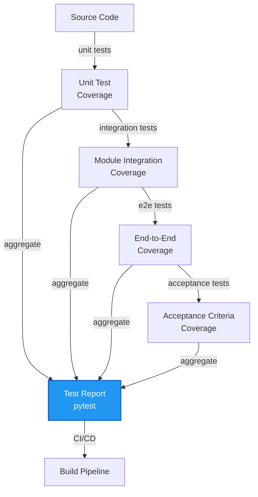

# Testing & Quality Assurance

> **Summary:** Test patterns, coverage requirements, and continuous quality validation  
> **Authority:** cortex/testing/ + tests/ | **Last Updated:** 2026-01-22

---

## Overview

Comprehensive testing strategy with 7000+ tests covering unit, integration, and end-to-end scenarios.

**Test Categories:**
- Unit tests (cortex/*/test_*.py)
- Integration tests (tests/unit/*/test_integration_*.py)
- End-to-end tests (tests/e2e/)
- Acceptance criteria tests (tests/ac_*/test_*.py)
- Performance tests (scripts/)

---

## Test Architecture

---

## See Also

- [Test Execution Strategy](../docs/TEST-EXECUTION-STRATEGY.md)
- [Source: tests/](../../../tests/)
- [Source: cortex/testing/](../../../cortex/testing/)

---

**Author:** CORTEX Documentation Engine  
**Generated:** 2026-01-22
