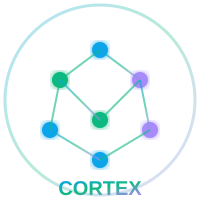

# CORTEX Centralized Assets

**Purpose:** Central location for all static assets (images, logos, icons) accessed by multiple documentation and deployment sites.

**Date:** 2026-01-21  
**Status:** ✅ Active

---

## Folder Structure

```
assets/
├── README.md                     # This file
└── images/                       # All image assets
    ├── CORTEX-logo-64.png       # Favicon size (6.4 KB)
    ├── CORTEX-logo-128.png      # Thumbnail size (21.6 KB)
    ├── cortex-logo-200.png      # Medium size (21.6 KB)
    ├── CORTEX-logo-512.png      # High resolution (292 KB)
    ├── CORTEX-logo.png          # Full resolution (1813.6 KB)
    ├── cortex-logo.svg          # Scalable vector (2.4 KB)
    └── cortex-logo-white.svg    # Dark mode variant (2.5 KB)
```

---

## Usage

### From `docs/` MkDocs Site

Reference in Markdown:
```markdown

```

Or in HTML:
```html

```

### From `cortex-gitpages/` Site

Reference in HTML:
```html

```

### Direct File References

```
d:\PROJECTS\CORTEX\assets\images\{filename}
```

---

## Asset Specifications

| File | Type | Size | Use Case |
|------|------|------|----------|
| `CORTEX-logo-64.png` | PNG | 6.4 KB | Favicon, browser tabs |
| `CORTEX-logo-128.png` | PNG | 21.6 KB | Social media thumbnails |
| `cortex-logo-200.png` | PNG | 21.6 KB | Medium displays |
| `CORTEX-logo-512.png` | PNG | 292 KB | High-resolution displays |
| `CORTEX-logo.png` | PNG | 1813.6 KB | Full resolution source |
| `cortex-logo.svg` | SVG | 2.4 KB | Scalable (recommended) |
| `cortex-logo-white.svg` | SVG | 2.5 KB | Dark mode variant |

---

## Governance

| Rule | Requirement | Status |
|------|-------------|--------|
| **Central location** | All assets in one place | ✅ |
| **Multi-site access** | Referenced by docs/ and cortex-gitpages/ | ✅ |
| **No duplicates** | Single source of truth | ✅ |
| **Relative paths** | No hardcoded absolute paths | ✅ |
| **Git tracked** | All files committed | ✅ |

---

## Accessing Assets

### For MkDocs Documentation

Add to `mkdocs.yml` or reference in markdown with relative paths:
```markdown

```

### For Static Sites (cortex-gitpages)

Reference with relative paths:
```html

```

---

## Adding New Assets

1. Place file in `assets/images/`
2. Update this README with file specifications
3. Commit and push to repository
4. Reference using relative paths from consuming site

---

**Last Updated:** 2026-01-21  
**Maintained By:** CORTEX System Agent
