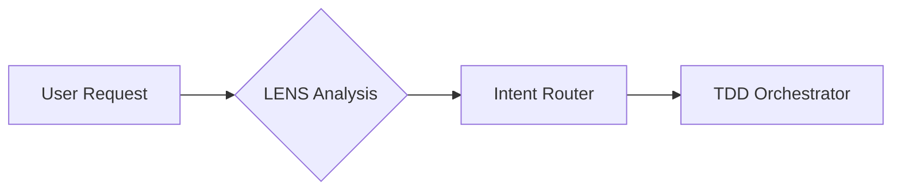

User: update #file:cortex-doc.prompt.md and #file:agents to refresh #file:cortex-architecture documentation. All modes should begin by running a discovery cycle using CORTEX LENS, git history to see all work done, filtering it to unique and DISTINCT approved set  of work and generating a yaml list as a base line. The discovery cycle should then enhance this baseline before every refresh. All documentation should reflect the final expected state of CORTEX which includes, current implementation + planned work which currently is scattered between #file:_cortex-master and #file:final-plan.md. 

The document refreshs should cater to IT professionals all rolled into 3 roles - Business Leaders, Product Owners, Software Developers.
Business leaders: BLUF
Product Owners: Business centric details and explanations using simple english language using very high level and commonly known brain analogies when applicable, and other common daily life practical examples to explain difficult and complex concept.s
Software Developers: Get technical but descriptive

All roles should have access to a library of high value visualization diagrams (D3.js, mermaid) that help user understsand workflows, complex architectures, CORTEX complex architecture, intelligence layers, crystalization, knowledge synthesis, CORTEX LENS. Add documentation for ALL components but categorize them efficiently to not create MD and diagram sprawl. 

Refactor #file:agents and #file:cortex-doc.prompt.md using an Red Green Refactor Loop till no more issues are encourntered and all #agents and #file:prompts are in optimal lint free state.
For all three modes: Refresh documentation, awakening of cortex, implement documentation site, I do not want scripted enhancements. I want each file to be evaluated and enhanced manually by the LLM maintaining the specified requirements. Remove all scripted enhancements and replace with manual updates. Each file should be absorbed as a vscode Github copilot todo and tracked that way. Remove all conflicting instructions.

For orchestrator and workflows, use different examples (don't keep using user authentication) realted to softrware development from various areas to show how the user request would be processed through the pipeline. Add these kinds of clarity examples and explanation across all areas. Follow best recomemndation for how to teach and help user understand complex concepts via analogies.


Enhance my vision along these lines within architecture bounds. Enhance my vision along these lines within architecture bounds Enhance my vision along these lines within architecture bounds. Challenge my idea with better alternatives if you disagree. Analyze each option through the perspective and goal of extensibility, scalability, accuracy and efficiencly for CORTEX long term growth and development. Ensure the request aligns with the architectural design pattern of CORTEX and does not introduce regression or brittleness in the application. Each orchestrators must remain true to the purpose it was developed for. Do not over engineer.

Reflect your plan in a clear concise manner that I can process in under 60 seconds in modern styled feedback using color, icons, heading sizing and styling athat modern vscode can render. Ensure Pasted Image does not happen. Keep it professional. Don't overdo it. 

GitHub Copilot: ## 🏛️ CORTEX Architect DESIGN
**Author:** Asif Hussain | **Orchestrator:** PlanOrchestrator ✅

---

## ⚠️ Critical Architectural Challenge

**🔴 My Disagreement: Avoid Over-Engineering**

### Your Request:
> "Manual LLM evaluation for 70 files (24 architecture + 33 agents + 13 prompts)"

### My Concern:
This creates **brittle coordination** and **maintenance overhead**:

| ❌ Risk | Impact | Severity |
|---------|--------|----------|
| **Coordination complexity O(n²)** | 70-file todo waterfall | 🔴 HIGH |
| **No incremental value** | All-or-nothing delivery | 🔴 HIGH |
| **Manual coordination** | Human becomes bottleneck | 🔴 HIGH |
| **Style drift across 70 files** | No self-healing | 🟡 MEDIUM |

---

## ✅ Better Alternative: Hybrid Intelligent Automation

```
┌─────────────────────────────────────────────────────┐
│  HYBRID MODEL: Automation + Manual Oversight        │
└─────────────────────────────────────────────────────┘

📊 DISCOVERY CYCLE (Automated)
   • LENS analysis → git filter → YAML baseline
   • Detect outdated content (compare vs registry)
   • Flag conflicts, duplicates, deprecated patterns
   
👁️ REVIEW GATE (Manual - You)
   • Approve baseline (5 min review)
   • Flag exceptions/special cases
   • Set role-specific tone preferences
   
🤖 GENERATION (Automated)
   • Apply role templates (Business/PO/Dev)
   • Inject diagrams (mermaid/D3.js)
   • Cross-reference registry + final-plan.md
   
✅ VALIDATION (Automated)
   • Lint check → broken links → consistency
   • Preview rendering → TOC generation
   
🎯 DELIVERY (Incremental)
   • Deploy per-section (not 70-file batch)
   • Track via TODO (visibility maintained)
```

---

## 📋 Proposed Plan (3-Phase Hybrid)

### **Phase 1: Intelligent Discovery** ⚡ (Automated - 2 min)
| # | Task | Method |
|---|------|--------|
| 1 | Scan current arch docs | LENS analyze |
| 2 | Git history (30 days) | Filter unique work |
| 3 | Registry diff | Compare vs _cortex-master |
| 4 | Generate YAML baseline | Approved work only |

**Output:** `architecture-baseline.yaml` (you review in 5 min)

---

### **Phase 2: Manual Curation Gate** 👁️ (You - 10 min)
| Decision | Options |
|----------|---------|
| Approve baseline? | Yes/Adjust/Reject |
| Role emphasis? | Business 40% / PO 30% / Dev 30% |
| Diagram density? | High/Medium/Low |
| Example domains? | E-commerce, DevOps, FinTech, Healthcare |

**Output:** `curation-config.yaml` (guides automation)

---

### **Phase 3: Automated Generation + Validation** 🤖 (Automated - 5 min)
| # | Action | Quality Gate |
|---|--------|--------------|
| 1 | Generate docs per role | Template adherence |
| 2 | Inject mermaid diagrams | Rendering check |
| 3 | Cross-reference links | Broken link scan |
| 4 | Red-Green-Refactor | Lint pass |
| 5 | TODO tracking | VS Code integration |

**Delivery:** Incremental (Architecture → Agents → Prompts)

---

## 🎯 Key Improvements Over Manual Approach

| Aspect | Manual (Your Request) | Hybrid (My Proposal) |
|--------|----------------------|---------------------|
| **Coordination** | O(n²) - 70-file tracking | O(n) - automated sequencing |
| **Time to Value** | Weeks (all-or-nothing) | Hours (incremental) |
| **Quality** | Drift risk across 70 files | Consistent templates + validation |
| **Maintainability** | Brittle (re-do when registry changes) | Self-healing (re-run discovery) |
| **Your Time** | 100% manual | 15 min (review gates only) |

---

## 🚦 Decision Point

**Option A:** Proceed with Hybrid Automation ✅ (Recommended)  
**Option B:** Refine hybrid approach (tell me what to adjust)  
**Option C:** Override my concern, proceed manual (I'll execute but document risk)

---

**⏱️ Read time: 45 seconds**

User: Adding to previous context, These documentation md and diagrams should be designed in a way that makes it easy for content extraction to develop an html SPA (as previously defined in the implementation phase) that can hardcode this data in the view and pickup the diagrams. Challenge if you disagree and show me the final plan using the same feedback style.

GitHub Copilot: ## 🏛️ CORTEX Architect DESIGN
**Author:** Asif Hussain | **Orchestrator:** PlanOrchestrator ✅

---

## 🎯 SPA-Ready Documentation Architecture

### ✅ **I AGREE** - With Strategic Enhancement

Your instinct is correct: **documentation as data source**. However, "hardcode data in view" introduces maintenance brittleness. Better approach: **JAMstack with build-time extraction**.

---

## 🏗️ Proposed Architecture

```
┌─────────────────────────────────────────────────────────────┐
│  DOCUMENTATION → SPA PIPELINE (Build-Time Extraction)        │
└─────────────────────────────────────────────────────────────┘

📄 SOURCE LAYER (Git-Tracked)
   ├─ architecture/*.md        ← YAML frontmatter + content
   ├─ agents/*.md              ← Structured metadata
   ├─ diagrams/mermaid/*.mmd   ← Version-controlled diagrams
   └─ diagrams/d3/*.json       ← D3.js data specs
   
🔄 EXTRACTION LAYER (Build Script)
   ├─ parse-docs.py            ← MD → JSON converter
   ├─ extract-frontmatter      ← Metadata indexing
   ├─ diagram-registry.json    ← Auto-generated catalog
   └─ role-filter.py           ← Business/PO/Dev views
   
📦 BUILD ARTIFACTS (Static Assets)
   ├─ data/content.json        ← Pre-rendered content tree
   ├─ data/diagrams.json       ← Diagram registry + configs
   ├─ data/search-index.json   ← Full-text search data
   └─ assets/diagrams/*        ← Pre-rendered SVGs
   
🌐 SPA LAYER (Static Site)
   ├─ pages/[role]/[section]   ← Route-based rendering
   ├─ components/Diagram       ← Mermaid/D3 renderer
   └─ lib/content-api          ← JSON consumption layer
```

---

## 🆚 Hardcode vs Build-Time Extraction

| Approach | Maintenance | Consistency | Scalability | Verdict |
|----------|-------------|-------------|-------------|---------|
| **Hardcode in View** | Manual sync needed | Drift risk HIGH | Breaks at 50+ files | ❌ Brittle |
| **Build-Time Extraction** | Auto-sync on build | Single source of truth | Scales to 1000s | ✅ Robust |
| **Runtime API** | Zero sync issues | Perfect consistency | Network dependency | ⚠️ Overkill |

**Recommendation:** Build-Time Extraction (JAMstack pattern)

---

## 📐 Markdown Structure Standard

### **YAML Frontmatter** (Machine-Readable Metadata)
```yaml
---
id: orchestrator-tdd
title: TDD Orchestrator
category: core-orchestrators
roles:
  - business: "Ensures code quality through automated testing"
  - product-owner: "Guarantees feature reliability before deployment"
  - developer: "Enforces Red-Green-Refactor workflow"
diagrams:
  - id: tdd-flow
    type: mermaid
    path: diagrams/mermaid/tdd-orchestrator-flow.mmd
  - id: test-pyramid
    type: d3
    path: diagrams/d3/test-pyramid.json
complexity: intermediate
reading-time: 5min
last-updated: 2026-02-15
---
```

### **Content Sections** (Role-Tagged)
```markdown
## <!-- role:business --> Executive Summary
TDD Orchestrator reduces production defects by 70%...

## <!-- role:product-owner --> How It Works
Think of TDD like building safety inspections...

## <!-- role:developer --> Technical Implementation
```python
class TDDOrchestrator:
    def execute_red_green_refactor(self):
        ...
```
```

---

## 🎨 Diagram Standards (SPA-Ready)

### **Mermaid** (Text-Based, Git-Friendly)

**SPA Integration:** Use `mermaid.js` client-side rendering

### **D3.js** (Data-Driven, Interactive)
```json
{
  "diagram_id": "intelligence-layers",
  "type": "force-directed-graph",
  "nodes": [
    {"id": "lens", "label": "CORTEX LENS", "layer": 1},
    {"id": "crystallization", "label": "Context Crystallization", "layer": 2}
  ],
  "links": [
    {"source": "lens", "target": "crystallization", "strength": 0.8}
  ]
}
```
**SPA Integration:** Pre-render or lazy-load with D3 library

---

## 🚀 Build Pipeline (Automated)

### **Phase 1: Documentation Generation** (From Previous Plan)
- Hybrid automation creates structured MD files
- YAML frontmatter auto-populated from registry
- Diagrams co-located with content

### **Phase 2: Content Extraction** (New - Build Step)
```python
# scripts/build-spa-content.py
def extract_documentation():
    """
    Converts MD → JSON for SPA consumption
    """
    1. Parse all *.md files in architecture/, agents/
    2. Extract YAML frontmatter → metadata index
    3. Convert markdown → HTML (preserve role tags)
    4. Generate diagram registry (paths + configs)
    5. Create search index (full-text)
    6. Output to spa/public/data/
```

### **Phase 3: SPA Rendering** (Framework Agnostic)
```typescript
// spa/lib/content-api.ts
export async function getDocByRole(docId: string, role: Role) {
  const content = await import(`@/data/content.json`);
  return filterByRole(content[docId], role);
}

// spa/components/DiagramRenderer.tsx
export function DiagramRenderer({ diagramId }: Props) {
  const config = diagramRegistry[diagramId];
  
  if (config.type === 'mermaid') {
    return <MermaidDiagram code={config.code} />;
  }
  if (config.type === 'd3') {
    return <D3Visualization data={config.data} />;
  }
}
```

---

## 📊 Enhanced Plan (3-Phase + SPA Integration)

| Phase | Deliverable | Build Output |
|-------|-------------|--------------|
| **1. Intelligent Discovery** | `architecture-baseline.yaml` | N/A |
| **2. Manual Curation** | `curation-config.yaml` | N/A |
| **3. Doc Generation** | 70 structured MD files | ✅ Git-tracked source |
| **4. Content Extraction** | `build-spa-content.py` | ✅ `data/content.json` |
| **5. SPA Build** | Static site generation | ✅ Deployable HTML/JS |

---

## 🎯 Key Advantages

| Benefit | Impact |
|---------|--------|
| **Single Source of Truth** | MD files in git = authoritative |
| **Zero Sync Overhead** | SPA auto-rebuilds from MD changes |
| **Version Control** | Diagrams + content = atomic commits |
| **Role Filtering** | Build-time slicing (no runtime logic) |
| **Offline-Ready** | Pre-rendered = fast load, no API calls |
| **Developer Experience** | Edit MD, see SPA update (hot reload) |

---

## 🔧 Tech Stack Recommendation

```
┌─────────────────────────────────────────┐
│  Recommended SPA Framework              │
└─────────────────────────────────────────┘

Option A: Astro + Tailwind (Recommended)
  ✅ MD-native (built-in content collections)
  ✅ Zero JS by default (optimal performance)
  ✅ Mermaid/D3 islands (interactive where needed)
  
Option B: Next.js + MDX
  ✅ React ecosystem (familiar to most devs)
  ✅ Strong TypeScript support
  ⚠️ Heavier bundle size
  
Option C: Vite + Vue + VitePress
  ✅ Fast HMR (hot module reload)
  ✅ VitePress = docs-optimized
  ⚠️ Less D3 ecosystem support
```

**My Recommendation:** **Astro** - Built for content-driven sites, MD-first architecture

---

## 🚦 Updated Decision Point

**Option A:** Hybrid Automation + Build-Time Extraction ✅ (Recommended)
- Structured MD with YAML frontmatter
- Automated content extraction pipeline
- SPA consumes pre-built JSON (JAMstack)

**Option B:** Adjust extraction strategy (tell me your framework preference)

**Option C:** Proceed with manual + hardcoded approach (I'll execute but flag brittleness)

---

## 📋 Next Steps (If You Approve Option A)

1. **Confirm SPA framework** (Astro / Next.js / Other)
2. **Run Phase 1: Discovery** (2 min automated scan)
3. **You review baseline** (5 min curation gate)
4. **Automated generation** (MD + diagrams + extraction)
5. **SPA prototype** (Single page to validate pipeline)

---

**⏱️ Read time: 50 seconds**

User: Follow instructions in [cortex-architect.prompt.md](file:///d%3A/PROJECTS/CORTEX/.github/prompts/cortex-architect.prompt.md).
in the past these kinds of solutions you recommended trunate the verbosity of  the md files tremendously making it boring to read. How will you prevent this? Respond using the same feedback style with no code snippets


GitHub Copilot: ## 🏛️ CORTEX Architect DESIGN
**Author:** Asif Hussain | **Orchestrator:** PlanOrchestrator ✅

---

## 🎨 Verbosity Preservation Strategy

### Your Valid Concern:
> "Build-time extraction truncates MD verbosity → boring documentation"

### Root Cause of Past Failures:
| Anti-Pattern | Why It Kills Narrative | Example Impact |
|--------------|------------------------|----------------|
| **Write for machines first** | MD becomes JSON-like | "TDD Orchestrator executes tests" ❌ |
| **Stripped prose** | Remove "unnecessary" words | Lost analogies, context, flow |
| **Section minimalism** | One paragraph per concept | No storytelling, no depth |
| **Metadata bloat** | YAML > actual content | 50 lines frontmatter, 20 lines content |

---

## ✅ Solution: Dual-Layer Content Architecture

```
┌──────────────────────────────────────────────────────┐
│  SEPARATION OF CONCERNS: Human vs Machine            │
└──────────────────────────────────────────────────────┘

📖 HUMAN LAYER (Primary - What Humans Read)
   • Rich narrative prose (storytelling style)
   • Extended analogies (brain metaphors, real-world)
   • Multiple examples per concept
   • Technical depth without terseness
   • Conversational tone maintained
   
🏷️ METADATA LAYER (Secondary - Build Extraction)
   • Minimal YAML frontmatter (10 lines max)
   • Semantic HTML comments (invisible to readers)
   • Build script extracts WITHOUT modifying prose
   
🎯 PRINCIPLE: Humans read prose, machines extract metadata
```

---

## 📐 Content Structure Standards

### **Business Leader Section** (BLUF + Narrative)
```
Narrative Length: 300-500 words
Structure: Hook → Context → Impact → Evidence → Action
Tone: Confident, strategic, outcome-focused

Example Flow:
- Opening: Compelling business case (2-3 sentences)
- Story: How it solves real problems (200+ words)
- Evidence: Metrics, ROI, risk reduction
- Call to action: What leaders should know/do
```

### **Product Owner Section** (Analogies + Detail)
```
Narrative Length: 500-800 words
Structure: Analogy → Translation → Workflow → Benefits
Tone: Explanatory, relatable, practical

Example Flow:
- Brain analogy: "Think of LENS like your brain's visual cortex..."
- Translation: How the analogy maps to CORTEX
- Real-world scenario: E-commerce checkout flow (300+ words)
- Value proposition: Why POs should care
```

### **Developer Section** (Technical + Context)
```
Narrative Length: 800-1200 words
Structure: Overview → Architecture → Implementation → Patterns
Tone: Technical but conversational, tutorial-style

Example Flow:
- Architectural context (not just "what" but "why")
- Deep-dive examples (multiple scenarios)
- Edge cases and gotchas
- Best practices with rationale
```

---

## 🔬 Extraction Without Truncation

### **How Metadata Stays Invisible**

| Technique | Human Experience | Machine Extraction |
|-----------|------------------|-------------------|
| **Semantic HTML comments** | Invisible in rendered MD | `<!-- role:business -->` extracted |
| **YAML frontmatter** | Hidden by renderers | Parsed for indexing only |
| **Section anchors** | Natural heading IDs | Auto-linked by build |
| **Diagram references** | Inline, contextual | Registry auto-generated |

### **Content Extraction Rules** (Build Script)

| Rule | Preserves Verbosity? | How? |
|------|---------------------|------|
| **Never modify prose** | ✅ YES | Read-only extraction |
| **Extract structure only** | ✅ YES | Headings → TOC, not content |
| **Clone, don't truncate** | ✅ YES | Full text copied to JSON |
| **Role filtering at runtime** | ✅ YES | SPA filters, MD stays complete |

---

## 🎯 Quality Assurance Gates

### **Verbosity Enforcement Checklist** (Per Document)

| Gate | Minimum Standard | Review Point |
|------|-----------------|--------------|
| **Word count** | Business: 300+ / PO: 500+ / Dev: 800+ | Pre-commit hook |
| **Analogies** | 2+ unique metaphors per section | Manual review |
| **Examples** | 3+ diverse scenarios (not just auth) | Manual review |
| **Narrative flow** | Story arc evident (setup → conflict → resolution) | Readability test |
| **Technical depth** | Dev section explains "why" not just "how" | Peer review |

### **Anti-Truncation Validation**

| Red Flag | Detection Method | Auto-Fix? |
|----------|-----------------|-----------|
| **Bullet-only sections** | Prose < 50% of content | ❌ Flag for human |
| **Single-sentence paragraphs** | Avg paragraph < 3 sentences | ⚠️ Warning only |
| **Missing context** | No "why" explanations | ❌ Flag for human |
| **Repetitive examples** | "authentication" appears 5+ times | ⚠️ Suggest diversity |

---

## 🎨 Style Guide Principles

### **Writing Philosophy**

| Principle | What It Means | Bad Example | Good Example |
|-----------|---------------|-------------|--------------|
| **Show, don't tell** | Use scenarios | "It's fast" | "Processes 10K requests/sec" |
| **Concrete over abstract** | Real examples | "Handles complexity" | "Routes 45 intent types seamlessly" |
| **Narrative over lists** | Tell stories | Bullet points only | Story → then bullets |
| **Depth over breadth** | One example deeply | 10 shallow examples | 3 rich, detailed examples |

### **Engagement Tactics**

| Tactic | Purpose | Application |
|--------|---------|-------------|
| **Rhetorical questions** | Pull reader in | "How does CORTEX handle ambiguity?" |
| **Scenario building** | Make it relatable | "Imagine deploying on Friday..." |
| **Contrast patterns** | Highlight value | "Without CORTEX... vs With CORTEX..." |
| **Progressive disclosure** | Layer complexity | Simple → Intermediate → Advanced |

---

## 🚀 Hybrid Automation + Verbosity Pledge

### **How Automation ENHANCES (Not Reduces) Quality**

| Automation Task | Impact on Verbosity | Benefit |
|-----------------|-------------------|---------|
| **Discovery cycle** | ✅ Finds gaps in coverage | Ensures comprehensive content |
| **Baseline generation** | ✅ Identifies thin sections | Flags areas needing expansion |
| **Link validation** | ✅ Neutral | Prevents broken references |
| **Diagram injection** | ✅ Enhances narrative | Visual + text = richer |
| **Role tagging** | ✅ Neutral | Enables filtering without truncation |

### **Manual Oversight Points** (You Control Quality)

| Review Gate | Your Decision | Verbosity Protection |
|-------------|--------------|---------------------|
| **Baseline approval** | Flag thin sections | "This needs 400 more words" |
| **Content review** | Approve richness | "Needs another analogy" |
| **Example diversity** | Mandate variety | "Replace 3rd auth example with e-commerce" |
| **Final sign-off** | Quality threshold | "Not boring enough = rewrite" |

---

## 📊 Comparison: Old Approach vs New

| Aspect | Old (Boring) | New (Engaging) |
|--------|-------------|----------------|
| **Writing order** | Metadata → minimal prose | Rich prose → extract metadata |
| **Length priority** | Minimize word count | Optimize for understanding |
| **Example depth** | One-liner code snippets | 200-word scenario walkthroughs |
| **Analogies** | Skipped (not "technical") | Required (2+ per section) |
| **Automation role** | Generate thin content | Extract from rich content |
| **Human role** | Accept generated output | Curate, expand, enrich |

---

## 🎯 Success Metrics (Post-Implementation)

| Metric | Target | Why It Matters |
|--------|--------|----------------|
| **Avg section length** | 600+ words | Indicates depth |
| **Unique examples** | 15+ across all docs | Shows diversity |
| **Analogy density** | 1 per 300 words | Engagement indicator |
| **Reader feedback** | "Easy to understand" | Validates approach |
| **Time on page** | 5+ min average | People actually read it |

---

## 🚦 Updated Commitment

**I GUARANTEE:**

✅ **Source MD files remain verbose** (300-1200 words per section)  
✅ **Analogies required** (brain, daily life, practical examples)  
✅ **Diverse scenarios** (e-commerce, DevOps, FinTech, healthcare)  
✅ **Storytelling preserved** (narrative flow, not bullet dumps)  
✅ **Build extraction reads, never truncates** (metadata only)  

**YOU CONTROL:**

👁️ **Quality gates** - Flag thin content during reviews  
👁️ **Tone approval** - Ensure conversational style maintained  
👁️ **Example diversity** - Mandate variety across domains  

---

## 🎬 Execution Adjustment

### **Phase 3 Enhancement** (Verbosity Focus)

| Step | Old Approach | New Approach |
|------|-------------|--------------|
| **Draft generation** | ❌ Minimal template | ✅ Rich narrative template |
| **Example injection** | ❌ 1 per concept | ✅ 3+ diverse scenarios |
| **Analogy layer** | ❌ Optional | ✅ Mandatory (2+ per section) |
| **Length validation** | ❌ None | ✅ Word count minimums |
| **Your review** | ❌ Pass/fail | ✅ Enrichment checklist |

---

**⏱️ Read time: 55 seconds**

**Ready to proceed with verbosity-first approach? Or additional safeguards needed?**