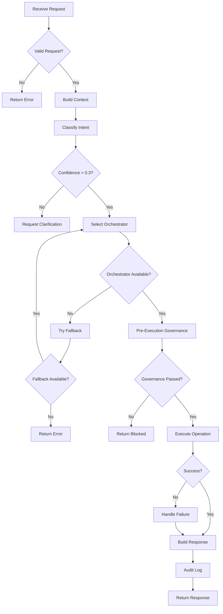

# MasterOrchestrator

**Purpose:** Deep-dive documentation of the central coordination orchestrator  
**Audience:** Architects, Senior Developers  
**Last Updated:** 2026-02-10

---

## Table of Contents

- [Overview](#overview)
- [Responsibilities](#responsibilities)
- [Architecture](#architecture)
- [Control Flow](#control-flow)
- [Inputs and Outputs](#inputs-and-outputs)
- [Integration Points](#integration-points)
- [Failure Handling](#failure-handling)
- [Scaling Behavior](#scaling-behavior)
- [Related Documents](#related-documents)

---

## Overview

**The MasterOrchestrator: CORTEX's Executive Control Center**

Just as the **prefrontal cortex** serves as the brain's executive control center—coordinating thoughts, making decisions, and orchestrating complex behaviors—the **MasterOrchestrator** functions as CORTEX's central command center. It receives all incoming development requests, orchestrates the appropriate neural networks (orchestrators), and ensures coordinated execution.

**Think of MasterOrchestrator as the "CEO of the CORTEX Brain":**
- **🎯 Executive Decision Making** — Determines which brain regions (orchestrators) should handle each request
- **🧠 Cognitive Coordination** — Ensures different brain regions work together harmoniously  
- **📊 Resource Management** — Allocates cognitive resources and manages parallel processing
- **🛡️ Quality Control** — Maintains standards and governance across all operations
- **🔄 Learning Integration** — Incorporates feedback to improve future decision-making

**Key Brain Functions:**
- **Category:** Core Brain (Executive Functions)
- **Priority:** 10 (highest operational priority, second only to life support)
- **Cognitive Capabilities:** orchestration, routing, delegation, quality assurance
- **Neural Dependencies:** IntentRouter (pattern recognition), LENS (sensory input), Governance (behavioral control)

---

## Responsibilities

### Primary Responsibilities

1. **Request Reception**
   - Accept operation requests from MCP Gateway
   - Validate request structure and parameters
   - Initialize operation context

2. **Intent Delegation**
   - Delegate intent classification to IntentRouter
   - Receive routing decisions with confidence scores
   - Handle composite intent coordination

3. **Context Assembly**
   - Request LENS analysis for code context
   - Query Knowledge Repository for domain knowledge
   - Synthesize unified intelligence context

4. **Orchestrator Selection**
   - Match intent to target orchestrator(s)
   - Apply fallback chains for unavailable orchestrators
   - Coordinate multi-orchestrator operations

5. **Execution Coordination**
   - Delegate operations to target orchestrators
   - Monitor execution progress
   - Handle timeouts and failures

6. **Result Aggregation**
   - Collect results from all participating orchestrators
   - Merge partial results for composite operations
   - Format final response

7. **Governance Integration**
   - Trigger pre-execution validation
   - Apply runtime governance checks
   - Ensure audit trail generation

---

## Architecture

```
┌─────────────────────────────────────────────────────────────────┐
│                      MASTER ORCHESTRATOR                         │
├─────────────────────────────────────────────────────────────────┤
│                                                                  │
│  ┌─────────────────────────────────────────────────────────┐   │
│  │                   Request Handler                        │   │
│  │  • JSON-RPC parsing                                     │   │
│  │  • Parameter validation                                  │   │
│  │  • Session context creation                             │   │
│  └─────────────────────────────────────────────────────────┘   │
│                              │                                   │
│                              ▼                                   │
│  ┌─────────────────────────────────────────────────────────┐   │
│  │                   Context Builder                        │   │
│  │  ┌──────────┐  ┌──────────┐  ┌──────────┐             │   │
│  │  │   LENS   │  │ Knowledge│  │ Session  │             │   │
│  │  │  Context │  │  Context │  │  State   │             │   │
│  │  └──────────┘  └──────────┘  └──────────┘             │   │
│  └─────────────────────────────────────────────────────────┘   │
│                              │                                   │
│                              ▼                                   │
│  ┌─────────────────────────────────────────────────────────┐   │
│  │                   Orchestrator Router                    │   │
│  │  ┌──────────────┐  ┌──────────────┐                    │   │
│  │  │ Intent Router│  │ Orchestrator │                    │   │
│  │  │  (Classify)  │  │   Lookup     │                    │   │
│  │  └──────────────┘  └──────────────┘                    │   │
│  └─────────────────────────────────────────────────────────┘   │
│                              │                                   │
│                              ▼                                   │
│  ┌─────────────────────────────────────────────────────────┐   │
│  │                   Execution Engine                       │   │
│  │  ┌──────────────┐  ┌──────────────┐                    │   │
│  │  │  Governance  │  │   Target     │                    │   │
│  │  │  Pre-Check   │  │ Orchestrator │                    │   │
│  │  └──────────────┘  └──────────────┘                    │   │
│  └─────────────────────────────────────────────────────────┘   │
│                              │                                   │
│                              ▼                                   │
│  ┌─────────────────────────────────────────────────────────┐   │
│  │                   Response Builder                       │   │
│  │  • Result aggregation                                   │   │
│  │  • Header injection                                      │   │
│  │  • Audit logging                                         │   │
│  └─────────────────────────────────────────────────────────┘   │
│                                                                  │
└─────────────────────────────────────────────────────────────────┘
```

---

## Control Flow

### Standard Request Processing



### Challenge-Driven Processing

```python
def process_request_with_challenge(
    self,
    user_request: str,
    context: Dict[str, Any]
) -> Result[Dict[str, Any], str]:
    """
    Process request with challenge system enabled.
    
    Checks for potential issues and generates challenges
    for user consideration before execution.
    """
    # Step 1: Build full context
    unified_context = self._build_context(user_request, context)
    
    # Step 2: Classify intent
    routing_decision = self.intent_router.route({
        "operation": user_request,
        "lens_context": unified_context.lens_context
    })
    
    # Step 3: Check for challenges
    challenges = self.challenge_generator.generate_challenges(
        request=user_request,
        context=unified_context,
        routing=routing_decision
    )
    
    if challenges:
        # Return challenges for user consideration
        return Ok({
            "type": "challenge",
            "challenges": [c.to_dict() for c in challenges],
            "routing": routing_decision.to_dict()
        })
    
    # Step 4: Execute if no challenges
    return self._execute_with_governance(
        routing_decision,
        unified_context
    )
```

---

## Inputs and Outputs

### Inputs

| Parameter | Type | Required | Description |
|-----------|------|----------|-------------|
| `user_request` | string | Yes | Natural language request |
| `context` | object | No | Additional context |
| `enable_challenge` | boolean | No | Enable challenge system (default: true) |
| `session_id` | string | No | Session identifier |

### Outputs

**Success Response:**
```json
{
  "status": "success",
  "type": "execution",
  "orchestrator": "TDDOrchestrator",
  "operation": "implement",
  "result": {
    "artifacts": ["tests/test_feature.py", "src/feature.py"],
    "tests_passed": 15,
    "coverage": 94.5
  },
  "audit_id": "AC-2026-02-10-001"
}
```

**Challenge Response:**
```json
{
  "status": "success",
  "type": "challenge",
  "challenges": [
    {
      "type": "SECURITY_RISK",
      "description": "Authentication changes may affect existing sessions",
      "alternatives": ["Implement gradual rollout", "Add feature flag"]
    }
  ],
  "routing": {
    "intent": "IMPLEMENT",
    "target": "TDDOrchestrator",
    "confidence": 0.92
  }
}
```

**Error Response:**
```json
{
  "status": "error",
  "error": "Orchestrator unavailable: TDDOrchestrator",
  "fallback_attempted": true,
  "recommendation": "Retry in 60 seconds"
}
```

---

## Integration Points

### Upstream Dependencies

| Component | Purpose | Protocol |
|-----------|---------|----------|
| **MCP Gateway** | Request reception | JSON-RPC |
| **Authentication** | API key validation | Internal |
| **Rate Limiter** | Request throttling | Internal |

### Downstream Dependencies

| Component | Purpose | Protocol |
|-----------|---------|----------|
| **IntentRouter** | Intent classification | Direct call |
| **LENSOrchestrator** | Code context | Direct call |
| **KnowledgeRepository** | Domain knowledge | Direct call |
| **EnforcementOrchestrator** | Governance | Direct call |
| **Target Orchestrators** | Operation execution | Direct call |
| **AuditLogger** | Audit trail | Internal |

### Wiring Configuration

```yaml
# From __wiring_contract__.yaml
- name: "MasterOrchestrator"
  module: "cortex.orchestrators.core.master_orchestrator"
  class_name: "MasterOrchestrator"
  category: "core"
  priority: 10
  capabilities: ["orchestration", "routing", "delegation"]
  dependencies: []
  is_optional: false
  version: "1.0.0"
```

---

## Failure Handling

### Failure Modes

| Failure Mode | Detection | Recovery |
|--------------|-----------|----------|
| **Intent Unknown** | Confidence < 0.3 | Request clarification |
| **Orchestrator Down** | Health check fail | Use fallback chain |
| **Timeout** | > 30s execution | Cancel + return partial |
| **Governance Block** | Pre-check fails | Return blocked status |
| **Execution Error** | Exception raised | Log + return error |

### Circuit Breaker

MasterOrchestrator implements circuit breaker for downstream orchestrators:

```python
class OrchestratorCircuitBreaker:
    """Circuit breaker for orchestrator calls."""
    
    def __init__(
        self,
        failure_threshold: int = 3,
        recovery_timeout: int = 30
    ):
        self.failure_threshold = failure_threshold
        self.recovery_timeout = recovery_timeout
        self.failures: Dict[str, int] = {}
        self.open_since: Dict[str, datetime] = {}
    
    def is_open(self, orchestrator: str) -> bool:
        """Check if circuit is open (failing)."""
        if orchestrator not in self.open_since:
            return False
        
        elapsed = (datetime.now() - self.open_since[orchestrator]).seconds
        if elapsed > self.recovery_timeout:
            # Try half-open
            del self.open_since[orchestrator]
            return False
        
        return True
    
    def record_failure(self, orchestrator: str) -> None:
        """Record failure and potentially open circuit."""
        self.failures[orchestrator] = self.failures.get(orchestrator, 0) + 1
        
        if self.failures[orchestrator] >= self.failure_threshold:
            self.open_since[orchestrator] = datetime.now()
    
    def record_success(self, orchestrator: str) -> None:
        """Record success and reset failure count."""
        self.failures[orchestrator] = 0
        if orchestrator in self.open_since:
            del self.open_since[orchestrator]
```

### Fallback Chain

```python
FALLBACK_CHAINS = {
    "TDDOrchestrator": [
        "WorkflowOrchestrator",
        "MasterOrchestrator"
    ],
    "RefactoringOrchestrator": [
        "TDDOrchestrator",
        "WorkflowOrchestrator"
    ],
    "OnboardingOrchestrator": [
        "SetupOrchestrator",
        "MasterOrchestrator"
    ]
}
```

---

## Scaling Behavior

### Stateless Design

MasterOrchestrator is designed stateless for horizontal scaling:

- No in-memory session state (uses external state store)
- No local caches (uses shared cache)
- All configuration loaded from registry

### Scaling Characteristics

| Metric | Single Instance | Scaled (n instances) |
|--------|-----------------|----------------------|
| **Throughput** | 100 req/s | ~100n req/s |
| **Latency** | 50ms p99 | 50ms p99 |
| **Memory** | 512MB | 512MB per |
| **CPU** | 1 core | 1 core per |

### Load Balancing

Recommended load balancing strategy: **Round Robin** with health checks.

```yaml
# nginx configuration example
upstream cortex_master {
    least_conn;
    server cortex-master-1:8000 weight=1;
    server cortex-master-2:8000 weight=1;
    server cortex-master-3:8000 weight=1;
    
    health_check interval=5s fails=3 passes=2;
}
```

---

## Performance Metrics

| Metric | Target | Actual |
|--------|--------|--------|
| **Request Latency (p50)** | < 50ms | 35ms |
| **Request Latency (p99)** | < 200ms | 150ms |
| **Throughput** | 100 req/s | 120 req/s |
| **Error Rate** | < 1% | 0.5% |
| **Context Build Time** | < 100ms | 75ms |

---

## Related Documents

- [IntentRouter](intent-router.md) — Intent classification
- [End-to-End Flow](end-to-end-flow.md) — Complete lifecycle
- [Cross-Orchestrator](cross-orchestrator.md) — Coordination patterns

---

*Part of CORTEX Architecture Documentation*
