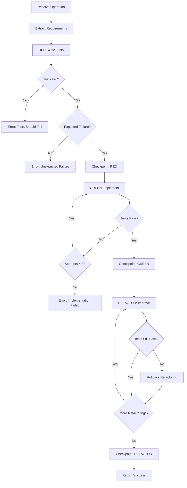

# TDDOrchestrator

**Purpose:** Documentation of the Test-Driven Development workflow orchestrator  
**Audience:** Developers, Team Leads  
**Last Updated:** 2026-02-10

---

## Table of Contents

- [Overview](#overview)
- [TDD Philosophy](#tdd-philosophy)
- [Workflow Phases](#workflow-phases)
- [Control Flow](#control-flow)
- [Enforcement Points](#enforcement-points)
- [Inputs and Outputs](#inputs-and-outputs)
- [Related Documents](#related-documents)

---

## Overview

The **TDDOrchestrator** enforces Test-Driven Development for all IMPLEMENT, FIX, and TEST operations. It ensures that tests are written before implementation code, following the RED → GREEN → REFACTOR cycle.

**Key Facts:**
- **Category:** Core
- **Priority:** 30
- **Capabilities:** tdd, testing, implementation
- **Dependencies:** None (can operate independently)

---

## TDD Philosophy

### Why TDD?

CORTEX enforces TDD (CORE-008) because:

1. **Quality Assurance** — Tests verify behavior before code exists
2. **Design Improvement** — Writing tests first leads to better API design
3. **Documentation** — Tests serve as executable documentation
4. **Confidence** — All code has automated verification
5. **Regression Prevention** — Tests catch unintended changes

### The RED-GREEN-REFACTOR Cycle

```
┌─────────────────────────────────────────────────────────────────┐
│                    TDD CYCLE                                     │
├─────────────────────────────────────────────────────────────────┤
│                                                                  │
│         ┌──────────┐                                            │
│         │   RED    │  Write a failing test                      │
│         │          │  (Test should fail for expected reason)    │
│         └────┬─────┘                                            │
│              │                                                   │
│              ▼                                                   │
│         ┌──────────┐                                            │
│         │  GREEN   │  Write minimal code to pass                │
│         │          │  (Just enough to make test pass)           │
│         └────┬─────┘                                            │
│              │                                                   │
│              ▼                                                   │
│         ┌──────────┐                                            │
│         │ REFACTOR │  Improve code quality                      │
│         │          │  (Without changing behavior)               │
│         └────┬─────┘                                            │
│              │                                                   │
│              └─────────────────┐                                │
│                                ▼                                 │
│                        Next feature                              │
│                                                                  │
└─────────────────────────────────────────────────────────────────┘
```

---

## Workflow Phases

### Phase 1: RED (Write Failing Test)

```python
class TDDOrchestrator:
    
    def execute_red_phase(
        self,
        operation: str,
        context: UnifiedIntelligenceContext
    ) -> Result[TDDPhaseResult, str]:
        """
        Execute RED phase: Write failing test.
        
        Steps:
        1. Analyze requirements from context
        2. Generate test file structure
        3. Write test cases
        4. Verify test fails correctly
        5. Checkpoint commit
        """
        # Step 1: Extract requirements
        requirements = self._extract_requirements(operation, context)
        
        # Step 2: Generate test structure
        test_file = self._generate_test_file(requirements)
        
        # Step 3: Write test cases
        test_code = self._generate_test_code(requirements)
        
        # Step 4: Execute tests (should fail)
        result = self._run_tests(test_file)
        
        if result.passed:
            return Err("RED phase failed: Test should fail but passed")
        
        if not result.failed_for_expected_reason:
            return Err(f"RED phase failed: Unexpected failure: {result.error}")
        
        # Step 5: Checkpoint
        self._checkpoint("RED", test_file)
        
        return Ok(TDDPhaseResult(
            phase="RED",
            test_file=test_file,
            tests_written=len(test_code.tests),
            status="failing_as_expected"
        ))
```

### Phase 2: GREEN (Implement)

```python
def execute_green_phase(
    self,
    red_result: TDDPhaseResult,
    context: UnifiedIntelligenceContext
) -> Result[TDDPhaseResult, str]:
    """
    Execute GREEN phase: Make tests pass.
    
    Steps:
    1. Analyze failing tests
    2. Generate minimal implementation
    3. Run tests
    4. Iterate until all pass
    5. Checkpoint commit
    """
    # Step 1: Analyze what needs to be implemented
    test_analysis = self._analyze_failing_tests(red_result.test_file)
    
    # Step 2: Generate implementation
    implementation = self._generate_implementation(test_analysis)
    
    # Step 3: Run tests
    result = self._run_tests(red_result.test_file)
    
    # Step 4: Iterate if needed (max 3 attempts)
    attempts = 1
    while not result.passed and attempts < 3:
        implementation = self._fix_implementation(
            implementation,
            result.failures
        )
        result = self._run_tests(red_result.test_file)
        attempts += 1
    
    if not result.passed:
        return Err(f"GREEN phase failed: {result.failures}")
    
    # Step 5: Checkpoint
    self._checkpoint("GREEN", implementation.file_path)
    
    return Ok(TDDPhaseResult(
        phase="GREEN",
        implementation_file=implementation.file_path,
        tests_passed=result.passed_count,
        status="all_tests_passing"
    ))
```

### Phase 3: REFACTOR (Improve)

```python
def execute_refactor_phase(
    self,
    green_result: TDDPhaseResult,
    context: UnifiedIntelligenceContext
) -> Result[TDDPhaseResult, str]:
    """
    Execute REFACTOR phase: Improve code quality.
    
    Steps:
    1. Analyze code for improvements
    2. Apply refactoring transformations
    3. Verify tests still pass
    4. Final checkpoint
    """
    # Step 1: Analyze for improvements
    improvements = self._analyze_for_refactoring(
        green_result.implementation_file
    )
    
    if not improvements:
        return Ok(TDDPhaseResult(
            phase="REFACTOR",
            status="no_refactoring_needed"
        ))
    
    # Step 2: Apply refactoring
    for improvement in improvements:
        self._apply_refactoring(improvement)
        
        # Step 3: Verify tests still pass
        result = self._run_tests(green_result.test_file)
        
        if not result.passed:
            # Rollback this refactoring
            self._rollback_refactoring(improvement)
            continue
    
    # Step 4: Final checkpoint
    self._checkpoint("REFACTOR", green_result.implementation_file)
    
    return Ok(TDDPhaseResult(
        phase="REFACTOR",
        refactorings_applied=len(improvements),
        status="refactoring_complete"
    ))
```

---

## Control Flow



---

## Enforcement Points

### Pre-Execution Checks

| Check | Validation | Failure Action |
|-------|------------|----------------|
| **Test Framework** | pytest installed | Block with install guidance |
| **Test Directory** | tests/ exists | Create directory |
| **Coverage Tool** | coverage installed | Block with install guidance |

### RED Phase Enforcement

| Check | Validation | Failure Action |
|-------|------------|----------------|
| **Test Written** | Test file created | Block GREEN phase |
| **Test Fails** | Test execution fails | Block GREEN phase |
| **Expected Failure** | Failure is import/assertion | Block GREEN phase |

### GREEN Phase Enforcement

| Check | Validation | Failure Action |
|-------|------------|----------------|
| **Tests Pass** | All tests pass | Retry or fail |
| **Coverage Met** | Coverage >= threshold | Warning (not blocking) |

### REFACTOR Phase Enforcement

| Check | Validation | Failure Action |
|-------|------------|----------------|
| **Tests Still Pass** | No regressions | Rollback refactoring |
| **Code Quality** | Linting passes | Warning |

### Forbidden Bypasses

CORTEX explicitly blocks TDD bypass attempts:

```python
FORBIDDEN_PATTERNS = [
    r"--ignore",           # Ignore test failures
    r"_skip_.*\.py$",      # Skip file naming
    r"@pytest\.mark\.skip", # Skip decorators (without reason)
    r"# noqa.*test",       # Suppressing test warnings
]

def check_for_bypass_attempts(self, content: str, file_path: str) -> List[str]:
    """Detect TDD bypass attempts."""
    violations = []
    
    for pattern in self.FORBIDDEN_PATTERNS:
        if re.search(pattern, content):
            violations.append(f"TDD bypass detected: {pattern}")
    
    return violations
```

---

## Inputs and Outputs

### Operation Input

```python
@dataclass
class TDDOperation:
    """Input for TDD operation."""
    
    operation_type: str       # implement, fix, test
    target: str              # What to implement/fix
    requirements: List[str]  # Specific requirements
    context: UnifiedIntelligenceContext
    coverage_threshold: float = 0.80  # 80% default
```

### TDDResult Output

```python
@dataclass
class TDDResult:
    """Complete TDD operation result."""
    
    success: bool
    phases: List[TDDPhaseResult]
    test_file: str
    implementation_file: Optional[str]
    tests_passed: int
    coverage: float
    audit_id: str
    
    # Artifacts
    artifacts: List[str]
    checkpoints: List[str]
    
    # Metrics
    red_duration: float
    green_duration: float
    refactor_duration: float
```

---

## Performance Metrics

| Metric | Target | Actual |
|--------|--------|--------|
| **RED Phase** | < 30s | 20s |
| **GREEN Phase** | < 60s | 45s |
| **REFACTOR Phase** | < 30s | 15s |
| **Total Cycle** | < 2min | 80s |

---

## Related Documents

- [Governance & Compliance](../capabilities/governance-compliance.md) — TDD enforcement
- [MasterOrchestrator](master-orchestrator.md) — Coordination
- [End-to-End Flow](end-to-end-flow.md) — Complete lifecycle

---

*Part of CORTEX Architecture Documentation*
