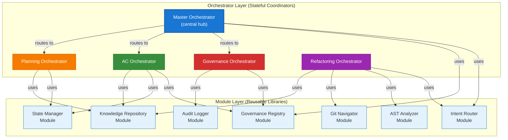

# Orchestrators & Modules: Composition Architecture

> **Summary:** How orchestrators compose modules to execute multi-step workflows with governance enforcement  
> **Authority:** cortex/orchestrators/ + cortex/ modules | **Last Updated:** 2026-01-22

---

## Core Concept

**Modules** are reusable, stateless libraries that implement specific functionality (intent classification, governance evaluation, state management). **Orchestrators** are stateful coordinators that compose these modules into multi-step workflows.

**Analogy:** Modules are like kitchen tools (knife, mixer, oven). Orchestrators are like recipes that use these tools in sequence to produce a dish.

---

## Architecture Relationship



---

## Master Orchestrator

**Role:** Central routing hub. Determines which domain orchestrator should handle the user's intent.

**Location:** `cortex/orchestrators/core/master_orchestrator.py`

### Modules Used

| Module | Purpose | When Used |
|--------|---------|-----------|
| **Intent Router** | Classify user intent (REFACTORING, ANALYSIS, DEPLOYMENT, etc.) | On every request |
| **Governance Registry** | Validate that user has permission to execute intent | After classification |
| **State Manager** | Track execution state across routing decisions | During state persistence |
| **Audit Logger** | Log routing decision and confidence score | After each decision |

### Workflow Example

```
User Request: "Refactor authentication module"
    ↓
MasterOrchestrator calls IntentRouter.classify()
    ↓ Returns: "REFACTORING_INTENT" (confidence: 0.89)
    ↓
MasterOrchestrator calls GovernanceRegistry.can_execute()
    ↓ Returns: True (user has refactoring permissions)
    ↓
MasterOrchestrator calls StateManager.save_checkpoint()
    ↓ Stores: "Intent routing decision"
    ↓
MasterOrchestrator calls AuditLogger.log()
    ↓ Records: Who, What, When, Decision rationale
    ↓
MasterOrchestrator routes to RefactoringOrchestrator
```

---

## Governance Orchestrator

**Role:** Evaluates TIER 0-3 governance rules. Enforces policies across all operations.

**Location:** `cortex/orchestrators/domain/governance_orchestrator.py`

### Modules Used

| Module | Purpose | When Used |
|--------|---------|-----------|
| **Governance Registry** | Load and evaluate TIER 0-3 rules | For every governance check |
| **Knowledge Repository** | Query best practices and policy context | When interpreting rules |
| **Audit Logger** | Log rule evaluation results with rationale | After each rule check |
| **State Manager** | Persist governance decision state | Before/after enforcement |

### Workflow Example

```
DeploymentOrchestrator wants to deploy service
    ↓
DeploymentOrchestrator calls GovernanceOrchestrator.validate_deployment()
    ↓
GovernanceOrchestrator calls GovernanceRegistry.get_tier0_rules()
    ↓ Returns: [RULE-001: "Secrets encrypted", RULE-019: "Audit logging", ...]
    ↓
For each rule:
  GovernanceOrchestrator calls GovernanceRegistry.evaluate_rule(rule, deployment_config)
    ↓ Returns: Pass or Fail with reason
  GovernanceOrchestrator calls AuditLogger.log_rule_evaluation()
    ↓ Records: Rule ID, Pass/Fail, Decision details
    ↓
If any TIER 0 rule fails:
  GovernanceOrchestrator calls StateManager.save_checkpoint("GOVERNANCE_BLOCKED")
  Returns: BLOCKED
Else:
  Returns: APPROVED
    ↓
DeploymentOrchestrator receives result and proceeds/stops accordingly
```

---

## AC (Acceptance Criteria) Orchestrator

**Role:** Tracks feature acceptance criteria. Validates readiness for shipping features.

**Location:** `cortex/orchestrators/domain/ac_orchestrator.py`

### Modules Used

| Module | Purpose | When Used |
|--------|---------|-----------|
| **Governance Registry** | Load AC-related TIER 1 rules (feature acceptance criteria) | When starting AC check |
| **State Manager** | Retrieve test results and completion status for each criterion | For each AC evaluation |
| **Knowledge Repository** | Query domain-specific AC checklists | When determining required criteria |
| **Audit Logger** | Log each criterion's pass/fail status | After evaluating each criterion |

### Workflow Example

```
User asks: "Is login feature ready to ship?"
    ↓
ACOrchestrator.check_feature_readiness("login_feature")
    ↓
ACOrchestrator calls GovernanceRegistry.get_tier1_rules("feature_acceptance")
    ↓ Returns: [AC-001: Unit tests ≥80%, AC-002: Security review, AC-003: Docs complete, ...]
    ↓
ACOrchestrator calls KnowledgeRepository.get_acceptance_criteria("login", "security_features")
    ↓ Returns: Security checklists specific to login features
    ↓
For each criterion (e.g., "AC-001: Unit tests ≥80%"):
  ACOrchestrator calls StateManager.get_test_coverage("login_feature")
    ↓ Returns: Coverage: 85%
  ACOrchestrator calls AuditLogger.log_criterion_check()
    ↓ Records: AC-001, Status: PASS, Coverage: 85%
    ↓
ACOrchestrator calls StateManager.save_checkpoint()
    ↓ Saves overall status: "3/5 criteria pass. Blockers: Integration tests (2/10 pass)"
    ↓
Returns: Feature readiness report
```

---

## Planning Orchestrator

**Role:** Orchestrates multi-phase execution plans with dependency resolution.

**Location:** `cortex/orchestrators/domain/planning_orchestrator.py`

### Modules Used

| Module | Purpose | When Used |
|--------|---------|-----------|
| **State Manager** | Track phase progression, checkpoint creation, rollback on failure | Between each phase |
| **Knowledge Repository** | Query best practices and implementation patterns | When planning phases |
| **Governance Registry** | Validate each phase complies with rules | Before executing phase |
| **Audit Logger** | Log phase transitions and decisions | At each milestone |

### Workflow Example

```
User wants: Multi-phase refactoring (analysis → planning → execution → verification)
    ↓
PlanningOrchestrator.create_execution_plan(refactoring_request)
    ↓
PlanningOrchestrator calls KnowledgeRepository.get_refactoring_phases()
    ↓ Returns: Standard phases with dependencies
    ↓
PlanningOrchestrator calls StateManager.create_checkpoint("phase_0_start")
    ↓
Phase 1 - Analysis:
  PlanningOrchestrator calls StateManager.start_phase("ANALYSIS")
  Execute analysis
  Call AuditLogger.log_phase_complete("ANALYSIS", results)
  Call StateManager.save_checkpoint("phase_1_complete")
    ↓
Phase 2 - Planning (depends on Phase 1 completion):
  Check if Phase 1 complete via StateManager
  Call GovernanceRegistry.validate_phase("PLANNING")
  Execute planning
  Call AuditLogger.log_phase_complete("PLANNING", plan)
  Call StateManager.save_checkpoint("phase_2_complete")
    ↓
Phase 3 - Execution (depends on Phases 1-2):
  Try to execute
  If error: Call StateManager.rollback_to_checkpoint("phase_2_complete")
    ↓
Phase 4 - Verification:
  Call StateManager.get_all_checkpoints()
  Call AuditLogger.generate_full_timeline()
    ↓
Returns: Complete execution timeline
```

---

## Refactoring Orchestrator

**Role:** Coordinates code refactoring with safety checks and version control integration.

**Location:** `cortex/orchestrators/domain/refactoring_orchestrator.py`

### Modules Used

| Module | Purpose | When Used |
|--------|---------|-----------|
| **Intent Router** | Classify refactoring type (extract method, rename variable, etc.) | At start |
| **AST Analyzer** | Parse code structure, find dependencies, ensure safe refactoring | During planning |
| **Git Navigator** | Get change history, identify affected branches, manage version control | Before/after refactoring |
| **Knowledge Repository** | Query refactoring patterns and best practices | When planning changes |
| **Governance Registry** | Validate refactoring complies with coding standards | Before execution |
| **State Manager** | Create checkpoints before/after each refactoring step | During execution |
| **Audit Logger** | Log refactoring decisions and changes | Throughout workflow |

### Workflow Example

```
User request: "Refactor authentication module to use dependency injection"
    ↓
RefactoringOrchestrator.plan_refactoring(request)
    ↓
Call IntentRouter.classify_refactoring(request)
    ↓ Returns: "INJECT_DEPENDENCY" (confidence: 0.94)
    ↓
Call ASTAnalyzer.analyze_module("authentication")
    ↓ Returns: {classes: 5, methods: 23, dependencies: [service_a, service_b]}
    ↓
Call KnowledgeRepository.get_di_pattern("python_dependency_injection")
    ↓ Returns: Best practices, pitfalls, code examples
    ↓
Call GitNavigator.get_change_history("authentication.py")
    ↓ Returns: Last 10 commits, active branches, related files
    ↓
Call StateManager.create_checkpoint("refactoring_start")
    ↓
Call GovernanceRegistry.validate_refactoring_plan(plan)
    ↓ Returns: Plan is compliant
    ↓
Execute refactoring:
  For each class:
    Call StateManager.create_checkpoint("before_class_X_refactor")
    Refactor class
    Call AuditLogger.log_refactoring_step(class_name, changes)
    Call StateManager.create_checkpoint("after_class_X_refactor")
    ↓
Call GitNavigator.stage_changes()
Call GitNavigator.create_branch("refactor/auth-di")
Call AuditLogger.log_refactoring_complete()
    ↓
Returns: Refactoring plan with checkpoints and change history
```

---

## Analysis Orchestrator

**Role:** Performs static/dynamic code analysis and generates insights.

**Location:** `cortex/orchestrators/domain/analysis_orchestrator.py`

### Modules Used

| Module | Purpose | When Used |
|--------|---------|-----------|
| **Intent Router** | Classify analysis type (performance, security, complexity, etc.) | At start |
| **AST Analyzer** | Perform code structure analysis | During analysis |
| **Knowledge Repository** | Query analysis heuristics and thresholds | When interpreting results |
| **Audit Logger** | Log findings and recommendations | After analysis complete |

### Workflow Example

```
User request: "Analyze authentication module for security vulnerabilities"
    ↓
AnalysisOrchestrator.analyze_security("authentication.py")
    ↓
Call IntentRouter.classify_analysis("security")
    ↓ Returns: "SECURITY_ANALYSIS"
    ↓
Call ASTAnalyzer.analyze_security_patterns("authentication.py")
    ↓ Returns: Findings: [hardcoded_secrets: 2, sql_injection: 1, ...]
    ↓
Call KnowledgeRepository.get_security_thresholds()
    ↓ Returns: Critical threshold: >0 findings, High: >5, etc.
    ↓
Call AuditLogger.log_analysis_findings(findings, severity)
    ↓
Returns: Analysis report with recommendations
```

---

## Onboarding Orchestrator

**Role:** Guides users through setup and maintains state across onboarding phases.

**Location:** `cortex/orchestrators/domain/onboarding_orchestrator.py`

### Modules Used

| Module | Purpose | When Used |
|--------|---------|-----------|
| **State Manager** | Track onboarding progress, save user preferences | At each step |
| **Knowledge Repository** | Provide context-specific guidance | When presenting steps |
| **Governance Registry** | Validate onboarding complies with org policies | Before final step |
| **Audit Logger** | Log user journey through onboarding | At each transition |

### Workflow Example

```
New user starts CORTEX
    ↓
OnboardingOrchestrator.start_onboarding(user_id)
    ↓
Step 1 - Environment Setup:
  Call StateManager.create_checkpoint("onboarding_start")
  Call KnowledgeRepository.get_setup_instructions()
  Display instructions
  Wait for user completion
  Call StateManager.save_checkpoint("setup_complete")
  Call AuditLogger.log_step_complete("SETUP", timestamp)
    ↓
Step 2 - Configuration:
  Call StateManager.load_user_preferences()
  Display options
  Call StateManager.save_user_config()
  Call AuditLogger.log_config_choices()
    ↓
Step 3 - Validation:
  Call GovernanceRegistry.validate_onboarding_complete()
  Call StateManager.mark_onboarded(user_id)
  Call AuditLogger.log_onboarding_complete()
    ↓
Returns: Welcome and next steps
```

---

## Module Dependency Map

### Core Modules (Used by Multiple Orchestrators)

**Governance Registry**
- Used by: MasterOrch, GovernanceOrch, ACOrch, PlanningOrch, RefactoringOrch, OnboardingOrch
- Why: Every operation must be validated against TIER 0-3 rules
- Responsibility: Load rules, evaluate compliance, return pass/fail with rationale

**State Manager**
- Used by: MasterOrch, ACOrch, PlanningOrch, RefactoringOrch, OnboardingOrch
- Why: Track multi-step progress, enable checkpointing and rollback
- Responsibility: Persist state, manage checkpoints, enable recovery

**Audit Logger**
- Used by: All orchestrators
- Why: Maintain hash-chain audit trail for compliance
- Responsibility: Log decisions with full context, compute hash chain

**Knowledge Repository**
- Used by: ACOrch, PlanningOrch, RefactoringOrch, AnalysisOrch, OnboardingOrch
- Why: Query domain best practices and standards
- Responsibility: Provide context-aware guidance, patterns, checklists

### Specialized Modules (Used by Specific Orchestrators)

**Intent Router**
- Used by: MasterOrch, RefactoringOrch, AnalysisOrch
- Purpose: Classify user intent into discrete categories
- Returns: Classification with confidence score and alternatives

**AST Analyzer**
- Used by: RefactoringOrch, AnalysisOrch
- Purpose: Parse and analyze code structure
- Returns: Code metrics, dependencies, vulnerability patterns

**Git Navigator**
- Used by: RefactoringOrch
- Purpose: Integrate with version control
- Returns: Change history, branch info, file relationships

---

## Composition Patterns

### Pattern 1: Validation Sandwich

```
Orchestrator calls Module A (input validation)
    ↓
Orchestrator calls GovernanceRegistry (rule validation)
    ↓
Orchestrator calls Module B (processing)
    ↓
Orchestrator calls AuditLogger (log result)
```

**Used by:** All orchestrators  
**Example:** RefactoringOrchestrator validates plan → checks governance → executes → logs

---

### Pattern 2: Sequential Module Chain

```
Orchestrator calls Module A → Module B → Module C in sequence
Each module's output feeds into next module's input
```

**Used by:** PlanningOrchestrator (phase 1 → phase 2 → phase 3)  
**Example:** Analysis → Planning → Execution → Verification

---

### Pattern 3: Conditional Branching

```
Orchestrator calls Module A (gather data)
    ↓
IF condition_met:
    call Module B (execute path A)
ELSE:
    call Module C (execute path B)
    ↓
Orchestrator calls AuditLogger (log decision)
```

**Used by:** MasterOrchestrator (route to different domain orchestrators)

---

### Pattern 4: Parallel Module Execution

```
Orchestrator calls [Module A, Module B, Module C] in parallel
Waits for all to complete
Merges results
```

**Used by:** AnalysisOrchestrator (run multiple analyzers in parallel)

---

## Key Design Principles

### 1. Modules Are Stateless
Modules always return the same result for the same input. They don't remember previous calls.

**Example:** `governance_registry.evaluate_rule(rule, context)` returns same result every time.

### 2. Orchestrators Are Stateful
Orchestrators track progress, maintain checkpoints, and can resume from failure points.

**Example:** `planning_orchestrator` remembers which phases completed and can restart from last successful phase.

### 3. Governance Before Execution
TIER 0 Governance (CORE-017) rule: Always check governance before calling modules.

```
Orchestrator → Check rules → IF approved: call module → ELSE: return error
```

### 4. Audit Trail on Every Decision
Every orchestrator decision gets logged with decision rationale, confidence, and alternatives.

**Example:** Routing decision includes confidence score and other considered orchestrators.

### 5. Module Reusability
A module can be called from any orchestrator. No assumptions about caller.

**Example:** `ast_analyzer` used by RefactoringOrch and AnalysisOrch without knowing which called it.

---

## See Also

- [Master Orchestrator](01-master-orchestrator.md) — Central routing hub
- [Governance Orchestrator](../01-cortex-brain/01-tier0-governance.md) — Rule enforcement
- [AC Orchestrator](01-master-orchestrator.md#ac-orchestrator) — Feature acceptance tracking
- [Infrastructure Modules](../12-infrastructure/00-infrastructure-index.md) — State, audit, logging
- [Source: cortex/orchestrators/](../../../cortex/orchestrators/)
- [Source: cortex/ modules](../../../cortex/)

---

**Author:** CORTEX Documentation Engine  
**Generated:** 2026-01-22  
**Copyright © 2025-2026 Asif Hussain. All rights reserved.**
