# Complete Orchestrator Listing

> **Summary:** Comprehensive inventory of all orchestrators and their module dependencies  
> **Authority:** cortex/orchestrators/ + cortex/ modules | **Last Updated:** 2026-01-22

---

## Quick Index

| # | Orchestrator | Type | Status | Modules | Location |
|---|---|---|---|---|---|
| 1 | Master Orchestrator | Core | ✓ Active | 4 | `cortex/orchestrators/core/` |
| 2 | Governance Orchestrator | Domain | ✓ Active | 4 | `cortex/orchestrators/domain/` |
| 3 | AC Orchestrator | Domain | ✓ Active | 4 | `cortex/orchestrators/domain/` |
| 4 | Planning Orchestrator | Domain | ✓ Active | 4 | `cortex/orchestrators/domain/` |
| 5 | Refactoring Orchestrator | Domain | ✓ Active | 7 | `cortex/orchestrators/domain/` |
| 6 | Analysis Orchestrator | Domain | ✓ Active | 5 | `cortex/orchestrators/domain/` |
| 7 | Onboarding Orchestrator | Domain | ✓ Active | 4 | `cortex/orchestrators/domain/` |

---

## 1️⃣ Master Orchestrator

### Identity
- **Type:** Core orchestrator (router & dispatcher)
- **Location:** `cortex/orchestrators/core/master_orchestrator.py`
- **Responsibility:** Central hub that receives intents and routes to domain orchestrators
- **Test Coverage:** 412/613 tests (67%)

### Modules Used (4)

```
Intent Router ──────┐
                    ├──> [Classification]
Governance Registry ├──> [Permission Check]
                    ├──> [Routing Decision]
State Manager ──────┼──> [State Persistence]
                    │
Audit Logger ───────└──> [Decision Logging]
```

**Module Details:**

| Module | Purpose | Method Call | Return Value |
|--------|---------|------------|--------------|
| **Intent Router** | Classify user intent | `classify_intent(text, context)` | `Intent(category, confidence, alternatives)` |
| **Governance Registry** | Validate user permissions | `can_user_execute(user, action)` | `bool` |
| **State Manager** | Save routing decision | `create_checkpoint("routing_decision")` | `checkpoint_id` |
| **Audit Logger** | Log with full context | `log_routing_decision(...)` | `void` |

### Key Algorithms

**Routing Decision:**
1. Input: User intent + context
2. Call: `intent_router.classify_intent()`
3. Call: `governance_registry.can_user_execute()`
4. IF approved: Determine target orchestrator from intent category
5. Call: `state_manager.create_checkpoint()`
6. Call: `audit_logger.log_routing_decision()`
7. Return: (target_orchestrator, parameters)

### Error Handling

- **Intent Classification Fails:** Return "CLARIFICATION_NEEDED" intent
- **Governance Check Fails:** Log BLOCKED and notify user
- **State Persistence Fails:** Raise exception, trigger audit trail backup
- **Routing Decision:** Cascade through alternatives in confidence order

---

## 2️⃣ Governance Orchestrator

### Identity
- **Type:** Domain orchestrator (policy enforcement)
- **Location:** `cortex/orchestrators/domain/governance_orchestrator.py`
- **Responsibility:** Enforces TIER 0-3 rules across all operations
- **Enforces:** TIER 0 (immutable) → TIER 3 (runtime knowledge)

### Modules Used (4)

```
Governance Registry ┐
                    ├──> [Rule Evaluation]
Knowledge Repo ─────┼──> [Context Lookup]
                    ├──> [Governance State]
State Manager ──────┼──> [Persistence]
                    │
Audit Logger ───────└──> [Decision Logging]
```

**Module Details:**

| Module | Purpose | Method Call | Return Value |
|--------|---------|------------|--------------|
| **Governance Registry** | Load & evaluate rules | `evaluate_tier_rules(tier, context)` | `[RuleResult]` |
| **Knowledge Repository** | Interpret rule context | `get_interpretation(rule_id)` | `string` |
| **State Manager** | Persist governance decisions | `save_state("governance", decisions)` | `void` |
| **Audit Logger** | Log all rule evaluations | `log_rule_evaluation(rule, result)` | `void` |

### Governance Tiers Enforced

| Tier | Rules | Enforcer | Authority | Modifiable |
|------|-------|----------|-----------|-----------|
| **TIER 0** | 29 immutable rules | BLOCK on violation | CORTEX Core | No |
| **TIER 1** | Domain-specific criteria | BLOCK on violation | Domain experts | No |
| **TIER 2** | Response templates | WARN on deviation | Operations team | TIER 0 override |
| **TIER 3** | Runtime knowledge | INFORM only | Context-aware | Yes |

### Key Workflow

1. Operation requested
2. Call: `governance_registry.get_tier0_rules()`
3. FOR each TIER 0 rule:
   - Call: `governance_registry.evaluate_rule(rule, operation)`
   - Call: `audit_logger.log_rule_evaluation(rule, result)`
   - IF FAIL: BLOCK immediately, return reason
4. Call: `state_manager.save_checkpoint("governance_approved")`
5. Return: APPROVED

---

## 3️⃣ AC Orchestrator

### Identity
- **Type:** Domain orchestrator (acceptance tracking)
- **Location:** `cortex/orchestrators/domain/ac_orchestrator.py`
- **Responsibility:** Validates feature acceptance criteria and readiness for shipping
- **Use Case:** "Is this feature ready to release?"

### Modules Used (4)

```
Governance Registry ┐
                    ├──> [Load AC Criteria]
State Manager ──────┼──> [Get Test Results]
                    ├──> [Persistence]
Knowledge Repo ─────┤──> [Query Checklists]
                    │
Audit Logger ───────└──> [Log Results]
```

**Module Details:**

| Module | Purpose | Method Call | Return Value |
|--------|---------|------------|--------------|
| **Governance Registry** | Load TIER 1 AC rules | `get_tier1_rules("acceptance")` | `[ACCriterion]` |
| **State Manager** | Retrieve test status | `get_test_coverage(feature)` | `{metric: value}` |
| **Knowledge Repository** | Get AC checklist | `get_acceptance_checklist(domain, feature)` | `[Criterion]` |
| **Audit Logger** | Log criterion status | `log_criterion_check(criterion, status)` | `void` |

### Acceptance Criteria Evaluated

```
Feature Acceptance Readiness Report
─────────────────────────────────────

✓ Unit Test Coverage ≥ 80%        [85% coverage]
✓ Security Review Complete        [Approved 2026-01-20]
✓ Documentation Complete          [API docs + guides]
✓ Code Review Sign-offs (2 min)   [3 reviews done]
⚠ Integration Tests (2/10 pass)   [⚠ BLOCKER]
✗ Performance Baseline            [Not yet recorded]
✓ Deployment Pre-flight           [All checks pass]

Status: 5/7 criteria pass | Ready: NO (2 blockers)
```

### Key Workflow

1. User asks: `check_feature_readiness(feature_name)`
2. Call: `governance_registry.get_tier1_rules("acceptance")`
3. FOR each criterion:
   - Call: `state_manager.get_test_coverage(feature)`
   - Evaluate: coverage >= minimum
   - Call: `audit_logger.log_criterion_check(criterion, result)`
4. Aggregate results
5. Return: Readiness report with blockers

---

## 4️⃣ Planning Orchestrator

### Identity
- **Type:** Domain orchestrator (multi-phase execution)
- **Location:** `cortex/orchestrators/domain/planning_orchestrator.py`
- **Responsibility:** Orchestrates multi-phase execution plans with dependency resolution
- **Use Case:** Break large requests into phased execution with checkpoints

### Modules Used (4)

```
State Manager ──────┐
                    ├──> [Phase Tracking]
Knowledge Repo ─────┼──> [Pattern Queries]
                    ├──> [Checkpoint Mgmt]
Governance Registry ├──> [Phase Validation]
                    │
Audit Logger ───────└──> [Transition Logging]
```

**Module Details:**

| Module | Purpose | Method Call | Return Value |
|--------|---------|------------|--------------|
| **State Manager** | Track phases & checkpoints | `create_checkpoint(phase_name)` | `checkpoint_id` |
| **Knowledge Repository** | Get phase patterns | `get_execution_phases(domain)` | `[Phase]` |
| **Governance Registry** | Validate phase compliance | `validate_phase(phase, context)` | `bool` |
| **Audit Logger** | Log transitions | `log_phase_transition(from, to, result)` | `void` |

### Phase Structure

```
Phase 1: Analysis
├─ Gather requirements
├─ Identify risks
├─ Estimate scope
└─ [CHECKPOINT: analysis_complete]
        ↓ (depends on Phase 1)
Phase 2: Planning
├─ Break into tasks
├─ Assign resources
├─ Estimate timeline
└─ [CHECKPOINT: planning_complete]
        ↓ (depends on Phases 1-2)
Phase 3: Execution
├─ Execute tasks
├─ Monitor progress
├─ Handle exceptions
└─ [CHECKPOINT: execution_complete]
        ↓ (depends on Phases 1-3)
Phase 4: Verification
├─ Validate results
├─ Collect feedback
├─ Update knowledge base
└─ [CHECKPOINT: verification_complete]
```

### Key Workflow

1. User requests multi-phase plan
2. Call: `knowledge_repository.get_execution_phases(domain)`
3. Create initial checkpoint
4. FOR each phase:
   - Check prerequisites via `state_manager`
   - Call: `governance_registry.validate_phase(phase)`
   - Execute phase logic
   - Call: `audit_logger.log_phase_complete(phase, result)`
   - Create checkpoint
   - IF error: Call: `state_manager.rollback_to_checkpoint(previous)`

---

## 5️⃣ Refactoring Orchestrator

### Identity
- **Type:** Domain orchestrator (code transformation) ⭐ Most complex
- **Location:** `cortex/orchestrators/domain/refactoring_orchestrator.py`
- **Responsibility:** Coordinates code refactoring with safety checks and version control
- **Use Case:** "Refactor authentication module to use dependency injection"

### Modules Used (7) — **Most complex orchestrator**

```
Intent Router ──────────┐
                        ├──> [Refactoring Type]
AST Analyzer ───────────┼──> [Code Analysis]
                        ├──> [Dependency Check]
Git Navigator ──────────┼──> [Version Control]
                        ├──> [Change History]
Knowledge Repo ─────────┼──> [Patterns & Best Practices]
                        ├──> [Validation]
Governance Registry ────┼──> [Standards Check]
                        │
State Manager ──────────┼──> [Checkpoints]
                        │
Audit Logger ───────────└──> [Changes Logging]
```

**Module Details:**

| Module | Purpose | Method Call | Return Value |
|--------|---------|------------|--------------|
| **Intent Router** | Classify refactoring type | `classify_refactoring(request)` | `RefactoringIntent(type, confidence)` |
| **AST Analyzer** | Analyze code structure | `analyze_module(file)` | `CodeAnalysis` |
| **Git Navigator** | Get change history | `get_change_history(file, limit)` | `[Commit]` |
| **Knowledge Repository** | Get refactoring patterns | `get_pattern(pattern_name)` | `Pattern` |
| **Governance Registry** | Validate against standards | `validate_refactoring_plan(plan)` | `bool` |
| **State Manager** | Manage checkpoints | `create_checkpoint(step_name)` | `checkpoint_id` |
| **Audit Logger** | Log refactoring steps | `log_refactoring_step(step, changes)` | `void` |

### Refactoring Types Supported

| Type | Description | Tools Used | Example |
|------|-------------|-----------|---------|
| **Extract Method** | Move code to new method | AST, Governance | Extract common validation logic |
| **Extract Class** | Move related code to new class | AST, Git, Governance | Extract repository from service |
| **Rename** | Rename variable/class/method | AST, Git | Rename `user_auth` → `auth_service` |
| **Inject Dependency** | Convert to dependency injection | AST, Knowledge, Governance | Constructor injection pattern |
| **Remove Dead Code** | Delete unused code | AST | Remove unused methods/variables |
| **Convert Pattern** | Convert to design pattern | AST, Knowledge | Strategy pattern, Factory, etc. |

### Key Workflow

```
User: "Refactor authentication to use DI"
        ↓
1. Intent Router → Classify as "INJECT_DEPENDENCY"
        ↓
2. AST Analyzer → Analyze "authentication.py"
   Returns: {classes: 5, methods: 23, dependencies: [db, crypto, log]}
        ↓
3. Git Navigator → Get history of "authentication.py"
   Returns: [commit_1, commit_2, ...] + affected_files
        ↓
4. Knowledge Repository → Get DI patterns
   Returns: {examples, pitfalls, best_practices}
        ↓
5. State Manager → Create checkpoint "refactoring_start"
        ↓
6. Governance Registry → Validate plan
   Returns: APPROVED
        ↓
7. FOR each class:
   - Create checkpoint "before_class_X"
   - Apply refactoring
   - Log "class_X_refactored"
   - Create checkpoint "after_class_X"
        ↓
8. Git Navigator → Stage + create branch "refactor/auth-di"
        ↓
9. Audit Logger → Log completion
        ↓
Returns: {checkpoints, changed_files, git_branch}
```

---

## 6️⃣ Analysis Orchestrator

### Identity
- **Type:** Domain orchestrator (code analysis)
- **Location:** `cortex/orchestrators/domain/analysis_orchestrator.py`
- **Responsibility:** Performs static and dynamic code analysis
- **Use Case:** "Analyze authentication module for security vulnerabilities"

### Modules Used (5)

```
Intent Router ──────┐
                    ├──> [Analysis Type]
AST Analyzer ───────┼──> [Code Analysis]
                    ├──> [Pattern Detection]
Knowledge Repo ─────┼──> [Heuristics & Thresholds]
                    ├──> [Analysis Standards]
Governance Registry ┼──> [Compliance Validation]
                    │
Audit Logger ───────└──> [Findings Logging]
```

**Module Details:**

| Module | Purpose | Method Call | Return Value |
|--------|---------|------------|--------------|
| **Intent Router** | Classify analysis type | `classify_analysis(request)` | `AnalysisIntent(type, confidence)` |
| **AST Analyzer** | Analyze code patterns | `analyze_security_patterns(code)` | `[Finding]` |
| **Knowledge Repository** | Get analysis thresholds | `get_security_thresholds()` | `{metric: threshold}` |
| **Governance Registry** | Validate against standards | `validate_against_standard(standard, findings)` | `bool` |
| **Audit Logger** | Log analysis results | `log_analysis_findings(findings)` | `void` |

### Analysis Types Supported

| Type | Metrics | Tools | Example |
|------|---------|-------|---------|
| **Security** | Vulnerabilities, hardcoded secrets, SQL injection | AST | Find hardcoded passwords |
| **Performance** | Complexity, N+1 queries, memory leaks | AST | Detect inefficient loops |
| **Duplication** | Code clones, similar algorithms | AST | Find duplicate logic blocks |
| **Complexity** | Cyclomatic, cognitive, function size | AST | Identify over-complex methods |

### Key Workflow

```
User: "Analyze authentication for security issues"
        ↓
1. Intent Router → Classify as "SECURITY_ANALYSIS"
        ↓
2. AST Analyzer → Analyze "authentication.py"
   Returns: [
     {type: "hardcoded_secret", line: 42, severity: "CRITICAL"},
     {type: "sql_injection", line: 89, severity: "HIGH"}
   ]
        ↓
3. Knowledge Repository → Get security thresholds
   Returns: {critical_threshold: 0, high_threshold: 5, ...}
        ↓
4. Evaluate: Found 1 CRITICAL → Exceeds threshold
        ↓
5. Governance Registry → Validate findings
        ↓
6. Audit Logger → Log all findings
        ↓
Returns: {findings, severity, recommendations}
```

---

## 7️⃣ Onboarding Orchestrator

### Identity
- **Type:** Domain orchestrator (user setup)
- **Location:** `cortex/orchestrators/domain/onboarding_orchestrator.py`
- **Responsibility:** Guides users through setup with state persistence
- **Use Case:** "Setup new user for CORTEX"

### Modules Used (4)

```
State Manager ──────┐
                    ├──> [Progress Tracking]
Knowledge Repo ─────┼──> [Setup Guidance]
                    ├──> [Preferences]
Governance Registry ├──> [Policy Compliance]
                    │
Audit Logger ───────└──> [Journey Logging]
```

**Module Details:**

| Module | Purpose | Method Call | Return Value |
|--------|---------|------------|--------------|
| **State Manager** | Track progress | `create_checkpoint(step_name)` | `checkpoint_id` |
| **Knowledge Repository** | Get setup instructions | `get_setup_instructions(platform)` | `[Instruction]` |
| **Governance Registry** | Validate onboarding complete | `validate_onboarding_complete(user)` | `bool` |
| **Audit Logger** | Log user journey | `log_onboarding_step(step, timestamp)` | `void` |

### Onboarding Phases

```
Step 1: Environment Setup
├─ Python installation
├─ Git configuration
├─ IDE setup
└─ [CHECKPOINT: environment_ready]
        ↓
Step 2: CORTEX Installation
├─ Clone repository
├─ Install dependencies
├─ Verify installation
└─ [CHECKPOINT: cortex_installed]
        ↓
Step 3: Configuration
├─ API keys setup
├─ Auth configuration
├─ User preferences
└─ [CHECKPOINT: configured]
        ↓
Step 4: First Workflow
├─ Run example orchestrator
├─ Review output
├─ Ask clarification questions
└─ [CHECKPOINT: first_workflow_complete]
        ↓
Step 5: Verification
├─ Governance Registry → Validate all steps complete
├─ Mark user as "onboarded"
└─ [CHECKPOINT: onboarded]
```

### Key Workflow

```
New User: "Setup CORTEX"
        ↓
1. OnboardingOrchestrator.start_onboarding(user_id)
        ↓
2. State Manager → Create checkpoint "onboarding_start"
        ↓
3. FOR each step (1 → 5):
   - Knowledge Repository → Get step instructions
   - Display to user
   - Wait for completion signal
   - State Manager → Save checkpoint "step_X_complete"
   - Audit Logger → Log step completion
        ↓
4. Governance Registry → Validate all steps done
        ↓
5. State Manager → Mark user as "onboarded"
        ↓
6. Audit Logger → Log onboarding complete
        ↓
Returns: "Welcome to CORTEX! You're all set."
```

---

## Module Dependency Graph

```mermaid
graph TB
  subgraph "Orchestrators"
    MO["Master Orchestrator"]
    GO["Governance Orchestrator"]
    ACO["AC Orchestrator"]
    PO["Planning Orchestrator"]
    RO["Refactoring Orchestrator"]
    AO["Analysis Orchestrator"]
    OBO["Onboarding Orchestrator"]
  end
  
  subgraph "Core Modules"
    GR["Governance Registry"]
    SM["State Manager"]
    AL["Audit Logger"]
    KR["Knowledge Repository"]
    IR["Intent Router"]
    AA["AST Analyzer"]
    GN["Git Navigator"]
  end
  
  MO --> IR
  MO --> GR
  MO --> SM
  MO --> AL
  
  GO --> GR
  GO --> SM
  GO --> AL
  GO --> KR
  
  ACO --> GR
  ACO --> SM
  ACO --> AL
  ACO --> KR
  
  PO --> GR
  PO --> SM
  PO --> AL
  PO --> KR
  
  RO --> IR
  RO --> GR
  RO --> SM
  RO --> AL
  RO --> KR
  RO --> AA
  RO --> GN
  
  AO --> IR
  AO --> GR
  AO --> SM
  AO --> AL
  AO --> KR
  AO --> AA
  
  OBO --> GR
  OBO --> SM
  OBO --> AL
  OBO --> KR
  
  style MO fill:#1976d2,stroke:#1565c0,color:#fff,stroke-width:2px
  style GO fill:#d32f2f,stroke:#b71c1c,color:#fff
  style ACO fill:#388e3c,stroke:#2e7d32,color:#fff
  style PO fill:#f57c00,stroke:#e65100,color:#fff
  style RO fill:#9c27b0,stroke:#7b1fa2,color:#fff
  style AO fill:#fbc02d,stroke:#f57f17,color:#000
  style OBO fill:#0097a7,stroke:#00838f,color:#fff
  
  style GR fill:#e3f2fd,stroke:#1976d2,stroke-width:2px
  style SM fill:#e3f2fd,stroke:#1976d2,stroke-width:2px
  style AL fill:#e3f2fd,stroke:#1976d2,stroke-width:2px
  style KR fill:#e3f2fd,stroke:#1976d2,stroke-width:2px
  style IR fill:#e3f2fd,stroke:#1976d2,stroke-width:2px
  style AA fill:#e3f2fd,stroke:#1976d2,stroke-width:2px
  style GN fill:#e3f2fd,stroke:#1976d2,stroke-width:2px
```



---

## Module Usage Statistics

### By Module (How Many Orchestrators Use It)

| Module | Used By | Orchestrators | Criticality |
|--------|---------|---|---|
| **Governance Registry** | 7 | All | 🔴 CRITICAL |
| **Audit Logger** | 7 | All | 🔴 CRITICAL |
| **State Manager** | 6 | Master, Gov, AC, Planning, Refactoring, Onboarding | 🔴 CRITICAL |
| **Knowledge Repository** | 6 | Gov, AC, Planning, Refactoring, Analysis, Onboarding | 🟠 HIGH |
| **Intent Router** | 3 | Master, Refactoring, Analysis | 🟠 HIGH |
| **AST Analyzer** | 2 | Refactoring, Analysis | 🟡 MEDIUM |
| **Git Navigator** | 1 | Refactoring | 🟢 LOW |

### By Orchestrator (How Many Modules It Uses)

| Orchestrator | Modules | Complexity | Key Role |
|---|---|---|---|
| **Master Orchestrator** | 4 | 🟢 Low | Routing hub |
| **Governance Orchestrator** | 4 | 🟢 Low | Policy enforcement |
| **AC Orchestrator** | 4 | 🟢 Low | Acceptance tracking |
| **Planning Orchestrator** | 4 | 🟢 Low | Phase orchestration |
| **Onboarding Orchestrator** | 4 | 🟢 Low | User setup |
| **Analysis Orchestrator** | 5 | 🟡 Medium | Code analysis |
| **Refactoring Orchestrator** | 7 | 🔴 High | Code transformation |

---

## Orchestrator Selection Guide

**Choose orchestrator based on user intent:**

| User Intent | Routed To | Why |
|---|---|---|
| "Refactor authentication module" | **Refactoring Orch** | Complex transformation requiring AST + Git integration |
| "Is login feature ready to ship?" | **AC Orchestrator** | Feature acceptance criteria tracking |
| "Analyze code for security issues" | **Analysis Orchestrator** | Static analysis with pattern detection |
| "Setup new user" | **Onboarding Orchestrator** | Guided step-by-step setup with preferences |
| "Plan multi-phase migration" | **Planning Orchestrator** | Phase coordination with dependency management |
| "Validate security rules" | **Governance Orchestrator** | TIER 0-3 rule enforcement |

---

## See Also

- [Orchestrators & Modules Relationship](08-orchestrators-modules-relationship.md) — Detailed workflow examples
- [Orchestrator-Module Reference Matrix](09-orchestrator-module-reference.md) — Dependency table and patterns
- [Source: cortex/orchestrators/](../../../cortex/orchestrators/)
- [Governance Framework](../01-cortex-brain/01-tier0-governance.md) — TIER rules

---

**Author:** CORTEX Documentation Engine  
**Generated:** 2026-01-22  
**Copyright © 2025-2026 Asif Hussain. All rights reserved.**
