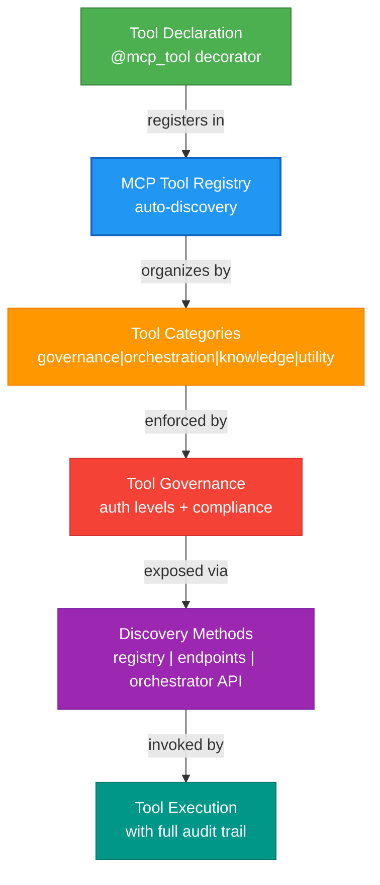

# MCP Tools Framework

> **Summary:** Complete catalog and integration guide for Model Context Protocol tools in CORTEX  
> **Authority:** cortex/mcp/ | **Last Updated:** 2026-01-22  
> **Responsibility:** Tool registration, discovery, governance, and execution

---

## Overview

The **Model Context Protocol (MCP) Tools** framework provides a standardized interface for exposing CORTEX capabilities as discoverable, governed tools. All tools are auto-registered, categorized, governed by auth levels and compliance modes, and discoverable through multiple methods.

**Key Features:**
- **14+ Tools Registered:** Governance, orchestration, knowledge, utility categories
- **Auto-Discovery:** Tools automatically discovered and registered via decorators
- **Governed Access:** Auth levels (PUBLIC, AUTHENTICATED, PRIVILEGED) enforce security
- **Compliance Modes:** STRICT, MODERATE, PERMISSIVE enforcement per tool
- **Registry Pattern:** Thread-safe enumeration and lookup
- **Endpoint Discovery:** Multiple discovery methods including `/list-tools` pattern

---

## Architecture Overview



---

## Tool Discovery Methods

### Method 1: Direct Registry Access

```python
from cortex.mcp.registry import get_mcp_tool_registry

registry = get_mcp_tool_registry()
for tool in registry.list_tools():
    print(f"{tool.tool_id}: {tool.tool_name}")
    print(f"  Category: {tool.category}")
    print(f"  Auth Level: {tool.auth_level}")
```

### Method 2: Endpoint Discovery (REST Pattern)

```python
from cortex.mcp.endpoints import list_tools_endpoint

tools = list_tools_endpoint()
# Returns: {"tools": [...], "count": N, "timestamp": "..."}
```

### Method 3: Orchestrator Discovery

```python
from cortex.orchestrators.core.master_orchestrator import MasterOrchestrator

master = MasterOrchestrator.instance()
result = master.get_mcp_tools()

if result.is_ok():
    tools = result.value
    for tool_name, tool_info in tools.items():
        print(f"Tool: {tool_name}")
```

### Method 4: Domain Filtering

```python
from cortex.mcp.endpoints import filter_tools_by_domain

governance_tools = filter_tools_by_domain("governance")
orchestration_tools = filter_tools_by_domain("orchestration")
knowledge_tools = filter_tools_by_domain("knowledge")
utility_tools = filter_tools_by_domain("utility")
```

---

## Tool Categories

### Governance Tools (5)

Security and policy enforcement tools for governance validation, AC tracking, and phase management.

| Tool ID | Name | Purpose | Auth Level |
|---------|------|---------|-----------|
| `governance_001` | Check Phase Lock | Verify governance phase immutability | PRIVILEGED |
| `governance_002` | Validate AC ID | Verify acceptance criteria format | AUTHENTICATED |
| `governance_003` | Canonicalize Intent | Normalize intent format | AUTHENTICATED |
| `governance_004` | Enforce Operation | Apply governance rules to operations | PRIVILEGED |
| `governance_005` | Get Phase Status | Query current phase state | AUTHENTICATED |

→ [Governance Tools Detail](01-governance-tools.md)

### Orchestration Tools (4)

Tools for orchestrator discovery, operation status, health monitoring, and configuration.

| Tool ID | Name | Purpose | Auth Level |
|---------|------|---------|-----------|
| `orch_001` | Diagnose Issues | Analyze orchestrator problems | AUTHENTICATED |
| `orch_002` | Get Operation Status | Query operation state | AUTHENTICATED |
| `orch_003` | Monitor Health | Collect health metrics | AUTHENTICATED |
| `orch_004` | Optimize Config | Suggest configuration improvements | PRIVILEGED |

→ [Orchestration Tools Detail](02-orchestration-tools.md)

### Knowledge Tools (3)

Tools for knowledge discovery, gap analysis, and synthesis.

| Tool ID | Name | Purpose | Auth Level |
|---------|------|---------|-----------|
| `knowledge_001` | Search Knowledge Base | Query domain brain | AUTHENTICATED |
| `knowledge_002` | Analyze Gap | Identify knowledge gaps | AUTHENTICATED |
| `knowledge_003` | Generate Summary | Create knowledge summaries | AUTHENTICATED |

→ [Knowledge Tools Detail](03-knowledge-tools.md)

### Utility Tools (2)

General-purpose utility and diagnostic tools.

| Tool ID | Name | Purpose | Auth Level |
|---------|------|---------|-----------|
| `utility_001` | Echo Tool | Test tool invocation | PUBLIC |
| `utility_002` | Health Check | System diagnostics | PUBLIC |

→ [Utility Tools Detail](04-utility-tools.md)

---

## Tool Registration & Governance

### Auto-Discovery Process

```python
# cortex/mcp/tool_discovery.py
from cortex.mcp.tool_discovery import ToolDiscoveryEngine

engine = ToolDiscoveryEngine()
tools = engine.discover_tools()  # Scans tool modules
engine.register_discovered_tools()  # Auto-registers all tools
```

**Discovery Scans:**
- `cortex.mcp.tools.governance` — Governance tools
- `cortex.mcp.tools.orchestration` — Orchestration tools
- `cortex.mcp.tools.knowledge` — Knowledge tools
- `cortex.mcp.tools.utility` — Utility tools

### Tool Declaration (Decorator Pattern)

```python
from cortex.mcp.decorators import mcp_tool

@mcp_tool(
    name="my_tool",
    description="What this tool does",
    category="governance",
    auth_level="AUTHENTICATED",
    compliance_mode="STRICT",
    version="1.0.0"
)
def my_tool(param1: str, param2: int) -> Dict[str, Any]:
    """Tool implementation with full docstring.
    
    Args:
        param1: Description of param1
        param2: Description of param2
        
    Returns:
        Dictionary with results
    """
    return {"result": "value"}
```

### Governance Enforcement

Each tool has:
- **Auth Level:** PUBLIC | AUTHENTICATED | PRIVILEGED
- **Compliance Mode:** STRICT | MODERATE | PERMISSIVE
- **Category:** Determines default policies
- **Version:** For backwards compatibility

```python
from cortex.mcp.tool_governance import get_governance_manager

manager = get_governance_manager()
policy = manager.get_tool_policy("governance_001")

if not policy.can_invoke(current_user):
    raise PermissionDenied(f"Auth level required: {policy.auth_level}")
```

---

## Tool Invocation

### Direct Function Call

```python
from cortex.mcp.tools.governance import check_phase_lock

result = check_phase_lock(phase_id="PHASE-001")
if result.is_ok():
    locked = result.value
    print(f"Phase locked: {locked}")
```

### Via Registry

```python
from cortex.mcp.registry import get_mcp_tool_registry

registry = get_mcp_tool_registry()
tool_def = registry.get_definition("governance_001")

result = tool_def.invoke(phase_id="PHASE-001")
```

### Via Orchestrator

```python
from cortex.orchestrators.domain.governance_orchestrator import GovernanceOrchestrator

gov_orch = GovernanceOrchestrator.instance()
result = gov_orch.invoke_tool("governance_001", phase_id="PHASE-001")
```

---

## Tool Metadata

Every tool exposes complete metadata:

```python
{
  "tool_id": "governance_001",
  "name": "check_phase_lock",
  "description": "Verify governance phase immutability",
  "category": "governance",
  "auth_level": "PRIVILEGED",
  "compliance_mode": "STRICT",
  "version": "1.0.0",
  "parameters": {
    "phase_id": {
      "type": "string",
      "description": "Phase identifier",
      "required": True
    }
  },
  "return_type": "Result[bool]",
  "tags": ["governance", "security", "immutable"],
  "example_usage": "...",
  "related_tools": ["governance_004", "governance_005"]
}
```

---

## Integration Points

### With Orchestrators

All orchestrators expose `get_mcp_tools()` method:

```python
from cortex.orchestrators.core.base_orchestrator import BaseOrchestratorV4

class MyOrchestrator(BaseOrchestratorV4):
    def get_mcp_tools(self) -> Result[Dict[str, Any]]:
        """Return MCP tools exposed by this orchestrator."""
        return Ok({
            "my_tool_1": tool_metadata,
            "my_tool_2": tool_metadata,
        })
```

### With MCP Server

Tools auto-exposed via MCP server `/list-tools` endpoint:

```bash
curl http://localhost:8000/list-tools
# Returns all registered MCP tools
```

### With Governance

All tool invocations subject to governance:

```python
from cortex.brain.core.governance_registry import GovernanceRegistry

registry = GovernanceRegistry.instance()
can_invoke = registry.can_invoke_tool("governance_001", user_context)

if can_invoke:
    result = invoke_tool("governance_001", params)
```

---

## Best Practices

### Tool Design

- ✅ Use descriptive names that indicate purpose
- ✅ Include comprehensive docstrings with type hints
- ✅ Use `Result[T]` pattern for returns (never throw)
- ✅ Keep tools focused (single responsibility)
- ✅ Include example usage in docstring
- ✅ Validate input parameters explicitly
- ✅ Log all tool invocations with audit trail
- ❌ Don't bypass governance checks
- ❌ Don't mix multiple concerns in one tool
- ❌ Don't expose internal implementation details

### Tool Governance

- ✅ Set appropriate auth levels (minimize PRIVILEGED)
- ✅ Use STRICT mode for security-critical tools
- ✅ Tag tools for discovery and filtering
- ✅ Version tools for backwards compatibility
- ✅ Document all parameters and return values
- ❌ Don't use PRIVILEGED for non-security tools
- ❌ Don't skip parameter validation
- ❌ Don't expose credentials in tool metadata

### Tool Testing

- ✅ Test tool invocation with valid parameters
- ✅ Test parameter validation (reject invalid inputs)
- ✅ Test auth level enforcement
- ✅ Test error handling (all failure paths)
- ✅ Test return value format
- ❌ Don't test without governance enforcement
- ❌ Don't skip negative test cases

---

## Troubleshooting

### Tool Not Appearing in Registry

**Problem:** Tool declared but not discoverable  
**Solution:** 
1. Verify `@mcp_tool` decorator is applied
2. Check tool module is in expected discovery path
3. Run discovery: `ToolDiscoveryEngine().discover_tools()`
4. Verify no import errors during discovery

### Tool Invocation Rejected

**Problem:** Tool exists but invocation fails with permission error  
**Solution:**
1. Check user auth level vs tool auth level
2. Verify governance rules don't prohibit invocation
3. Check compliance mode allows current context
4. Review audit log for policy violation details

### Registry Empty or Partial

**Problem:** Tool registry has fewer tools than expected  
**Solution:**
1. Check all tool modules imported
2. Verify discovery scans all categories
3. Check for import errors in tool modules
4. Run verbose discovery: `engine.discover_tools(verbose=True)`

---

## See Also

- [Governance Tools](01-governance-tools.md) — Security and policy enforcement
- [Orchestration Tools](02-orchestration-tools.md) — Orchestrator operations
- [Knowledge Tools](03-knowledge-tools.md) — Domain knowledge access
- [Utility Tools](04-utility-tools.md) — General-purpose utilities
- [Tool Registry](05-tool-registry.md) — Registry architecture
- [Custom Tool Development](06-custom-tool-development.md) — Creating new tools
- [MCP Architecture](mcp-architecture.md) — System architecture diagrams
- [Source Code: cortex/mcp/](../../../cortex/mcp/)
- [Tests: tests/unit/mcp/](../../../tests/unit/mcp/)

---

**Author:** CORTEX Documentation Engine  
**Generated:** 2026-01-22  
**Copyright © 2025-2026 Asif Hussain. All rights reserved.**
