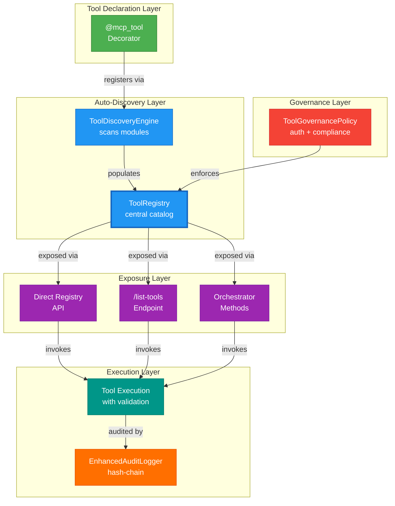
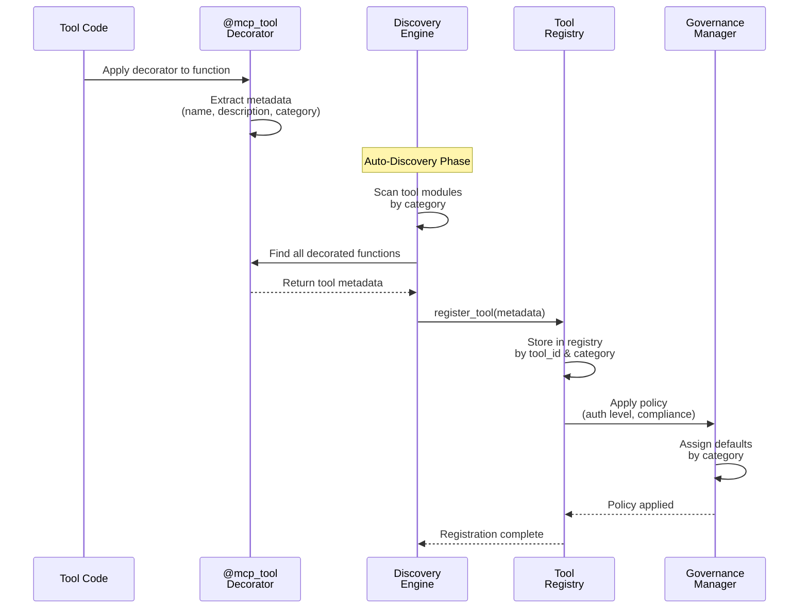
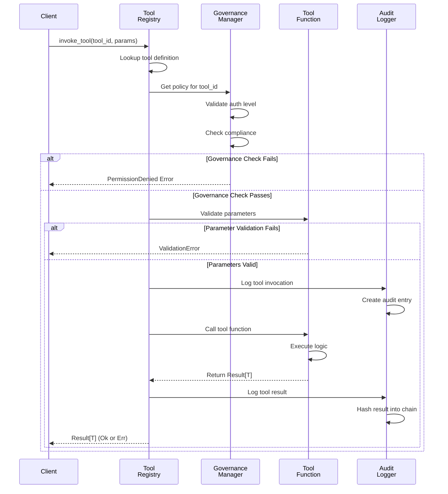

# MCP Tools Architecture & System Design

> **Summary:** System-level architecture, data flows, and design patterns for MCP tools framework  
> **Authority:** cortex/mcp/ | **Last Updated:** 2026-01-22

---

## System Architecture

### Multi-Layer Tool Stack



---

## Tool Lifecycle

### Registration Flow



---

## Data Structures

### Tool Definition

```python
@dataclass
class ToolDefinition:
    tool_id: str                          # Unique identifier
    name: str                             # Tool name
    description: str                      # What it does
    category: ToolCategory               # Classification
    auth_level: AuthLevel                # PUBLIC|AUTHENTICATED|PRIVILEGED
    compliance_mode: ComplianceMode      # STRICT|MODERATE|PERMISSIVE
    version: str                         # Version string
    parameters: Dict[str, ParamDef]     # Input parameters
    return_type: str                     # Return type signature
    tags: List[str]                      # Search tags
    example_usage: Optional[str]         # Code example
    related_tools: List[str]             # Cross-references
    module_path: str                     # Source file location
    created_at: datetime                 # Registration timestamp
```

### Tool Categories

```python
class ToolCategory(Enum):
    GOVERNANCE = "governance"           # Security & policy
    ORCHESTRATION = "orchestration"    # Orchestrator operations
    KNOWLEDGE = "knowledge"            # Domain brain queries
    UTILITY = "utility"               # General-purpose tools
    CUSTOM = "custom"                 # User-defined tools
```

### Auth Levels

```python
class AuthLevel(Enum):
    PUBLIC = 1           # No authentication required
    AUTHENTICATED = 2    # User must be authenticated
    PRIVILEGED = 3       # Requires elevated privileges
```

---

## Discovery Algorithm

### Phase 1: Module Scanning

```python
# Scan tool modules by category
TOOL_MODULES = {
    ToolCategory.GOVERNANCE: "cortex.mcp.tools.governance",
    ToolCategory.ORCHESTRATION: "cortex.mcp.tools.orchestration",
    ToolCategory.KNOWLEDGE: "cortex.mcp.tools.knowledge",
    ToolCategory.UTILITY: "cortex.mcp.tools.utility",
}

for category, module_path in TOOL_MODULES.items():
    module = importlib.import_module(module_path)
    for name, obj in inspect.getmembers(module):
        if is_mcp_tool(obj):
            tools.append(extract_metadata(obj))
```

### Phase 2: Metadata Extraction

```python
def extract_metadata(func) -> ToolDefinition:
    # Get decorator metadata
    tool_id = func.__mcp_tool_id__
    metadata = func.__mcp_metadata__
    
    # Extract signature
    sig = inspect.signature(func)
    params = {
        name: param_to_definition(param)
        for name, param in sig.parameters.items()
    }
    
    # Extract return type
    return_type = get_return_type_string(sig)
    
    return ToolDefinition(
        tool_id=tool_id,
        name=metadata["name"],
        description=metadata["description"],
        category=metadata["category"],
        auth_level=metadata["auth_level"],
        compliance_mode=metadata["compliance_mode"],
        version=metadata["version"],
        parameters=params,
        return_type=return_type,
        tags=metadata.get("tags", []),
        example_usage=func.__doc__,
        module_path=func.__module__,
        created_at=datetime.now()
    )
```

### Phase 3: Registry Population

```python
def register_discovered_tools(tools: List[ToolDefinition]):
    registry = get_mcp_tool_registry()
    
    for tool_def in tools:
        # Register in main registry
        registry.register(tool_def)
        
        # Index by category
        registry.index_by_category(tool_def.category, tool_def)
        
        # Index by tags
        for tag in tool_def.tags:
            registry.index_by_tag(tag, tool_def)
        
        # Apply governance policy
        manager = get_governance_manager()
        policy = manager.get_category_policy(tool_def.category)
        registry.apply_policy(tool_def.tool_id, policy)
```

---

## Governance Enforcement

### Policy Application

```mermaid
graph LR
  A["Tool Metadata<br/>category + auth_level"] -->|lookup| B["Governance Manager"]
  B -->|applies| C["Category Defaults<br/>auth level + compliance"]
  C -->|creates| D["ToolGovernancePolicy<br/>enforcement rules"]
  D -->|stored in| E["Policy Cache<br/>per tool_id"]
  E -->|checked on| F["Tool Invocation"]
  F -->|validate| G["User Auth Level<br/>vs Policy"]
  G -->|enforce| H["Execution Allowed<br/>or Rejected"]
  
  style A fill:#ff9800,stroke:#f57c00,color:#fff
  style B fill:#f44336,stroke:#d32f2f,color:#fff
  style D fill:#f44336,stroke:#d32f2f,color:#fff,stroke-width:2px
  style H fill:#4caf50,stroke:#2e7d32,color:#fff
```



### Enforcement Check

```python
def can_invoke_tool(
    tool_id: str,
    user_context: UserContext
) -> bool:
    """Check if user can invoke tool based on governance policy."""
    
    # Get tool policy
    policy = governance_manager.get_tool_policy(tool_id)
    
    # Check auth level
    if user_context.auth_level.value < policy.required_auth_level.value:
        logger.warn(f"Auth level rejected: {tool_id}")
        return False
    
    # Check compliance mode
    if policy.compliance_mode == ComplianceMode.STRICT:
        if not policy.verify_context_compliance(user_context):
            logger.warn(f"Compliance check failed: {tool_id}")
            return False
    
    # Check rate limiting
    if policy.rate_limit and exceeds_rate_limit(tool_id, user_context):
        logger.warn(f"Rate limit exceeded: {tool_id}")
        return False
    
    return True
```

---

## Tool Invocation Flow

### Execution Pipeline



---

## Discovery Robustness

### Error Handling

```python
class ToolDiscoveryEngine:
    def discover_tools_safely(self) -> List[ToolDefinition]:
        """Discover tools with comprehensive error handling."""
        tools = []
        errors = []
        
        for category, module_path in self.TOOL_MODULES.items():
            try:
                module = importlib.import_module(module_path)
                category_tools = self._scan_module(module, category)
                tools.extend(category_tools)
                logger.info(f"Discovered {len(category_tools)} {category} tools")
            except ImportError as e:
                errors.append((category, f"Import error: {e}"))
                logger.error(f"Failed to import {module_path}: {e}")
            except Exception as e:
                errors.append((category, f"Unexpected error: {e}"))
                logger.error(f"Failed to discover {category} tools: {e}")
        
        if errors:
            logger.warn(f"Discovery completed with {len(errors)} errors")
            for category, error in errors:
                logger.warn(f"  {category}: {error}")
        
        return tools
```

### Validation

```python
def validate_tool_definition(tool_def: ToolDefinition) -> Result[None]:
    """Validate tool definition for consistency."""
    
    errors = []
    
    # Validate required fields
    if not tool_def.tool_id:
        errors.append("tool_id is required")
    if not tool_def.name:
        errors.append("name is required")
    if not tool_def.description:
        errors.append("description is required")
    
    # Validate parameter types
    for param_name, param_def in tool_def.parameters.items():
        if not param_def.type_hint:
            errors.append(f"Parameter '{param_name}' missing type hint")
    
    # Validate return type
    if not tool_def.return_type:
        errors.append("return_type is required")
    
    if errors:
        return Err("\n".join(errors))
    
    return Ok(None)
```

---

## Performance Considerations

### Registry Caching

Tools are cached in memory with lazy initialization:

```python
class ToolRegistry:
    def __init__(self):
        self._tools = {}          # tool_id -> ToolDefinition
        self._by_category = {}    # category -> [tool_ids]
        self._by_tag = {}         # tag -> [tool_ids]
        self._policies = {}       # tool_id -> ToolGovernancePolicy
        
    def get_tool(self, tool_id: str) -> Optional[ToolDefinition]:
        """Get tool with O(1) lookup."""
        return self._tools.get(tool_id)
    
    def list_tools_by_category(self, category: ToolCategory) -> List[ToolDefinition]:
        """Get category tools with O(1) lookup (pre-indexed)."""
        tool_ids = self._by_category.get(category, [])
        return [self._tools[id] for id in tool_ids]
```

### Thread Safety

Registry uses read-write locks for concurrent access:

```python
class ThreadSafeToolRegistry:
    def __init__(self):
        self._registry = ToolRegistry()
        self._lock = RWLock()
    
    def get_tool(self, tool_id: str) -> Optional[ToolDefinition]:
        """Thread-safe read."""
        with self._lock.read():
            return self._registry.get_tool(tool_id)
    
    def register_tool(self, tool_def: ToolDefinition) -> None:
        """Thread-safe write."""
        with self._lock.write():
            self._registry.register(tool_def)
```

---

## See Also

- [MCP Tools Overview](00-mcp-index.md)
- [Custom Tool Development](06-custom-tool-development.md)
- [Source: cortex/mcp/registry.py](../../../cortex/mcp/registry.py)
- [Source: cortex/mcp/tool_discovery.py](../../../cortex/mcp/tool_discovery.py)
- [Tests: tests/unit/mcp/](../../../tests/unit/mcp/)

---

**Author:** CORTEX Documentation Engine  
**Generated:** 2026-01-22  
**Copyright © 2025-2026 Asif Hussain. All rights reserved.**
