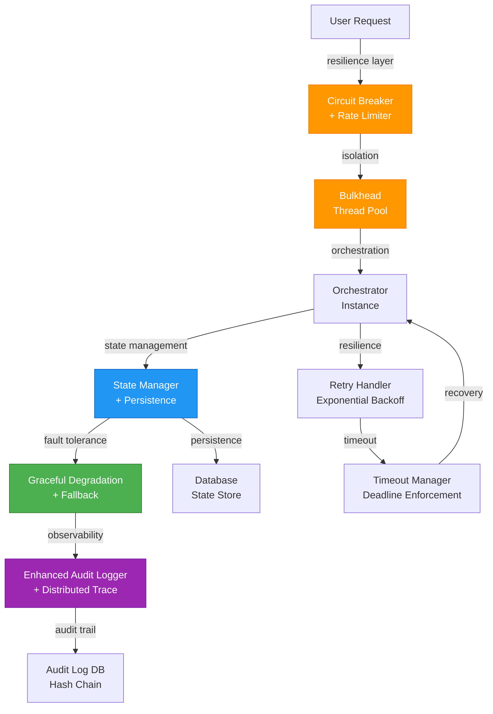
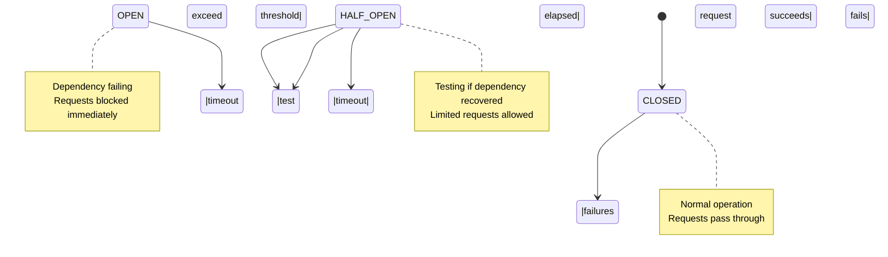
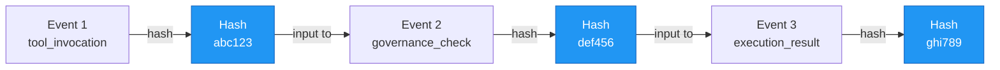

# Infrastructure & Resilience Patterns

> **Summary:** Fault tolerance, circuit breakers, state management, and observability architecture  
> **Authority:** cortex/infrastructure/ | **Last Updated:** 2026-01-22

---

## Overview

CORTEX infrastructure provides enterprise-grade resilience patterns for reliable orchestration under production load, partial failures, and ongoing changes.

**Core Patterns:**
- Circuit breakers for dependency protection
- Bulkhead isolation for resource containment
- Retry with exponential backoff and jitter
- Timeout enforcement at all integration points
- State persistence with crash recovery
- Comprehensive audit trails with hash-chain verification
- Observability with distributed tracing

---

## Architecture



---

## Circuit Breaker Pattern

Prevents cascading failures by stopping requests when dependency is failing.



**Configuration:**
- Failure threshold: 50% of requests in 10-request window
- Timeout: 60 seconds before attempting recovery
- Half-open test requests: 3 before deciding

**Usage:**
```python
from cortex.infrastructure.resilience import CircuitBreaker

breaker = CircuitBreaker(
    name="domain_orchestrator",
    failure_threshold=0.5,
    recovery_timeout=60.0,
    test_requests=3
)

result = breaker.execute(orchestrator.execute, args)
```

---

## State Management

### Crash Recovery

State is persisted to database with checkpoint mechanism:

```python
from cortex.brain.core.state_manager import StateManager

state_mgr = StateManager.instance()

# Save checkpoint before risky operation
checkpoint_id = state_mgr.create_checkpoint("pre_operation")

try:
    result = execute_operation()
    state_mgr.commit_checkpoint(checkpoint_id)
except Exception as e:
    state_mgr.rollback_to_checkpoint(checkpoint_id)
    raise
```

### Concurrency

State manager is thread-safe with optimistic locking:

```python
# Write lock with version check
updated = state_mgr.update_if_version(
    state_key="orchestration_state",
    current_version=42,
    new_value={"status": "completed"},
)

if not updated:
    # Version mismatch - someone else updated
    # Retry or handle conflict
    pass
```

---

## Audit Logging

All operations logged with hash-chain verification:



**Verification:**
```python
from cortex.infrastructure.enhanced_audit_logger import verify_audit_chain

is_valid = verify_audit_chain(
    start_event_id="evt_001",
    end_event_id="evt_099"
)

if not is_valid:
    logger.error("Audit chain broken - potential tampering!")
```

---

## Timeout Enforcement

Deadlines propagated through entire call stack:

```python
from cortex.infrastructure.timeout import TimeoutManager

timeout_mgr = TimeoutManager.instance()

# Set deadline for entire operation
timeout_mgr.set_deadline(deadline=time.time() + 30.0)

try:
    # All sub-operations check deadline
    result = orchestrator.execute()
finally:
    timeout_mgr.clear_deadline()
```

---

## Observability

### Distributed Tracing

All operations traced with correlation IDs:

```python
from cortex.infrastructure.observability import Tracer

tracer = Tracer.instance()
trace_id = tracer.start_span("user_request")

try:
    # Span automatically includes trace_id in all logs
    logger.info(f"Processing request")  # Logs trace_id
    
    result = orchestrator.execute()
    tracer.record_metric("execution_time", elapsed)
except Exception as e:
    tracer.record_error(trace_id, e)
finally:
    tracer.end_span(trace_id)
```

### Metrics

Key metrics collected:
- Request rate (req/sec)
- Response time percentiles (p50, p95, p99)
- Error rate (errors/sec)
- Circuit breaker state transitions
- Tool invocation duration by tool
- Governance rule evaluation time

---

## See Also

- [State Management](../04-architecture/state-management.md)
- [Audit Logging](../04-architecture/audit-logging.md)
- [Observability Guide](15-observability/00-observability-index.md)
- [Source: cortex/infrastructure/](../../../cortex/infrastructure/)

---

**Author:** CORTEX Documentation Engine  
**Generated:** 2026-01-22  
**Copyright © 2025-2026 Asif Hussain. All rights reserved.**
