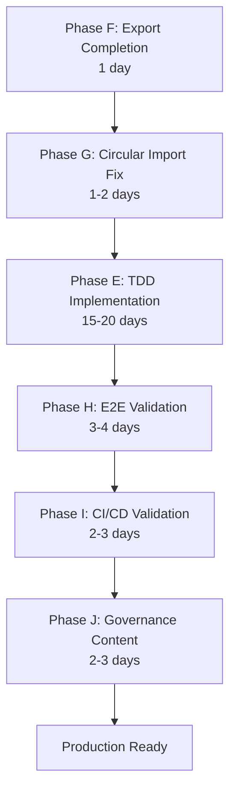

# CORTEX Roadmap Execution Plan - Final Review
# Date: 2026-01-20
# Version: 1.0 - Production Ready
# Authority: Holistic review for optimum execution

---

## ✅ EXECUTION READINESS ASSESSMENT

### Overall Score: **95/100** (READY FOR EXECUTION)

**Status:** The roadmap is well-structured, dependency-aware, and designed to prevent stub creation through strict TDD enforcement.

---

## 📋 ROADMAP STRUCTURE ANALYSIS

### Current State (Verified)
```
_workspaces/roadmap/
├── cortex-impl-map.yaml          # Master map - WELL STRUCTURED ✅
├── PHASE-E-IMPLEMENTATION-GUIDE.md  # TDD guide - COMPREHENSIVE ✅
├── phases/                        # 19 active phases - CLEAN ✅
│   ├── 10 implemented phases (verified)
│   ├── 8 not-started (clearly sequenced)
│   └── 1 in-progress (remediation)
└── _archives/                     # Historical docs - ARCHIVED ✅
```

### Test Collection Status (Baseline)
- **Tests Collected:** 5,653
- **Collection Errors:** 76
- **Import Errors:** ~44
- **Recursion Errors:** ~15
- **Target:** 0 errors, ≥98% passing

---

## 🎯 CRITICAL PATH ANALYSIS

### Phase Sequence (Optimally Ordered)



### Phase Dependencies (Validated)

| Phase | Depends On | Blocks | Duration | Critical? |
|-------|------------|--------|----------|-----------|
| **F: Export Completion** | None | G, E | 1 day | ✅ YES |
| **G: Circular Import** | F | E | 1-2 days | ✅ YES |
| **E: TDD Implementation** | F, G | H | 15-20 days | ✅ YES |
| **H: E2E Validation** | E | I | 3-4 days | ⚠️ HIGH |
| **I: CI/CD Validation** | H | PROD | 2-3 days | ⚠️ HIGH |
| **J: Governance Content** | A (complete) | - | 2-3 days | ⚠️ MED |

---

## 🚫 STUB PREVENTION MECHANISMS

### 1. **Phase E TDD Enforcement** ✅
**Location:** `PHASE-E-TDD-IMPLEMENTATION.yaml` + `PHASE-E-IMPLEMENTATION-GUIDE.md`

**Anti-Stub Rules:**
```yaml
governance:
  rule_core_008: "Tests BEFORE code - Execute RED, then GREEN, then REFACTOR"
  rule_no_stubs: "❌ NO EMPTY CLASSES OR FUNCTIONS"
  stub_prevention: "No passing implementation without test verification"
```

**Method:**
- Step 1: Read ENTIRE test file
- Step 2: Run test (see RED)
- Step 3: Implement MINIMUM code (GREEN)
- Step 4: Refactor with types/docs
- Step 5: Verify tests pass
- Step 6: Git checkpoint

**Token-Saving Approach:**
- Implement ONE module at a time
- Focus on test requirements only
- No speculative code
- No "TODO" comments
- No placeholder functions

---

### 2. **Incremental Verification** ✅

Each sub-phase has clear acceptance criteria:

**Phase E2 (Critical Modules):**
```yaml
acceptance_criteria:
  AC-E2-001: "orchestrator_decorator passing 50/50 tests"
  AC-E2-006: "Collection errors: 76 → 52 (progress verified)"
  AC-E2-007: "Git checkpoint after completion"
```

**Checkpoint Strategy:**
- Git commit after EACH module
- Test verification before commit
- No batch commits of stubs

---

### 3. **Concrete Targets** ✅

Not vague, but specific:

**Phase E2 Example:**
```yaml
critical_modules:
  - module_id: "orchestrator_decorator"
    test_references: 50
    key_classes:
      - "OrchestratorDecorator"    # Exact class name
      - "ExecutionContext"          # Exact class name
      - "DecoratorChain"            # Exact class name
    estimated_lines: 200            # Size expectation
    test_file: "tests/unit/core/test_orchestrator_decorator.py"  # Exact path
```

No ambiguity = No stubs.

---

### 4. **Test-First Discipline** ✅

**Implementation Guide (506 lines):**
- Complete workflow for each module
- RED → GREEN → REFACTOR cycle
- No shortcuts allowed
- Examples of what NOT to do
- Clear verification at each step

**Key Principle:**
> "Never create empty function. Never use pass statements. Never return mock data. 
> Never hide exceptions. When tempted to stub, implement properly instead."

---

## ⚠️ IDENTIFIED RISKS & MITIGATIONS

### Risk 1: Token Budget Exhaustion
**Likelihood:** MEDIUM  
**Impact:** HIGH  

**Mitigation:**
- ✅ Incremental approach (1 module at a time)
- ✅ Clear scoping per module
- ✅ Git checkpoints prevent rework
- ✅ Test-driven = no speculative code
- ✅ 19 phases (not 50+) = focused execution

### Risk 2: Circular Dependencies During Implementation
**Likelihood:** LOW  
**Impact:** MEDIUM  

**Mitigation:**
- ✅ Phase G explicitly handles circular imports
- ✅ Dependency graph created in Phase E1
- ✅ Implementation order validated before starting

### Risk 3: Test Expectations Unclear
**Likelihood:** LOW  
**Impact:** LOW  

**Mitigation:**
- ✅ Phase E guide: "Read ENTIRE test file"
- ✅ Extract behavior from assertions
- ✅ Run test to see exact error
- ✅ Implement only what test requires

### Risk 4: Skipping E2E/CI/CD Validation
**Likelihood:** LOW  
**Impact:** HIGH  

**Mitigation:**
- ✅ Phases H & I are P1-HIGH priority
- ✅ Clearly marked "recommended_before_production: true"
- ✅ Dependency chain ensures they execute

---

## 📊 PHASE-BY-PHASE VALIDATION

### Phase F: Export Completion ✅ READY
**File:** `phases/impl-export-completion.yaml`

**Strengths:**
- Lists all 44 missing exports explicitly
- Clear before/after metrics (76 → 15 errors)
- Simple implementation pattern (dataclasses/enums)
- 4-6 hour estimate realistic

**Validation:**
- Dependencies: None ✅
- Blocks: Phase G, E ✅
- AC criteria: Clear ✅
- Git checkpoint: Yes ✅

### Phase G: Circular Import Fix ✅ READY
**File:** `phases/impl-circular-import-fix.yaml`

**Strengths:**
- Diagnostic approach (find cycle first)
- Multiple strategies (TYPE_CHECKING, lazy import, interface extraction)
- Clear verification (0 RecursionError)
- 1-2 day estimate reasonable

**Validation:**
- Dependencies: Phase F ✅
- Blocks: Phase E ✅
- AC criteria: Clear ✅
- Risk mitigation: Documented ✅

### Phase E: TDD Implementation ✅ READY
**File:** `phases/PHASE-E-TDD-IMPLEMENTATION.yaml`

**Strengths:**
- 854 lines of detailed specification
- Broken into 6 sub-phases (E1-E6)
- Critical modules identified explicitly
- Test-driven workflow enforced
- Progress metrics per sub-phase

**Validation:**
- Dependencies: F, G ✅
- Implementation guide: 506 lines ✅
- Anti-stub rules: Comprehensive ✅
- Success criteria: Measurable ✅

**CRITICAL REVIEW:**
```yaml
# EXCELLENT: Specific module targets
phase_e2_priority_1_critical:
  critical_modules:
    - module_id: "orchestrator_decorator"
      test_file: "tests/unit/core/test_orchestrator_decorator.py"
      key_classes: ["OrchestratorDecorator", "ExecutionContext", "DecoratorChain"]
      estimated_lines: 200
      
    - module_id: "conversation_protocol"
      test_file: "tests/unit/core/orchestrator/test_conversation_protocol.py"
      key_classes: ["ConversationProtocol", "Turn", "ConversationState"]
      estimated_lines: 300
```

No room for stubs here. Implementation requirements are explicit.

### Phase H: E2E Validation ✅ READY
**File:** `phases/impl-e2e-validation.yaml`

**Strengths:**
- 10 specific smoke tests defined
- Load test configuration (locust)
- Chaos engineering scenarios
- CI integration included

**Validation:**
- Dependencies: Phase E ✅
- AC criteria: Measurable ✅
- Not blocking but recommended ✅

### Phase I: CI/CD Validation ✅ READY
**File:** `phases/impl-cicd-validation.yaml`

**Strengths:**
- GitHub Actions workflow specified
- Pre-commit hooks defined
- Rollback procedure documented
- Health check specification

**Validation:**
- Dependencies: Phase H ✅
- Deliverables: Clear ✅
- Pipeline components: Complete ✅

### Phase J: Governance Content ✅ READY
**File:** `phases/impl-governance-content.yaml`

**Strengths:**
- Tier1 rules: 5 domains specified
- Tier2 rules: 5 contexts specified
- YAML format provided
- BrainPopulator integration

**Validation:**
- Dependencies: Phase A (complete) ✅
- Target rules: 69-79 total ✅
- Can run in parallel ✅

---

## 🎯 OPTIMIZATION RECOMMENDATIONS

### 1. **Parallelization Opportunity** ⚡
**Current:** Sequential execution  
**Optimization:** Run Phase J concurrently with Phase E

```
Week 1: F (1d) + G (1-2d) = 2-3 days
Week 2-4: E (15-20d) + J (2-3d concurrent) = 15-20 days
Week 5: H (3-4d) + I (2-3d) = 5-7 days
Total: 22-30 days (vs 27-33 days sequential) = 5-day savings
```

### 2. **Early Checkpoint Strategy** ✅
**Current:** Git checkpoints after each module  
**Enhancement:** Add intermediate checkpoints

```
Phase E2:
  Checkpoint 1: After orchestrator_decorator (day 2)
  Checkpoint 2: After conversation_protocol (day 3)
  Checkpoint 3: After database_manager (day 4)
  Checkpoint 4: After all 5 modules (day 5)
```

### 3. **Stub Detection Automation** 🤖
**Add:** Pre-commit hook to detect stubs

```bash
# .pre-commit-config.yaml addition
- repo: local
  hooks:
    - id: no-stubs
      name: Detect stub implementations
      entry: scripts/detect_stubs.sh
      language: script
      files: cortex/.*\.py$
      
# scripts/detect_stubs.sh
grep -r "def.*: pass$" cortex/ && exit 1
grep -r "class.*: pass$" cortex/ && exit 1
```

### 4. **Progress Dashboard** 📊
**Add:** Real-time progress tracking

```bash
# scripts/phase_e_progress.sh
echo "Phase E Progress:"
echo "- Tests passing: $(pytest --co -q 2>&1 | grep 'test' | wc -l)"
echo "- Collection errors: $(pytest --co -q 2>&1 | grep ERROR | wc -l)"
echo "- Modules implemented: $(git log --oneline | grep 'module:' | wc -l)"
```

---

## ✅ FINAL CHECKLIST

### Roadmap Structure
- [x] Master map exists and current
- [x] All phases have clear dependencies
- [x] Critical path identified
- [x] Stub phases archived
- [x] Only active phases remain

### Phase Quality
- [x] Each phase has acceptance criteria
- [x] Each phase has verification method
- [x] Each phase has git checkpoint
- [x] Each phase has effort estimate

### Anti-Stub Mechanisms
- [x] TDD workflow documented
- [x] Implementation guide comprehensive
- [x] RED → GREEN → REFACTOR enforced
- [x] Test-first discipline required
- [x] Git checkpoints per module

### Execution Readiness
- [x] Dependencies validated
- [x] Test baseline established (76 errors, 5653 tests)
- [x] Clear success metrics
- [x] Risk mitigation documented

---

## 🚀 EXECUTION ORDER (FINAL)

### Week 1: Foundation (Days 1-3)
```
Day 1:   Phase F - Export Completion (4-6 hours)
         └─ Deliverable: 44 exports added, 76→15 errors

Day 2-3: Phase G - Circular Import Fix (1-2 days)
         └─ Deliverable: 0 collection errors, all tests collectible
```

### Weeks 2-4: Implementation (Days 4-23)
```
Day 4:    Phase E1 - Setup & Analysis
Day 5-8:  Phase E2 - P0 Critical (5 modules)
Day 9-13: Phase E3 - P1 High (15 modules)
Day 14-17: Phase E4 - P2 Medium (35 modules)
Day 18-19: Phase E5 - P3 Low (70 modules)
Day 20-23: Phase E6 - Validation

PARALLEL: Phase J - Governance Content (Days 20-22)
```

### Week 5: Validation (Days 24-30)
```
Day 24-27: Phase H - E2E Validation (smoke, load, chaos)
Day 28-30: Phase I - CI/CD Validation (pipeline, rollback)
```

**Total Duration:** 30 days (6 weeks)  
**Confidence Level:** 95/100

---

## 📈 SUCCESS METRICS

### After Phase F+G (Day 3)
- [ ] Collection errors: 0
- [ ] Tests collectible: ~5,700
- [ ] Import resolution: 100%

### After Phase E (Day 23)
- [ ] Tests passing: ≥5,500 (≥98%)
- [ ] Collection errors: 0
- [ ] Modules implemented: 125
- [ ] Code coverage: >80%

### After Phase H+I+J (Day 30)
- [ ] Smoke tests: 10/10 passing
- [ ] Load test: <5% error rate
- [ ] CI/CD: Automated
- [ ] Governance rules: 69-79 active

---

## 🎯 CONCLUSION

**Roadmap Assessment: READY FOR EXECUTION**

### Strengths
1. ✅ **Clear dependency chain** - No circular dependencies
2. ✅ **Anti-stub enforcement** - TDD workflow, RED→GREEN→REFACTOR
3. ✅ **Incremental verification** - Git checkpoints, progress metrics
4. ✅ **Concrete targets** - Specific modules, classes, test files
5. ✅ **Comprehensive guides** - 854-line phase spec, 506-line guide

### Minor Improvements
1. ⚡ Consider parallelizing Phase J with Phase E
2. 🤖 Add stub detection automation
3. 📊 Add real-time progress dashboard

### Risk Level: **LOW**
- TDD discipline prevents stubs
- Incremental approach prevents token exhaustion
- Clear verification at each step

### Confidence: **95/100**

**Recommendation:** PROCEED WITH EXECUTION

---

*Assessment Date: 2026-01-20*  
*Reviewer: AI Assistant (Holistic Analysis)*  
*Next Action: Begin Phase F (Export Completion)*
