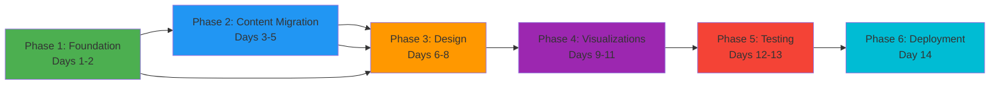

# CORTEX Documentation Migration: Execution Roadmap
**Generated:** 2026-01-25 | **Orchestrator:** PlanningOrchestrator  
**Plan Reference:** DOCUMENTATION-MIGRATION-PLAN-2026-01-25.md

---

## 📍 Execution Phases with Tasks

### PHASE 1: FOUNDATION SETUP (Days 1-2)

#### Task 1.1: Directory Structure Scaffolding
```yaml
Priority: CRITICAL
Duration: 4 hours
Dependencies: None
Acceptance Criteria:
  - cortex-gitpages/ root created
  - All subdirectories present
  - Symbolic links to source assets established
  - .gitignore configured
  - GitHub Pages config ready

Actions:
  1. Create root directory structure (17 directories)
  2. Create placeholder index.html
  3. Create _config.yml for Jekyll/GitHub Pages
  4. Create Gemfile for dependencies
  5. Create .gitignore with build artifacts
```

#### Task 1.2: Design System Integration
```yaml
Priority: CRITICAL
Duration: 6 hours
Dependencies: Task 1.1
Acceptance Criteria:
  - cortex-glassmorphism.css copied and tested
  - CSS variables accessible in all pages
  - theme/main.html integrated
  - Custom theme applied to base template
  - CSS no conflicts with base theme

Actions:
  1. Copy cortex-glassmorphism.css → stylesheets/
  2. Copy micro-interactions.css → stylesheets/
  3. Copy theme/main.html → theme/
  4. Create cortex-theme.css (enhanced override)
  5. Test CSS precedence and specificity
  6. Create CSS variable documentation
```

#### Task 1.3: Build & Deployment Setup
```yaml
Priority: HIGH
Duration: 4 hours
Dependencies: Task 1.1
Acceptance Criteria:
  - MkDocs configured for cortex-gitpages
  - Build produces valid HTML
  - serve-docs.sh works on macOS/Linux
  - serve-docs.bat works on Windows
  - CI/CD pipeline ready (optional)

Actions:
  1. Create mkdocs.yml for cortex-gitpages
  2. Configure site metadata and navigation
  3. Create Makefile for build commands
  4. Copy serve-docs.sh and adapt
  5. Create build documentation
  6. Test local build process
```

---

### PHASE 2: CONTENT MIGRATION (Days 3-5)

#### Task 2.1: Core Documentation Migration
```yaml
Priority: CRITICAL
Duration: 12 hours (over 2 days)
Dependencies: Phase 1 complete
Acceptance Criteria:
  - All 85+ .md files copied to cortex-gitpages/docs/
  - All internal links updated (checked via LinkChecker)
  - All image references verified
  - Frontmatter metadata preserved or updated
  - No broken markdown syntax
  - TOC hierarchy correct

Actions:
  1. Batch copy all .md files from docs/ → cortex-gitpages/docs/
  2. Update internal links (../../../ → consistent path)
  3. Verify image paths and copy missing assets
  4. Run markdown linter (markdownlint)
  5. Test rendering of all pages locally
  6. Create link verification report
```

#### Task 2.2: Diagram Integration & Cataloging
```yaml
Priority: HIGH
Duration: 8 hours (over 2 days)
Dependencies: Task 2.1
Acceptance Criteria:
  - 13 Mermaid .mmd files in _diagrams/mermaid/
  - 4 D3.js .html files in _diagrams/d3/
  - Diagram metadata index created (YAML)
  - Diagram references embedded in docs
  - All diagrams render without errors
  - Diagram search functionality working

Actions:
  1. Copy 13 Mermaid files from _workspaces/docs/_diagrams/
  2. Copy 4 D3.js visualizations from docs/_diagrams/d3/
  3. Create _diagrams/README.md with catalog
  4. Create _diagrams/metadata.yaml with descriptions
  5. Embed diagram references in relevant docs:
     - architecture-overview.mmd → 02-architecture/
     - governance-tiers.mmd → governance rules
     - intent-router-flow.mmd → orchestrators
     - etc.
  6. Add diagram gallery page (06-reference/diagram-gallery.md)
  7. Test all Mermaid rendering
```

#### Task 2.3: Content Enhancement & Linking
```yaml
Priority: MEDIUM
Duration: 8 hours (over 1 day)
Dependencies: Task 2.2
Acceptance Criteria:
  - Breadcrumb navigation on all pages
  - Cross-references between related docs
  - "See also" sections populated
  - Internal link anchors working
  - External links verified (spot check)
  - Search index complete

Actions:
  1. Add breadcrumb include to all pages
  2. Create cross-reference matrix (docs spreadsheet)
  3. Add "See also" sections to related pages
  4. Create navigation index (_includes/nav-index.html)
  5. Test all anchor links (#section)
  6. Verify external links (spot check 20%)
  7. Generate search index
```

---

### PHASE 3: DESIGN ENHANCEMENT (Days 6-8)

#### Task 3.1: Glassmorphism Theme Application
```yaml
Priority: HIGH
Duration: 10 hours (over 2 days)
Dependencies: Phase 1 + Phase 2 complete
Acceptance Criteria:
  - Dark blue (#0a1428) background on all pages
  - Glassmorphism effects on cards, modals, overlays
  - Consistent color palette (primary, accent, text)
  - No contrast issues (WCAG AA minimum)
  - No CSS conflicts or overrides needed
  - Styling consistent across all page types

Actions:
  1. Create cortex-theme.css with site-specific overrides
  2. Apply dark blue background gradient
  3. Style cards with glass effect (backdrop-filter)
  4. Style navigation with glass effect
  5. Update code blocks with glass styling
  6. Update callout boxes (admonitions) with glass effect
  7. Test in 4 browsers (Chrome, Firefox, Safari, Edge)
  8. Run WAVE accessibility scanner (verify no issues)
```

#### Task 3.2: Micro-Interactions Implementation
```yaml
Priority: MEDIUM
Duration: 8 hours (over 1.5 days)
Dependencies: Task 3.1
Acceptance Criteria:
  - Smooth hover effects on interactive elements
  - Sidebar expand/collapse animation (smooth)
  - Page transitions fade-in (no jank)
  - Button states (hover, active, disabled) clear
  - Mobile touch interactions smooth
  - No animation performance issues (60fps target)

Actions:
  1. Copy micro-interactions.css from Location A
  2. Adapt animations for cortex-gitpages context
  3. Implement nav item hover effects
  4. Implement sidebar toggle animation
  5. Implement content section fade-in
  6. Add page transition effects
  7. Test animation performance (DevTools Performance)
  8. Optimize for 60fps (remove heavy transitions)
```

#### Task 3.3: Responsive & Component Styling
```yaml
Priority: HIGH
Duration: 6 hours (over 1 day)
Dependencies: Task 3.1
Acceptance Criteria:
  - Mobile: 320px, 375px, 425px screens work
  - Tablet: 768px, 1024px screens work
  - Desktop: 1280px, 1440px screens work
  - All components responsive (cards, tables, code)
  - Navigation collapses to hamburger on mobile
  - Touch targets ≥44px on mobile
  - No horizontal scroll
  - No layout shift during load

Actions:
  1. Add responsive breakpoints to CSS
  2. Test on 8 screen sizes (Chrome DevTools)
  3. Fix mobile navigation (hamburger menu)
  4. Test table responsiveness
  5. Optimize code block display on mobile
  6. Test image responsive behavior
  7. Use Chrome DevTools Device Mode for testing
```

---

### PHASE 4: INTERACTIVE VISUALIZATIONS (Days 9-11)

#### Task 4.1: D3.js Visualization Integration
```yaml
Priority: HIGH
Duration: 10 hours (over 2 days)
Dependencies: Phase 3 complete
Acceptance Criteria:
  - 4 D3.js visualizations loaded and rendered
  - Hover tooltips display information
  - Zoom/pan functionality working
  - Color scheme matches glassmorphism theme
  - Performance: render < 1 second
  - Mobile: touch-friendly zoom/pan
  - Export to PNG/SVG available

Visualizations:
  1. domain-brain-architecture.html
     - Enhanced with glassmorphism colors
     - Add drill-down capability
     - Add search/filter by node type
  
  2. governance-pyramid.html
     - Interactive tier expansion
     - Rule details on hover
     - Color-coded by tier (Tier 0 red, 1 yellow, etc.)
  
  3. request-lifecycle-sankey.html
     - Sankey flow visualization
     - Stage details on hover
     - Performance metrics overlay
  
  4. tdd-knowledge-cycle.html
     - Circular temporal diagram
     - Phase transition animation
     - Step-by-step walkthrough mode

Actions:
  1. Copy 4 D3.js files to _diagrams/d3/
  2. Update D3.js color schemes to match palette
  3. Add theme toggle capability
  4. Implement tooltip system for all 4 charts
  5. Add interactive legend/filter
  6. Optimize rendering (data aggregation, WebGL if needed)
  7. Test on mobile devices (touch interactions)
  8. Add loading indicators for large datasets
```

#### Task 4.2: Mermaid Diagram Enhancement
```yaml
Priority: MEDIUM
Duration: 8 hours (over 1.5 days)
Dependencies: Phase 3 complete + Task 2.2
Acceptance Criteria:
  - All 13 Mermaid diagrams render correctly
  - Diagram colors match glassmorphism palette
  - Diagrams responsive and clickable
  - Zoom functionality available
  - Dark mode rendering correct
  - Export to SVG working
  - Load time < 500ms per diagram

Actions:
  1. Update Mermaid config in mkdocs.yml with theme
  2. Create mermaid-dark-theme.css matching palette
  3. Add click handlers to diagram elements
  4. Implement diagram zoom (mermaid-js viewer plugin)
  5. Test all 13 diagrams for rendering issues
  6. Optimize SVG output (reduce file size)
  7. Add export buttons to diagram containers
  8. Document diagram usage in style guide
```

#### Task 4.3: Diagram Gallery & Discovery
```yaml
Priority: MEDIUM
Duration: 6 hours (over 1 day)
Dependencies: Task 4.1 + Task 4.2
Acceptance Criteria:
  - Diagram gallery page created (search + filter)
  - All 17 diagrams discoverable (13 Mermaid + 4 D3.js)
  - Search by diagram name, tags, description
  - Filter by type (architecture, governance, flow, etc.)
  - Related diagrams linked
  - Diagram metadata complete and accessible
  - Gallery page loads < 2 seconds

Actions:
  1. Create 06-reference/diagram-gallery.md
  2. Create _includes/diagram-card.html component
  3. Build diagram search index (metadata.yaml)
  4. Implement search functionality (JavaScript or Algolia)
  5. Add filter buttons (Architecture, Governance, Flow, etc.)
  6. Create related diagrams suggestions
  7. Add download/export options
  8. Create diagram usage guide
```

---

### PHASE 5: COMPREHENSIVE TESTING (Days 12-13)

#### Task 5.1: Functional Testing
```yaml
Priority: CRITICAL
Duration: 8 hours (over 1 day)
Dependencies: Phase 4 complete
Acceptance Criteria:
  - All internal links verified (0 broken links)
  - All pages render without console errors
  - Navigation functional (all menu items work)
  - Search results accurate and relevant
  - Diagrams display and interact correctly
  - Back/forward browser buttons work
  - Bookmarks preserve scroll position
  - No JavaScript errors in console

Testing Checklist:
  - [ ] Run LinkChecker on entire site
  - [ ] Browser console check (no errors/warnings)
  - [ ] Navigation path: Home → All main sections
  - [ ] Diagram interactions (hover, click, zoom)
  - [ ] Search functionality (3+ keyword tests)
  - [ ] Form submissions (if any)
  - [ ] Cookie/localStorage functionality
  - [ ] Session persistence

Actions:
  1. Use LinkChecker tool (htmlchecker.com or similar)
  2. Manual navigation test (all menu items)
  3. Diagram interaction test (all 17)
  4. Test search with 10+ queries
  5. Test on multiple browsers
  6. Create test report with findings
  7. Fix any identified issues
```

#### Task 5.2: Cross-Browser & Responsive Testing
```yaml
Priority: HIGH
Duration: 8 hours (over 1 day)
Dependencies: Phase 3 + Phase 4
Acceptance Criteria:
  - Chrome/Chromium 120+ tested and passes
  - Firefox 121+ tested and passes
  - Safari 17+ tested and passes
  - Edge 120+ tested and passes
  - Mobile Chrome (Android) tested and passes
  - Mobile Safari (iOS) tested and passes
  - No layout shifts or rendering issues
  - Font rendering consistent across browsers
  - SVG rendering consistent
  - Form input styling consistent

Testing Devices:
  - Phones: iPhone 14, Samsung S24 (via BrowserStack)
  - Tablets: iPad Pro 12.9", iPad Air
  - Desktops: 24", 27", 32" displays
  - Breakpoints: 320px, 375px, 425px, 768px, 1024px, 1280px, 1440px

Actions:
  1. Use BrowserStack or similar for browser matrix testing
  2. Test on 10+ device/browser combinations
  3. Take screenshots for comparison
  4. Test in dark mode (system preference)
  5. Check font rendering (serif, sans, mono)
  6. Test print layout (print stylesheet)
  7. Verify images display correctly
  8. Create compatibility matrix document
```

#### Task 5.3: Performance Testing & Optimization
```yaml
Priority: HIGH
Duration: 6 hours (over 1 day)
Dependencies: Phase 4 complete
Acceptance Criteria:
  - Lighthouse Performance score ≥ 90
  - First Contentful Paint (FCP) < 1.5 seconds
  - Largest Contentful Paint (LCP) < 2.5 seconds
  - Cumulative Layout Shift (CLS) < 0.1
  - Time to Interactive (TTI) < 3.5 seconds
  - All pages < 2MB total (including images)
  - Images optimized (WebP with fallbacks)
  - CSS/JS minified and cached

Performance Testing:
  - [ ] Run Lighthouse on 10 key pages
  - [ ] Test Core Web Vitals (PageSpeed Insights)
  - [ ] Profile with DevTools Performance tab
  - [ ] Test with network throttling (4G)
  - [ ] Analyze main thread blocking
  - [ ] Check cache strategy (browser cache headers)
  - [ ] Optimize images (ImageOptim or similar)
  - [ ] Minify CSS/JS
  - [ ] Enable gzip compression

Actions:
  1. Run Lighthouse on pages (6-10 pages)
  2. Identify performance bottlenecks
  3. Optimize images:
     - Convert PNG → WebP (with PNG fallback)
     - Compress SVGs
     - Lazy-load below-the-fold images
  4. Minify CSS and JavaScript
  5. Enable browser caching (cache-control headers)
  6. Reduce font file sizes
  7. Defer non-critical scripts
  8. Re-test and document improvements
```

#### Task 5.4: Accessibility Testing & Compliance
```yaml
Priority: CRITICAL
Duration: 6 hours (over 1 day)
Dependencies: Phase 3 complete
Acceptance Criteria:
  - WCAG 2.1 Level AA compliance verified
  - No high/medium accessibility issues (WAVE)
  - Keyboard navigation complete (Tab, Enter, Escape)
  - Screen reader compatible (VoiceOver, NVDA)
  - Color contrast ratios ≥ 4.5:1 (normal text)
  - Focus indicators visible
  - Alt text on all images
  - Form labels properly associated
  - Skip navigation links present

Accessibility Testing:
  - [ ] WAVE accessibility scan (axe DevTools)
  - [ ] Manual keyboard navigation (Tab-only)
  - [ ] VoiceOver testing (Mac/iOS)
  - [ ] NVDA testing (Windows)
  - [ ] Color contrast check (WebAIM)
  - [ ] Focus order verification
  - [ ] Alt text audit
  - [ ] Form label audit
  - [ ] Heading hierarchy check

Actions:
  1. Install axe DevTools, WAVE, Lighthouse
  2. Scan 10-15 key pages for issues
  3. Fix all high/medium severity issues
  4. Test keyboard navigation (Tab only)
  5. Test with screen reader (VoiceOver)
  6. Verify color contrast ratios
  7. Add skip navigation links
  8. Create accessibility statement
```

---

### PHASE 6: DEPLOYMENT & HANDOFF (Day 14)

#### Task 6.1: Pre-Deployment Checklist & Review
```yaml
Priority: CRITICAL
Duration: 4 hours
Dependencies: Phase 5 complete
Acceptance Criteria:
  - All tests passing
  - All issues resolved
  - Staging environment mirrors production
  - Final stakeholder review completed
  - Rollback plan documented
  - Monitoring alerts configured
  - On-call rotation established

Deployment Checklist:
  - [ ] All Phase 5 tests pass
  - [ ] Performance metrics baseline recorded
  - [ ] Accessibility compliance verified
  - [ ] Staging environment tested thoroughly
  - [ ] DNS/domain configured
  - [ ] SSL certificate installed
  - [ ] CDN cache purge plan ready
  - [ ] Analytics tracking configured
  - [ ] Error tracking configured (Sentry, etc.)
  - [ ] Monitoring/alerting rules configured
  - [ ] Rollback playbook created
  - [ ] Team trained on deployment process

Actions:
  1. Create pre-deployment checklist document
  2. Perform final code review
  3. Test staging environment (full run-through)
  4. Get stakeholder sign-off
  5. Document any known issues/limitations
  6. Create runbook for future deployments
```

#### Task 6.2: Production Deployment
```yaml
Priority: CRITICAL
Duration: 2 hours
Dependencies: Task 6.1 complete
Acceptance Criteria:
  - cortex-gitpages live and accessible
  - All pages load correctly from production domain
  - SSL certificate valid
  - Redirects working (old URLs → new)
  - Analytics recording traffic
  - Error tracking operational
  - Monitoring showing healthy status
  - Team alerted (Slack, email)

Deployment Steps:
  1. [ ] Final code freeze
  2. [ ] Push to GitHub/production branch
  3. [ ] Verify GitHub Pages deployment (5-10 min)
  4. [ ] Test production domain
  5. [ ] Verify SSL certificate
  6. [ ] Monitor error tracking (first 30 min)
  7. [ ] Check analytics dashboard
  8. [ ] Announce availability (Slack, email)

Actions:
  1. Push cortex-gitpages to GitHub
  2. Verify GitHub Pages build (wait for green check)
  3. Test production URL in 3 browsers
  4. Verify SSL (green lock icon)
  5. Monitor error tracking for 30 minutes
  6. Send team announcement
```

#### Task 6.3: Documentation & Handoff
```yaml
Priority: HIGH
Duration: 4 hours
Dependencies: Task 6.2 complete
Acceptance Criteria:
  - Deployment guide created and tested
  - Maintenance guide created
  - Design system documented
  - Content update process documented
  - Troubleshooting guide created
  - Team trained on update process
  - Runbook accessible to all stakeholders
  - Post-launch monitoring active

Documentation to Create:
  1. [ ] Deployment Guide
     - Environment setup
     - Build process
     - Deployment steps
     - Rollback procedures
  2. [ ] Maintenance Guide
     - Routine tasks (monitoring, backups)
     - Content update process
     - Diagram updates
     - Dependency updates
  3. [ ] Design System Reference
     - Color palette
     - Typography
     - Component library
     - CSS variable documentation
  4. [ ] Content Creation Guide
     - Markdown best practices
     - Frontmatter template
     - Adding diagrams
     - Adding code examples
  5. [ ] Troubleshooting Guide
     - Build failures
     - Rendering issues
     - Performance problems
     - Common errors

Actions:
  1. Create docs/_admin/deployment-guide.md
  2. Create docs/_admin/maintenance-guide.md
  3. Create docs/_admin/design-system.md
  4. Create docs/_admin/troubleshooting.md
  5. Create docs/_admin/runbook.md
  6. Record walkthrough video (optional)
  7. Train team members (30 min session)
  8. Set up recurring maintenance checklist
```

#### Task 6.4: Monitoring & Analytics Setup
```yaml
Priority: MEDIUM
Duration: 3 hours
Dependencies: Task 6.2
Acceptance Criteria:
  - Analytics tracking active (Google Analytics or similar)
  - Error tracking operational (Sentry, etc.)
  - Uptime monitoring configured
  - Performance monitoring active
  - Custom dashboards created
  - Alert thresholds configured
  - Daily health check automated
  - Weekly metrics report configured

Monitoring Configuration:
  1. [ ] Google Analytics / Plausible Analytics
     - Page views tracking
     - User flow analysis
     - Device/browser breakdown
     - Search queries (if enabled)
  2. [ ] Error Tracking (Sentry)
     - JavaScript errors
     - Performance issues
     - Custom events
     - Alert on high error rate
  3. [ ] Uptime Monitoring (UptimeRobot)
     - Check every 5 minutes
     - Alert if down
     - Report on status page
  4. [ ] Performance Monitoring
     - Lighthouse CI/CD integration
     - Core Web Vitals tracking
     - Alert on regression
  5. [ ] Custom Dashboard (optional)
     - Traffic overview
     - Popular pages
     - Error summary
     - Performance metrics

Actions:
  1. Set up Google Analytics (or Plausible for privacy)
  2. Add tracking code to all pages
  3. Configure Sentry for error tracking
  4. Set up UptimeRobot monitoring
  5. Create custom dashboards
  6. Configure alert channels (email, Slack)
  7. Create alert thresholds
  8. Schedule automated reports
```

---

## 📊 Phase Dependencies & Timeline



---

## ✅ Sign-Off & Approval

**Plan Creator:** PlanningOrchestrator | **Date:** 2026-01-25

**Status:** 📋 Ready for Execution

**Next Step:** Execute Phase 1 (Task 1.1 - 1.3) starting 2026-01-25

---

**Document:** `/Users/asifhussain/PROJECTS/CORTEX/_workspaces/roadmap/reports/DOCUMENTATION-MIGRATION-EXECUTION-ROADMAP.md`
